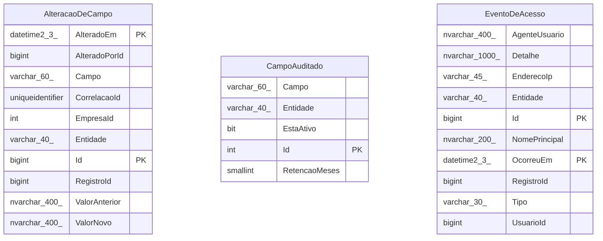
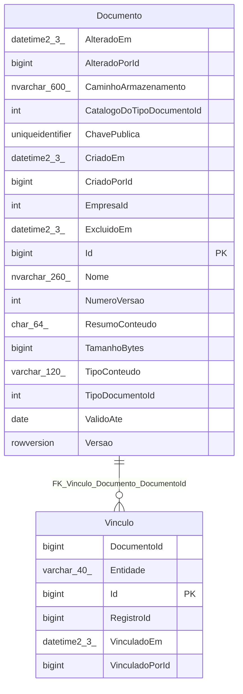
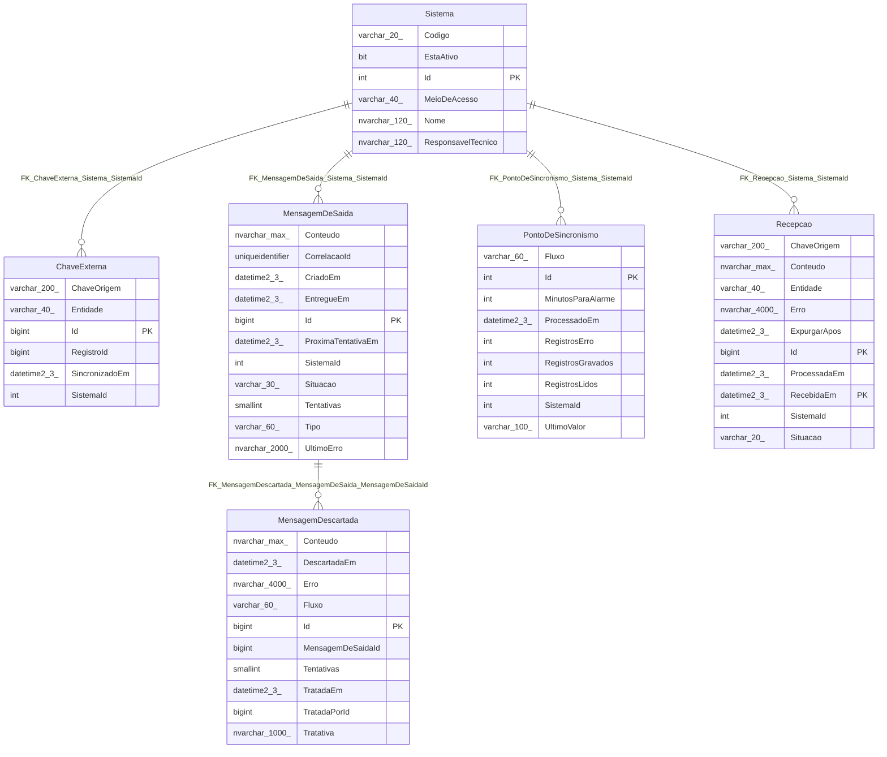
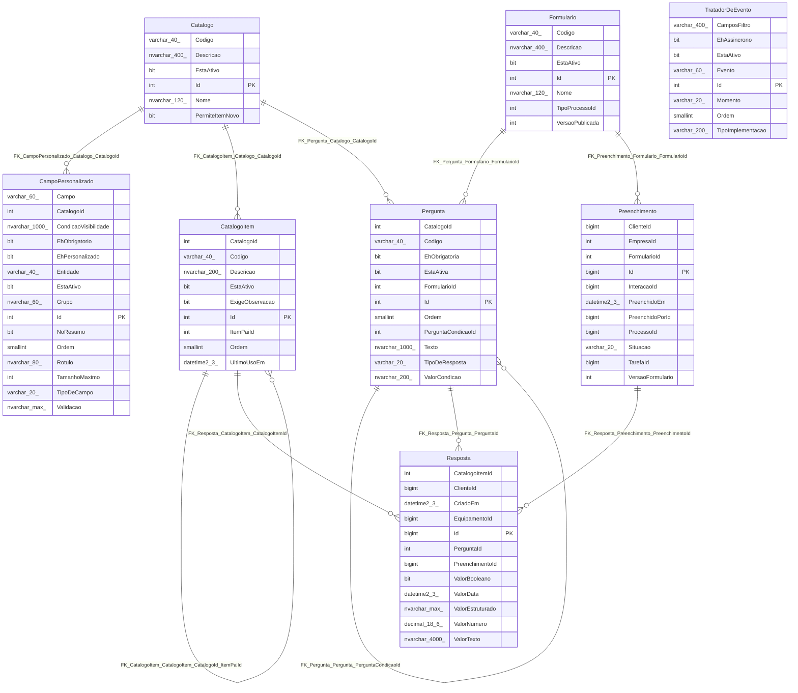
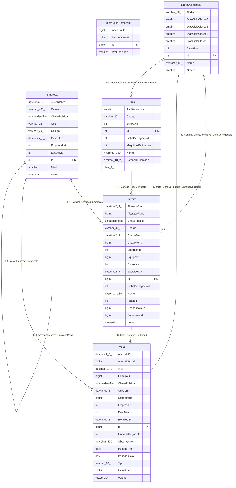
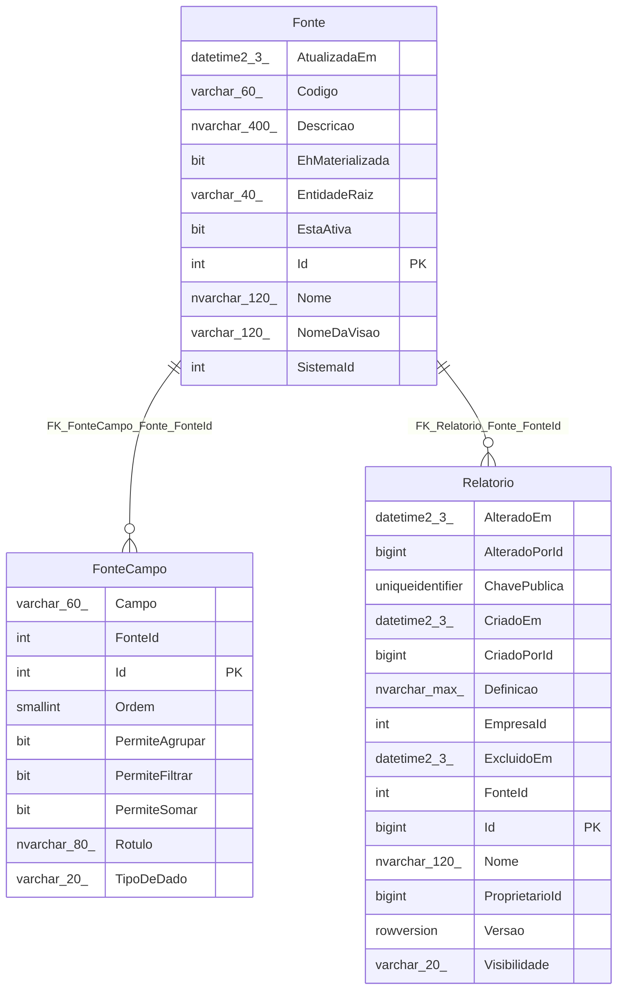
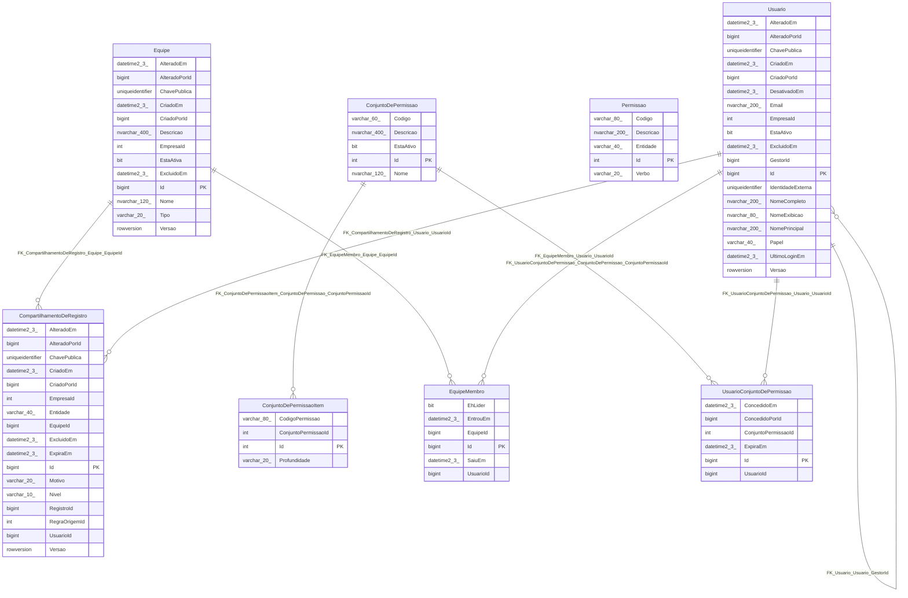

# ERD — CRM Tracbel

> Gerado automaticamente por `scripts/banco/gerar-dicionario-crm.ps1` a partir do
> modelo do EF Core. **Não edite à mão.** Um diagrama por schema — ver
> [14-PADRAO-DE-BANCO, seção 2](../projeto/14-PADRAO-DE-BANCO.md) sobre a divisão
> por schema.

## Schema `auditoria`

## Schema `comercial`

```mermaid
erDiagram
    Alerta {
        datetime2_3_ AlteradoEm
        bigint AlteradoPorId
        uniqueidentifier ChavePublica
        bigint ClienteId
        datetime2_3_ CriadoEm
        bigint CriadoPorId
        nvarchar_2000_ Detalhe
        int EmpresaId
        bit EstaAtivo
        datetime2_3_ ExcluidoEm
        bigint Id PK
        varchar_20_ Severidade
        nvarchar_200_ Titulo
        rowversion Versao
        date VigenteAte
        date VigenteDe
    }
    CanalContato {
        bigint ClienteId
        bigint ContatoId
        datetime2_3_ CriadoEm
        bit EhPrincipal
        bit EhValido
        int EmpresaId
        datetime2_3_ ExcluidoEm
        bigint Id PK
        nvarchar_40_ Rotulo
        varchar_20_ Tipo
        datetime2_3_ ValidadoEm
        nvarchar_200_ Valor
        varchar_200_ ValorNormalizado
    }
    Cliente {
        datetime2_3_ AlteradoEm
        bigint AlteradoPorId
        varchar_7_ AtividadeEconomica
        int CatalogoDaOrigemId
        int CatalogoDoMotivoInativacaoId
        uniqueidentifier ChavePublica
        bigint ClienteMatrizId
        datetime2_3_ CriadoEm
        bigint CriadoPorId
        varchar_14_ Documento
        int EmpresaId
        datetime2_3_ ExcluidoEm
        bigint Id PK
        varchar_20_ InscricaoEstadual
        int MotivoInativacaoId
        nvarchar_200_ NomeFantasia
        nvarchar_200_ NomeRazao
        int OrigemId
        bigint ProprietarioEquipeId
        bigint ProprietarioId
        varchar_20_ Situacao
        datetime2_3_ SituacaoDesde
        varchar_10_ TipoDePessoa
        rowversion Versao
    }
    ClienteCarteira {
        bigint CarteiraId
        char_1_ Classe
        bigint ClienteId
        datetime2_3_ DesvinculadoEm
        smallint DiasCicloContato
        bigint Id PK
        decimal_18_2_ PotencialAnual
        datetime2_3_ UltimaInteracaoEm
        datetime2_3_ VinculadoEm
        bigint VinculadoPorId
    }
    ClienteContato {
        int CatalogoDoPapelId
        bigint ClienteId
        bigint ContatoId
        bit EhPrincipal
        date EncerrouEm
        bigint Id PK
        date IniciouEm
        int PapelId
    }
    ConsentimentoComunicacao {
        varchar_20_ Canal
        bigint ClienteId
        bit Concedido
        bigint ContatoId
        datetime2_3_ CriadoEm
        datetime2_3_ DecididaEm
        int EmpresaId
        varchar_45_ EnderecoIp
        varchar_40_ Finalidade
        bigint Id PK
        varchar_60_ OrigemEvidencia
        nvarchar_400_ ReferenciaEvidencia
        bigint RegistradoPorId
    }
    Contato {
        datetime2_3_ AlteradoEm
        bigint AlteradoPorId
        nvarchar_80_ Cargo
        uniqueidentifier ChavePublica
        datetime2_3_ CriadoEm
        bigint CriadoPorId
        date DataNascimento
        varchar_14_ Documento
        int EmpresaId
        datetime2_3_ ExcluidoEm
        bigint Id PK
        nvarchar_120_ Nome
        bigint ProprietarioId
        nvarchar_120_ Sobrenome
        rowversion Versao
    }
    Endereco {
        datetime2_3_ AlteradoEm
        bigint AlteradoPorId
        nvarchar_120_ Bairro
        int CatalogoDaCulturaId
        char_8_ Cep
        uniqueidentifier ChavePublica
        bigint ClienteId
        nvarchar_120_ Complemento
        datetime2_3_ CriadoEm
        bigint CriadoPorId
        int CulturaId
        bit EhPrincipal
        int EmpresaId
        datetime2_3_ ExcluidoEm
        decimal_12_2_ Hectares
        bigint Id PK
        nvarchar_120_ Identificacao
        decimal_10_7_ Latitude
        nvarchar_200_ Logradouro
        decimal_10_7_ Longitude
        nvarchar_120_ Municipio
        varchar_20_ Numero
        varchar_20_ Tipo
        char_2_ Uf
        rowversion Versao
    }
    Lead {
        datetime2_3_ AlteradoEm
        bigint AlteradoPorId
        int CatalogoDaOrigemId
        int CatalogoDoMotivoDescarteId
        uniqueidentifier ChavePublica
        bigint ClienteGeradoId
        bigint ContatoGeradoId
        datetime2_3_ CriadoEm
        bigint CriadoPorId
        varchar_14_ Documento
        nvarchar_200_ Email
        int EmpresaId
        datetime2_3_ ExcluidoEm
        bigint Id PK
        nvarchar_400_ Interesse
        int LinhaNegocioId
        int MotivoDescarteId
        nvarchar_200_ NomeContato
        nvarchar_200_ NomeEmpresa
        int OrigemId
        nvarchar_max_ PayloadOriginal
        bigint ProcessoGeradoId
        bigint ProprietarioId
        datetime2_3_ QualificadoEm
        bigint QualificadoPorId
        varchar_20_ Situacao
        varchar_20_ Telefone
        rowversion Versao
    }
    Cliente ||--o{ Alerta : "FK_Alerta_Cliente_ClienteId"
    %% Alerta -> organizacao.Empresa (FK_Alerta_Empresa_EmpresaId) — schema diferente, ver diagrama de 'organizacao'
    Cliente ||--o{ CanalContato : "FK_CanalContato_Cliente_ClienteId"
    Contato ||--o{ CanalContato : "FK_CanalContato_Contato_ContatoId"
    %% CanalContato -> organizacao.Empresa (FK_CanalContato_Empresa_EmpresaId) — schema diferente, ver diagrama de 'organizacao'
    Cliente ||--o{ Cliente : "FK_Cliente_Cliente_ClienteMatrizId"
    %% Cliente -> organizacao.Empresa (FK_Cliente_Empresa_EmpresaId) — schema diferente, ver diagrama de 'organizacao'
    %% Cliente -> seguranca.Equipe (FK_Cliente_Equipe_ProprietarioEquipeId) — schema diferente, ver diagrama de 'seguranca'
    %% Cliente -> seguranca.Usuario (FK_Cliente_Usuario_ProprietarioId) — schema diferente, ver diagrama de 'seguranca'
    %% Cliente -> metadado.CatalogoItem (FK_Cliente_CatalogoItem_CatalogoDaOrigemId_OrigemId) — schema diferente, ver diagrama de 'metadado'
    %% Cliente -> metadado.CatalogoItem (FK_Cliente_CatalogoItem_CatalogoDoMotivoInativacaoId_MotivoInativacaoId) — schema diferente, ver diagrama de 'metadado'
    %% ClienteCarteira -> organizacao.Carteira (FK_ClienteCarteira_Carteira_CarteiraId) — schema diferente, ver diagrama de 'organizacao'
    Cliente ||--o{ ClienteCarteira : "FK_ClienteCarteira_Cliente_ClienteId"
    Cliente ||--o{ ClienteContato : "FK_ClienteContato_Cliente_ClienteId"
    Contato ||--o{ ClienteContato : "FK_ClienteContato_Contato_ContatoId"
    %% ClienteContato -> metadado.CatalogoItem (FK_ClienteContato_CatalogoItem_CatalogoDoPapelId_PapelId) — schema diferente, ver diagrama de 'metadado'
    Cliente ||--o{ ConsentimentoComunicacao : "FK_ConsentimentoComunicacao_Cliente_ClienteId"
    Contato ||--o{ ConsentimentoComunicacao : "FK_ConsentimentoComunicacao_Contato_ContatoId"
    %% ConsentimentoComunicacao -> organizacao.Empresa (FK_ConsentimentoComunicacao_Empresa_EmpresaId) — schema diferente, ver diagrama de 'organizacao'
    %% Contato -> organizacao.Empresa (FK_Contato_Empresa_EmpresaId) — schema diferente, ver diagrama de 'organizacao'
    %% Contato -> seguranca.Usuario (FK_Contato_Usuario_ProprietarioId) — schema diferente, ver diagrama de 'seguranca'
    Cliente ||--o{ Endereco : "FK_Endereco_Cliente_ClienteId"
    %% Endereco -> organizacao.Empresa (FK_Endereco_Empresa_EmpresaId) — schema diferente, ver diagrama de 'organizacao'
    %% Endereco -> metadado.CatalogoItem (FK_Endereco_CatalogoItem_CatalogoDaCulturaId_CulturaId) — schema diferente, ver diagrama de 'metadado'
    Cliente ||--o{ Lead : "FK_Lead_Cliente_ClienteGeradoId"
    Contato ||--o{ Lead : "FK_Lead_Contato_ContatoGeradoId"
    %% Lead -> organizacao.Empresa (FK_Lead_Empresa_EmpresaId) — schema diferente, ver diagrama de 'organizacao'
    %% Lead -> organizacao.LinhaDeNegocio (FK_Lead_LinhaDeNegocio_LinhaNegocioId) — schema diferente, ver diagrama de 'organizacao'
    %% Lead -> processo.Processo (FK_Lead_Processo_ProcessoGeradoId) — schema diferente, ver diagrama de 'processo'
    %% Lead -> seguranca.Usuario (FK_Lead_Usuario_ProprietarioId) — schema diferente, ver diagrama de 'seguranca'
    %% Lead -> seguranca.Usuario (FK_Lead_Usuario_QualificadoPorId) — schema diferente, ver diagrama de 'seguranca'
    %% Lead -> metadado.CatalogoItem (FK_Lead_CatalogoItem_CatalogoDaOrigemId_OrigemId) — schema diferente, ver diagrama de 'metadado'
    %% Lead -> metadado.CatalogoItem (FK_Lead_CatalogoItem_CatalogoDoMotivoDescarteId_MotivoDescarteId) — schema diferente, ver diagrama de 'metadado'
```

## Schema `documento`

## Schema `frota`

```mermaid
erDiagram
    Equipamento {
        datetime2_3_ AlteradoEm
        bigint AlteradoPorId
        smallint AnoFabricacao
        smallint AnoModelo
        varchar_40_ Chassi
        uniqueidentifier ChavePublica
        bigint ClienteId
        datetime2_3_ CriadoEm
        bigint CriadoPorId
        int EmpresaId
        bigint EnderecoId
        bigint EquipamentoPaiId
        bigint EquipamentoSubstitutoId
        datetime2_3_ ExcluidoEm
        date GarantiaAte
        decimal_12_2_ HorimetroAtual
        datetime2_3_ HorimetroAtualizadoEm
        bigint Id PK
        nvarchar_200_ LocalizacaoDescrita
        int ModeloId
        varchar_40_ NumeroSerie
        varchar_20_ Origem
        varchar_10_ Placa
        varchar_20_ Situacao
        date VendidoEm
        rowversion Versao
    }
    Familia {
        varchar_20_ Codigo
        bit EstaAtiva
        int Id PK
        int MarcaId
        nvarchar_80_ Nome
    }
    LeituraDeHorimetro {
        datetime2_3_ CriadoEm
        bigint EquipamentoId
        varchar_40_ Fonte
        decimal_12_2_ Horas
        bigint Id PK
        datetime2_3_ LidaEm
        bigint RegistradoPorId
    }
    Marca {
        varchar_20_ Codigo
        bit EhRepresentada
        bit EstaAtiva
        int Id PK
        nvarchar_80_ Nome
    }
    Modelo {
        varchar_40_ Codigo
        bit EstaAtivo
        int FamiliaId
        int Id PK
        int IntervaloManutencaoHoras
        nvarchar_120_ Nome
        smallint PotenciaCv
    }
    %% Equipamento -> comercial.Cliente (FK_Equipamento_Cliente_ClienteId) — schema diferente, ver diagrama de 'comercial'
    %% Equipamento -> organizacao.Empresa (FK_Equipamento_Empresa_EmpresaId) — schema diferente, ver diagrama de 'organizacao'
    %% Equipamento -> comercial.Endereco (FK_Equipamento_Endereco_EnderecoId) — schema diferente, ver diagrama de 'comercial'
    Equipamento ||--o{ Equipamento : "FK_Equipamento_Equipamento_EquipamentoPaiId"
    Equipamento ||--o{ Equipamento : "FK_Equipamento_Equipamento_EquipamentoSubstitutoId"
    Modelo ||--o{ Equipamento : "FK_Equipamento_Modelo_ModeloId"
    Marca ||--o{ Familia : "FK_Familia_Marca_MarcaId"
    Equipamento ||--o{ LeituraDeHorimetro : "FK_LeituraDeHorimetro_Equipamento_EquipamentoId"
    %% LeituraDeHorimetro -> seguranca.Usuario (FK_LeituraDeHorimetro_Usuario_RegistradoPorId) — schema diferente, ver diagrama de 'seguranca'
    Familia ||--o{ Modelo : "FK_Modelo_Familia_FamiliaId"
```

## Schema `integracao`

## Schema `metadado`

## Schema `organizacao`

## Schema `processo`

```mermaid
erDiagram
    Fase {
        varchar_40_ Codigo
        bit EhFinal
        bit ExigeCamposObrigatorios
        int Id PK
        nvarchar_60_ Marco
        nvarchar_80_ Nome
        smallint Ordem
        smallint ProbabilidadePercentual
        int TipoProcessoId
    }
    Interacao {
        nvarchar_200_ Assunto
        uniqueidentifier ChavePublica
        bigint ClienteId
        bigint ContatoId
        datetime2_3_ CriadoEm
        nvarchar_4000_ Detalhe
        int DuracaoMinutos
        int EmpresaId
        bigint Id PK
        decimal_10_7_ Latitude
        bigint LeadId
        decimal_10_7_ Longitude
        varchar_12_ Natureza
        datetime2_3_ OcorridaEm
        bigint ProcessoId
        bigint RegistradoPorId
        nvarchar_200_ ResultadoComplemento
        int ResultadoId
        bigint TarefaId
        int TipoTarefaId
    }
    InteracaoParticipante {
        bigint ContatoId
        bigint Id PK
        bigint InteracaoId
        nvarchar_200_ NomeExterno
        varchar_20_ Papel
        bigint UsuarioId
    }
    ItemDeProposta {
        datetime2_3_ AlteradoEm
        bigint AlteradoPorId
        int CatalogoDaCondicaoPagamentoId
        uniqueidentifier ChavePublica
        int CondicaoPagamentoId
        datetime2_3_ CriadoEm
        bigint CriadoPorId
        decimal_5_2_ DescontoPercentual
        nvarchar_400_ Descricao
        int EmpresaId
        bigint EquipamentoId
        datetime2_3_ ExcluidoEm
        bigint Id PK
        int ModeloId
        smallint Ordem
        decimal_18_2_ PrecoUnitario
        bigint ProcessoId
        decimal_12_3_ Quantidade
        decimal_18_2_ ValorTotal
        rowversion Versao
    }
    MotivoDePerda {
        varchar_20_ Categoria
        varchar_40_ Codigo
        bit EstaAtivo
        bit ExigeConcorrente
        bit ExigeObservacao
        int Id PK
        nvarchar_120_ Nome
        smallint Ordem
    }
    PassagemDeFase {
        datetime2_3_ EntrouEm
        bigint EntrouPorId
        int FaseId
        decimal_10_2_ HorasUteis
        bigint Id PK
        bigint InteracaoOrigemId
        int Ordem
        bigint ProcessoId
        int RegraOrigemId
        datetime2_3_ SaiuEm
    }
    Processo {
        datetime2_3_ AlteradoEm
        bigint AlteradoPorId
        bigint CarteiraId
        int CatalogoDoConcorrenteId
        uniqueidentifier ChavePublica
        bigint ClienteId
        datetime2_3_ ConcluidoEm
        int ConcorrenteId
        bigint ContatoId
        datetime2_3_ CriadoEm
        bigint CriadoPorId
        nvarchar_4000_ Descricao
        int EmpresaId
        datetime2_3_ ExcluidoEm
        datetime2_3_ FaseDesde
        int FaseId
        bigint Id PK
        int MotivoDePerdaId
        bigint Numero
        nvarchar_1000_ ObservacaoDaPerda
        date PrevisaoConclusao
        date PrevisaoConclusaoOriginal
        bigint ProprietarioEquipeId
        bigint ProprietarioId
        decimal_12_3_ Quantidade
        varchar_20_ Situacao
        datetime2_3_ SituacaoDesde
        int TipoProcessoId
        nvarchar_200_ Titulo
        decimal_18_2_ ValorEstimado
        decimal_18_2_ ValorFinal
        rowversion Versao
    }
    Regra {
        datetime2_3_ AlteradoEm
        bigint AlteradoPorId
        varchar_60_ Codigo
        nvarchar_2000_ Condicao
        datetime2_3_ CriadoEm
        bigint CriadoPorId
        nvarchar_1000_ Descricao
        varchar_40_ Efeito
        int EfeitoFaseId
        nvarchar_max_ EfeitoParametros
        int EfeitoTipoTarefaId
        bit EhCritica
        bit EstaAtiva
        varchar_40_ Evento
        nvarchar_400_ ExpressaoDestinatario
        int Id PK
        nvarchar_200_ Nome
        smallint Ordem
        int PrazoDiasUteis
        int ResultadoId
        int TipoProcessoId
        int TipoTarefaId
    }
    RegraExecucao {
        uniqueidentifier CorrelacaoId
        bigint DestinatarioResolvidoId
        int DuracaoMs
        varchar_40_ Evento
        datetime2_3_ ExecutadoEm PK
        bigint Id PK
        bigint InteracaoId
        nvarchar_1000_ Motivo
        bigint ProcessoId
        int RegraId
        varchar_20_ Resultado
        bigint TarefaCriadaId
        bigint TarefaId
    }
    Resultado {
        varchar_20_ Classe
        varchar_40_ Codigo
        bit EstaAtivo
        bit ExigeJustificativa
        int FaseDestinoId
        int Id PK
        nvarchar_120_ Nome
        int TipoTarefaId
        datetime2_3_ UltimoUsoEm
    }
    Tarefa {
        datetime2_3_ AgendadaPara
        datetime2_3_ AlteradoEm
        bigint AlteradoPorId
        nvarchar_200_ Assunto
        uniqueidentifier ChavePublica
        bigint ClienteId
        datetime2_3_ ConcluidaEm
        bigint ConcluidaPorId
        bigint ContatoId
        int CriadaPorRegraId
        datetime2_3_ CriadoEm
        bigint CriadoPorId
        nvarchar_4000_ Detalhe
        int EmpresaId
        datetime2_3_ ExcluidoEm
        bigint Id PK
        bigint InteracaoConclusaoId
        bigint InteracaoOrigemId
        varchar_20_ OrigemAtribuicao
        datetime2_3_ PrazoLimite
        smallint Prioridade
        bigint ProcessoId
        bigint ResponsavelEquipeId
        bigint ResponsavelId
        int ResultadoId
        varchar_20_ Situacao
        int TipoTarefaId
        rowversion Versao
    }
    TipoProcesso {
        varchar_40_ Codigo
        bit EstaAtivo
        int Id PK
        int LinhaDeNegocioId
        nvarchar_120_ Nome
        int Versao
    }
    TipoTarefa {
        varchar_20_ Categoria
        varchar_40_ Codigo
        bit ContaParaCobertura
        varchar_7_ Cor
        bit EhAprovacao
        bit EstaAtivo
        bit ExigeGeorreferencia
        int FormularioId
        int Id PK
        nvarchar_120_ Nome
        smallint PrazoDiasUteis
        int TipoProcessoId
        datetime2_3_ UltimoUsoEm
    }
    TipoProcesso ||--o{ Fase : "FK_Fase_TipoProcesso_TipoProcessoId"
    %% Interacao -> comercial.Cliente (FK_Interacao_Cliente_ClienteId) — schema diferente, ver diagrama de 'comercial'
    %% Interacao -> comercial.Contato (FK_Interacao_Contato_ContatoId) — schema diferente, ver diagrama de 'comercial'
    %% Interacao -> organizacao.Empresa (FK_Interacao_Empresa_EmpresaId) — schema diferente, ver diagrama de 'organizacao'
    %% Interacao -> comercial.Lead (FK_Interacao_Lead_LeadId) — schema diferente, ver diagrama de 'comercial'
    Processo ||--o{ Interacao : "FK_Interacao_Processo_ProcessoId"
    %% Interacao -> seguranca.Usuario (FK_Interacao_Usuario_RegistradoPorId) — schema diferente, ver diagrama de 'seguranca'
    Resultado ||--o{ Interacao : "FK_Interacao_Resultado_ResultadoId"
    Tarefa ||--o{ Interacao : "FK_Interacao_Tarefa_TarefaId"
    TipoTarefa ||--o{ Interacao : "FK_Interacao_TipoTarefa_TipoTarefaId"
    %% InteracaoParticipante -> comercial.Contato (FK_InteracaoParticipante_Contato_ContatoId) — schema diferente, ver diagrama de 'comercial'
    Interacao ||--o{ InteracaoParticipante : "FK_InteracaoParticipante_Interacao_InteracaoId"
    %% InteracaoParticipante -> seguranca.Usuario (FK_InteracaoParticipante_Usuario_UsuarioId) — schema diferente, ver diagrama de 'seguranca'
    %% ItemDeProposta -> organizacao.Empresa (FK_ItemDeProposta_Empresa_EmpresaId) — schema diferente, ver diagrama de 'organizacao'
    %% ItemDeProposta -> frota.Equipamento (FK_ItemDeProposta_Equipamento_EquipamentoId) — schema diferente, ver diagrama de 'frota'
    %% ItemDeProposta -> frota.Modelo (FK_ItemDeProposta_Modelo_ModeloId) — schema diferente, ver diagrama de 'frota'
    Processo ||--o{ ItemDeProposta : "FK_ItemDeProposta_Processo_ProcessoId"
    %% ItemDeProposta -> metadado.CatalogoItem (FK_ItemDeProposta_CatalogoItem_CatalogoDaCondicaoPagamentoId_CondicaoPagamentoId) — schema diferente, ver diagrama de 'metadado'
    %% PassagemDeFase -> seguranca.Usuario (FK_PassagemDeFase_Usuario_EntrouPorId) — schema diferente, ver diagrama de 'seguranca'
    Fase ||--o{ PassagemDeFase : "FK_PassagemDeFase_Fase_FaseId"
    Interacao ||--o{ PassagemDeFase : "FK_PassagemDeFase_Interacao_InteracaoOrigemId"
    Processo ||--o{ PassagemDeFase : "FK_PassagemDeFase_Processo_ProcessoId"
    Regra ||--o{ PassagemDeFase : "FK_PassagemDeFase_Regra_RegraOrigemId"
    %% Processo -> organizacao.Carteira (FK_Processo_Carteira_CarteiraId) — schema diferente, ver diagrama de 'organizacao'
    %% Processo -> comercial.Cliente (FK_Processo_Cliente_ClienteId) — schema diferente, ver diagrama de 'comercial'
    %% Processo -> comercial.Contato (FK_Processo_Contato_ContatoId) — schema diferente, ver diagrama de 'comercial'
    %% Processo -> organizacao.Empresa (FK_Processo_Empresa_EmpresaId) — schema diferente, ver diagrama de 'organizacao'
    Fase ||--o{ Processo : "FK_Processo_Fase_FaseId"
    MotivoDePerda ||--o{ Processo : "FK_Processo_MotivoDePerda_MotivoDePerdaId"
    %% Processo -> seguranca.Equipe (FK_Processo_Equipe_ProprietarioEquipeId) — schema diferente, ver diagrama de 'seguranca'
    %% Processo -> seguranca.Usuario (FK_Processo_Usuario_ProprietarioId) — schema diferente, ver diagrama de 'seguranca'
    TipoProcesso ||--o{ Processo : "FK_Processo_TipoProcesso_TipoProcessoId"
    %% Processo -> metadado.CatalogoItem (FK_Processo_CatalogoItem_CatalogoDoConcorrenteId_ConcorrenteId) — schema diferente, ver diagrama de 'metadado'
    Fase ||--o{ Regra : "FK_Regra_Fase_EfeitoFaseId"
    TipoTarefa ||--o{ Regra : "FK_Regra_TipoTarefa_EfeitoTipoTarefaId"
    Resultado ||--o{ Regra : "FK_Regra_Resultado_ResultadoId"
    TipoProcesso ||--o{ Regra : "FK_Regra_TipoProcesso_TipoProcessoId"
    TipoTarefa ||--o{ Regra : "FK_Regra_TipoTarefa_TipoTarefaId"
    %% RegraExecucao -> seguranca.Usuario (FK_RegraExecucao_Usuario_DestinatarioResolvidoId) — schema diferente, ver diagrama de 'seguranca'
    Interacao ||--o{ RegraExecucao : "FK_RegraExecucao_Interacao_InteracaoId"
    Processo ||--o{ RegraExecucao : "FK_RegraExecucao_Processo_ProcessoId"
    Regra ||--o{ RegraExecucao : "FK_RegraExecucao_Regra_RegraId"
    Tarefa ||--o{ RegraExecucao : "FK_RegraExecucao_Tarefa_TarefaCriadaId"
    Tarefa ||--o{ RegraExecucao : "FK_RegraExecucao_Tarefa_TarefaId"
    Fase ||--o{ Resultado : "FK_Resultado_Fase_FaseDestinoId"
    TipoTarefa ||--o{ Resultado : "FK_Resultado_TipoTarefa_TipoTarefaId"
    %% Tarefa -> comercial.Cliente (FK_Tarefa_Cliente_ClienteId) — schema diferente, ver diagrama de 'comercial'
    %% Tarefa -> seguranca.Usuario (FK_Tarefa_Usuario_ConcluidaPorId) — schema diferente, ver diagrama de 'seguranca'
    %% Tarefa -> comercial.Contato (FK_Tarefa_Contato_ContatoId) — schema diferente, ver diagrama de 'comercial'
    Regra ||--o{ Tarefa : "FK_Tarefa_Regra_CriadaPorRegraId"
    %% Tarefa -> organizacao.Empresa (FK_Tarefa_Empresa_EmpresaId) — schema diferente, ver diagrama de 'organizacao'
    Interacao ||--o{ Tarefa : "FK_Tarefa_Interacao_InteracaoConclusaoId"
    Interacao ||--o{ Tarefa : "FK_Tarefa_Interacao_InteracaoOrigemId"
    Processo ||--o{ Tarefa : "FK_Tarefa_Processo_ProcessoId"
    %% Tarefa -> seguranca.Equipe (FK_Tarefa_Equipe_ResponsavelEquipeId) — schema diferente, ver diagrama de 'seguranca'
    %% Tarefa -> seguranca.Usuario (FK_Tarefa_Usuario_ResponsavelId) — schema diferente, ver diagrama de 'seguranca'
    Resultado ||--o{ Tarefa : "FK_Tarefa_Resultado_ResultadoId"
    TipoTarefa ||--o{ Tarefa : "FK_Tarefa_TipoTarefa_TipoTarefaId"
    %% TipoProcesso -> organizacao.LinhaDeNegocio (FK_TipoProcesso_LinhaDeNegocio_LinhaDeNegocioId) — schema diferente, ver diagrama de 'organizacao'
    %% TipoTarefa -> metadado.Formulario (FK_TipoTarefa_Formulario_FormularioId) — schema diferente, ver diagrama de 'metadado'
    TipoProcesso ||--o{ TipoTarefa : "FK_TipoTarefa_TipoProcesso_TipoProcessoId"
```

## Schema `relatorio`

## Schema `seguranca`

