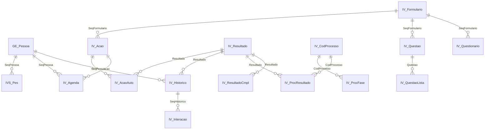
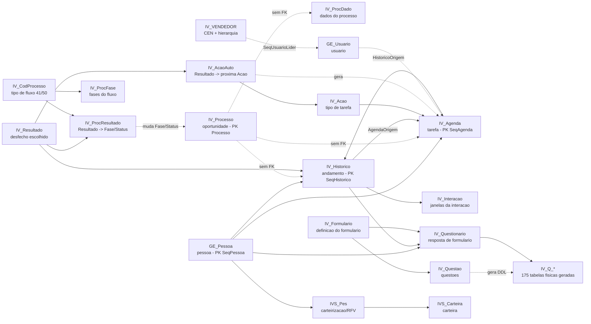
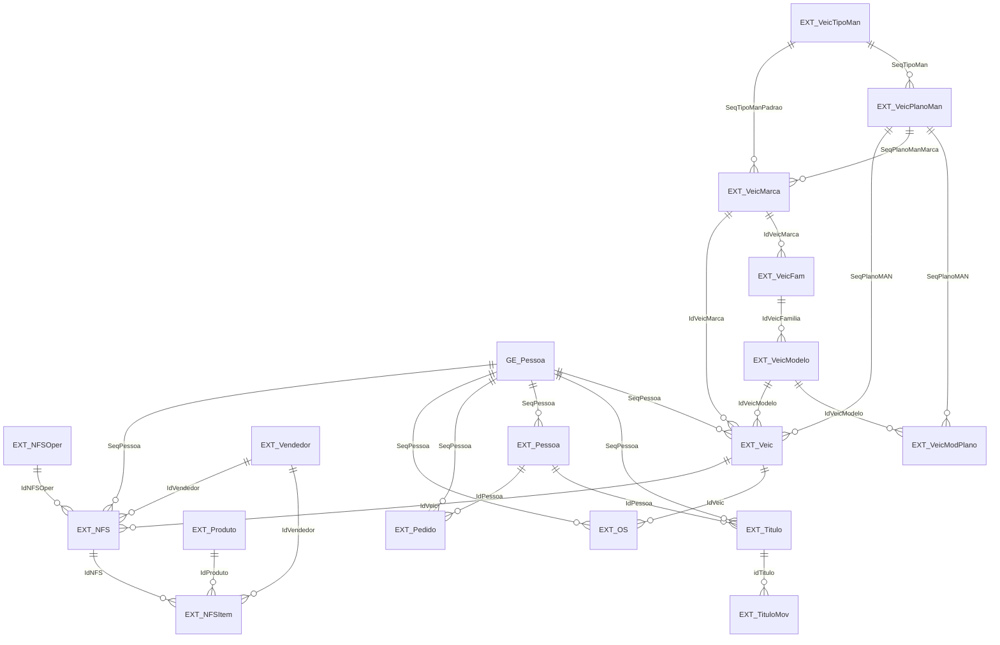
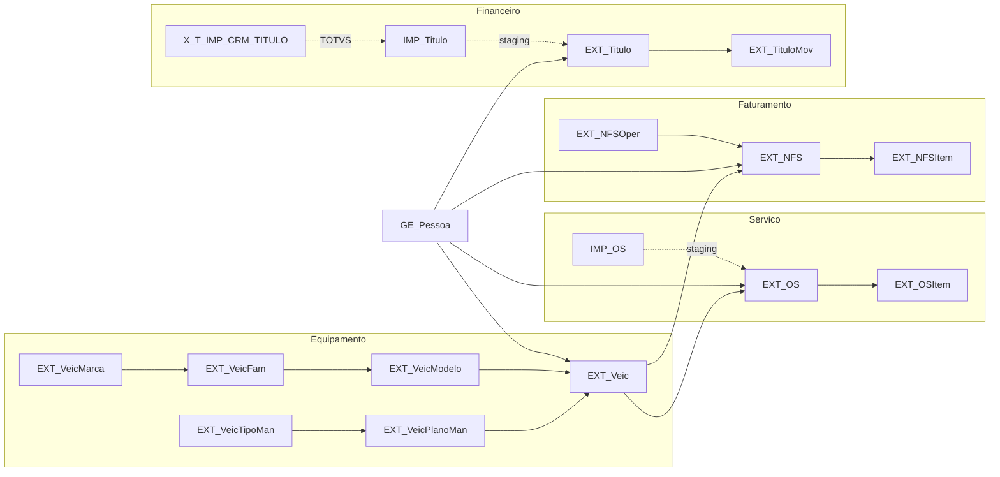
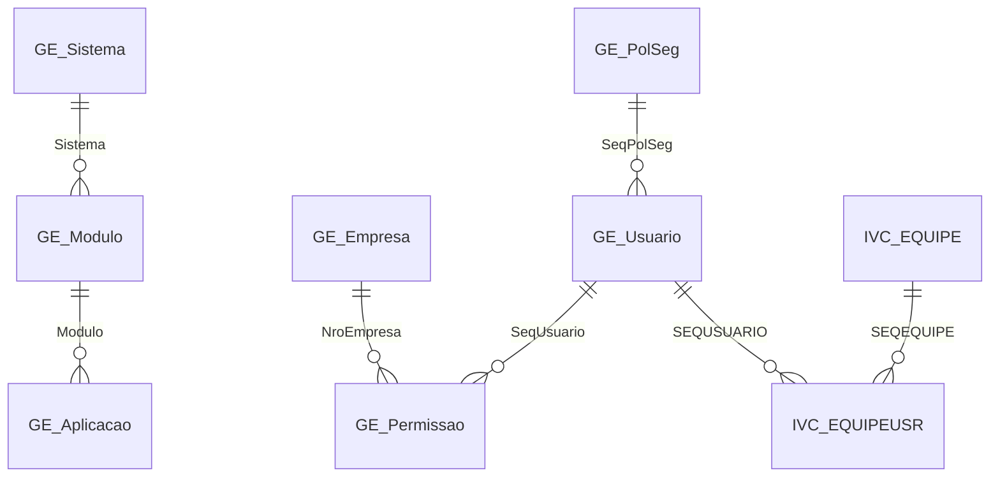
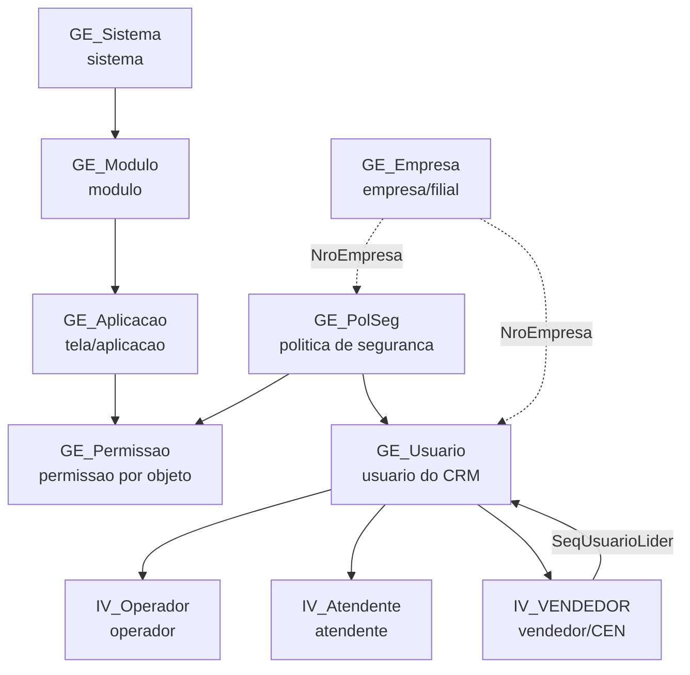

# Grafo de chaves estrangeiras - o nucleo do modelo

> Snapshot de 03/06/2026. Gerado por [`gerar-dicionario.py`](gerar-dicionario.py) em 02/09/2026 23:50. **Nao editar a mao.**

Nos diagramas `erDiagram`, as arestas sao **apenas FKs realmente declaradas** em `schema/fks.csv`. Boa parte das ligacoes do Vortice e feita **por convencao de nome, sem FK** - notavelmente `IV_Agenda.Processo`, `IV_Historico.Processo` e `IV_ProcDado.Processo`, que **nao** tem FK para `IV_Processo`. Essas ligacoes aparecem como linha tracejada nos diagramas `graph` que acompanham cada bloco.

[Voltar ao indice](00-INDICE.md)

---

## 1. Nucleo CRM/BPM: pessoa -> processo -> agenda -> historico -> questionario

### 1a. FKs declaradas no nucleo

Cada linha e uma FK real, no formato `destino ||--o{ origem : "coluna_origem"`.

**Sem FK declarada dentro deste recorte** (ligam-se por convencao de nome, nao por integridade referencial): `IV_Processo`, `IV_ProcDado`, `IV_Ciencia`, `IV_HistLink`, `IV_ProcDocto`, `DMN_Doc`, `IVS_Carteira`, `IV_VENDEDOR`, `GE_Usuario`

_16 nos com FK, 16 arestas._

### 1b. O fluxo logico (inclui as ligacoes SEM FK)

Linha cheia = FK declarada. Linha tracejada = ligacao por convencao de nome, **sem** integridade referencial no banco (documentado em `04-nucleo-crm-bpm...md` e em `REGRAS-DE-NEGOCIO.md` 1.2 e 1.3).

> `IV_Agenda.CodProcesso` e `IV_Historico.CodProcesso` guardam o **tipo de fluxo** (41 ou 50), nao o numero do processo - que fica em `Processo`. `IV_Processo` **nao tem** coluna `CodProcesso` (`REGRAS-DE-NEGOCIO.md` 1.3).

---

## 2. ERP: equipamentos, notas fiscais, ordens de servico e titulos

### 2a. FKs declaradas no bloco EXT_/IMP_

Dados espelhados do TOTVS/JDE. `SeqPessoa` liga tudo de volta a `GE_Pessoa`.

**Sem FK declarada dentro deste recorte** (ligam-se por convencao de nome, nao por integridade referencial): `IMP_OS`, `IMP_Titulo`

_18 nos com FK, 26 arestas._

### 2b. As quatro arvores do ERP

> Freshness: `EXT_NFS` e `X_TOTVS_CRM_FATURAMENTO` param em **11/04/2025** (`SCHEMA_MAP.md`). Confirmar `MAX(<coluna_data>)` antes de afirmar tendencia recente.

---

## 3. Seguranca, usuarios e multiempresa

### 3a. FKs declaradas no bloco GE_ de seguranca

Usuarios, politicas de seguranca, permissoes e o cadastro de aplicacoes/telas.

**Sem FK declarada dentro deste recorte** (ligam-se por convencao de nome, nao por integridade referencial): `GE_PolSegItem`, `IV_Operador`, `IV_Atendente`

_9 nos com FK, 7 arestas._

### 3b. As camadas de autorizacao

> Criar um usuario toca ~5-7 tabelas (`GE_Usuario`, `IVC_EQUIPEUSR`, `IV_Operador`, `IV_Atendente`/`IVC_ATENDENTE`, `IV_VENDEDOR`, `GE_PolSeg*`) e **nao tem API** (`REGRAS-DE-NEGOCIO.md` 2.11).

---

_Os diagramas `erDiagram` sao gerados a partir de `schema/fks.csv`. As arestas tracejadas dos diagramas `graph` vem de regras documentadas em `SCHEMA_MAP.md` e `REGRAS-DE-NEGOCIO.md` e **nao existem como constraint no banco**._
