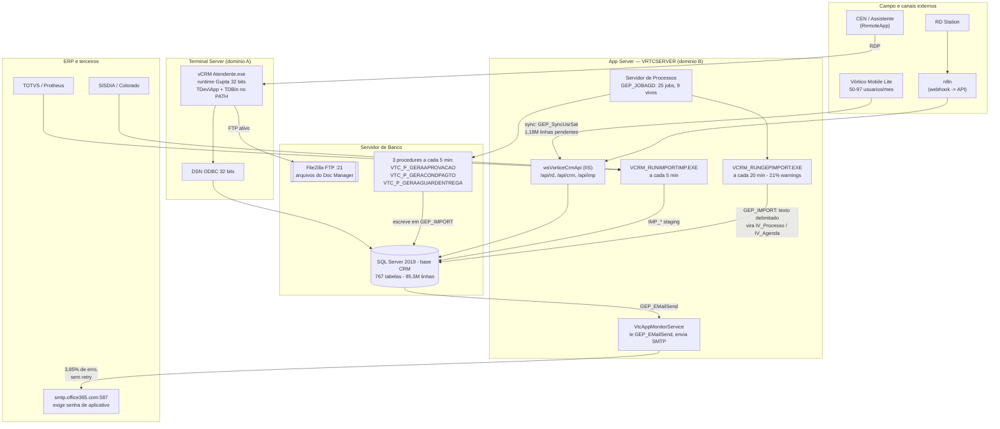

# Vórtice CRM ponta a ponta — o ciclo de vida real de Pessoa → Processo → Agenda → Histórico

> **Documento 16 da pesquisa** · Versão 1.0 · 02/09/2026
> Levantado no banco de produção `CRM` em modo **read-only**, com a conta de leitura.
> **Toda afirmação numérica tem, logo abaixo, a query que a produziu.** Data de corte de todas as
> medições: **02/09/2026** (o que aparece como "2026" é o ano corrente, com 8 meses fechados).

---

## 0. Como ler este documento

### 0.1 O que ele é

Os documentos anteriores descrevem o Vórtice **por camada**: o núcleo BPM
([04](04-nucleo-crm-bpm-do-vortice-prefixo-iv-377-tabelas-motor-de-wo.md)), as integrações
([02](02-integracoes-e-dados-de-erp-no-vortice-crm-ext-imp-x-jde-gep-.md)), pessoas e segmentação
([06](06-vortice-crm-pessoas-segmentacao-financiamento-e-documentos-g.md)), segurança
([07](07-usuarios-permissoes-e-multiempresa-no-vortice-crm-prefixos-g.md)), relatórios
([09](09-relatorios-views-e-bi-do-vortice-crm-411-views-motor-qvw-ge-.md)) e o catálogo do produto
([03](03-catalogo-de-funcionalidades-do-produto-vortice-vortico-crm-o.md)).

Este documento corta na direção oposta: **por etapa do trabalho de um dia**. Segue uma pessoa desde
o instante em que ela aparece no banco até a nota fiscal, a ordem de serviço e a cobrança — e, em
cada etapa, mostra **quem faz, em qual tela, o que é gravado em qual coluna, qual catálogo governa,
o que dispara em seguida, e o que quebra**.

Ele não repete os documentos anteriores. Onde eles param, este continua; onde eles erram, este
corrige — e diz explicitamente que está corrigindo.

### 0.2 O que ele corrige nos documentos anteriores

| # | O que estava registrado | O que a medição de 02/09/2026 mostra | Onde |
|---|---|---|---|
| C1 | "`sys.sql_modules.definition` vem NULL com a conta de leitura" (REGRAS-DE-NEGOCIO 2.8) | **O código-fonte das procedures é legível agora.** 85 procedures e 51 funções foram lidas na íntegra para este documento | §8.3 |
| C2 | "Procedures / functions: **6 / 1**" (SCHEMA_MAP §1) | **85 procedures, 51 funções, 411 views, 1 trigger** | §8.3 |
| C3 | "155 de 239 processos em Fase = Entrega sem agenda pendente" (REGRAS-DE-NEGOCIO 2.3) | **Não é mais verdade.** Hoje o fluxo 50 tem **2** processos abertos sem tarefa pendente, em 13.528 | §7.2 |
| C4 | "As 894 e 814 continuam gerando normal — são só as regras 899/900" (REGRAS-DE-NEGOCIO 2.3) | **A falha rotaciona entre regras.** Em jan e fev/2026 a ação 900 gerou **zero**; a 894 gerou zero em jan, 145 em fev, zero em abr; a 905 só começou a gerar em mai/2026 | §5.6 |
| C5 | "116 CPFs repetidos entre clientes distintos" (DIAGNÓSTICO 9.4) | **132 documentos repetidos** (CPF + CNPJ), 264 pessoas, nenhum grupo com mais de 2 | §1.4 |
| C6 | "Não existe join documento↔oportunidade" (DIAGNÓSTICO §4) | Existe uma tabela de vínculo — `IV_ProcLink`, 602.150 linhas — mas ela liga a NF a um **processo sintético do tipo 3 "Nota Fiscal"**, criado pelo importador, e **nunca** ao processo de venda. O diagnóstico está certo no efeito e agora tem o mecanismo | §7.4 |
| C7 | "O motor RFV está 100% morto" (DIAGNÓSTICO 9.7) | Confirmado e agravado: `Rec`, `Freq`, `Vlr`, `Pto` e `Score` têm **um único valor distinto (zero)** em 139.065 linhas, e `DtaCalc` é nula em todas. Mas `Potencial` **é** usado — com o domínio poluído | §2.4 |
| C8 | Agenda "presa" tratada como caso pontual (REGRAS-DE-NEGOCIO 2.5) | É estrutural: **15.655 das 35.662 tarefas pendentes (44%)** estão em usuários que nunca logaram ou não logam há mais de um ano | §4.5 |

### 0.3 Convenções

- Severidade: 🔴 crítico · 🟡 relevante · 🟢 registrado · ✅ acerto que deve ser copiado.
- Toda query roda com `WITH (NOLOCK)` e filtro de data nas tabelas grandes.
- "2026" quando aplicado a volume significa `>= '2026-01-01'`, isto é, **8 meses**, não 12.
- Ação/Resultado aparecem como `código Descrição` — os códigos são os reais (`IV_Acao.Acao`,
  `IV_Resultado.Resultado`).

### 0.4 O mapa em uma figura

```
GE_Pessoa ──carteiriza──▶ IVS_Pes ──▶ IV_Processo + IV_ProcDado
                                            │
                                            ▼
                          IV_Agenda (a TAREFA de alguém)
                                            │  usuário dá andamento com um RESULTADO
                                            ▼
                          IV_Historico (o fato consumado, imutável)
                                            │
                          ┌─────────────────┴─────────────────┐
                          ▼                                   ▼
                 IV_ProcResultado                      IV_AcaoAuto
              (muda Fase/Status do                (cria a PRÓXIMA agenda,
                    processo)                        e decide p/ QUEM)
```

Essas cinco entidades — Pessoa, Processo, Agenda, Histórico, Ação/Resultado — e as **duas** tabelas
de parametrização independentes (`IV_ProcResultado` × `IV_AcaoAuto`) são o modelo mental inteiro.
Quem entende isso entende o Vórtice. O resto deste documento é o detalhe de cada seta.

---

## 1. Entrada da pessoa — como um cliente aparece no banco

### 1.1 Quem faz, onde

| Canal | Quem opera | Tela / rota | Grava com `Origem` |
|---|---|---|---|
| Digitação no desktop | CEN, assistente, ADM | cadastro de pessoa, módulo Atendente (`CRM_M001`) | `CRM-Manual` |
| Mobile | CEN em campo | Vórtico Mobile Lite (`CRM_M052`) | `MOBILELITE` |
| Lead de marketing | ninguém — automático | RD Station → webhook → n8n → `POST /api/rd/v2/lead/{empresa}/{formulario}/{propriedade}` | `RD` |
| Carga de ERP | job de importação | `IMP_*` → `EXT_Pessoa` → `GE_Pessoa` | `COLORADO`, `SISDIA`, `Protheus`, `ERP`, `VTC_CRT` |
| Migração de base adquirida | uma vez, em dez/2024 | carga direta | `INTEGRAÇÃONOROESTE` |
| Portal agro | integração | webhook | `EEMOVEL` |
| App antigo | descontinuado | JUNO (`CRM_M051`) | `JUNO` |

### 1.2 O volume real, por ano e por origem

A base tem **119.345 pessoas**. A distribuição por ano de inclusão mostra que o cadastro **não
cresce organicamente** — ele cresce em saltos, quando alguém carrega uma base inteira:

| Ano | Pessoas | Observação |
|---|---:|---|
| (sem data) | 2.152 | anteriores ao controle de inclusão |
| 2011 | 9.873 | implantação |
| 2012 | 26.017 | carga inicial |
| 2015 | 21.251 | carga |
| 2017 | 9.780 | |
| 2018 | 9.625 | |
| 2019–2023 | 1.018 a 1.769/ano | **o cadastro orgânico real: ~1,3 mil/ano** |
| **2024** | **27.258** | carga `INTEGRAÇÃONOROESTE` (dez/2024) |
| 2025 | 2.842 | |
| **2026** (8 meses) | **2.510** | dos quais **852 pelo `VRTCSERVER`** |

```sql
SELECT YEAR(DtaInclusao) AS ano, COUNT(*) AS pessoas,
       SUM(CASE WHEN UsuInclusao='VRTCSERVER' THEN 1 ELSE 0 END) AS srv,
       COUNT(DISTINCT UsuInclusao) AS usuarios_distintos
FROM GE_Pessoa WITH (NOLOCK)
GROUP BY YEAR(DtaInclusao) ORDER BY ano;
```

Por origem (base inteira, e o recorte de 2026):

| Origem | Total | Em 2026 | Primeira | Última |
|---|---:|---:|---|---|
| COLORADO | 51.199 | 36 | 20/12/2011 | 25/08/2026 |
| INTEGRAÇÃONOROESTE | 26.018 | 10 | 28/12/2024 | 24/08/2026 |
| SISDIA | 13.439 | 9 | 20/12/2011 | 04/08/2026 |
| **CRM-Manual** | 8.743 | **912** | 20/12/2011 | 02/09/2026 |
| VTC_CRT | 8.517 | 6 | 21/12/2011 | 21/08/2026 |
| ERP | 4.723 | 1 | 21/12/2011 | 11/08/2026 |
| JUNO | 2.658 | 2 | 21/12/2011 | 29/07/2026 |
| Protheus | 1.646 | 5 | 02/08/2021 | 14/08/2026 |
| **MOBILELITE** | 1.402 | **538** | 09/12/2024 | 02/09/2026 |
| **RD** | 843 | **843** | 22/01/2026 | 02/09/2026 |
| EEMOVEL | 150 | 148 | 29/08/2025 | 06/04/2026 |
| (vazio) | 6 | 0 | — | — |
| EMAIL | 1 | 0 | — | — |

```sql
SELECT TOP 40 ISNULL(NULLIF(LTRIM(RTRIM(Origem)),''),'(vazio)') AS origem, COUNT(*) AS pessoas,
       MIN(DtaInclusao) AS primeira, MAX(DtaInclusao) AS ultima,
       SUM(CASE WHEN DtaInclusao >= '2026-01-01' THEN 1 ELSE 0 END) AS em_2026
FROM GE_Pessoa WITH (NOLOCK)
GROUP BY ISNULL(NULLIF(LTRIM(RTRIM(Origem)),''),'(vazio)') ORDER BY pessoas DESC;
```

**Leitura.** Em 2026 entram **2.510 pessoas por três portas apenas**: digitação no desktop (912),
RD Station (843, ligado em 22/01/2026) e mobile (538). Todas as outras origens estão praticamente
paradas. **O RD Station, ligado há 7 meses, já é a segunda maior porta de entrada do CRM** — e é a
única totalmente automática.

### 1.3 🟡 Quem "inclui" a pessoa não é quem se pensa

| `UsuInclusao` | Pessoas | Primeira | Última | Em 2026 |
|---|---:|---|---|---:|
| VTCCONS | 59.534 | 20/12/2011 | 24/08/2026 | 33 |
| COLORADO | 25.947 | 20/12/2011 | 25/08/2026 | 20 |
| MASTER | 13.177 | 23/01/2017 | 04/08/2026 | 9 |
| VTCSUPER | 4.703 | 03/07/2015 | 11/08/2026 | 1 |
| *(em branco)* | 2.068 | — | — | 0 |
| LUAN.MORI | 990 | 21/08/2024 | 01/09/2026 | 263 |
| **VRTCSERVER** | 852 | 22/01/2026 | 02/09/2026 | **852** |
| CAMILA.ARAUJO | 604 | 22/05/2024 | 31/08/2026 | 189 |

```sql
SELECT TOP 25 UsuInclusao, COUNT(*) AS pessoas, MIN(DtaInclusao) AS primeira,
       MAX(DtaInclusao) AS ultima,
       SUM(CASE WHEN DtaInclusao >= '2026-01-01' THEN 1 ELSE 0 END) AS em_2026
FROM GE_Pessoa WITH (NOLOCK) GROUP BY UsuInclusao ORDER BY pessoas DESC;
```

**87% do cadastro foi criado por quatro contas de serviço** (`VTCCONS`, `COLORADO`, `MASTER`,
`VTCSUPER`) — contas do fornecedor e da migração, não de gente da Tracbel. **2.068 pessoas não têm
autor nenhum.** A trilha de "quem cadastrou este cliente" só existe de verdade para o cadastro
manual a partir de 2024.

`VRTCSERVER` é a conta com que o servidor de aplicação grava; ela nasce em **22/01/2026**, o dia em
que o RD Station foi ligado, e responde por 100% das pessoas de origem `RD`.

### 1.4 Deduplicação: o motor existe, a fila está abandonada, o estrago é pequeno

| Métrica | Valor |
|---|---:|
| Documentos (CPF/CNPJ) repetidos entre pessoas distintas | **132** |
| Pessoas envolvidas | **264** |
| Maior grupo de duplicatas | **2** (não há triplicata) |
| Pessoas **sem** documento nenhum | **24.377 (20,4%)** |
| Pares na fila de similaridade `GE_PessoaSimilar` | **124.222** |

```sql
SELECT COUNT(*) AS docs_repetidos, SUM(qtd) AS pessoas_envolvidas, MAX(qtd) AS maior_grupo
FROM (SELECT NroCGCCPF, COUNT(*) AS qtd FROM GE_Pessoa WITH (NOLOCK)
      WHERE NroCGCCPF IS NOT NULL AND NroCGCCPF > 0
      GROUP BY NroCGCCPF HAVING COUNT(*) > 1) x;
-- 132 / 264 / 2
```

**Leitura honesta:** duplicidade por documento **não é um problema grave** no Vórtice — 0,2% da base.
O problema é o contrário: **um quinto da base não tem documento**, e ali a deduplicação por documento
não pode nem ser tentada. É exatamente onde a fila fonética de 124 mil pares deveria atuar — e ela
está parada desde 2018 (documento 06, achado 13).

### 1.5 O que é obrigatório de verdade (medido pelo que está vazio)

| Campo | Vazio | % da base |
|---|---:|---:|
| `Cidade` | 1.220 | 1,0% |
| `NroCGCCPF` | 24.377 | 20,4% |
| `FoneNro1` | 57.794 | 48,4% |
| `Email` | 83.349 | **69,8%** |
| `Latitude` (geo) | 107.372 | **90,0%** |
| `CODVENDEDOR` | 113.021 | **94,7%** |

```sql
SELECT COUNT(*) AS total,
 SUM(CASE WHEN NroCGCCPF IS NULL OR NroCGCCPF=0 THEN 1 ELSE 0 END) AS sem_doc,
 SUM(CASE WHEN Email IS NULL OR LTRIM(Email)='' THEN 1 ELSE 0 END) AS sem_email,
 SUM(CASE WHEN FoneNro1 IS NULL OR FoneNro1=0 THEN 1 ELSE 0 END) AS sem_fone1,
 SUM(CASE WHEN Cidade IS NULL OR LTRIM(Cidade)='' THEN 1 ELSE 0 END) AS sem_cidade,
 SUM(CASE WHEN CODVENDEDOR IS NULL OR LTRIM(CODVENDEDOR)='' THEN 1 ELSE 0 END) AS sem_codvend,
 SUM(CASE WHEN Latitude IS NULL THEN 1 ELSE 0 END) AS sem_geo,
 SUM(CASE WHEN RecebeEmail=1 THEN 1 ELSE 0 END) AS optin_email,
 SUM(CASE WHEN RecebeSMS=1 THEN 1 ELSE 0 END) AS optin_sms,
 SUM(CASE WHEN Telefonema=1 THEN 1 ELSE 0 END) AS optin_fone
FROM GE_Pessoa WITH (NOLOCK);
-- 119.345 | 24.377 | 83.349 | 57.794 | 1.220 | 113.021 | 107.372 | 93.928 | 94.844 | 63.832
```

🔴 **`GE_Pessoa.CODVENDEDOR` está vazio em 94,7% da base.** A coluna que parece dizer "de quem é este
cliente" **não é** onde a carteirização mora — quem manda é `IVS_Pes` (§2). Qualquer relatório ou
integração que use `CODVENDEDOR` como dono do cliente está errado por construção.

🔴 **70% da base não tem e-mail e, ainda assim, 93.928 pessoas (79%) têm `RecebeEmail = 1`** —
opt-in marcado para gente sem endereço. O flag é default de sistema, não consentimento de titular.

### 1.6 Status da pessoa — o domínio real

| Status | Pessoas | Leitura |
|---|---:|---|
| `P` | 76.094 | prospect — **64% da base** |
| `A` | 39.625 | ativo/cliente |
| *(vazio)* | 2.126 | sem classificação |
| `S` | 1.416 | suspenso |
| `F` | 54 | |
| `O` | 25 | |
| `I` | 5 | inativo |

```sql
SELECT ISNULL(NULLIF(Status,''),'(vazio)') AS status, COUNT(*) AS pessoas
FROM GE_Pessoa WITH (NOLOCK) GROUP BY ISNULL(NULLIF(Status,''),'(vazio)') ORDER BY pessoas DESC;
```

🟢 **`I` (inativo) tem 5 linhas em 119 mil.** Ninguém inativa cliente no Vórtice: o cadastro só
cresce. Não há ciclo de vida de conta — há acúmulo.

### 1.7 As tabelas filhas: três modelos concorrentes, um deles zerado

| Tabela | Linhas | Pessoas distintas | Última escrita |
|---|---:|---:|---|
| `GE_PessoaFone` | 113.612 | 64.582 | 02/09/2026 |
| **`GE_PessoaEmail`** | **0** | 0 | — |
| `GE_Contato` | 41.282 | 27.182 | — |
| `IV_ClientePropr` | 246.938 | 55.569 | 02/09/2026 |
| `GE_PessoaLink` | 33.353 | 32.405 | — |
| `GE_PessoaSimilar` | 124.222 | — | — |
| `IV_OPTEMAIL` (opt-out) | **21** | — | 09/12/2025 |
| `IV_OPTFONE` (opt-out) | **2** | — | 01/10/2025 |

```sql
SELECT 'GE_PessoaFone' AS tabela, COUNT(*) AS linhas, COUNT(DISTINCT SeqPessoa) AS pessoas,
       MAX(DTAINCLUSAO) AS ultima FROM GE_PessoaFone WITH (NOLOCK)
UNION ALL SELECT 'GE_PessoaEmail', COUNT(*), COUNT(DISTINCT SeqPessoa), MAX(DtaAlteracao) FROM GE_PessoaEmail WITH (NOLOCK)
UNION ALL SELECT 'GE_Contato', COUNT(*), COUNT(DISTINCT SeqPessoa), NULL FROM GE_Contato WITH (NOLOCK)
UNION ALL SELECT 'IV_ClientePropr', COUNT(*), COUNT(DISTINCT SeqPessoa), MAX(DtaInclusao) FROM IV_ClientePropr WITH (NOLOCK)
UNION ALL SELECT 'IV_OPTEMAIL', COUNT(*), NULL, MAX(DTAALTERACAO) FROM IV_OPTEMAIL WITH (NOLOCK)
UNION ALL SELECT 'IV_OPTFONE', COUNT(*), NULL, MAX(DTAALTERACAO) FROM IV_OPTFONE WITH (NOLOCK)
UNION ALL SELECT 'GE_PessoaSimilar', COUNT(*), NULL, NULL FROM GE_PessoaSimilar WITH (NOLOCK)
UNION ALL SELECT 'GE_PessoaLink', COUNT(*), COUNT(DISTINCT SeqPessoa), NULL FROM GE_PessoaLink WITH (NOLOCK);
```

🔴 **LGPD: o opt-out não existe na prática.** Em 119 mil pessoas e 15 anos de operação há **21
e-mails e 2 telefones** em lista de exclusão. Não é que ninguém tenha pedido para sair — é que
**não há caminho de sistema** para registrar o pedido: o descadastro do e-mail marketing acontece
no provedor externo e nunca volta para o CRM. O CRM continua achando que pode falar com todo mundo.

🟢 **`GE_PessoaEmail` tem zero linhas** — o modelo "vários e-mails por pessoa" foi entregue e nunca
ligado. O e-mail real mora em `GE_Pessoa.Email` (um só) e em `GE_Contato`. Telefone, ao contrário,
usa os dois modelos ao mesmo tempo: `GE_Pessoa.FoneNro1..3` **e** `GE_PessoaFone` (113.612 linhas,
vivo).

### 1.8 Propriedades rurais e parque de máquinas — o melhor ativo do cadastro

`IV_Propriedade` é o construtor de entidades customizadas do Vórtice: cada "propriedade" é um tipo
de objeto que pende da pessoa (uma fazenda, um trator, uma colhedora, uma origem de receita), com 8
campos texto, 6 números, 6 datas, 6 sim/não e 10 literais. `IV_ClientePropr` guarda as instâncias.

**52 tipos cadastrados; 40 com uso; 12 nunca usados.** Os que estão vivos hoje:

| Tipo | Registros | Pessoas | Última |
|---|---:|---:|---|
| NO-MÁQUINA/IMPLEMENTO | 108.186 | 10.620 | **19/12/2024** (parado) |
| **Origem da Receita** | 40.249 | 36.044 | 02/09/2026 |
| **Trator** | 25.462 | 9.146 | 02/09/2026 |
| NO-Origem da Receita+ | 19.712 | 14.531 | 01/09/2026 |
| Equipamento (Sisdia) | 9.242 | 2.394 | 29/07/2021 (morto) |
| CNAE | 7.118 | 7.117 | 12/07/2019 (morto) |
| **Implemento** | 2.733 | 1.121 | 23/04/2026 |
| **Colhedora de Cana** | 2.077 | 357 | 02/09/2026 |
| **Colheitadeira Grãos** | 1.101 | 643 | 01/09/2026 |
| **Agricultura Precisão** | 698 | 286 | 02/09/2026 |
| **Pulverizador** | 329 | 234 | 26/08/2026 |
| Operations Center | 299 | 295 | 10/06/2026 |
| **Plantadeira** | 184 | 121 | 02/09/2026 |

```sql
SELECT p.SeqPropriedade, p.Propriedade, p.Nivel, COUNT(c.SeqPropPessoa) AS registros,
       COUNT(DISTINCT c.SeqPessoa) AS pessoas, MAX(c.DtaInclusao) AS ultima
FROM IV_Propriedade p WITH (NOLOCK)
LEFT JOIN IV_ClientePropr c WITH (NOLOCK) ON c.SeqPropriedade = p.SeqPropriedade
GROUP BY p.SeqPropriedade, p.Propriedade, p.Nivel ORDER BY registros DESC;
```

✅ **Este é o único lugar do Vórtice onde o parque de máquinas do cliente está vivo e atualizado.**
`EXT_Veic` — a tabela "oficial" de equipamento, vinda do ERP — tem 8.020 linhas e **não é alterada
desde 24/05/2024** (§7.5). O que o CEN realmente usa é `IV_ClientePropr`, digitado à mão, com 25.462
tratores e 2.077 colhedoras de cana. **O parque de máquinas do CRM é dado do CRM, não do ERP.**

🟡 O prefixo `NO-` marca a geração anterior das mesmas propriedades ("NO-Trator+", "NO-Origem da
Receita+"), congelada em dez/2024. É o mesmo antipadrão de clonagem que o documento
[10](../projeto/10-CATALOGO-DE-FLUXOS.md) achou nos modelos de processo e nos relatórios: **variar
significa clonar**.

### 1.9 O que levamos / o que deixamos

**Levamos:**
- O construtor de entidades por pessoa (`IV_Propriedade`/`IV_ClientePropr`) — mas com tipagem real,
  não 8 varchar + 6 numéricos genéricos.
- `Origem` como dimensão de primeira classe, resolvida por catálogo (não texto livre).
- O vínculo com o sistema externo (`GE_PessoaLink`: par origem + chave), que resolve identidade.

**Deixamos:**
- Três modelos de telefone e três de e-mail convivendo; um deles zerado.
- `CODVENDEDOR` na pessoa (94,7% vazio) — a posse do cliente é da carteira, não do cadastro.
- Opt-in como flag sem data, sem origem e sem prova; opt-out sem caminho de entrada.
- `Status` sem trilha de transição e sem inativação real (5 inativos em 119 mil).
- 20% da base sem documento, com a fila de deduplicação parada desde 2018.
---

## 2. Carteirização e segmentação — como um cliente "pertence" a alguém

### 2.1 A cadeia de posse, em quatro tabelas

```
IVS_Depto  (a LINHA DE NEGÓCIO: MAQ-NOVOS, MAQ-PEÇAS, DSI, DSI-PUK, MAQ-PNEUS, VENDAS-DIGIT…)
    │  1..N
IVS_Carteira (a CARTEIRA: código, empresa, responsável, CEN, canal, regional)
    │        ├── SeqUsrResp   → GE_Usuario      (usuário do CRM que responde)
    │        └── SeqVendedor  → IV_VENDEDOR     (o CEN — pode NÃO ser usuário do sistema)
    │  1..N
IVS_Pes  (PK composta: SeqPessoa + SeqDepto + SeqCarteira)  ← É AQUI que o cliente "é de alguém"
```

E, em paralelo, a hierarquia comercial: `IV_VENDEDOR.SeqUsuarioLider` aponta o líder do CEN.
**Não existe hierarquia em `GE_Usuario`** — a tabela de usuário não tem coluna de superior; toda
a cadeia de comando comercial mora em `IV_VENDEDOR` e em `IV_Operador.Gerente` (§6).

### 2.2 Os departamentos que existem e os que só existem no cadastro

| SeqDepto | Depto | Fluxo (`CodProcesso`) | Carteiras | Pessoas carteirizadas |
|---:|---|---:|---:|---:|
| 25 | VENDAS-DIGIT | 31 | 6 | **54.117** |
| 2 | MAQ-NOVOS | 50 | 88 | **41.701** |
| 27 | DSI | 48 | 8 | 12.330 |
| 5 | MAQ-PNEUS | — | 5 | 9.252 |
| 28 | DSI-PUK | 50 | 10 | 8.858 |
| 26 | DADOS-CADAST | — | 10 | 5.944 |
| 4 | MAQ-AMS | — | 5 | 4.030 |
| 3 | MAQ-PEÇAS | 32 | 33 | 2.519 |
| 20 | PECAS_EXTERN | 9406 | 4 | 288 |
| 21 | PROSP-PECAS | 33 | 1 | 11 |
| 19 | PROSP-MAQ | 31 | 4 | 9 |
| 24 | IRRIGACAO | 40 | 1 | 3 |
| 7 | MAQ-SERV | 9405 | 2 | 3 |
| **16 outros** | EQUIP-*, MARKETING, TI, BLOQUEADO… | — | 0 | **0** |

```sql
SELECT d.SeqDepto, d.Depto, d.Descricao, d.CodProcesso, d.MultCarteira, d.AcaoContato,
       COUNT(DISTINCT c.SeqCarteira) AS carteiras, COUNT(p.SeqPessoa) AS pessoas_carteirizadas
FROM IVS_Depto d WITH (NOLOCK)
LEFT JOIN IVS_Pes p WITH (NOLOCK) ON p.SeqDepto = d.SeqDepto
LEFT JOIN IVS_Carteira c WITH (NOLOCK) ON c.SeqCarteira = p.SeqCarteira
GROUP BY d.SeqDepto, d.Depto, d.Descricao, d.CodProcesso, d.MultCarteira, d.AcaoContato
ORDER BY pessoas_carteirizadas DESC;
```

**29 departamentos cadastrados, 13 com alguma pessoa, 16 vazios.** E apenas **um** — MAQ-NOVOS —
tem `MultCarteira = 1`, isto é, permite a mesma pessoa em mais de uma carteira do mesmo
departamento.

### 2.3 ✅ Carteirização multi-linha-de-negócio — o melhor ativo do modelo

| Carteiras por pessoa | Pessoas |
|---:|---:|
| 1 | 82.084 |
| 2 | 8.136 |
| 3 | 1.720 |
| 4 | 4.845 |
| 5 | 2.197 |
| 6 | 787 |
| **7** | **66** |

```sql
SELECT n_carteiras, COUNT(*) AS pessoas FROM (
  SELECT SeqPessoa, COUNT(DISTINCT SeqCarteira) AS n_carteiras
  FROM IVS_Pes WITH (NOLOCK) GROUP BY SeqPessoa
) x GROUP BY n_carteiras ORDER BY n_carteiras;
```

**17.751 pessoas (18%) estão em duas ou mais carteiras ao mesmo tempo** — o mesmo produtor é
atendido por um CEN de máquinas, um de peças, um de pneus e um especialista DSI, cada um com seu
ciclo de contato. Nem Salesforce nem Dynamics entregam isso de fábrica (documento
[02 do projeto](../projeto/02-BENCHMARK-SALESFORCE-DYNAMICS.md)); no Vórtice é o desenho natural.
**Isto tem de ser replicado no CRM novo no dia um.**

### 2.4 🔴 O RFV está morto — e o `Potencial`, que é o que sobrou, tem o domínio poluído

`IVS_Pes` tem 139.065 linhas para 99.835 pessoas, distribuídas em **168 carteiras** (de 655
cadastradas). As colunas de scoring:

| Coluna | Valores distintos | Mín | Máx |
|---|---:|---:|---:|
| `Rec` (recência) | **1** | 0 | 0 |
| `Freq` (frequência) | **1** | 0 | 0 |
| `Vlr` (valor) | **1** | 0 | 0 |
| `Pto` | **1** | 0 | 0 |
| `Score` | **1** | 0 | 0 |
| `Classe` | preenchida em **0** linhas | — | — |
| `DtaCalc` | **nula em 100%** | — | — |
| `DtaUltTrans` | **nula em 100%** | — | — |

```sql
SELECT COUNT(*) AS linhas,
 COUNT(DISTINCT Rec) AS rec_vals, MIN(Rec) AS rec_min, MAX(Rec) AS rec_max,
 COUNT(DISTINCT Score) AS score_vals, COUNT(DISTINCT Freq) AS freq_vals,
 COUNT(DISTINCT Vlr) AS vlr_vals, COUNT(DISTINCT Ciclo) AS ciclo_vals
FROM IVS_Pes WITH (NOLOCK);
-- 139.065 | 1 | 0 | 0 | 1 | 1 | 1 | …
```

O que **funciona** é `Potencial` — mas o campo é `varchar` sem catálogo, e o domínio real mistura
letras e números:

| Potencial | Linhas |
|---|---:|
| *(vazio)* | 124.512 |
| `A` | 10.102 |
| `64` | 1.277 |
| `43` | 1.137 |
| `22` | 805 |
| `85` | 419 |
| `C` | 353 |
| `B` | 102 |
| `1` | 178 |
| `D` / `Z` / `E` | 19 / 10 / 2 |

```sql
SELECT Potencial, Status, COUNT(*) AS linhas FROM IVS_Pes WITH (NOLOCK)
GROUP BY Potencial, Status ORDER BY linhas DESC;
```

🔴 **4.553 linhas (3%) têm um número onde deveria haver uma classe.** `64`, `43`, `22`, `85` não são
potenciais — são resquício de outro domínio gravado no mesmo campo. Segmentação por potencial feita
hoje devolve resultado errado sem avisar.

### 2.5 Quem escreve `IVS_Pes` — a resposta, com o código na mão

Duas mãos escrevem nessa tabela, e nenhuma delas é o motor RFV do produto.

**(a) Gente, em massa.** Dois usuários respondem por 86% das linhas:

| `UsuInclusao` | Linhas | De | Até |
|---|---:|---|---|
| MATHEUS.AUGUSTO | 85.856 | 10/06/2024 | 13/07/2026 |
| NETO.PRADO | 34.058 | 07/05/2024 | 24/04/2026 |
| VANESSA.ALVES | 6.306 | 14/07/2016 | 10/07/2026 |
| IMPORT | 2.581 | 23/07/2015 | 24/03/2016 |

```sql
SELECT TOP 20 UsuInclusao, COUNT(*) AS linhas, MIN(DtaInclusao) AS de, MAX(DtaInclusao) AS ate
FROM IVS_Pes WITH (NOLOCK) GROUP BY UsuInclusao ORDER BY linhas DESC;
```

**(b) Uma procedure, para uma única coluna.** `vrtc_p_atualizar_data_ultimo_contato` — cujo código
foi lido na íntegra em `sys.sql_modules` — faz **só isto**:

```sql
-- núcleo da procedure vrtc_p_atualizar_data_ultimo_contato (trecho literal)
UPDATE ip SET DTAULTCTTO = sq.DTAREALIZACAO
  FROM IVS_PES ip
  JOIN ( SELECT pes.SEQPESSOA, pes.SEQPESDEPTO, MAX(ht.DTAREALIZACAO) AS DTAREALIZACAO
           FROM IV_HISTORICO ht
           JOIN IVS_PES pes      ON pes.SEQPESSOA = ht.SEQPESSOA
           JOIN IVS_DEPTORES res ON res.SEQDEPTO = pes.SEQDEPTO
                                AND res.RESULTADO = ht.RESULTADO
                                AND (res.INDCONTATO = 1 OR res.INDEXTERNO = 1)
          WHERE ht.DTAREALIZACAO >= @ultima_execucao_param
          GROUP BY pes.SEQPESSOA, pes.SEQPESDEPTO ) AS sq
    ON ip.SEQPESSOA = sq.SEQPESSOA AND ip.SEQPESDEPTO = sq.SEQPESDEPTO;
```

Ela guarda a marca-d'água da última execução em `GE_PARAMETROGLOBAL`:

| Sistema | Módulo | Parâmetro | Última alteração | Valor |
|---|---|---|---|---|
| CRM | VORTICO | **ULTCALCCTTO** | **07/08/2025 17:51:46** | `Qtde de clientes atualizados: 13691 \| Tempo proces.(mm:seg): 00:01` |
| CRM | VORTICO | ULTCALCCTTOEX | 07/08/2025 17:51:52 | `Qtde de clientes externos atualizados: 1479 …` |

```sql
SELECT SISTEMA, MODULO, PARAMETRO, DTAALTERACAO, LEFT(VALOR,120) AS valor
FROM GE_PARAMETROGLOBAL WITH (NOLOCK)
WHERE PARAMETRO LIKE '%CTTO%' OR PARAMETRO LIKE '%CALC%' OR MODULO='VORTICO';
```

🔴 **A procedure não roda desde 07/08/2025** — ela não está no agendador (`GEP_JOBAGD`, §8.1). O
`DtaUltCtto` continua sendo atualizado (o máximo é 02/09/2026), porque a aplicação também escreve —
mas **a marca-d'água ficou 13 meses para trás**. Se alguém religar o job, ele vai reprocessar
`IV_Historico` desde agosto de 2025 numa tacada.

### 2.6 🔴 O indicador de cobertura de carteira é estruturalmente impossível em 4 departamentos

`DtaUltCtto` só é preenchido para resultados marcados em `IVS_DeptoRes` como "conta como contato".
Essa tabela tem **63 linhas, em 7 departamentos**:

| SeqDepto | Depto | Resultados marcados | Última manutenção |
|---:|---|---:|---|
| 2 | MAQ-NOVOS | 12 | 11/08/2025 |
| 9 | EQUIP-VENDAS | 11 | 19/03/2018 |
| 19 | PROSP-MAQ | 10 | 19/07/2022 |
| 12 | EQUIP-USADOS | 10 | 20/03/2018 |
| 28 | DSI-PUK | 8 | 09/01/2026 |
| 25 | VENDAS-DIGIT | 7 | 28/01/2025 |
| 3 | MAQ-PEÇAS | 5 | 05/03/2026 |

```sql
SELECT d.SeqDepto, dp.Depto, COUNT(*) AS resultados_marcados,
       SUM(d.IndContato) AS ind_contato, SUM(d.IndExterno) AS ind_externo,
       MAX(d.DtaAlteracao) AS ultima
FROM IVS_DeptoRes d WITH (NOLOCK)
LEFT JOIN IVS_Depto dp WITH (NOLOCK) ON dp.SeqDepto = d.SeqDepto
GROUP BY d.SeqDepto, dp.Depto ORDER BY resultados_marcados DESC;
```

O efeito, medido na cobertura real:

| Depto | Carteirizados | Com contato nos últimos 90 dias | Nunca contatado | Último contato registrado |
|---|---:|---:|---:|---|
| VENDAS-DIGIT | 54.117 | **11** | 53.815 | 31/08/2026 |
| MAQ-NOVOS | 41.701 | 6.141 | 29.335 | 02/09/2026 |
| **DSI** | 12.330 | **0** | **12.330** | *(nenhum, jamais)* |
| **MAQ-PNEUS** | 9.252 | **0** | **9.252** | *(nenhum, jamais)* |
| DSI-PUK | 8.858 | 638 | 7.273 | 02/09/2026 |
| **DADOS-CADAST** | 5.944 | **0** | **5.944** | *(nenhum, jamais)* |
| **MAQ-AMS** | 4.030 | **0** | **4.030** | *(nenhum, jamais)* |
| MAQ-PEÇAS | 2.519 | 1.299 | 593 | 02/09/2026 |

```sql
SELECT dp.Depto, COUNT(*) AS carteirizados,
 SUM(CASE WHEN p.DtaUltCtto >= '2026-06-04' THEN 1 ELSE 0 END) AS contato_90d,
 SUM(CASE WHEN p.DtaUltCtto IS NULL THEN 1 ELSE 0 END) AS nunca_contatado,
 MAX(p.DtaUltCtto) AS ultimo
FROM IVS_Pes p WITH (NOLOCK)
JOIN IVS_Depto dp WITH (NOLOCK) ON dp.SeqDepto = p.SeqDepto
GROUP BY dp.Depto ORDER BY carteirizados DESC;
```

**Leitura.** DSI, Pneus, AMS e Dados Cadastrais somam **31.556 clientes carteirizados cuja data de
último contato nunca poderá ser preenchida** — não porque ninguém os atenda, mas porque **nenhum
resultado desses departamentos foi marcado como "conta como contato"**. Qualquer relatório de
cobertura de carteira que inclua esses deptos mostra 0% e está tecnicamente certo e gerencialmente
inútil.

E VENDAS-DIGIT, o maior departamento do CRM com 54.117 clientes, tem **11 contatos em 90 dias**. Ou
a carteira digital é um depósito, ou os resultados que ela usa também não estão marcados. Nos dois
casos, **é uma pergunta para o negócio, não para o banco** (§12.4).

### 2.7 A carteira e o CEN: 78% das carteiras não têm CEN

| Métrica | Valor |
|---|---:|
| Carteiras cadastradas | **655** |
| Carteiras com pessoas de fato (`IVS_Pes`) | **168** |
| Usuários responsáveis distintos | 143 |
| Carteiras **sem CEN** (`SeqVendedor` nulo/zero) | **514 (78%)** |
| Carteiras **sem supervisor** (`SeqUrSuperv` nulo) | **655 (100%)** |
| Empresas distintas | 18 |

```sql
SELECT COUNT(*) AS carteiras, COUNT(DISTINCT SeqUsrResp) AS responsaveis,
 SUM(CASE WHEN SeqVendedor IS NULL OR SeqVendedor=0 THEN 1 ELSE 0 END) AS sem_cen,
 SUM(CASE WHEN SeqUrSuperv IS NULL THEN 1 ELSE 0 END) AS sem_superv,
 COUNT(DISTINCT NroEmpresa) AS empresas
FROM IVS_Carteira WITH (NOLOCK);
```

E o cadastro de CEN (`IV_VENDEDOR`):

| Métrica | Valor |
|---|---:|
| Vendedores cadastrados | 351 |
| **Com `EMUSO = 1`** | **9** |
| Sem usuário do CRM vinculado | 1 |
| Sem líder (`SeqUsuarioLider`) | 29 |
| Líderes distintos | 71 |

```sql
SELECT COUNT(*) AS vendedores, SUM(CASE WHEN EMUSO=1 THEN 1 ELSE 0 END) AS em_uso,
 SUM(CASE WHEN SeqUsuario IS NULL OR SeqUsuario=0 THEN 1 ELSE 0 END) AS sem_usuario_crm,
 SUM(CASE WHEN SeqUsuarioLider IS NULL OR SeqUsuarioLider=0 THEN 1 ELSE 0 END) AS sem_lider,
 COUNT(DISTINCT SeqUsuarioLider) AS lideres_distintos
FROM IV_VENDEDOR WITH (NOLOCK);
```

🔴 **`EMUSO = 1` em 9 de 351 vendedores.** A regra documentada em REGRAS-DE-NEGOCIO 2.4 — "para
aparecer na lista de CEN precisa estar `EMUSO`" — significa que **a lista de CEN oferece 9 nomes**.
Os 342 restantes existem para sustentar histórico e hierarquia, não para escolha. Isso explica por
que 78% das carteiras ficam sem CEN: não há CEN disponível para escolher.

### 2.8 Seleções dinâmicas — 550 cadastradas, nenhuma dinâmica

| Métrica | Valor |
|---|---:|
| Seleções | 550 |
| Marcadas `EmUso` | 549 |
| Marcadas `Dinamica = 1` | **0** |
| Geradas em 2026 | 28 |
| Última geração | 01/09/2026 14:11 |

```sql
SELECT COUNT(*) AS selecoes, SUM(CASE WHEN EmUso=1 THEN 1 ELSE 0 END) AS em_uso,
 SUM(CASE WHEN Dinamica=1 THEN 1 ELSE 0 END) AS dinamicas,
 SUM(CASE WHEN DtaGeracao >= '2026-01-01' THEN 1 ELSE 0 END) AS geradas_2026,
 MAX(DtaGeracao) AS ultima_geracao
FROM IV_Selecao WITH (NOLOCK);
```

🟡 **Nenhuma das 550 seleções é dinâmica.** Toda seleção é uma foto congelada no momento em que
alguém clicou "gerar". Não existe "lista viva" no Vórtice — existe lista tirada. 28 fotos novas em
2026, e o resto é arquivo.

### 2.9 Cadência de contato — o que substitui o RFV

`IVS_DEPTOPOT` guarda o par (departamento, potencial) → dias de ciclo de contato e de visita. É o
mecanismo que sobreviveu:

| SeqDepto | Potencial | Dias ciclo contato | Dias ciclo visita | Quem manteve |
|---:|---|---:|---:|---|
| 2 (MAQ-NOVOS) | A | **30** | **30** | MATHEUS.AUGUSTO, 09/01/2025 |
| 3 (MAQ-PEÇAS) | A | 360 | 360 | MATHEUS.AUGUSTO, 07/02/2025 |
| 5 (MAQ-PNEUS) | A | 30 | 30 | MATHEUS.AUGUSTO, 20/05/2025 |
| 19 (PROSP-MAQ) | Alto | 30 | 30 | VANESSA.ALVES, 09/05/2024 |
| *demais* | Alto | 360 ou vazio | 360 ou vazio | `PTF v4.01`, 05/06/2023 — **default de fábrica** |

```sql
SELECT TOP 20 * FROM IVS_DEPTOPOT WITH (NOLOCK);
```

✅ **É isso que o CRM novo tem de levar no lugar do RFV**: potencial declarado + cadência esperada
por linha de negócio. Simples, entendido pelo negócio, e — diferente do RFV — efetivamente mantido.

### 2.10 O que levamos / o que deixamos

**Levamos:**
- `IVS_Pes` como tabela de posse (pessoa × linha de negócio × carteira), com multi-carteira.
- Potencial + cadência por departamento (`IVS_DEPTOPOT`) como o motor de priorização.
- A separação entre "usuário responsável" (do CRM) e "CEN" (papel comercial, que pode não ser
  usuário) — mas resolvida por **um** cadastro de pessoa/papel, não por duas tabelas paralelas.

**Deixamos:**
- As 10 colunas de RFV nunca calculadas; se o CRM novo quiser scoring, que o calcule ou não tenha.
- `Potencial` como varchar livre.
- `IVS_DeptoRes` como config obrigatória e esquecida: no CRM novo, "conta como contato" é atributo
  do **tipo de desfecho**, com default seguro, não uma tabela que alguém precisa lembrar de povoar.
- Seleção como foto: no CRM novo, segmento é consulta viva por definição.
- 487 carteiras cadastradas e vazias, 16 departamentos vazios, 342 vendedores fora de uso.
---

## 3. Abertura do processo — de onde nasce uma oportunidade

### 3.1 O split que confunde todo mundo: `IV_Processo` × `IV_ProcDado`

O Vórtice guarda uma oportunidade em **duas** tabelas, e a divisão não é intuitiva:

| Tabela | O que guarda | Colunas úteis |
|---|---|---|
| `IV_Processo` | O **estado** do caso | `Processo` (PK), `Fase`, `FaseOrdem`, `Status`, `StatusDesc`, `Valor`, `Qtde`, `Realizado`, `DtaFase`, `DtaStatus`, `DtaPrevConclusao`, `DtaPrevConcOrig`, `UsuResponsavel` |
| `IV_ProcDado` | O **contexto** do caso | `Processo`, **`CodProcesso`** (o tipo de fluxo), **`SeqPessoa`**, `NroEmpresa`, `SeqDepto`, `Vendedor`, `Motivo`, `Campanha`, `Origem`, `AtivoReceptivo`, `FormaPrimCont`, `ProcessoPai`, `ProcessoDNA`, `HistoricoOrigem`, `UltResultado` |

🔴 **`IV_Processo` não tem `SeqPessoa` nem `CodProcesso`.** Não dá para saber de quem é o processo,
nem de que tipo ele é, sem juntar com `IV_ProcDado`. Toda consulta de pipeline no Vórtice é um join
obrigatório entre duas tabelas sem FK declarada — e é a origem das 345.535 linhas órfãs de
`IV_ProcDado` que o documento 04 mediu.

✅ **`ProcessoDNA`** é o identificador da *negociação* que sobrevive à quebra em vários processos
(um pedido de 3 máquinas vira 3 processos com o mesmo DNA — §8.2). É um conceito bom e deve ser
levado, com nome melhor.

### 3.2 De onde nasce um processo, medido

| `Origem` do processo | Processos em 2026 | Fluxos distintos | Primeiro | Último |
|---|---:|---:|---|---|
| **CRM-Manual** | **41.387** | 14 | 01/01/2026 | 02/09/2026 |
| **MOBILELITE** | **4.639** | 10 | 02/01/2026 | 02/09/2026 |
| **RD** | **1.810** | 1 | 20/03/2026 | 02/09/2026 |
| *(vazio)* | 1.088 | 2 | 05/01/2026 | 02/09/2026 |
| `Automático (IVS1HST0` | 435 | 0 | 09/01/2026 | 20/07/2026 |

```sql
SELECT TOP 30 ISNULL(NULLIF(Origem,''),'(vazio)') AS origem, COUNT(*) AS processos_2026,
       COUNT(DISTINCT CodProcesso) AS fluxos, MIN(DtaGeracao) AS de, MAX(DtaGeracao) AS ate
FROM IV_ProcDado WITH (NOLOCK)
WHERE DtaGeracao >= '2026-01-01'
GROUP BY ISNULL(NULLIF(Origem,''),'(vazio)') ORDER BY processos_2026 DESC;
```

🟡 A origem `Automático (IVS1HST0` está **truncada no meio do nome da tela** — a coluna é
`varchar(20)` e o valor gerado pela aplicação é maior. 435 processos de 2026 carregam um nome de
origem cortado. Nada quebra, mas nenhum agrupamento por origem vai bater com outro sistema.

### 3.3 Quem abre processo

| `UsuGeracao` | Processos 2026 | Fluxos | Último |
|---|---:|---:|---|
| VANESSA.ALVES | 12.117 | 3 | 19/08/2026 |
| GABRIELA.MIELE | 5.575 | 2 | 02/09/2026 |
| MATHEUS.AUGUSTO | 2.665 | 4 | 25/06/2026 |
| LUCAS.FAGUNDES | 1.465 | 3 | 31/08/2026 |
| **`* Indefinido *`** | **1.192** | 1 | 02/09/2026 |
| LEO.SATORELO | 996 | 3 | 31/08/2026 |
| **VRTCSERVER** | 970 | 0 | 31/08/2026 |
| **RD** | 618 | 1 | 31/08/2026 |

```sql
SELECT TOP 25 UsuGeracao, COUNT(*) AS processos_2026, COUNT(DISTINCT CodProcesso) AS fluxos,
       MAX(DtaGeracao) AS ate
FROM IV_ProcDado WITH (NOLOCK) WHERE DtaGeracao >= '2026-01-01'
GROUP BY UsuGeracao ORDER BY processos_2026 DESC;
```

🟡 Três autores de sistema convivem para a mesma coisa: `VRTCSERVER` (970), `RD` (618) e
`* Indefinido *` (1.192). O último é literal — a string `* Indefinido *` gravada no campo de
usuário. **2.780 processos de 2026 (5,6%) não têm autor identificável.**

### 3.4 Ativo × receptivo e a forma do primeiro contato

| `AtivoReceptivo` | `FormaPrimCont` | Processos 2026 |
|---|---|---:|
| A (ativo) | *(vazio)* | **34.185** |
| A | Visita | 2.822 |
| *(vazio)* | Visita | 2.192 |
| A | Externo | 2.033 |
| R (receptivo) | Telefone | 1.895 |
| R | Interno | 1.004 |
| R | WhatsApp | 952 |
| *(vazio)* | Externo | 812 |
| R | *(vazio)* | 692 |
| *(vazio)* | Telefone | 551 |
| *(vazio)* | Import | 435 |
| R | Visita | 361 |
| … | Showroom, Eventos, Instagram, Facebook, Site, Linkedin, OLX | 1 a 53 cada |
| **M** | WhatsApp | **39** |

```sql
SELECT AtivoReceptivo, ISNULL(NULLIF(FormaPrimCont,''),'(vazio)') AS forma, COUNT(*) AS processos_2026
FROM IV_ProcDado WITH (NOLOCK) WHERE DtaGeracao >= '2026-01-01'
GROUP BY AtivoReceptivo, ISNULL(NULLIF(FormaPrimCont,''),'(vazio)') ORDER BY processos_2026 DESC;
```

✅ A distinção **ativo × receptivo** é um acerto raro: o Vórtice sabe, por processo e por histórico,
quem procurou quem. Salesforce e Dynamics não têm isso nativamente.

🟡 Mas: **69% dos processos de 2026 não têm forma de primeiro contato**, e existe um terceiro valor
não documentado, `M` (39 casos, todos WhatsApp) — provavelmente "misto" ou "mobile". Domínio de
três letras sem catálogo.

### 3.5 O catálogo que governa: `IV_CodProcesso` e os 62 modelos

O documento [10 do projeto](../projeto/10-CATALOGO-DE-FLUXOS.md) já mediu os 62 modelos e os 17
vivos. O que este documento acrescenta é o **retrato de 2026 por processo criado** (o doc 10 contou
agendas):

| Cód | Fluxo | Processos criados em 2026 | Concluídos | Faturados | Perdidos |
|---:|---|---:|---:|---:|---:|
| **50** | Venda Equipamento Tracbel Agro | **23.569** | 9.805 | 530 | **6.716** |
| 32 | Prospecção Peças/Serviços | 9.387 | 7.497 | 0 | 0 |
| 9408 | Aferição Qualidade JDE | 6.464 | 6.122 | 0 | 0 |
| 34 | Venda Peças/Pneus | 3.572 | 3.495 | 0 | 1 |
| 51 | SEGUROS (FY25) | 2.313 | 1.271 | 20 | 87 |
| 46 | Pre-Entrega | 1.327 | 1.211 | 0 | 0 |
| 47 | Entrega Física / Técnica | 837 | 156 | 0 | 0 |
| 39 | Demonstração | 167 | 46 | 0 | 0 |
| 49 | Venda de Seguro (NV) | 56 | 43 | 0 | 3 |
| 42 | VENDA DE CONSÓRCIO | 35 | 27 | 0 | 4 |
| 23 | Venda Serviço AMS | 14 | 10 | 0 | 0 |
| 48 | Soluções Integradas | 11 | 1 | 0 | 0 |
| 41 | Venda Maq/Implemento/AMS | 9 | 8 | 3 | 0 |
| **44** | **Teste Workflow** | **2** | 0 | 0 | 0 |
| 35 | Demonstracao (antigo) | 2 | 0 | 0 | 0 |
| 29 | ATENDIMENTO REMOTO CSO | 1 | 1 | 0 | 0 |

```sql
SELECT d.CodProcesso, cp.Descricao, COUNT(*) AS processos_2026,
 SUM(CASE WHEN p.Realizado=1 THEN 1 ELSE 0 END) AS concluidos,
 SUM(CASE WHEN p.Realizado=1 AND p.Status IN ('FATURADO','CONCLUÍDO') THEN 1 ELSE 0 END) AS ganhos,
 SUM(CASE WHEN p.Status IN ('VENDA PERDIDA','DESISTIU DA COMPRA','CANCELADO',
                            'PEDIDO NÃO APROVADO','CREDITO NAO APROVADO','DEVOLVIDO')
          THEN 1 ELSE 0 END) AS perdidos
FROM IV_Processo p WITH (NOLOCK)
JOIN IV_ProcDado d WITH (NOLOCK) ON d.Processo = p.Processo
LEFT JOIN IV_CodProcesso cp WITH (NOLOCK) ON cp.CodProcesso = d.CodProcesso
WHERE p.DtaInclusao >= '2026-01-01'
GROUP BY d.CodProcesso, cp.Descricao ORDER BY processos_2026 DESC;
```

### 3.6 🔴 Um quarto dos processos de venda de 2026 termina em CANCELADO

Distribuição por `Status` no fluxo 50, processos abertos em 2026:

| Status | Processos | Concluídos |
|---|---:|---:|
| EM ABERTO | 15.555 | 2.469 |
| **CANCELADO** | **5.991** | 5.957 |
| FATURADO | 992 | 530 |
| DESISTIU DA COMPRA | 627 | 612 |
| PEDIDO REALIZADO | 180 | 94 |
| VENDA PERDIDA | 96 | 94 |
| PEDIDO NÃO APROVADO | 47 | 47 |
| PENDENTE | 44 | 0 |
| `* Não informado *` | 26 | 0 |
| CREDITO APROVADO | 8 | 0 |
| DEVOLVIDO | 2 | 2 |
| CONCLUÍDO | 1 | 0 |

```sql
SELECT p.Status, COUNT(*) AS processos, SUM(CASE WHEN p.Realizado=1 THEN 1 ELSE 0 END) AS concluidos
FROM IV_Processo p WITH (NOLOCK)
JOIN IV_ProcDado d WITH (NOLOCK) ON d.Processo = p.Processo
WHERE d.CodProcesso = 50 AND p.DtaInclusao >= '2026-01-01'
GROUP BY p.Status ORDER BY processos DESC;
```

**5.991 processos cancelados em 8 meses — 25,4% de tudo que foi aberto no fluxo de vendas.** Contra
992 faturados e 723 perdas declaradas (venda perdida + desistiu). O cancelamento **não é uma
categoria de desfecho comercial**: é o que sobra quando alguém dá "Atividade Cancelada" numa agenda
duplicada e o resultado, mapeado em `IV_ProcResultado`, derruba o processo inteiro (defeito 2.2 de
REGRAS-DE-NEGOCIO).

Cruzando com a fase em que o cancelamento aconteceu:

| Fase | Status | Processos | Realizados |
|---|---|---:|---:|
| Apresentação | EM ABERTO | 14.606 | 2.397 |
| **Finalizado** | **CANCELADO** | **5.057** | 5.023 |
| **Apresentação** | **CANCELADO** | **932** | 932 |
| Monitoramento | EM ABERTO | 740 | 53 |
| Recebimento | FATURADO | 668 | 313 |
| Finalizado | DESISTIU DA COMPRA | 313 | 309 |
| Monitoramento | DESISTIU DA COMPRA | 313 | 303 |
| Entrega | FATURADO | 266 | 161 |
| Negociação | EM ABERTO | 196 | 17 |

```sql
SELECT p.Fase, p.Status, COUNT(*) AS processos, SUM(CAST(p.Valor AS float)) AS valor,
       SUM(CASE WHEN p.Realizado=1 THEN 1 ELSE 0 END) AS realizados
FROM IV_Processo p WITH (NOLOCK)
JOIN IV_ProcDado d WITH (NOLOCK) ON d.Processo = p.Processo
WHERE d.CodProcesso = 50 AND p.DtaInclusao >= '2026-01-01'
GROUP BY p.Fase, p.Status ORDER BY processos DESC;
```

🔴 **932 processos foram cancelados ainda na fase Apresentação** — a primeira fase depois da
qualificação. Somados aos 5.057 que chegaram a "Finalizado / CANCELADO", são 5.989 negociações que
o sistema descartou sem motivo de perda declarado. **O funil de 2026 não tem motivo de perda para
83% das saídas.**

### 3.7 O motivo (que é origem) e a campanha (que é ruído)

`IV_Motivo` tem 45 entradas. Mas o que ele guarda **não é motivo de perda** — é *como o cliente
chegou*:

| Motivo | Processos (histórico) | Último |
|---|---:|---|
| Visita | 48.408 | 31/08/2026 |
| Externo | 37.949 | 05/03/2025 |
| Ja Conhece | 33.242 | 31/08/2026 |
| Prospecção Ativa | 11.231 | 02/09/2026 |
| Whats App | 5.150 | 02/09/2026 |
| **RD Tallos** | 2.968 | 01/09/2026 |
| Eventos | 2.048 | 24/07/2026 |
| EEmovel | 1.736 | 16/04/2026 |
| Landing Page | 724 | 01/09/2026 |
| Facebook / Site / Instagram / Agrofy / OLX / TV / Rádio / Youtube… | 13 a 673 | vários |
| **Hotsite**, **Youtube Orgânico** | **0** | nunca |

```sql
SELECT m.SeqMotivo, m.Motivo, m.Descricao, COUNT(d.Processo) AS processos, MAX(d.DtaGeracao) AS ultimo
FROM IV_Motivo m WITH (NOLOCK)
LEFT JOIN IV_ProcDado d WITH (NOLOCK) ON d.Motivo = m.Motivo
GROUP BY m.SeqMotivo, m.Motivo, m.Descricao ORDER BY processos DESC;
```

🟡 Dois pares invertidos no catálogo: `SeqMotivo 44 = 'Call Now'` com **descrição** "MF Rural", e
`SeqMotivo 45 = 'MF Rural'` com descrição "Call Now". Alguém trocou os campos ao cadastrar; 31
processos carregam a inversão.

**Campanha** é pior:

| Campanha | Processos 2026 |
|---|---:|
| *(vazio)* | 26.704 |
| **NENHUMA** | **17.890** |
| **SEM CAMPANHA** | **1.609** |
| TRACBEL_SHOW26 | 862 |
| AGRISHOW 2026 | 708 |
| VERAO TRACBELAGRO26 | 441 |
| CASA_JD26 | 285 |
| MAQ_QUALIFICAR | 201 |
| TRACBLACK SEMINOVOS25 | 195 |
| 23YF006B / 22PC105 / 23CQ318 / 23CQ319B | 24 a 92 |

```sql
SELECT TOP 15 ISNULL(NULLIF(Campanha,''),'(vazio)') AS campanha, COUNT(*) AS processos_2026
FROM IV_ProcDado WITH (NOLOCK) WHERE DtaGeracao >= '2026-01-01'
GROUP BY ISNULL(NULLIF(Campanha,''),'(vazio)') ORDER BY processos_2026 DESC;
```

🔴 **Três formas diferentes de dizer "sem campanha"** — vazio, `NENHUMA` e `SEM CAMPANHA` — somam
46.203 de 49.359 processos (93,6%). E códigos de campanha crus (`23YF006B`, `22PC105`) convivem com
nomes legíveis. É campo texto livre onde deveria haver FK para `IV_Campanha` (que existe, com 179
linhas, e é ignorada).

### 3.8 Multiempresa: 16 filiais ativas, contexto por sessão

| Nº | Filial | Cidade | Agendas 2026 | Usuários |
|---:|---|---|---:|---:|
| 1 | TBA RIB PRET | Ribeirão Preto | **34.961** | 137 |
| 13 | TBA SJRP | S. J. do Rio Preto | 9.392 | 93 |
| 16 | TBA VOTUPORA | — | 7.862 | 68 |
| 2 | TBA ARARAQ | Araraquara | 7.446 | 85 |
| 17 | TBA TUPA | Tupã | 6.829 | 70 |
| 11 | TBA FRANCA | Franca | 6.731 | 60 |
| 14 | TBA CATANDUV | Catanduva | 6.211 | 72 |
| 15 | TBA JALES | Jales | 5.980 | 66 |
| 7 | TBA ORLANDIA | Orlândia | 5.578 | 66 |
| 3 | TBA BARRETOS | Barretos | 4.505 | 75 |
| 9 | TBA BEBEDOUR | Bebedouro | 3.766 | 68 |
| 18 | TBA MARILIA | Marília | 3.002 | 58 |
| 12 | TBA ITAPOLIS | Itápolis | 2.999 | 53 |
| 4 | TBA GUAIRA | Guaíra | 1.151 | 14 |
| 5 | TBA ITUVERAV | Ituverava | 1.028 | 13 |
| 10 | TBA M ALTO | Monte Alto | 649 | 7 |

```sql
SELECT a.NroEmpresa, e.NomeReduzido, e.Cidade, e.Estado, COUNT(*) AS agendas_2026,
       COUNT(DISTINCT a.SeqUsuario) AS usuarios
FROM IV_Agenda a WITH (NOLOCK)
LEFT JOIN GE_Empresa e WITH (NOLOCK) ON e.NroEmpresa = a.NroEmpresa
WHERE a.DtaAgenda >= '2026-01-01'
GROUP BY a.NroEmpresa, e.NomeReduzido, e.Cidade, e.Estado ORDER BY agendas_2026 DESC;
```

🟡 **16 das 18 filiais operam; nenhuma é isolada.** Como o documento 07 mostrou, `NROEMPRESA` na
permissão tem um único valor distinto — o multiempresa é de **contexto de sessão**, não de
segurança. E o log confirma que trocar a empresa de um processo é operação corriqueira: 5.109
eventos em 90 dias, por 2 usuários (§9.3).

### 3.9 O que levamos / o que deixamos

**Levamos:**
- `ProcessoDNA` (a negociação que sobrevive à quebra em N processos).
- `AtivoReceptivo` e forma de primeiro contato.
- `DtaPrevConclusao` × `DtaPrevConcOrig` (previsão atual × baseline) — dá para medir escorregamento.
- O modelo de processo como catálogo, **mas** separando forma × linha de negócio × marca × versão
  (decisão já registrada no documento 10 do projeto).

**Deixamos:**
- O split `IV_Processo` / `IV_ProcDado` sem FK.
- `Motivo` fazendo papel de origem, `Campanha` como texto livre com três formas de dizer nada.
- Status de cancelamento servindo de lixeira: no CRM novo, encerrar exige desfecho **e** motivo.
- Autor de sistema com três nomes diferentes e `* Indefinido *` como valor literal.
---

## 4. A agenda — a única tela que o CRM realmente é

Para o CEN, o Vórtice **é** a agenda. Todo o resto é consequência. Esta seção destrincha
`IV_Agenda` coluna por coluna, com o domínio real medido em 2026.

### 4.1 As 40 colunas, agrupadas por função

| Grupo | Colunas | O que fazem |
|---|---|---|
| **Identidade** | `SeqAgenda` (PK) | |
| **Para quem** | `SeqUsuario`, `Vendedor`, `Departamento` | `SeqUsuario` é o dono da tarefa. `Vendedor` guarda o **`CODVENDEDOR` (texto)**, não o `SEQVENDEDOR` numérico — cuidado no join |
| **Sobre quem/o quê** | `SeqPessoa`, `Contato`, `Processo`, `CodProcesso`, `NroEmpresa` | `Processo` = número do caso; `CodProcesso` = **tipo de fluxo** |
| **O que fazer** | `Acao`, `Assunto`, `AssuntoCmpl`, `Detalhe`, `Classe`, `TipoAgendamento`, `TarefaCompromisso` | `Acao` aponta o catálogo `IV_Acao` |
| **Quando** | `DtaAgenda`, `DtaAgendaFinal`, `DtaAgendaOriginal`, `DtaLimiteExecucao`, `DtaAviso`, `DtaPrimContato`, `TempoEstimado`, `Prioridade` | `DtaAgendaOriginal` preserva a data antes do primeiro reagendamento |
| **Origem** | `HistoricoOrigem`, `UsuGerouAcao`, `DtaGeracao`, `DtaGeracaoOrig` | `HistoricoOrigem` é o ponteiro para o andamento que a criou |
| **Execução** | `Status`, `Realizada`, `DtaRealizacao`, `DtaLeitura`, `UltResultado`, `UltHistorico`, `ResultadoCmpl`, `DtaUltResultado`, `HUDecorrido`, `RevisarHistorico`, `QtdLibBloq`, `TipoAcesso` | |

✅ **O duplo ponteiro é o melhor detalhe de modelagem do Vórtice.** A agenda aponta para o histórico
que a gerou (`HistoricoOrigem`) e, quando concluída, para o histórico que a concluiu (`UltHistorico`).
Com isso a cadeia causal inteira é reconstruível por consulta — e é o que permitiu quase tudo neste
documento.

### 4.2 Os domínios reais (agendas com `DtaAgenda` em 2026 — 108.090 linhas)

| Coluna | Valor | Qtd | Leitura |
|---|---|---:|---|
| `TipoAgendamento` | `A` | 97.259 | automático (gerado por regra) |
| | `M` | 9.942 | manual |
| | *(vazio)* | 889 | |
| `TarefaCompromisso` | `T` | 107.072 | tarefa (99,1%) |
| | `N` | 955 | |
| | `C` | 63 | compromisso |
| `Classe` | `X` | 79.337 | |
| | `O` | 20.345 | |
| | `T` | 6.586 | |
| | `C` / `P` / `W` / `E` | 955 / 715 / 151 / 1 | |
| `Status` | `C` | 98.555 | |
| | *(vazio)* | 8.544 | |
| | `P` | 991 | |
| `Realizada` | `S` | 81.906 | 75,8% |
| | `N` | 26.184 | 24,2% |
| `Prioridade` | `2` | **102.607** | **95% tem a mesma prioridade** |
| | `0` / `3` / `1` / *(nula)* | 3.428 / 1.040 / 952 / 63 | |
| `TipoAcesso` | *(vazio)* | 93.732 | |
| | `P` | 14.358 | |

```sql
SELECT 'TipoAgendamento' AS coluna, ISNULL(TipoAgendamento,'(null)') AS valor, COUNT(*) AS qtd
FROM IV_Agenda WITH (NOLOCK) WHERE DtaAgenda >= '2026-01-01' GROUP BY TipoAgendamento
UNION ALL SELECT 'TarefaCompromisso', ISNULL(TarefaCompromisso,'(null)'), COUNT(*) FROM IV_Agenda WITH (NOLOCK) WHERE DtaAgenda >= '2026-01-01' GROUP BY TarefaCompromisso
UNION ALL SELECT 'Classe', ISNULL(Classe,'(null)'), COUNT(*) FROM IV_Agenda WITH (NOLOCK) WHERE DtaAgenda >= '2026-01-01' GROUP BY Classe
UNION ALL SELECT 'Status', ISNULL(Status,'(null)'), COUNT(*) FROM IV_Agenda WITH (NOLOCK) WHERE DtaAgenda >= '2026-01-01' GROUP BY Status
UNION ALL SELECT 'Realizada', ISNULL(Realizada,'(null)'), COUNT(*) FROM IV_Agenda WITH (NOLOCK) WHERE DtaAgenda >= '2026-01-01' GROUP BY Realizada
UNION ALL SELECT 'Prioridade', CAST(ISNULL(Prioridade,-1) AS varchar(10)), COUNT(*) FROM IV_Agenda WITH (NOLOCK) WHERE DtaAgenda >= '2026-01-01' GROUP BY Prioridade
UNION ALL SELECT 'TipoAcesso', ISNULL(TipoAcesso,'(null)'), COUNT(*) FROM IV_Agenda WITH (NOLOCK) WHERE DtaAgenda >= '2026-01-01' GROUP BY TipoAcesso
ORDER BY coluna, qtd DESC;
```

🟡 **`Prioridade` tem valor 2 em 95% das agendas.** A coluna existe, tem quatro níveis, e é inútil na
prática — todo mundo herda o default da regra (`IV_AcaoAuto.Prioridade = 2`). O CEN não prioriza por
prioridade; ele prioriza por data.

🟡 **`Classe` tem 7 valores de uma letra sem catálogo no banco.** `X` (73%) e `O` (19%) dominam. Não
há tabela de domínio; o significado está no cliente Gupta.

### 4.3 Como uma agenda nasce, medido

| Como nasceu | Agendas 2026 | % |
|---|---:|---:|
| **De um histórico** (`HistoricoOrigem` preenchido) | **72.128** | 66,7% |
| **Avulsa** (sem histórico de origem) | **35.962** | 33,3% |
| Reagendadas (`DtaAgenda` > `DtaAgendaOriginal`) | 29.793 | 27,6% |
| Com prazo limite (`DtaLimiteExecucao`) | 22.640 | 20,9% |
| **Com aviso (`DtaAviso`)** | **15** | **0,01%** |
| Lidas (`DtaLeitura`) | 62.960 | 58,2% |

```sql
SELECT
 SUM(CASE WHEN HistoricoOrigem IS NOT NULL AND HistoricoOrigem > 0 THEN 1 ELSE 0 END) AS de_historico,
 SUM(CASE WHEN HistoricoOrigem IS NULL OR HistoricoOrigem = 0 THEN 1 ELSE 0 END) AS avulsas,
 SUM(CASE WHEN DtaAgendaOriginal IS NOT NULL AND DtaAgenda > DtaAgendaOriginal THEN 1 ELSE 0 END) AS reagendadas,
 SUM(CASE WHEN DtaLimiteExecucao IS NOT NULL THEN 1 ELSE 0 END) AS com_dtalimite,
 SUM(CASE WHEN DtaAviso IS NOT NULL THEN 1 ELSE 0 END) AS com_aviso,
 SUM(CASE WHEN DtaLeitura IS NOT NULL THEN 1 ELSE 0 END) AS lidas,
 COUNT(*) AS total_2026
FROM IV_Agenda WITH (NOLOCK) WHERE DtaAgenda >= '2026-01-01';
```

🔴 **Um terço das tarefas de 2026 nasce fora do fluxo.** 35.962 agendas sem histórico de origem — são
tarefas criadas à mão, importadas ou geradas por procedure. O documento 10 do projeto já tinha achado
o caso extremo (949 agendas de 2026 sem ação e sem fluxo, 100% pendentes); aqui está a moldura: **o
motor governa dois terços do trabalho, não o todo**.

🔴 **O mecanismo de aviso não é usado: 15 agendas em 108 mil.** Não existe lembrete no Vórtice. O
que existe é a lista, e a lista cresce (§4.5).

🟡 **27,6% das agendas de 2026 já foram empurradas pelo menos uma vez.**

### 4.4 🔴 Não existe SLA: nenhuma ação em uso tem prazo

Das **170 ações** que geraram agenda em 2026:

| Atributo do catálogo `IV_Acao` | Ações que o usam |
|---|---:|
| `PrazoRealizacao > 0` (SLA em dias) | **0** |
| `ExigeFormulario = 'S'` | **0** |
| `ExigeDetalhe = 'S'` | 107 |
| `QtdeMaxPessoa` preenchido | 22 |

```sql
SELECT COUNT(*) AS acoes_usadas_2026,
 SUM(CASE WHEN PrazoRealizacao IS NOT NULL AND PrazoRealizacao>0 THEN 1 ELSE 0 END) AS com_prazo,
 SUM(CASE WHEN ExigeFormulario='S' THEN 1 ELSE 0 END) AS exige_formulario,
 SUM(CASE WHEN ExigeDetalhe='S' THEN 1 ELSE 0 END) AS exige_detalhe,
 SUM(CASE WHEN QtdeMaxPessoa IS NOT NULL THEN 1 ELSE 0 END) AS com_limite_pessoa
FROM IV_Acao WITH (NOLOCK)
WHERE Acao IN (SELECT DISTINCT Acao FROM IV_Agenda WITH (NOLOCK) WHERE DtaAgenda >= '2026-01-01');
-- 170 | 0 | 0 | 107 | 22
```

**Duas descobertas em uma tabela.**

1. **Zero SLA.** O produto tem `PrazoRealizacao`, `PrazoMaxInicio`, `PrazoMaxReag`, `TempoMedio` e
   `ExigeDtaLimite` no cadastro de ação. **Nenhuma das 170 ações em uso preenche o prazo.** Não há
   como dizer "esta tarefa está atrasada em relação ao esperado" — só em relação à data que alguém
   escolheu. Os 22.640 `DtaLimiteExecucao` preenchidos vêm do resultado ou da digitação, não da
   política da ação.

2. **`ExigeFormulario = 'S'` em zero ações — e mesmo assim 33 formulários foram respondidos em 2026.**
   O formulário não é exigido pela **ação**; é exigido pelo **resultado** (`IV_Resultado.Seqformulario`
   + os flags `CTRLFORMULARIO`). Quem procurar a obrigatoriedade de formulário no cadastro de ação
   não acha — está no cadastro de resultado. É a mesma dualidade de `IV_ProcResultado` × `IV_AcaoAuto`:
   **o Vórtice parametriza pelo desfecho, não pela tarefa**.

### 4.5 🔴 O passivo da agenda: 35.662 tarefas pendentes, 44% em caixas mortas

| Métrica | Valor |
|---|---:|
| Tarefas pendentes (todas as datas) | **35.662** |
| Usuários com pendência | 253 |
| **Média por usuário** | **141** |
| Vencidas (data já passou) | **19.755 (55%)** |
| Vencidas há mais de 90 dias | 14.016 |
| Vencidas há mais de 1 ano | **7.758** |
| A mais antiga | **06/01/2012** |

```sql
SELECT COUNT(*) AS pendentes_total, COUNT(DISTINCT SeqUsuario) AS usuarios,
 CAST(COUNT(*)*1.0/NULLIF(COUNT(DISTINCT SeqUsuario),0) AS decimal(10,1)) AS media_por_usuario,
 SUM(CASE WHEN DtaAgenda < '2026-09-02' THEN 1 ELSE 0 END) AS vencidas,
 SUM(CASE WHEN DtaAgenda < '2026-06-02' THEN 1 ELSE 0 END) AS vencidas_90d,
 SUM(CASE WHEN DtaAgenda < '2025-09-02' THEN 1 ELSE 0 END) AS vencidas_1ano,
 MIN(DtaAgenda) AS mais_antiga
FROM IV_Agenda WITH (NOLOCK) WHERE (Realizada IS NULL OR Realizada <> 'S');
```

E onde essas tarefas estão:

| Situação do dono da tarefa | Pendentes |
|---|---:|
| **Usuário que nunca logou** | **9.045** |
| **Usuário sem login há mais de 12 meses** | **6.610** |
| Usuário que não existe mais em `GE_Usuario` | 3 |
| **Subtotal em caixa morta** | **15.658 (43,9%)** |
| Em usuário ativo | 20.004 |

```sql
SELECT
 SUM(CASE WHEN u.DTALOGIN IS NULL THEN 1 ELSE 0 END) AS em_usuario_que_nunca_logou,
 SUM(CASE WHEN u.DTALOGIN < '2025-09-02' THEN 1 ELSE 0 END) AS em_usuario_sem_login_12m,
 SUM(CASE WHEN u.SeqUsuario IS NULL THEN 1 ELSE 0 END) AS usuario_inexistente,
 COUNT(*) AS pendentes
FROM IV_Agenda a WITH (NOLOCK)
LEFT JOIN GE_Usuario u WITH (NOLOCK) ON u.SeqUsuario = a.SeqUsuario
WHERE (a.Realizada IS NULL OR a.Realizada <> 'S');
```

Os maiores acúmulos:

| SeqUsuario | Login | Nome | Pendentes | Atrasadas | Mais antiga | Último login |
|---:|---|---|---:|---:|---|---|
| 1473 | **VENDAS.DIGITAIS** | Vendas Digitais Máquinas | **5.061** | 527 | 18/08/2026 | **nunca** |
| 579 | **COBRANÇA.COL** | Cobrança Colorado | **1.891** | **1.891** | 13/04/2023 | **nunca** |
| 630 | CAMILA.ARAUJO | | 1.475 | 434 | 21/08/2026 | 02/09/2026 |
| 888 | LUAN.MORI | | 1.467 | 430 | 30/06/2026 | 02/09/2026 |
| 794 | **ADRIEL.ALMEIDA** | | **1.394** | **1.394** | 11/03/2024 | 20/05/2025 |
| 867 | WANESSA.FREITAS | | 1.181 | 15 | 29/07/2026 | 30/06/2026 |
| 1398 | TIAGO.BARBIERI | | 895 | 97 | 20/08/2026 | 02/09/2026 |
| 879 | MATHEUS.AUGUSTO | | 858 | **858** | 28/04/2025 | 14/07/2026 |
| 986 | ANDREIA.CARVALHO | | 746 | 742 | 29/04/2025 | 19/08/2026 |
| 949 | RAFAEL.LADEIA | | 740 | 736 | 01/09/2025 | 31/08/2026 |
| 761 | **RUY.MORANDIM** | | 433 | 433 | 06/03/2024 | **nunca** |

```sql
SELECT TOP 20 a.SeqUsuario, u.CodUsuario, u.Nome, COUNT(*) AS pendentes,
 SUM(CASE WHEN a.DtaAgenda < '2026-09-02' THEN 1 ELSE 0 END) AS atrasadas,
 MIN(a.DtaAgenda) AS mais_antiga, u.DTALOGIN AS ultimo_login
FROM IV_Agenda a WITH (NOLOCK)
LEFT JOIN GE_Usuario u WITH (NOLOCK) ON u.SeqUsuario = a.SeqUsuario
WHERE (a.Realizada IS NULL OR a.Realizada <> 'S')
GROUP BY a.SeqUsuario, u.CodUsuario, u.Nome, u.DTALOGIN ORDER BY pendentes DESC;
```

**Leitura.** `VENDAS.DIGITAIS` e `COBRANÇA.COL` são **filas disfarçadas de usuário**: contas
genéricas que nunca logaram, usadas para estacionar trabalho. Juntas guardam 6.952 tarefas — 19,5%
de todo o passivo. É o Vórtice reinventando a fila de time sem ter fila de time.

### 4.6 🔴 Não existe fila por departamento

| `IV_Agenda.Departamento` | Agendas 2026 |
|---|---:|
| *(vazio)* | **108.080** |
| MAQ-NOVOS | 9 |
| MAQ - ADM | 1 |

```sql
SELECT ISNULL(NULLIF(Departamento,''),'(vazio)') AS depto, COUNT(*) AS agendas_2026,
       SUM(CASE WHEN Realizada='S' THEN 0 ELSE 1 END) AS pendentes,
       COUNT(DISTINCT SeqUsuario) AS usuarios
FROM IV_Agenda WITH (NOLOCK) WHERE DtaAgenda >= '2026-01-01'
GROUP BY ISNULL(NULLIF(Departamento,''),'(vazio)') ORDER BY agendas_2026 DESC;
```

A coluna existe e está vazia em 99,99% dos casos. **Toda tarefa no Vórtice tem um dono nominal, e
nenhuma tem um time.** Os "grupos" que aparecem no desenho do fluxo (GRUPO: GESTAO_ESTOQUE, GRUPO:
ADM_FINANCEIRO — §11.4) são **convenção do diagrama**, não estrutura do sistema: na prática a regra
`IV_AcaoAuto` aponta um `SeqUsuario` fixo, ou uma conta genérica faz de fila.

### 4.7 Para QUEM a próxima tarefa vai — decodificando os códigos negativos

`IV_AcaoAuto.SeqUsuario` aceita três formas: `0` (para quem lançou), um número positivo (usuário
fixo) e **números negativos** — códigos mágicos nunca documentados pelo fornecedor. Eles existem:

| Código | Regras | Ativas | Ações distintas |
|---:|---:|---:|---:|
| **−5** | 61 | 54 | 18 |
| **−15** | 48 | 34 | 16 |
| **−12** | 10 | 10 | 3 |
| −3 | 7 | 7 | 1 |
| −14 | 4 | 4 | 2 |
| −7 | 3 | 3 | 2 |
| −4 | 3 | 3 | 1 |
| −2 / −6 | 2 / 2 | 2 / 2 | 1 / 1 |
| −13 | 1 | 1 | 0 |

```sql
SELECT SeqUsuario, COUNT(*) AS regras, SUM(CASE WHEN EMUSO=1 THEN 1 ELSE 0 END) AS ativas,
       COUNT(DISTINCT Acao) AS acoes
FROM IV_AcaoAuto WITH (NOLOCK) WHERE SeqUsuario < 0
GROUP BY SeqUsuario ORDER BY regras DESC;
```

**Decodificação empírica** — para cada agenda de 2026 nascida de uma regra com código negativo,
comparamos o destinatário efetivo com os candidatos possíveis:

| Código | Agendas 2026 | = quem lançou | = CEN do processo (e não o lançador) | = líder do CEN | = responsável da carteira |
|---:|---:|---:|---:|---:|---:|
| **−5** | 340 | 5 | **282 (83%)** | 0 | 126 |
| **−12** | 246 | **171 (70%)** | 42 | 0 | 147 |
| −15 | 25 | 4 | 3 | 0 | 1 |
| −3 | 24 | 7 | 0 | **5** | 0 |
| −14 | 8 | 0 | 5 | 0 | 0 |
| −7 | 1 | 0 | 1 | 0 | 1 |

```sql
SELECT aa.SeqUsuario AS codigo,
       COUNT(*) AS agendas,
       SUM(CASE WHEN a.SeqUsuario = h.SeqUsuario THEN 1 ELSE 0 END) AS eh_quem_lancou,
       SUM(CASE WHEN a.SeqUsuario = v.SeqUsuario AND a.SeqUsuario <> h.SeqUsuario THEN 1 ELSE 0 END) AS eh_cen_e_nao_lancador,
       SUM(CASE WHEN a.SeqUsuario = v.SeqUsuarioLider AND a.SeqUsuario <> h.SeqUsuario THEN 1 ELSE 0 END) AS eh_lider_e_nao_lancador,
       SUM(CASE WHEN a.SeqUsuario = c.SeqUsrResp THEN 1 ELSE 0 END) AS eh_resp_carteira
FROM IV_Agenda a WITH (NOLOCK)
JOIN IV_Historico h WITH (NOLOCK) ON h.SeqHistorico = a.HistoricoOrigem
JOIN IV_AcaoAuto aa WITH (NOLOCK) ON aa.Resultado = h.Resultado AND aa.Acao = a.Acao AND aa.SeqUsuario < 0
LEFT JOIN IV_VENDEDOR v WITH (NOLOCK) ON v.CODVENDEDOR = a.Vendedor
LEFT JOIN IVS_Pes ip WITH (NOLOCK) ON ip.SeqPessoa = a.SeqPessoa AND ip.SeqDepto = 2
LEFT JOIN IVS_Carteira c WITH (NOLOCK) ON c.SeqCarteira = ip.SeqCarteira
WHERE a.DtaGeracao >= '2026-01-01'
GROUP BY aa.SeqUsuario ORDER BY agendas DESC;
```

**Leitura, com a incerteza declarada:**

| Código | Hipótese | Confiança |
|---:|---|---|
| **−5** | "o CEN/vendedor do processo" | **alta** — 83% de acerto, e nunca o lançador |
| **−12** | "quem lançou o andamento" | **média-alta** — 70%; os 42 casos restantes são quando o lançador **é** o CEN |
| **−3** | "o líder do CEN" | **média** — só 24 casos; 5 batem com o líder, 7 com o lançador |
| −15, −14, −7 | volume insuficiente | **baixa** |

🔴 **Isto é conhecimento que só existe agora porque foi reconstruído por engenharia reversa.** O
fornecedor não documenta; a tela mostra um número negativo. **Toda regra de roteamento do fluxo 50
depende de nove códigos mágicos que ninguém na Tracbel sabe explicar.** Vale uma pergunta formal ao
fornecedor (§12.4).

### 4.8 Três cadeias reais do fluxo 50, com os códigos

Não é o desenho do Visio: é o que efetivamente aconteceu em 2026, contando cada par
(andamento → agenda gerada).

**Cadeia A — a esteira administrativa da venda (o caminho feliz):**

```
768 Vender Equip Novos ──3231 Pedido Realizado──▶ 769 Aprovar Venda (FY25)      1.713x
769 Aprovar Venda      ──3239 Venda Aprovada────▶ 772 Sequenciar Forma Pagto    1.585x
772 Seq Forma Pagto    ──3401 Financ/Consórcio──▶ 800 Preparar Documentação       986x
800 Prep Documentação  ──3406 Documentação OK───▶ 801 Aprovação de Crédito        938x
801 Aprovação Crédito  ──3412 Crédito Aprovado──▶ 809 Formalização                533x
                                    └────────────▶ 818 Informar Chassi            521x
                                    └────────────▶ 826 Oferecer Seguro FY25       533x
809 Formalização       ──3447 Fat Autorizado────▶ 807 Solicitar Faturamento       455x
807 Solicit Faturamento──3502 Fat Sol Rec 100%──▶ 808 Realizar Faturamento        642x
                                    └────────────▶ 826 Oferecer Seguro FY25       641x
808 Realizar Faturam.  ──3440 Faturam Realizado─▶ 814 Acompanhar Recebimento      409x
```

**Cadeia B — o loop de pendência (o caminho que consome o dia):**

```
801 Aprovação Crédito ──3417 Processo Em Andamento──▶ 801 Aprovação Crédito   2.722x  (volta a si mesma)
801 Aprovação Crédito ──3417 Processo Em Andamento──▶ 863 PROCESSO PENDENTE   1.087x
863 PROCESSO PENDENTE ──3675 Sem Pendência─────────▶ 801 Aprovação Crédito    1.040x
809 Formalização      ──3445 Processo em Andamento─▶ 809 Formalização         1.171x  (volta a si mesma)
809 Formalização      ──3445 Processo em Andamento─▶ 804 Processo c/ Pendência  298x
804 Processo c/ Pend. ──3425 Sem Pendência────────▶ 809 Formalização            295x
```

**Cadeia C — a entrada de lead e o retorno ao monitoramento:**

```
(receptivo) ──1278 Contato Digital──────────▶ 897 Validar e Qualificar LEAD   1.765x
897 Validar LEAD ──3803 LEAD Qualificado────▶ 767 Monitorar Cliente             974x
(receptivo) ──1278 Contato Digital──────────▶ 767 Monitorar Cliente             389x
767 Monitorar Cliente ──3223 Com Interesse──▶ 768 Vender Equipamentos Novos     286x
767 Monitorar Cliente ──3229 Monit. Cancelado▶ 861 Ajustar Cliente            4.578x
767 Monitorar Cliente ──3640 Sem interesse──▶ 767 Monitorar Cliente             985x
(receptivo) ──2612 Cliente c/ Interesse Máq.▶ 768 Vender Equipamentos Novos     300x
```

```sql
SELECT TOP 40 h.AcaoGeradora AS acao_origem, ao.DescReduzida AS acao_origem_desc,
       h.Resultado, r.DescReduzida AS resultado_desc,
       a.Acao AS acao_gerada, ag.DescReduzida AS acao_gerada_desc,
       COUNT(*) AS ocorrencias
FROM IV_Historico h WITH (NOLOCK)
JOIN IV_Agenda a WITH (NOLOCK) ON a.HistoricoOrigem = h.SeqHistorico
LEFT JOIN IV_Acao ao WITH (NOLOCK) ON ao.Acao = h.AcaoGeradora
LEFT JOIN IV_Acao ag WITH (NOLOCK) ON ag.Acao = a.Acao
LEFT JOIN IV_Resultado r WITH (NOLOCK) ON r.Resultado = h.Resultado
WHERE h.DtaRealizacao >= '2026-01-01' AND h.CodProcesso = 50
GROUP BY h.AcaoGeradora, ao.DescReduzida, h.Resultado, r.DescReduzida, a.Acao, ag.DescReduzida
ORDER BY ocorrencias DESC;
```

🟡 **A transição mais frequente do fluxo de vendas inteiro é `767 Monitorar Cliente → 3229
Monitoramento Cancelado → 861 Ajustar Cliente`, 4.578 vezes.** A segunda é um loop
(`801 → 3417 → 801`, 2.722 vezes). **As duas cadeias mais movimentadas do CRM não avançam o
negócio** — uma encerra monitoramento, a outra reagenda a si mesma. Vale medir, no CRM novo, quanto
do trabalho é avanço e quanto é manutenção de estado.

### 4.9 A explosão de destinatários: a regra é uma linha por pessoa

O caso do resultado **3239 "Venda Aprovada"** mostra o antipadrão inteiro:

| Resultado | Ação gerada | Destinatários (`SeqUsuario`) | Regras |
|---:|---|---|---:|
| 3239 Venda Aprovada | 772 Sequenciar Forma Pagto | 1121, 1122, 1123, 1124, 1125, 1126, 1127, 1158, 1159, 1160, 1255, 1256, 1257, 1258, 1259, 1260 | **16** |
| 3239 Venda Aprovada | 771 Aprovar Compra Seminovos | 1083 | 1 |
| 3239 Venda Aprovada | 811 Definir Forma Recebimento | 1450 | 1 |
| 3440 Faturamento Realizado | **846 Solicitar Entrega Física** | os mesmos 16 usuários | **16 (todas `EMUSO = 0`)** |
| 3440 Faturamento Realizado | 814 Acompanhar Recebimento | 723, 853, 869, 1348 | 5 (1 desligada) |
| 3440 Faturamento Realizado | **900 Anexar Form Entrega e NF** | **−5** | 1 |
| 3440 Faturamento Realizado | 899 Comunicar Ativação Licença | 1450 | 1 |
| 3440 Faturamento Realizado | 894 / 905 | 1353 | 1 cada |
| 3223 Com Interesse Compra | 382 / 695 / 735 | **−15** | 3 |
| 3223 Com Interesse Compra | 768 / 841 | **0** (quem lançou) | 2 |
| 3223 Com Interesse Compra | 827 Vender Seguro FY25 | 867 | 1 |

```sql
SELECT aa.Resultado, r.DescReduzida AS resultado_desc, aa.Acao, ac.DescReduzida AS acao_gerada,
       aa.SeqUsuario, aa.EMUSO, aa.Exigida, aa.SemConfirmacao, aa.QtdeDias
FROM IV_AcaoAuto aa WITH (NOLOCK)
LEFT JOIN IV_Resultado r WITH (NOLOCK) ON r.Resultado = aa.Resultado
LEFT JOIN IV_Acao ac WITH (NOLOCK) ON ac.Acao = aa.Acao
WHERE aa.Resultado IN (3231,3440,3239,3223,3236)
ORDER BY aa.Resultado, aa.Acao;
```

🔴 **"Mandar para a equipe de assistentes de vendas" custa 16 linhas de regra.** Uma por pessoa. Se
entra alguém, faltam 16 inserts; se sai alguém, ficam 16 regras apontando para um usuário morto. É a
causa mecânica das **5.958 regras para 1.262 pares (Resultado, Ação)** medidas no documento 04 — e
da agenda presa da §4.5.

🔴 E as **16 regras da ação 846 "Solicitar Entrega Física FY25" estão todas com `EMUSO = 0`** —
desligadas. A ação existe, é desenhada no fluxo oficial, e **577 agendas dela foram criadas em 2026**
por outro caminho (regras com outros destinatários). O desenho e a parametrização discordam.

### 4.10 O que o mobile vê e faz

| Métrica | Valor |
|---|---:|
| Eventos de agenda gravados pelo Mobile Lite nos últimos 90 dias | **18.360** |
| Usuários distintos no mobile (90 dias) | **50** |
| Históricos lançados via processos de origem MOBILELITE (2026) | 30.697 |
| Usuários lançando pelo mobile, por mês (2026) | **81 a 97** |
| Fila de sincronismo `GEP_SyncUsrSat` | 3.970.706 linhas |
| — processadas | 2.787.084 (70,2%) |
| — **pendentes** | **1.183.622 (29,8%)** |
| Dispositivos/usuários na fila | 63 |
| Fila nunca expurgada desde | 18/02/2025 |

```sql
SELECT Destino, COUNT(*) AS linhas, SUM(CASE WHEN IndProcessado=1 THEN 1 ELSE 0 END) AS processados,
 MIN(DtaGeracao) AS de, MAX(DtaGeracao) AS ate, COUNT(DISTINCT Usr) AS usuarios
FROM GEP_SyncUsrSat WITH (NOLOCK) GROUP BY Destino ORDER BY linhas DESC;
-- MOBILELITE | 3.970.706 | 2.787.084 | 18/02/2025 | 02/09/2026 | 63

SELECT YEAR(h.DtaRealizacao) AS ano, MONTH(h.DtaRealizacao) AS mes, COUNT(*) AS historicos_mobile,
       COUNT(DISTINCT h.CodUsuario) AS usuarios
FROM IV_Historico h WITH (NOLOCK)
JOIN IV_ProcDado d WITH (NOLOCK) ON d.Processo = h.Processo
WHERE h.DtaRealizacao >= '2026-01-01' AND d.Origem = 'MOBILELITE'
GROUP BY YEAR(h.DtaRealizacao), MONTH(h.DtaRealizacao) ORDER BY ano, mes;
-- jan 2.702/89 · fev 2.953/94 · mar 3.640/97 · abr 3.517/97 · mai 4.679/92
-- jun 4.254/85 · jul 4.424/81 · ago 4.224/83 · set(2d) 304/41
```

✅ **O mobile é real e crescente**: 50 a 97 usuários por mês, ~4,2 mil andamentos/mês, 18 mil
alterações de agenda em 90 dias. É o segundo canal de trabalho do CRM, não um piloto.

🔴 **Mas a fila de sincronismo tem 1,18 milhão de linhas pendentes e nunca foi limpa.** Somado ao
defeito do documento órfão (REGRAS-DE-NEGOCIO 2.13), é o ponto mais frágil da operação de campo:
qualquer usuário cujo escopo inclua um vínculo quebrado trava a carga inteira, e a fila que ele
precisa drenar tem milhão e meio de linhas.

### 4.11 O que levamos / o que deixamos

**Levamos:**
- O duplo ponteiro agenda↔histórico (`HistoricoOrigem` / `UltHistorico`).
- `DtaAgendaOriginal` — a data antes do primeiro empurrão. Permite medir procrastinação.
- Ação como catálogo com instrução, exigências e limites (mas **preenchidos**).

**Deixamos:**
- Destinatário fixo por linha de regra. No CRM novo o destino é **papel + escopo** resolvido em
  tempo de execução (`Regra.DestinoTipo`), nunca 16 linhas com 16 IDs.
- Códigos mágicos negativos: destino é enum nomeado (`Lancador`, `DonoDaCarteira`, `LiderDaCarteira`,
  `UsuarioFixo`, `Fila`).
- Fila fingida de conta genérica: **fila de time é entidade**, com política de atribuição e SLA.
- `Prioridade` decorativa, `DtaAviso` inexistente, `Departamento` vazio.
- Ação sem prazo: `TipoTarefa.PrazoDias` obrigatório, e "atrasada" definida pela política, não pela
  data que o usuário escolheu.
---

## 5. Realização → Histórico — o momento em que tudo acontece

### 5.1 A tela de um clique só

Toda a operação do Vórtice passa por **uma** tela: `IVS7AGE02_AndamentoAgendaTab` — "dar andamento
na agenda". Nos últimos 90 dias ela gerou **30.872 alterações de agenda por 110 usuários** e
**11.357 alterações de processo por 100 usuários** — mais que todas as outras telas somadas (§9.3).

O que o usuário faz nela: escolhe um **Resultado**, escreve o Detalhe, eventualmente preenche um
formulário e anexa documento. O que o sistema faz em seguida, na mesma transação:

1. grava uma linha em **`IV_Historico`** (imutável para o usuário);
2. fecha a agenda (`Realizada = 'S'`, `UltResultado`, `UltHistorico`, `DtaRealizacao`);
3. consulta **`IV_ProcResultado`** — muda `Fase`/`Status` de `IV_Processo`;
4. consulta **`IV_AcaoAuto`** — cria a(s) próxima(s) agenda(s);
5. consulta **`IV_ResMsgPapel`** — enfileira e-mail(s) no Message Center;
6. se o resultado exigir, grava **`IV_Questionario`** + a tabela física `IV_Q_<FORMULARIO>`;
7. se houver anexo, grava **`DMN_Doc`** (arquivo no FTP) + **`IV_ProcDocto`**;
8. registra em **`IV_AgendaLog`** e **`GE_LOG_PROCESSO`**.

**Oito tabelas, sem transação declarada e sem FK entre elas.** É por isso que uma falha parcial
(a agenda que não nasce, o documento que fica órfão) não deixa erro — deixa buraco.

### 5.2 O que o histórico registra, medido em 2026

| Natureza | Históricos | Pessoas | Sem agenda de origem | Com duração | Com geo | Com resultado complementar |
|---|---:|---:|---:|---:|---:|---:|
| **A** (ativo) | 118.702 | 16.975 | **0** | **0** | 26.844 | 26.776 |
| **R** (receptivo) | 7.742 | 4.475 | **7.742 (100%)** | **0** | 2.725 | 4.594 |
| **M** (?) | 39 | 39 | 39 | 0 | 0 | 39 |

```sql
SELECT Natureza, COUNT(*) AS historicos, COUNT(DISTINCT SeqPessoa) AS pessoas,
 SUM(CASE WHEN AgendaOrigem IS NULL OR AgendaOrigem=0 THEN 1 ELSE 0 END) AS sem_agenda_origem,
 SUM(CASE WHEN Duracao IS NOT NULL AND Duracao>0 THEN 1 ELSE 0 END) AS com_duracao,
 SUM(CASE WHEN Latitude IS NOT NULL THEN 1 ELSE 0 END) AS com_geo,
 SUM(CASE WHEN LEN(ISNULL(ResultadoCmpl,''))>0 THEN 1 ELSE 0 END) AS com_rescmpl,
 MAX(LEN(ISNULL(ResultadoCmpl,''))) AS max_len_rescmpl
FROM IV_Historico WITH (NOLOCK) WHERE DtaRealizacao >= '2026-01-01'
GROUP BY Natureza;
```

**Três descobertas nessa tabela:**

1. ✅ **A regra "ativo vem de tarefa, receptivo não vem" é perfeita**: 118.702 históricos ativos, todos
   com agenda de origem; 7.742 receptivos, **nenhum** com agenda. O receptivo é literalmente
   "o cliente ligou e eu registrei" — não havia tarefa antes. É um invariante limpo e deve ser
   copiado.
2. 🔴 **`Duracao` nunca é preenchida.** Zero em 126.483 históricos de 2026. Não existe tempo de
   atendimento no Vórtice — nem para visita, nem para telefone. Qualquer métrica de produtividade
   por tempo é impossível.
3. 🔴 **`ResultadoCmpl` é truncado.** A coluna aceita `varchar(150)`; o maior valor gravado em 2026
   tem **23 caracteres**. Confirma o defeito 2.9 de REGRAS-DE-NEGOCIO (truncamento na gravação) —
   e agora com o número exato: nada acima de 23 caracteres chega ao banco.

### 5.3 Um quarto do histórico de 2026 é escrito pelo servidor

| `USUINCLUSAO` | Históricos 2026 |
|---|---:|
| **VRTCSERVER** | **32.293** |
| GABRIELA.MIELE | 7.482 |
| ESTER.FIGUEIRA | 7.054 |
| LORENA.TAVARES | 4.833 |
| TIAGO.BARBIERI | 3.935 |
| WANESSA.FREITAS | 3.720 |
| VANESSA.ALVES | 2.763 |
| THIAGO.CARABOLANTE | 2.721 |
| … | |

```sql
SELECT TOP 15 ISNULL(NULLIF(USUINCLUSAO,''),'(vazio)') AS origem_gravacao, COUNT(*) AS historicos_2026
FROM IV_Historico WITH (NOLOCK) WHERE DtaRealizacao >= '2026-01-01'
GROUP BY ISNULL(NULLIF(USUINCLUSAO,''),'(vazio)') ORDER BY historicos_2026 DESC;
```

🟡 **`VRTCSERVER` responde por 25,5% dos 126.483 históricos de 2026.** Um quarto do "histórico de
relacionamento com o cliente" não é relacionamento — é o servidor carimbando eventos (leads RD,
integrações, andamentos automáticos). Quem lê a timeline de um cliente vê as duas coisas misturadas
sem distinção visual.

### 5.4 Os resultados mais lançados em 2026

| Fluxo | Resultado | Descrição | Lançamentos |
|---:|---:|---|---:|
| 50 | 3225 | Contato Em Andamento | **18.754** |
| 50 | 3229 | Monitoramento Cancelado | 5.596 |
| 50 | 3665 | Ajustado | 5.500 |
| 32 | 1607 | Sem Interesse em Compra | 5.428 |
| 9408 | 2906 | Atividade Cancelada | 3.816 |
| 50 | 3417 | Processo Em Andamento | 3.812 |
| 32 | 1611 | Com Interesse em Compra | 3.515 |
| 34 | 1616 | Orçamento Aprovado | 3.274 |
| 34 | 1643 | Faturamento Realizado | 3.238 |
| 50 | 1278 | Contato Digital | 2.967 |
| 50 | 3234 | Negociação em Andamento | 2.554 |
| 50 | 3640 | Sem interesse de Compra | 2.534 |
| 50 | 3224 | Contato Sem Sucesso | 1.977 |
| 50 | 3239 | Venda Aprovada | 1.922 |
| 51 | 3510 | Contato Sem Sucesso | 1.640 |
| 50 | 3223 | Com Interesse Compra | 1.627 |
| 51 | 3531 | Pagamento Parcelado | 1.598 |
| 50 | 3231 | Pedido Realizado | 1.541 |
| 50 | 2487 | Criar Agenda p/ monitoramento | 1.524 |
| 50 | 3440 | **Faturamento Realizado** | **1.392** |

```sql
SELECT TOP 25 h.CodProcesso, h.Resultado, r.DescReduzida, COUNT(*) AS qtd
FROM IV_Historico h WITH (NOLOCK)
LEFT JOIN IV_Resultado r WITH (NOLOCK) ON r.Resultado = h.Resultado
WHERE h.DtaRealizacao >= '2026-01-01'
GROUP BY h.CodProcesso, h.Resultado, r.DescReduzida ORDER BY qtd DESC;
```

🟡 **O resultado mais lançado do CRM é "Contato Em Andamento" (18.754), que não move nada.** Somado a
"Processo Em Andamento" (3.812), "Negociação em Andamento" (2.554) e "Ajustado" (5.500), são
**30.620 andamentos de 2026 (24%) cujo desfecho é "continua igual"**. O sistema exige que o usuário
feche a tarefa mesmo quando não houve desfecho — então ele fecha com "em andamento" e reabre outra.
É trabalho de sistema, não de negócio.

### 5.5 `IV_ProcResultado` — a tabela que move a fase

Para o fluxo 50 inteiro:

| Métrica | Valor |
|---|---:|
| Linhas (Resultado × fluxo 50) | **281** |
| Resultados distintos mapeados | 281 |
| Declaram `Fase` | 97 (34%) |
| Declaram `Status` | 121 (43%) |
| Declaram `FaseSeguinte` | **46 (16%)** |

```sql
SELECT COUNT(*) AS linhas,
 SUM(CASE WHEN FaseSeguinte IS NOT NULL AND FaseSeguinte<>'' THEN 1 ELSE 0 END) AS com_fase_seguinte,
 SUM(CASE WHEN Fase IS NOT NULL AND Fase<>'' THEN 1 ELSE 0 END) AS com_fase,
 SUM(CASE WHEN Status IS NOT NULL AND Status<>'' THEN 1 ELSE 0 END) AS com_status,
 COUNT(DISTINCT Resultado) AS resultados
FROM IV_ProcResultado WITH (NOLOCK) WHERE CodProcesso = 50;
-- 281 | 46 | 97 | 121 | 281
```

🔴 **84% dos resultados mapeados do fluxo de vendas não declaram para onde o processo vai.** A
semântica real (documento 04, achado 5) é `COALESCE(FaseSeguinte, Fase)` — quando os dois estão
vazios, o resultado **não move o processo**, só fecha a tarefa. É por isso que existe processo em
"Apresentação / EM ABERTO" com 40 andamentos: os 40 resultados eram neutros.

E é também por isso que **um único resultado mapeado destrói o processo**: o 3438 "Atividade
Cancelada" da ação 807 declara `Fase = Finalizado, Status = CANCELADO`, e os 5.991 cancelamentos de
2026 (§3.6) saem daí.

### 5.6 🔴 O defeito 899/900 é maior do que se pensava: a falha rotaciona entre regras

Este é o achado que mais muda o que estava documentado. Medindo, para **cada** faturamento
(resultado 3440) de 2026, quais das cinco ações que deveriam nascer efetivamente nasceram:

| Mês/2026 | Faturamentos | 900 | 899 | 814 | 894 | 905 |
|---|---:|---:|---:|---:|---:|---:|
| jan | 192 | **0** | **0** | 47 | **0** | **0** |
| fev | 186 | **0** | **0** | 28 | 145 | **0** |
| mar | 168 | 115 | 115 | 71 | 53 | **0** |
| abr | 131 | 43 | 22 | 45 | **0** | **0** |
| mai | 159 | 19 | 19 | 42 | 11 | 12 |
| jun | 229 | 39 | 39 | 65 | 85 | 159 |
| jul | 150 | 18 | 18 | 42 | 68 | 95 |
| ago | 175 | 21 | 21 | 71 | 71 | 81 |
| set (2 dias) | 6 | 4 | 4 | 1 | 0 | 0 |
| **Total 2026** | **1.396** | **259 (18,6%)** | **238 (17,0%)** | **412 (29,5%)** | **433 (31,0%)** | **347 (24,9%)** |

```sql
WITH f AS (
  SELECT h.SeqHistorico, YEAR(h.DtaRealizacao) AS ano, MONTH(h.DtaRealizacao) AS mes
  FROM IV_Historico h WITH (NOLOCK)
  WHERE h.Resultado = 3440 AND h.DtaRealizacao >= '2026-01-01'
), g AS (
  SELECT a.HistoricoOrigem,
         MAX(CASE WHEN a.Acao=900 THEN 1 ELSE 0 END) AS a900,
         MAX(CASE WHEN a.Acao=899 THEN 1 ELSE 0 END) AS a899,
         MAX(CASE WHEN a.Acao=814 THEN 1 ELSE 0 END) AS a814,
         MAX(CASE WHEN a.Acao=894 THEN 1 ELSE 0 END) AS a894,
         MAX(CASE WHEN a.Acao=905 THEN 1 ELSE 0 END) AS a905
  FROM IV_Agenda a WITH (NOLOCK) WHERE a.DtaGeracao >= '2026-01-01' GROUP BY a.HistoricoOrigem
)
SELECT f.ano, f.mes, COUNT(*) AS faturamentos,
 SUM(ISNULL(g.a900,0)) AS gerou_900, SUM(ISNULL(g.a899,0)) AS gerou_899,
 SUM(ISNULL(g.a814,0)) AS gerou_814, SUM(ISNULL(g.a894,0)) AS gerou_894,
 SUM(ISNULL(g.a905,0)) AS gerou_905
FROM f LEFT JOIN g ON g.HistoricoOrigem = f.SeqHistorico
GROUP BY f.ano, f.mes ORDER BY f.ano, f.mes;
```

**O que isto derruba e o que estabelece:**

| Afirmação anterior | Situação |
|---|---|
| "só as regras 899 e 900 falham" | ❌ **falso.** A 894 gerou zero em jan, 145 em fev, zero em abr; a 905 só passou a gerar em mai |
| "a 814 continua gerando normal" | ❌ **falso.** A 814 nunca passou de **47%** num mês; média de 29,5% |
| "as 899 e 900 caem juntas, quase 1:1" | ✅ **verdadeiro** — 259 × 238, e mês a mês são quase idênticas |
| "a taxa caiu de 68% (mar) para 3% (ago)" | 🟡 **parcial.** Março realmente foi 68% (115/168), mas **jan e fev foram 0%** — o mês bom é a exceção, não a linha de base |

🔴 **A conclusão nova: nenhuma das cinco regras de pós-faturamento é confiável.** Não é um defeito
numa regra — é o motor de geração falhando de forma intermitente e **rotativa**, sem alarme, sem log
e sem correlação óbvia com mês, usuário ou empresa. Em 2026 inteiro, **1.396 faturamentos deveriam
ter gerado 6.980 tarefas de pós-venda e geraram 1.689 (24,2%)**.

**Isto é material de chamado.** E é a evidência mais forte de todo o levantamento a favor de trocar
o motor: um workflow que perde três quartos das tarefas que promete criar não é configurável, é
quebrado.

### 5.7 Formulários — o que é realmente preenchido

**176 formulários cadastrados, 171 marcados em uso, 33 usados em 2026.** Cada um tem uma tabela
física própria: **175 tabelas `IV_Q_*` criadas em runtime por DDL**.

```sql
SELECT COUNT(*) AS formularios, SUM(CASE WHEN EmUso='S' THEN 1 ELSE 0 END) AS em_uso,
 (SELECT COUNT(DISTINCT SeqFormulario) FROM IV_Questionario WITH (NOLOCK)
   WHERE DtaRealizacao >= '2026-01-01') AS usados_2026
FROM IV_Formulario WITH (NOLOCK);
-- 176 | 171 | 33

SELECT COUNT(*) AS tabelas_iv_q FROM INFORMATION_SCHEMA.TABLES
WHERE TABLE_NAME LIKE 'IV[_]Q[_]%' AND TABLE_TYPE='BASE TABLE';
-- 175
```

Os 25 mais respondidos em 2026:

| Form | Nome | Respostas 2026 | Processos | Última |
|---:|---|---:|---:|---|
| 117 | VENDA_SEMINOVO | 1.893 | 1.869 | 02/09/2026 |
| **141** | **ACOMP_VENDA_FINANC** | **1.592** | 1.592 | 02/09/2026 |
| 145 | VENDA_EQUIPAMENTO | 1.561 | 1.558 | 02/09/2026 |
| 171 | PRODUTO_RD | 473 | 473 | 31/08/2026 |
| 129 | OFERECE_RENOV_SEGURO | 438 | 417 | 31/08/2026 |
| 128 | VENDER_RENOVACAO_SEG | 249 | 229 | 02/09/2026 |
| **142** | **VENDA_PERDIDA_FY25** | **163** | 163 | 01/09/2026 |
| 90 | DEMONSTRACAO_JD | 160 | 158 | 01/09/2026 |
| 169 | LICENCAS_PUK | 156 | 156 | 01/09/2026 |
| 165 | LIBERAR_DEMONSTRACAO | 65 | 65 | 21/08/2026 |
| 166 | DEMONSTRACAO_NF | 64 | 64 | 21/08/2026 |
| 134 | VP_SEM_PARTICIPACAO | 61 | 59 | 21/08/2026 |
| 152 | COTA_CONSORCIO | 49 | 49 | 25/08/2026 |
| 153 | PERCEPCAO_JD | 44 | 41 | 28/08/2026 |
| 167 | DEMONSTRACAO_LOG | 39 | 39 | 25/08/2026 |
| 159 | PEDIDO_KAM | 11 | 11 | 28/08/2026 |
| 130 | VENDAPERDIDA_SEGURO | 11 | 11 | 11/03/2026 |
| 163 | VENDA_PNEUS | 9 | 9 | 10/02/2026 |
| 160 | PEDIDO_SAM | 9 | 9 | 14/07/2026 |
| **146** | **VP_TRATOR** | **6** | 6 | 26/06/2026 |
| 161 | DEVOLUCAO_PUK | 5 | 5 | 01/07/2026 |
| 115 | OS_ABERTA | 5 | 5 | 12/03/2026 |
| 156 | SEPARACAO_PEDIDO | 5 | 5 | 28/08/2026 |
| 164 | VENDA_VP_PNEUS | 4 | 4 | 02/02/2026 |
| 168 | ATUALIZACAO_PUK | 4 | 4 | 20/08/2026 |

```sql
SELECT TOP 25 q.SeqFormulario, f.Descricao, COUNT(*) AS respostas_2026,
       COUNT(DISTINCT q.Processo) AS processos, MAX(q.DtaRealizacao) AS ultima
FROM IV_Questionario q WITH (NOLOCK)
LEFT JOIN IV_Formulario f WITH (NOLOCK) ON f.SeqFormulario = q.SeqFormulario
WHERE q.DtaRealizacao >= '2026-01-01'
GROUP BY q.SeqFormulario, f.Descricao ORDER BY respostas_2026 DESC;
```

🔴 **O motivo de perda estruturado quase não existe.** O fluxo oficial (Visio) manda o gerente
preencher um dos cinco formulários de venda perdida por tipo de equipamento (VP_TRATOR 146,
VP_COLHEDORA 147, VP_COLHEITADEIRA 148, VP_PULVERIZADOR 149, VP_PLANTADEIRA 150). Em 2026: **VP_TRATOR
teve 6 respostas** e os outros quatro **não aparecem**. O formulário genérico VENDA_PERDIDA_FY25 teve
163. Contra **6.716 processos perdidos** no fluxo 50 (§3.5) — **2,5% de cobertura**.

🟡 **143 formulários marcados "em uso" não foram respondidos nenhuma vez em 2026**, e as 175 tabelas
físicas nunca são recolhidas quando o formulário morre.

### 5.8 Documentos anexados — o Doc Manager sobre FTP

| Ano | Vínculos criados | Órfãos (sem `DMN_Doc`) | % | Processos | Usuários |
|---|---:|---:|---:|---:|---:|
| 2024 | 5.282 | 221 | 4,2% | 2.495 | 63 |
| 2025 | 30.272 | **1.798** | **5,9%** | 12.140 | 118 |
| 2026 | 8.038 | 259 | 3,2% | 2.969 | 62 |

```sql
SELECT YEAR(d.DtaInclusao) AS ano, COUNT(*) AS vinculos,
 SUM(CASE WHEN dm.SeqDocto IS NULL THEN 1 ELSE 0 END) AS orfaos,
 COUNT(DISTINCT d.Processo) AS processos, COUNT(DISTINCT d.UsuIncluiu) AS usuarios
FROM IV_ProcDocto d WITH (NOLOCK)
LEFT JOIN DMN_Doc dm WITH (NOLOCK) ON dm.SeqDocto = d.SeqDocto
WHERE d.DtaInclusao >= '2024-01-01'
GROUP BY YEAR(d.DtaInclusao) ORDER BY ano;
```

Os tipos mais anexados em 2026 mostram o que o processo realmente exige em papel:

| Tipo de documento | Anexos 2026 |
|---|---:|
| NF MAQ/IMPLEMENTO | 1.388 |
| Pedido JD Quote (Assinado) | 1.214 |
| CHECK LIST_PRÉ_ENTREGA | 822 |
| E-mail de Aprovação Crédito | 672 |
| NF ASSINADA | 503 |
| Documentos Diversos | 457 |
| AUTORIZAÇÃO DE FATURAMENTO FY25 | 433 |
| Comprovante de Pagamento | 337 |
| FORM ENTREGA | 256 |
| DCP | 211 |
| Comprovante da Procedência | 184 |
| NF Venda Direta | 139 |
| NF Retorno Demonstração | 125 |
| Licença Ativada | 124 |
| CORREÇÃO_CHECK_LIST_PRÉ_ENTREGA | 95 |
| Comunicado Ativação | 88 |
| PEDIDO COMPRA DSI | 80 |
| NF Demonstração | 71 |
| FOTO_DEMO_PDF | 60 |

```sql
SELECT TOP 20 t.Descr AS tipo_documento, COUNT(*) AS docs, MAX(d.DtaCkIn) AS ultimo_checkin
FROM DMN_Doc d WITH (NOLOCK)
LEFT JOIN DMN_DocTp t WITH (NOLOCK) ON t.SeqDocTp = d.SeqDocTp
WHERE d.DtaCkIn >= '2026-01-01'
GROUP BY t.Descr ORDER BY docs DESC;
```

🔴 A taxa de órfãos caiu de 5,9% (2025) para 3,2% (2026), mas **259 vínculos quebrados nasceram em
2026** — o defeito 2.13 (sincronismo do mobile aborta em documento órfão) **continua sendo
alimentado**. Não há FK entre `IV_ProcDocto` e `DMN_Doc` no SQL Server; há no SQLite do aparelho.

🟡 **O anexo é onde o processo realmente fecha.** "Pedido JD Quote (Assinado)", "AUTORIZAÇÃO DE
FATURAMENTO FY25", "CHECK LIST_PRÉ_ENTREGA" — o dado estruturado do processo não contém a decisão;
o PDF contém. Um CRM novo que não trate documento como cidadão de primeira classe não substitui
este.

### 5.9 Message Center e e-mail — o único canal que existe

**As regras de notificação (`IV_ResMsgPapel`):**

| Métrica | Valor |
|---|---:|
| Regras cadastradas | **1.338** |
| Ativas (`EMUSO = 1`) | 1.323 |
| Resultados que disparam mensagem | 273 |
| **Canais distintos** | **1** (`EML`) |
| "Papéis" distintos | 169 |
| **Templates distintos** | **0** |

```sql
SELECT COUNT(*) AS regras, SUM(CASE WHEN EMUSO=1 THEN 1 ELSE 0 END) AS em_uso,
 COUNT(DISTINCT Resultado) AS resultados, COUNT(DISTINCT Canal) AS canais,
 COUNT(DISTINCT Papel) AS papeis, COUNT(DISTINCT Template) AS templates
FROM IV_ResMsgPapel WITH (NOLOCK);
-- 1.338 | 1.323 | 273 | 1 | 169 | 0
```

🔴 **Os 169 "papéis" são, quase todos, números de usuário.** Agrupando por `TipoDest`:

| TipoDest | Regras | Leitura |
|---|---:|---|
| `USR` | **1.325** | destinatário é **um usuário específico**, gravado como número |
| `PAPEL` | 13 | papel semântico de verdade: `::Contato do histórico`, `::Pessoa principal (Fís)`, `Resp Pesq Satisfação`, `Comprador de Máquina` |
| `OBDYN` | 2 | destinatário calculado por objeto dinâmico (SQL) |

```sql
SELECT ISNULL(Canal,'(null)') AS canal, ISNULL(TipoDest,'(null)') AS tipo_dest,
       ISNULL(Papel,'(null)') AS papel,
       SUM(CASE WHEN EMUSO=1 THEN 1 ELSE 0 END) AS em_uso, COUNT(*) AS regras
FROM IV_ResMsgPapel WITH (NOLOCK) GROUP BY Canal, TipoDest, Papel ORDER BY regras DESC;
```

**É exatamente o mesmo antipadrão de `IV_AcaoAuto`**: o usuário `-5` aparece em 52 regras, o `516`
em 50, o `796` em 41, o `127` em 38. Trocar alguém de função exige caçar dezenas de linhas em duas
tabelas diferentes. E **`Template` é nulo em 100% das 1.338 regras** — o corpo da mensagem vem de
`SeqTxtPadrao`/`DESCRICAOMENSAGEM`, não de template versionado.

**O envio (`GEP_EMailSend` → `GEP_EMAILSENT`):**

| Métrica | Valor |
|---|---:|
| **Na fila neste instante** | **0** |
| Total já enviado/tentado | **586.458** |
| Desde | 24/10/2017 |
| Com `STATUS = 'E'` (erro) | **22.575 (3,85%)** |

```sql
SELECT COUNT(*) AS na_fila FROM GEP_EMailSend WITH (NOLOCK);            -- 0
SELECT COUNT(*) AS total, SUM(CASE WHEN STATUS='E' THEN 1 ELSE 0 END) AS com_status_erro,
       MIN(DTAGERACAO) AS de, MAX(DTAGERACAO) AS ate
FROM GEP_EMAILSENT WITH (NOLOCK);                                        -- 586.458 | 22.575
```

Erros mês a mês, últimos 12 meses:

| Mês | E-mails | Erros | Taxa |
|---|---:|---:|---:|
| set/2025 | 3.666 | 365 | 10,0% |
| out/2025 | 4.718 | 198 | 4,2% |
| nov/2025 | 2.417 | 58 | 2,4% |
| dez/2025 | 2.858 | 48 | 1,7% |
| jan/2026 | 3.572 | 77 | 2,2% |
| fev/2026 | 3.823 | 73 | 1,9% |
| mar/2026 | 4.766 | 140 | 2,9% |
| abr/2026 | 4.566 | **425** | **9,3%** |
| mai/2026 | 6.090 | **457** | 7,5% |
| jun/2026 | 5.429 | 395 | 7,3% |
| jul/2026 | 4.945 | **520** | **10,5%** |
| ago/2026 | 4.713 | 428 | 9,1% |
| set/2026 (2 dias) | 288 | 17 | 5,9% |

```sql
SELECT YEAR(DTAGERACAO) AS ano, MONTH(DTAGERACAO) AS mes, COUNT(*) AS emails,
 SUM(CASE WHEN STATUS='E' THEN 1 ELSE 0 END) AS st_E,
 SUM(CASE WHEN MSGERRO IS NOT NULL AND MSGERRO<>'' THEN 1 ELSE 0 END) AS com_erro
FROM GEP_EMAILSENT WITH (NOLOCK) WHERE DTAGERACAO >= '2025-09-01'
GROUP BY YEAR(DTAGERACAO), MONTH(DTAGERACAO) ORDER BY ano, mes;
```

🟢 **A fila drena** — zero linhas em `GEP_EMailSend`. O `VtcAppMonitorService` está funcionando.

🔴 **Mas quase 1 em cada 10 e-mails falha desde abril/2026, e ninguém sabe.** A taxa saltou de 1,9%
(fev) para 9,3% (abr) e ficou lá. **Não há retry**: a linha vai para `GEP_EMAILSENT` com
`STATUS = 'E'` e acabou. São **2.532 notificações perdidas em 2026** — avisos de crédito aprovado,
autorização de faturamento, ciência ao gerente. O usuário nunca é informado de que a mensagem não
saiu.

### 5.10 O que levamos / o que deixamos

**Levamos:**
- O histórico imutável com `Natureza` ativo/receptivo e o invariante "ativo tem tarefa, receptivo não".
- Geolocalização do atendimento (26.844 registros em 2026 — 21% dos ativos).
- Documento como parte do processo, com tipo, versão e check-in/check-out.
- Notificação disparada por desfecho — o conceito é certo.

**Deixamos:**
- Truncamento silencioso (`ResultadoCmpl` em 23 de 150 caracteres).
- `Duracao` como coluna decorativa.
- Notificação com destinatário numérico por linha e sem template.
- Envio sem retry, sem alerta e sem visibilidade para quem depende do aviso.
- 175 tabelas de formulário criadas por DDL em runtime: no CRM novo, resposta de formulário é dado,
  não schema.
- Resultado "em andamento" como desfecho obrigatório: no CRM novo, registrar interação **não exige**
  fechar a tarefa.
---

## 6. Aprovações e hierarquia — quem aprova o quê, e como o sistema descobre

### 6.1 Existem DUAS hierarquias, e elas não conversam

| Hierarquia | Tabela | Coluna | Usada por |
|---|---|---|---|
| **Comercial** | `IV_VENDEDOR` | `SeqUsuarioLider` | escopo de relatório de carteira; roteamento de aprovação pelo motor `IV_AcaoAuto` |
| **Operacional** | `IV_Operador` | `Gerente` (varchar, é o `CodUsuario`) e `Supervisor` | roteamento de aprovação pela **procedure** `VTC_P_GERAAPROVACAO` |

E **`GE_Usuario` não tem nenhuma** — não existe coluna de superior no cadastro de usuário
(confirmado no schema, documento 11 §3.5).

| Métrica de `IV_Operador` | Valor |
|---|---:|
| Operadores cadastrados | **941** |
| Com `Gerente` preenchido | **754 (80%)** |
| Com `Supervisor` preenchido | 589 (63%) |
| Gerentes distintos | **89** |
| Departamentos distintos | 22 |

```sql
SELECT COUNT(*) AS operadores,
 SUM(CASE WHEN Gerente IS NOT NULL AND Gerente<>'' THEN 1 ELSE 0 END) AS com_gerente,
 SUM(CASE WHEN Supervisor IS NOT NULL AND Supervisor<>'' THEN 1 ELSE 0 END) AS com_supervisor,
 COUNT(DISTINCT Gerente) AS gerentes_distintos, COUNT(DISTINCT Departamento) AS deptos
FROM IV_Operador WITH (NOLOCK);
-- 941 | 754 | 589 | 89 | 22
```

Compare com `IV_VENDEDOR`: 351 registros, **71 líderes distintos**, 29 sem líder (§2.7).

🔴 **89 gerentes numa tabela, 71 líderes na outra, e nada garante que sejam as mesmas pessoas.**
Trocar um gerente exige mexer nas duas — e o runbook interno (REGRAS-DE-NEGOCIO 2.6) só documenta
`IV_VENDEDOR`. **A metade `IV_Operador.Gerente` da correção não estava documentada até agora.**

### 6.2 🔴 A aprovação de venda é roteada por uma procedure, não pelo motor

A ação **769 "Aprovar Venda (FY25)"** — a aprovação comercial mais importante do fluxo 50, com 1.986
agendas em 2026 — **não** é gerada pelo motor de workflow na maioria dos casos. Ela é gerada pela
procedure `VTC_P_GERAAPROVACAO`, agendada **a cada 5 minutos** (§8.1). O trecho que decide o
destinatário, lido literalmente de `sys.sql_modules`:

```sql
-- VTC_P_GERAAPROVACAO: de onde sai o aprovador
LEFT JOIN IV_OPERADOR ATD ON ATD.SeqUsuario = H.SeqUsuario     -- o operador de QUEM LANÇOU
LEFT JOIN GE_USUARIO  USU ON USU.CODUSUARIO = ATD.Gerente      -- o GERENTE desse operador
...
-- e, ao montar a agenda da ação 769:
CAST ( isnull(@SEQGERENTE, @SEQUSUARIO) as varchar)            -- SeqUsuario da agenda
```

**A aprovação vai para o `IV_Operador.Gerente` de quem lançou o "Pedido Realizado" — e, se esse
gerente não existir, para o próprio lançador.**

Isso **contradiz** o que estava documentado (REGRAS-DE-NEGOCIO 2.5: "a aprovação vai para o líder do
CEN, `IV_VENDEDOR.SeqUsuarioLider`"). As duas coisas são verdade, em caminhos diferentes:

| Caminho | Destinatário da aprovação | Quando |
|---|---|---|
| Motor `IV_AcaoAuto` (regras 3231→769) | conforme a regra: `SeqUsuario` fixo ou código negativo | quando a regra dispara |
| **Procedure `VTC_P_GERAAPROVACAO`** | **`IV_Operador.Gerente` do lançador** | a cada 5 min, para todo 3231 com formulário de quantidade > 0 |

🔴 **Consequência prática, nunca registrada:** se a agenda de aprovação foi para a pessoa "errada",
olhar `IV_VENDEDOR.SeqUsuarioLider` pode não explicar nada. É preciso olhar
`IV_Operador.Gerente` de quem lançou. E, como a procedure grava e a regra também, **é possível a
mesma aprovação nascer duas vezes, por caminhos diferentes**.

### 6.3 O que a procedure faz além de rotear: ela quebra o pedido em N processos

`VTC_P_GERAAPROVACAO` lê o formulário `IV_Q$VENDA_EQUIPAMENTO` para saber a quantidade de
equipamentos do pedido e, **se for maior que 1, cria um processo novo para cada unidade**, todos
com o mesmo `PROCESSODNA`:

```sql
WHILE @i <= @Quantidade
BEGIN
    if @Quantidade=1  set @vnProcesso = @PROCESSO
    else EXEC dbo.PRC_GET_SEQUENCIA_TABELA @sNomeTabela='IV_PROCESSO', @vnSeqNovo=@vnProcesso OUTPUT, ...
    set @DETALHE = 'Pedido de Venda (' + cast(@i as varchar) + ' de ' + cast(cast(@Quantidade as int) as varchar) + ') '
    ...
END
```

É exatamente o "robô que lê a quantidade no formulário e cria N agendas" descrito no fluxo de
Grandes Contas (FLUXOS.md §5, item 5) — **só que ele vale para o fluxo 50 inteiro**, não só para
grandes contas.

Três características do código que merecem registro:

1. 🔴 **Ele não escreve nas tabelas de negócio: escreve em `GEP_IMPORT`.** Cada processo, cada
   `IV_ProcDado` e cada agenda vira uma linha de **texto delimitado por ponto-e-vírgula**, com a
   lista de colunas num campo e a lista de valores em outro:
   ```sql
   INSERT INTO GEP_IMPORT (PROCESSO, ORIGEM, ACAO, TABELA, SEPARADOR, ..., COLUNA, DADO)
   VALUES ('CRM','CRMTRAC','I','IV_AGENDA',';',...,
     'SEQAGENDA;SEQUSUARIO; SEQPESSOA; TIPOAGENDAMENTO; ... ; STATUS',
     CAST(@vnSeqagenda as varchar) + ';' + ... + ';' + 'C');
   ```
   Quem materializa isso é o executável `VCRM_RUNGEPIMPORT.EXE` (§8.1). **A criação de processo e
   agenda pela automação passa por um pipe de texto**, não por SQL tipado.
2. 🔴 **Datas viram fragmentos de SQL dentro do dado**:
   `'CONVERT( DATETIME, ' + CHAR(39) + format(@DTAGERACAO,'dd-MM-yyyy HH:mm:ss') + CHAR(39) + ', 103)'`.
   O conteúdo da coluna `DADO` é **código que será avaliado depois**. É injeção por construção — e
   um `Detalhe` de cliente com ponto-e-vírgula quebra a linha inteira.
3. 🟡 **Data literal cravada no `WHERE`**: `AND H.DTAINCLUSAO > DATEADD(HOUR, -2, '2025-07-24 07:00:00')`.
   A janela de varredura da procedure é uma constante escrita no código em julho de 2025.
4. 🟡 **Cada `INSERT` é duplicado** numa tabela-espelho `GEP_IMPORTAPROVACAO`, por copiar-e-colar —
   200 linhas de código para 100 de lógica. Sem transação, sem `TRY/CATCH`, com cursor.
5. ✅ **Tem guarda de idempotência**: `NOT EXISTS (SELECT 1 FROM EXT_APROVACAO WHERE PROCESSODNA = ...)`
   — mas o `INSERT` de controle usa `@vnProcesso`, que ao fim do laço contém **o último** processo
   gerado, não o original.

### 6.4 Alçadas de desconto e de valor: não existem

Não há, em lugar nenhum do schema, tabela de alçada por valor, faixa de desconto ou limite de
aprovação. A aprovação é **binária e por pessoa**: a agenda da ação 769 chega a um usuário, ele
escolhe "Venda Aprovada (3239)" ou "Venda Não Aprovada (3241)". O valor do processo
(`IV_Processo.Valor`) **não participa da decisão de roteamento** — nenhuma regra `IV_AcaoAuto` tem
condição (`IV_AcaoAutoCtrl` está vazia, `UsaObjDyn = 0` em 100%, documento 04 achado 3).

🔴 **"Quem pode aprovar quanto" não é uma pergunta que o Vórtice saiba responder.** A alçada existe
só no desenho e na cabeça das pessoas. No CRM novo isso é uma regra de negócio de primeira classe.

### 6.5 Contas e atividade real

| Métrica | Valor |
|---|---:|
| Usuários cadastrados | **1.388** |
| **Nunca logaram** | **1.070 (77,1%)** |
| Logaram nos últimos 90 dias | **137 (9,9%)** |
| Logaram nos últimos 30 dias | **109 (7,9%)** |

```sql
SELECT COUNT(*) AS usuarios_cadastrados,
 SUM(CASE WHEN DTALOGIN IS NULL THEN 1 ELSE 0 END) AS nunca_logaram,
 SUM(CASE WHEN DTALOGIN >= '2026-06-04' THEN 1 ELSE 0 END) AS logaram_90d,
 SUM(CASE WHEN DTALOGIN >= '2026-08-03' THEN 1 ELSE 0 END) AS logaram_30d
FROM GE_Usuario WITH (NOLOCK);
```

Confirma e atualiza o documento 11: **≈140 usuários ativos** é o número correto para o business case
(hoje 137 em 90 dias). E, cruzando com §4.5, **9.045 tarefas pendentes estão nas 1.070 contas que
nunca logaram** — a conta genérica usada como fila é o principal motivo.

### 6.6 O que levamos / o que deixamos

**Levamos:**
- A ideia de que a aprovação é uma **tarefa** como outra qualquer, com desfecho de catálogo.
- Um único cadastro de pessoa/papel, com hierarquia declarada uma vez.

**Deixamos:**
- Duas hierarquias paralelas (`IV_VENDEDOR.SeqUsuarioLider` e `IV_Operador.Gerente`) que só um
  arqueólogo sabe reconciliar.
- Roteamento de aprovação em procedure T-SQL fora do motor.
- Aprovação sem alçada: no CRM novo, `RegraAprovacao` tem faixa de valor, desconto e escopo.
- Reatribuição inexistente: mudar o gerente tem de reatribuir o que está em aberto, com trilha.

---

## 7. Fechamento e pós-venda — onde o processo termina (e onde ele se perde)

### 7.1 Como um processo fecha

`IV_Processo.Realizado` (0/1) + `DtaRealizacao` marcam a conclusão. Quem grava é
`IV_ProcResultado` a partir do resultado escolhido (`CTRLCONCLUSAO` no catálogo de resultado).

Tempo médio até a conclusão, fluxo 50, processos abertos e concluídos em 2026:

| Fase em que fechou | Processos | Dias (média) | Mín | Máx |
|---|---:|---:|---:|---:|
| Finalizado | 5.387 | **60,6** | **−23** | 236 |
| Apresentação | 3.035 | 33,0 | **−98** | 221 |
| Monitoramento | 438 | 52,9 | −14 | 234 |
| Recebimento | 315 | 39,5 | 0 | 209 |
| **Entrega** | 165 | **68,1** | 0 | 221 |
| Aprovação | 72 | 24,2 | −4 | 210 |
| Pedido de Venda | 21 | 4,7 | −1 | 63 |
| Negociação | 19 | 23,1 | −10 | 96 |
| Montagem | 18 | 18,9 | 0 | 104 |

```sql
SELECT p.Fase, COUNT(*) AS processos,
 AVG(CAST(DATEDIFF(DAY, p.DtaInclusao, p.DtaRealizacao) AS float)) AS dias_medio,
 MIN(DATEDIFF(DAY, p.DtaInclusao, p.DtaRealizacao)) AS dias_min,
 MAX(DATEDIFF(DAY, p.DtaInclusao, p.DtaRealizacao)) AS dias_max
FROM IV_Processo p WITH (NOLOCK)
JOIN IV_ProcDado d WITH (NOLOCK) ON d.Processo = p.Processo
WHERE d.CodProcesso = 50 AND p.Realizado = 1 AND p.DtaInclusao >= '2026-01-01'
  AND p.DtaRealizacao IS NOT NULL
GROUP BY p.Fase ORDER BY processos DESC;
```

🟡 **Há processos concluídos até 98 dias ANTES de terem sido criados.** `DtaRealizacao` anterior a
`DtaInclusao` em várias fases. Não é erro de fuso — são processos criados retroativamente (pela
procedure da §6.3, que herda a data do histórico de origem) ou com data digitada. Sem `CHECK`
nenhum. Média de 60 dias para fechar uma venda é o número utilizável; o mínimo negativo é ruído.

### 7.2 ✅ Correção importante: os processos travados foram destravados

O documento REGRAS-DE-NEGOCIO registra "155 de 239 processos em Fase = Entrega sem nenhuma agenda
pendente" (25/08/2026). Medindo hoje, para todos os processos abertos do fluxo 50 criados desde 2025:

| Fase | Processos abertos | **Sem agenda pendente** |
|---|---:|---:|
| Apresentação | 11.675 | **2** |
| Monitoramento | 735 | 0 |
| Recebimento | 575 | 0 |
| **Entrega** | **172** | **0** |
| Negociação | 119 | 0 |
| Faturamento | 73 | 0 |
| Autorização | 73 | 0 |
| Finalizado | 59 | 0 |
| Preparação | 20 | 0 |
| Análise / Pedido de Venda / Montagem / Aprovação / Formalização | 27 | 0 |

```sql
WITH pend AS (
  SELECT Processo, COUNT(*) AS n FROM IV_Agenda WITH (NOLOCK)
  WHERE (Realizada IS NULL OR Realizada <> 'S') GROUP BY Processo
)
SELECT p.Fase, COUNT(*) AS processos_abertos,
 SUM(CASE WHEN pend.n IS NULL THEN 1 ELSE 0 END) AS sem_agenda_pendente
FROM IV_Processo p WITH (NOLOCK)
JOIN IV_ProcDado d WITH (NOLOCK) ON d.Processo = p.Processo
LEFT JOIN pend ON pend.Processo = p.Processo
WHERE d.CodProcesso = 50 AND p.Realizado = 0 AND p.DtaInclusao >= '2025-01-01'
GROUP BY p.Fase ORDER BY processos_abertos DESC;
```

**O fluxo de vendas hoje tem 2 processos travados, não 155.** O paliativo (gerar a agenda à mão)
funcionou, ou as regras voltaram a disparar em junho (§5.6 mostra a 905 subindo de 0 para 159 em
junho). **Isso não anula o defeito** — o motor continua perdendo 76% das tarefas de pós-faturamento —
mas mostra que a operação aprendeu a compensar na mão.

Olhando **todos** os fluxos, o travamento migrou para outro lugar:

| Fluxo | Abertos | Sem agenda pendente |
|---|---:|---:|
| 50 Venda Equipamento | 13.528 | 2 |
| 47 Entrega Física/Técnica | 2.721 | **10** |
| 32 Prospecção Peças/Serviços | 2.145 | 6 |
| 51 SEGUROS (FY25) | 1.858 | 1 |
| 45 Garantia | 487 | 4 |
| 46 Pre-Entrega | 376 | 2 |
| **18 Cobrança** | **373** | 0 |
| **9408 Aferição Qualidade JDE** | 365 | **31** |
| 34 Venda Peças/Pneus | 104 | 4 |
| 49 Venda de Seguro (NV) | 60 | 4 |
| 35 Demonstracao | 31 | 3 |

```sql
WITH pend AS (
  SELECT Processo, COUNT(*) AS n FROM IV_Agenda WITH (NOLOCK)
  WHERE (Realizada IS NULL OR Realizada <> 'S') GROUP BY Processo
)
SELECT d.CodProcesso, cp.Descricao, COUNT(*) AS abertos,
 SUM(CASE WHEN pend.n IS NULL THEN 1 ELSE 0 END) AS sem_agenda_pendente
FROM IV_Processo p WITH (NOLOCK)
JOIN IV_ProcDado d WITH (NOLOCK) ON d.Processo = p.Processo
LEFT JOIN IV_CodProcesso cp WITH (NOLOCK) ON cp.CodProcesso = d.CodProcesso
LEFT JOIN pend ON pend.Processo = p.Processo
WHERE p.Realizado = 0 AND p.DtaInclusao >= '2025-01-01'
GROUP BY d.CodProcesso, cp.Descricao ORDER BY abertos DESC;
```

🔴 **373 processos de Cobrança continuam abertos, e o fluxo morreu em 21/05/2025** (§7.6). Eles nunca
vão fechar: não existe mais quem os movimente.

### 7.3 Ganho, perda e a ausência de motivo

| Desfecho, fluxo 50, 2026 | Processos |
|---|---:|
| FATURADO | 992 |
| CANCELADO | **5.991** |
| DESISTIU DA COMPRA | 627 |
| VENDA PERDIDA | 96 |
| PEDIDO NÃO APROVADO | 47 |
| DEVOLVIDO | 2 |

Contra **163 respostas** do formulário `VENDA_PERDIDA_FY25` e **6 respostas** de `VP_TRATOR` (§5.7).

🔴 **6.763 saídas negativas em 2026; 169 com motivo estruturado. 2,5%.** Nem o motivo de perda nem
o valor perdido são analisáveis. A pergunta gerencial "por que perdemos" **não tem resposta no
Vórtice** — e é uma das duas ou três coisas que mais justificam o CRM novo.

### 7.4 🔴 A ponte entre a oportunidade e a nota fiscal é um formulário digitado

O único lugar do banco onde o número da NF encontra o processo é a tabela física do formulário 141:

| Métrica de `IV_Q_ACOMP_VENDA_FINANC` | Valor |
|---|---:|
| Respostas (todo o histórico) | **2.605** |
| Com número da NF | 2.176 (83,5%) |
| Com chassi | 2.392 (91,8%) |
| Com data de faturamento | 2.605 (100%) |
| Com data de entrega | 2.605 (100%) |

```sql
SELECT COUNT(*) AS respostas,
 SUM(CASE WHEN LTRIM(RTRIM(ISNULL(VENDA_FINANC_NRO_NF,'')))<>'' THEN 1 ELSE 0 END) AS com_nf,
 SUM(CASE WHEN LTRIM(RTRIM(ISNULL(VENDA_FINANC_CHASSI,'')))<>'' THEN 1 ELSE 0 END) AS com_chassi,
 SUM(CASE WHEN LTRIM(RTRIM(ISNULL(VENDA_FINANC_DATAFAT,'')))<>'' THEN 1 ELSE 0 END) AS com_data_fat,
 SUM(CASE WHEN LTRIM(RTRIM(ISNULL(VENDA_FINANC_DATAENT,'')))<>'' THEN 1 ELSE 0 END) AS com_data_entrega
FROM IV_Q_ACOMP_VENDA_FINANC WITH (NOLOCK);
-- 2.605 | 2.176 | 2.392 | 2.605 | 2.605
```

**E a tabela de vínculo que existe não serve.** `IV_ProcLink` tem 602.150 linhas ligando processo ↔
documento externo. Mas veja a que tipo de processo elas se ligam:

| Tipo de link | Fluxo do processo vinculado | Links | Período |
|---|---|---:|---|
| `NFS EXT` | **3 — "Nota Fiscal"** | 188.737 | 2021–2025 |
| `NFS` | **3 — "Nota Fiscal"** | 179.451 | 2017–2021 |
| `OS` | **3 — "Nota Fiscal"** | 52.906 | 2017–2021 |
| `OS` | *(processo inexistente)* | 16.167 | 2017–2021 |
| `NFS` | *(processo inexistente)* | 8.728 | 2017–2021 |
| `NFS` | 34 Venda Peças/Pneus | 272 | 2020–2021 |
| `NFS` / `OS` | 12, 25, 32 | 3 | 2017–2021 |

```sql
SELECT l.LinkDocto, d.CodProcesso, cp.Descricao, COUNT(*) AS links,
       MIN(YEAR(d.DtaGeracao)) AS ano_min, MAX(YEAR(d.DtaGeracao)) AS ano_max
FROM IV_ProcLink l WITH (NOLOCK)
LEFT JOIN IV_ProcDado d WITH (NOLOCK) ON d.Processo = l.Processo
LEFT JOIN IV_CodProcesso cp WITH (NOLOCK) ON cp.CodProcesso = d.CodProcesso
WHERE l.LinkDocto IN ('NFS','NFS EXT','OS')
GROUP BY l.LinkDocto, d.CodProcesso, cp.Descricao ORDER BY links DESC;

-- e quantos desses links tocam um processo criado em 2026:
SELECT COUNT(*) AS links_de_processos_2026
FROM IV_ProcLink l WITH (NOLOCK)
JOIN IV_ProcDado d WITH (NOLOCK) ON d.Processo = l.Processo
WHERE d.DtaGeracao >= '2026-01-01';
-- 1
```

**Leitura definitiva.** O importador do ERP cria, para cada nota, um **processo sintético do tipo 3
"Nota Fiscal"** e liga a NF a ele. Nunca à oportunidade de venda. Além disso o mecanismo parou em
2025: **um único link em 2026**, e `LinkNro` não resolve contra `EXT_NFS.IdNFS`.

O documento 01 estava certo no efeito ("é impossível responder qual NF veio desta oportunidade") e
este documento fecha a causa: **o vínculo existe, mas aponta para o objeto errado, e morreu junto com
a integração**.

### 7.5 🔴 O pós-venda no Vórtice é uma ilha morta

| Tabela | Linhas | Data de negócio mais recente | Última importação |
|---|---:|---|---|
| `EXT_NFS` (nota fiscal) | 390.755 | **11/04/2025** | 14/04/2025 |
| `EXT_Titulo` (financeiro) | 577.925 | **21/05/2025** | *(nula)* |
| `EXT_OS` (ordem de serviço) | **8.099** | *(nenhuma)* | *(nula)* |
| `EXT_Veic` (equipamento) | **8.020** | *(nenhuma)* | **24/05/2024** |

```sql
SELECT 'EXT_NFS' AS tabela, COUNT(*) AS linhas, MAX(DtaEmissaoNF) AS max_data_negocio,
       MAX(DtaImport) AS max_import FROM EXT_NFS WITH (NOLOCK)
UNION ALL SELECT 'EXT_OS', COUNT(*), MAX(Dtaabertura), MAX(Dtaimport) FROM EXT_OS WITH (NOLOCK)
UNION ALL SELECT 'EXT_Titulo', COUNT(*), MAX(DtaEmissao), MAX(dtaimport) FROM EXT_Titulo WITH (NOLOCK)
UNION ALL SELECT 'EXT_Veic', COUNT(*), MAX(DTAPRIMVENDA), MAX(DtaAlteracao) FROM EXT_Veic WITH (NOLOCK);
```

Detalhando as duas tabelas de pós-venda:

```sql
SELECT COUNT(*) AS total, COUNT(DISTINCT SeqPessoa) AS donos, COUNT(DISTINCT IdVeicModelo) AS modelos,
 MIN(DtaAlteracao) AS de, MAX(DtaAlteracao) AS ate, COUNT(DISTINCT UsuAlteracao) AS usuarios,
 SUM(CASE WHEN AnoModelo >= 2020 THEN 1 ELSE 0 END) AS ano2020mais
FROM EXT_Veic WITH (NOLOCK);
-- 8.020 | 2.384 donos | 1.134 modelos | 04/02/2017 → 24/05/2024 | 1 usuário | 1.620

SELECT COUNT(*) AS total, MIN(Dtaimport) AS import_de, MAX(Dtaimport) AS import_ate,
 SUM(CASE WHEN Dtaabertura IS NULL THEN 1 ELSE 0 END) AS sem_abertura,
 COUNT(DISTINCT SeqPessoa) AS pessoas, COUNT(DISTINCT Origem) AS origens
FROM EXT_OS WITH (NOLOCK);
-- 8.099 | (nulas) | 8.099 sem data de abertura | 869 pessoas | 1 origem
```

🔴 **`EXT_OS` tem 8.099 linhas e nenhuma delas tem data de abertura.** Não é atraso de integração —
é uma tabela sem conteúdo utilizável, para 869 pessoas. O documento 02 mediu 280.214 OS presas em
`IMP_OS`; aqui está o outro lado: o destino está vazio.

🔴 **`EXT_Veic` tem 8.020 equipamentos, 2.384 donos, e um único `UsuAlteracao`, com a última
alteração em 24/05/2024.** A frota "oficial" do CRM cobre 2% da base de clientes e está congelada há
15 meses. Compare com `IV_ClientePropr` (§1.8), digitada à mão: 25.462 tratores, 2.077 colhedoras,
atualizada hoje. **O CRM só sabe do parque de máquinas o que o CEN digitou.**

🟢 Curiosidade que confirma o congelamento: **100% dos 8.020 veículos têm `SeqPlanoMAN` preenchido e
100% têm dono** — números perfeitos demais para dado vivo. É um carimbo de carga única.

### 7.6 Cobrança — o fluxo mais volumoso da história do sistema, e está morto

| Métrica | Valor |
|---|---|
| Processos do fluxo **18 Cobrança** | **65.211** |
| Período | 26/09/2017 → **21/05/2025** |
| Ainda abertos | **373** |
| Registros em `IV_CbrCobranca` | 64.449 |
| Job `COBRANCA_CRIT` — última execução | **21/05/2025 16:30:01** |
| `IMP_Titulo` — títulos que pararam de ser promovidos | 22/05/2025 |

```sql
SELECT COUNT(*) AS processos_cobranca, MIN(d.DtaGeracao) AS de, MAX(d.DtaGeracao) AS ate
FROM IV_ProcDado d WITH (NOLOCK) WHERE d.CodProcesso = 18;
-- 65.211 | 26/09/2017 | 21/05/2025
```

Confirma a cadeia causal que o documento 10 do projeto levantou: **a régua de cobrança e a carga de
títulos morreram no mesmo dia**. O job parou; o título parou; 373 processos ficaram abertos para
sempre.

### 7.7 O pós-venda que está vivo: aferição de qualidade e plano de manutenção

| Ação | Descrição | Agendas 2026 | Regras | Regras ativas |
|---:|---|---:|---:|---:|
| 940030 | Aferir Satisfação Peças | **4.259** | 13 | 13 |
| 940027 | Aferir Satisfação Serviços | **1.518** | 13 | 13 |
| 894 | Verificar Ativação de Licença | 545 | 2 | 2 |
| 905 | Verificar/Transf Organização Op Center | 352 | 2 | 2 |
| 899 | Comunicar Ativação de Licença | 261 | 1 | 1 |
| 900 | Anexar Form Entrega Técnica e NF | 261 | 1 | 1 |
| 625 | Entrega Kit 1º JD | 257 | 3 | 3 |
| **711** | **Gerar Plano de Manutenção** | **131** | 18 | 18 |
| **695** | **Negociar Plano de Manutenção** | **2** | 34 | 34 |
| **696** | Alterar Plano de Manutenção | **0** | 1 | 1 |
| **690** | Efetivar Plano de Manutenção | **0** | 1 | 1 |

```sql
SELECT a.Acao, a.DescReduzida, a.EmUso,
 (SELECT COUNT(*) FROM IV_Agenda g WITH (NOLOCK) WHERE g.Acao = a.Acao AND g.DtaAgenda >= '2026-01-01') AS agendas_2026,
 (SELECT COUNT(*) FROM IV_AcaoAuto r WITH (NOLOCK) WHERE r.Acao = a.Acao) AS regras,
 (SELECT COUNT(*) FROM IV_AcaoAuto r WITH (NOLOCK) WHERE r.Acao = a.Acao AND r.EMUSO = 1) AS regras_ativas
FROM IV_Acao a WITH (NOLOCK)
WHERE a.Acao IN (767,768,769,771,772,800,801,804,805,806,807,808,809,811,813,814,815,816,818,819,
                 821,822,823,824,846,861,863,894,899,900,905,711,690,695,696,625,706,708,774,940027,940030)
ORDER BY agendas_2026 DESC;
```

✅ **A aferição de qualidade é o pós-venda que funciona**: 5.777 tarefas em 2026 (peças + serviços),
6.464 processos no fluxo 9408, 6.122 concluídos. É o segundo maior volume do CRM depois da venda.

🔴 **O plano de manutenção quase não existe no CRM.** O fluxo desenhado (`Plano de Manutenção -
Serviços.vsdx`) tem quatro ações; três geraram **2, 0 e 0 tarefas** em 2026, e a única viva (711
Gerar Plano) fez 131 — para 992 processos faturados. **O plano de manutenção é gerado fora do
Vórtice**, ou não é gerado.

### 7.8 O que levamos / o que deixamos

**Levamos:**
- Aferição de satisfação como fluxo próprio, disparada pelo desfecho da venda/serviço. Funciona,
  tem volume, e o negócio confia.
- `Realizado` + `DtaRealizacao` + desfecho de catálogo.

**Deixamos:**
- Fechamento sem motivo obrigatório (2,5% de cobertura hoje).
- A ponte oportunidade↔nota como formulário digitado. **No CRM novo, `Processo` tem `NotaFiscalId`
  com FK, populada pela integração — não por um campo de texto.**
- `EXT_OS` e `EXT_Veic` como fonte de pós-venda: hoje são carcaças. O que vale é a integração nova.
- Processos de um fluxo morto ficando abertos para sempre: encerramento em massa com justificativa
  tem de existir como operação de administração.
---

## 8. Automação de fundo — o que roda quando ninguém está olhando

### 8.1 O "Servidor de Processos": 25 jobs, 9 vivos, 6 mortos desde 2021

`GEP_JOBAGD` é a agenda de jobs. Estado em 02/09/2026, ordenado pela última execução:

| Job | Tipo | O que executa | Interv. (min) | Última execução | Situação |
|---|---|---|---:|---|---|
| EMAIL_SEND | fila | envio de e-mails | 3 | **02/09/2026 23:02** | ✅ vivo |
| PROCEDURE | proc | **`VTC_P_GERAAPROVACAO`** | 5 | **02/09/2026 23:00** | ✅ vivo |
| PROCEDURE | proc | **`VTC_P_GERACONDPAGTO`** | 5 | **02/09/2026 23:00** | ✅ vivo |
| CRMOUT_AGD_SEND | fila | agendamento/envio OutCRM | 15 | **02/09/2026 23:00** | ✅ vivo |
| PROCEDURE | proc | **`VTC_P_GERAAGUARDENTREGA`** | 5 | **02/09/2026 23:00** | ✅ vivo |
| APPVTC | exe | `C:\VORTICE\TDEV\APPSRV\VCRM_RUNGEPIMPORT.EXE` | 20 | **02/09/2026 23:00** | ✅ vivo |
| GT_STATUS_SEND | monit. | envia status dos servidores à Vórtice | 30 | **02/09/2026 23:00** | ✅ vivo |
| APPVTC | exe | `C:\VORTICE\TDEV\APPSRV\VCRM_RUNIMPORTIMP.EXE` | 5 | **02/09/2026 22:59** | ✅ vivo |
| APPVTC | exe | `C:\CLIENTVTC\GLOBAL\VCRM_IMPORTADORAGDSDI_AUTO.EXE` | 1440 (14:30, 20:30) | **02/09/2026 20:30** | ✅ vivo |
| PROCEDURE | proc | `PR_ATU_FORMPRODTOTVS` | 1440 | 02/09/2026 07:00 | ✅ vivo |
| SYNCSAT_PRODUTOS_GERA_AUTO | fila | fila de sync de produtos (mobile) | 1440 | 02/09/2026 05:00 | ✅ vivo |
| PROCEDURE | proc | `PR_ATU_STATUS_DEPTO` | 1440 | 02/09/2026 04:05 | ✅ vivo |
| PROCEDURE | proc | `PR_INT_PROPROS` | 480 | **18/09/2025** | 🔴 parado há 12 meses |
| **COBRANCA_CRIT** | fila | régua de cobrança | 1440 (10:30,12:30,14:30,16:30) | **21/05/2025 16:30** | 🔴 **parado há 15 meses** |
| EMAIL_IN_CRM | fila | integra e-mails recebidos ao CRM | 1 | **29/04/2024** | 🔴 parado há 16 meses |
| APPEXEC | Pentaho | `D:\VORTICE\PDI\KITCHEN_VEICULO.LNK` | 1440 | **30/07/2021** | 🔴 morto |
| APPEXEC | Pentaho | `KITCHEN_TITULOS_ACRESC.LNK` | 1440 | 29/07/2021 | 🔴 morto |
| APPEXEC | Pentaho | `KITCHEN_PECAS.LNK` | 1440 | 29/07/2021 | 🔴 morto |
| APPEXEC | Pentaho | `PAN_TITULOS_SISDIA.LNK` | — | 29/07/2021 | 🔴 morto |
| APPEXEC | Pentaho | `PAN_IMP_VEICULO.LNK` | 1440 | 29/07/2021 | 🔴 morto |
| APPEXEC | Pentaho | `INTEGRA BLOQ DOCUMENTAÇÃO.LNK` | 1440 | 29/07/2021 | 🔴 morto |
| MOV_PESSOA | fila | movimentação de pessoas | 1 | **nunca** | ⚪ nunca rodou |
| SMS_SEND | fila | envio de SMS | 1 | **nunca** | ⚪ nunca rodou |
| PROCEDURE | proc | `PR_VTC_INTVEICULO` | 10 | **nunca** | ⚪ nunca rodou |
| SYNCSAT_PRODUTOS_GERA | fila | chamada avulsa de sync | 1 | **nunca** | ⚪ nunca rodou |

```sql
SELECT j.SeqJOBAgd, j.Codigo, j.Descricao, j.Aplicacao, j.IntervaloExec, j.UltimaExecucao,
       j.PlanoExec, j.Prioridade
FROM GEP_JOBAGD j WITH (NOLOCK) ORDER BY j.UltimaExecucao DESC;
```

**Três leituras que só aparecem nesta tabela:**

1. 🔴 **`PR_VTC_INTVEICULO` — o job que atualizaria `EXT_Veic` — está cadastrado, com intervalo de 10
   minutos, e NUNCA foi executado.** É a causa direta do parque de máquinas congelado (§7.5). Não é
   integração que falhou: é integração que nunca foi ligada.
2. 🔴 **`SMS_SEND` nunca rodou.** O canal SMS é vendido no produto, cadastrado no agendador e
   inexistente na prática — coerente com o Message Center ter **um único canal, `EML`** (§5.9).
3. ✅ **As três procedures `VTC_P_*` rodam a cada 5 minutos, hoje.** São o "terceiro motor de
   automação" que o documento 04 identificou e que a operação não conhece: `GERAAPROVACAO` (§6.2),
   `GERACONDPAGTO` e `GERAAGUARDENTREGA`. Elas criam processos e agendas **sem passar pelo motor de
   workflow**.

### 8.2 O log de execução: um único job registra, e 21% do que ele registra é aviso

| Código | Tipo de log | Eventos (jun–set/2026) | Último |
|---|---|---:|---|
| APPVTC | `N` (normal) | **26.649** | 02/09/2026 22:59 |
| APPVTC | `W` (warning) | **7.262** | 02/09/2026 23:00 |
| APPVTC | `E` (erro) | 1 | 21/08/2026 08:38 |

```sql
SELECT TOP 30 Codigo, TipoLog, COUNT(*) AS eventos, MAX(DtaExecucao) AS ultimo
FROM GEP_JobAgdExecLog WITH (NOLOCK) WHERE DtaExecucao >= '2026-06-01'
GROUP BY Codigo, TipoLog ORDER BY eventos DESC;
```

🔴 **Dois problemas de observabilidade num quadro só.**

- **Só o `APPVTC` escreve log.** Os 8 outros jobs vivos — inclusive as três procedures que criam
  processos e agendas — **não deixam nenhum registro de execução**. Se `VTC_P_GERAAPROVACAO` falhar
  hoje, ninguém saberá.
- **21,4% das execuções do `APPVTC` terminam em `Warning`** (7.262 de 33.912) e ninguém alerta. É o
  `Versão incompatível [4.04.01r05] x [4.04.01r01]` que o documento 02 achou: o job falha, registra
  aviso, e a operação segue achando que está tudo bem. Em três meses foram 7.262 avisos.

### 8.3 As procedures: 85 no banco, 32 tocam o núcleo do CRM

| Tipo de objeto | Qtd | Total de caracteres de código |
|---|---:|---:|
| VIEW | 411 | 579.310 |
| **SQL_STORED_PROCEDURE** | **85** | **485.085** |
| SQL_SCALAR_FUNCTION | 51 | 39.290 |
| SQL_TRIGGER | **1** | 8.922 |

```sql
SELECT o.type_desc, COUNT(*) AS qtd, SUM(LEN(m.definition)) AS total_caracteres
FROM sys.sql_modules m JOIN sys.objects o ON o.object_id = m.object_id
GROUP BY o.type_desc ORDER BY qtd DESC;
```

> **Correção de método.** O `SCHEMA_MAP.md` registra "6 procedures / 1 function", e
> REGRAS-DE-NEGOCIO 2.8 registra que `definition` vinha NULL para a conta de leitura. **As duas coisas
> mudaram**: a conta hoje tem `VIEW DEFINITION` e o banco tem 85 procedures. Todo o §6.3 e este §8
> foram escritos lendo o código-fonte.

**As 32 procedures que gravam em `IV_*` ou `IVS_*`** — isto é, que carregam regra de negócio fora da
aplicação:

```sql
SELECT COUNT(*) AS procs_que_gravam_em_iv_ou_ivs
FROM sys.sql_modules m JOIN sys.objects o ON o.object_id = m.object_id
WHERE o.type='P' AND (m.definition LIKE '%IV[_]%' OR m.definition LIKE '%IVS[_]%');
-- 32
```

As que importam, por função:

| Procedure | Toca | O que faz | Agendada? |
|---|---|---|---|
| **`VTC_P_GERAAPROVACAO`** | Agenda, Processo, ProcDado | quebra o pedido em N processos e cria a aprovação (ação 769) | ✅ 5 min |
| **`VTC_P_GERACONDPAGTO`** | Agenda, Processo, Histórico | condição de pagamento | ✅ 5 min |
| **`VTC_P_GERAAGUARDENTREGA`** | Agenda, Processo, Histórico | aguardando entrega do equipamento | ✅ 5 min |
| `vrtc_p_atualizar_data_ultimo_contato` | `IVS_Pes` | data do último contato (§2.5) | ❌ **não** |
| `vrtc_p_atualizar_data_ultimo_contatoExterno` | `IVS_Pes` | idem, contato externo | ❌ não |
| `vrtc_p_logtableset` | `IV_Agenda` | grava a trilha de auditoria | — (chamada pela app) |
| `VTC_P_Historico` | `IV_Historico` | inserção de histórico | — |
| `PR_IV_COBERTURA` | `IVS_Pes`, `IV_Historico` | cálculo de cobertura de carteira | ❌ não |
| `VTC_Gera_REL_TBA101` | `IVS_Pes`, `IV_Processo`, `IV_Historico`, `GE_Pessoa` | carga da staging do relatório de carteira de pedidos | — |
| `PR_ATU_STATUS_DEPTO` | `IV_Historico`, `GE_Pessoa` | status por departamento | ✅ diário |
| `PR_ATU_PROCESSO` | `IV_Processo` | atualização de processo | ❌ não |
| **`PR_ACERTA_CARTEIRA`** | `IVS_Pes` | ver abaixo 🔴 | ❌ não |
| `X_BI_PROSPECCAO_*` (3) | `IVS_Pes`, `IV_Processo`, `IV_Historico` | cargas de BI | ❌ não |
| `PR_COL_MIG*` / `PR_COL_MOV*` (12) | `GE_Pessoa` | migração da base Colorado (2024) | ❌ não |

### 8.4 🔴 `PR_ACERTA_CARTEIRA` — um script de correção de 2024 esquecido em produção

Lida do banco, na íntegra, esta procedure:

```sql
CREATE PROCEDURE [dbo].[PR_ACERTA_CARTEIRA] AS
...
DECLARE C01 CURSOR FOR
SELECT RPES.SeqPessoa, RPES.SeqCarteira, TPES.SeqCarteira
FROM IVS_Pes RPES
JOIN CRM_setembro.dbo.IVS_Pes TPES ON TPES.SeqPessoa = RPES.SeqPessoa ...
JOIN CRM_RESTORE.dbo.IVS_Depto TDEP ON TDEP.SeqDepto = TPES.SeqDepto ...
WHERE RPES.SeqDepto = 2 AND TPES.SeqDepto = 2
...
    SELECT @vnSeqPessoa = RPES.SeqPessoa, ... FROM IVS_Pes RPES ...
    WHERE ... AND RPES.SeqPessoa = 45135            -- <<< pessoa cravada no código
    If (@vnSeqPessoa > 0)
    Begin
        UPDATE IVS_Pes SET SeqCarteira = @vnSeqCarteiraTRE
        WHERE SEQPESSOA = @vnSeqPessoa AND SeqCarteira = @vnSeqCarteira AND SeqDepto = 2
    End
```

Três defeitos, num objeto que continua no banco de produção:

1. Ela **lê de dois bancos de restore** — `CRM_setembro` e `CRM_RESTORE`. Se esses bancos sumirem,
   ela quebra; se existirem, ela compara produção com um backup de data desconhecida.
2. **Dentro do laço, o `SELECT` filtra `RPES.SeqPessoa = 45135`** — um id cravado. O cursor percorre
   milhares de pessoas, mas o corpo sempre relê a pessoa 45.135. Se ela não casar, `@vnSeqPessoa`
   mantém o valor da iteração anterior e o `UPDATE` roda com dados da linha errada.
3. Ela **altera a carteira de clientes** (`IVS_Pes.SeqCarteira`), sem transação e sem log.

🔴 **Ela não está agendada e não deve ser executada.** Mas está lá, executável por qualquer conta com
permissão. É o retrato do que acontece quando "script de correção" e "código de produção" moram no
mesmo lugar.

### 8.5 Os 196 Objetos Dinâmicos — o único low-code do produto, e ele se chama "TESTE"

| `Tipo` | Objetos | Pessoa | Processo | Agenda | Histórico | Resultado | Req. Resultado | Workflow | MsgCenter |
|---|---:|---:|---:|---:|---:|---:|---:|---:|---:|
| **TESTE** | **168** | 34 | 119 | 30 | 4 | — | **163** | 83 | 0 |
| LINHA_INFORMAÇÃO | 25 | 8 | 7 | 2 | 2 | 0 | 5 | 13 | 3 |
| PESQUISA_PESSOA | 3 | 3 | 0 | 0 | 0 | 0 | 0 | 0 | 0 |

```sql
SELECT ISNULL(NULLIF(Tipo,''),'(vazio)') AS tipo, COUNT(*) AS objetos,
 SUM(UsoPessoa) AS pessoa, SUM(UsoProcesso) AS processo, SUM(UsoAgenda) AS agenda,
 SUM(UsoHistorico) AS historico, SUM(UsoResultado) AS resultado,
 SUM(UsoReqResultado) AS req_resultado, SUM(UsoWorkFlow) AS workflow,
 SUM(USOMSGCENTER) AS msgcenter, SUM(UsoAcao) AS acao, MAX(DtaAlteracao) AS ultima_alteracao
FROM GE_ObjDinamico WITH (NOLOCK)
GROUP BY ISNULL(NULLIF(Tipo,''),'(vazio)') ORDER BY objetos DESC;
```

| Métrica | Valor |
|---|---:|
| Objetos dinâmicos | **196** |
| Sem comando SQL | 2 |
| Com senha gravada no cadastro | **0** |
| Com conexão a banco externo | **3** |
| Alterados em 2026 | 11 |
| Alterados desde 2024 | 31 |

```sql
SELECT COUNT(*) AS total,
 SUM(CASE WHEN Comando IS NULL OR DATALENGTH(Comando)=0 THEN 1 ELSE 0 END) AS sem_comando,
 SUM(CASE WHEN Senha IS NOT NULL AND Senha<>'' THEN 1 ELSE 0 END) AS com_senha_gravada,
 SUM(CASE WHEN Conexao IS NOT NULL AND Conexao<>'' THEN 1 ELSE 0 END) AS com_conexao_externa,
 SUM(CASE WHEN DtaAlteracao >= '2026-01-01' THEN 1 ELSE 0 END) AS alterados_2026,
 SUM(CASE WHEN DtaAlteracao >= '2024-01-01' THEN 1 ELSE 0 END) AS alterados_desde_2024
FROM GE_ObjDinamico WITH (NOLOCK);
-- 196 | 2 | 0 | 3 | 11 | 31
```

**Classificando pelo uso declarado** (as colunas `Uso*` são flags independentes; um objeto pode ter
vários):

| Para que serve | Objetos |
|---|---:|
| **Validação de resultado** (`UsoReqResultado`) — "só permite este desfecho se o SQL retornar verdadeiro" | **168** |
| **Decisão de workflow** (`UsoWorkFlow`) — "gera ou não gera a próxima ação" | **96** |
| Contexto de processo (`UsoProcesso`) | 126 |
| Contexto de pessoa (`UsoPessoa`) | 45 |
| Contexto de agenda (`UsoAgenda`) | 32 |
| Contexto de histórico | 6 |
| **Message Center** (`USOMSGCENTER`) | **3** |
| Pesquisa de pessoa (lista) | 3 |

🔴 **168 dos 196 objetos estão classificados com `Tipo = 'TESTE'`.** Não é que sejam testes — a
descrição deles é claramente produção: *"OD Auditar Margem do Processo Linha 6000 >="*, *"Não gerar
ação de aferição de peças caso o resultado seja depreciador, neutro ou promotor nos últimos 180
dias"*, *"Objeto dinâmico para impossibilitar a geração de nova ação (Pagar Comissão - 190) caso
essa ação já tenha sido gerada"*, *"OD_ProgEntrega_Financ_Estoque"*. **O campo `Tipo` virou lixo de
cadastro e ninguém corrigiu.** Quem for migrar não pode filtrar por `Tipo <> 'TESTE'` — perderia a
regra de negócio inteira.

🔴 **A regra de negócio mais fina do Vórtice mora em 196 blocos de SQL guardados numa coluna `text`,
sem versionamento, sem teste, sem revisão e sem dono.** É o mesmo diagnóstico dos 134 relatórios
(documento 09 achado 1) — e aqui é pior, porque estes objetos **decidem se uma tarefa nasce ou não**.

🟢 Contradição aparente resolvida: o documento 04 registra `UsaObjDyn = 0` em 100% de `IV_AcaoAuto` —
ou seja, **as regras do motor não usam objeto dinâmico**. Mas 96 objetos declaram `UsoWorkFlow = 1`.
Os dois são verdade: os objetos estão disponíveis para o workflow e ligados a **resultados**
(`UsoReqResultado`, 168 objetos), não a regras de geração. A condição existe — ela é do desfecho, não
da regra. É mais uma manifestação de "o Vórtice parametriza pelo desfecho" (§4.4).

### 8.6 O que levamos / o que deixamos

**Levamos:**
- O desenho do agendador (`GEP_JOBCAD` catálogo × `GEP_JOBAGD` instância × fila × log) é correto.
- A ideia de objeto dinâmico: extensão declarativa que o negócio configura sem deploy.

**Deixamos:**
- Job sem log (8 de 9 jobs vivos não registram nada) e sem alerta.
- 21% de warnings ignorados por três meses seguidos.
- 6 jobs mortos desde 2021 e 4 nunca executados poluindo o cadastro.
- Regra de negócio como texto SQL sem versão: no CRM novo, regra é código versionado **ou**
  configuração tipada — nunca SQL solto numa coluna.
- Procedure de correção pontual convivendo com procedure de produção, com id cravado e join em banco
  de restore.
- Automação que grava por pipe de texto delimitado (`GEP_IMPORT`) em vez de API tipada.

---

## 9. Relatórios e uso real — o que os gestores efetivamente abrem

### 9.1 Os 134 relatórios, e os 9 que estão vivos

| Métrica | Valor |
|---|---:|
| Relatórios cadastrados (`GE_QVCons`) | **134** |
| Usados nos últimos 90 dias | **9** |
| Nunca usados | 26 |
| Execuções acumuladas | 22.822 |
| Último uso registrado | 02/09/2026 17:18 |

```sql
SELECT COUNT(*) AS relatorios,
 SUM(CASE WHEN DtaUltimoUso >= '2026-06-04' THEN 1 ELSE 0 END) AS usados_90d,
 SUM(CASE WHEN DtaUltimoUso IS NULL THEN 1 ELSE 0 END) AS nunca_usados,
 SUM(QtdeUso) AS execucoes_totais, MAX(DtaUltimoUso) AS ultimo_uso
FROM GE_QVCons WITH (NOLOCK);
-- 134 | 9 | 26 | 22.822 | 02/09/2026
```

Os que rodaram em 2026, do mais recente para o mais antigo:

| Cód | Nome | Dono | Execuções | Último uso | Último usuário |
|---|---|---|---:|---|---|
| TBA_017X | Ciclo de Cobertura das Negociações por Perspectiva | V:AMAURY | 428 | **02/09/2026** | RENATA.ABRA |
| **TBA_101XX3** | **Análise da Carteira de Pedidos FY25** | V:GUI.BATISTA | 777 | **02/09/2026** | EVELIN.AQUINO |
| **TBA_101X** | **Análise da Carteira de Pedidos (Novo)** | V:AMAURY | **2.259** | 01/09/2026 | RICARDO.MORETTI |
| TBA_010 | Índice de Cobertura de Carteira por Potencial | V:AMAURY | 213 | 31/08/2026 | RAFAEL.ALVES |
| TBA_002 | Carteira de Clientes (Peças) | MATHEUS.AUGUSTO | 88 | 31/08/2026 | EDER.ARAUJO |
| PEC_501 | Análise do cenário de peças | V:GUI.BATISTA | 373 | 27/08/2026 | CARLOS.EDUARDO |
| TBA_101XX4 | TBA_101XX4 | V:AMAURY | 7 | 18/08/2026 | RENATA.ABRA |
| TBA_001 | Carteira de Clientes (Vendas) | NETO.PRADO | 73 | 13/08/2026 | ANNA.FELIX |
| JDE_150C | Aproveitamento das Oportunidades de Negócio | VTCCONS | 271 | 06/07/2026 | ANNA.FELIX |
| JDE_103 | Acompanhamento Venda Perdida/Desistiu | VTCCONS | 67 | 31/05/2026 | RENATA.ABRA |
| JDE_101x | Análise da Carteira de Pedidos | MATHEUS.AUGUSTO | 248 | 25/05/2026 | SILMARA.FERRARI |
| **TBA_101XX_** | **Análise da Carteira de Pedidos FY25_old** | V:GUI.BATISTA | **1.507** | 27/04/2026 | SILMARA.FERRARI |
| COL_001 | Gestão de carteira | VTCCONS | 85 | 04/05/2026 | FILIPE.RODRIGUES |
| COL_888/889 | Dashboard (AUTO) / Offline | DIEGO.MARQUES | 430 | 24/04/2026 | NETO.PRADO |

```sql
SELECT TOP 20 SeqCons, Cod, LEFT(Nome,45) AS nome, Dono, QtdeUso, DtaUltimoUso, UltUsuario
FROM GE_QVCons WITH (NOLOCK) WHERE DtaUltimoUso >= '2026-01-01' ORDER BY DtaUltimoUso DESC;
```

🔴 **Cinco gerações do mesmo relatório de carteira de pedidos convivem e são usadas**: `JDE_101x`
(248 execuções, ativo até maio), `TBA_101X` "(Novo)" (2.259), `TBA_101XX_` "FY25_old" (1.507, ativo
até abril), `TBA_101XX3` "FY25" (777, ativo hoje) e `TBA_101XX4` (7). **Somadas, 4.798 execuções do
mesmo relatório em cinco versões.** Ninguém sabe qual é a certa, e os defeitos medidos em
REGRAS-DE-NEGOCIO 2.8 (filtro de carteira ignorado, staging nunca limpa) valem para as duas versões
FY25 em uso.

🟡 **Metade dos relatórios vivos pertence a contas do fornecedor** (`V:AMAURY`, `V:GUI.BATISTA`,
`VTCCONS`). O prefixo `V:` marca usuário Vórtice. **A inteligência de relatório da Tracbel está no
nome de um consultor externo.**

### 9.2 Quem usa o sistema, mês a mês (24 meses)

| Mês | Usuários que lançaram andamento | Históricos |
|---|---:|---:|
| set/2024 | 85 | 14.236 |
| out/2024 | 87 | 13.495 |
| nov/2024 | 88 | 10.567 |
| dez/2024 | 86 | 9.439 |
| jan/2025 | 134 | 18.941 |
| fev/2025 | 146 | 24.496 |
| mar/2025 | 146 | 25.438 |
| abr/2025 | 154 | 22.285 |
| mai/2025 | 153 | 22.953 |
| jun/2025 | 159 | 24.303 |
| **jul/2025** | **180** | **33.676** |
| ago/2025 | 174 | 26.391 |
| set/2025 | 167 | 24.761 |
| out/2025 | 160 | 22.319 |
| nov/2025 | 151 | 15.126 |
| dez/2025 | 138 | 13.204 |
| jan/2026 | 137 | 13.356 |
| fev/2026 | 151 | 13.941 |
| mar/2026 | 154 | 16.106 |
| abr/2026 | 148 | 15.322 |
| mai/2026 | 139 | 16.400 |
| jun/2026 | 137 | 18.254 |
| jul/2026 | **128** | 17.490 |
| ago/2026 | 133 | 14.576 |

```sql
SELECT YEAR(DtaRealizacao) AS ano, MONTH(DtaRealizacao) AS mes,
       COUNT(DISTINCT CodUsuario) AS usuarios_que_lancaram, COUNT(*) AS historicos
FROM IV_Historico WITH (NOLOCK)
WHERE DtaRealizacao >= '2024-09-01' AND DtaRealizacao < '2026-09-01'
GROUP BY YEAR(DtaRealizacao), MONTH(DtaRealizacao) ORDER BY ano, mes;
```

**Leitura.** A base de usuários ativos saltou de ~86 (2024) para ~180 no pico (jul/2025) e **vem
caindo desde então**: 128 em jul/2026 é o menor número em 18 meses. O volume de andamentos caiu
junto — de 33,7 mil (jul/2025) para 14,6 mil (ago/2026), **−57%**. Duas hipóteses igualmente
plausíveis, e o banco não separa: (a) a operação encolheu; (b) o trabalho migrou para fora do CRM.
**É a segunda pergunta obrigatória para o negócio** (§12.4).

### 9.3 As telas realmente usadas — o uso medido, não o declarado

`GE_LOG_PROCESSO`, últimos 90 dias (alterações em processo):

| Tela (`CODAPL`) | Eventos | Usuários |
|---|---:|---:|
| **`IVS7AGE02_AndamentoAgendaTab(t`** | **11.357** | **100** |
| `IVS1AGE04(tc)` | 9.508 | **4** |
| **`fnc_trocaEmpProc`** | 5.109 | **2** |
| `IVS1AGE05_AgendaTransfere(tc)` | 3.773 | **3** |
| `frmPrincipal(tc)` | 2.847 | **1** |
| `tblCadastro(tc)` | 1.373 | 4 |
| `IVS1HST00_HistoricoDetalhe(tc)` | 1.034 | 20 |
| `IVS1PRD02_ProcessoProduto(tc)` | 273 | 18 |
| `IVS1PRC00(tc)` | 13 | 2 |
| `IVS1AGE00_AgendaDetalhe(tc)` | 9 | 4 |

`IV_AgendaLog`, últimos 90 dias (alterações em agenda):

| Tela (`CodApl`) | Eventos | Usuários |
|---|---:|---:|
| **`IVS7AGE02_AndamentoAgendaTab(t`** | **30.872** | **110** |
| **`MOBILELITE`** | **18.360** | **50** |
| `IVS1AGE05_AgendaTransfere(tc)` | 13.632 | **5** |
| `IVS1AGE04(tc)` | 12.217 | **4** |
| `frmPrincipal(tc)` | 10.563 | **1** |
| `IVS1AGE07_Reagenda(tc)` | 4.554 | 25 |
| `tblCadastro(tc)` | 1.368 | 4 |
| `IVS1AGE00_AgendaDetalhe(tc)` | 1.108 | 18 |
| `Servidor de processos` | 773 | 1 |
| `IVS1AGE15` | 515 | 21 |
| `IVAGENDA(tc)` | 136 | 2 |
| `IVS1DPT06_CarteiraVinculo` | 7 | 1 |

```sql
SELECT TOP 30 l.CODAPL, ap.Descricao, ap.Modulo, COUNT(*) AS eventos, COUNT(DISTINCT l.USR) AS usuarios
FROM GE_LOG_PROCESSO l WITH (NOLOCK)
LEFT JOIN GE_Aplicacao ap WITH (NOLOCK) ON ap.CodAplicacao = l.CODAPL
WHERE l.DTALOG >= '2026-06-04'
GROUP BY l.CODAPL, ap.Descricao, ap.Modulo ORDER BY eventos DESC;

SELECT CodApl, COUNT(*) AS eventos, COUNT(DISTINCT Usr) AS usuarios, MAX(DtaLog) AS ultimo
FROM IV_AgendaLog WITH (NOLOCK) WHERE DtaLog >= '2026-06-04'
GROUP BY CodApl ORDER BY eventos DESC;
```

**Quatro leituras:**

1. ✅ **O CRM tem uma tela.** `AndamentoAgendaTab` responde por 110 dos ~137 usuários ativos e por
   mais eventos que todas as outras juntas. **Das 184 telas registradas, 12 aparecem no log de 90
   dias.** O documento 11 estimou 32 telas para o usuário comum; o uso real é **uma**.
2. ✅ **O mobile é o segundo cliente do sistema** — 18.360 alterações de agenda, 50 usuários.
3. 🔴 **Quatro telas de alto volume têm 1 a 5 usuários**: `IVS1AGE04` (12.217 eventos, 4 usuários),
   `AgendaTransfere` (13.632, 5), `frmPrincipal` (10.563, **1**), `fnc_trocaEmpProc` (5.109, 2).
   **São operações administrativas em massa**, não trabalho de CRM. Um único usuário fez 10,5 mil
   alterações de agenda em 90 dias por `frmPrincipal`.
4. 🔴 **`CODAPL` não casa com `GE_Aplicacao.CodAplicacao`** — o join devolve descrição vazia em
   todas as linhas. O log grava o **nome do formulário Gupta** (`IVS7AGE02_AndamentoAgendaTab(t`,
   truncado em 30 caracteres), enquanto o catálogo de telas usa outro código. **Não é possível
   responder "qual perfil usa qual tela" por consulta** — só por reconhecimento manual de nome.

### 9.4 O que o log revela sobre a rotina: empurrar, transferir e trocar de empresa

As alterações de agenda mais frequentes em 90 dias:

| Alteração registrada | Eventos | Usuários |
|---|---:|---:|
| `Realizada de [N] p/ [S]` | **30.346** | 106 |
| **`Seq Usr de [516] p/ [1473]`** | **3.563** | **1** |
| `Tipo de agendamento de [] p/ [A]` | 2.599 | 21 |
| **`Seq Usr de [1410] p/ [516]`** | **2.261** | **1** |
| `Resultado complementar de [] p/ [Contato Impo…]` | 2.108 | 1 |
| **`Data da agenda de [31/07/26] p/ [31/12/26]`** | **2.106** | **1** |
| **`Data da agenda de [31/12/26] p/ [31/07/26]`** | **1.848** | **1** |
| `Tipo de agendamento de [A] p/ [M]` | 1.784 | 52 |
| `* * (wf) Data da agenda antes do momento do…` | 1.607 | 1 |
| `ULTRESULTADO: de [] para [3225]` | 707 | 42 |
| `* Concl. em bloco pelo Supervisor` | **528** | 2 |

```sql
SELECT TOP 20 LEFT(Obs, 45) AS obs, COUNT(*) AS eventos, COUNT(DISTINCT Usr) AS usuarios
FROM IV_AgendaLog WITH (NOLOCK) WHERE DtaLog >= '2026-06-04'
GROUP BY LEFT(Obs, 45) ORDER BY eventos DESC;
```

E as alterações de processo:

| Alteração | Eventos | Usuários |
|---|---:|---:|
| `Realizado de [0] p/ [1]` | 13.647 | 94 |
| **`A empresa do processo foi substituída para:1`** | **3.419** | **2** |
| `Realizado de [1] p/ [0]` (reabertura) | **2.521** | 17 |
| **`Usuário responsável de [PEDRO.SALIONE] p/ [VENDAS.DIGITAIS]`** | **1.824** | 1 |
| `Data do último status de [EM ANDAMENTO] p/ []` | 1.328 | 32 |
| `Campanha de [] p/ [NENHUMA]` | 1.283 | 58 |
| `Usuário responsável de [VANESSA.ALVES] p/ [VENDAS.DIGITAIS]` | 733 | 1 |
| `A empresa do processo foi substituída para:16/7/15/14` | 939 | 1 |
| `Vendedor de [DIEGO.FONSECA] p/ [MATHEUS.TEIXEIRA]` | 238 | 1 |
| `Campanha de [] p/ [AGRISHOW 2026]` | 163 | 21 |

```sql
SELECT TOP 20 LEFT(OBS, 60) AS obs, COUNT(*) AS eventos, COUNT(DISTINCT USR) AS usuarios,
       MAX(DTALOG) AS ultimo
FROM GE_LOG_PROCESSO WITH (NOLOCK) WHERE DTALOG >= '2026-06-04'
GROUP BY LEFT(OBS, 60) ORDER BY eventos DESC;
```

🔴 **Isto é o retrato da gestão da agenda na Tracbel hoje:** uma pessoa empurrou 2.106 tarefas de
31/07 para 31/12 e depois trouxe 1.848 de volta; transferiu 3.563 tarefas de um usuário para a conta
genérica `VENDAS.DIGITAIS` (id 1473) e 2.261 de outra; **2.557 processos tiveram o responsável
trocado para `VENDAS.DIGITAIS` por um único usuário**; 2.521 processos foram **reabertos**
(`Realizado` de 1 para 0). São operações legítimas de gestão — mas feitas com as ferramentas
erradas, em massa, sem justificativa registrada, e alimentando o passivo de 35.662 tarefas da §4.5.

### 9.5 Quando o sistema é usado

Por hora do dia (históricos desde jun/2026):

| Hora | Históricos | | Hora | Históricos |
|---:|---:|---|---:|---:|
| 06 | 139 | | 14 | 3.747 |
| 07 | 1.218 | | 15 | 5.147 |
| 08 | 4.987 | | 16 | 5.317 |
| 09 | **5.504** | | **17** | **7.813** |
| 10 | 5.221 | | 18 | 805 |
| 11 | 4.729 | | 19–23 | 1.837 |
| 12 | 2.811 | | 00–05 | 128 |
| 13 | 1.955 | | | |

```sql
SELECT DATEPART(HOUR, DtaRealizacao) AS hora, COUNT(*) AS historicos
FROM IV_Historico WITH (NOLOCK) WHERE DtaRealizacao >= '2026-06-01'
GROUP BY DATEPART(HOUR, DtaRealizacao) ORDER BY hora;
```

Por dia da semana:

| Dia | Históricos |
|---|---:|
| **Sexta** | **11.999** |
| Segunda | 10.655 |
| Terça | 9.460 |
| Quarta | 9.352 |
| Quinta | 8.781 |
| Domingo | 564 |
| Sábado | 547 |

```sql
SELECT DATENAME(WEEKDAY, DtaRealizacao) AS dia, DATEPART(WEEKDAY, DtaRealizacao) AS n,
       COUNT(*) AS historicos
FROM IV_Historico WITH (NOLOCK) WHERE DtaRealizacao >= '2026-06-01'
GROUP BY DATENAME(WEEKDAY, DtaRealizacao), DATEPART(WEEKDAY, DtaRealizacao) ORDER BY n;
```

🟡 **O pico é às 17h — 42% acima da segunda hora mais movimentada.** Não é o horário de vender: é o
horário de **registrar o que foi vendido**. O CEN passa o dia em campo e lança tudo no fim da tarde.
Somado ao pico de sexta-feira, o padrão é claro: **o Vórtice é usado como diário de bordo retroativo,
não como ferramenta de trabalho em tempo real.** É o argumento mais forte a favor de mobile-first no
CRM novo.

🟢 1.965 andamentos fora do horário comercial (19h–05h) em 3 meses — 3,6%. Existe trabalho noturno,
mas é marginal.

### 9.6 Geolocalização — 21% dos atendimentos ativos têm coordenada

| Mês/2026 | Históricos | Com geo | Usuários com geo |
|---|---:|---:|---:|
| jan | 13.356 | 3.752 | 52 |
| fev | 13.941 | 3.347 | 57 |
| mar | 16.106 | 3.582 | 54 |
| abr | 15.322 | 3.216 | 53 |
| mai | 16.400 | 3.578 | 48 |
| jun | 18.254 | 4.235 | 49 |
| jul | 17.490 | 4.042 | 44 |
| ago | 14.576 | 3.538 | 47 |

```sql
SELECT YEAR(DtaRealizacao) AS ano, MONTH(DtaRealizacao) AS mes, COUNT(*) AS historicos,
 SUM(CASE WHEN Latitude IS NOT NULL THEN 1 ELSE 0 END) AS com_geo,
 COUNT(DISTINCT CASE WHEN Latitude IS NOT NULL THEN CodUsuario END) AS usuarios_com_geo
FROM IV_Historico WITH (NOLOCK) WHERE DtaRealizacao >= '2026-01-01'
GROUP BY YEAR(DtaRealizacao), MONTH(DtaRealizacao) ORDER BY ano, mes;
```

✅ **~3,6 mil atendimentos geolocalizados por mês, por ~50 usuários** — vindos do mobile. É prova de
visita em campo, e o Vórtice guarda. Poucos CRMs de mercado fazem isso nativamente. **Levar.**

### 9.7 O que levamos / o que deixamos

**Levamos:**
- A camada semântica `IV$S_*` (documento 09) como embrião de "fonte de relatório" governada.
- Geolocalização do atendimento.
- A métrica de uso por relatório (`QtdeUso`, `DtaUltimoUso`, `UltUsuario`) — poucos produtos têm, e
  é o que permitiu dizer que 9 de 134 estão vivos.

**Deixamos:**
- Relatório como SQL cru sem versão, com cinco clones do mesmo relatório em uso simultâneo.
- Log de tela que não casa com o catálogo de telas.
- Operação em massa sem justificativa: transferir 3.563 tarefas ou reabrir 2.521 processos tem de
  ser uma operação nomeada, com motivo e trilha, não um clique repetido.
---

## 10. Auditoria e log — o que fica registrado, o que não fica, e por quanto tempo

### 10.1 As dez tabelas de log

| Tabela | Linhas | Período | Tabelas auditadas | Situação |
|---|---:|---|---:|---|
| `GE_LOG_PROCESSO` | **12.714.111** | 06/06/2023 → 02/09/2026 | **1** | ✅ vivo |
| `GE_LgTb` | **11.861.777** | 23/12/2018 → **05/06/2023** | 20+ | 🔴 congelada |
| `IV_AgendaLog` | **11.143.876** | 01/01/2018 → 02/09/2026 | 1 | ✅ vivo |
| `GE_Log2` | 4.591.737 | — | — | resíduo |
| `GE_LOG_HISTORICO` | 1.048.114 | 24/12/2018 → 02/09/2026 | 1 | ✅ vivo |
| `GE_LOG_PESSOA` | 961.628 | 24/12/2018 → 02/09/2026 | 1 | ✅ vivo |
| `GE_LOG_TRANS` | 803.647 | 06/06/2023 → 02/09/2026 | 23 | ✅ vivo |
| `GE_LOG_EXT` | 622.641 | 06/06/2023 → 02/09/2026 | 12 | ✅ vivo |
| `GE_LOG_CONFIG` | 110.308 | 26/12/2018 → 02/09/2026 | **41** | ✅ vivo |
| `GE_LOG_CONTATO` | 19.925 | 26/12/2018 → 31/08/2026 | 1 | ✅ vivo |
| `GE_LOG_CARTCRED` | 0 | — | — | vazia |
| **Total** | **≈ 43,88 milhões** | | | |

```sql
SELECT t.name AS tabela, SUM(p.rows) AS linhas
FROM sys.tables t JOIN sys.partitions p ON p.object_id=t.object_id AND p.index_id IN (0,1)
WHERE t.name LIKE 'GE[_]LOG[_]%' OR t.name IN ('GE_Log2','GE_LgTb','IV_AgendaLog')
GROUP BY t.name ORDER BY linhas DESC;

SELECT 'GE_LOG_PESSOA' AS tabela, COUNT(*) AS linhas, MIN(DTALOG) AS de, MAX(DTALOG) AS ate,
       COUNT(DISTINCT TB) AS tabelas FROM GE_LOG_PESSOA WITH (NOLOCK)
UNION ALL SELECT 'GE_LOG_HISTORICO', COUNT(*), MIN(DTALOG), MAX(DTALOG), COUNT(DISTINCT TB) FROM GE_LOG_HISTORICO WITH (NOLOCK)
UNION ALL SELECT 'GE_LOG_CONFIG', COUNT(*), MIN(DTALOG), MAX(DTALOG), COUNT(DISTINCT TB) FROM GE_LOG_CONFIG WITH (NOLOCK)
UNION ALL SELECT 'GE_LOG_TRANS', COUNT(*), MIN(DTALOG), MAX(DTALOG), COUNT(DISTINCT TB) FROM GE_LOG_TRANS WITH (NOLOCK)
UNION ALL SELECT 'GE_LOG_EXT', COUNT(*), MIN(DTALOG), MAX(DTALOG), COUNT(DISTINCT TB) FROM GE_LOG_EXT WITH (NOLOCK)
UNION ALL SELECT 'GE_LOG_CONTATO', COUNT(*), MIN(DTALOG), MAX(DTALOG), COUNT(DISTINCT TB) FROM GE_LOG_CONTATO WITH (NOLOCK);
```

### 10.2 ✅ Boa notícia: pessoa alterada **é** auditada; permissão alterada também

Ao contrário do que se poderia supor, o Vórtice **audita as duas coisas que mais importam para LGPD
e para segurança**:

**Alteração de pessoa** — `GE_LOG_PESSOA`, 961.628 eventos, todos com `TB = 'GE_PESSOA'`, do fim de
2018 até hoje (última: 02/09/2026 18:49).

```sql
SELECT TOP 15 TB, COUNT(*) AS eventos, MAX(DTALOG) AS ate FROM GE_LOG_PESSOA WITH (NOLOCK)
GROUP BY TB ORDER BY eventos DESC;
-- GE_PESSOA | 961.628 | 02/09/2026
```

**Alteração de configuração e permissão** — `GE_LOG_CONFIG`, 41 tabelas auditadas:

| Tabela auditada | Eventos | De | Até |
|---|---:|---|---|
| `IV_RESULTADO` | 33.567 | 27/12/2018 | 02/09/2026 |
| **`GE_MODULOPERM`** (permissão de módulo) | **29.868** | 03/08/2023 | 02/09/2026 |
| **`GE_USUARIO`** | **14.524** | 02/01/2019 | 02/09/2026 |
| `IV_ACAO` | 9.372 | 26/12/2018 | 02/09/2026 |
| `IV_FORMULARIO` | 7.628 | 03/09/2019 | 31/08/2026 |
| **`GE_USUARIOPERM`** (ACL) | 3.797 | 13/03/2025 | 28/08/2026 |
| `IV_OPERADOR` | 3.145 | 02/01/2019 | 02/09/2026 |
| `IVS_CARTEIRA` | 2.310 | 04/01/2019 | 20/08/2026 |
| `GE_PARAMETROGLOBAL` | 2.084 | 08/05/2025 | 02/09/2026 |
| `IV_CODPROCESSO` | 1.237 | 04/03/2019 | 28/08/2026 |
| **`IV_ACAOAUTO`** | **364** | **22/11/2024** | **26/11/2024** |
| `IV_PROPRIEDADE` | 311 | 28/06/2019 | 09/06/2026 |
| `DMN_DOCTP` | 302 | 11/03/2019 | 02/09/2026 |
| `GE_APLICACAO` | 260 | 18/02/2025 | 13/08/2026 |
| `GE_MODULO` | 249 | 17/02/2025 | 15/06/2026 |
| `GE_POLSEGCTRL` | 119 | 20/05/2021 | 21/05/2026 |
| `IVS_DEPTO` | 101 | 03/04/2019 | 01/04/2026 |

```sql
SELECT TOP 20 TB, COUNT(*) AS eventos, MIN(DTALOG) AS de, MAX(DTALOG) AS ate
FROM GE_LOG_CONFIG WITH (NOLOCK) GROUP BY TB ORDER BY eventos DESC;
```

### 10.3 🔴 O buraco: a tabela de regras do workflow foi auditada durante 4 dias

`IV_ACAOAUTO` — as **5.958 regras que decidem qual tarefa nasce e para quem** — tem **364 eventos de
log, todos entre 22 e 26 de novembro de 2024**. Antes disso: nada. Desde então: nada.

E a tabela **não tem coluna de auditoria própria**: `IV_AcaoAuto` tem 31 colunas e nenhuma é
`DtaInclusao`, `UsuInclusao`, `DtaAlteracao` ou `UsuAlteracao` (confirmado no schema).

🔴 **Não é possível responder "quem mudou esta regra, quando e por quê" para nenhuma das 5.958
regras.** Se uma regra for desligada amanhã (`EMUSO = 0`) e três semanas depois alguém notar que as
tarefas pararam de nascer, **não haverá como saber quem desligou**. É exatamente o cenário do
defeito 899/900 (§5.6) — e é por isso que ele nunca foi explicado.

O mesmo vale, em menor grau, para `IV_PROCRESULTADO`: não aparece na lista de tabelas auditadas.

### 10.4 O log que é ruído, e o que sobrou dele

`GE_LOG_PROCESSO` audita **uma única tabela**, `IV_PROCESSO`:

```sql
SELECT TB, COUNT(*) AS eventos, MIN(DTALOG) AS de, MAX(DTALOG) AS ate
FROM GE_LOG_PROCESSO WITH (NOLOCK) GROUP BY TB ORDER BY eventos DESC;
-- IV_PROCESSO | 12.714.111 | 06/06/2023 | 02/09/2026
```

E o volume por ano mostra o que o documento 09 já tinha diagnosticado — e o fim do fenômeno:

| Ano | Eventos |
|---:|---:|
| 2023 (7 meses) | 2.601.787 |
| **2024** | **6.688.755** |
| 2025 | 3.346.795 |
| **2026 (8 meses)** | **76.774** |

```sql
SELECT YEAR(DTALOG) AS ano, COUNT(*) AS eventos FROM GE_LOG_PROCESSO WITH (NOLOCK)
GROUP BY YEAR(DTALOG) ORDER BY ano;
```

🟢 **O ruído acabou.** Os 6,7 milhões de eventos de 2024 eram re-carimbos do job de cobrança
(96,8% do total, conforme documento 09 achado 16). Com a morte da régua de cobrança em maio/2025
(§7.6), o log voltou ao tamanho real: **76.774 eventos em 8 meses de 2026** — 1,1% do volume de 2024.
O "custo de auditoria" que o diagnóstico apontou era, em grande parte, custo de um defeito.

🔴 **Mas os 12,7 milhões de linhas antigas continuam lá, e `GE_LgTb` continua com 11,86 milhões
congelados desde 05/06/2023.** Não há política de retenção em nenhuma das dez tabelas. Somadas,
**43,88 milhões de linhas de log** — mais da metade do banco.

### 10.5 O que NÃO fica registrado

| Evento | Auditado? | Onde falta |
|---|---|---|
| Alteração de pessoa | ✅ sim | `GE_LOG_PESSOA` |
| Alteração de usuário e de permissão | ✅ sim | `GE_LOG_CONFIG` (`GE_USUARIO`, `GE_MODULOPERM`, `GE_USUARIOPERM`) |
| Alteração de agenda (inclusive reagendamento e transferência) | ✅ sim | `IV_AgendaLog` |
| Alteração de fase/status do processo | ✅ sim | `GE_LOG_PROCESSO` |
| Alteração de histórico | ✅ sim | `GE_LOG_HISTORICO` |
| **Alteração de regra de workflow (`IV_ACAOAUTO`)** | 🔴 **não** (4 dias em nov/2024) | — |
| **Mapeamento resultado→fase (`IV_PROCRESULTADO`)** | 🔴 **não** | — |
| **Login / logout** | 🔴 **não** (114 eventos em 9 anos, documento 07) | — |
| **Leitura de dado pessoal** | 🔴 **não** | LGPD |
| **Acesso direto ao banco** | 🔴 **não** | a auditoria é 100% da aplicação |
| **Exclusão de documento** | 🔴 **parcial** | `DMN_DocHst` guarda o histórico, mas a exclusão deixa órfãos (§5.8) |

### 10.6 O que levamos / o que deixamos

**Levamos:**
- O padrão do log: `Tb`, `Kn1`, `Ks`, `DtaLog`, `Usr`, `CodApl`, `Obs` com "de [X] p/ [Y]" — legível,
  compacto e suficiente para reconstruir a rotina (foi o que permitiu a §9.4).
- Auditar alteração de permissão e de pessoa por padrão.

**Deixamos:**
- Log sem retenção (43,88 milhões de linhas, nenhuma política).
- Regra de workflow sem auditoria e sem colunas de autoria.
- Log de tela que não casa com o catálogo de telas (§9.3).
- Ausência de log de login e de leitura de dado pessoal — obrigatório na LGPD para dado sensível.

---

## 11. Mapa físico — onde cada peça roda

### 11.1 As três máquinas (papéis não intercambiáveis)

| Máquina | Papel | O que roda |
|---|---|---|
| **Terminal server** | onde o usuário trabalha | `vCRM Atendente.exe` e os demais executáveis Gupta, publicados por RemoteApp; runtime em `C:\Vortice\TDBin`, aplicação em `C:\Vortice\TDev\App` |
| **App server** (`VRTCSERVER`) | onde a automação roda | `VtcAppMonitorService` (`C:\Vortice\NT\AppMonitorService.exe`) · Servidor de Processos · `VCRM_RUNGEPIMPORT.EXE` · `VCRM_RUNIMPORTIMP.EXE` · `VCRM_IMPORTADORAGDSDI_AUTO.EXE` · `wsVorticeCrmApi` (IIS) · CRM Web |
| **Servidor de banco** | dado + arquivos | SQL Server 2019 (porta 1433, base `CRM`) **e** FileZilla Server (porta 21) — o repositório do Doc Manager |

🔴 **O terminal server está num domínio diferente do app server** (RUNBOOK-novo-terminal-server,
decisão 1). Isso não é detalhe: muda autenticação, GPO e qualquer plano de migração.

🔴 **O banco e o FTP moram na mesma máquina.** O Doc Manager grava o arquivo no FTP por caminho
relativo e o ponteiro no banco. Perder essa máquina perde as duas coisas ao mesmo tempo — e o
System State dela **não tem backup agendado** (diagnóstico 11.3).

### 11.2 O fluxo de dados, ponta a ponta



### 11.3 Pontos únicos de falha (vistos nos runbooks e confirmados no banco)

| # | Ponto | Evidência | Efeito |
|---|---|---|---|
| 1 | **As 3 DLLs do roteador ODBC** em `TDev\App` (`Sqlodb32.dll`, `gptdodbu32.dll`, `odbsal32.dll`) | RUNBOOK-novo-terminal-server, Fase 2 | Sem elas: `SQL Error 401 / Cannot open database` — mensagem genérica que não menciona DLL |
| 2 | **O `PATH` da máquina** (`C:\Vortice\TDev` e `TDBin` nas duas primeiras posições) | idem | Copiar pastas não copia variável de ambiente; ordem errada carrega runtime de outro produto |
| 3 | **Redistribuíveis Visual C++ x86** | idem | Máquina nova não tem nenhum; erro aparece só ao abrir uma tela específica |
| 4 | **DSN ODBC de 32 bits** (`SysWOW64\odbcad32.exe`) | idem | O painel do menu Iniciar é o de 64 bits e não enxerga o DSN |
| 5 | **Licenças `.cll`** em `C:\Vortice\NT` | Fase 4 | Sem elas: "sua versão do Vórtico expirou" |
| 6 | **Auto-atualização** (`vaReplace.ini` aponta share morto) | Fase 4 | Toda atualização vira trabalho manual, máquina a máquina, para sempre |
| 7 | **`VtcAppMonitorService`** — serviço único de e-mail | RUNBOOK-troca-de-ip, Parte D | Parado = nenhuma notificação sai; a fila engorda em silêncio |
| 8 | **Senha de aplicativo do SMTP** (conta com MFA) | Parte E | Expira e derruba o e-mail com `535 5.7.139`; a senha fica no banco, editável só pela ferramenta |
| 9 | **Listener do FileZilla preso a IP** | Parte B | `Erro=-12029` no Doc Manager; config vive no perfil do LocalSystem |
| 10 | **Disco do terminal server** | diagnóstico 11.2 | Chegou a **0,42 GB livres** em 129 GB, com ~130 perfis ocupando 66 GB |
| 11 | **Backup do System State desabilitado** | diagnóstico 11.3 | Banco e FTP na mesma máquina, sem backup de estado |
| 12 | **`RUNGEPIMPORT` com 21% de warnings** | §8.2 (7.262 em 3 meses) | Versão incompatível registrada como aviso; ninguém alerta |
| 13 | **Cinco gerações de software** (3.7.00 → 4.04.01r18) | documento 11 §1.1 | Causa direta do item 12 |
| 14 | **Fila do mobile com 1,18M pendências** | §4.10 | Somada ao documento órfão (2.13), trava a carga de campo |

### 11.4 O desenho do negócio × a execução do banco

Os diagramas Visio em `crm/*.vsdx` são a **fonte oficial** do processo. O `Financeiro Fluxo de
Vendas.vsdx` traz até uma legenda formal da notação: **Ação (tarefa)** · **Resultado** · **Resultado
complementar** · `F` exige formulário · `X` cancela/encerra · `<` retorna à atividade anterior ·
`C` ciência · `P` exige o produto da negociação · **responsável pela atividade** · **resultado
receptivo**.

✅ **Isto é notável: o negócio desenha o fluxo com exatamente as mesmas primitivas do motor.** Não é
um BPMN traduzido para o sistema — é o modelo do sistema desenhado à mão. É a prova de que as cinco
entidades (§0.4) são o vocabulário certo, e devem ser preservadas no CRM novo.

**Mas o desenho e a execução divergem em pontos importantes.** Confrontando as caixas do Visio com
as agendas realmente criadas em 2026:

| Caixa no diagrama oficial | Ação | Agendas 2026 | Regras | Regras ativas | Situação |
|---|---:|---:|---:|---:|---|
| Monitorar Cliente | 767 | 25.642 | 27 | 13 | ✅ vivo |
| Aprovação do Crédito (FY25) | 801 | 4.778 | 36 | 34 | ✅ vivo |
| Vender Equipamentos | 768 | 3.043 | 44 | 40 | ✅ vivo |
| Formalização (FY25) | 809 | 2.023 | 37 | 33 | ✅ vivo |
| Aprovar Venda (FY25) | 769 | 1.986 | 65 | 65 | ✅ vivo |
| Sequenciar Forma de Pagamento | 772 | 1.966 | 145 | 113 | ✅ vivo |
| Realizar Faturamento (FY25) | 808 | 1.560 | 5 | 5 | ✅ vivo |
| Solicitar Faturamento (FY25) | 807 | 1.530 | 96 | 96 | ✅ vivo |
| Informar Chassi / Chassis | 818 / 819 | 525 / 795 | 2 / 6 | 1 / 6 | ✅ vivo |
| Solicitação de Desagrega | 821 / 822 | 511 / 807 | 1 / 2 | 1 / 1 | ✅ vivo |
| **Solicitar Entrega Física FY25** | **846** | 577 | **48** | **16** | 🟡 32 regras desligadas |
| Aguardando Entrega Equipamento | 823 | 136 | 3 | **1** | 🟡 minguando |
| **Solicitar Preparação (FY25)** | **813** | **1** | **0** | **0** | 🔴 caixa morta |
| **Agendar Entrega Física (FY25)** | **815** | **0** | **0** | **0** | 🔴 caixa morta |
| **Checar Cadastro FY25** | **824** | **0** | 3 | 2 | 🔴 caixa morta |
| **Solicitar Análise Financeira** | **805** | **0** | **32** | **32** | 🔴 **32 regras ativas, zero tarefas** |
| **Analisar Recurso Próprio** | **806** | **0** | 2 | 2 | 🔴 caixa morta |
| **Negociar Plano de Manutenção** | **695** | **2** | 34 | 34 | 🔴 quase morta |
| **Alterar / Efetivar Plano de Manutenção** | **696 / 690** | **0 / 0** | 1 / 1 | 1 / 1 | 🔴 caixas mortas |

*(mesma query da §7.7)*

🔴 **O ramo inteiro de "Recurso Próprio" do fluxo oficial não executa.** As ações 805 (Solicitar
Análise Financeira) e 806 (Analisar Recurso Próprio) estão desenhadas, têm **34 regras ativas**, e
**não geraram uma única tarefa em 2026**. O que executa é o desvio: `772 → 3402 Recurso Próprio 100%
→ 811 Definir Forma de Recebimento` (862 vezes, §4.8). **O diagrama descreve um processo que a
operação abandonou** — e ninguém atualizou o diagrama nem desligou as regras.

🔴 **Caixas sem código no diagrama** ("Realizar Embarque", "Cadastrar Cliente Protheus", "Gerar Plano
de Manutenção", "Marcar Entregue", "Aferir Satisfação", "Transferir Equipamento Direto Fábrica") são
etapas que o negócio executa **fora do CRM** — por e-mail, telefone ou no ERP. O diagrama as desenha
porque elas fazem parte do processo; o sistema não as conhece.

> **Regra para o CRM novo:** o desenho e a execução têm de ser **o mesmo artefato**. Se uma etapa
> está no fluxo, ela existe no motor; se foi abandonada, some das duas. O Vórtice tem um modelador
> (`CRM_M006`) que exporta para Visio — e mesmo assim o diagrama e o banco divergiram.
---

## 12. Síntese

### 12.1 Conceitos do Vórtice → conceitos no CRM novo

| Vórtice | Onde vive hoje | Conceito no CRM Tracbel | O que muda |
|---|---|---|---|
| **Pessoa** | `GE_Pessoa` (+ `GE_Contato`, `GE_PessoaFone`, `GE_PessoaLink`) | `crm.Conta` + `crm.Contato` | Conta e contato separados de verdade, com identidade própria e FK; um modelo de e-mail e um de telefone; opt-in com data, origem e prova |
| **Propriedade / Cliente-Propriedade** | `IV_Propriedade` / `IV_ClientePropr` | `crm.AtivoDoCliente` (parque de máquinas, fazendas) | Tipagem real em vez de 8 varchar + 6 numéricos genéricos; é o dado de pós-venda que o ERP não entrega |
| **Processo** | `IV_Processo` + `IV_ProcDado` | `wf.Processo` | Uma tabela só, com `ContaId` e `TipoProcessoId` NOT NULL e FK |
| **CodProcesso** (modelo de fluxo) | `IV_CodProcesso` (62, 17 vivos) | `wf.TipoProcesso` × `LinhaNegocio` × `Marca` × `Versao` | Variar deixa de exigir clonagem (documento 10 do projeto) |
| **Fase / Status / Marco / Perspectiva** | `IV_ProcFase` etc. (4 tabelas planas por fluxo) | `wf.Etapa` com ordem e marco | Etapa é do tipo de processo e versionada |
| **Agenda** | `IV_Agenda` | `wf.Tarefa` | `TipoTarefaId` NOT NULL; prazo obrigatório vindo da política; dono **ou** fila; `CHECK` de faixa na data |
| **Histórico** | `IV_Historico` (+ `IV_Interacao`) | `crm.Atividade` | Imutável, com natureza ativo/receptivo, duração de verdade, geo, e sem truncamento silencioso |
| **Ação** | `IV_Acao` (980, 170 usadas) | `wf.TipoTarefa` | Com SLA preenchido, instrução, exigências e `UltimoUsoEm` para higienização |
| **Resultado** | `IV_Resultado` (4.208, 501 usados) | `wf.Desfecho` | Com efeito declarado (avança/encerra/neutro), motivo obrigatório quando encerra negativo |
| **`IV_ProcResultado`** (desfecho → fase) | tabela plana, 84% sem transição declarada | `wf.Regra` efeito **Transição** | Transição sempre explícita; "neutro" é uma escolha, não um vazio |
| **`IV_AcaoAuto`** (desfecho → próxima tarefa) | 5.958 linhas, 1.262 pares, destinatário por linha | `wf.Regra` efeito **Geração** | Destino = papel + escopo resolvido em runtime; condição declarativa; `EstaAtiva` + auditoria |
| **`SeqUsuario` negativo** (−5, −12, −3…) | código mágico não documentado | enum `DestinoTipo`: `Lancador`, `DonoDaCarteira`, `LiderDaCarteira`, `Fila`, `UsuarioFixo` | Nomeado, testável, explicável |
| **Carteira / Departamento** | `IVS_Carteira` / `IVS_Depto` / `IVS_Pes` | `crm.Carteira` + `crm.ContaCarteira` | Mantém multi-linha-de-negócio (é o melhor ativo); "conta como contato" vira atributo do desfecho |
| **Potencial e ciclo** | `IVS_DEPTOPOT` | `ContaCarteira.PotencialAnual` + `DiasCicloContato` | Mantido como está — funciona |
| **RFV** | 10 colunas zeradas | *(não migra)* | Se houver scoring, será calculado; senão, não existe |
| **Formulário** | `IV_Formulario` + 175 tabelas `IV_Q_*` criadas por DDL | `form.Definicao` + `form.Resposta` (chave-valor tipado) | Resposta é dado, não schema |
| **Objeto Dinâmico** | `GE_ObjDinamico` (196 blocos de SQL em coluna `text`) | `wf.Condicao` declarativa + extensão versionada | Regra de negócio deixa de ser SQL solto sem dono |
| **Seleção** | `IV_Selecao` (550, nenhuma dinâmica) | `crm.Segmento` (consulta viva) | Segmento é definição, não foto |
| **Message Center** | `IV_ResMsgPapel` (1.338 regras, 1 canal, destinatário numérico, sem template) | `not.RegraNotificacao` + `not.Template` | Papel semântico, template versionado, multicanal, com retry e trilha de entrega |
| **Doc Manager** | `DMN_*` + FTP + `IV_ProcDocto` sem FK | `doc.Documento` com FK e storage de objeto | Exclusão remove vínculo; vínculo sem documento é impossível |
| **Relatório QVW** | `GE_QVCons` (SQL cru em `TEXT`, 134, 9 vivos) | `rel.FonteRelatorio` (camada semântica) + ferramenta de BI | Sem DML, com predicado de escopo obrigatório |
| **Servidor de Processos** | `GEP_JOBAGD` (25 jobs, 9 vivos, 1 com log) | agendador com log e alerta por job | Nenhum job roda sem registrar |
| **`GEP_IMPORT`** (pipe de texto) | staging delimitada por `;` com SQL embutido | API tipada / fila de comandos | Automação escreve por contrato, não por string |

### 12.2 ✅ O que o Vórtice faz BEM — e o CRM novo precisa replicar de saída

Ordenado pela força da evidência.

| # | Acerto | Evidência medida | Onde |
|---|---|---|---|
| 1 | **O modelo das 5 entidades** — e o negócio desenha o processo com ele | 17 fluxos distintos rodam com um núcleo só; a legenda do Visio oficial usa as mesmas primitivas | §0.4, §11.4 |
| 2 | **Duplo ponteiro agenda↔histórico** | 72.128 das 108.090 agendas de 2026 têm `HistoricoOrigem`; foi o que permitiu reconstruir todas as cadeias deste documento | §4.3, §4.8 |
| 3 | **Separação transição × geração** (`IV_ProcResultado` × `IV_AcaoAuto`) | duas tabelas, dois efeitos independentes — o conceito está certo; a implementação é que erra | §5.5 |
| 4 | **Carteirização multi-linha-de-negócio** | 17.751 pessoas em 2+ carteiras; 66 em 7 | §2.3 |
| 5 | **Natureza ativo × receptivo com invariante limpo** | 118.702 ativos, 100% com tarefa de origem; 7.742 receptivos, 100% sem | §5.2 |
| 6 | **Potencial + cadência por departamento** | `IVS_DEPTOPOT` com ciclos de 30 e 360 dias, mantido por gente da Tracbel em 2025 | §2.9 |
| 7 | **Geolocalização do atendimento** | ~3,6 mil atendimentos/mês com coordenada, ~50 usuários | §9.6 |
| 8 | **Parque de máquinas do cliente como dado do CRM** | 25.462 tratores e 2.077 colhedoras em `IV_ClientePropr`, atualizados hoje — contra 8.020 veículos congelados no ERP | §1.8, §7.5 |
| 9 | **Documento anexado como parte do processo** | 8.038 anexos em 2026; "Pedido JD Quote (Assinado)", "Autorização de Faturamento" — a decisão está no PDF | §5.8 |
| 10 | **Aferição de satisfação como fluxo próprio** | 5.777 tarefas em 2026; 6.464 processos, 6.122 concluídos | §7.7 |
| 11 | **Mobile de campo real** | 18.360 alterações de agenda em 90 dias, 50 usuários; ~4,2 mil andamentos/mês | §4.10 |
| 12 | **Flag de regra desligada (`EMUSO`)** em vez de apagar | 234 regras desligadas preservadas; permitiu descobrir que as 32 da ação 846 estão off | §4.9 |
| 13 | **Métrica de uso do próprio relatório** (`QtdeUso`, `DtaUltimoUso`) | permitiu afirmar "9 de 134 vivos" sem instrumentação extra | §9.1 |
| 14 | **Previsão × baseline** (`DtaPrevConclusao` × `DtaPrevConcOrig`) e **data original da agenda** | 29.793 agendas de 2026 já foram empurradas — só dá para saber porque a data original é preservada | §4.3 |
| 15 | **Log legível "de [X] p/ [Y]"** | reconstruiu a rotina real de gestão de agenda (§9.4) sem nenhuma ferramenta externa | §10.6 |
| 16 | **Auditoria de permissão e de pessoa por padrão** | 29.868 eventos em `GE_MODULOPERM`, 961.628 em `GE_PESSOA` | §10.2 |

### 12.3 🔴 O que está morto ou zerado — não migrar

| # | O quê | Medida | Ação |
|---|---|---|---|
| 1 | **RFV inteiro** (`Rec`, `Freq`, `Vlr`, `Pto`, `Score`, `Classe`, `DtaCalc`, `DtaUltTrans`) | 1 valor distinto (zero) em 139.065 linhas | descartar |
| 2 | **`GE_PessoaEmail`** | 0 linhas | descartar |
| 3 | **Opt-out (`IV_OPTEMAIL`, `IV_OPTFONE`)** | 21 e 2 linhas em 15 anos | recomeçar do zero, com processo |
| 4 | **`EXT_OS`** | 8.099 linhas, **nenhuma com data de abertura**, 1 origem | descartar; refazer a integração |
| 5 | **`EXT_Veic`** | 8.020 linhas, congeladas em 24/05/2024, 1 usuário | descartar; a fonte viva é `IV_ClientePropr` |
| 6 | **Fluxo 18 Cobrança** | 65.211 processos, parado em 21/05/2025, 373 abertos para sempre | arquivar histórico; encerrar os 373 |
| 7 | **Régua de cobrança (`IV_Cbr*`)** | job `COBRANCA_CRIT` sem execução desde 21/05/2025 | não migrar; refazer se o negócio quiser |
| 8 | **Jobs Pentaho** (6 entradas) | última execução 29–30/07/2021 | remover do agendador |
| 9 | **`SMS_SEND`, `MOV_PESSOA`, `PR_VTC_INTVEICULO`, `SYNCSAT_PRODUTOS_GERA`** | **nunca executados** | remover |
| 10 | **`EMAIL_IN_CRM`** | parado em 29/04/2024 | remover |
| 11 | **16 departamentos vazios** (EQUIP-*, MARKETING, TI, BLOQUEADO…) | 0 pessoas carteirizadas | não migrar |
| 12 | **487 carteiras sem uso** | 655 cadastradas, 168 com pessoas | migrar só as 168 |
| 13 | **342 vendedores fora de uso** | `EMUSO = 1` em 9 de 351 | migrar só os ativos + histórico |
| 14 | **143 formulários sem resposta em 2026** e as 175 tabelas `IV_Q_*` | 33 usados de 176 | migrar 33 definições; respostas viram dado |
| 15 | **125 relatórios sem uso em 90 dias** (26 nunca usados) | 9 de 134 vivos | reescrever 9, arquivar o resto |
| 16 | **12 propriedades nunca usadas** e as gerações `NO-*` congeladas em 2024 | 0 registros / última escrita dez/2024 | não migrar |
| 17 | **Ações 805, 806, 813, 815, 824, 690, 696** (ramo Recurso Próprio + plano de manutenção) | 0 a 2 agendas em 2026, com 34+ regras ativas | não migrar; desligar as regras hoje |
| 18 | **32 regras da ação 846** | `EMUSO = 0` | não migrar |
| 19 | **45 modelos de processo mortos** (dos 62) | documento 10 do projeto | não migrar |
| 20 | **`PR_ACERTA_CARTEIRA`** e as 12 procedures `PR_COL_MIG*`/`PR_COL_MOV*` | scripts de migração de 2024 em produção | remover do banco |
| 21 | **`GE_LgTb`** | 11,86M linhas congeladas em 05/06/2023 | arquivar fora da base |
| 22 | **Portal do cliente, Cartão, Acordo, telefonia/URA, fidelidade** | zerados na Tracbel (documento 03) | não migrar |

### 12.4 As 10 perguntas que só o fornecedor ou um usuário-chave respondem

**Para a Vórtice (suporte / consultoria):**

1. **O que significam exatamente os códigos negativos de `IV_AcaoAuto.SeqUsuario`?** Temos evidência
   empírica para −5 (CEN do processo, 83%), −12 (quem lançou, 70%) e −3 (líder, indícios), mas −15,
   −14, −13, −8, −7, −6, −4 e −2 seguem sem explicação. Existe documentação da tabela de códigos?
2. **Por que as regras de geração pós-faturamento falham de forma intermitente e rotativa?** Em 2026
   as ações 899/900/894/905/814 nasceram em apenas 24,2% das vezes esperadas, com meses de zero
   absoluto para cada uma delas em momentos diferentes (§5.6). Já foram descartados empresa, usuário,
   `QtdeLimite`, `IV_AcaoAtendente`, `IV_AcaoAutoCtrl` e `UsaObjDyn`. **O que mais pode impedir a
   geração?** Existe log do motor de workflow em algum lugar?
3. **Por que `IV_ACAOAUTO` só foi auditada em 22–26/11/2024?** É possível ligar a auditoria dessa
   tabela permanentemente? Sem isso, nenhuma mudança de regra é rastreável (§10.3).
4. **As três procedures `VTC_P_GERA*` foram entregues pela Vórtice ou escritas pela Tracbel?** Elas
   criam processos e agendas por fora do motor, escrevendo texto delimitado em `GEP_IMPORT` (§6.3).
   Quem mantém? O que acontece se um `Detalhe` de cliente contiver ponto-e-vírgula?
5. **Existe alguma forma de desfazer um andamento?** O resultado 3438 "Atividade Cancelada" cancelou
   5.991 processos em 2026 (§3.6). Há operação suportada de reversão, ou a única saída continua sendo
   regravar Fase/Status na mão?

**Para os donos do processo na Tracbel:**

6. **`VENDAS.DIGITAIS` e `COBRANÇA.COL` são filas de time ou contas pessoais?** Juntas guardam 6.952
   tarefas pendentes e nunca logaram (§4.5). Se são filas, quem as trabalha? Se não são, por que
   3.563 tarefas foram transferidas para lá em 90 dias (§9.4)?
7. **Por que o número de usuários ativos caiu de 180 (jul/2025) para 128 (jul/2026) e o volume de
   andamentos caiu 57%?** A operação encolheu, ou o trabalho migrou para planilha/WhatsApp?
   (§9.2) — **esta é a pergunta mais importante da lista.**
8. **Os 54.117 clientes da carteira VENDAS-DIGIT com 11 contatos em 90 dias: é depósito de base ou
   carteira de trabalho?** E os 31.556 de DSI, Pneus, AMS e Dados Cadastrais, cuja data de último
   contato é estruturalmente impossível de preencher (§2.6) — alguém acompanha essas carteiras?
9. **O ramo "Recurso Próprio" do fluxo oficial (ações 805/806) foi abandonado de propósito?** Zero
   tarefas em 2026 com 34 regras ativas; o que executa é o desvio pela 811 (§11.4). O diagrama deve
   ser corrigido ou o processo deve voltar?
10. **Quem é o dono do motivo de perda?** 6.763 saídas negativas em 2026 e 169 formulários de motivo
    preenchidos — 2,5% (§7.3). O motivo é registrado em outro lugar (Power Date da John Deere?), ou
    simplesmente não é registrado?

---

## 13. Os 20 achados novos deste documento

Achados que **não constam** dos documentos 01 a 15 nem de `REGRAS-DE-NEGOCIO.md` / `FLUXOS.md`.

| # | Achado | Medida | Seção |
|---|---|---|---|
| 1 | **O código-fonte das procedures ficou legível** — e o banco tem 85 procedures, não 6 | 85 procs · 51 funções · 411 views · 1 trigger | §8.3 |
| 2 | **A aprovação de venda é roteada por procedure, pelo `IV_Operador.Gerente`** — não pelo líder do CEN | `VTC_P_GERAAPROVACAO`, a cada 5 min | §6.2 |
| 3 | **A automação escreve por pipe de texto delimitado (`GEP_IMPORT`), com fragmentos de SQL dentro do dado** | `'CONVERT( DATETIME, ' + CHAR(39) + …` | §6.3 |
| 4 | **A falha do pós-faturamento rotaciona entre regras** — não são só a 899/900 | 24,2% de 6.980 tarefas esperadas em 2026; jan/fev = zero para a 900 | §5.6 |
| 5 | **Os processos travados em Entrega foram destravados** — de 155 para 2 | fluxo 50, hoje | §7.2 |
| 6 | **Códigos mágicos negativos decodificados empiricamente** | −5 = CEN (83%), −12 = lançador (70%), −3 = líder | §4.7 |
| 7 | **44% do passivo de agenda está em contas mortas** | 15.658 de 35.662 pendentes | §4.5 |
| 8 | **Nenhuma das 170 ações em uso tem prazo (SLA)** | `PrazoRealizacao > 0` em zero ações | §4.4 |
| 9 | **`ExigeFormulario = 'S'` em zero ações** — a obrigatoriedade é do resultado, não da tarefa | 33 formulários respondidos mesmo assim | §4.4 |
| 10 | **Não existe fila por departamento** | `Departamento` vazio em 108.080 de 108.090 agendas | §4.6 |
| 11 | **A cobertura de carteira é impossível em 4 departamentos** por falta de resultado marcado em `IVS_DeptoRes` | 31.556 clientes sem contato registrável | §2.6 |
| 12 | **`vrtc_p_atualizar_data_ultimo_contato` não roda desde 07/08/2025** e a marca-d'água ficou 13 meses atrás | `GE_PARAMETROGLOBAL.ULTCALCCTTO` | §2.5 |
| 13 | **`PR_VTC_INTVEICULO` está cadastrado no agendador e NUNCA executou** — causa do parque congelado | `EXT_Veic` parado em 24/05/2024 | §8.1 |
| 14 | **168 dos 196 objetos dinâmicos estão classificados como `Tipo = 'TESTE'`** — e são produção | inclui auditoria de margem e supressão de ação | §8.5 |
| 15 | **`PR_ACERTA_CARTEIRA`: script de correção em produção, com id cravado e join em bancos de restore** | `RPES.SeqPessoa = 45135`, `CRM_setembro`, `CRM_RESTORE` | §8.4 |
| 16 | **`IV_ACAOAUTO` foi auditada durante 4 dias, em nov/2024, e a tabela não tem colunas de autoria** | 364 eventos entre 22 e 26/11/2024 | §10.3 |
| 17 | **O ruído do log acabou**: `GE_LOG_PROCESSO` caiu de 6,69M (2024) para 76.774 (2026) | o custo de auditoria era custo de um defeito | §10.4 |
| 18 | **`IV_ProcLink` liga a NF a um processo sintético do tipo 3, nunca à oportunidade — e morreu em 2025** | 602.150 links; **1** em 2026 | §7.4 |
| 19 | **O pico de uso é às 17h de sexta-feira** — o CRM é diário de bordo retroativo, não ferramenta de campo | 7.813 andamentos às 17h; 11.999 às sextas | §9.5 |
| 20 | **O ramo "Recurso Próprio" do fluxo oficial não executa**, com 34 regras ativas e zero tarefas | ações 805/806 | §11.4 |

**Menções honrosas** (achados novos que não couberam no top 20): a taxa de erro de e-mail saltou de
1,9% (fev) para ~9% e ficou lá, sem retry, com 2.532 notificações perdidas em 2026 (§5.9) · o
Message Center tem **1 canal e 0 templates**, com destinatário numérico em 1.325 das 1.338 regras
(§5.9) · a fila do mobile tem **1,18 milhão de linhas pendentes** e nunca foi expurgada (§4.10) ·
**77% das contas nunca logaram** e apenas 137 logaram em 90 dias (§6.5) · `CODAPL` do log não casa
com `GE_Aplicacao`, impedindo medir uso por perfil (§9.3) · 21% das execuções do `RUNGEPIMPORT`
terminam em warning ignorado (§8.2) · 4.553 linhas de `IVS_Pes` têm um número onde deveria haver
classe de potencial (§2.4) · **cinco gerações do relatório de carteira de pedidos em uso simultâneo**,
4.798 execuções (§9.1) · a origem `Automático (IVS1HST0` está truncada no meio do nome da tela
(§3.2) · três formas de dizer "sem campanha" em 93,6% dos processos (§3.7).

---

## 14. Como este documento foi levantado

- **Fonte primária:** banco `CRM` em produção, consultado em modo read-only via `Invoke-Vortice`
  (motor em `c:\projetos\vortice-crm-agent\connect.ps1`), entre 02 e 03/09/2026.
- **Todas as ~70 consultas** estão reproduzidas no corpo do documento, imediatamente abaixo da
  afirmação que sustentam.
- **Código-fonte** das procedures lido em `sys.sql_modules` (§8.3) — leitura hoje autorizada para a
  conta de leitura, o que não era verdade quando `REGRAS-DE-NEGOCIO.md` foi escrito.
- **Diagramas Visio** de `c:\projetos\vortice-crm-agent\crm\*.vsdx` abertos como ZIP e lidos em
  `visio/pages/page1.xml` (515 formas de texto no fluxo mestre de vendas), usados na §11.4.
- **Runbooks** `RUNBOOK-novo-terminal-server.md`, `RUNBOOK-troca-de-ip.md` e
  `RUNBOOK-migracao-vortice-terminal-server.md` para a §11.
- **Documentos anteriores** citados por seção, nunca repetidos: quando este documento contradiz um
  anterior, a contradição está declarada na §0.2.

**O que ficou fora e vale um levantamento próprio:**

| Tema | Por quê |
|---|---|
| Conteúdo dos 196 objetos dinâmicos (o SQL de cada um) | são 196 blocos; cada um é uma regra de negócio a decodificar |
| `VTC_P_GERACONDPAGTO` e `VTC_P_GERAAGUARDENTREGA` | lidas apenas por metadado; merecem a mesma dissecação da `GERAAPROVACAO` |
| Os 68 itens de política do módulo Atendente | definem o comportamento do CEN e não estão medidos |
| Fluxos 51 (Seguros), 46/47 (Pré-Entrega/Entrega) e 9408 (Aferição) | têm volume e catálogo próprios; este documento só os tocou de passagem |
| Correlação do defeito §5.6 com o sub-fluxo de licença/PUK | REGRAS-DE-NEGOCIO 2.3 achou 89% × 19%; não foi revalidado com os dados de 2026 |
