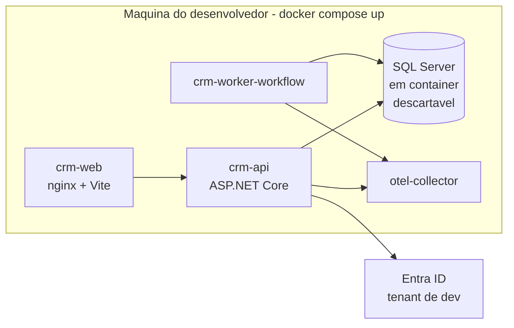
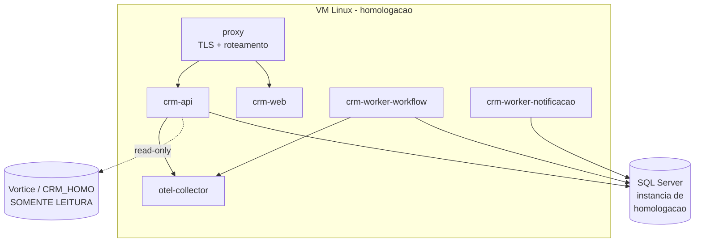
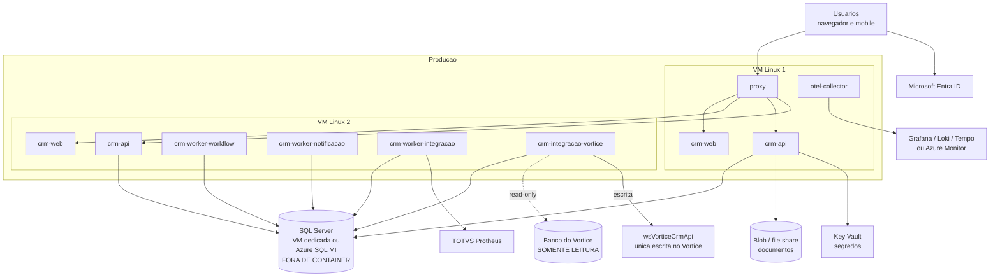

# Decisão de containers — CRM Tracbel

> **Documento 12 de 13** · Versão 1.0 · 02/09/2026
> **Status: recomendação técnica. Aguardando confirmação da infraestrutura (Algar) antes de virar decisão travada.**
> Esta decisão **substitui** a linha "Hospedagem da API: IIS" da tabela do
> [documento 03, seção 10](03-ARQUITETURA.md). As edições pontuais nos documentos 03 e 06 estão
> listadas na seção 17 — este documento não as aplica.

---

## 1. Por que decidir isto agora

A fase 0 do [plano](06-PLANO-IMPLEMENTACAO.md) monta os três ambientes e o pipeline de deploy em
cinco semanas. Empacotamento e orquestração são a primeira linha de código de infraestrutura que
o time escreve. Decidir depois significa reescrever o pipeline no meio da fase 1 — o momento mais
caro possível.

A pergunta que este documento responde é estreita, e é de propósito:

> **Como o CRM novo é empacotado, publicado e executado nos três ambientes?**

Não estamos decidindo nuvem versus on-premises. Não estamos decidindo fornecedor de datacenter.
Não estamos decidindo microsserviços — o [documento 03](03-ARQUITETURA.md) já definiu uma aplicação
em camadas, e ela continua sendo **uma** aplicação. Container é formato de entrega, não arquitetura
de software.

---

## 2. A recomendação, antes do argumento

| Decisão | Escolha |
|---|---|
| Nosso código (API, frontend, workers, integração) | **container Linux, uma imagem por serviço**, construída no CI, versionada, **a mesma imagem em homologação e produção** |
| SQL Server em produção | **fora de container** — VM dedicada ou Azure SQL Managed Instance |
| SQL Server em dev e CI | **em container** (Testcontainers, já previsto no [doc 03, seção 8](03-ARQUITETURA.md)) |
| Orquestração até a fase 3 | **Docker Compose** em VM Linux |
| Orquestração depois | **Kubernetes só com gatilho objetivo** (seção 7) |
| Windows containers | **não** |

---

## 3. O argumento central para a diretoria: portabilidade

O [diagnóstico](01-DIAGNOSTICO-VORTICE.md) mede uma coisa que não é sobre software: **o Vórtice não
é movível**. Rodar o Vórtice exige, simultaneamente:

| Amarra | Evidência |
|---|---|
| Um executável Gupta/Team Developer **32 bits** | doc 01, achado 11.1 |
| Um terminal server Windows publicando RemoteApp | doc 01, achado 11.1 |
| Três DLLs do roteador ODBC na pasta certa — copiar a pasta errada **apaga** as DLLs, e o erro que aparece é `SQL Error 401`, que não tem relação com o banco | doc 01, achado 11.5; `RUNBOOK-novo-terminal-server.md` |
| A variável `PATH` do sistema apontando para `C:\Vortice\TDBin` | `RUNBOOK-novo-terminal-server.md`, seção "O `PATH` do sistema" |
| Um share de rede (`Vortice_Atualiza`) para a auto-atualização — **morto desde a migração de datacenter** | doc 01, achado 11.4; `PENDENCIAS.md`, seção I |
| FTP com configuração no perfil do LocalSystem para o gerenciador de documentos | doc 03, seção 10 |
| Cinco gerações de software convivendo, cada componente subindo sozinho | doc 01, seção 11.8; doc 11, seção 1.1 |

O custo disso não é teórico. **Subir um terminal server novo é um runbook de 17 KB** com uma regra
em vermelho que "custou um dia de trabalho". Uma troca de IP quebrou links de e-mail que ainda não
foram todos corrigidos. Uma cópia de pasta errada derrubou o cliente inteiro.

Container é a resposta direta a isso, e cabe em uma frase para a diretoria:

> **A mesma imagem que roda na máquina do desenvolvedor roda no datacenter da Algar, na Azure ou em
> qualquer outro provedor, sem runbook de instalação.** O que precisa estar na máquina está dentro
> da imagem, e a imagem é construída pelo CI, não por uma pessoa copiando pasta.

Isso tem valor de negócio concreto e verificável: **a decisão de onde hospedar deixa de ser uma
decisão de arquitetura e vira uma decisão de contrato**, renegociável a qualquer momento sem tocar
no software. Hoje, com o Vórtice, ela é irreversível na prática.

**Onde este argumento não vale:** container não conserta nada do que está quebrado hoje. Ele impede
que o CRM novo repita o padrão. É um benefício de risco futuro, não uma economia imediata — e
apresentá-lo como economia seria desonesto.

---

## 4. Por que containers para o que é nosso

Cinco razões, na ordem em que importam para um time de três pessoas.

**1. A mesma imagem em homologação e produção.** O artefato promovido é o mesmo *digest*, não uma
nova compilação. Isso elimina a classe inteira de defeito "funcionou em homologação". Hoje, no
Vórtice, os módulos instalados diferem em versão entre si — é exatamente a causa do `RUNGEPIMPORT`
falhando a cada 20 minutos com `Versão incompatível [4.04.01r05] x [4.04.01r01]` (doc 01, achado 3.4;
doc 11, seção 1.1).

**2. Rollback é trocar uma tag.** O deploy do Vórtice é cópia de pasta (doc 03, seção 10), e o
rollback é copiar de volta — sem garantia de que o estado anterior era o que se pensa. Com imagem
versionada, voltar para a versão anterior é uma linha e leva segundos. Ressalva importante:
**isso vale para o código, não para o banco** — migrations exigem disciplina própria (seção 13).

**3. Dependência declarada.** O runtime do .NET, a versão do nginx, as bibliotecas nativas — tudo
fica no `Dockerfile`, versionado no Git, revisado em PR. Ninguém "instala o runtime no servidor".

> **Nota de 19/09/2026 (issue #84).** Sem contêiner, essa propriedade foi obtida de outro jeito: a
> publicação é **self-contained** (`-r win-x64 --self-contained true`), e o pacote leva o próprio
> runtime. Foi o que permitiu migrar do .NET 9 para o **.NET 10 (LTS)** sem tocar no servidor, que
> segue com os runtimes 6 e 8 instalados. O custo é tamanho: 131,8 MB contra 123,0 MB no .NET 9.

**4. Ambiente de desenvolvimento reproduzível.** Um `docker compose up` levanta API, frontend, SQL
Server de teste e coletor de telemetria. Para um time de três, em que as pessoas B e C começam na
semana 1 (doc 07), isso são dias economizados logo no início.

**5. Isolamento entre os processos.** O motor de workflow, a fila de e-mail e os jobs de integração
com o ERP não podem derrubar a API. Em processos separados, um `OutOfMemory` no job de carga do
Protheus não tira o CRM do ar. Hoje o Vórtice mistura tudo — e o achado 3.9 (22.512 falhas
silenciosas na fila de e-mail, sem retry) é o que acontece quando ninguém consegue observar um
componente separadamente.

### 4.1 Inventário de imagens

| Imagem | Base | Conteúdo | Réplicas (degrau 1) | Observação |
|---|---|---|---|---|
| `crm-api` | `mcr.microsoft.com/dotnet/aspnet` (Linux) | `Tracbel.Crm.Api` + Aplicação + Domínio + Infraestrutura | 2 | stateless; atrás do proxy |
| `crm-web` | `nginx:alpine` | bundle Vite estático + `nginx.conf` | 2 | sem SSR (doc 03, seção 10) |
| `crm-worker-workflow` | `dotnet/runtime` | motor de workflow, `MonitorSaudeRegras`, outbox | **1** | ver ressalva 6.4 |
| `crm-worker-notificacao` | `dotnet/runtime` | fila de e-mail e notificação | 1 | |
| `crm-worker-integracao` | `dotnet/runtime` | jobs TOTVS/JDE, watermark, dead-letter | 1 | entra na **fase 2** |
| `crm-integracao-vortice` | `dotnet/runtime` | leitura read-only do Vórtice + chamada da `wsVorticeCrmApi` | 1 | entra na **fase 2** |
| `crm-migracao` | `dotnet/runtime` | `dotnet ef database update` + reconciliação | 0 (job) | roda uma vez por deploy |
| `otel-collector` | imagem oficial | coletor OpenTelemetry | 1 | |
| `proxy` | `nginx` ou Traefik | TLS, roteamento, cabeçalhos de segurança | 1 | |

**Nove imagens, duas delas só a partir da fase 2.** Na fase 1 são sete — abaixo do gatilho de
Kubernetes definido na seção 7. Isso não é coincidência: é o dimensionamento.

---

## 5. Por que SQL Server fica FORA de container em produção

Esta é a parte da recomendação em que sou mais categórico, e é a parte que mais gente erra.

| Motivo | Detalhe |
|---|---|
| **Estado** | container é bom em ser descartável. Banco é o oposto: é a coisa que não pode ser descartada. Rodar banco em container significa montar volume persistente e cuidar dele — você paga a complexidade do container e não fica com nenhum de seus benefícios |
| **Backup** | o portão da fase 0 exige **restauração de backup testada, com evidência** (doc 06, seção 3, critério 7). Backup de SQL Server em VM é procedimento conhecido pelo parceiro de infra, com ferramenta que ele já opera. Em container, é um procedimento novo que ninguém no time de três já executou sob pressão |
| **Alta disponibilidade** | Always On e Managed Instance são caminhos suportados e documentados. SQL Server em container com HA é território de nicho |
| **Licença** | o [doc 03, seção 10](03-ARQUITETURA.md) registra que a licença de SQL Server **já existe**. Licenciamento de SQL Server em container é permitido, mas as regras de contagem de núcleo e de mobilidade mudam conforme a hospedagem. **Isso é pergunta para o contrato, não para o time** — está na lista da seção 19 |
| **Experiência do parceiro** | o incidente de disco cheio no terminal server (0,42 GB livres em 129 GB, `PENDENCIAS.md` seção I) mostra que a operação de VM já é o terreno da Algar. Colocar o banco num formato que ela não opera transfere o risco para dentro do time de três |
| **Suporte** | uma falha de banco em produção precisa de alguém que responda. Em VM ou em Managed Instance, esse alguém existe |

**Em dev e CI, o inverso.** Testcontainers com SQL Server em container já está no plano (doc 03,
seção 8, camada de aplicação) e é a decisão certa: um banco descartável por execução de teste, sem
estado, sem backup, sem HA. É exatamente o caso de uso em que container brilha.

> **A regra em uma linha:** container para o que é descartável; VM ou serviço gerenciado para o que
> guarda estado.

O mesmo raciocínio vale para os arquivos anexados: **não** guardar em volume de container. Azure
Blob ou file share dedicado, como o doc 03 já previa.

### 5.1 O que a investigação de 02/09/2026 acrescentou a esta decisão

A investigação profunda de 02/09/2026 (docs `docs/extracao-vortice/`, `docs/dicionario/`) confirmou
três fatos sobre o banco atual que reforçam a separação entre banco e aplicação:

| Fato confirmado em 02/09/2026 | Consequência para esta decisão |
|---|---|
| O banco do CRM está em **compatibility level 100 (SQL 2008)** rodando sobre **SQL Server 2019** | o banco novo nasce no nível de compatibilidade do servidor, e isso precisa estar num script de criação versionado — não numa configuração feita à mão |
| **0 check constraints e 0 default constraints** em 767 tabelas: **toda** validação vive na aplicação | o banco novo põe integridade no banco (princípio 2 do briefing). Isso reforça que o banco é um ativo próprio, com ciclo de vida próprio, e não um detalhe de implantação da aplicação |
| **Jobs do SQL Agent inacessíveis ao login de leitura** | há automação em produção que ainda não conseguimos ler. Enquanto isso durar, qualquer plano de desligamento tem um ponto cego — item do marco 0.5 no [doc 13](13-PROGRAMA-POR-FASES-DIRETORIA.md) |

Outros fatos da mesma rodada, registrados aqui porque são insumo de migração: collation
`SQL_Latin1_General_CP1_CI_AS`, existência de um banco `CRM_HOMO`, 1.828 índices, 33 extended
properties e 1 linked server.

---

## 6. Onde esta recomendação é fraca — a crítica honesta

Se este documento só listasse vantagens, não seria uma decisão, seria uma venda.

**6.1 Contraria uma decisão já documentada, com um bom argumento por trás.** O doc 03, seção 10,
escolheu IIS com a justificativa "é o que o TI da Tracbel opera hoje". Esse argumento é legítimo e
não desapareceu. Estou propondo trocá-lo pelo argumento de portabilidade — é uma **troca**, não um
ganho de graça, e a diretoria precisa saber disso.

**6.2 O time de três não tem experiência declarada em Docker e Linux.** Os planos individuais
(doc 07) listam EF Core, Entra ID, React, Playwright — não listam Docker nem administração Linux.
Estimo **1 a 2 semanas de curva de aprendizado dentro da fase 0** *(estimativa, não medida)*. Se
essa curva for maior, a fase 0 estoura — e a fase 0 é a única sem entrega visível ao usuário, a pior
de todas para atrasar.

**6.3 Compose numa VM não tem alta disponibilidade.** Se a VM cai, o CRM cai. Isso é aceitável até a
fase 3, porque o Vórtice ainda é o sistema de registro da maior parte do escopo (mapa de convivência,
[doc 13, seção 4](13-PROGRAMA-POR-FASES-DIRETORIA.md)). **Deixa de ser aceitável na fase 3**, e esse
é justamente um dos gatilhos do degrau 2. Duas VMs com o proxy roteando para as duas reduzem o
problema, não o eliminam.

**6.4 Worker com múltiplas réplicas é uma armadilha silenciosa.** O Hangfire (doc 03, seção 10)
distribui trabalho entre servidores, mas um job mal escrito — sem idempotência, sem lock — roda duas
vezes se houver duas réplicas. Por isso o inventário da seção 4.1 fixa **uma réplica** para o worker
de workflow. Escalar isso é decisão consciente, com teste, não efeito colateral de um
`docker compose scale`.

**6.5 Container não é segurança.** Ele reduz a superfície e facilita o patching da base, mas um
segredo dentro da imagem continua sendo um segredo exposto — e a lição do Vórtice aqui é literal:
**token da API gravado em texto claro numa tabela de parâmetros** (doc 01, achado 5.14) e
`SENHA_SMTP` em texto plano num `.env` de máquina de desenvolvimento (`PENDENCIAS.md`, item G).
A seção 11 trata disso explicitamente porque é o erro mais provável.

**6.6 Se a Algar não operar Linux, a conta muda inteira.** Nesse cenário, a operação de sistema
operacional cai no time de três, que já é o gargalo do programa. É o único cenário em que eu
recomendaria **Azure App Service** em vez de Compose (seção 8) — a portabilidade cai, mas ninguém
opera servidor.

---

## 7. Orquestração em dois degraus

### Degrau 1 — Docker Compose em VM Linux (da fase 0 até a fase 3)

Uma ou duas VMs Linux, `docker compose` com arquivo versionado no repositório, proxy na frente,
deploy pelo pipeline. Todo o estado fora: banco em VM ou PaaS separada, arquivos em blob, segredos
no cofre ou no host.

**Por que basta:** sete imagens na fase 1, **≈140 usuários ativos em 90 dias** (doc 11, seção 3.2) e
carga alvo de **500 leads/hora** (doc 06, portão da fase 1, critério 7). Nada nesse perfil exige
orquestração distribuída. E o time é de três pessoas: cada peça de infraestrutura a mais é tempo que
sai da entrega.

### Degrau 2 — Kubernetes (AKS gerenciado, ou k3s on-premises)

**Só com gatilho objetivo.** Nenhum destes é opinião; todos são verificáveis:

| # | Gatilho | Limiar | Por quê |
|---|---|---|---|
| 1 | Número de serviços em execução contínua | **> 10 containers** em produção | acima disso, o `compose` vira arquivo grande e o diagnóstico manual não escala |
| 2 | Necessidade real de autoescala | pico de fila ou de latência **documentado**, que exija replicar automaticamente | Compose não autoescala. Enquanto a carga for previsível, não é necessário |
| 3 | Ambientes múltiplos por frente de trabalho | **> 3 ambientes** simultâneos (ex.: um por squad ou por feature) | é o custo que namespaces resolvem bem |
| 4 | SLA formal assinado com o negócio | qualquer SLA com **RTO < 1 hora** | Compose numa VM não entrega isso (ver 6.3) |
| 5 | Time de plataforma | **existir alguém dedicado** a infraestrutura | Kubernetes sem dono é dívida com juros |

**Regra de decisão:** o degrau 2 entra quando **dois gatilhos** estiverem verdadeiros ao mesmo tempo,
e a migração é um item de plano, não uma tarde. Um só gatilho aceso normalmente tem resposta mais
barata — mais uma VM, mais uma réplica, um serviço gerenciado.

**Se o degrau 2 vier:** AKS se a decisão for Azure; k3s se a decisão for permanecer no datacenter da
Algar. O ponto importante é que **a imagem não muda** — é o mesmo artefato nos dois degraus. Foi por
isso que o degrau 1 foi desenhado com Compose e não com "publicar no IIS": a subida de degrau custa
manifestos, não recompilação.

### Windows containers: não

| Motivo | Efeito |
|---|---|
| Imagem base de centenas de MB a vários GB, contra dezenas de MB no Linux | build lento, registry caro, deploy demorado |
| Ecossistema de ferramentas menor e menos testado | menos respostas quando algo quebra às 22h |
| Não há nada no CRM novo que exija Windows | .NET moderno e React rodam nativamente em Linux |

A única razão real para Windows container seria uma dependência nativa Windows — e não temos nenhuma.
**A dependência de Windows do parque atual está no Vórtice, e o objetivo do programa é justamente
sair dela.**

---

## 8. As alternativas, comparadas

Quatro caminhos reais. Critérios pontuados de 1 (ruim) a 5 (bom) **para o contexto específico da
Tracbel**: três pessoas, ≈140 usuários ativos, parceiro de infra terceirizado, Entra ID já em uso.
A pontuação é um instrumento de comparação, não uma medição.

| Critério | (a) IIS em VM Windows | (b) Azure App Service | (c) Kubernetes no dia 1 | **(d) Compose em VM Linux** |
|---|:---:|:---:|:---:|:---:|
| Custo de infraestrutura | 4 | 3 | 1 | **4** |
| Complexidade operacional para 3 pessoas | 3 | **5** | 1 | **4** |
| Portabilidade entre provedores | 1 | 2 | **5** | **5** |
| Segurança e patching do SO | 2 | **5** | 4 | 3 |
| Observabilidade | 3 | 4 | **5** | 4 |
| Rollback | 2 | 4 | **5** | **5** |
| Ajuste ao Entra ID | **5** | **5** | 4 | 4 |
| Ajuste ao parceiro de infra (Algar) | **5** | 2 | 2 | 3 |
| Curva de aprendizado do time | **5** | 4 | 1 | 3 |
| **Soma** | **30** | **34** | **28** | **35** |

### O que a tabela não diz

**(a) IIS em VM Windows** é a opção mais confortável hoje e a pior em três anos. Ela reproduz
exatamente a estrutura de amarração que o [doc 01](01-DIAGNOSTICO-VORTICE.md) mede no Vórtice:
software que só roda numa máquina configurada à mão, cuja receita mora num runbook. É a única opção
que perde nos dois critérios que motivaram o programa inteiro — portabilidade e rollback.

**(b) Azure App Service** tem a segunda maior soma e **não deve ser descartada**. Ela ganha em tudo
que é operação: patching, TLS, escala e *slots* de deploy com troca atômica saem prontos. Perde em
duas coisas: prende na Azure (o oposto do argumento da seção 3) e depende de uma decisão de nuvem
que ainda não foi tomada. **Se a resposta da Algar for "não operamos Linux", esta vira a
recomendação** — e a mudança é barata, porque o App Service também executa a mesma imagem.

**(c) Kubernetes no dia 1** é a resposta errada para três pessoas. Não porque Kubernetes seja ruim,
mas porque ele cobra um imposto fixo de operação — manifests, ingress, certificados, RBAC, upgrades
de cluster — que só se paga quando há escala ou time para isso. Nenhum dos cinco gatilhos da
seção 7 está aceso hoje.

**(d) Compose em VM Linux** ganha por ser a única que entrega portabilidade e rollback sem cobrar o
imposto de Kubernetes. A fraqueza real é HA (item 6.3), e ela é conhecida, datada e tem gatilho.

---

## 9. Topologia por ambiente

### Desenvolvimento — na máquina do desenvolvedor



Banco em container aqui, e **só aqui** (mais o CI). Testcontainers sobe uma instância por execução de
teste de integração, conforme o doc 03, seção 8.

### Homologação — uma VM Linux



Homologação usa **a mesma imagem** que irá para produção; muda apenas a configuração injetada. A
existência de um banco `CRM_HOMO` no ambiente atual (confirmada em 02/09/2026) é o candidato natural
a fonte de leitura de homologação — a confirmar com o DBA.

### Produção — duas VMs Linux, banco fora



**A regra inviolável do projeto aparece no desenho:** a seta para o banco do Vórtice é pontilhada e
diz *read-only*; a única escrita passa pela `wsVorticeCrmApi`. É a decisão travada do
[README](README.md), agora com forma física.

---

## 10. Rede

| Item | Decisão |
|---|---|
| Exposição pública | **somente o proxy**, porta 443. Nenhum container publica porta direto no host |
| Entre containers | rede interna do Compose, resolução por nome de serviço |
| Banco | acessível **apenas** das VMs de aplicação — regra de firewall por IP de origem, nunca "qualquer" |
| Vórtice | acesso read-only com login dedicado, no mesmo padrão do já criado em `criar-usuario-visualizacao-sql.sql` |
| TLS | obrigatório, TLS 1.2+, **inclusive na LAN** (doc 05, seção 11) |
| Cabeçalhos | HSTS, CSP, `X-Content-Type-Options`, `Server` removido — configurados no proxy, uma vez, para todos os serviços |
| Rate limit | por usuário e por IP, no proxy e na API (doc 05, seção 11) |

---

## 11. Segredos

**Regra absoluta: `.env` com segredo nunca entra no repositório.** Não é preferência de estilo — é a
correção direta de dois defeitos medidos: token da API em texto claro no banco do Vórtice (doc 01,
achado 5.14) e `SENHA_SMTP` em texto plano num `.env` de desenvolvimento (`PENDENCIAS.md`, item G).

| Ambiente | Onde ficam os segredos |
|---|---|
| Desenvolvimento | `dotnet user-secrets`, fora da árvore do Git, mais um `.env.exemplo` **sem valores**, esse sim versionado |
| Homologação e produção | **Azure Key Vault** com Managed Identity — ou, se não houver Azure, arquivos de segredo do Docker no host, com permissão restrita, dono `root`, fora do diretório do repositório |
| Pipeline | segredos do GitHub Actions ou Azure DevOps, escopados por ambiente, com aprovação obrigatória para produção |
| Rotação | procedimento escrito e testado. `[V]` a senha de aplicativo do SMTP do Vórtice expira sem aviso e derruba o envio (`PENDENCIAS.md`, item D). A autenticação do CRM novo é OAuth2, não senha de aplicativo |

**Verificação no CI:** varredura de segredo em cada PR (`gitleaks` ou equivalente). Achou, barra o
merge — mesmo padrão do teste de arquitetura já definido no doc 03, seção 8.

---

## 12. Observabilidade

O [doc 03, seção 10](03-ARQUITETURA.md) já define Serilog e OpenTelemetry. Containers mudam apenas o
caminho da telemetria, não a decisão.

```
API / workers  --(OTLP)-->  otel-collector  -->  métricas: Prometheus/Grafana ou Azure Monitor
                                            -->  logs:     Loki ou Azure Monitor Logs
                                            -->  traces:   Tempo ou Application Insights
```

| Sinal | O que precisa estar lá no primeiro dia |
|---|---|
| Log | estruturado, com `TraceId`, usuário e empresa em todo evento. **Nunca em arquivo dentro do container** — o container é descartável, o log não pode ser |
| Métrica | taxa de disparo de regra (doc 03: "métrica de primeira classe"), latência da API, profundidade da fila, tamanho do dead-letter |
| Trace | requisição HTTP → caso de uso → banco → job assíncrono, num rastro só |
| Saúde | `/health/live` e `/health/ready` em cada serviço; o proxy só roteia para quem está *ready* |
| **Alarme** | integração sem sucesso em 2 ciclos abre incidente (doc 06, fase 2). **Nunca "Warning"** — este é o defeito 3.4 do Vórtice, que falhou a cada 20 minutos por meses sem que ninguém fosse avisado |

**Um alarme que ninguém recebe não é alarme.** O destino (e-mail, Teams, ferramenta de plantão) é
item da lista da seção 19.

---

## 13. Backup e restauração

| O que | Onde vive | Estratégia |
|---|---|---|
| Banco `TRACBEL_CRM` | VM dedicada ou Azure SQL MI | **backup diário com teste de restauração mensal** — é o portão da fase 0, critério 7 (doc 06) |
| Documentos e anexos | Blob ou file share | versionamento e retenção no próprio serviço; nunca em volume de container |
| Imagens | registry | retenção mínima de **10 versões**, para que o rollback tenha para onde voltar |
| Configuração e `docker-compose.yml` | Git | é código, e é revisado em PR |
| Segredos | Key Vault | backup e rotação pelo procedimento do cofre |
| **Nada** | volume de container | se está num volume de container, ou é cache, ou está no lugar errado |

`[V]` **Por que isto é insistente:** o terminal server do Vórtice está **sem backup** — a tarefa
`\Algar\Backup do System State` está *Disabled*, e 22 GB de disco desapareceram sem causa
identificada (`PENDENCIAS.md`, seção I). Backup não testado é backup que não existe.

### Migrations de banco — o limite do rollback

Voltar a imagem é instantâneo; **voltar o schema não é.** A disciplina:

1. Toda migration é **compatível com a versão anterior** do código: adiciona coluna, não renomeia.
2. Remoção de coluna acontece **um deploy depois** de o código parar de usá-la.
3. Migration roda como job próprio (`crm-migracao`), antes de subir a nova versão da API.
4. Migration destrutiva exige backup imediatamente anterior, com evidência.

---

## 14. Pipeline CI/CD

GitHub Actions ou Azure DevOps — a escolha depende de onde o repositório vai morar, e está na lista
da seção 19. O desenho é o mesmo nos dois.

```mermaid
flowchart LR
  PR["Pull Request"] --> B["build<br/>dotnet build -warnaserror"]
  B --> T["testes<br/>unidade + Testcontainers<br/>+ arquitetura + autorizacao"]
  T --> L["analise estatica<br/>gitleaks<br/>dotnet list package --vulnerable"]
  L --> I["build da imagem<br/>tag = SHA do commit"]
  I --> S["scan da imagem<br/>Trivy ou Defender"]
  S --> PUSH["push no registry"]
  PUSH --> H["deploy em homologacao<br/>automatico"]
  H --> E2E["Playwright<br/>axe-core"]
  E2E --> AP{"aprovacao<br/>manual"}
  AP --> P["deploy em producao<br/>MESMO digest"]
  P --> V["verificacao pos-deploy<br/>health + fumaca"]
```



**As cinco regras do pipeline:**

1. **A tag da imagem é o SHA do commit.** Nunca `latest` em homologação ou produção. `latest` é a
   versão de ninguém.
2. **Produção recebe o `digest` que passou em homologação.** Não há nova compilação entre um
   ambiente e outro — é isso que fecha o buraco do `Versão incompatível` do Vórtice.
3. **Scan de imagem com `CRITICAL` ou `HIGH` barra o deploy**, salvo exceção aprovada, com prazo e
   dono registrados.
4. **Aprovação manual só existe para produção.** Homologação é automática, senão ninguém usa.
5. **A verificação pós-deploy é parte do deploy.** Se `/health/ready` não responder dentro da janela
   configurada, o pipeline reverte sozinho.

---

## 15. Estratégia de rollback

| Camada | Como se volta | Tempo alvo *(estimativa)* |
|---|---|---|
| Código | subir a tag anterior, ou troca de *slot* | **< 5 minutos** |
| Configuração | reverter o commit e reaplicar | < 10 minutos |
| Schema (aditivo) | não precisa voltar — a versão anterior do código funciona com ele | 0 |
| Schema (destrutivo) | restaurar do backup imediatamente anterior | **horas** — por isso a regra da seção 13 |
| Dado corrompido por job | reprocessar a partir do watermark, com idempotência garantida por `intg.ChaveExterna` (doc 06, fase 2) | depende do volume |

**O rollback é testado no portão da fase 0** — o critério 6 do doc 06 já exige "deploy automatizado
ida e volta, pipeline verde + rollback testado". Esta decisão não acrescenta um critério; ela torna o
critério existente exequível em minutos em vez de em runbook.

---

## 16. Custo mensal estimado

> 🔶 **Tudo nesta seção é estimativa não cotada.** Nenhum destes valores foi orçado com a Algar, com
> a Microsoft ou com qualquer provedor. Servem para dar **ordem de grandeza** e para mostrar a
> distância entre os degraus — não para aprovar orçamento. A cotação é o item 17 da seção 19.

### Degrau 1 — Compose em VM Linux

| Item | Faixa mensal *(estimativa)* |
|---|---|
| 2 × VM Linux (4 vCPU / 16 GB / 100 GB) | R$ 1.200 – R$ 2.400 |
| 1 × VM SQL Server (8 vCPU / 32 GB / 500 GB), **licença já existente** (doc 03, seção 10) | R$ 2.500 – R$ 5.000 |
| Armazenamento de documentos e backup | R$ 300 – R$ 1.000 |
| Registry de imagens + minutos de CI | R$ 0 – R$ 500 |
| Observabilidade (Grafana/Loki/Tempo na própria VM, ou Azure Monitor) | R$ 0 – R$ 1.500 |
| **Total degrau 1** | **R$ 4.000 – R$ 10.400** |

### Degrau 2 — Kubernetes gerenciado (AKS) + Azure SQL MI

| Item | Faixa mensal *(estimativa)* |
|---|---|
| Cluster AKS (control plane com SLA + 3 nós de trabalho) | R$ 5.000 – R$ 10.000 |
| Azure SQL Managed Instance (General Purpose) | R$ 8.000 – R$ 20.000 |
| Armazenamento, rede, backup e observabilidade gerenciada | R$ 2.000 – R$ 5.000 |
| **Total degrau 2** | **R$ 15.000 – R$ 35.000** |

### Para comparar

| Referência | Valor anual | Origem |
|---|---|---|
| Degrau 1, 12 meses | **R$ 48 mil – R$ 125 mil** *(estimativa)* | esta seção |
| Degrau 2, 12 meses | **R$ 180 mil – R$ 420 mil** *(estimativa)* | esta seção |
| Salesforce Sales Cloud Enterprise, só licença | **≈ R$ 1,5 milhão** (US$ 175/usuário/mês × 130) | doc 00, seção 8; doc 02, seção 7 |

**A leitura:** a infraestrutura do degrau 1 custa entre **3% e 8%** do que custaria apenas a licença
do Salesforce, e a diferença entre os dois degraus é grande o bastante para justificar a disciplina
dos gatilhos da seção 7. Subir de degrau sem gatilho é multiplicar o custo de infraestrutura por três
ou quatro sem entrega correspondente.

---

## 17. O que muda nos documentos 03 e 06

**Estas edições estão recomendadas, não aplicadas.** Só devem ser feitas depois que a infra confirmar
os itens da seção 19.

### `03-ARQUITETURA.md`

| # | Onde | Edição |
|---|---|---|
| 1 | Seção 10, linha "Hospedagem da API" | trocar `ASP.NET Core no IIS (in-process)` por `contêiner Linux (Kestrel) atrás de proxy reverso`; o "porquê" passa de *"é o que o TI opera hoje"* para *"mesma imagem em homolog e prod; portabilidade entre provedores — ver doc 12"* |
| 2 | Seção 10, linha "Frontend" | trocar `servido pelo IIS como estático` por `imagem nginx com o bundle Vite` |
| 3 | Seção 10 | acrescentar as linhas **Empacotamento** (imagem por serviço, tag = SHA), **Orquestração** (Compose no degrau 1), **Registry**, **Segredos** (Key Vault ou secrets do host, nunca `.env` no repositório) e **Imagem base** (patch mensal) |
| 4 | Seção 10, linha "Banco" | acrescentar a ressalva: **fora de container em produção; em container só em dev e CI** |
| 5 | Seção 8 (tabela de testes) | acrescentar a linha `Imagem · vulnerabilidade da imagem publicada · Trivy/Defender · zero CRITICAL/HIGH sem exceção aprovada` |
| 6 | Nova subseção **10.1** | um parágrafo de remissão: *"O empacotamento e a orquestração estão decididos no documento 12."* |

### `06-PLANO-IMPLEMENTACAO.md`

| # | Onde | Edição |
|---|---|---|
| 7 | Fase 0 / Infraestrutura | trocar `prod (VM, IIS)` por `prod (VM Linux, Docker Compose)` |
| 8 | Fase 0 / Infraestrutura | acrescentar as tarefas: `Dockerfile` por serviço · `docker-compose` de homolog e prod versionados · registry escolhido e configurado · segredos no Key Vault ou no host · coletor OpenTelemetry · rotina de backup do SQL **fora** do container, com teste de restauração |
| 9 | Fase 0, **antes da semana 1** | acrescentar tarefa **bloqueante**: confirmar com a Algar quem opera a VM Linux (perguntas 1 a 4 da seção 19). Sem resposta, a alternativa (b) do quadro da seção 8 volta à mesa |
| 10 | Fase 0 / Portão | acrescentar o critério **9** — *a mesma imagem promovida de homologação para produção, com o digest registrado na evidência* — e o critério **10** — *scan de imagem sem CRITICAL/HIGH* |
| 11 | Fase 0, duração | avaliar **5 → 6 semanas** se o time não tiver experiência prévia em Docker e Linux (item 6.2) |
| 12 | Seção 11 (riscos) | acrescentar a linha: *parceiro de infra não operar Linux/containers · sinal: resposta negativa nas perguntas 1 e 2 da seção 19 · ação: migrar a recomendação para Azure App Service, que executa a mesma imagem* |

---

## 18. Decisão recomendada

1. **Containerizar tudo o que é nosso** — API, frontend, workers e a camada de integração com o
   Vórtice — uma imagem por serviço, construída no CI, e **o mesmo digest promovido de homologação
   para produção**.
2. **SQL Server fica fora de container em produção** (VM dedicada ou Azure SQL Managed Instance); em
   container apenas em desenvolvimento e CI, via Testcontainers.
3. **Orquestrar com Docker Compose em VM Linux até a fase 3**, e só migrar para Kubernetes quando
   dois dos cinco gatilhos objetivos da seção 7 estiverem acesos ao mesmo tempo.
4. **Nada de Windows containers** — não há dependência que os justifique, e sair da amarração a
   Windows é parte do objetivo do programa.
5. **A portabilidade é o benefício que vai à diretoria:** a mesma imagem roda na Algar, na Azure ou em
   outro provedor, e a escolha de hospedagem volta a ser uma decisão de contrato — não a prisão de
   Gupta + terminal server + share de rede + FTP em que estamos hoje.

---

## 19. O que precisa ser confirmado com a infraestrutura e com a Algar

Enquanto estas perguntas estiverem abertas, esta decisão permanece **recomendada, não travada**.
Elas também estão registradas em [`open-questions.md`](open-questions.md).

### Operação

1. A Algar **opera VMs Linux** hoje? Com qual distribuição e qual janela de patching?
2. Se sim, o **Docker** entra no escopo do contrato de gestão, ou o time da Tracbel opera os
   containers dentro de uma VM gerida por eles?
3. Quem é o **plantão** quando o CRM cair fora do horário comercial, e qual é o tempo de resposta
   contratado?
4. Existe **monitoramento de disco e de recursos** no contrato? *(A ausência disso é o que produziu
   os 0,42 GB livres no terminal server — `PENDENCIAS.md`, seção I.)*

### Hospedagem e rede

5. O datacenter é o da Algar, é Azure, ou é híbrido? **Há decisão corporativa de nuvem?**
6. Se houver Azure: existe **ExpressRoute ou VPN** até a rede da Tracbel, e a latência entre a
   aplicação e o TOTVS Protheus é aceitável?
7. Podemos abrir **443 de entrada** para o CRM novo, e por qual caminho (WAF, balanceador, proxy da
   Algar)?
8. Qual o caminho de rede permitido da VM de aplicação até o **banco do Vórtice** (somente leitura) e
   até a **`wsVorticeCrmApi`**?

### Banco

9. **VM dedicada ou Azure SQL Managed Instance?** Se VM, quem faz o backup e com qual ferramenta?
10. A **licença de SQL Server existente** cobre a nova instância? Quantos núcleos, qual edição, e há
    Software Assurance — o que determina a mobilidade de licença?
11. Já existe um **DBA**, interno ou da Algar, que possa validar índice e plano de execução e ajudar
    na extração dos **jobs do SQL Agent do Vórtice**, hoje inacessíveis ao login de leitura
    (confirmado em 02/09/2026)?

### Segredos, identidade e ferramentas

12. Existe **Azure Key Vault** no tenant? Quem administra?
13. O repositório fica no **GitHub** ou no **Azure DevOps**? Isso decide o CI e o registry.
14. Qual **registry de imagens** usaremos: Azure Container Registry, GitHub Container Registry, ou um
    registry on-premises?
15. Há **política corporativa de imagem base** ou de varredura de vulnerabilidade a seguir?
16. Qual o canal oficial de **alarme** (e-mail, Teams, ferramenta de plantão)? Um alarme sem destino é
    o defeito 3.4 do Vórtice repetido.

### Custo

17. **Cotação real** das VMs do degrau 1 com a Algar, e do equivalente em Azure — para substituir as
    faixas estimadas da seção 16 por números com origem.

---

## Anexo — o que este documento NÃO decide

| Fora de escopo | Onde se decide |
|---|---|
| Nuvem versus on-premises | decisão corporativa; pergunta 5 da seção 19 |
| Microsserviços | [doc 03](03-ARQUITETURA.md) — a aplicação é uma só, em camadas |
| Substituição do terminal server do Vórtice | `RUNBOOK-novo-terminal-server.md` — é operação do sistema atual, e continua necessária durante todo o programa |
| Ordem das fases e escopo do programa | [doc 13](13-PROGRAMA-POR-FASES-DIRETORIA.md) |
| Modelo de dados e segurança | docs [04](04-MODELO-DADOS.md) e [05](05-SEGURANCA.md) — nada aqui os altera |
