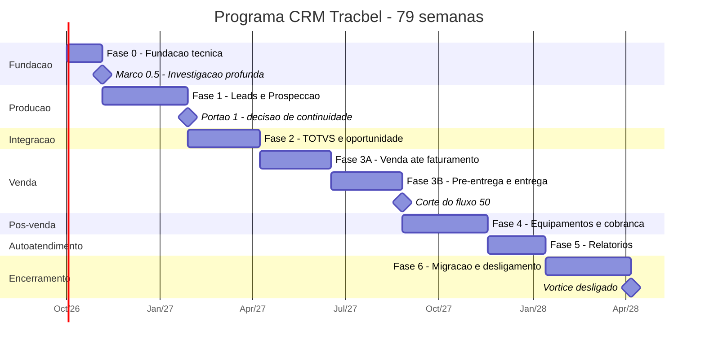
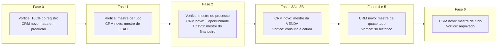

# Programa CRM Tracbel — escopo total, fases e portões

> **Documento 13 de 13** · Versão 1.0 · 02/09/2026 · **destinatário: diretoria**
> Este documento **substitui a visão macro** do [documento 06](06-PLANO-IMPLEMENTACAO.md).
> O detalhe técnico de cada fase continua no 06; o 06 não foi alterado por este documento — as
> edições recomendadas estão na seção 9.
> Todo número aqui tem origem indicada (documento + seção) ou vem marcado como **estimativa** ou
> **a apurar**. Nada foi inventado.

---

## 1. A página de decisão

### O que estamos pedindo

Autorização para executar um **programa de 79 semanas (≈18 meses)** com um time de **3 pessoas em
dedicação integral**, construindo o CRM próprio da Tracbel e desligando o Vórtice de forma gradual,
um domínio por vez, com portão de qualidade obrigatório entre as fases.

Não estamos pedindo autorização para as 79 semanas de uma vez. **Estamos pedindo autorização para a
fase 0 e a fase 1 (17 semanas), e um comitê que decide a continuidade em cada portão.** Cada portão
é uma oportunidade real de parar — e a seção 11 diz o que fica de valor se pararmos em cada ponto.

### Por quê

O CRM que a Tracbel usa hoje está em falência técnica **medida**, não opinada:

| O que está quebrado | Medida | Origem |
|---|---|---|
| Integração financeira parada | **783.242 títulos · R$ 5,18 bilhões** presos desde 22/05/2025 | doc 01, achado 3.1 |
| Ordens de serviço nunca promovidas | **280.214 de 287.868** — e marcadas como processadas | doc 01, achado 3.2 |
| Régua de cobrança parada | último processo de cobrança em **21/05/2025** — um dia antes do represamento dos títulos. **É o mesmo incidente** | doc 10, seção 7 |
| Falha silenciosa | `RUNGEPIMPORT` falha **a cada 20 minutos há meses**, registrado apenas como *Warning* | doc 01, achado 3.4 |
| Senha sem salt | 663 usuários com senha produzem **467 valores distintos**; **80 compartilham o mesmo valor** | doc 01, achado 5.3 |
| Permissão por registro | **não existe** | doc 01, achado 5.1 |
| Metade dos usuários sem política | **710 de 1.386 (51%)** | doc 11, seção 3.2 |
| LGPD | as views de anonimização **republicam o valor cru na mesma view** | doc 01, seção 6.1 |
| Motor de relatórios | aceita `UPDATE`, `INSERT`, `EXEC`; **125 dos 134 relatórios sem predicado de usuário** | doc 01, seção 8 |
| Banco | **52,4% das 85,5 milhões de linhas são log**, sem política de retenção | doc 01, seção 10 |
| Infraestrutura | terminal server **sem backup** (tarefa de System State desabilitada), disco que chegou a **0,42 GB livres** em 129 GB | `PENDENCIAS.md`, seção I |

### Quanto

| Cenário | Custo anual | Origem |
|---|---|---|
| **Construir** (este programa) | custo do time + **R$ 48 mil a R$ 125 mil de infraestrutura** *(estimativa, doc 12 seção 16)* | doc 12 |
| Migrar para Salesforce Sales Cloud Enterprise | **≈ US$ 273 mil ≈ R$ 1,5 milhão**, só de licença, fora implantação | doc 00, seção 8 |
| Migrar para Dynamics 365 Sales Enterprise | faixa comparável | doc 02, seção 7 |
| Manter o Vórtice como está | **a apurar** — o valor não está no banco, só no contrato | doc 11, seção 7 |

O custo de pessoas não está apurado em nenhum documento do projeto e **precisa ser colocado pela
diretoria** — é o maior item do orçamento (seção 10).

### Quando

Fase 0 e fase 1 em **17 semanas**, com **usuários reais em produção ao final da fase 1**. O programa
completo em **79 semanas**. As fases 2 a 6 dependem de decisão em cada portão.

### O que acontece se não fizermos

1. **A visão financeira do CRM continua cega.** Já são 15 meses. Toda análise de faturamento,
   inadimplência e pós-venda feita no Vórtice hoje está errada (doc 01, seção 3).
2. **A régua de cobrança continua parada** — 65.208 processos históricos, zero em 2026 (doc 10,
   seção 7).
3. **O risco de auditoria de segurança e de LGPD permanece aberto**, com evidência já documentada
   contra nós (doc 01, seções 5 e 6).
4. **A dependência continua irreversível**: cliente Gupta 32 bits, terminal server sem backup, share
   de rede morto, cinco gerações de software convivendo (doc 11, seção 1.1). Cada mês adiado é mais
   dado dentro dessa caixa.
5. **A alternativa de compra fica mais cara com o tempo**, e não resolve a carteira multi-linha-de-
   negócio, que é como a Tracbel Agro realmente opera e que **não existe nativamente em nenhum dos
   dois grandes** (doc 02, seção 7).

### O que este programa não é

Não é uma reescrita de tudo. **Só 17 dos 62 fluxos precisam migrar** (doc 10, seção 1), e 8 desses
somam 155 agendas por ano — vale conversar sobre aposentar em vez de migrar. Não copiamos as 767
tabelas: copiamos o que é usado.

---

## 2. O espelho: o que o Vórtice faz hoje, em números

O método do projeto, em uma frase:

> **O Vórtice é o espelho funcional** — ele define *o que* o sistema novo precisa fazer, porque é o
> que a operação usa todos os dias. **Salesforce e Dynamics são a referência de arquitetura** — eles
> definem *como* fazer, porque resolveram esses problemas em 25 anos e publicam a solução. **Pegamos
> o melhor de cada, e descartamos explicitamente o que não serve.**

A lista do que **não** copiamos é vinculante e está no doc 00, seção 4.4: motor EAV, governor limits
numéricos, Territory Management, Apex Managed Sharing, Access Teams, Position Hierarchy, escada de
4 sandboxes, Power BI embedded, mobile offline, Einstein, Console Apps.

### 2.1 A escala do sistema atual

| Métrica | Valor | Origem |
|---|---|---|
| Tabelas | **767** (131 vazias — 35% das `IV_`) | doc 01, seção 2 |
| Colunas | 19.859 | doc 01, seção 2 |
| Views | **411** (290 auto-geradas por metadados) | doc 01, seção 2 |
| Linhas totais | **85,5 milhões** — 44,8M delas são log (52,4%) | doc 01, seção 2 |
| Foreign keys | 672 — **nenhuma no caminho quente do BPM** | doc 01, seção 2 |
| Pessoas | 118.463 | doc 01, seção 2 |
| Processos | 1.174.932 | doc 01, seção 2 |
| Históricos | 2.436.127 | doc 01, seção 2 |
| Agendas | 931.989 | doc 01, seção 2 |
| Notas fiscais / títulos | 391 mil / 578 mil | doc 01, seção 2 |
| Documentação do fornecedor | **nenhuma** | doc 01, seção 2 |

### 2.2 O produto, as telas e os usuários

| Métrica | Valor | Origem |
|---|---|---|
| Executáveis desktop com licença própria | **4** (Atendente, Administrador, Supervisor, Configurador) | doc 11, seção 1 |
| Gerações de software convivendo | **5**, de 3.7.00 a 4.04.01r18 | doc 11, seção 1.1 |
| Módulos licenciados e **nunca instalados** | **5** (Config RD Station, Web CRM, OUT CRM, BPM 2025, Painel 2025) | doc 11, seção 1.2 |
| Telas registradas | **184** — sendo **108 de configuração** contra **32 de operação** | doc 11, seção 2 |
| Usuários cadastrados | **1.386** | doc 11, seção 3.2 |
| **Usuários realmente ativos em 90 dias** | **≈140 (10%)** | doc 11, seção 3.2 |
| Usuários sem nenhuma política de segurança | **710 (51%)** | doc 11, seção 3.2 |
| Cobertura da permissão por tela | **10 de 184 telas** | doc 11, seção 3.3 |

### 2.3 Os fluxos — o escopo real da migração

| Métrica | Valor | Origem |
|---|---|---|
| Modelos de processo cadastrados | **62** | doc 10, seção 1 |
| **Geraram trabalho em 2026** | **17** | doc 10, seção 1 |
| Não geraram nada em 2026 | **45 — 73% do catálogo** | doc 10, seção 1 |
| **Os 5 maiores concentram** | **90% do trabalho** | doc 10, seção 1 |
| Agendas em 2026 | 105.415, sendo **25.503 pendentes (24%)** | doc 10, seção 1 |
| Maior fluxo (50 — Venda Equipamento Tracbel Agro) | 62.277 agendas · **47 ações · 178 resultados** | doc 10, seção 2 |
| Menor catálogo entre os vivos (32 — Prospecção Peças/Serviços) | 10.272 agendas · **4 ações · 19 resultados** | doc 10, seção 2 |
| Catálogo apodrecido | **980 ações (169 usadas em 2026)** · **4.208 resultados (501 usados)** | doc 01, achado 7.12 |
| Regras de automação | **5.958 regras para 1.262 pares distintos** — cópias por falta de condição | doc 01, achado 7.2 |
| Formulários que viraram tabela física | **175 tabelas `IV_Q_*`**, nunca coletadas | doc 01, achado 7.11 |
| Relatórios | **134**, dos quais **10 rodaram nos últimos 3 meses** e 26 nunca rodaram | doc 01, seção 8 |

### 2.4 As integrações

| Integração | Estado | Origem |
|---|---|---|
| TOTVS Protheus (`EXT_*`/`IMP_*`) | **parada** — faturamento morreu em três datas distintas entre ago/2024 e abr/2025 | doc 01, achado 3.3 |
| JD Edwards (`JDE_*`) | **7 tabelas, todas com zero linhas.** Job nunca agendado | doc 01, achado 3.5 |
| ETL Pentaho | **parado desde jul/2021** | doc 01, achado 3.6 |
| RD Station | módulo licenciado e **sem versão instalada** | doc 11, seção 1.2 |
| Fila de e-mail | **22.512 falhas silenciosas, sem retry** | doc 01, achado 3.9 |
| CRM × ERP | ligados **apenas por `SeqPessoa`**; **99,1% das notas fiscais sem `IdVeic`**. A ponte real é um formulário digitado à mão | doc 01, seção 4 |

### 2.5 O que a investigação profunda de 02/09/2026 acrescentou

Rodada de extração concluída em 02/09/2026, com os artefatos abaixo — é o marco 0.5 da seção 3.

| Entregável | Onde | O que contém |
|---|---|---|
| Dicionário de dados completo | `docs/dicionario/` | as **767 tabelas** descritas a partir do catálogo |
| Código-fonte dos objetos programáveis | `docs/extracao-vortice/modulos/` | **548 objetos**: 85 procedures, 51 functions, 1 trigger, 411 views |
| DDL completo | `docs/extracao-vortice/ddl/` | estrutura de tabelas, índices e chaves |
| Catálogos BPM exportados | `docs/extracao-vortice/catalogos-bpm/` | ações, resultados, regras, modelos de processo |
| Volumetria e domínios | `docs/extracao-vortice/volumetria/`, `.../dominios/` | contagem por tabela e valores reais por coluna de domínio |
| Segurança do banco | `docs/extracao-vortice/seguranca-banco/` | logins, roles, permissões efetivas |
| Inventário de binários | `docs/extracao-vortice/binarios/` | executáveis, DLLs e arquivos de configuração dos servidores |
| Ciclo de vida ponta a ponta | `docs/pesquisa/16-vortice-ponta-a-ponta-*.md` | pessoa → processo → agenda → histórico, com evidência |

**Fatos de banco confirmados em 02/09/2026:**

| Fato | Por que importa |
|---|---|
| Banco em **compatibility level 100 (SQL 2008)** rodando em **SQL Server 2019** | o motor está operando em modo de compatibilidade de duas versões maiores atrás. Explica limitações de otimizador e trava recursos modernos |
| **0 check constraints e 0 default constraints** em 767 tabelas | **toda** validação de dado vive na aplicação. É a origem estrutural dos telefones inválidos, das datas em 5173 e dos 345.535 órfãos |
| **1.828 índices** (487 clusterizados, 1.341 não clusterizados; só 6 com `INCLUDE`, nenhum filtrado) mais **280 heaps** | dimensiona o trabalho de análise de desempenho da migração. Cinco tabelas grandes são heap sem chave primária |
| Collation `SQL_Latin1_General_CP1_CI_AS` | precisa ser reproduzida na comparação de chaves durante a migração, ou a reconciliação acusa divergência falsa |
| Existe um banco **`CRM_HOMO`** | candidato natural a fonte de leitura do ambiente de homologação do CRM novo |
| **33 extended properties** e **1 linked server** | o único vestígio de documentação embutida no banco, e uma dependência externa a mapear |
| **Jobs do SQL Agent inacessíveis ao login de leitura** | 🔴 **ponto cego confirmado.** Há automação rodando em produção que ainda não conseguimos ler |

> ✅ **Divergência explicada (02/09/2026):** o [doc 01, seção 2](01-DIAGNOSTICO-VORTICE.md) registra
> **6 procedures e 1 function** porque foi levantado em junho, quando o login de leitura tinha só
> `db_datareader`. O SQL Server esconde no catálogo (`sys.objects`) todo objeto sobre o qual o login
> não tem permissão alguma; procedures sem `EXECUTE` simplesmente não apareciam. Com o `VIEW DEFINITION`
> concedido depois, o mesmo catálogo passou a mostrar os **85 procedures, 51 functions e 1 trigger**, e o
> código de todos foi extraído. **O número correto é 548 objetos programáveis.** O doc 01 precisa ser
> corrigido na seção 2 (edição listada na seção 9 deste documento).

**Os achados que mudam o programa** (detalhe e query em `docs/extracao-vortice/00-RELATORIO-EXTRACAO.md`
e na pesquisa 16, seções indicadas):

| # | Achado | Medida | Onde |
|---|---|---|---|
| 1 | **Toda a camada ERP está parada, e por causas diferentes** | faturamento parou em 11–14/04/2025; OS em 05/2024; frota em 24/05/2024 porque o job `PR_VTC_INTVEICULO` está cadastrado e **nunca executou** | extração, achados 1–2; pesquisa 16, §8.1 |
| 2 | **A lógica de negócio mora no banco, não só na tela** | **70 das 85 procedures escrevem em tabela**; a aprovação de venda é roteada por procedure a cada 5 minutos, pelo gerente do operador, não pelo líder da carteira | pesquisa 16, §6.2 e §8.3 |
| 3 | **A automação conversa por texto delimitado** | procedures montam linhas com `;` e fragmentos de SQL dentro do dado e inserem em `GEP_IMPORT`; até o único trigger do banco faz isso | extração, achado 5; pesquisa 16, §6.3 |
| 4 | **Cada regra de processo existe 18 vezes** | 5.958 regras de geração de agenda e 1.338 do Message Center replicadas por filial; mudar um passo exige 18 edições | extração, achado 6 |
| 5 | **O pós-faturamento falha em 3 de cada 4 vezes** | só 24,2% das 6.980 tarefas esperadas em 2026 nasceram; a falha rotaciona entre regras e não há log do motor | pesquisa 16, §5.6 |
| 6 | **Toda notificação sai com link quebrado e 9% se perde** | 1.323 regras ativas, 100% e-mail, montam link para o IP da rede antiga; taxa de erro saltou de 1,9% para ~9% sem retry | extração, achado 3; pesquisa 16, §5.9 |
| 7 | **Zero validação no banco, vocabulário já divergiu** | 0 `CHECK`; `FINALIZADO` convive com `FINALIZADA`; **437.694 processos sem status** | extração, achado 7 |
| 8 | **Não existe homologação confiável** | `CRM_HOMO` diverge em 551 módulos; 129 objetos existem só em produção | extração, achado 8 |
| 9 | **Configuração do banco contra si mesma** | `AUTO_SHRINK` ligado; logs ocupam **13,7 GB de 32,4 GB** (42%), com dois mecanismos de log convivendo sem expurgo | extração, achados 9 e 11 |
| 10 | **196 SQLs de validação vivem numa tabela** | 168 marcados como `TESTE` são regras de produção; 3 apontam para o sistema Linx antigo; 125 dependem das tabelas físicas dos formulários | extração, achado 12; pesquisa 16, §8.5 |
| 11 | **O elo com o TOTVS está fora de qualquer repositório** | um linked server via DSN ODBC do Windows; 8 views de BI dependem dele | extração, achado 13 |
| 12 | **Segredos com cifra proprietária** | 31 parâmetros cifrados (inclui senha SMTP) com a chave dentro do executável; tabela de histórico de senhas com 2.490 linhas | extração, achado 14 |
| 13 | **Nenhuma tarefa tem prazo** | 0 das 170 ações em uso tem SLA; **44% do passivo de agenda (15.658 tarefas) está em contas mortas** | pesquisa 16, §4.4 e §4.5 |
| 14 | **O uso está encolhendo** | usuários ativos caíram de 180 (jul/2025) para 128 (jul/2026), andamentos caíram 57%; pico de uso é 17h de sexta: diário de bordo retroativo, não ferramenta de campo | pesquisa 16, §9.2 e §9.5 |
| 15 | **O escopo real é bem menor que o catálogo** | 602 das 980 ações fora de uso; módulos inteiros zerados (financiamento, call center, JDE); 45 dos 62 modelos mortos; 9 de 134 relatórios vivos | extração, achado 15; pesquisa 16, §12.3 |

| 16 | **A regra de negócio mora no p-code Gupta, não no banco nem em .NET** | cliente desktop é OpenText Team Developer 7.3.4 (p-code sem descompilador); a camada .NET (310 assemblies, .NET Framework 4.8) usa ADO.NET puro em 506 classes de DAL, sem ORM. Só a captura de SQL revela as regras | binários, §4.1 e achado 3 |
| 17 | 🔴 **Backup completo do banco (29,9 GB) legível por "Todos"** e **share do Doc Manager com controle total para "Todos"** | qualquer conta da rede lê a base inteira de clientes e pode apagar documentos de processo | binários, achados 1 e 2 |
| 18 | **HTTPS pronto e não usado; OAuth2 de e-mail já embarcado** | certificado válido responde no app server, mas CRMWeb e API rodam em `http://`; MSAL e MailKit já estão nas DLLs do fornecedor | binários, achados 5 e 6 |
| 19 | **Share de auto-atualização 7 meses atrasado** | religar o `vaReplace` faria *downgrade* de todos os clientes; 15 apontamentos para hosts mortos ou de outros clientes do fornecedor | binários, §7 e achado 4 |

O achado 15 é o mais importante para o orçamento: **copiamos o que é usado, e o que é usado cabe em
17 fluxos, 170 ações, 501 desfechos, 33 formulários, 168 carteiras e 9 relatórios.**

#### Ações imediatas no Vórtice, fora do programa

Cinco correções de configuração que não dependem do CRM novo, custam horas e removem risco hoje.
Devem ser autorizadas na mesma reunião, separadas do orçamento do programa:

| # | Ação | Quem | Achado |
|---|---|---|---|
| 1 | Restringir os shares `bkpbd` (backup do banco) e `DocManager` a contas de serviço | infra / Algar | 17 |
| 2 | Corrigir os dois parâmetros de link de e-mail para o IP vivo do app server | admin do CRM | 6 |
| 3 | Desligar `AUTO_SHRINK` e revisar crescimento do arquivo de dados | DBA | 9 |
| 4 | Publicar CRMWeb e API em HTTPS com o certificado já instalado | infra | 18 |
| 5 | Ressincronizar o share de atualização **antes** de religar o auto-update dos clientes | admin do CRM | 19 |

### 2.6 Capacidade → de onde vem a referência → em que fase entra

Esta é a tabela que responde "o programa cobre tudo o que o Vórtice faz?".
Legenda de origem: `[V]` Vórtice · `[SF]` Salesforce · `[DYN]` Dynamics 365 · `[T]` decisão própria.

| # | Capacidade | Espelho no Vórtice (o *que*) | Referência de arquitetura (o *como*) | Fase |
|---:|---|---|---|:---:|
| 1 | Modelo de pessoa, conta e contato | `GE_Pessoa` (118.463); contato é entidade **fraca**, 625 órfãos | `[SF]` Account + Contact + relação N:N com papel | **1** |
| 2 | Lead e qualificação | não existe conceito — `Status='P'` misturado na pessoa | `[SF]` Lead flat + `[DYN]` o lead **sobrevive** à qualificação | **1** |
| 3 | Carteira e território | **`IVS_Pes`, até 7 carteiras por pessoa, uma por linha de negócio** | `[V]` — **nenhum dos dois grandes faz isso nativamente**; Territory Management `[SF]` descartado | **1** |
| 4 | Pipeline, estágios e guia de processo | `IV_ProcResultado`, sem transição declarada em 67% das linhas | `[DYN]` Business Process Flow com **caminho percorrido**, + `[SF]` Path/Kanban compartilhando um metadado | **1** |
| 5 | Agenda, tarefas e geração automática | `IV_Agenda` (931.989); **949 tarefas de 2026 fora de qualquer fluxo, 100% pendentes** | `[DYN]` work list + "próxima ação"; `[T]` `TipoTarefaId` NOT NULL — nenhuma tarefa fora de governo | **1** |
| 6 | Histórico e atividades | `IV_Historico` (2.436.127) + o **duplo ponteiro tarefa↔atividade** (73% e 58%) | `[DYN]` `ActivityPointer` por herança real + participantes tipados; `[V]` duplo ponteiro **mantido** | **1** |
| 7 | Motor de workflow declarativo | 5.958 regras para 1.262 pares — **regra não tem condição** | `[T]` `Regra.Condicao` com expressão + `wf.RegraExecucao` obrigatório; `[DYN]` 3 estágios, `depth` máx. 8 | **1** |
| 8 | Segurança — autenticação | senha sem salt, 80 usuários com o mesmo valor, 114 logins auditados em 9 anos | **Microsoft Entra ID** — o CRM não armazena senha | **1** |
| 9 | Segurança — entidade e verbo | 51 flags produzindo 370 combinações; perfis **não existem** | `[SF]` permission sets aditivos | **1** |
| 10 | Segurança — registro (profundidade) | **não existe** | `[DYN]` matriz privilégio × profundidade, 6 níveis, resolvida na própria linha | **1** |
| 11 | Segurança — compartilhamento por carteira/equipe | `IVC_` (equipes) **totalmente vazio** | `[SF]` share table com motivo tipado | **1** |
| 12 | Segurança — campo sensível | 17 linhas, presas ao nome do widget Gupta | `[DYN]` column security, sem o NULL silencioso | **2** |
| 13 | Auditoria | 44,8M linhas, **sem retenção**; 96,8% de `GE_LOG_PROCESSO` é ruído | `[SF]` field history **escopado**, com retenção declarada desde o primeiro dia | **1** |
| 14 | LGPD | anonimização contornável com um `SELECT`; opt-in sem data, origem ou prova | `[T]` consentimento **append-only** com evidência e IP; anonimização real | **1** |
| 15 | Integração ERP — TOTVS Protheus | parada; procedures **sem transação**, `BEGIN TRANSACTION` comentado | `[T]` ACL com transação, watermark, dead-letter **com dono e SLA**, alarme; `[DYN]` alternate key para upsert idempotente | **2** |
| 16 | Integração ERP — JD Edwards | 7 tabelas com zero linhas | mesma ACL da 15 | **4** (a confirmar com o negócio) |
| 17 | Oportunidade e valores | `IV_ProcDado`; sem ligação com nota fiscal | `[SF]` Opportunity com itens e previsão | **2** |
| 18 | Formulários dinâmicos | **cada formulário vira uma tabela física** — 175 tabelas `IV_Q_*` | `[SF]` Dynamic Forms + `[T]` metadados e coluna `json` validada — **sem DDL em runtime** | **3A** |
| 19 | Aprovações | grava o líder no momento da geração; trocar o líder **não corrige as existentes** | `[T]` hierarquia resolvida em runtime, com closure table | **3A** |
| 20 | Documentos e anexos | Doc Manager por FTP; **5.302 vínculos órfãos travam o sync do mobile** | `[T]` FK real com cascade, storage em blob | **3A** |
| 21 | Equipamentos e frota do cliente | `EXT_Veic`; **99,1% das NFs sem `IdVeic`** | `[DYN]` customer asset com **duas hierarquias** | **4** |
| 22 | Pós-venda e ordens de serviço | 280.214 de 287.868 OS nunca promovidas; 3,57M linhas de plano de manutenção | `[DYN]` Work Order ligado ao asset | **4** |
| 23 | Financeiro, títulos e cobrança | 783.242 títulos presos; cobrança parada desde 21/05/2025 | `[T]` ACL da 15 + régua de cobrança sobre dado reconciliado | **4** |
| 24 | Relatórios e autoatendimento | 134 relatórios em SQL cru; o motor executa `UPDATE` | `[SF]` **Report Type curado** + builder drag-and-drop, sem SQL na mão do usuário | **5** |
| 25 | BI e painéis | módulo QVW; 9 gerações clonadas do mesmo relatório | `[T]` biblioteca de charts React; **Power BI embedded descartado** | **5** |
| 26 | E-mail e notificações | 22.512 falhas silenciosas; senha de aplicativo que expira | `[T]` outbox + fila com retry e dead-letter; OAuth2 | **1** |
| 27 | Mobile | Mobile Lite **sem política de segurança própria**; sync aborta em documento órfão | `[T]` web responsivo primeiro. **Offline descartado** (`[SF]` Briefcase: teto de 2.000 registros, recomendado 500) | **3B** |
| 28 | API e webhooks | **não existe endpoint para criar usuário** — a tela faz, a API não | `[T]` API-first: *se a tela consegue, a API consegue*; outbox + webhook | **1** |
| 29 | Extensibilidade e low-code controlado | Objetos Dinâmicos = **SQL solto no banco** (196 registros) | `[DYN]` handler registrado em tabela, 3 estágios. **Sem construir Flow Builder visual** | **1** |
| 30 | ALM — ambientes e versionamento | deploy é cópia de pasta; 5 gerações convivendo | `[T]` 3 ambientes, migrations, CI/CD, imagem versionada — **doc 12** | **0** |
| 31 | Importação e migração de dados | — | `[T]` migração por domínio, `intg.ChaveExterna`, reconciliação automática com relatório de divergência | **1 a 6** |
| 32 | Higiene de catálogo | 45 fluxos mortos, 811 ações e 3.707 resultados sem uso em 2026 | `[T]` `UltimoUsoEm` + job mensal de higienização | **1** |

---

## 3. As fases

**Como ler:** cada fase tem objetivo, escopo IN, escopo **OUT explícito**, entregas verificáveis, o
que sai do Vórtice ao final, dependências, riscos próprios, duração, esforço em pessoa-semana,
portão de saída medível e **a decisão que a diretoria toma naquele portão**.

Esforço em pessoa-semana = duração × 3 pessoas, conforme o time definido no doc 06, seção 1.

| Fase | Entrega | Duração | Pessoa-semana | Vórtice ao final |
|---|---|---:|---:|---|
| **0** | Fundação técnica | 5 sem | 15 | intacto |
| **0.5** | Investigação profunda concluída *(em paralelo)* | — | 4 | intacto |
| **1** | **Leads e Prospecção em produção** | 12 sem | 36 | intacto |
| **2** | Integração TOTVS e oportunidade | 10 sem | 30 | leitura |
| **3A** | Venda de equipamento até o faturamento | 10 sem | 30 | convivência |
| **3B** | Pré-entrega e entrega | 10 sem | 30 | convivência |
| **4** | Equipamentos, pós-venda e cobrança | 12 sem | 36 | convivência |
| **5** | Relatórios e autoatendimento | 8 sem | 24 | convivência |
| **6** | Migração final e desligamento | 12 sem | 36 | **desligado** |
| | **Total** | **79 sem ≈ 18 meses** | **241** | |

> **O que mudou em relação ao doc 06, e por quê.** O doc 06 previa 75 semanas com a fase 3 em 16.
> O [doc 10, seção 5](10-CATALOGO-DE-FLUXOS.md) mediu o tamanho real do fluxo 50 — **47 ações e 178
> resultados em uso** — e concluiu, textualmente, que *"16 semanas é apertado"*, recomendando 18 a 20
> **ou** dividir o fluxo em duas entregas. Adotamos **as duas coisas**: 20 semanas, divididas em 3A e
> 3B. É a única mudança de prazo, e ela **aumenta** a estimativa. O marco 0.5 roda em paralelo à
> fase 0 e não acrescenta semanas de calendário.
>
> **Honestidade sobre o prazo**, repetida do doc 06: a estimativa assume donos de processo
> disponíveis para validar regras. Historicamente é aí que projetos assim derrapam — não no código.
> Com 2 pessoas ou dedicação parcial, projete 24 a 30 meses.

---

### Fase 0 — Fundação técnica

**Objetivo:** ter esqueleto, ambientes, pipeline e os motores de permissão e workflow funcionando,
com o portão de qualidade operando de verdade.

**Escopo IN:** os três ambientes (dev, homolog, prod) conforme o [doc 12](12-DECISAO-CONTAINERS.md) ·
CI/CD com build, testes, imagem, scan e deploy · banco `TRACBEL_CRM` com backup **e restauração
testada** · schemas `org`, `seg`, `crm`, `wf`, `aud`, `meta` · autenticação Entra ID ponta a ponta ·
motor de permissão (camadas 2, 3 e 4) com a matriz de teste completa · `MotorWorkflow` com
`wf.RegraExecucao` e o `MonitorSaudeRegras` · design system e cliente de API tipado · **conferência
do contrato de licenças do Vórtice** (5 módulos pagos sem versão instalada, doc 11 seção 1.2).

**Escopo OUT:** nenhuma tela de negócio. Nenhuma migração de dado. Nenhuma integração com o Protheus.
Nenhum relatório. É a única fase em que não haver entrega ao usuário é aceitável.

**Entregas verificáveis:** pipeline verde ponta a ponta · `dotnet test` com cobertura de domínio ≥90%
· login real em homologação · rollback executado e cronometrado · evidência datada de restauração de
backup · resposta do setor de contratos sobre as 5 licenças.

**O que sai do Vórtice:** nada. Ninguém muda de sistema nesta fase.

**Dependências:** ⛔ **bloqueante** — resposta da infraestrutura/Algar às perguntas 1 a 4 e 9 a 14 do
[doc 12, seção 19](12-DECISAO-CONTAINERS.md). Sem elas, não se decide onde os ambientes vivem.

**Riscos próprios:** curva de aprendizado de Docker e Linux não medida (doc 12, item 6.2) · atraso
aqui é o pior de todos, porque não há entrega visível para defender o programa.

**Duração:** 5 semanas (**6** se a infra confirmar que o time opera os containers e não houver
experiência prévia — doc 12, edição 11). **Esforço:** 15 a 18 pessoa-semana.

**🚦 Portão de saída** — os 8 critérios do doc 06 seção 3, mais dois do doc 12:

| # | Critério | Como se verifica |
|---:|---|---|
| 1-8 | build limpo · cobertura ≥90% · teste de arquitetura · matriz de autorização · login real · deploy ida e volta · **restauração de backup testada** · alarme de regra dispara | doc 06, seção 3 |
| 9 | a **mesma imagem** promovida de homolog para prod, com o digest registrado | evidência do pipeline |
| 10 | scan de imagem sem `CRITICAL`/`HIGH` | relatório do scanner |

**O que a diretoria decide neste portão:** liberar a fase 1 (12 semanas, o maior compromisso isolado
do programa) e confirmar o degrau de infraestrutura do doc 12.

---

### Marco 0.5 — Investigação profunda concluída

**Objetivo:** fechar o conhecimento sobre o sistema atual antes de depender dele, e listar
explicitamente o que continua no escuro.

Roda **em paralelo à fase 0**, majoritariamente pela pessoa A. Não é uma fase de calendário; é um
marco de conhecimento com portão próprio.

**Escopo IN — já entregue em 02/09/2026:**

| Entregável | Onde |
|---|---|
| Dicionário das 767 tabelas | `docs/dicionario/` |
| Código dos 548 objetos programáveis (85 procedures, 51 functions, 1 trigger, 411 views) | `docs/extracao-vortice/modulos/` |
| DDL completo, catálogos BPM, volumetria, domínios, segurança do banco | `docs/extracao-vortice/` |
| Inventário de executáveis, DLLs e configs dos servidores | `docs/extracao-vortice/binarios/` |
| Ciclo de vida ponta a ponta: pessoa → processo → agenda → histórico | `docs/pesquisa/16-vortice-ponta-a-ponta-*.md` |

**Escopo IN — a concluir dentro da fase 0:** consolidar o dicionário e a extração num índice único ·
classificar os 548 objetos em *migrar / traduzir / descartar* · rodar a captura de SQL do cliente Gupta
(procedimento em `docs/extracao-vortice/binarios/PROPOSTA-ABRIR-CAIXA-PRETA.md`, depende do DBA).
A divergência de contagem de procedures **já está explicada** na seção 2.5.

**Escopo OUT:** engenharia reversa de tudo. Só interessa o que sustenta os 17 fluxos vivos.

**O que ainda depende de terceiros — e é o ponto cego declarado do programa:**

| Item | De quem depende | Por que importa |
|---|---|---|
| **Jobs do SQL Agent** (inacessíveis ao login de leitura, confirmado 02/09/2026) | DBA / Algar | há automação rodando em produção que não conseguimos ler. Desligar o Vórtice sem conhecê-la é desligar às cegas |
| **Captura do SQL que o cliente Gupta executa** | DBA (Extended Events) ou fornecedor | é o único jeito de saber a regra que só existe dentro do executável |
| **Documentação técnica do produto** | fornecedor do Vórtice | doc 01, seção 2: hoje é **nenhuma** |
| **Contrato de licenças** | setor de contratos | 5 módulos pagos sem versão instalada (doc 11, seção 1.2) |
| **Semântica dos 68 itens de política do `CRM_M001`** | fornecedor / usuários-chave | doc 11, seção 7 |

**🚦 Portão de saída:** índice único publicado · 548 objetos classificados · lista de
dependências de terceiros aberta formalmente, com número de chamado e data.

**O que a diretoria decide:** aprovar a **abertura formal de chamado com o fornecedor do Vórtice** e
a designação de um DBA. Sem isso, o ponto cego dos jobs entra no risco R3 da seção 11 e permanece
até a fase 6.

---

### Fase 1 — Leads e Prospecção em produção

**Objetivo:** um time real trabalhando no CRM novo, todos os dias, no fluxo em que o Vórtice é pior.

**Escopo IN:** receber lead (RD Station, site, manual, CSV) · deduplicação com fila **com dono e
SLA** · distribuição por carteira · qualificação criando Conta + Contato + Processo, **com o lead
sobrevivendo** · descarte com motivo e reabertura · minha agenda com "próxima ação" · registro de
andamento disparando o motor de regras · linha do tempo · painel do gestor · migração dos ~77 mil
prospects com reconciliação · curadoria do catálogo (só o usado em 2026).

**Fluxo espelhado:** **32 — Prospecção Peças/Serviços**. Escolhido por medição: **4 ações e 19
resultados** (o menor catálogo de todos) com **10.272 agendas/ano** (o segundo maior volume) —
a melhor relação valor/risco do catálogo inteiro (doc 10, seção 5).

**Escopo OUT — explícito:** nada de TOTVS. Nada de faturamento, títulos ou cobrança. Nada de
equipamento ou OS. Nada de formulário dinâmico. Nada de aprovação hierárquica. Nada de builder de
relatório. Nada de mobile. Sem campo sensível (fase 2).

**Entregas verificáveis:** as 25 tabelas da fase · 6 agregados de domínio · 5 casos de uso · API com
OpenAPI · 6 telas · E2E dos 5 fluxos · relatório de reconciliação da migração.

**O que sai do Vórtice ao final:** o time de **Prospecção de Peças/Serviços** para de abrir e tocar
prospecção no Vórtice. Continua consultando o Vórtice para tudo o mais.

**Dependências:** portão da fase 0 fechado · dono do processo de prospecção disponível · 5 usuários
reais para a UAT · webhook do RD Station acessível.

**Riscos próprios:** a UAT (critério 8) é o critério que mais atrasa, e é o que não se corta ·
migração dos 77 mil prospects pode revelar qualidade de dado pior que a medida (116 CPFs repetidos,
2.126 status em branco — doc 01, seção 9).

**Duração:** 12 semanas. **Esforço:** 36 pessoa-semana.

**🚦 Portão de saída** — os 12 critérios do doc 06, seção 4. Os que a diretoria deve olhar:

| # | Critério | Limiar |
|---:|---|---|
| 3 | **Cobertura de regra = 100%** — cada regra testada disparando **e não disparando** | sem exceção |
| 6 | Reconciliação da migração | **zero divergência** |
| 7 | Carga | 500 leads/hora sem degradação |
| 8 | **UAT com 5 usuários reais**, cada um completando 3 tarefas **sem ajuda** | roteiro assinado pelo dono do processo |
| 10 | Runbook de operação **testado por quem não construiu** | evidência |
| 12 | Alarme de saúde de regra ativo em produção | incidente de teste aberto e fechado |

> **O critério 8 é o que separa este projeto do Vórtice.** Um sistema que exige treinamento longo
> para tarefa básica falhou no requisito de usabilidade, mesmo com todos os testes verdes.

**O que a diretoria decide neste portão:** se o programa continua. **Este é o ponto de decisão mais
importante de todos** — é a primeira vez que existe evidência de campo, não projeção. Se a fase 1
entregar e for adotada, o resto é execução do mesmo padrão. Se não for adotada, parar aqui custa
17 semanas e deixa valor real (seção 11).

---

### Fase 2 — Integração TOTVS e oportunidade

**Objetivo:** trazer o dado do ERP com transação, idempotência e alarme — o oposto do que existe hoje.

**Escopo IN:** anti-corruption layer com o TOTVS Protheus (contas, produtos, notas fiscais, títulos)
· leitura read-only do Vórtice para o que ainda não migrou · escrita de volta **exclusivamente** pela
`wsVorticeCrmApi` · oportunidade com valor, itens e previsão · camada 5 de segurança (campo sensível)
· painel de saúde das integrações, visível ao TI.

**Escopo OUT:** JD Edwards (fase 4, e só se o negócio confirmar que existe demanda — hoje são
7 tabelas com zero linhas) · cobrança · pós-venda · relatórios.

**Entregas verificáveis:** `intg.ChaveExterna` com unique por sistema · `intg.Watermark` com contagem
de lidos, gravados e erro · `intg.MensagemDescartada` **com dono e SLA** · alarme que abre incidente
após 2 ciclos sem sucesso · **teste de caos**: derrubar a conexão no meio da carga e provar que nada
duplicou e nada se perdeu.

**O que sai do Vórtice:** nada de operação. Mas a **visão financeira volta a existir** — e é a
primeira vez em mais de 15 meses (doc 01, achado 3.1).

**Dependências:** acesso ao Protheus com credencial própria · alguém do financeiro para validar a
reconciliação · o linked server e os jobs mapeados no marco 0.5.

**Riscos próprios:** 🔴 **é a fase que mais pode repetir o erro do Vórtice.** As procedures da ACL
atual não têm transação nem `TRY/CATCH` — o `BEGIN TRANSACTION` está literalmente comentado (doc 01,
achado 3.7). Se qualquer atalho for aceito aqui, herdamos o defeito. Também: as datas sentinela do
Protheus (`1900-01-01`) que escapam viram vencimento em **5024** e **2223** (doc 01, achado 3.8).

**Duração:** 10 semanas. **Esforço:** 30 pessoa-semana.

**🚦 Portão de saída:** critérios da fase 1 mantidos verdes · **reconciliação financeira batendo com
o Protheus** · teste de caos aprovado · alarme testado em produção, com incidente real aberto e
fechado.

**O que a diretoria decide:** se a integração vai substituir a do Vórtice imediatamente (e o chamado
de 15 meses é encerrado) ou se as duas convivem por um período. Recomendação técnica: substituir,
porque manter duas integrações escrevendo é a receita da divergência.

---

### Fase 3A — Venda de equipamento até o faturamento

**Objetivo:** assumir o coração da operação — o fluxo 50 — até o ponto do faturamento.

**Escopo IN:** estágios do fluxo 50 da prospecção ao faturamento · **aprovações roteadas por
hierarquia resolvida em runtime** · **formulários dinâmicos** por metadados e coluna `json` validada
(nunca DDL em runtime) · documentos anexados com FK real · Demonstração (fluxo 39) como tipo adicional.

**Escopo OUT:** pré-entrega e entrega (fase 3B) · seguros · pós-venda · cobrança · relatórios.

**Entregas verificáveis:** os estágios do fluxo 50 configurados a partir do catálogo real (47 ações,
178 resultados) · aprovação que **se reatribui** quando o líder muda — o defeito 7.5 do Vórtice ·
zero tabela criada em runtime.

**O que sai do Vórtice:** o time de **Venda de Equipamento** passa a trabalhar no CRM novo até o
faturamento. É o maior deslocamento de usuário do programa inteiro (62.277 agendas/ano).

**Dependências:** fase 2 fechada (a venda depende do dado do ERP) · **dono do processo de vendas
disponível de verdade** · a decisão de modelagem `TipoProcesso × LinhaNegocio × Marca × Versao` do
doc 10, seção 4, implementada.

**Riscos próprios:** 🔴 a fase mais arriscada do programa. O catálogo é 10× o da fase 1 · é o fluxo
que sustenta a receita · e é onde a organização mais sente qualquer erro.

**Duração:** 10 semanas. **Esforço:** 30 pessoa-semana.

**🚦 Portão de saída:** anteriores verdes · **o fluxo validado pelo dono do processo, por escrito** ·
**operação em paralelo com o Vórtice por 4 semanas, com divergência menor que 1%** · aprovação
reatribuível provada em teste.

**O que a diretoria decide:** autorizar a operação em paralelo (custo real de dupla digitação por 4
semanas) e o momento do corte definitivo.

---

### Fase 3B — Pré-entrega e entrega

**Objetivo:** fechar o ciclo da venda até a entrega ao cliente.

**Escopo IN:** fluxos 46 (Pré-Entrega) e 47 (Entrega Física/Técnica) — juntos, 40 ações, 84
resultados, 7.691 agendas/ano · registro de visita com geolocalização (`[V]` acerto mantido) ·
**mobile web responsivo** para a equipe de campo.

**Escopo OUT:** **mobile offline** — descartado com evidência (`[SF]` Briefcase tem teto de 2.000
registros por objeto, recomendado 500; e é a explicação técnica da dor do Vórtico Mobile Lite,
doc 02, seção 5).

**Entregas verificáveis:** os dois fluxos em produção · uso real em campo medido · o corte definitivo
do fluxo 50 no Vórtice.

**O que sai do Vórtice:** **o ciclo de venda inteiro**. É o marco em que o Vórtice deixa de ser o
sistema de registro da operação comercial.

**Dependências:** fase 3A fechada · equipe de campo disponível para teste em condição real.

**Riscos próprios:** conectividade em campo agrícola · resistência de usuário no maior grupo do
sistema · a partir daqui, o CRM novo é crítico e o item 6.3 do doc 12 (Compose sem HA) precisa estar
resolvido.

**Duração:** 10 semanas. **Esforço:** 30 pessoa-semana.

**🚦 Portão de saída:** anteriores · os dois fluxos validados pelos donos · **corte definitivo do
fluxo 50 executado, sem rollback nas 4 semanas seguintes** · disponibilidade medida e publicada.

**O que a diretoria decide:** avaliar o **gatilho 4 do doc 12** — se o negócio exigir SLA formal, o
degrau 2 (Kubernetes ou serviço gerenciado) entra em pauta com custo estimado 3 a 4 vezes maior.

---

### Fase 4 — Equipamentos, pós-venda e cobrança

**Objetivo:** o maior ativo de pós-venda, e a régua de cobrança de volta.

**Escopo IN:** frota do cliente com duas hierarquias · planos de manutenção (3,57 milhões de linhas
no Vórtice) · ordens de serviço e garantia · **rastreabilidade equipamento → nota fiscal → OS** ·
títulos e régua de cobrança · seguros (fluxos 51 e 49) · Aferição de Qualidade (fluxo 9408) ·
avaliação do JD Edwards com o negócio.

**Escopo OUT:** relatórios de autoatendimento (fase 5) · migração do histórico completo (fase 6).

**Entregas verificáveis:** reconciliação da frota com o ERP · a pergunta *"esta oportunidade virou
qual nota fiscal?"* respondida **por consulta**, não por formulário digitado à mão · régua de
cobrança rodando com dado reconciliado.

**O que sai do Vórtice:** pós-venda, garantia, seguros e cobrança.

**Dependências:** fase 2 fechada e reconciliada · dono do processo de pós-venda · decisão do negócio
sobre o JDE.

**Riscos próprios:** volume (3,57M linhas de plano de manutenção) · a ligação equipamento↔NF **não
existe hoje** (99,1% das NFs sem `IdVeic`) — construí-la pode exigir regra de negócio que só o
usuário-chave conhece.

**Duração:** 12 semanas. **Esforço:** 36 pessoa-semana.

**🚦 Portão de saída:** anteriores · reconciliação da frota com o ERP · rastreabilidade ponta a ponta
funcionando · **cobrança gerando processo de novo**, com volume comparável ao histórico pré-maio/2025.

**O que a diretoria decide:** migrar ou aposentar o JD Edwards, e a cauda de 8 fluxos que somam 155
agendas por ano (doc 10, seção 5).

---

### Fase 5 — Relatórios e autoatendimento

**Objetivo:** o usuário monta relatório sem ver o schema e sem escrever SQL.

**Escopo IN:** fontes de relatório curadas pelo administrador (`[SF]` Report Type) · builder
drag-and-drop · **filtro de segurança em toda fonte, verificado por teste de escape** · painéis ·
migração dos relatórios que realmente rodam.

**Escopo OUT:** SQL na mão do usuário — **nunca**, é o defeito 8.5 do Vórtice. Power BI embedded.
Data warehouse.

**Entregas verificáveis:** as fontes publicadas · o builder em produção · a lista dos relatórios do
Vórtice migrados, e a dos aposentados.

**O que sai do Vórtice:** o módulo QVW. E com ele, o motor que aceita `UPDATE`, `INSERT` e `EXEC`.

**Dependências:** dados das fases 1 a 4 já no CRM novo · escolha, com o negócio, de quais dos 134
relatórios migram — lembrando que **só 10 rodaram nos últimos 3 meses e 26 nunca rodaram**.

**Riscos próprios:** o builder é a funcionalidade com maior risco de virar produto dentro do produto.
Escopo fechado é obrigatório.

**Duração:** 8 semanas. **Esforço:** 24 pessoa-semana.

**🚦 Portão de saída:** anteriores · **10 usuários montando um relatório sozinhos, sem ajuda, em menos
de 10 minutos** · toda fonte com filtro de segurança verificado por teste de escape.

**O que a diretoria decide:** desligar o Query Builder e o Query Viewer do Vórtice, e liberar a fase
final.

---

### Fase 6 — Migração final e desligamento

**Objetivo:** desligar o Vórtice sem perder história e sem perder a capacidade de responder a uma
auditoria sobre o passado.

**Escopo IN:** migração do histórico (1,17M processos, 2,44M históricos) com reconciliação ·
congelamento de escrita no Vórtice · **90 dias de leitura-somente do legado** · arquivamento do banco
antigo, íntegro e verificado · desligamento dos 4 executáveis e do terminal server · encerramento dos
contratos de licença.

**Escopo OUT:** migrar o que não é usado. Os 45 fluxos mortos e as 131 tabelas vazias **não migram** —
vão para o arquivo.

**Entregas verificáveis:** relatório de reconciliação completo · plano de rollback testado · arquivo
do legado com checksum · **evidência de que o terminal server foi desligado**.

**O que sai do Vórtice:** tudo.

**Dependências:** todas as fases anteriores fechadas · **os jobs do SQL Agent finalmente conhecidos**
(marco 0.5) · aval jurídico sobre o prazo de retenção do arquivo.

**Riscos próprios:** 🔴 descobrir, no desligamento, uma automação desconhecida que alguém dependia.
É exatamente o risco que o ponto cego dos jobs mantém aberto — e é por isso que ele é tratado como
item de diretoria no marco 0.5.

**Duração:** 12 semanas. **Esforço:** 36 pessoa-semana.

**🚦 Portão de saída:** reconciliação completa · plano de rollback testado · arquivo íntegro e
verificado · **90 dias de leitura-somente cumpridos sem incidente**.

**O que a diretoria decide:** o desligamento efetivo e o encerramento contratual com o fornecedor.

---

## 4. Linha do tempo e mapa de convivência

### 4.1 Linha do tempo

> A data de início é ilustrativa. O relógio começa na aprovação da fase 0.

### 4.2 O *strangler fig* desenhado

### 4.3 Quem é mestre de qual dado, em cada fase

| Domínio | F0 | F1 | F2 | F3A/3B | F4 | F5 | F6 |
|---|:--:|:--:|:--:|:--:|:--:|:--:|:--:|
| Lead / prospect | V | **N** | **N** | **N** | **N** | **N** | **N** |
| Conta e contato | V | V | V | **N** | **N** | **N** | **N** |
| Carteira | V | V | V | **N** | **N** | **N** | **N** |
| Processo de prospecção | V | **N** | **N** | **N** | **N** | **N** | **N** |
| Processo de venda | V | V | V | **N** | **N** | **N** | **N** |
| Oportunidade e valores | V | V | **N** | **N** | **N** | **N** | **N** |
| Nota fiscal e título | E | E | E | E | E | E | E |
| Equipamento e frota | V | V | V | V | **N** | **N** | **N** |
| Ordem de serviço e garantia | V | V | V | V | **N** | **N** | **N** |
| Cobrança | V | V | V | V | **N** | **N** | **N** |
| Relatórios | V | V | V | V | V | **N** | **N** |
| Histórico anterior à migração | V | V | V | V | V | V | **N** |

**V** = Vórtice é o mestre · **N** = CRM novo é o mestre · **E** = ERP (TOTVS) é o mestre, os dois
CRMs consomem.

### 4.4 As três regras de convivência — invioláveis

1. **O CRM novo NUNCA escreve no banco do Vórtice.** Leitura é read-only, com login dedicado. A
   única escrita de volta passa pela `wsVorticeCrmApi` do fornecedor. *(Decisão travada, README.)*
2. **A sincronização é unidirecional, Vórtice → novo, até a fase 3B.** A partir do corte do fluxo 50,
   os domínios já migrados não voltam a ler do Vórtice — só o histórico antigo continua sendo
   consultado.
3. **Um dado tem um mestre só, em cada momento.** Nunca dois sistemas escrevendo o mesmo campo. Onde
   houver dupla digitação temporária (as 4 semanas de operação paralela da fase 3A), ela é
   deliberada, datada e tem fim marcado.

---

## 5. Time e governança

### 5.1 Quem existe hoje

| Papel | Pessoa | Responsabilidade |
|---|---|---|
| **A — Arquiteto / Tech Lead** | Ricardo | domínio, motor de workflow, segurança, integração, revisão de 100% dos PRs, dono dos portões |
| **B — Backend** | a contratar/alocar | casos de uso, API, persistência, testes de backend |
| **C — Frontend** | a contratar/alocar | React, design system, testes de tela e E2E |

### 5.2 O que falta — e sem o que o programa não roda

| Papel que falta | Dedicação | Por que é indispensável |
|---|---|---|
| **Product owner de negócio** | ~4h/semana | decide prioridade e escopo. Sem ele, quem decide é o time técnico, que não deveria |
| **Usuário-chave por fluxo** (prospecção, venda, pós-venda, cobrança) | ~4h/semana **na fase do fluxo dele** | 🔴 **é o risco número 1 do programa.** O doc 06 registra: *"historicamente é aí que projetos assim derrapam — não no código"* |
| **DBA / infraestrutura** | pontual | ambientes, backup, restauração testada, plano de execução — e a extração dos jobs do SQL Agent |
| **Interlocutor do fornecedor do Vórtice** | pontual | documentação técnica, captura de SQL, semântica dos itens de política. Hoje a documentação é **nenhuma** |
| **Contratos** | pontual, na fase 0 | os 5 módulos pagos sem versão instalada (doc 11, seção 1.2) |

> **Uma pessoa é ponto único de falha.** O risco "dependência de uma pessoa só (Ricardo)" está
> classificado como **Alta** desde o briefing. As mitigações já em vigor: código comentado, plano
> por colaborador, revisão cruzada obrigatória, e toda decisão em `docs/`.

### 5.3 Rituais

| Cerimônia | Quando | Duração | Quem |
|---|---|---|---|
| Planejamento de sprint | segunda, quinzenal | 1h | time |
| Alinhamento diário | todo dia, 9h30 | 15 min | time |
| Revisão de PR | contínua — **todo PR tem revisor** | — | A revisa tudo nas fases 0 e 1 |
| Demo para o negócio | fim de cada sprint | 30 min | time + PO |
| Retrospectiva | fim de cada sprint | 45 min | time |
| Revisão de portão | fim de cada fase | 2h | time + dono do processo |
| **Comitê de programa** | **mensal** | 1h | diretoria + A + PO |

### 5.4 O comitê mensal — o que ele vê

Uma página, sempre a mesma, sempre com números:

1. **Onde estamos** — fase, semana, % do portão fechado.
2. **O que entrou em produção** desde a última reunião, e quem está usando.
3. **Os critérios do portão que ainda estão abertos**, com dono e data.
4. **Riscos que mudaram de cor**, com a ação tomada.
5. **Decisões pendentes da diretoria**, com o prazo em que viram bloqueio.
6. **Orçamento consumido versus previsto.**

### 5.5 Como uma mudança de escopo entra

Change control simples, em quatro passos, e a regra final é a que importa:

1. **Registro.** Quem pede, escreve em uma página: o que, por quê, e o que acontece se não for feito.
2. **Classificação pelo time.** Cabe na fase atual sem mexer no portão? Cabe numa fase futura? Ou
   quebra o escopo?
3. **Decisão.** Dentro da fase e sem afetar o portão: o PO decide. Muda prazo, custo ou portão:
   **comitê mensal**.
4. **Registro do impacto.** Toda mudança aceita atualiza a duração da fase no doc 13. Nada entra
   "de graça".

> **A regra que não se negocia:** *cortar escopo é permitido; cortar teste, não* (doc 07). Quando uma
> fase aperta, sai funcionalidade — nunca sai portão. E a lista de "o que decidimos não copiar"
> (doc 00, seção 4.4) é **vinculante**: um pedido que esteja nela é recusado por padrão, e só volta
> por decisão do comitê.

---

## 6. Orçamento

> 🔶 **Leitura obrigatória antes desta seção.** Os custos de pessoal **não estão apurados em nenhum
> documento do projeto** e por isso aparecem como **a apurar**. As faixas de infraestrutura vêm do
> [doc 12, seção 16](12-DECISAO-CONTAINERS.md) e são **estimativas não cotadas**. Os números de
> licença de terceiros vêm de fonte primária e estão marcados como tal. **Nenhum preço foi
> inventado.**

### 6.1 Por fase

| Fase | Pessoa-semana | Custo de pessoas | Infra (degrau 1, mensal) | Observação |
|---|---:|---|---|---|
| 0 | 15–18 | **a apurar** | R$ 4.000 – R$ 10.400 *(estimativa)* | infra começa aqui |
| 0.5 | 4 | **a apurar** | — | em paralelo |
| 1 | 36 | **a apurar** | idem | |
| 2 | 30 | **a apurar** | idem | |
| 3A | 30 | **a apurar** | idem | |
| 3B | 30 | **a apurar** | idem + avaliar degrau 2 | gatilho 4 do doc 12 |
| 4 | 36 | **a apurar** | idem | |
| 5 | 24 | **a apurar** | idem | |
| 6 | 36 | **a apurar** | idem + custo do arquivo | |
| **Total** | **241** | **a apurar** | **R$ 72 mil – R$ 187 mil** em 18 meses *(estimativa)* | |

**Contingência recomendada: 20%** sobre o total, aplicada primeiro ao prazo e só depois ao escopo —
nunca ao portão. *(Percentual recomendado pela prática, não medido.)*

### 6.2 Licenças

| Item | Valor | Situação |
|---|---|---|
| SQL Server | **licença já existe** | doc 03, seção 10 |
| Microsoft Entra ID | já em uso na Tracbel | — |
| GitHub Actions / Azure DevOps | R$ 0 – R$ 500/mês *(estimativa)* | doc 12, seção 16 |
| Licenças do Vórtice durante a convivência | **a apurar** | só o contrato responde |
| **5 módulos do Vórtice pagos e nunca instalados** | **a apurar — possível economia imediata** | doc 11, seção 1.2 |

> O item dos 5 módulos merece atenção da diretoria por si só, independentemente deste programa: são
> licenças registradas como pagas (`TipoAcesso = P`) **com a coluna de versão em branco**. Se algum
> está sendo cobrado sem uso, a economia é imediata — e ajuda a financiar a fase 0.

### 6.3 Comparação com as alternativas

| Alternativa | Custo anual | Origem | Observação |
|---|---|---|---|
| **Construir** (este programa) | pessoas **a apurar** + **R$ 48 mil a R$ 125 mil** de infra *(estimativa)* | doc 12, seção 16 | o ativo e o conhecimento ficam na Tracbel |
| **Salesforce Sales Cloud Enterprise** | **≈ US$ 273 mil ≈ R$ 1,5 milhão**, só de licença | doc 00 seção 8; doc 02 seção 7 | US$ 175/usuário/mês × 130. Fora implantação e customização |
| **Dynamics 365 Sales Enterprise** | faixa comparável | doc 02, seção 7 | valor exato **a apurar** |
| **Manter o Vórtice** | **a apurar** | doc 11, seção 7 | com a integração financeira cega e o risco de auditoria aberto |

**E há um custo que nenhuma compra resolve:** a **carteira multi-linha-de-negócio** — o mesmo cliente
em até 7 carteiras, uma por departamento — é como a Tracbel Agro realmente opera e **não existe
nativamente em Salesforce nem em Dynamics** (doc 02, seção 7). Em qualquer cenário de compra, seria
customização paga.

---

## 7. Riscos do programa

Dez riscos, com dono nominal e mitigação. Severidade herdada do doc 00 seção 7 e do doc 06 seção 11,
mais os novos desta rodada.

| # | Risco | Sev. | Dono | Mitigação | Sinal de alerta |
|---:|---|:---:|---|---|---|
| R1 | **Dono de processo indisponível para validar regras** | 🔴 Alta | PO de negócio | usuário-chave nomeado por fluxo, com carga acordada; validação é critério de portão | validação pendente há 2 sprints |
| R2 | **Dependência de uma pessoa só (Ricardo)** | 🔴 Alta | Diretoria | código comentado, plano por colaborador, revisão cruzada obrigatória, toda decisão em `docs/` | qualquer PR esperando mais de um dia |
| R3 | **Ponto cego dos jobs do SQL Agent** | 🔴 Alta | DBA / Algar | chamado formal aberto no marco 0.5; nenhum desligamento sem esse inventário | fase 5 alcançada sem o inventário |
| R4 | **Time de 3 pessoas substituindo sistema de 767 tabelas** | 🔴 Alta | A | escopo por domínio; **17 fluxos, não 62**; Vórtice vivo o tempo todo | fase com escopo maior que a anterior sem justificativa |
| R5 | **Projeto morrer por falta de valor visível** | 🔴 Alta | Diretoria | fase 1 entrega tela usável em produção, não infraestrutura; demo a cada sprint | duas demos seguidas sem novidade para o usuário |
| R6 | **Integração TOTVS/JDE herdar o destino da atual** | 🟡 Média | A | transação, watermark, dead-letter com dono e SLA, alarme; **teste de caos no portão** | qualquer atalho aceito na ACL |
| R7 | **Escopo crescer para virar "outro Vórtice"** | 🟡 Média | PO + comitê | lista do doc 00 seção 4.4 é vinculante; change control da seção 5.5 | pedido recorrente fora do documento |
| R8 | **Migração de dados revelar qualidade pior que a medida** | 🟡 Média | B | migrar por domínio, reconciliação automática, chave de correlação preservada | divergência acima de 0 no primeiro lote |
| R9 | **Infraestrutura não suportar (Algar não operar Linux; Compose sem HA)** | 🟡 Média | Infra / Algar | perguntas 1 a 4 do doc 12 respondidas **antes** da fase 0; alternativa Azure App Service pronta | resposta negativa ou ausência de resposta |
| R10 | **O Vórtice piorar durante o programa** | 🟡 Média | A | tratar como incidente separado; **não acelerar a migração por pânico** | novo defeito crítico no legado |

---

## 8. Critérios de cancelamento — quando parar

Um programa de 18 meses precisa saber dizer não a si mesmo. Estes são os gatilhos, e o que fica de
valor em cada caso.

| Gatilho de cancelamento | O que fica de valor mesmo assim |
|---|---|
| **A fase 1 não é adotada** — os 5 usuários da UAT não conseguem trabalhar sem ajuda, ou o time volta ao Vórtice em 30 dias | o diagnóstico completo do Vórtice (13 documentos + 16 pesquisas + dicionário + extração), que sustenta qualquer decisão futura, inclusive a de comprar. E os defeitos críticos já documentados para chamado com o fornecedor |
| **Nenhum dono de processo se compromete** com a validação (risco R1 materializado em duas fases) | mesmo acervo, mais a evidência de que o problema não é técnico. Vale reabrir a conversa de compra, sabendo exatamente o que se compra |
| **O time cai abaixo de 2 pessoas** por mais de 8 semanas | a fase concluída fica em produção e continua útil; o resto entra em espera. A arquitetura em fases existe para que parar seja possível sem perder o que já roda |
| **Uma alternativa de mercado passa a custar menos que o time** | o diagnóstico vira o edital: sabemos exatamente quais 17 fluxos, quais 47 ações, quais 178 resultados e qual a regra de carteira que nenhum produto de prateleira entrega |
| **A infraestrutura não viabiliza a operação** (risco R9 sem solução) | o código é portátil por construção (doc 12) — troca-se a hospedagem, não o software |

**Como se para bem:** a fase em curso vai até o portão ou é abortada explicitamente, com o que já
está em produção mantido e documentado. **Nunca se para no meio de uma migração de dados** — ou se
conclui o lote, ou se reverte com a reconciliação.

**O que sempre fica, mesmo no pior cenário:** a Tracbel passa a saber o que tem. A documentação desta
rodada é o primeiro inventário completo do CRM da empresa em nove anos de operação — e o fornecedor
nunca entregou nenhum.

---

## 9. Edições recomendadas nos documentos existentes

Este documento **não altera** os documentos 00 a 11. As edições abaixo ficam recomendadas para a
próxima revisão. As edições de infraestrutura estão no [doc 12, seção 17](12-DECISAO-CONTAINERS.md).

| Documento | Edição recomendada | Origem |
|---|---|---|
| **06-PLANO**, seção 2 | fase 3: **16 → 20 semanas**, dividida em 3A e 3B; total **75 → 79 semanas** | doc 10, seção 5 |
| **06-PLANO**, seção 2 | acrescentar a linha do **marco 0.5** (em paralelo à fase 0) | este doc, seção 3 |
| **06-PLANO**, fase 0 | acrescentar a tarefa bloqueante de infraestrutura e os critérios 9 e 10 do portão | doc 12, seção 17 |
| **06-PLANO**, seção 11 | acrescentar os riscos R3 (jobs do SQL Agent) e R9 (infraestrutura) | este doc, seção 7 |
| **03-ARQUITETURA**, seção 10 | as 6 edições de empacotamento e orquestração | doc 12, seção 17 |
| **01-DIAGNÓSTICO**, seção 2 | corrigir a contagem de procedures/functions **depois** de explicada a divergência (6/1 versus 85/51) | este doc, seção 2.5 |
| **01-DIAGNÓSTICO**, seção 11 | corrigir a seção 2 (**85 procedures, 51 functions, 1 trigger**, não 6/1 — ver seção 2.5) e acrescentar os fatos de banco de 02/09/2026: compat level 100, 0 check/default constraints, 1.828 índices, collation, `CRM_HOMO`, linked server, `AUTO_SHRINK`, jobs inacessíveis | este doc, seção 2.5 |

---

## 10. Anexo — se a diretoria perguntar X, a resposta está em Y

| A pergunta | Onde está a resposta |
|---|---|
| Por que trocar de CRM? | [00-BRIEFING](00-BRIEFING.md), seções 1 e 2 · este doc, seção 1 |
| Isso é opinião ou tem prova? | [01-DIAGNOSTICO](01-DIAGNOSTICO-VORTICE.md) — **cada achado tem a query que prova** |
| Não é melhor comprar Salesforce ou Dynamics? | [02-BENCHMARK](02-BENCHMARK-SALESFORCE-DYNAMICS.md), seção 7 · este doc, seção 6.3 |
| O que exatamente vamos construir? | [03-ARQUITETURA](03-ARQUITETURA.md) e [04-MODELO-DADOS](04-MODELO-DADOS.md) |
| Como fica a segurança e a LGPD? | [05-SEGURANCA](05-SEGURANCA.md) — as 5 camadas, ordem de avaliação, auditoria e hardening |
| Quanto tempo leva, fase a fase? | [06-PLANO](06-PLANO-IMPLEMENTACAO.md) para o detalhe técnico · **este doc, seção 3** para a visão de programa |
| Quem faz o quê, semana a semana? | [07-PLANO-POR-COLABORADOR](07-PLANO-POR-COLABORADOR.md) |
| Como será a tela? Vai ser mais fácil de usar? | [08-TELAS-E-NAVEGACAO](08-TELAS-E-NAVEGACAO.md) — 11 capturas reais, 13 problemas medidos, wireframes |
| Quais regras de negócio a fase 1 implementa? | [09-CATALOGO-REGRAS-FASE1](09-CATALOGO-REGRAS-FASE1.md) |
| Quantos fluxos precisam migrar de verdade? | [10-CATALOGO-DE-FLUXOS](10-CATALOGO-DE-FLUXOS.md) — **17 de 62; 5 concentram 90%** |
| Quantos usuários, telas e licenças existem hoje? | [11-MODULOS-TELAS-PERMISSOES](11-MODULOS-TELAS-PERMISSOES.md) |
| Por que containers? Onde vai rodar? Quanto custa a infra? | [12-DECISAO-CONTAINERS](12-DECISAO-CONTAINERS.md) |
| Qual o escopo total e onde estão os portões? | **este documento** |
| O que sabemos do banco atual, tabela por tabela? | `docs/dicionario/` — as 767 tabelas |
| Onde está o código das procedures, views e triggers do Vórtice? | `docs/extracao-vortice/modulos/` — 548 objetos |
| Qual o DDL, a volumetria e a segurança do banco atual? | `docs/extracao-vortice/ddl/`, `.../volumetria/`, `.../seguranca-banco/` |
| Que executáveis e DLLs existem nos servidores? | `docs/extracao-vortice/binarios/` |
| Como um atendimento nasce e termina no Vórtice hoje? | `docs/pesquisa/16-vortice-ponta-a-ponta-*.md` |
| De onde vieram as decisões de arquitetura? | [`docs/pesquisa/`](../pesquisa/) — 16 relatórios, dos quais 01, 05, 08, 10, 14 (Salesforce) e 11, 12, 13, 15 (Dynamics) |
| O que já se sabe do sistema atual em operação? | `docs/REGRAS-DE-NEGOCIO.md`, `docs/FLUXOS.md`, `docs/API-wsVorticeCrmApi.md` no repositório do agente do Vórtice |
| Qual o estado da infraestrutura hoje, e o que falta arrumar? | `RUNBOOK-troca-de-ip.md`, `RUNBOOK-novo-terminal-server.md`, `PENDENCIAS.md` |
| O que ainda não sabemos? | [`open-questions.md`](open-questions.md) · doc 11 seção 7 · marco 0.5 deste documento |

---

## 11. O que fica em cada ponto de parada — resumo para o comitê

| Se pararmos após | Investimento | O que a Tracbel tem |
|---|---|---|
| **Marco 0.5** | ~4 pessoa-semana | o primeiro inventário completo do CRM em 9 anos: 767 tabelas documentadas, 548 objetos de código, DDL, volumetria e binários. Base para qualquer decisão futura, inclusive comprar |
| **Fase 0** | ~19 pessoa-semana | o inventário + fundação técnica reutilizável (autenticação Entra ID, motor de permissão, CI/CD, ambientes) — aproveitável por qualquer projeto da casa |
| **Fase 1** | ~55 pessoa-semana | um time inteiro trabalhando prospecção em um sistema próprio, com permissão por registro, LGPD real e auditoria com retenção. O Vórtice continua para o resto |
| **Fase 2** | ~85 pessoa-semana | **a visão financeira de volta**, com integração que tem transação e alarme. É o fim de um problema de 15 meses, independentemente do que se decida sobre o resto |
| **Fase 3B** | ~145 pessoa-semana | o ciclo comercial inteiro fora do Vórtice. A partir daqui, o legado é consulta |
| **Fase 6** | ~241 pessoa-semana | Vórtice desligado, ativo e conhecimento na Tracbel |
