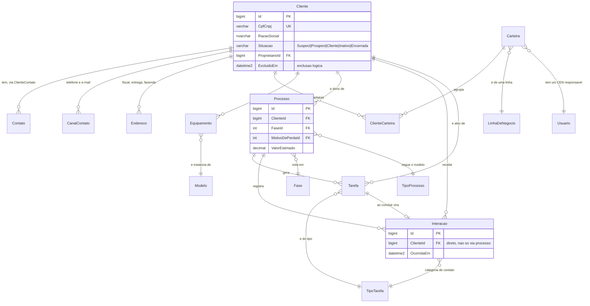
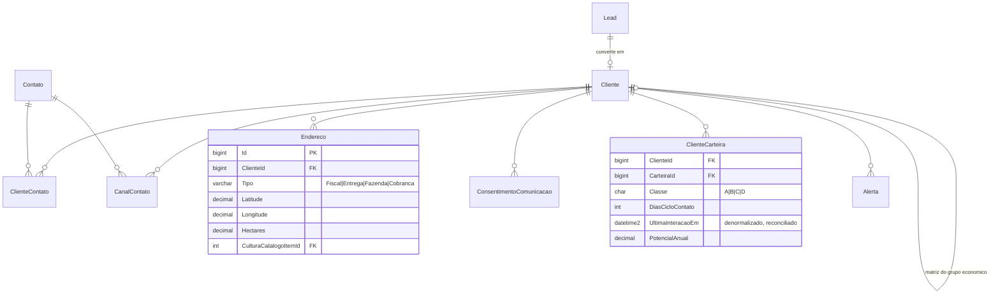
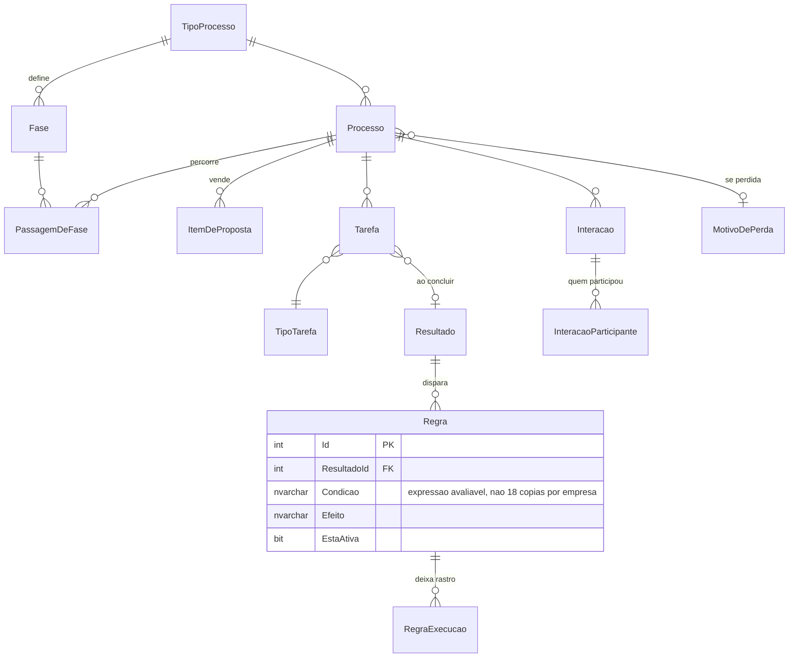
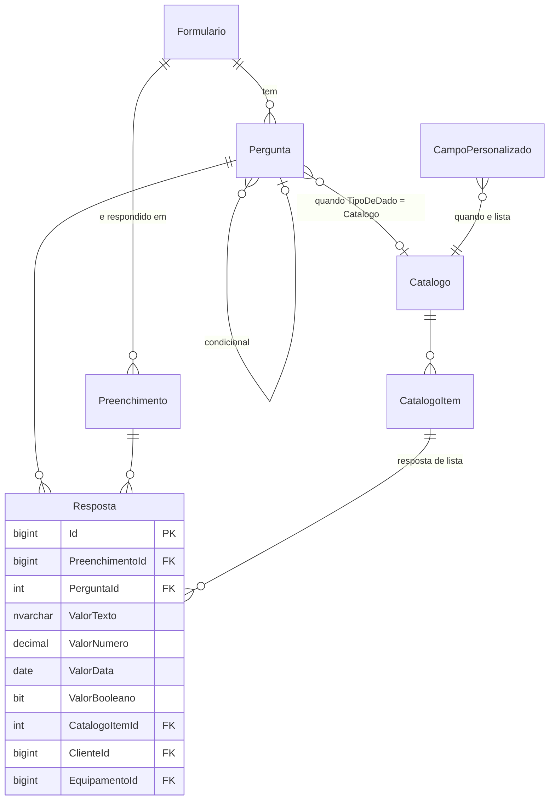
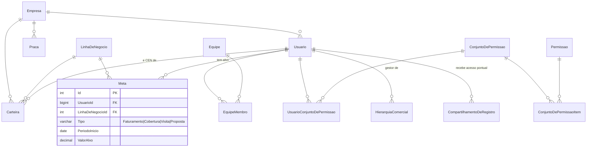
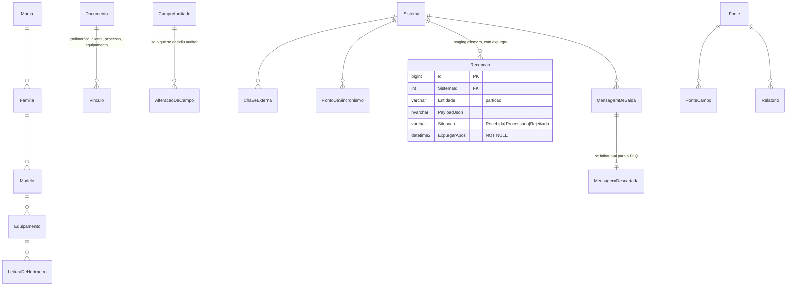

# Modelo unificado — 767 tabelas viram 63

> Requisito do Ricardo, 03/09/2026:
> **"não quero fazer igual o da Vórtice, quero tabelas mais organizadas, não quero 50 tabelas de
> cliente, unificar o que precisa ser unificado"**.
>
> Este documento responde a isso com número. Ele **revisa** o [04-MODELO-DADOS](04-MODELO-DADOS.md)
> — não o substitui — aplicando os nomes já decididos em
> [15-GLOSSARIO-E-NOMES](15-GLOSSARIO-E-NOMES.md). O que muda no doc 04 está na errata da seção 9.
>
> **Não edite o doc 04 a partir daqui.** Outra frente aplica a errata.
> Também não são deste documento o [14-PADRAO-DE-BANCO](14-PADRAO-DE-BANCO.md) nem o
> [16-HIGIENIZACAO-DE-DADOS](16-HIGIENIZACAO-DE-DADOS.md).

---

## Sumário

| Seção | O que responde |
|---|---|
| [1](#1-o-problema-medido) | Por que o Vórtice tem 29 cópias do cadastro do cliente — cada uma classificada |
| [2](#2-tabelas-que-fazem-a-mesma-coisa--a-varredura-por-assinatura) | A varredura por assinatura de colunas: 142 tabelas duplicadas, 91 elimináveis |
| [3](#3-as-oito-regras-de-unificação) | As sete regras de unificação, mais a regra de quando separar |
| [4](#4-o-caso-do-formulário--179-tabelas-viram-4) | O caso mais forte: 179 tabelas de formulário viram 4 |
| [5](#5-quem-é-dono-de-qual-dado--o-protheus-e-o-crm) | Protheus × CRM: dono do dado por entidade |
| [6](#6-o-formulário-do-cen-puxa-de-tabela) | As tabelas de referência que alimentam cada campo do formulário |
| [7](#7-a-visão-360-é-um-painel-de-crm) | O que a Visão 360 lê, por qual chave |
| [8](#8-o-modelo-unificado-tabela-a-tabela) | As 63 tabelas, uma a uma, e o que cada uma substitui |
| [9](#9-errata-do-documento-04) | O que muda no doc 04: renomeações, fusões, remoções, acréscimos |
| [10](#10-como-o-modelo-cresce-sem-virar-o-vórtice) | O portão de tabela nova e o teto saudável |
| [11](#11-diagramas) | Mermaid do núcleo e de cada schema |

**Origem dos números.** Salvo indicação em contrário, tudo vem de
`c:\projetos\vortice-crm-agent\schema\tabelas.csv` e `colunas.csv` — snapshot de **03/06/2026**,
**767 tabelas de usuário, 85.455.292 linhas somadas**. A varredura de duplicatas está em
`docs\extracao-vortice\tabelas-duplicadas.txt` e é reexecutável por
`scripts\banco\detectar-duplicatas.py`. Os achados qualitativos vêm de
`docs\extracao-vortice\00-RELATORIO-EXTRACAO.md`. As telas vêm de
`docs\prototipo\03-MODELO-DE-DADOS-IMPLICITO.md` e de `prototipo\dados-seed\*.json`.

> Nota sobre duas contagens de linhas. `tabelas.csv` soma **85.455.292** linhas; o relatório de
> extração fala em "86,3 milhões". A diferença é o momento da coleta (o relatório usou
> `sys.dm_db_partition_stats` numa segunda passada). Onde este documento diz "85,4 milhões", é a
> soma exata do CSV.

---

## 1. O problema, medido

### 1.1 O tamanho do problema

| Conceito (busca pelo nome da tabela) | Tabelas | Com dados | Vazias | Linhas |
|---|---:|---:|---:|---:|
| Cliente / pessoa / contato | **79** | 51 | 28 | 3.970.064 |
| Processo / oportunidade | 34 | 20 | 14 | 17.805.189 |
| Agenda / ação | 51 | 32 | 19 | 12.732.838 |
| Histórico / interação | 5 | 4 | 1 | 4.266.012 |
| Equipamento / veículo | 35 | 20 | 15 | 11.630.479 |
| Título / financeiro / cobrança | 33 | 20 | 13 | 5.195.614 |
| Usuário / permissão | 17 | 14 | 3 | 76.571 |
| Formulário (`IV_Q_*` e afins) | **177** | 145 | 32 | 173.101 |

*Medição do Ricardo, 03/09/2026, sobre `tabelas.csv` + `colunas.csv`. Três linhas foram
reproduzidas aqui exatamente (cliente 79/51/28, processo 34/20/14, histórico 5/4/1); as demais
usam recorte de expressão ligeiramente diferente do meu e a ordem de grandeza é a mesma.*

**139 tabelas** carregam `SeqPessoa`, `CNPJ` ou `CPF`.
*(Reproduzindo com o critério mais próximo — coluna exatamente `SeqPessoa`, ou coluna exatamente
`CNPJ`/`CPF`/`CNPJCPF`/`CPF_CNPJ`/`CNPJ_CPF` — dá 143. As 4 de diferença são tabelas de fronteira.
A conclusão não muda: **um em cada cinco objetos do banco fala de pessoa**.)*

Carregar a chave é normal — é assim que se aponta para o cliente. O problema são as que **copiam o
cadastro**.

### 1.2 As 29 que copiam o cadastro

**Critério, reexecutável:** a tabela guarda como coluna própria o **nome** da pessoa
(`NomeRazao`, `Fantasia`, `Nome`, `NomePuro`) e/ou o **documento**
(`NroCGCCPF`, `NroCNPJCPF`, `CGCCPF`, `CNPJ`, `CPF`, `CNPJX`), **e** o assunto dela é o cadastro de
pessoa / contato / cliente — seja pelo nome da tabela (`%PESSOA%`, `%CONTATO%`, `%CLIENTE%`), seja
por reproduzir o bloco cadastral do `GE_Pessoa` sob outro nome (`ww`, `TEMP`, `IMP_REL_TBA101`,
`IMP_REL_TBA101_PG2`, `GE_IMPORTA_CART`, `GE_FCadRPes`, `GE_FCadConj`).

Ficam de fora as tabelas de **outro fato** que só carregam o documento desnormalizado —
`IMP_Titulo`, `EXT_NFS`, `IMP_OS`, `IMP_NFS`, `nfsaida$`, `EXT_Pedido`, `IMP_Pedido`,
`IMP_VEICULO*`, `X_TOTVS_CRM_FATURAMENTO`. São mais 11, e o defeito delas é outro (regra 4).

Dá **29 tabelas, 597.014 linhas — 18 com dados, 11 vazias**.

| # | Tabela | Linhas | Causa | Por que existe |
|---:|---|---:|---|---|
| 1 | `GE_PessoaNomeFonema` | 151.583 | **índice materializado** | busca fonética virou tabela: `SeqPessoa`, `SeqContato`, `NomeRazao`, `NomePuro` — quatro colunas que só existem para achar "Salvador Arena" quem digitou "salvadr arena" |
| 2 | `GE_Pessoa` | 118.463 | **o mestre** | a única legítima |
| 3 | `GE_Pessoa_BKPJUN` | 88.142 | **backup virou tabela** | 76 colunas, assinatura idêntica ao mestre |
| 4 | `EXT_Pessoa` | 57.682 | **staging nunca limpo** | camada de entrada do ERP que virou segunda fonte da verdade — 77 colunas |
| 5 | `GE_Contato` | 41.164 | **o mestre do contato** | a única legítima do contato |
| 6 | `GE_Pessoa_ITA` | 28.377 | **backup virou tabela** | sufixo de uma migração da Itaipu/ITA que ficou |
| 7 | `GE_Contato_BKPJUN` | 28.051 | **backup virou tabela** | — |
| 8 | `EXT_Pessoa_bkpago22` | 27.280 | **backup de staging** | backup de agosto/22 de uma tabela que já era cópia |
| 9 | `IMP_LINKPESSOA` | 20.757 | **staging nunca limpo** | 4 colunas: `PESSOALINK`, `CGCCPF`, `NROCGCCPF`, `DIGCGCCPF` — um de-para de chave que virou tabela permanente |
| 10 | `GE_PessoaVersao` | 12.019 | **versionamento manual** | 19 colunas com `NomeRazao`, `NroCGCCPF`, `DtaAtualizacao`, `UsuAlterou`, `TipoAlteracao`, `Justificativa` — auditoria implementada como cópia |
| 11 | `GE_Contato_ITA` | 10.866 | **backup virou tabela** | — |
| 12 | `ww` | 8.991 | **rascunho esquecido** | 22 colunas, `Nome` + `CPF_CNPJ` + `NroCGCCPF`. O nome da tabela é `ww` |
| 13 | `OUT_Pessoa` | 1.918 | **módulo paralelo** | o módulo de marketing de saída recadastrou a pessoa em vez de reusar. Parou em **05/12/2016** |
| 14 | `TEMP` | 1.026 | **rascunho esquecido** | 3 colunas: `CPF`, `CARTEIRA`, `SEQCARTEIRA`. A tabela chama `TEMP` e tem mil linhas há anos |
| 15 | `IMP_REL_TBA101` | 318 | **cópia para relatório** | 29 colunas achatando cliente + processo + equipamento + carteira num único registro de relatório |
| 16 | `IMP_REL_TBA101_PG2` | 208 | **cópia para relatório** | a "página 2" do mesmo relatório virou uma segunda tabela |
| 17 | `OUT_Contato` | 147 | **módulo paralelo** | o contato do módulo de saída |
| 18 | `GE_IMPORTA_CART` | 22 | **staging nunca limpo** | 52 colunas do cadastro para importar carteira |
| 19 | `IMP_PESSOA` | 0 | **staging nunca limpo** | 76 colunas, assinatura do mestre, zero linhas |
| 20 | `IMP_PESSOACONTATO` | 0 | **staging nunca limpo** | — |
| 21 | `EXT_PESSOACONTATO` | 0 | **staging nunca limpo** | 29 colunas, par exato de `IMP_PESSOACONTATO` |
| 22 | `CBR_CLIENTECONTA` | 0 | **módulo paralelo** | o motor de cobrança criou "a pessoa da cobrança": `CPF`, `STATUS`, `DIASATRASO`, `SALDOATUAL` |
| 23 | `IV_CARTPESSOA` | 0 | **módulo paralelo** | 53 colunas — o módulo de cartão de crédito recadastrou a pessoa com nome do pai, da mãe, CNH e carteira de trabalho |
| 24 | `GE_FCadRPes` | 0 | **módulo paralelo** | a ficha cadastral de crédito recadastrou o sócio |
| 25 | `GE_FCadConj` | 0 | **módulo paralelo** | e o cônjuge |
| 26 | `GE_CONTATOAPP` | 0 | **módulo paralelo** | o app móvel criou o contato dele, com `USUARIO`, `SENHA` e `FCMTOKEN` |
| 27 | `GE_Pessoa_BKP28052025` | 0 | **backup virou tabela** | backup de 28/05/2025 — vazio, e continua no catálogo |
| 28 | `GE_PessoaAlt` | 0 | **versionamento manual** | 68 colunas: a "pessoa alterada" |
| 29 | `GE_PessoaDel` | 0 | **versionamento manual** | 76 colunas + `DtaDel` + `UsrDel`: a "pessoa excluída". Exclusão lógica implementada como tabela |

### 1.3 A conta por causa

| Causa | Tabelas | Linhas | No nosso modelo |
|---|---:|---:|---|
| Backup virou tabela | 6 | 182.716 | **0** — vai para o backup, não para uma tabela irmã |
| Staging de integração nunca limpo | 6 | 78.461 | **0** permanente — `integracao.Recepcao`, efêmera, com expurgo declarado |
| Cópia desnormalizada para relatório | 2 | 526 | **0** — `relatorio.Fonte` lê, não copia |
| Índice auxiliar materializado | 1 | 151.583 | **0** — coluna computada + índice em `comercial.Cliente` |
| Versionamento manual | 3 | 12.019 | **0** — `auditoria.AlteracaoDeCampo` + `ExcluidoEm` |
| Módulo paralelo que não reusou o cadastro | 7 | 2.065 | **0** — todo módulo aponta para `comercial.Cliente` |
| Rascunho esquecido (`ww`, `TEMP`) | 2 | 10.017 | **0** — não existe |
| **Os mestres legítimos** (`GE_Pessoa`, `GE_Contato`) | **2** | 159.627 | **`comercial.Cliente`** e **`comercial.Contato`** |
| **Total** | **29** | **597.014** | **2** |

**A resposta.** Das 29, **22 são cópias do cadastro do cliente e viram uma tabela**:
`comercial.Cliente`. As outras 7 são do contato e viram `comercial.Contato`.

> **Quantas tabelas de cliente teremos? Uma.**

---

## 2. Tabelas que fazem a mesma coisa — a varredura por assinatura

A seção 1 olhou o nome. Mas tabela duplicada nem sempre tem nome parecido: `GE_LgTb` e
`GE_LOG_PROCESSO` não se parecem em nada e são a mesma tabela. Então se varreu a **assinatura de
colunas**.

### 2.1 O método (reexecutável)

`scripts\banco\detectar-duplicatas.py`, lendo `c:\projetos\vortice-crm-agent\schema\*.csv`:

1. Das 767 tabelas, considerar as **694 com 3 ou mais colunas** (abaixo disso a assinatura não
   discrimina nada).
2. **Passada 1 — conjunto de colunas idêntico.** Agrupar por `frozenset(colunas em maiúscula)`.
3. **Passada 2 — Jaccard ≥ 0,75** entre todos os pares, com os pares agrupados em **componentes
   conexas** (union-find). Pega o clone que ganhou ou perdeu uma ou duas colunas.

```
python scripts/banco/detectar-duplicatas.py
```

Saída conferida contra `docs\extracao-vortice\tabelas-duplicadas.txt`: idêntica.

### 2.2 O resultado

| Passada | Grupos | Tabelas |
|---|---:|---:|
| Conjunto de colunas **idêntico** | **34** | **90** |
| Jaccard ≥ 0,75 (180 pares) agrupados | **51** | **142** |

**142 tabelas do Vórtice — 18,5% do catálogo — são cópia de outra tabela. Elas guardam
47.555.362 linhas, 56% de todo o banco.** Se cada conjunto ficasse com uma tabela só,
**91 tabelas desapareciam sem perder um conceito.**

### 2.3 Os conjuntos que mais importam, por causa

#### Clone por assunto — a auditoria copiada dez vezes

| Tabela | Linhas |
|---|---:|
| `GE_LOG_PROCESSO` | 12.678.640 |
| `GE_LgTb` | 11.861.777 |
| `IV_AgendaLog` | 11.049.475 |
| `GE_LOG_HISTORICO` | 1.015.045 |
| `GE_LOG_PESSOA` | 943.712 |
| `GE_LOG_TRANS` | 782.089 |
| `GE_LOG_EXT` | 622.075 |
| `GE_LOG_CONFIG` | 108.492 |
| `GE_LOG_CONTATO` | 19.785 |
| `GE_LOG_CARTCRED` | 0 |
| **10 tabelas, mesma estrutura de 10 colunas** | **~39,1 milhões** |

Uma tabela de auditoria clonada por assunto. Somando `GE_Log2` (4.394.779) e as três "versão da
pessoa" (`GE_PessoaVersao`, `GE_PessoaAlt`, `GE_PessoaDel`), são **22 tabelas e 43.673.105
linhas — 51% do banco** para fazer uma coisa só.
E o relatório de extração mostra que nem expurgo houve: `GE_LgTb` recebeu ~2,4 milhões de
linhas/ano até **2023 e parou**; `GE_LOG_PROCESSO` **começou em 2023** e fez 6,7 milhões em 2024.
Trocaram o mecanismo e deixaram o anterior. Os logs ocupam **13,7 GB dos 32,4 GB** do banco.

**No nosso modelo:** `auditoria.AlteracaoDeCampo`, **uma**, particionada por data, com retenção
declarada e escopo definido em `auditoria.CampoAuditado` — audita-se o campo que precisa, não tudo.

#### Backup e staging convivendo como se fossem coisas diferentes — o título

`IMP_Titulo` (823.952) · `EXT_Titulo` (577.925) · `X_T_IMP_CRM_TITULO` (462.391) ·
`X_T_IMP_CRM_TITULO_bkp_11_04` (121.381) · `EXT_Titulo_bkp_11_04` (108.061) ·
`EXT_Titulo_BKP_22_03_2023_BAIXADOS` (16.705) · `EXT_Titulo_BKP_22_03_2023` (4.635) ·
`IMP_Titulo_bkp_11_04` (2.168)

**8 tabelas, 42 colunas cada, 2.117.218 linhas.** O staging de entrada, a versão consolidada e
cinco backups. Ninguém sabe qual vale.

#### Filhas de pessoa em triplicata

| Conceito | Cópias | Tabelas |
|---|---:|---|
| Telefone | 3 | `GE_PessoaFone` · `_BKPJUN` · `_ITA` |
| Endereço | 3 | `GE_PessoaEnd` · `_BKPJUN` · `_ITA` |
| Relação entre pessoas | 4 | `GE_PessoaRelacao` · `_BKPJUN` · `_ITA` · `OUT_PessoaRelacao` |
| Papel do contato | 3 | `GE_ContatoPapel` · `_BKPJUN` · `_ITA` |
| Contato | 3 | `GE_Contato` · `_BKPJUN` · `_ITA` |
| **Chave externa da pessoa** | **5** | `GE_PessoaLink` · `_bkpago22` · `_BKPJUN` · `Linkbkp` · `_ITA` |
| Cidade | 3 | `GE_Cidade` · `_BKPJUN` · `_CRM` |
| Usuário / permissão / membro | 2+2+2 | `GE_Usuario`, `GE_UsuarioPerm`, `GE_Membro` e seus `_BKP20250520`/`_BKPJUN` |
| Propriedade do cliente | 3+3+2 | `IV_Propriedade`, `IV_ClientePropr`, `IV_PropriLista` e cópias |

#### Clone por variação de negócio — o formulário

`IV_Q_GESTAO_CREDITO` / `_IMP` / `_AMS` · `IV_Q_OS_GARANTIA` / `IV_Q_OS_CORTESIA` ·
`IV_Q_APRESENTACAO` / `_JDE` · `IV_Q_OFERECE_RENOV_SEGURO` / `IV_Q_VENDER_RENOVACAO_SEG` ·
`IV_Q_DEMONSTRACAO_TRATOR` / `IV_Q_DEMO_IMPLEMENTO` / `IV_Q_DEMO_TRATOR` ·
`IV_Q_VENDAPERDIDA_SEGURO` / `IV_Q_VP_RENOVACAO_SEGURO` / `IV_Q_CANCELAMENTO_SEGURO` ·
`IV_Q_QUALIDADE_PECAS` / `_SERVICOS` / `_VENDAMAQ` ·
`IV_Q_COMPETIDORES_NA_NEG` / `IV_Q_COMPETIDORES_NA_NEGO` (uma letra de diferença, 104 e 101 linhas)

É a prova de que **materializar o formulário obriga a clonar a tabela para cada variação** — trocar
"trator" por "implemento" no cabeçalho exige uma tabela nova. Ver seção 4.

#### Clone por linha de negócio — a segmentação

`IVS_Pes` (138.584) / `IVS_Pes_RAO_Pneus_02_03` (18.261) · `IVS_PES_MAQ_PECAS` (1.365) /
`IVS_PES_PNEUS` (1.313) · `IVS_PES_NELSON` (134.872 — uma tabela com nome de pessoa).
A segmentação por linha de negócio virou tabela por linha de negócio. No nosso modelo é a coluna
`LinhaDeNegocioId` em `comercial.ClienteCarteira`.

#### Grafia abandonada — dois nomes, um conceito, um deles morto

| Vivo | Linhas | Morto | Linhas |
|---|---:|---|---:|
| `GEP_EMAILSENT` | 571.866 | `GEP_EMailSend` | 0 |
| `IV_CBRCRITMON` | 128.167 | `IV_CobrCritMon` | 0 |
| `EXT_Produto` | 78.749 | `IMP_PRODUTO` | 0 |
| — | 0 | `IV_FoneCtrl` / `IV_FoneCtrl2` | 0 / 0 |
| — | 0 | `DMN_DocProj` / `IV_ProjDocto` | 0 / 0 |
| — | 0 | `IV_PUSH` / `IV_USRPUSH` | 0 / 0 |
| — | 0 | `IMP_EMAIL` / `EXT_EMAIL` | 0 / 0 |
| — | 0 | `EXT_Pedido` / `IMP_Pedido` | 0 / 0 |

Isso é o que acontece sem convenção de nome e sem portão: alguém não achou a tabela que existia,
criou outra com outra grafia, e as duas ficaram. É exatamente o defeito que o
[15-GLOSSARIO-E-NOMES](15-GLOSSARIO-E-NOMES.md) existe para impedir.

### 2.4 A conta da varredura

| | Tabelas |
|---|---:|
| Envolvidas em duplicação | **142** |
| Sobreviveriam (uma por conjunto) | 51 |
| **Elimináveis só por deduplicar** | **91** |

**Noventa e uma tabelas do Vórtice desaparecem sem que se decida nada de modelagem** — basta
parar de tratar backup, staging e clone como entidade. É a resposta mais direta ao pedido do
Ricardo, e ela vem antes de qualquer desenho novo.

---

## 3. As oito regras de unificação

### Regra 1 — Um conceito, uma tabela

Cliente é `comercial.Cliente` e ponto. Prospect, cliente ativo e ex-cliente são **situação**, não
tabela.

| | |
|---|---|
| **O que ela mata no Vórtice** | as 29 cópias do cadastro da seção 1; `IVS_PES_MAQ_PECAS` / `IVS_PES_PNEUS` / `IVS_Pes_RAO_Pneus_02_03` (a segmentação clonada por linha); `IV_Q_DEMONSTRACAO_TRATOR` / `IV_Q_DEMO_IMPLEMENTO` (o formulário clonado por produto) |
| **Como resolvemos** | `comercial.Cliente.Situacao` com domínio fechado (`Suspect`, `Prospect`, `Cliente`, `ClienteInativo`, `Encerrada`) e `CHECK` no banco. O Vórtice fez isso num `char(1)`: `P`=76.048, `A`=39.624, `S`=1.416, `F`=54, `O`=25, `I`=5 e **2.126 linhas em branco** que a view do próprio fornecedor devolve como `'???'` |
| **Como se verifica** | `SELECT COUNT(*) FROM sys.tables WHERE name LIKE '%Cliente%'` tem que devolver o número de tabelas do schema `comercial` que legitimamente falam de cliente — hoje 4 (`Cliente`, `ClienteContato`, `ClienteCarteira`, mais `Contato`). Qualquer quinta exige o portão da seção 10 |

### Regra 2 — Backup não mora no banco

Vai para o backup. Nunca para uma tabela irmã.

| | |
|---|---|
| **O que ela mata** | **37 tabelas, 2.026.915 linhas** com marca de backup no nome: `GE_Pessoa_BKPJUN` (88.142), `GEP_Import_bkpjun` (502.009), `X_V_IMP_CRM_IMP_NF_BKP_18_09_2023` (415.762), `IV_ClientePropr_ITA` (157.900), `GE_PessoaLink_bkpago22` (92.068)… até `IV_Processo_bkp20250717` e `IV_Agenda_bkp20250717`, **com uma linha cada** — alguém salvou "por precaução" e deixou |
| **Como resolvemos** | backup é `BACKUP DATABASE` com retenção, e restauração pontual é `RESTORE ... WITH MOVE` num banco de trabalho separado. Antes de uma migração destrutiva, snapshot do banco — não `SELECT INTO`. Nenhuma tabela do modelo tem sufixo de data |
| **Como se verifica** | o teste de nomenclatura do [14-PADRAO-DE-BANCO](14-PADRAO-DE-BANCO.md) barra qualquer objeto cujo nome case com `_BKP`, `_bkp`, `bkpago`, `bkpjun`, `_ITA`, ou termine em 6 a 8 dígitos |

### Regra 3 — Staging de integração é efêmero e fica noutro lugar

Schema `integracao`, com expurgo declarado. **Nunca vira segunda fonte da verdade.**

| | |
|---|---|
| **O que ela mata** | **76 tabelas, 19.479.276 linhas**: os 46 `EXT_*`, os 23 `IMP_*`, os 8 `X_*` e os `GEP_Import*`. Entre elas, `EXT_Pessoa` (57.682) e `IMP_PESSOA` (0) — duas cópias do cadastro que nasceram como área de pouso e viraram permanentes. E `EXT_VeicModelo`, com **4.431.168 linhas** para catalogar modelo de máquina, ao lado de `EXT_VeicMarca` com **5 marcas** |
| **Como resolvemos** | `integracao.Recepcao` — **uma** tabela, com `SistemaId`, `Entidade`, `ChaveOrigem`, `PayloadJson`, `RecebidoEm`, `Situacao`, `ExpurgarApos`. Particionada por `Entidade`, o que dá a separação por entidade que o Vórtice buscou com 76 tabelas, e expurgada por `ExpurgarApos` (padrão: 30 dias após processada). O dado consolidado vai para a tabela de negócio; a linha bruta some |
| **Como se verifica** | job diário de expurgo; alerta se `MAX(RecebidoEm)` de qualquer `Entidade` estiver a mais de 24 h — foi exatamente o que ninguém viu quando o faturamento parou em **11/04/2025 e ficou 17 meses parado sem alarme** |

### Regra 4 — Relatório não copia dado

Lê de fonte curada (`relatorio.Fonte`).

| | |
|---|---|
| **O que ela mata** | `IMP_REL_TBA101` (318 linhas, 29 colunas achatando cliente + processo + equipamento + carteira) e `IMP_REL_TBA101_PG2` (208) — a "página 2" do relatório virou uma segunda tabela. Mais `GE_QVCons` (134 consultas do motor QlikView), `GE_CONSSQL`, `IV_ListSQL` (360 SQLs para popular listas de tela) e as **411 views** |
| **Como resolvemos** | `relatorio.Fonte` declara **quais entidades, quais campos e qual filtro de segurança** um relatório pode ler; `relatorio.FonteCampo` diz o rótulo de negócio de cada campo. O relatório é uma consulta sobre a fonte, e a fonte lê a tabela viva. Nada é copiado. Onde a leitura pesar (Visão 360 do diretor, seção 7), a fonte pode ser materializada — mas **com carimbo `AtualizadoEm` visível na tela**, e sem virar tabela que alguém edita |
| **Como se verifica** | nenhuma tabela do modelo tem o prefixo `REL_` nem repete coluna de identificação de outra. Auditoria: para cada tabela nova, "que outra tabela já tem esta coluna?" |

### Regra 5 — Índice é índice

Busca fonética ou normalizada é coluna computada ou índice — não tabela.

| | |
|---|---|
| **O que ela mata** | `GE_PessoaNomeFonema` (**151.583 linhas**, 4 colunas), `GE_PessoaFonema` (455.993), `GE_PessoaSimilar` (124.222), `IV_SelecaoPessoa` (582.481), `ge_pessoaativa`, `GE_PESSOAATIVAUSR`. **Seis tabelas e 1,3 milhão de linhas que não guardam um fato — guardam um jeito de procurar.** Some `EXT_VeicPlanoMan` (3.571.257) e `EXT_VeicModPlano` (3.571.235): o plano de manutenção materializado no produto cartesiano modelo × item |
| **Como resolvemos** | a **colação `Latin1_General_CI_AI` na própria coluna `comercial.Cliente.NomeRazao`**, com índice filtrado: ela ignora caixa E acento em igualdade, em `LIKE` e em unicidade, então "Jose" encontra "José" sem nenhuma coluna derivada. *(Errata de 04/09/2026: a versão anterior deste documento previa uma coluna computada persistida `NomeNormalizado`; ela deixou de existir quando a colação passou a resolver o mesmo problema — [doc 20, seção 4.3](20-DECISAO-SQL-SERVER.md).)* Busca aproximada, se vier a ser necessária, é índice full-text do SQL Server. "Cliente ativo" é `WHERE Situacao = 'Cliente' AND ExcluidoEm IS NULL` com índice filtrado, não uma tabela |
| **Como se verifica** | tabela cujo conteúdo é derivável 100% de outra tabela por função determinística **é índice**. Se não guarda decisão humana nem fato do mundo, não é tabela |

### Regra 6 — Versão e exclusão são auditoria

`auditoria.AlteracaoDeCampo` e exclusão lógica — não três tabelas paralelas.

| | |
|---|---|
| **O que ela mata** | `GE_PessoaVersao` (12.019), `GE_PessoaAlt` (0, 68 colunas), `GE_PessoaDel` (0, 76 colunas + `DtaDel` + `UsrDel`); e as 22 tabelas de log da seção 2.3, com **43,7 milhões de linhas e 13,7 GB** |
| **Como resolvemos** | `comercial.Cliente.ExcluidoEm` (exclusão lógica, com índice filtrado em todo lugar) + `auditoria.AlteracaoDeCampo` (entidade, registro, campo, valor anterior, valor novo, quem, quando) + `auditoria.CampoAuditado` para **escolher o que se audita**. Não se audita tudo: é isso que produz 39 milhões de linhas de log |
| **Como se verifica** | nenhuma tabela do modelo tem irmã com sufixo `Versao`, `Alt`, `Del`, `Hst` ou `Log`. A retenção de `auditoria.AlteracaoDeCampo` é declarada e existe job de expurgo — o Vórtice tem o job `LOG_COMPACTA` no catálogo e **não o agendou** |

### Regra 7 — Módulo novo reusa o cadastro

Não existe "pessoa do módulo de cobrança".

| | |
|---|---|
| **O que ela mata** | `CBR_CLIENTECONTA` (o cliente da cobrança), `IV_CARTPESSOA` (a pessoa do cartão, 53 colunas com nome do pai e da mãe), `GE_FCadRPes` e `GE_FCadConj` (o sócio e o cônjuge da ficha de crédito), `OUT_Pessoa` e `OUT_Contato` (o módulo de marketing), `GE_CONTATOAPP` (o contato do app), `EXT_Vendedor` + `IV_VENDEDOR` + `GE_Usuario` (três cadastros de vendedor) |
| **Como resolvemos** | módulo novo aponta para `comercial.Cliente.Id`. O que é específico do módulo vai em **coluna do módulo**, ou em `metadado.CampoPersonalizado` se não merecer release. O vendedor é `seguranca.Usuario` com papel de CEN — não uma tabela por módulo |
| **Como se verifica** | toda tabela nova que fale de pessoa tem FK obrigatória para `comercial.Cliente` ou `comercial.Contato`. Sem FK, não passa no *code review* de banco |

### Regra 8 — Quando separar é o certo

**Unificar demais também é defeito.** Se tudo virasse coluna de `comercial.Cliente`, a tabela teria
as 76 colunas do `GE_Pessoa` — com `FoneDDD1`, `FoneNro1`, `FoneCmpl1`, `FoneDDD2`, `FoneNro2`,
`FoneCmpl2`, `FoneDDD3`, `FoneNro3`, `FoneCmpl3`, `FaxDDD`, `FaxNro`. **Onze colunas para guardar no
máximo três telefones e um fax**, e o quarto telefone não cabe.

**O critério de decisão. Vira tabela filha quando qualquer uma for verdadeira:**

| Critério | Exemplo que passa | Exemplo que não passa |
|---|---|---|
| **Cardinalidade > 1** — o cliente pode ter mais de um | telefone, e-mail, endereço, contato, equipamento | CNPJ (é um só) |
| **Ciclo de vida próprio** — nasce, muda e morre em momento diferente do pai | consentimento de comunicação (tem data, prova e revogação) | razão social (muda com o pai) |
| **Precisa ser apontada** — outra tabela tem FK para ela | `comercial.Contato` (a interação aponta para o contato que participou) | `NomeFantasia` |
| **Precisa de segurança própria** — visibilidade diferente da do pai | documento anexado | cidade |
| **Volume desproporcional** — o filho cresce muito mais que o pai | `processo.Interacao` (2,4 M para 118 mil clientes) | `Porte` |

**E vira coluna quando nenhuma for verdadeira.** `Classe` (A/B/C/D) é coluna de
`comercial.ClienteCarteira`, não `GE_PessoaClasse` com 1.878 linhas. `Latitude`/`Longitude` são
colunas de `comercial.Endereco`, não uma tabela de geolocalização.

**A regra de ouro:** *tabela guarda fato ou decisão; coluna guarda atributo; índice guarda jeito de
procurar.* As três coisas confundidas produzem 767 tabelas.

---

## 4. O caso do formulário — 179 tabelas viram 4

Este é o exemplo mais forte de "não repetir o Vórtice".

### 4.1 O que o Vórtice faz

O Vórtice cria **uma tabela física por formulário**.

| Medida | Valor | Origem |
|---|---:|---|
| Tabelas `IV_Q_*` | **175** | `tabelas.csv` |
| Colunas somadas nelas | **2.601** | `colunas.csv`, média de 14,9 por tabela |
| Linhas somadas nelas | 87.532 | `tabelas.csv` |
| `IV_Q_*` **com dados** / **vazias** | 143 / **32** | 32 formulários ganharam tabela e nunca receberam resposta |
| Formulários definidos (`IV_Formulario`) | **176** | `tabelas.csv` |
| Questões definidas (`IV_Questao`) | **2.300** | o relatório de extração registra 2.303 — diferença de snapshot |
| Opções de lista (`IV_QuestaoLista`) | 3.995 | |
| Respostas (`IV_Questionario`) | **85.393** | |
| Formulários em uso corrente | **33** | medição do Ricardo, 03/09/2026 |

A maior delas, `IV_Q_ACOMPANH_VENDA_JDE`, tem **104 colunas** — entre elas `Q058_RADIO_450MHZ`,
`Q058_KIT_AL207195`, `Q058_MONITOR_GEN4_42`, `INFORMACOES_AGREGA__`, `DATA_VENCIMENTO_SINA`.
Nomes truncados em 20 caracteres, gerados pelo motor a partir do texto da pergunta.

### 4.2 Por que isso acontece

O motor do Vórtice guarda a **definição** normalizada (`IV_Formulario` → `IV_Questao` →
`IV_QuestaoLista`) mas materializa a **resposta** numa tabela física por formulário, uma coluna por
pergunta. Motivo original: deixar o relatório fácil — `SELECT * FROM IV_Q_VENDA` devolve uma linha
por resposta com as perguntas em colunas, sem pivô.

O preço vem depois.

### 4.3 O que custa

1. **Publicar formulário é DDL.** Criar uma pergunta é `ALTER TABLE`. Mudar o tipo de uma pergunta é
   migração. Renomear é quebrar relatório.
2. **Variação de negócio vira tabela nova.** Provado na seção 2.3: `IV_Q_GESTAO_CREDITO` / `_IMP` /
   `_AMS`; `IV_Q_APRESENTACAO` / `_JDE`; `IV_Q_DEMONSTRACAO_TRATOR` / `IV_Q_DEMO_IMPLEMENTO` /
   `IV_Q_DEMO_TRATOR`. E `IV_Q_COMPETIDORES_NA_NEG` (104 linhas) ao lado de
   `IV_Q_COMPETIDORES_NA_NEGO` (101) — **uma letra**.
3. **As regras do processo ficam reféns.** `GE_ObjDinamico` guarda 196 SQLs de regra de negócio
   dentro do banco; **125 deles dependem diretamente das tabelas físicas de formulário**, com nomes
   escritos como `IV_Q$ACOMPANHAMENTO_VENDA` e traduzidos em runtime. Nenhuma ferramenta de
   dependência enxerga isso. Mexer numa tabela `IV_Q_*` quebra regra sem aviso.
4. **`IV_Questionario` é o objeto mais referenciado do banco.** **177 FKs apontam para ele**
   (`hubs.csv`) — mais que `GE_Pessoa`, que tem 50. O grafo do banco é dominado pelo motor de
   formulário, não pelo cliente.
5. **Não dá para perguntar de forma transversal.** "Quantas vendas perdemos por preço em 2026?" exige
   `UNION` sobre 14 tabelas `IV_Q_VENDA_PERDIDA*` com colunas de nomes diferentes.
6. **Nunca se limpa.** 32 tabelas vazias, e nenhuma vai ser removida porque ninguém sabe se alguma
   das 196 regras a usa.

### 4.4 Como nosso modelo resolve

Quatro tabelas, no schema `metadado`. Duas são a **definição**, duas são a **resposta**.

```
metadado.Formulario         Id · Codigo · Nome · TipoProcessoId · EstaAtivo · VersaoPublicada
   │
   └── metadado.Pergunta    Id · FormularioId · Ordem · Codigo · Texto
                            · TipoDeDado (Texto|Numero|Data|Booleano|Catalogo|Cliente|Equipamento)
                            · CatalogoId (quando TipoDeDado = Catalogo)
                            · EhObrigatoria · PerguntaCondicaoId · ValorCondicao

metadado.Preenchimento      Id · FormularioId · VersaoFormulario
                            · ClienteId · ProcessoId · TarefaId · InteracaoId
                            · PreenchidoPorId · PreenchidoEm · Situacao
   │
   └── metadado.Resposta    Id · PreenchimentoId · PerguntaId
                            · ValorTexto · ValorNumero · ValorData · ValorBooleano
                            · CatalogoItemId · ClienteId · EquipamentoId
```

**Por que quatro e não duas.** O par que substitui as 175 tabelas físicas é
`metadado.Preenchimento` + `metadado.Resposta` — **176 tabelas viram 2** (as 175 `IV_Q_*` mais
`IV_Questionario`). A definição (`IV_Formulario` + `IV_Questao`) vira `metadado.Formulario` +
`metadado.Pergunta`, e `IV_QuestaoLista` (3.995 opções) **não vira tabela**: as opções de lista são
`metadado.CatalogoItem`, reusando o catálogo geral. Contando o subsistema inteiro,
**179 tabelas viram 4**.

**As decisões que carregam esse desenho:**

| Decisão | Por quê |
|---|---|
| **Resposta tipada, não `nvarchar` para tudo** | uma coluna por tipo, com `CHECK` garantindo que exatamente uma esteja preenchida conforme `Pergunta.TipoDeDado`. Evita o EAV que devolve `'12/03/2024'` como texto e não ordena |
| **`CatalogoItemId` em vez de texto livre** | é a regra da seção 6. `IV_Processo.Status` tem `FINALIZADO` (18.416) ao lado de `FINALIZADA` (11.563) porque ninguém amarrou o campo a um catálogo |
| **`ClienteId` / `EquipamentoId` como colunas de resposta** | quando a pergunta é "qual concorrente?" ou "qual chassi?", a resposta é uma FK, não uma string. O Vórtice guarda `CHASSI` como texto em 30 tabelas `IV_Q_*` |
| **`VersaoFormulario` no preenchimento** | mudar o formulário não reescreve o passado. Hoje `ALTER TABLE` reescreve |
| **`PerguntaCondicaoId`** | pergunta condicional é dado, não tabela nova. É o que gerou `_IMP`, `_AMS`, `_JDE` |
| **Índice** | `metadado.Resposta` sobre `(PerguntaId, ValorTexto)`, `(PerguntaId, CatalogoItemId)` e `(PerguntaId, ValorNumero)` — filtrados por não-nulo. É o que sustenta a consulta de 4.5 |

### 4.5 A mesma pergunta, nos dois modelos

**"Quantas vendas perdemos por preço em 2026, e quanto valiam?"**

No Vórtice, é preciso saber de cor quais são as 14 tabelas de venda perdida e como cada uma nomeia
a coluna do motivo:

```sql
-- Vortice: uma consulta por tabela, unidas na mao, com nomes de coluna diferentes
SELECT 'JDE'  AS origem, MOTIVO_DA_PERDA, COUNT(*) FROM IV_Q_VENDA_PERDIDA_JDE   ... GROUP BY ...
UNION ALL
SELECT 'IMPL', MOTIVO,                    COUNT(*) FROM IV_Q_VENDA_PERDIDA_IMPL  ... GROUP BY ...
UNION ALL
SELECT 'FY25', MOTIVO_PERDA,              COUNT(*) FROM IV_Q_VENDA_PERDIDA_FY25  ... GROUP BY ...
-- ... mais 11 UNIONs, e o valor esta em outra tabela porque IV_Q_* nao guarda valor
```

No nosso modelo, uma consulta, sem `UNION`, e o valor vem do processo:

```sql
SELECT  ci.Descricao                AS Motivo,
        COUNT(*)                    AS Quantidade,
        SUM(pr.ValorEstimado)       AS Valor
FROM        metadado.Resposta       r
JOIN        metadado.Pergunta       p   ON p.Id  = r.PerguntaId
JOIN        metadado.Preenchimento  pf  ON pf.Id = r.PreenchimentoId
JOIN        metadado.CatalogoItem   ci  ON ci.Id = r.CatalogoItemId
JOIN        processo.Processo       pr  ON pr.Id = pf.ProcessoId
WHERE   p.Codigo        = 'MOTIVO_PERDA'
  AND   pf.PreenchidoEm >= '2026-01-01'
GROUP BY ci.Descricao
ORDER BY Valor DESC;
```

E como o motivo de perda tem tabela própria (`processo.MotivoDePerda`, seção 8), a pergunta que a
tela de Configurações realmente faz — "quais motivos foram usados nos últimos 90 dias?", o campo
`usos_90d` de `config-motivos-perda.json` — não precisa nem tocar em formulário: é `COUNT` sobre
`processo.Processo.MotivoDePerdaId`.

**Publicar um formulário novo no nosso modelo é `INSERT`.** Sem DDL, sem migração, sem release, e
sem risco de quebrar as regras.

---

## 5. Quem é dono de qual dado — o Protheus e o CRM

Sem isso, repetimos o Vórtice: a mesma pessoa existe em `GE_Pessoa`, `EXT_Pessoa` e `IMP_PESSOA` e
**ninguém sabe qual vale**.

### 5.1 O que existe hoje

O ERP é o **Protheus (TOTVS)**. O elo é **um único linked server**, `TOTVS`, produto `totvs6`,
provider **MSDASQL** sobre um **DSN ODBC do Windows**, apontando para a base **`TMPRD`**.
`is_rpc_out_enabled = False` — **o CRM só lê**. Oito views dependem dele:
`X_V_COL_CRM_PESSOA`, `X_V_IMP_CRM_TITULO`, `X_V_BI_FATURAMENTO_PECAS`,
`X_V_BI_FATURAMENTO_SERVICOS`, `X_V_COL_CLIENTE_CRM`, `X_V_CRM_FATURAMENTO_MAQUINAS`,
`X_V_CRM_FATURAMENTO_PECAS`, `X_V_CRM_FATURAMENTO_SERVICOS`.
*(Achado 13 do relatório de extração. A string de conexão real está no registro do Windows do
servidor, fora de qualquer repositório versionado, e o mapeamento de login retornou zero linhas —
não se sabe com qual credencial o CRM lê o ERP.)*

Abaixo disso, a camada `X_TOTVS_*` de staging — 8 tabelas, 3.044.200 linhas — e as 69 tabelas
`EXT_*`/`IMP_*`. A integração de faturamento **parou em 11/04/2025** e ficou 17 meses parada sem
que ninguém percebesse.

O protótipo aprovado já mostra **"Ativos no Protheus"** na tela de Clientes e **"Equipamentos ativos
no Protheus"** na Cobertura, e a Ficha do Cliente traz `origem_alteracao: "Protheus-Sync ·
22/08/2026 14:31"`. O dono do dado é informação de **tela**, não só de arquitetura.

### 5.2 A matriz de propriedade

| Entidade | Nossa tabela | Dono | O CRM escreve? | Precedência |
|---|---|---|---|---|
| Cliente **cadastrado** (com nota fiscal) | `comercial.Cliente` | **Protheus** | não nos campos fiscais | Protheus vence em `RazaoSocial`, `CpfCnpj`, `InscricaoEstadual`, `Cnae`, endereço fiscal. Divergência gera tarefa, não sobrescrita silenciosa |
| Cliente **prospect** (sem nota fiscal) | `comercial.Cliente` | **CRM** | sim | CRM é dono até a primeira nota. Aí o Protheus assume os campos fiscais e o CRM mantém os comerciais |
| Contato | `comercial.Contato` | **CRM** | sim | o Protheus não tem contato nominal com papel |
| Endereço de entrega / fazenda | `comercial.Endereco` | **CRM** | sim | o endereço **fiscal** é do Protheus; os demais são do CRM |
| Consentimento LGPD | `comercial.ConsentimentoComunicacao` | **CRM** | sim | não existe no ERP |
| Carteira e classe | `organizacao.Carteira` · `comercial.ClienteCarteira` | **CRM** | sim | é o melhor ativo do legado e não tem equivalente no ERP |
| Oportunidade / processo | `processo.Processo` | **CRM** | sim | o pedido de venda no Protheus é consequência, ligado por `integracao.ChaveExterna` |
| Tarefa e interação | `processo.Tarefa` · `processo.Interacao` | **CRM** | sim | não existe no ERP |
| Meta | `organizacao.Meta` | **CRM** | sim | não existe no ERP (`IVS_UsrMeta` tem **1 linha**) |
| Produto / modelo de equipamento | `frota.Modelo` · `Marca` · `Familia` | **Protheus** | não | catálogo do ERP. O CRM lê |
| Equipamento **faturado** | `frota.Equipamento` | **Protheus** | só campos de CRM | chassi, modelo, NF, data de venda e valor vêm do ERP. `LocalizacaoDescrita`, `OperadorPrincipal` e horímetro declarado pelo CEN são do CRM |
| Equipamento **de terceiro** (frota concorrente) | `frota.Equipamento` | **CRM** | sim | o ERP não conhece a máquina que o cliente comprou do concorrente — e é justamente essa que a tela de Cobertura precisa |
| Nota fiscal / faturamento | *não é tabela nossa* | **Protheus** | não | leitura via `relatorio.Fonte` sobre o linked server. **Não copiamos** |
| Título / cobrança | *não é tabela nossa* | **Protheus** | não | idem. O Vórtice fez 8 tabelas disso (seção 2.3) |
| Ordem de serviço | *não é tabela nossa na fase 1–3* | **Protheus** | não | idem |
| Usuário | `seguranca.Usuario` | **Entra ID** | espelho | Entra ID é dono de identidade; o CRM é dono de papel e carteira |

**Três regras de convivência, que valem tanto para o Protheus quanto para o Vórtice durante a
migração:**

1. **Um campo tem um dono.** Nunca dois sistemas escrevendo o mesmo campo sem regra escrita.
2. **Quem não é dono não sobrescreve — abre tarefa.** Divergência de razão social entre CRM e
   Protheus vira `processo.Tarefa` para o CEN conferir, não `UPDATE` silencioso.
3. **O que é do ERP se lê, não se copia.** Nota fiscal, título e OS aparecem na Visão 360 por
   leitura sob demanda via `relatorio.Fonte`. É a diferença entre a nossa tela e as 8 tabelas de
   título do Vórtice.

### 5.3 O schema `integracao`

| Tabela | Papel |
|---|---|
| `integracao.Sistema` | catálogo dos sistemas externos: Protheus, John Deere, Vórtice (durante a convivência). É o que a tela de Configurações → Integrações mostra (`config-integracoes.json`, 7 registros) |
| `integracao.ChaveExterna` | o de-para `(SistemaId, Entidade, ChaveExterna) → (Entidade, Id)`. **Uma tabela** onde o Vórtice tem 5 cópias de `GE_PessoaLink` + `IMP_LINKPESSOA` + `OUT_PessoaLink` |
| `integracao.PontoDeSincronismo` | até onde cada fluxo já leu. É o que teria gritado em 11/04/2025 |
| `integracao.Recepcao` | **o staging efêmero.** Particionada por `Entidade`, expurgada por `ExpurgarApos` |
| `integracao.MensagemDeSaida` | fila de saída (outbox), com tentativa e resultado |
| `integracao.MensagemDescartada` | a *dead letter queue* — o que foi rejeitado, por quê, e com o payload íntegro para reprocessar |

---

## 6. O formulário do CEN puxa de tabela

> Requisito textual do Ricardo: *"quando tiver que dar seguimento em um formulário do CEN, a maioria
> dos campos vão puxar dados de tabelas e não coisa manual escrita"*.

Isso é decisão de **modelo**, não de tela. Um campo que aceita texto livre produz `FINALIZADO`
(18.416 linhas) ao lado de `FINALIZADA` (11.563), `CANCELADO` (41.390) ao lado de `CANCELADA`
(2.412), e **437.694 linhas com o status em branco** — medido em `IV_Processo.Status`. O Vórtice tem
**zero `CHECK CONSTRAINT` em 767 tabelas** e apenas 5 *unique constraints*.

### 6.1 De onde cada campo puxa

| Campo do formulário | Tabela de referência | Chave | Onde aparece | No Vórtice |
|---|---|---|---|---|
| Motivo de perda | `processo.MotivoDePerda` | `Id` | Ficha de Oportunidade, Visão 360, Configurações | `IV_Motivo` (43) — sem FK obrigatória |
| Tipo de tarefa | `processo.TipoTarefa` | `Id` | Agenda, Nova tarefa | `IV_Acao` (979, **602 fora de uso**) |
| Resultado | `processo.Resultado` | `Id` | Registrar resultado da tarefa | `IV_Resultado` (4.201, com 35 colunas de flag `CTRL*`) |
| Categoria de interação | `processo.TipoTarefa.Categoria` | domínio fechado | Cobertura, timeline do cliente | `IV_Acao.Departamento` |
| Marca de equipamento | `frota.Marca` | `Id` | Nova Oportunidade, Ficha do Equipamento | `EXT_VeicMarca` (**5**) |
| Modelo de equipamento | `frota.Modelo` | `Id` | idem | `EXT_VeicModelo` (**4.431.168** — catálogo que virou dump) |
| Família de equipamento | `frota.Familia` | `Id` | catálogo da Nova Oportunidade | `EXT_VeicFam` (68) |
| Linha de negócio | `organizacao.LinhaDeNegocio` | `Id` | em toda tela | `IVS_Depto` (29) |
| Classe do cliente | `metadado.CatalogoItem` (`CLASSE_CLIENTE`) | `Id` | chips de filtro, Cobertura | `GE_PessoaClasse` (1.878) — tabela para 4 valores |
| Situação do cliente | domínio `CHECK` em `comercial.Cliente.Situacao` | — | Clientes | `GE_Pessoa.Status` `char(1)` com 2.126 em branco |
| Cultura | `metadado.CatalogoItem` (`CULTURA`) | `Id` | Ficha do Cliente, endereços/fazendas | **não existe** — texto livre |
| Praça / mercado | `organizacao.Praca` | `Id` | Visão 360, Cobertura Regional | **não existe** |
| Concorrente | `metadado.CatalogoItem` (`CONCORRENTE`) | `Id` | Venda perdida, Competidores | **não existe** — texto em `IV_Q_COMPETIDORES_NA_NEG` |
| Condição de pagamento | `metadado.CatalogoItem` (`CONDICAO_PAGAMENTO`) | `Id` | Nova Oportunidade, item de proposta | `EXT_CONDPAGTO` (21) + `IMP_FORMAPGTO` (0) + `EXT_FormaPgto` (0) — três tabelas |
| Papel do contato | `metadado.CatalogoItem` (`PAPEL_CONTATO`) | `Id` | Ficha do Cliente, aba Contatos | `GE_ContatoPapel` (+2 cópias) |
| Origem do lead | `metadado.CatalogoItem` (`ORIGEM_LEAD`) | `Id` | Lead | `GE_Pessoa.Origem` — texto livre com lixo de teste |
| Tipo de documento | `metadado.CatalogoItem` (`TIPO_DOCUMENTO`) | `Id` | aba Documentação | `DMN_DocTp` (107) |
| Fase | `processo.Fase` | `Id` | Pipeline, timeline | `IV_ProcFase` (273) |
| Tipo de processo | `processo.TipoProcesso` | `Id` | — | `IV_CodProcesso` (62, **58 em uso**) |
| Empresa / filial | `organizacao.Empresa` | `Id` | seletor de contexto | `GE_Empresa` (18) |
| CEN responsável | `seguranca.Usuario` | `Id` | em toda tela | `IV_VENDEDOR` (344) + `EXT_Vendedor` (563) + `GE_Usuario` (1.379) — três |

### 6.2 A regra

> **Campo com catálogo não aceita texto livre.**

Concretamente, e verificável:

1. **Todo campo de catálogo é FK.** `NOT NULL` quando obrigatório; nunca `nvarchar` com o rótulo.
2. **Todo domínio fechado curto tem `CHECK`.** `Situacao`, `TipoPessoa`, `Prioridade`. O Vórtice tem
   zero — é a causa direta de `FINALIZADO`/`FINALIZADA`.
3. **Catálogo tem `EstaAtivo` e `Ordem`, e nada é apagado.** Item que sai de uso vira
   `EstaAtivo = 0`; o histórico continua legível. É o que falta em `IV_Acao`, onde 602 das 980 ações
   estão `EmUso = 'N'` **na mesma lista** que as 378 vivas.
4. **"Outro" é item do catálogo, com observação obrigatória.** `config-motivos-perda.json` já tem
   `"Outro"` como id 8. Se "Outro" passar de 15% dos usos num trimestre, falta item — e isso é um
   alerta, não uma opinião.
5. **Catálogo genérico versus tabela própria** — o critério está na seção 8.11.

---

## 7. A Visão 360 é um painel de CRM

> Pedido do Ricardo: *"um painel 360 mas em forma de CRM"*.

Ou seja: o 360 é **do cliente**. Numa tela, o cadastro, a carteira, a frota, o histórico de
interações, as oportunidades abertas, o faturamento, os títulos e as ordens de serviço — **com ação
possível a partir dali**. Não é relatório: de cada bloco se agenda uma visita, se abre uma
oportunidade, se registra uma interação.

O protótipo já provou isso: `cliente-84391.json` tem **30 campos de topo** e nove sub-listas
(`contatos` 4, `telefones` 3, `emails` 3, `enderecos_adicionais` 3, `frota` 7, `oportunidades` 3,
`interacoes` 5, `financeiro` 9 campos, `alteracoes_pendentes` 1).

### 7.1 O que a tela lê, por qual chave

| Bloco da tela | Tabelas lidas | Chave | Custo |
|---|---|---|---|
| Cabeçalho (razão, CNPJ, classe, situação, CEN dono) | `comercial.Cliente` + `comercial.ClienteCarteira` + `seguranca.Usuario` | `Cliente.Id` | 1 leitura por PK |
| Contatos | `comercial.Contato` ⋈ `comercial.ClienteContato` | `ClienteId` | índice em `ClienteContato(ClienteId)` |
| Telefones / e-mails | `comercial.CanalContato` | `ClienteId` ou `ContatoId` | índice |
| Endereços e fazendas | `comercial.Endereco` | `ClienteId` | índice |
| Consentimento | `comercial.ConsentimentoComunicacao` | `ClienteId`, último por canal | índice `(ClienteId, Canal, DecididoEm DESC)` |
| Carteira, classe, potencial, ciclo | `comercial.ClienteCarteira` | `(ClienteId, LinhaDeNegocioId)` | índice |
| Frota | `frota.Equipamento` ⋈ `frota.Modelo` ⋈ `frota.Marca` | `ClienteId` | índice em `Equipamento(ClienteId)` |
| Oportunidades abertas | `processo.Processo` ⋈ `processo.Fase` | `ClienteId` + `Situacao = 'Aberto'` | índice filtrado |
| Últimas interações | `processo.Interacao` ⋈ `processo.TipoTarefa` | `ClienteId`, `TOP 20 ORDER BY OcorridaEm DESC` | índice `(ClienteId, OcorridaEm DESC)` — **é o índice mais importante do modelo**, sobre a tabela que herda 2,4 M linhas |
| Tarefas abertas | `processo.Tarefa` | `ClienteId` + `Situacao <> 'Concluida'` | índice filtrado |
| Documentos | `documento.Documento` ⋈ `documento.Vinculo` | `(Entidade='Cliente', RegistroId)` | índice |
| Alertas | `comercial.Alerta` | `ClienteId` + `EstaAtivo` | tabela pequena |
| **Faturamento, títulos, OS** | **`relatorio.Fonte`** — leitura do Protheus | `CpfCnpj` via `integracao.ChaveExterna` | **fora do nosso banco** |

**Onze leituras por chave indexada, mais uma leitura remota.** Nenhuma varredura, nenhum `UNION`
sobre tabelas irmãs, nenhuma tabela de resumo que alguém precise manter em dia.

### 7.2 Onde entra `relatorio.Fonte`

Em dois lugares, e só nesses:

1. **O que é do Protheus** — faturamento YTD, limite de crédito, inadimplência, títulos em aberto,
   OS abertas. `relatorio.Fonte` declara a consulta, os campos e o filtro de segurança; a leitura é
   sob demanda, no linked server. Se o ERP estiver fora, a tela mostra o bloco com o carimbo da
   última leitura bem-sucedida e diz que está indisponível — **não some, e não mente**.
2. **A agregação de gerente e diretor** — na Visão 360 dos perfis acima do CEN, o painel agrega toda
   a regional ou todas as praças (`agregar360()` do protótipo). Aí a leitura por cliente não serve.
   Uma `relatorio.Fonte` materializada resolve, com três condições: (a) **`AtualizadoEm` visível na
   tela**; (b) **nenhuma escrita** — é derivada, e se sumir, se recalcula; (c) **regenerada por job
   com alerta de atraso**. É o oposto de `IMP_REL_TBA101`, que é escrita, editável e sem carimbo.

Para o perfil CEN — que é o uso diário — **nada é materializado**. A carteira de um CEN tem 23
clientes no protótipo e algumas centenas na realidade; a leitura direta é mais rápida que manter
resumo em dia.

### 7.3 O que isso exige do modelo

- `processo.Interacao` precisa de `ClienteId` **direto**, não só via `ProcessoId`. Interação sem
  processo existe (a ligação de relacionamento) e a tela mostra as duas na mesma linha do tempo. O
  Vórtice acertou aqui: `IV_Historico.SeqPessoa` é direto.
- `frota.Equipamento` precisa de `ClienteId` **e** de `Origem` (`Protheus` ou `CRM`), para a tela
  poder dizer "Ativos no Protheus: 5 · declarados pelo CEN: 2".
- `comercial.ClienteCarteira` precisa de `UltimaInteracaoEm` **denormalizado e mantido por regra** —
  é o único campo derivado que o modelo aceita, porque a Cobertura ordena 700 clientes por ele e
  calcular na hora custa uma varredura de 2,4 milhões de interações. Fica documentado como exceção
  consciente, com job de reconciliação diário.

---

## 8. O modelo unificado, tabela a tabela

**63 tabelas em 10 schemas.** Para cada uma: o que guarda, quantas tabelas do Vórtice substitui, e
por que existe como tabela separada.

Legenda: 🆕 acrescentada em relação ao doc 04 · ✏️ muda de nome (doc 15) · 🔀 absorve outra do doc 04

### 8.1 `organizacao` — 6 tabelas

| Tabela | O que guarda | Substitui no Vórtice | Por que é tabela |
|---|---|---|---|
| `organizacao.Empresa` | a filial da Tracbel | `GE_Empresa` (18) · `IVS_DeptoEmpr` (13) · `EXT_VeicMarcaEmp` (2) — **3** | âncora de multiempresa e de segurança |
| `organizacao.LinhaDeNegocio` ✏️ | tratores, colheitadeiras, peças, serviços | `IVS_Depto` (29) · `IVS_Segm` (8) · `IVS_Negocio` (0) · `IVS_NegCategoria` (0) · `IVS_CartCategoria` (0) · `IVS_Categoria` (0) · `IVS_CanalVenda` (0) · `IVS_DeptoDePara` (0) — **8** | tem ciclo de contato por classe (A/B/C/D) — não é lista simples |
| `organizacao.Carteira` | o conjunto de clientes de um CEN por linha | `IVS_Carteira` (655) · `IVS_CartCid` (670) · `IVS_CartDepto` (205) · `IVS_DeptoRes` (63) · `IVS_Regional` (0) — **5** | é o melhor ativo do legado, com responsável, supervisor e regional |
| `organizacao.HierarquiaComercial` ✏️ | quem responde a quem (*closure table*) | — (implícita em `GE_Usuario`) | a segurança por profundidade precisa consultá-la em O(1) |
| `organizacao.Meta` 🆕 | alvo de faturamento, de cobertura e de frequência, por CEN/linha/período | `IVS_UsrMeta` (**1 linha**) · `IVS_DEPTOPOT` (126) — **2** | as telas de Performance, Configurações e Visão 360 dependem dela; `config-metas.json` e `meta-frequencia.json` são hoje constante no código |
| `organizacao.Praca` 🆕 | a praça de mercado, com total estimado por linha e ano | **não existe** | `mercado-pracas.json` (4 praças) sustenta o KPI "Conhecimento de mercado" da Visão 360; hoje é número fixo no JavaScript |

### 8.2 `seguranca` — 8 tabelas

| Tabela | O que guarda | Substitui no Vórtice | Por que é tabela |
|---|---|---|---|
| `seguranca.Usuario` | espelho do Entra ID + papel e carteira | `GE_Usuario` (1.379) · `_BKP20250520` (1.302) · `IV_VENDEDOR` (344) · `EXT_Vendedor` (563) · `GE_USUARIOCMPL` (0) · `GE_UsuarioLink` (0) · `GE_PESSOAATIVAUSR` (0) · `usuarios$` (158) · `GE_UsuarioSenhaMem` (2.456) — **9** | ancora propriedade de registro. **Três cadastros de vendedor viram um** |
| `seguranca.Equipe` | equipe de vendas | `GE_Membro` (1.584) parcial | dono alternativo de registro |
| `seguranca.EquipeMembro` | quem está em qual equipe | `GE_Membro` (1.584) · `_BKP20250520` (1.915) — **2** | N:N com período |
| `seguranca.Permissao` | verbo × entidade | `GE_ModuloPerm` (25.435) parcial | catálogo com semântica |
| `seguranca.ConjuntoDePermissao` ✏️ | o *permission set* | `IV_SegPerfil` (0) | agrupa permissão, é atribuível |
| `seguranca.ConjuntoDePermissaoItem` ✏️ | os itens do conjunto | `GE_ModuloPerm` (25.435) | N:N com profundidade |
| `seguranca.UsuarioConjuntoDePermissao` ✏️ | quem tem qual conjunto | `GE_UsuarioPerm` (38.601) · `_BKPJUN` (31.120) · `GE_UsrParam` (16.827) — **3** | N:N com vigência |
| `seguranca.CompartilhamentoDeRegistro` ✏️ | acesso pontual a um registro | **não existe** | é a peça que falta no Vórtice para "deixar o gerente ver esta oportunidade" sem trocar o dono |

### 8.3 `comercial` — 9 tabelas

| Tabela | O que guarda | Substitui no Vórtice | Por que é tabela |
|---|---|---|---|
| `comercial.Cliente` ✏️ | **o cadastro, único** | as **22** cópias do cadastro da seção 1.2 · `GE_PessoaFis` (5.136) · `GE_PessoaJur` (0) · `GE_PessoaNota` (1.232) · `GE_PessoaMural` (145.313) parcial · `IV_Pessoa` (0) · `IV_PessoaStat` (0) · `GE_PessoaDestino` (0) — **29** | a entidade central. `Situacao` cobre suspect, prospect, cliente, inativo e encerrado |
| `comercial.Contato` ✏️ | a pessoa física dentro do cliente | `GE_Contato` + `_BKPJUN` + `_ITA` · `OUT_Contato` · `GE_CONTATOAPP` · `EXT_PESSOACONTATO` · `IMP_PESSOACONTATO` — **7** | tem identidade própria: troca de empresa sem recadastro. No Vórtice é entidade fraca, PK `(SeqPessoa, SeqContato)` sem FK — resultado: **625 contatos órfãos** |
| `comercial.ClienteContato` ✏️ | o vínculo, com papel e período | `GE_ContatoPapel` + `_BKPJUN` + `_ITA` — **3** | N:N: o mesmo contato em duas empresas do grupo |
| `comercial.CanalContato` | telefone, e-mail, WhatsApp — **um modelo, não três** | `GE_PessoaFone` + `_BKPJUN` + `_ITA` · `GE_PessoaEmail` · `GE_ContatoEmail` · `GE_PESSOAREDESOCIAL` · `EXT_PESSOAFONE` · `IMP_PESSOAFONE` · `IMP_EMAIL` · `EXT_EMAIL` · `IV_FoneCtrl` · `IV_FoneCtrl2` · `IV_FoneCtrlHst` — **13** | cardinalidade > 1. Mata as 11 colunas `FoneDDD1..3`/`FaxDDD` do `GE_Pessoa` |
| `comercial.Endereco` 🆕 | endereço fiscal, de entrega e fazenda, com hectares, cultura e coordenada | `GE_PessoaEnd` + `_BKPJUN` + `_ITA` · `GE_PessoaEndAlt` · `GE_PessoaEndOutroBc` (30.943) · `GE_PessoaUnidade` — **6** | **o doc 04 não modelou endereço nenhum.** A Ficha do Cliente tem `endereco_principal` + 3 fazendas, e o mapa da Cobertura precisa de latitude/longitude |
| `comercial.ConsentimentoComunicacao` | autorização por canal, com prova e data | `IV_OPTEMAIL` (21) · `IV_OPTFONE` (2) — **2** | LGPD exige histórico *append-only* com prova; 23 linhas para 118 mil clientes mostram que hoje não existe |
| `comercial.ClienteCarteira` ✏️ | a carteirização: CEN, classe, ciclo, potencial, última interação | `IVS_Pes` (138.584) · `_RAO_Pneus_02_03` (18.261) · `IVS_PES_MAQ_PECAS` · `IVS_PES_PNEUS` · `IVS_PES_NELSON` (134.872) · `GE_PessoaClasse` (1.878) · `IV_ClienteAtrib` (2.018) · `IVS_TGLCLICLIENT` · `IVS_TGLCLIFIS` · `IVS_TGLCLIJUR` — **10** | um cliente está em várias carteiras (uma por linha) com classe diferente em cada |
| `comercial.Lead` | interesse não qualificado | `IV_LEADFACEBOOK` (0) · ação 897 — **1** | *flat* de propósito: vira `Cliente` na conversão, não antes |
| `comercial.Alerta` 🆕 | a advertência fixada no cliente | `GE_PessoaAlerta` (237) · `GE_PessoaMural` (145.313) parcial — **2** | é decisão humana com vigência, não derivada. **Os alertas calculados** ("4 clientes classe A sem visita há 90 dias") **não são tabela** — são leitura, e é a regra 4 em ação |

### 8.4 `processo` — 13 tabelas

| Tabela | O que guarda | Substitui no Vórtice | Por que é tabela |
|---|---|---|---|
| `processo.TipoProcesso` | o modelo do fluxo | `IV_CodProcesso` (62, 58 em uso) · `IV_Projeto` · `IV_ProjColec` · `IV_ProjPessoa` (0) — **4** | tem fases filhas e regras |
| `processo.Fase` ✏️ | em que ponto o processo está | `IV_ProcFase` (273) · `IV_ProcFaseMonit` (655.144) · `IV_ProcPerspMonit` (126.145) · `IV_ProcStatMonit` (850.022) — **4** | pertence ao tipo, tem ordem e probabilidade |
| `processo.TipoTarefa` ✏️ 🔀 | visita, ligação, WhatsApp, e-mail, reunião — com SLA, cor e formulário exigido | `IV_Acao` (979, **602 fora de uso**) · `IV_AcaoAuto` parcial · `IV_CampPessoa` (0) — **3** | **absorve a "categoria de interação"** do protótipo (`config-categorias-interacao.json`, 5 itens): no Vórtice já é o mesmo campo, `IV_Historico.AcaoGeradora → IV_Acao`. Tem comportamento (exige georreferência? exige formulário? conta para cobertura?), logo não é catálogo genérico |
| `processo.Resultado` ✏️ | o desfecho que move a fase | `IV_Resultado` (4.201) · `IV_ResultadoCmpl` (3.110) · `IV_RESULTADO_3110` (2.826) · `IV_ResVinc` (959) · `IV_ProcResultado` (2.153) — **5** | tem efeito (move fase, gera tarefa), não é rótulo |
| `processo.Processo` | o caso — oportunidade, demonstração, aferição | `IV_Processo` (1.174.932) · `_bkp20250717` · `IV_ProcDado` (1.516.214) · `IV_ProcLink` (602.150) · `IV_ProcRef` (61.975) · `IV_ProcVinc` (190) · `IV_ProcDocto` (73.646) · `IV_ProcProduto` (62.578) — **8** | a segunda entidade central |
| `processo.PassagemDeFase` ✏️ | o caminho percorrido, com tempo em cada fase | `IV_ProcFaseMonit` parcial · `IV_STATUS_DEPTO` (473.844) — **2** | é fato imutável; sustenta a timeline da Ficha de Oportunidade |
| `processo.Tarefa` | o compromisso na agenda | `IV_Agenda` (931.989) · `_bkp20250717` · `IV_AgdLink` (4.534) · `IV_Ciencia` (173.477) — **4** | tem dono, prazo e resultado |
| `processo.Interacao` ✏️ | o contato que aconteceu, imutável | `IV_Historico` (2.436.127) · `IV_HistLink` (645.850) · `IV_HistInfo` (17.250) · `IV_HistoricoNota` (94.315) · `IV_Interacao` (720.525) — **5** | volume desproporcional e imutabilidade — separada da tarefa de propósito |
| `processo.InteracaoParticipante` ✏️ | quem participou da reunião | **não existe** | uma visita tem três pessoas do cliente; o Vórtice guarda uma |
| `processo.Regra` ✏️ | **a automação com condição** | `IV_AcaoAuto` (5.942) · `IV_ResMsgPapel` (1.341) · `GE_ObjDinamico` (193) · `IV_ListSQL` (360) — **4** | **a correção central do projeto.** No Vórtice a mesma regra é replicada para cada uma das 18 empresas: 1.429 globais + ~4.500 duplicadas, e mudar um passo exige **18 edições**. Aqui a empresa é condição, não cópia |
| `processo.RegraExecucao` | o log que torna o silêncio impossível | **não existe** | hoje regra que não disparou não deixa rastro |
| `processo.MotivoDePerda` 🆕 | por que o negócio não fechou | `IV_Motivo` (43) — **1** | tem atributo próprio (`Categoria`, `ExigeConcorrente`, `ExigeObservacao`) e tela de administração — logo tabela, não catálogo genérico. `config-motivos-perda.json` tem 8 itens; `vendas-perdidas-motivos.json` alimenta a Visão 360 |
| `processo.ItemDeProposta` 🆕 | o que está sendo vendido dentro do processo | `IV_ProcProduto` (62.578) · `EXT_Pot_Pecas` (1.287) · `IVP_TabPreco` (0) — **3** | `OPORTUNIDADE_DATA.itens` existe na tela aprovada e não tem tabela no doc 04. Sem ela não há valor de oportunidade auditável |

### 8.5 `frota` — 5 tabelas

| Tabela | O que guarda | Substitui no Vórtice | Por que é tabela |
|---|---|---|---|
| `frota.Marca` ✏️ | John Deere, Case, New Holland | `EXT_VeicMarca` (**5**) · `EXT_VeicMarcaEmp` (2) — **2** | referenciada por modelo e por equipamento |
| `frota.Familia` ✏️ | tratores 7J, colheitadeiras… | `EXT_VeicFam` (68) · `EXT_VEICFAMREF` (23) — **2** | nível intermediário do catálogo da Nova Oportunidade |
| `frota.Modelo` ✏️ | 7250R, 8R 250, com potência | `EXT_VeicModelo` (**4.431.168**) · `EXT_VEICREF` (40) · `EXT_VeicModPlano` (3.571.235) · `EXT_VeicPlanoMan` (3.571.257) · `EXT_VeicPlanoMnFX` (0) · `EXT_VeicTipoMan` (1) — **6** | **11,5 milhões de linhas viram um catálogo de algumas centenas.** O plano de manutenção materializado no cartesiano modelo × item é a regra 5 no pior caso |
| `frota.Equipamento` ✏️ | a máquina do cliente, pelo chassi | `EXT_Veic` (8.020) · `EXT_VeicProp` (12.621) · `EXT_VeicKM` (17.378) · `EXT_VeicAgd` · `EXT_VEICAGDERP` · `EXT_VeicAvalia` · `EXT_VeicAvalFoto` · `IV_ClientePropr` (246.684) + `_ITA` + `_BKPJUN` · `IV_Propriedade` (52) + `_ITA` + `_BKPJUN` · `IV_PropriLista` + `_ITA` + `IV_PropriListaLk` · `IV_ClientePropCmpl` · `IMP_VEICULO` · `IMP_VEICULO_INTEGRADO` · `X_T_IMP_CRM_VEICULO` (7.279) · `IV_FichaNegVeic` — **23** | é a máquina do cliente, inclusive a do concorrente — que é justamente a que interessa para a Cobertura |
| `frota.LeituraDeHorimetro` 🆕 | horas de operação ao longo do tempo | `EXT_VeicKM` (17.378) parcial · `IV_Q_HORIMETRO_AGREGA` (1) — **1** | `historico_horas` (7 pontos) e `horas_operacao` da Ficha do Equipamento aprovada; cardinalidade > 1 e volume próprio |

### 8.6 `documento` — 2 tabelas

| Tabela | O que guarda | Substitui no Vórtice | Por que é tabela |
|---|---|---|---|
| `documento.Documento` | o arquivo, seus metadados e onde ele mora | `DMN_Doc` (68.609) · `DMN_DocArq` · `DMN_DocVrs` · `DMN_DocObs` · `DMN_DocTp` (107) · `DMN_DocHst` (183.667) — **6** | tem segurança própria e ciclo de vida próprio |
| `documento.Vinculo` ✏️ | a que registro o documento está preso | `DMN_DocPes` (73.576) · `DMN_DocProj` · `DMN_DocProp` · `IV_ProjDocto` · `IV_ProcDocto` (73.646) — **5** | polimórfico: o mesmo arquivo serve a cliente, processo e equipamento. O Vórtice tem **5.302 documentos órfãos** por não ter isso |

`doc.TipoDocumento` do doc 04 **é removida** — vira `metadado.CatalogoItem` (`TIPO_DOCUMENTO`).

### 8.7 `auditoria` — 3 tabelas

| Tabela | O que guarda | Substitui no Vórtice | Por que é tabela |
|---|---|---|---|
| `auditoria.CampoAuditado` | **quais** campos se audita | **não existe** | é o que impede os 39 milhões de linhas de log. No Vórtice audita-se tudo, e por isso o log ocupa 42% do banco |
| `auditoria.AlteracaoDeCampo` ✏️ | quem mudou o quê, de quanto para quanto | as **22** tabelas de log da seção 2.3 (43.673.105 linhas) — **22** | fato imutável, particionado por data, com retenção |
| `auditoria.EventoDeAcesso` ✏️ | quem **viu** o quê | **não existe** | LGPD: acesso a dado pessoal é auditável |

### 8.8 `integracao` — 6 tabelas

| Tabela | O que guarda | Substitui no Vórtice | Por que é tabela |
|---|---|---|---|
| `integracao.Sistema` 🆕 | Protheus, John Deere, Vórtice | **não existe** | `config-integracoes.json` (7 registros) precisa de fonte; e a matriz de propriedade da seção 5 precisa de chave |
| `integracao.ChaveExterna` | o de-para de identificador | `GE_PessoaLink` + `_bkpago22` + `_BKPJUN` + `Linkbkp` + `_ITA` · `IMP_LINKPESSOA` · `OUT_PessoaLink` — **7** | **cinco cópias do de-para viram uma** |
| `integracao.PontoDeSincronismo` ✏️ | até onde cada fluxo leu | `GEP_Import` + `_bkpjun` + `_GUI` + `ImportAprovacao` · `LOG_INTEGRACAO_FATURAMENTO_TOTVS` (0) — **5** | é o que teria alarmado em 11/04/2025 |
| `integracao.Recepcao` 🆕 | **a área de pouso efêmera** | os 46 `EXT_*` + 23 `IMP_*` + 8 `X_*` — **77**, menos as que já contamos em `frota` e `comercial`; o saldo líquido é **~50** | particionada por entidade, expurgada por `ExpurgarApos` |
| `integracao.MensagemDeSaida` ✏️ | fila de saída, com tentativa e resultado | `GEP_JOBFILALOG` (14.038) · `GEP_JobAgdExecLog` (981.319) parcial — **2** | *outbox* transacional |
| `integracao.MensagemDescartada` | o que foi rejeitado, e por quê | **não existe** | sem DLQ, mensagem que falha some — foi o que aconteceu com a OS em maio de 2024 |

### 8.9 `metadado` — 8 tabelas

| Tabela | O que guarda | Substitui no Vórtice | Por que é tabela |
|---|---|---|---|
| `metadado.CampoPersonalizado` ✏️ | campo extra sem release | `IV_ClientePropr` colunas `Campo1..8`, `Numero1..6`, `Data1..6`, `SimNao1..6`, `Literal1..10` (**41 colunas genéricas numa tabela de 51**) · `GE_CampoMemo` (3.129) · `IV_GlobalPar` (3.848) parcial — **3** | extensão declarada, com tipo e validação — não 41 colunas sem nome |
| `metadado.TratadorDeEvento` ✏️ | o gancho declarado | `GE_ObjDinamico` parcial | evita SQL solto no banco |
| `metadado.Catalogo` 🆕 | a lista: cultura, concorrente, praça… | — | metadado de lista |
| `metadado.CatalogoItem` 🆕 | os itens, com ordem e situação | `IV_QuestaoLista` (3.995) · `GE_ParamLista` · `GE_Tab` · `GE_ContatoPapel` (papel) · `DMN_DocTp` (107) · `EXT_CONDPAGTO` (21) · `IMP_FORMAPGTO` · `EXT_FormaPgto` · `EXT_APROVACAO` (2.224) · `EXT_AGUARDENTREGA` (50) — **10** | ver critério em 8.11 |
| `metadado.Formulario` 🆕 | a definição do formulário | `IV_Formulario` (176) — **1** | seção 4 |
| `metadado.Pergunta` 🆕 | as perguntas, com tipo e condição | `IV_Questao` (2.300) — **1** | seção 4 |
| `metadado.Preenchimento` 🆕 | uma resposta ao formulário | `IV_Questionario` (85.393) — **1** | seção 4 |
| `metadado.Resposta` 🆕 | o valor tipado de cada pergunta | as **175** tabelas `IV_Q_*` — **175** | **o maior ganho isolado do modelo** |

### 8.10 `relatorio` — 3 tabelas

| Tabela | O que guarda | Substitui no Vórtice | Por que é tabela |
|---|---|---|---|
| `relatorio.Fonte` ✏️ | o contrato: que entidades, que filtro de segurança | as **411 views** · `GE_QVCons` (134) · `GE_CONSSQL` (1) · `GE_Consulta` (2) · `IMP_REL_TBA101` (318) · `_PG2` (208) — **417** | é o que impede o usuário de consultar tabela crua e o relatório de furar a segurança |
| `relatorio.FonteCampo` | o rótulo de negócio de cada campo | — | "Valor" e não `VLRTOT` |
| `relatorio.Relatorio` | o relatório salvo do usuário | `GE_QVCons` parcial | autoatendimento sem SQL |

### 8.11 As três tabelas do doc 04 que somem, e por quê

| Tabela do doc 04 | Destino | Por quê |
|---|---|---|
| `crm.PapelContato` | `metadado.CatalogoItem` (`PAPEL_CONTATO`) | código + descrição + ordem + situação. Nada mais |
| `crm.OrigemLead` | `metadado.CatalogoItem` (`ORIGEM_LEAD`) | idem |
| `doc.TipoDocumento` | `metadado.CatalogoItem` (`TIPO_DOCUMENTO`) | idem — **é o caso de fronteira**; se o tipo passar a exigir aprovação ou extensão permitida, volta a ser tabela pelo critério abaixo. Marcado para revisão do Ricardo |

**O critério — catálogo próprio versus `metadado.CatalogoItem`.** Ganha tabela própria quando
**qualquer uma** for verdadeira:

1. tem atributo além de código, descrição, ordem e situação (`processo.TipoTarefa` tem SLA e cor;
   `frota.Modelo` tem potência);
2. tem relacionamento próprio — filho ou hierarquia (`processo.Fase` pertence a `TipoProcesso`);
3. é referenciada por tabela de mais de um milhão de linhas (o join genérico pesa);
4. o negócio o administra em tela própria com regra própria (`processo.MotivoDePerda`).

Se nenhuma for verdadeira, é `metadado.CatalogoItem`. A integridade referencial se mantém com
`UNIQUE (CatalogoId, Id)` em `CatalogoItem` e FK composta na tabela que aponta, com a coluna
`CatalogoId` persistida como constante — assim `Contato.PapelId` só aceita item do catálogo
`PAPEL_CONTATO`, verificado pelo banco.

> **Estado real, 04/09/2026 — implementado e testado.** Até a auditoria do
> [documento 21](21-AUDITORIA-ESTRUTURA-E-NOMES.md) (achado I-1) só metade disto existia: a chave
> alternativa `AK_CatalogoItem_CatalogoId` estava criada e **nenhuma** das chaves estrangeiras a
> usava — todas eram de coluna única contra `CatalogoItem.Id`, de modo que `ClienteContato.PapelId`
> aceitava um item de `CULTURA`. A migração `ChaveCompostaDeCatalogoEDominioDeEntidade` trocou as
> nove colunas de papel por chave composta `(CatalogoDo<Papel>Id, <Papel>Id)`, com a coluna de
> catálogo presa por valor padrão e por `CHECK` à constante correspondente de
> `Dominio.Metadado.CatalogosDeSistema` — os oito catálogos que o próprio esquema referencia e que
> a migração semeia com identificador fixo. De brinde pelo mesmo mecanismo, `CatalogoItem.ItemPaiId`
> passou a exigir que o item pai seja **do mesmo catálogo** que o filho.
>
> A única referência que continua de coluna única é `metadado.Resposta.CatalogoItemId`, e por
> desenho: ela aponta para o item de *qualquer* catálogo, porque qual catálogo vale é decidido por
> `Pergunta.CatalogoId` linha a linha (`CK_Pergunta_Catalogo` já exige esse vínculo). A exceção está
> nomeada e justificada em `CatalogoDeSistemaTestes.ReferenciaGenericaJustificada`.
>
> O que impede a regressão: `CatalogoDeSistemaTestes` exige chave composta em **toda** coluna que
> aponte para `metadado.CatalogoItem`, exige que a coluna de catálogo seja constante nos dois
> lugares (valor padrão e `CHECK`) e exige que o catálogo apontado nasça semeado.

### 8.12 A conta final

| Schema | Tabelas | Fase de entrada (doc 13) |
|---|---:|---|
| `organizacao` | 6 | 1 · `Meta` na 2 · `Praca` na 5 |
| `seguranca` | 8 | 1 |
| `comercial` | 9 | 1 |
| `processo` | 13 | 1 · `ItemDeProposta` na 3A |
| `frota` | 5 | 3A · `LeituraDeHorimetro` na 4 |
| `documento` | 2 | 4 |
| `auditoria` | 3 | 1 |
| `integracao` | 6 | 2 |
| `metadado` | 8 | 1 · as 4 de formulário na 2 |
| `relatorio` | 3 | 5 |
| **Total** | **63** | detalhado em [10.3](#103-a-projeção-por-fase) |

**A classificação disjunta das 767** — cada tabela do Vórtice em exatamente um balde, somando 767 e
85.455.292 linhas:

| Causa | Tabelas | Linhas | Vira |
|---|---:|---:|---|
| Backup virou tabela | 37 | 2.026.915 | **0** — vai para o backup |
| Formulário materializado (`IV_Q_*`) | 175 | 87.532 | **2** |
| Log / auditoria clonada por assunto | 22 | 43.673.105 | **1** |
| Staging de integração permanente | 76 | 19.479.276 | **1**, efêmera |
| Módulo morto, teste e rascunho | 69 | 316.091 | **0** |
| Índice / derivado materializado | 14 | 1.537.420 | **0** — índice e coluna computada |
| **Núcleo** — vira uma das demais | **374** | 18.334.953 | **59** |
| **Total** | **767** | **85.455.292** | **63** |

> **767 → 63.** Um fator de **12,2×**.
> E dentro dos 374 do núcleo, **174 estão vazias** — o escopo real é de 200 tabelas com dado.

**A leitura para a diretoria:** das 767, **393 (51%) não são conceito de negócio** — são backup,
staging, log clonado, índice materializado, módulo morto ou tabela de formulário. Elas guardam
**67,1 milhões das 85,4 milhões de linhas (79%)**. O CRM da Tracbel cabe em 63 tabelas porque
**o Vórtice nunca teve 767 conceitos** — teve 63 conceitos e 704 cópias, camadas e atalhos.

---

## 9. Errata do documento 04

**Não edite o doc 04 a partir daqui.** Esta é a lista para quem for aplicar.

### 9.1 Renomeações — já decididas no doc 15

Aplicar integralmente a tabela §4 do [15-GLOSSARIO-E-NOMES](15-GLOSSARIO-E-NOMES.md).

**Duas correções ao próprio doc 15**, para quem aplicar:

| Item | O que o doc 15 diz | O que a contagem mostra |
|---|---|---|
| Quantas tabelas mudam de nome | *"dez mudam de nome"* | são **20** — o de-para do próprio doc 15 tem 20 linhas em que a parte da tabela muda, não só o schema: `Conta`→`Cliente`, `ContaContato`→`ClienteContato`, `ContaCarteira`→`ClienteCarteira`, `Estagio`→`Fase`, `ProcessoEstagioTrilha`→`PassagemDeFase`, `Atividade`→`Interacao`, `AtividadeParticipante`→`InteracaoParticipante`, `Desfecho`→`Resultado`, `LinhaNegocio`→`LinhaDeNegocio`, `HierarquiaVendas`→`HierarquiaComercial`, `ConjuntoPermissao`→`ConjuntoDePermissao`, `CompartilhamentoRegistro`→`CompartilhamentoDeRegistro`, `AlteracaoCampo`→`AlteracaoDeCampo`, `EventoAcesso`→`EventoDeAcesso`, `MensagemSaida`→`MensagemDeSaida`, `Watermark`→`PontoDeSincronismo`, `DocumentoVinculo`→`Vinculo`, `CampoEntidade`→`CampoPersonalizado`, `ManipuladorEvento`→`TratadorDeEvento`, `FonteRelatorio`→`Fonte` |
| Duas tabelas sem nome novo explícito | a linha `seg.*` cobre em bloco | `seg.ConjuntoPermissaoItem` e `seg.UsuarioConjuntoPermissao` não recebem nome explícito. Pela própria regra do doc 15 são `seguranca.ConjuntoDePermissaoItem` e `seguranca.UsuarioConjuntoDePermissao`. **Este documento usa esses nomes** |

### 9.2 Divergência de contagem no próprio doc 04

| Onde | Diz | É |
|---|---|---|
| §13 do doc 04 (resumo por fase) | lista **51** tabelas | 51 — é a lista completa |
| Corpo do doc 04 | **48** blocos `CREATE TABLE` | faltam 3 DDLs: `crm.OrigemLead`, `crm.PapelContato` e `doc.TipoDocumento`, que só aparecem como alvo de FK. 48 + 3 = 51, fecha |
| §4 do doc 15 | *"São 49 tabelas"* | o de-para tem 48 linhas de tabela e não cobre `OrigemLead`, `PapelContato` nem `TipoDocumento` |

**Base adotada por este documento: as 51 do resumo §13 do doc 04.**

### 9.3 Fusões e remoções — 3 tabelas

| Doc 04 | Vira | Motivo |
|---|---|---|
| `crm.PapelContato` | `metadado.CatalogoItem` (`PAPEL_CONTATO`) | catálogo sem atributo próprio — critério 8.11 |
| `crm.OrigemLead` | `metadado.CatalogoItem` (`ORIGEM_LEAD`) | idem |
| `doc.TipoDocumento` | `metadado.CatalogoItem` (`TIPO_DOCUMENTO`) | idem — **caso de fronteira, ver 8.11** |

Nenhuma outra tabela do doc 04 é removida. As 48 restantes sobrevivem, mudando apenas de nome.

### 9.4 Acréscimos — 15 tabelas

| Tabela nova | Por que faltava | Prova |
|---|---|---|
| `organizacao.Meta` | metas eram constante no código | `config-metas.json`, `meta-frequencia.json`, telas Performance e Configurações; `IVS_UsrMeta` tem 1 linha |
| `organizacao.Praca` | praça é dimensão sem entidade | `mercado-pracas.json` (4 praças), KPI "Conhecimento de mercado" da Visão 360 |
| `comercial.Endereco` | **o doc 04 não modelou endereço nenhum** | `cliente-84391.json`: `endereco_principal` + 3 `enderecos_adicionais` com hectares e cultura; o mapa da Cobertura precisa de lat/long |
| `comercial.Alerta` | advertência fixada no cliente | `GE_PessoaAlerta` (237); `alertas_criticos` da aba Pós-vendas |
| `processo.MotivoDePerda` | catálogo com atributo e tela própria | `config-motivos-perda.json` (8), `vendas-perdidas-motivos.json` (6); `IV_Motivo` (43) |
| `processo.ItemDeProposta` | o valor da oportunidade não era auditável | `OPORTUNIDADE_DATA.itens`; `IV_ProcProduto` (62.578) |
| `frota.LeituraDeHorimetro` | horímetro é série temporal | `historico_horas` (7 pontos) e `horas_operacao` da Ficha do Equipamento |
| `integracao.Sistema` | integração não tinha catálogo | `config-integracoes.json` (7); matriz de propriedade da seção 5 |
| `integracao.Recepcao` | staging não tinha lugar declarado | 76 tabelas `EXT_`/`IMP_`/`X_` permanentes no Vórtice |
| `metadado.Catalogo` | — | seção 6: campo com catálogo não aceita texto livre |
| `metadado.CatalogoItem` | — | idem; absorve 10 tabelas e as 3 fusões de 9.3 |
| `metadado.Formulario` | o doc 04 não modelou formulário | seção 4 — 179 tabelas do Vórtice |
| `metadado.Pergunta` | idem | idem |
| `metadado.Preenchimento` | idem | idem |
| `metadado.Resposta` | idem | **substitui as 175 `IV_Q_*`** |

### 9.5 Ajustes em tabela existente

| Tabela | Ajuste | Motivo |
|---|---|---|
| `processo.Interacao` | `ClienteId` **direto**, não só via `ProcessoId`; índice `(ClienteId, OcorridaEm DESC)` | interação sem processo existe; a Visão 360 e a Cobertura ordenam por ela — seção 7.3 |
| `comercial.ClienteCarteira` | acrescentar `UltimaInteracaoEm` denormalizado, com job de reconciliação | **única exceção consciente à regra 4**, documentada em 7.3 |
| `frota.Equipamento` | acrescentar `Origem` (`Protheus`\|`CRM`) e `LocalizacaoDescrita` | a tela distingue "ativos no Protheus" de frota declarada pelo CEN; e a máquina do concorrente só existe pelo CRM |
| `comercial.Cliente` | colação `Latin1_General_CI_AI` em `NomeRazao`, com índice filtrado *(errata de 04/09/2026: era uma coluna computada `NomeNormalizado`; a colação a tornou desnecessária — [doc 20, seção 4.3](20-DECISAO-SQL-SERVER.md))* | mata `GE_PessoaNomeFonema` (151.583) — regra 5 |
| `processo.TipoTarefa` | acrescentar `Categoria` (visita, ligação, WhatsApp, e-mail, remota), `Cor`, `ContaParaCobertura`, `FormularioId` | absorve a "categoria de interação" do protótipo em vez de criar tabela |
| `processo.Processo` | acrescentar `MotivoDePerdaId` e `ObservacaoDaPerda` | a Visão 360 pergunta "quanto perdemos por preço" |
| Todas as transacionais | manter as colunas obrigatórias do doc 04 §1.3 | inalterado |

### 9.6 Termos novos a incorporar ao doc 15

Treze termos que este documento usa e o glossário ainda não tem. Devem entrar pelo rito da §6 do
doc 15 antes de virar código:

`comercial.Endereco` · `comercial.Alerta` · `organizacao.Praca` · `processo.ItemDeProposta` ·
`frota.LeituraDeHorimetro` · `integracao.Sistema` · `integracao.Recepcao` · `metadado.Catalogo` ·
`metadado.CatalogoItem` · `metadado.Formulario` · `metadado.Pergunta` ·
`metadado.Preenchimento` · `metadado.Resposta`

---

## 10. Como o modelo cresce sem virar o Vórtice

O Vórtice não nasceu com 767 tabelas. Chegou lá **uma tabela por vez**, sempre com uma justificativa
razoável no momento. O que faltou foi o portão.

### 10.1 O que entra como tabela e o que entra como campo personalizado

| A necessidade | Entra como | Exemplo |
|---|---|---|
| Guardar um atributo novo de uma entidade existente, sem relacionamento | **`metadado.CampoPersonalizado`** | "hectares irrigados" no cliente |
| Guardar uma lista fechada de rótulos | **`metadado.CatalogoItem`** | cultura, concorrente, condição de pagamento |
| Perguntar coisas ao CEN num momento do processo | **`metadado.Formulario` + `Pergunta`** — **nunca tabela nova** | aferição de entrega, venda perdida |
| Um fato novo com cardinalidade, ciclo de vida ou volume próprios | **tabela**, pelos 5 critérios da regra 8 | `frota.LeituraDeHorimetro` |
| Um relatório novo | **`relatorio.Fonte`** | Cobertura por praça |
| Uma integração nova | **`integracao.Sistema` + `Recepcao`** | John Deere Operations Center |

**Uma projeção honesta.** Se todos os 176 formulários do Vórtice tivessem que ser recriados aqui,
são **176 linhas em `metadado.Formulario`** e ~2.300 em `metadado.Pergunta`. Zero tabelas novas.
No Vórtice, foram 175.

### 10.2 O portão

**Toda tabela nova exige decisão registrada.** O registro fica em `docs/decisoes/` (ADR), e o
*pull request* que cria a migration referencia o ADR ou não passa.

O ADR responde, obrigatoriamente:

1. **Que conceito de negócio é este, na palavra do comercial?** Se o termo não está no doc 15,
   ele entra lá primeiro, pelo rito da §6.
2. **Qual das 63 já guarda isto?** Enumerar as que chegam perto e dizer por que não servem.
   *Se a resposta for "quase serve", a resposta é campo, não tabela.*
3. **Qual dos 5 critérios da regra 8 ela satisfaz?** Cardinalidade > 1, ciclo de vida próprio,
   precisa ser apontada, segurança própria, ou volume desproporcional. **Pelo menos um.**
4. **Ela é derivável de outra por função determinística?** Se sim, é índice ou coluna computada.
5. **Quem é o dono do dado?** Preencher a linha na matriz da seção 5.
6. **Qual a retenção?** Tabela de fato sem retenção declarada não passa — é como se chega a 43
   milhões de linhas de log.
7. **Que catálogo alimenta cada campo de texto?** Campo de texto livre sem justificativa não passa.

E três verificações automáticas no *pipeline*, que não dependem de ninguém lembrar:

| Verificação | O que barra |
|---|---|
| Nomenclatura | abreviação da §5 do doc 15, sufixo de backup, prefixo de módulo |
| Toda tabela tem PK, e toda FK declarada | o Vórtice tem **104 tabelas sem PK** e **342 sem nenhuma FK** |
| Nenhuma tabela nova repete coluna de identificação de outra | é o teste que teria impedido `EXT_Pessoa` |

### 10.3 A projeção por fase

| Fase (doc 13) | O que entra | Novas | Acumulado |
|---|---|---:|---:|
| **0** — Fundação técnica | nenhuma tabela de negócio | 0 | **0** |
| **1** — Leads e Prospecção em produção | `organizacao` 4 (Empresa, LinhaDeNegocio, Carteira, HierarquiaComercial) · `seguranca` 8 · `comercial` 9 · `processo` 12 (tudo menos ItemDeProposta) · `auditoria` 3 · `metadado` 4 (CampoPersonalizado, TratadorDeEvento, Catalogo, CatalogoItem) | 40 | **40** |
| **2** — Integração TOTVS e oportunidade | `integracao` 6 · `metadado` formulário 4 (Formulario, Pergunta, Preenchimento, Resposta) · `organizacao.Meta` | 11 | **51** |
| **3A/3B** — Venda até entrega | `frota` 4 (Marca, Familia, Modelo, Equipamento) · `processo.ItemDeProposta` | 5 | **56** |
| **4** — Equipamentos, pós-venda e cobrança | `documento` 2 · `frota.LeituraDeHorimetro` | 3 | **59** |
| **5** — Relatórios e autoatendimento | `relatorio` 3 · `organizacao.Praca` | 4 | **63** |
| **6** — Migração final e desligamento | nenhuma nova — só carga (`comercial.Alerta` recebe `GE_PessoaAlerta`) | 0 | **63** |

### 10.4 O teto saudável

> **Cem tabelas.** Passar disso exige revisão do modelo pelo comitê, não um ADR a mais.

A justificativa não é estética. Com 63 tabelas, o modelo cabe num diagrama que uma pessoa lê numa
tarde, e um desenvolvedor novo sabe onde procurar. Com 100, ainda cabe. Com 200, começa a existir a
"tabela que fulano conhece" — e é assim que se chega a um banco cujo mapa mora na cabeça de duas
pessoas, que é exatamente o problema que este programa existe para resolver.

Cabem **37 tabelas de folga** para pós-venda (ordem de serviço, peça, técnico), telemetria,
campanhas de fabricante (PMP) e contratos de cobertura estendida — tudo o que a aba Pós-vendas do
protótipo mostra e que hoje está fora do escopo das fases 1 a 4. Se esses quatro domínios entrarem
inteiros e o total passar de 100, a conversa é sobre **um segundo serviço**, não sobre mais tabelas
no mesmo banco.

**O indicador que o comitê acompanha, mensal:** número de tabelas, número de ADRs de tabela nova no
mês, e **quantas tabelas foram removidas**. Um modelo saudável remove. O Vórtice, em toda a sua
história, removeu zero — tem `IV_Q_TESTE1`, `IV_Q_TESTE2`, `teste333` (24.024 linhas) e
`SYSCONVERT1/2/3` no catálogo até hoje.

---

## 11. Diagramas

### 11.1 O núcleo



### 11.2 `comercial`



### 11.3 `processo`



### 11.4 `metadado` — o motor de formulário e de catálogo



### 11.5 `organizacao` e `seguranca`



### 11.6 `frota`, `documento`, `auditoria`, `integracao` e `relatorio`



---

## 12. Decisões que merecem revisão do Ricardo

| # | Decisão | Alternativa | Por que decidi assim |
|---:|---|---|---|
| 1 | **`processo.TipoTarefa` absorve "categoria de interação"** | tabela `processo.CategoriaDeInteracao` separada | no Vórtice já é o mesmo campo (`IV_Historico.AcaoGeradora → IV_Acao`); duas tabelas para o mesmo eixo seria a regra 1 violada logo na estreia. Mas o protótipo trata como coisas distintas |
| 2 | **`doc.TipoDocumento` vira `metadado.CatalogoItem`** | manter tabela própria | é o caso de fronteira do critério 8.11. Se o tipo passar a exigir extensão permitida, tamanho máximo ou aprovação, volta a ser tabela |
| 3 | **`integracao.Recepcao` é uma tabela particionada, não uma por entidade** | uma tabela de staging por entidade, como a instrução literal pede | a separação por entidade fica na partição e na coluna `Entidade`, com o mesmo efeito de isolamento e expurgo — sem reintroduzir 76 tabelas. Se o volume de uma entidade exigir esquema tipado, ela ganha a sua |
| 4 | **O formulário mora em `metadado`, não num schema `formulario`** | 11º schema | o doc 15 fixou 10 schemas; abrir o 11º precisa da sua decisão. O formulário é extensão sem release, que é a definição de `metadado` no doc 15 |
| 5 | **`comercial.ClienteCarteira.UltimaInteracaoEm` é denormalizado** | calcular na hora | é a única exceção à regra 4 no modelo. A Cobertura ordena centenas de clientes por esse campo e calcular exige varrer 2,4 M interações. Vem com job de reconciliação e está documentado como exceção — mas é uma exceção |
| 6 | **`organizacao.Praca` guarda o total de mercado estimado** | tabela filha por período/linha | uma linha por praça × linha × ano evita a filha. Se a Tracbel passar a revisar o potencial trimestralmente, vira filha |
| 7 | **Aprovação e alçada não ganham tabela** | `processo.Aprovacao` | é `processo.Tarefa` do tipo Aprovação + `processo.Regra` com condição avaliável. O doc 04 já chama isso de "a correção central"; criar tabela de aprovação seria copiar o protótipo, onde `alcada_regra` é uma frase |
| 8 | **Ordem de serviço, telemetria, PMP e contrato JDCP ficam fora das 63** | incluir agora | a aba Pós-vendas do protótipo os mostra, mas eles caem na fase 4+ e o modelo deles depende de decisão do negócio sobre o que é do Protheus. Estão contados na folga de 37 tabelas da seção 10.4 |
| 9 | **Título, nota fiscal e OS não são tabelas nossas** | replicar do Protheus | é a regra 3 + a matriz da seção 5. Foi replicando título que o Vórtice chegou a 8 tabelas e 2,1 M linhas de título |
| 10 | **Teto de 100 tabelas** | sem teto, ou outro número | 63 hoje, 37 de folga. É um número para o comitê discutir — o que importa é existir um |

---

*Escrito em 03/09/2026. Números de `c:\projetos\vortice-crm-agent\schema\*.csv` (snapshot de
03/06/2026), `docs\extracao-vortice\`, `docs\prototipo\` e `prototipo\dados-seed\`.
Varredura de duplicatas reexecutável por `scripts\banco\detectar-duplicatas.py`.*
