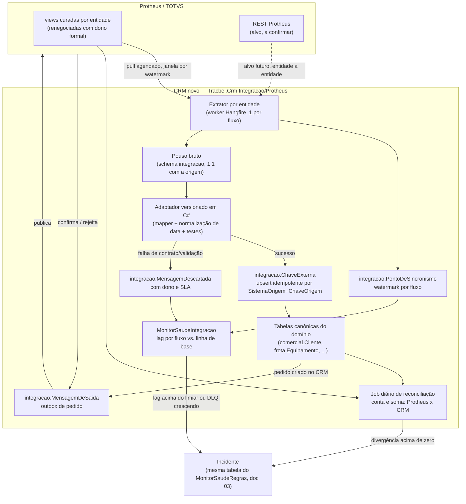

# Integração com o TOTVS Protheus — CRM Tracbel

> Documento 18 · Versão 1.0 · 03/09/2026
> Escopo: o contrato de dados entre o CRM (Vórtice hoje, CRM próprio a partir da fase 2) e o ERP
> TOTVS Protheus. Todo acesso usado para escrever este documento foi **somente leitura**: consultas
> `SELECT` (incluindo `WHERE 1=0` para inspecionar colunas sem trazer dado) contra o banco `CRM` com o
> login `CRM_Leitura`. **Nada foi escrito no Vórtice nem no Protheus.**
> Convenção: `[medido]` = valor obtido ao vivo em 03/09/2026 para este documento · `[extração]` =
> `docs/extracao-vortice/00-RELATORIO-EXTRACAO.md` (02/09/2026) · `[pesquisa 02]` /
> `[pesquisa 16 §x]` = `docs/pesquisa/02-...md` e `16-...md` · `[doc 01 achado 3.x]` =
> `01-DIAGNOSTICO-VORTICE.md`.

---

## Resumo

O Vórtice lê o Protheus por **duas gerações de código nunca desligadas** e uma terceira que tentou e
não decolou. A geração 1 (2012–2016, procedures `PR_INT_NFS`/`PR_INT_OS`/`PR_INTSPR_*`) escrevia direto
em `EXT_NFS`/`EXT_OS` via um linked server chamado **`SPRESS`** que **não existe mais** no catálogo do
servidor — é código morto, referenciando um servidor fantasma. A geração 2 (2022–2024, procedures
`X_P_*`/`X_TOTVS_*`) é a atual: linked server **`TOTVS`** (produto `totvs6`, provider `MSDASQL`/ODBC,
DSN do Windows) → 11 objetos remotos identificados (8 por nome de 4 partes, **3 a mais só por
`OPENQUERY`**, invisíveis ao catálogo de dependências) → 3 tabelas de pouso locais → 2 tabelas de
staging (`IMP_Titulo`, `IMP_NFS`/`IMP_NFSItem`) → tabelas canônicas `EXT_*`, promovidas por um
executável do fornecedor. A geração 3 (`PR_VTC_INTVEICULO`, out/2025, para reativar a frota) está
**pronta e nunca rodou** — seu agendamento tem data de início em **2028** e sua tabela de entrada tem
**zero linhas** hoje.

**Verificado ao vivo hoje (03/09/2026):** o linked server `TOTVS` **não inicializa** — duas tentativas de
leitura (mesmo com `WHERE 1=0`, sem trazer dado) devolveram *"Tempo Limite de Execução Expirado"* e
depois *"Cannot initialize the data source object of OLE DB provider 'MSDASQL'"*. Isso explica um fato
que nenhum documento anterior tinha datado: a leitura do título (`X_T_IMP_CRM_TITULO`) parou de avançar
em **13/07/2026** — cerca de **7 semanas atrás** — e não é só a promoção para `EXT_Titulo` que está
morta desde 21/05/2025 (`[doc 01 achado 3.1]`); agora **a própria leitura do Protheus também parou**.
A tabela de log que a procedure mais bem construída criou para capturar erro (`LOG_INTEGRACAO_FATURAMENTO_TOTVS`)
existe e tem **zero linhas** — o mais provável é que ninguém mais a chame, não que ela falhe em silêncio.

**Recomendação em cinco linhas:** manter o linked server como ele é hoje (frágil, preso a um DSN do
Windows fora de qualquer repositório) não é uma opção para o CRM novo. A rota recomendada para a fase 2
é **extração agendada por entidade para o schema `integracao`** — o mesmo desenho de pouso→adaptador→
canônico que já existe no documento 04 (`integracao.ChaveExterna`, `integracao.PontoDeSincronismo`,
`integracao.MensagemDeSaida`, `integracao.MensagemDescartada`), só que com transação real, watermark
persistido e alarme — acessando o Protheus por **views curadas equivalentes às que já existem**
(negociadas formalmente com quem administra o Protheus), preferindo migrar para a **REST API nativa do
Protheus** entidade a entidade assim que confirmada disponível. **Réplica de leitura fica para depois**:
pesada demais para um time de três pessoas sem saber ainda em qual motor de banco o Protheus roda.
Isso é compatível com o que a fase 2 do documento 13 já orçou (10 semanas, 30 pessoa-semana) — este
documento decide **como** ler, não muda o orçamento.

---

## 1. O contrato de hoje, medido

### 1.1 Três gerações de integração, nenhuma desligada

| Geração | Período | Mecanismo | Alvo de escrita | Estado hoje |
|---|---|---|---|---|
| **1 — legado pré-Protheus** | 2012–2016 | Linked server **`SPRESS`** (`OPENQUERY(SPRESS, ...)`), procedures `PR_INT_NFS`, `PR_INT_OS`, `PR_INT_OSAB`, `PR_INTSPR_NFS`, `PR_INTSPR_OS`, `TESTE_proc` | direto em `EXT_NFS`/`EXT_NFSITEM`/`EXT_OS`/`EXT_OSITEM` — **sem staging** | `SPRESS` **não existe** em `sys.servers` hoje `[medido]` — só `COLWCRM` e `TOTVS` estão cadastrados. Código morto: se alguém executar essas 6 procedures agora, falham na hora por servidor inexistente. Usuário de operação `SUPORTE.SPRESS` está `BLOQUEADO` (`IV_Operador`, linha 180) |
| **2 — Protheus/TOTVS (atual)** | 2022–2024 | Linked server **`TOTVS`** (`totvs6`/MSDASQL), procedures `X_P_*`/`X_TOTVS_*` | pouso `X_TOTVS_*` → staging `IMP_*` → `EXT_*` | **parada**, ver §1.2 e §1.3 |
| **3 — tentativa de reativação da frota** | out/2025 | `PR_VTC_INTVEICULO` (320 linhas, criada 31/10/2025), lê `IMP_VEICULO` | `imp_veiculo_integrado`, `IMP_VEICULO.StatusIMP` | **nunca rodou** — ver §1.3 |

A geração 1 importa por um motivo: prova que isto já aconteceu antes. Um linked server foi trocado
(SPRESS → TOTVS, por volta de 2021, coincidindo com a migração SISDIA→Protheus documentada em
`[pesquisa 02, achado 12]`) e o código antigo **ficou no banco**, sem sinalização de que está morto.
O mesmo vai acontecer com `TOTVS` um dia — é por isso que o CRM novo não pode ter o nome do sistema de
origem espalhado pelo código (§3 e §4).

### 1.2 O que o Vórtice lê do Protheus hoje, por entidade

| Entidade | Por onde (hoje) | Frequência pretendida | Estado em 03/09/2026 |
|---|---|---|---|
| **Cliente / cadastro fiscal** | Sem staging dedicado. Consulta **ao vivo** via linked server: `TOTVS.TMPRD.dbo.X_V_COL_CRM_PESSOA` (usada dentro de `X_P_REL_001`, um relatório) e `X_V_COL_CLIENTE_CRM` (usada dentro de `X_TOTVS_ATUA_BI_FATURAMENTO_POS_VENDAS_N`, outro relatório). Nenhuma das duas grava tabela própria — o resultado vai para tabela temporária e morre no fim da consulta. Separadamente, `EXT_Pessoa` (77 colunas, 58.171 linhas) é descrita como atualizada em tempo real, mas **o mecanismo que a alimenta não aparece em nenhuma procedure extraída** — `IMP_PESSOA`, o staging que deveria alimentá-la, tem **zero linhas** `[pesquisa 02]` | sob demanda (só quando alguém abre o relatório) | **quebrado agora**: qualquer usuário que abrir uma tela que chame `X_P_REL_001` ou o relatório de cobertura×faturamento hoje vai esperar a consulta **travar** — o linked server não inicializa (§1.3). Mecanismo de `EXT_Pessoa` = **a apurar** (pergunta 3, §8) |
| **Produto** | `EXT_Produto` (78.749 linhas: Protheus 35.027 · SISDIA 27.859 · sem origem 15.860). `IMP_PRODUTO`, o staging formal, e o endpoint `/api/crm/imp/produto` da `wsVorticeCrmApi` **existem e têm/usam zero linhas** `[pesquisa 02]` | mecanismo de atualização não identificado no código extraído | **a apurar** (pergunta 4, §8) — não há evidência de que `EXT_Produto` ainda receba atualização do Protheus hoje |
| **Nota fiscal (faturamento)** | `TOTVS.TMPRD.dbo.X_V_CRM_FATURAMENTO_{PECAS,SERVICOS,MAQUINAS}` → `X_TOTVS_CRM_FATURAMENTO` (via `X_TOTVS_ATUA_CRM_FATURAMENTO`) → views-adaptador `X_V_CRM_IMP_IMP_NFS`/`X_V_CRM_IMP_NFSItem` → `IMP_NFS`/`IMP_NFSItem` (via `X_P_IMP_CRM_NF_POS_VENDA`) → `EXT_NFS`/`EXT_NFSItem` (executável do fornecedor `VCRM_RUNIMPORTIMP.EXE`, agendado a cada 5 min) | pretendida incremental por stream a cada execução; **nenhum job do `GEP_JOBAGD` chama o passo 1** (`X_TOTVS_ATUA_CRM_FATURAMENTO`, `X_P_IMP_CRM_NF_POS_VENDA` ou o orquestrador `X_P_EXE_INTEGRACOES_TOTVS_CRM`) | **parada por stream**, confirmado ao vivo hoje: `[medido]` `FAT_SERVICOS` máx. **29/08/2024** (42.293 linhas ativas) · `FAT_MAQUINAS` máx. **07/02/2025** (4.653) · `DEV_MAQUINAS` máx. **06/02/2025** (301) · `FAT_PECAS` máx. **11/04/2025** (714.919) · `DEV_PECAS` máx. **11/04/2025** (8.846) — números batem exatamente com `[pesquisa 02, achado 5]`, agora redatados |
| **Título (contas a receber)** | `TOTVS.TMPRD.dbo.X_V_IMP_CRM_TITULO` → `X_T_IMP_CRM_TITULO` + `IMP_Titulo` (via `X_P_IMP_CRM_TITULO`) → `EXT_Titulo` (executável do fornecedor) | pretendida incremental; mesmo problema — sem job visível chamando o passo 1 | **duas quebras em datas diferentes**, ambas confirmadas ao vivo hoje: a **leitura** Protheus→`X_T_IMP_CRM_TITULO`/`IMP_Titulo` parou em **13/07/2026 14:02:13** `[medido]` (≈7 semanas); a **promoção** `IMP_Titulo`→`EXT_Titulo` já estava morta desde **21/05/2025** — `[medido]` hoje: 783.242 títulos pendentes (R$ 5,18 bi, `[doc 01 achado 3.1]`) contra 108.889 promovidos; `EXT_Titulo` em aberto = 12.915 títulos / **R$ 103.425.024,01**, congelado em 21/05/2025 |
| **Ordem de serviço** | `IMP_OS` (287.868 linhas, origem Protheus) → `EXT_OS` (8.099) via o mesmo executável do fornecedor; job correlato `PR_INT_PROPROS` (propriedade/veículo da OS) agendado a cada 480 min | pretendida a cada 5 min (promoção) / 8h (`PR_INT_PROPROS`) | promoção morta desde **25/05/2024** (280.214 de 287.868 nunca chegaram a `EXT_OS`, `[pesquisa 02, achado 4]`); `PR_INT_PROPROS` morto desde **18/09/2025** `[pesquisa 16 §8.1]` |
| **Equipamento / frota faturada** | Dado fiscal (chassi, NF, data da venda, modelo) vem embutido no próprio feed de faturamento (`X_TOTVS_BI_FATURAMENTO_MAQUINAS`, alimentada por `X_TOTVS_ATUALIZA_BI_FATURAMENTO_MAQUINAS` via `OPENQUERY(totvs,'select * from V_COL_FATURAMENTO')`). A tentativa de reconciliar isso com o cadastro de veículo do CRM é `PR_VTC_INTVEICULO`, lendo de `IMP_VEICULO` | pretendida a cada 10 min (`PR_VTC_INTVEICULO`) / diária (feed de faturamento) | **duas falhas empilhadas, confirmadas ao vivo hoje**: (1) `X_TOTVS_BI_FATURAMENTO_MAQUINAS` está parada em **17/04/2024** `[medido]` (4.612 linhas, sem mudança desde o snapshot de 03/06/2026); (2) `PR_VTC_INTVEICULO` está agendada a cada 10 min mas com **`DtaInicio` do agendamento em 03/11/2028** `[medido]` — nunca disparou, e mesmo que disparasse, sua entrada `IMP_VEICULO` tem **zero linhas** `[medido]` e sua saída `imp_veiculo_integrado` também tem **zero linhas** `[medido]`. Não é uma integração que quebrou: é uma integração com as duas pontas vazias |
| **Pedido** | `EXT_Pedido`/`EXT_PedidoItem`/`IMP_Pedido`/`IMP_PedidoItem` — desenho completo de 57+ colunas para o CRM enviar pedido ao ERP (`IndEnvioERP`, `DtaEnvioERP`, `NroPedidoERP`, hierarquia pai/filho) | nunca operou | **zero linhas em todas** `[pesquisa 02, achado 16]` — é a única cadeia desenhada para sair do CRM para o Protheus, e nunca foi usada na Tracbel |
| **Condição de pagamento** | Não existe tabela de catálogo dedicada encontrada. Chega embutida como atributo do faturamento (`CODICAO_PAGAMENTO`, `DES_CODICAO_PAGAMENTO` em `X_TOTVS_CRM_FATURAMENTO`) | acompanha o faturamento | mesmo estado do faturamento (parado); catálogo dedicado = **a apurar** (pergunta 5, §8) |

**Uma peça funciona hoje**, e vale registrar por contraste: `PR_ATU_FORMPRODTOTVS` — lê
`TOTVS.TMPRD.dbo.X_V_COL_MODELO_CRM` via `OPENQUERY` para popular dois parâmetros globais (marca e
modelo de máquina, usados em listas suspensas de formulário) — está agendada e **rodou hoje às 07:00**
`[medido]`. É pequena, é barata (poucas linhas distintas) e está no `GEP_JOBAGD` com job próprio. As
únicas peças da integração com Protheus que funcionam são exatamente as mais simples e as únicas com
agendamento visível — não é coincidência, é o achado central da seção 2.

### 1.3 O que a checagem ao vivo de hoje (03/09/2026) confirma e acrescenta

1. **O linked server `TOTVS` não inicializa agora.** Duas tentativas de leitura somente-leitura
   (`SELECT ... WHERE 1=0`, zero linhas trazidas mesmo em caso de sucesso), em momentos diferentes:
   a primeira excedeu o tempo limite de 25s (*"Tempo Limite de Execução Expirado"*); a segunda e as
   oito seguintes falharam de imediato com *"Cannot initialize the data source object of OLE DB
   provider 'MSDASQL' for linked server 'TOTVS'"*. Uma repetição depois de 5 segundos, com 30s de
   tempo limite, expirou de novo. `sys.servers` continua com a mesma configuração de 11/08/2022 —
   não é um problema de metadado, é o DSN ODBC do Windows (achado 13 da extração) ou o Protheus do
   outro lado que não estão respondendo.
2. **Isso combina exatamente com o congelamento de 13/07/2026 encontrado em `X_T_IMP_CRM_TITULO`.**
   A hipótese mais simples — e a única compatível com os dois fatos — é que o linked server (ou o
   que está atrás dele) parou de responder por volta de meados de julho de 2026 e continua parado.
   Isso **não estava datado** em nenhum documento anterior: `[pesquisa 02]` registrou
   "`X_T_IMP_CRM_TITULO`... está VIVO... até 13/07/2026" como leitura de que o lado Tracbel funciona —
   o que era verdade em 30/08/2026, mas **hoje, quatro dias depois, o valor não avançou nem um dia**.
   A leitura também está morta, só que há menos tempo (≈7 semanas) que a promoção IMP→EXT (≈15 meses).
3. **A tabela de log da procedure mais bem construída está vazia, não cheia de erro.**
   `X_TOTVS_ATUA_CRM_FATURAMENTO` — a única das cinco procedures da ACL com `BEGIN TRANSACTION` real,
   `TRY/CATCH` e uma tabela de log dedicada (`LOG_INTEGRACAO_FATURAMENTO_TOTVS`, criada pela própria
   procedure) — tem essa tabela **com zero linhas** `[medido]`. Isso não significa que nunca houve
   erro: significa que **ninguém mais está chamando a procedure** — se estivesse rodando contra um
   linked server que devolve erro 7303 (o mesmo que recebi agora), o `CATCH` teria gravado uma linha.
   Zero linhas é o padrão esperado de "parou de ser invocada", coerente com o ponto cego já registrado
   em `open-questions.md` ("Jobs do SQL Agent do Vórtice, hoje inacessíveis ao login de leitura").
4. **Nem toda procedure da ACL é igualmente ruim** — correção de método em relação a
   `[pesquisa 02, achado 7]`, que generaliza "nenhuma das duas tem transação" para `X_P_IMP_CRM_TITULO`
   e `X_P_IMP_CRM_NF_POS_VENDA` (confirmado, lendo o código: ambas não têm). Mas
   `X_TOTVS_ATUA_CRM_FATURAMENTO` (modificada 27/05/2024) **tem** `BEGIN TRANSACTION`/`COMMIT`/`ROLLBACK`
   reais, `TRY/CATCH` e watermark primitivo (`@V_filtro` = um mês antes do `MAX(DATA_EMISSAO_NF)` já
   aterrissado, por `ORIGEM`, refazendo a janela de sobreposição). É a peça mais madura de toda a ACL —
   e mesmo assim parou, porque maturidade de código não resolve **ausência de agendamento visível e de
   alarme**. É o achado mais importante da seção 2: o problema não é só código malfeito, é operação sem
   observabilidade nenhuma sobre se o código roda.
5. **`X_P_REL_001` faz consulta ao vivo no Protheus, não em staging** — junta
   `X_TOTVS_CRM_FATURAMENTO` (local) com `TOTVS.TMPRD.dbo.X_V_COL_CRM_PESSOA` (linked server, em
   tempo real) e `X_CRM_BI_CONGLOMERADO` (local) a cada execução. Com o linked server fora do ar, **a
   tela ou relatório que chama essa procedure hoje trava ou estoura tempo limite para quem clicar** —
   o impacto não é só "dado velho", é indisponibilidade ativa de uma funcionalidade.

### 1.4 A superfície é maior que 8 — confirmado no texto dos módulos já baixados

O achado 13 da extração já avisava: o catálogo de dependências do SQL Server só enxerga referência por
nome de 4 partes; `OPENQUERY` e SQL dinâmico não aparecem. Buscando literalmente `openquery` no texto
dos 548 objetos já extraídos (sem executar nada), aparecem **3 objetos remotos a mais**, todos usados
por procedures/views que **não estão na lista de 8** porque acessam o Protheus por `OPENQUERY` em vez
de nome de 4 partes:

| Objeto remoto (via `OPENQUERY(totvs, ...)`) | Usado por | Para quê |
|---|---|---|
| `V_COL_FATURAMENTO` | `X_TOTVS_ATUALIZA_BI_FATURAMENTO_MAQUINAS` | alimenta `X_TOTVS_BI_FATURAMENTO_MAQUINAS` (filtro `origem_fonte IN ('01_MAQUINAS','04_CLIENTES_ESTRATEGICOS')`) |
| `X_V_COL_MODELO_CRM` | `PR_ATU_FORMPRODTOTVS` (job vivo, §1.2) e de novo dentro da view `X_V_BI_DESPESAS_VENDA_MAQUINAS` | marca/modelo de máquina para parâmetro dinâmico e para relatório de despesa de venda |
| `X_V_BI_ESTOQUE_INCENTIVO` | `X_V_BI_DESPESAS_VENDA_MAQUINAS` (3 vezes dentro da mesma view, agrupando por `CHASSI_ID_INCENTIVO`) | incentivo/desconto de estoque no relatório de despesa de venda de máquinas |

Ou seja: **11 objetos remotos identificados no total**, não 8 — e essa contagem ainda é um piso, porque
não foi possível ler o SQL dentro do próprio Protheus (a `view` remota é opaca para quem só tem acesso
de leitura ao CRM) nem inspecionar SQL montado dinamicamente em string. Duas dessas três descobertas
(`V_COL_FATURAMENTO`, `X_V_COL_MODELO_CRM`) não têm prefixo `X_V_` nem aparecem em `TMPRD.dbo` por nome
de 4 partes em nenhum outro lugar do código — o que sugere que podem viver num catálogo/schema
diferente dentro do Protheus, algo que só quem administra o ERP pode confirmar (pergunta 6, §8).

---

## 2. Por que essa integração falhou

Sem alarme, sem retry, sem fila, sem marca de sincronismo confiável — cada causa abaixo, com a
evidência e o achado correspondente.

1. **Não há job visível que chame o núcleo da integração — só as periferias.** `X_P_EXE_INTEGRACOES_TOTVS_CRM`
   (o orquestrador de título + faturamento), `X_P_IMP_CRM_TITULO`, `X_P_IMP_CRM_NF_POS_VENDA` e
   `X_TOTVS_ATUA_CRM_FATURAMENTO` **não aparecem em `GEP_JOBCAD` nem em `GEP_JOBAGD`** — confirmado por
   busca direta nos dois catálogos `[medido]`. As duas únicas entradas de catálogo com nome parecido
   (`DWH_IMPORT_EXT`, "Realiza carga de NFS pro DWH"; `IMP_TITULO`, "Realiza importação de títulos.")
   são do tipo `JOB` (fila), não `PROCEDURE`, e **nenhuma das duas tem entrada correspondente em
   `GEP_JOBAGD`** — não estão agendadas por nada que o Vórtice enxergue. A hipótese mais provável,
   já registrada como ponto cego do programa (`open-questions.md`, "Jobs do SQL Agent do Vórtice, hoje
   inacessíveis ao login de leitura"), é que essas procedures rodam por um job do **SQL Server Agent**
   — sistema operacional do banco, fora do alcance de `CRM_Leitura` e fora de qualquer documentação.
   **Ninguém no time consegue hoje dizer com que frequência a integração central roda, nem se ainda
   está ligada.** É a causa raiz de tudo o que segue: não dá para alarmar o que não se enxerga.
2. **Quando existe alarme, ele está com o nível de severidade errado.** O motor do fornecedor
   (`VCRM_RUNGEPIMPORT.EXE`, que drena `GEP_Import`) falha a cada 20 minutos com
   *"Versão incompatível [4.04.01r05] x [4.04.01r01]"* e grava isso como `TipoLog='W'` (aviso) —
   **7.262 avisos em três meses** `[pesquisa 16 §8.2]`, `[doc 01 achado 3.4]`. Um erro estrutural de
   versão devia ser fatal, não aviso; a operação lê "Warning" e segue em frente.
3. **A promoção do staging para o canônico não é transacional com a chegada do dado.**
   `StatusIMP='E'` em `IMP_OS` significa "alguém marcou", não "chegou ao destino": as 287.868 linhas
   de `IMP_OS` estão 100% marcadas como processadas e **280.214 nunca existiram em `EXT_OS`**
   `[pesquisa 02, achado 4]`. O mesmo padrão de status-fora-da-transação existe em `IMP_Titulo`.
4. **As duas procedures que fazem a leitura central não têm transação nem tratamento de erro** —
   lido diretamente no código: em `X_P_IMP_CRM_TITULO`, os passos `--BEGIN TRANSACTION;` e `--COMMIT`
   estão **literalmente comentados** (linhas 36 e 139); `X_P_IMP_CRM_NF_POS_VENDA` não tem `TRY/CATCH`
   em nenhum dos 8 passos. Uma falha no meio da execução perde ou duplica linha, dependendo de em qual
   passo ela acontece (`[pesquisa 02, achado 7]`, `[doc 01 achado 3.7]`). A exceção honrosa —
   `X_TOTVS_ATUA_CRM_FATURAMENTO`, com transação e `TRY/CATCH` reais — mostra que a equipe sabia fazer
   melhor; só não bastou, porque o problema seguinte também se aplica a ela.
5. **Mesmo o código bem-feito não tem alarme de "parei de rodar".** A tabela de log que
   `X_TOTVS_ATUA_CRM_FATURAMENTO` criou para si mesma está vazia hoje (§1.3, item 3) — não porque nunca
   falhou, mas porque, quando parou de ser chamada, não havia nada monitorando a ausência de chamadas.
   Log sem consumidor equivale a não ter log.
6. **A chave de correlação é uma string concatenada por `|`, com atributo mutável dentro dela.**
   `COD_CHAVE_NF`/`COD_CHAVE_ITEM` incluem `STATUS_NF` e `DELETADO` na própria chave — cancelar uma NF
   no Protheus muda a chave, e a procedure só sabe fazer `INCLUIR` (nunca `ATUALIZAR`/estornar), então
   a NF cancelada some como duplicidade em vez de correção `[pesquisa 02, achado 8]`.
7. **Datas do Protheus chegam com sentinela `1900-01-01` tratada coluna a coluna, não por política.**
   `X_P_IMP_CRM_TITULO` faz `CASE WHEN ... = '1900-01-01' THEN NULL` em três colunas e esquece as
   demais — resultado medido: `MAX(DtaVencto)` em `EXT_Titulo` é **08/05/5024**, e entre os títulos em
   aberto há vencimento em **10/08/2223** `[doc 01 achado 3.8]`, `[pesquisa 02, achado 9]`. Não existe
   `CHECK CONSTRAINT` em nenhuma das 767 tabelas do banco (`[extração]`) para pegar isso na porta.
8. **O staging não tem política de retenção nem separação de sistema de origem coerente.** O parâmetro
   que deveria controlar por quanto tempo cada origem fica em staging (`GEP_ParRecebe.QtdDiasRemove`)
   está zerado ou vazio nas 14 origens cadastradas `[pesquisa 02, achado 14]` — e há pelo menos 5
   tabelas de backup manual da integração TOTVS esquecidas em produção (`X_T_IMP_CRM_TITULO_bkp_11_04`
   com 121.381 linhas, `X_V_IMP_CRM_IMP_NF_BKP_18_09_2023` com 415.762, entre outras — `[extração,
   achado 10]`, dicionário `X_TOTVS.md`).
9. **A conexão com o ERP depende de um DSN ODBC de um Windows Server específico, fora de qualquer
   repositório** (`[extração, achado 13]`). Não é só um risco de documentação: é uma dependência de
   infraestrutura física que **hoje está causando a falha em si** (§1.3) — quando o host, o driver ou
   a rede daquele DSN mudam, a integração para sem deixar rastro no banco do CRM, porque a falha
   acontece antes de qualquer T-SQL rodar.
10. **A integração anterior (geração 1, `SPRESS`) nunca foi removida quando a geração 2 entrou.** Seis
    procedures continuam no banco referenciando um linked server que não existe mais — não quebram nada
    hoje porque ninguém as chama, mas são um exemplo do padrão que produziu o problema 1: coisas somem
    de operação sem sinalização de que sumiram.

---

## 3. Quem é dono de qual dado

Esta tabela refina, para o recorte Protheus, o mapa de convivência já travado no
`[13-PROGRAMA-POR-FASES-DIRETORIA.md, §4.3]` (V = Vórtice, N = CRM novo, E = ERP). Regra de partida
confirmada pela evidência: **cadastro fiscal, faturamento, título, ordem de serviço, produto e
equipamento faturado nascem no Protheus**; **oportunidade, tarefa, interação, carteira, consentimento
e formulário nascem no CRM**.

| Entidade | Mestre | Quem lê | Quem escreve | Em conflito | Nunca escrito de volta |
|---|---|---|---|---|---|
| **Cadastro fiscal do cliente** (razão social, CNPJ/CPF, situação cadastral) | **Protheus** | CRM (novo e Vórtice), para exibir e vincular | só o Protheus | o dado do Protheus vence sempre; o CRM pode ter um apelido/contato próprio ao lado, nunca sobrepondo o campo fiscal | CNPJ, razão social, situação cadastral — o CRM nunca corrige esses campos; se estiver errado, abre-se um chamado para quem cadastra no Protheus |
| **Produto / tabela de família** | **Protheus** | CRM | só o Protheus | idem | código, descrição, família, preço de tabela |
| **Nota fiscal (faturamento)** | **Protheus** | CRM (relatório, funil, comissão) | só o Protheus | não existe conflito possível — é fato consumado do lado fiscal | tudo: valor, item, imposto, situação (normal/cancelada/devolução) |
| **Título (contas a receber)** | **Protheus** | CRM (visão financeira do vendedor, cobrança) | só o Protheus | idem | valor original, vencimento, quitação — o CRM pode registrar uma **promessa de pagamento** como fato do CRM, sem alterar o título |
| **Ordem de serviço** | **Protheus** | CRM (pós-venda) | só o Protheus | idem | status da OS, valores de peça/serviço |
| **Equipamento — fato fiscal** (chassi, NF de venda, data, modelo vendido) | **Protheus** | CRM | só o Protheus | idem | chassi, NF vinculada, data da venda |
| **Equipamento — relacionamento** (plano de manutenção, histórico de visita, condição observada) | **CRM novo**, a partir da fase 4 (`doc 13 §4.3`) | CRM | CRM | não aplicável — é um objeto novo, sem equivalente no Protheus | — |
| **Condição de pagamento** (catálogo) | **Protheus** | CRM | só o Protheus | idem | prazo, forma, descrição |
| **Pedido** | hoje: nenhum (capacidade não usada). Proposto: **CRM novo cria, Protheus confirma** | CRM cria; Protheus processa | CRM escreve a intenção; Protheus escreve o resultado (nº de pedido ERP, status) | se o Protheus rejeitar (crédito, estoque), o pedido volta ao CRM como rejeitado, nunca é "corrigido" silenciosamente | o CRM nunca marca um pedido como aceito por conta própria — só o retorno do Protheus faz isso |
| Oportunidade | **CRM** | Protheus não lê | CRM | não aplicável | — |
| Tarefa / interação | **CRM** | Protheus não lê | CRM | não aplicável | — |
| Carteira | **CRM** | Protheus não lê | CRM | não aplicável | — |
| Consentimento de comunicação | **CRM** | Protheus não lê | CRM | não aplicável | — |
| Formulário / questionário | **CRM** | Protheus não lê | CRM | não aplicável | — |

**A regra que não se quebra, herdada do `03-ARQUITETURA.md §1`:** o CRM novo nunca escreve em campo de
origem Protheus para "corrigir" um erro visto na tela. Se um vendedor vê um CNPJ errado, o caminho é um
botão **"reportar divergência"** que abre um chamado para quem cadastra no Protheus — nunca um `UPDATE`
disfarçado de sincronização. É a mesma lição que `[pesquisa 02, achado 2]` tira do próprio Vórtice: a
cascata de resolução de identidade do `GE_PessoaLink` é ótima porque nunca inventa vínculo sem
critério — o CRM novo deve copiar essa disciplina para o lado Protheus também.

---

## 4. Como vamos integrar

### 4.1 As opções

| Opção | O que é |
|---|---|
| **(a) Leitura direta por linked server** | O que existe hoje: SQL Server do CRM consulta o Protheus via ODBC/`OPENQUERY` ou nome de 4 partes, em tempo real |
| **(b) Réplica de leitura** | Cópia do banco do Protheus (ou de parte dele) mantida sincronizada por replicação nativa do motor de banco ou CDC, consultada localmente pelo CRM |
| **(c) Extração agendada para o schema `integracao`** | Um worker do CRM novo consulta o Protheus em intervalos definidos, por entidade, e grava em `integracao.*` com watermark — o mesmo desenho de pouso→adaptador→canônico que a Tracbel já construiu (mal) para o Vórtice, refeito com transação, retry e alarme |
| **(d) API REST do Protheus** | O framework de REST embutido no Protheus (`WSRESTFUL` em ADVPL) expõe endpoints versionados por entidade; o CRM consome por HTTP, sem tocar o schema físico do ERP |

### 4.2 Comparação

| Critério | (a) Linked server | (b) Réplica de leitura | (c) Extração agendada | (d) REST do Protheus |
|---|:--:|:--:|:--:|:--:|
| Acoplamento ao schema físico do ERP | Alto — já é o problema de hoje | Altíssimo — expõe tabela interna crua (`SXX`) | Baixo — isolado atrás de views curadas e de um adaptador em código | Baixíssimo — contrato HTTP versionado |
| Carga sobre o Protheus | Imprevisível, consultas ad hoc | Depende de CDC/replicação nativa (normalmente baixa, mas cara de configurar) | Controlada — janela e volume definidos por watermark | Controlada pelo próprio Protheus |
| Latência alcançável | Tempo real, **quando funciona** | Próxima de tempo real | Minutos (ajustável por entidade, §5) | Minutos, podendo chegar a segundos |
| Operação por um time de 3 pessoas | Alta carga oculta: depende de DSN do Windows fora do controle do time (é o que está quebrado hoje) | Alta — replicação heterogênea de banco exige especialista que o time não tem | Baixa — mesma stack .NET/Hangfire/Serilog já decidida no `03-ARQUITETURA.md` | Baixa, uma vez publicado — mas depende de terceiro para existir |
| Portabilidade (`12-DECISAO-CONTAINERS.md`) | Ruim — ODBC/MSDASQL é amarrado a driver e a um host Windows específico | Ruim a médio — normalmente exige infraestrutura extra dedicada | Excelente — é só um worker .NET rodando no mesmo container Linux de tudo o mais | Excelente — só HTTP |
| Depende de terceiro para existir | Não (já existe, mal) | Sim — depende do motor de banco do Protheus, hoje desconhecido | Não, se as views atuais forem mantidas/renegociadas | Sim — depende de quem administra o Protheus habilitar/publicar endpoints |
| Já testado nesta investigação | Sim — **falhou ao vivo hoje** (§1.3) | Não avaliado | Reaproveita padrão já existente (views `X_V_*`) | Não avaliado — não foi confirmado se está habilitado |

### 4.3 Recomendação

**Extração agendada para o schema `integracao` (opção c), com migração entidade a entidade para REST do
Protheus (opção d) assim que confirmada disponível.** Critério de decisão:

- **Não dá para recomendar (a) como caminho principal do CRM novo.** É o mecanismo que falhou ao vivo
  durante a escrita deste documento, está preso a infraestrutura Windows fora do container Linux já
  decidido (`12-DECISAO-CONTAINERS.md`) e é o oposto do argumento de portabilidade que é "o benefício
  que vai à diretoria" (`doc 12 §3`). Ele pode continuar existindo **sem ser tocado** para o Vórtice
  atual, mas o CRM novo não deve construir nada novo em cima dele.
- **(b) fica para depois.** Réplica de leitura é a opção certa se algum dia a latência de minutos não
  for suficiente — mas exige saber em que motor de banco o Protheus roda (não confirmado; o provider
  `MSDASQL`/ODBC sugere uma ponte genérica, possivelmente para um motor não-SQL-Server) e normalmente
  exige o fornecedor/consultoria do Protheus para configurar. Não é proporcional ao time de 3 pessoas
  na janela da fase 2.
- **(c) é a extensão natural do que já foi desenhado.** O documento 04 já criou `integracao.ChaveExterna`,
  `integracao.PontoDeSincronismo` e `integracao.MensagemDescartada` pensando exatamente nisso — o
  comentário de exemplo já usa `'TOTVS.Titulo'` como nome de fluxo (`04-MODELO-DADOS.md §8`). Falta
  decidir **como** ler o dado; a resposta é: reaproveitar o **conceito** das views curadas que já
  existem no Protheus (`X_V_CRM_FATURAMENTO_*`, `X_V_IMP_CRM_TITULO` etc. — alguém do lado Protheus já
  construiu um contrato razoável, só não documentado nem versionado), só que **renegociando-as
  formalmente** com quem administra o Protheus como um contrato com dono, versão e SLA — e acessando
  por um driver Linux-friendly (ODBC unixODBC ou o driver nativo do motor, a confirmar) a partir do
  próprio worker .NET, não mais por linked server do SQL Server.
- **(d) é o alvo estratégico**, a perseguir em paralelo com quem administra o Protheus e a TOTVS,
  começando pelas entidades mais frágeis hoje (título e faturamento). Not confirmado se este ambiente
  Protheus tem o framework REST habilitado/licenciado — é a primeira pergunta da seção 4.4.

### 4.4 O que precisa ser confirmado com quem administra o Protheus

1. Em que motor de banco de dados o Protheus roda de fato (SQL Server, Oracle, Progress OpenEdge ou
   outro) — o provider `MSDASQL` do linked server sugere uma ponte ODBC genérica, não conexão nativa,
   e isso muda completamente o driver que o worker .NET vai usar.
2. Se o framework REST nativo do Protheus (`WSRESTFUL`/ADVPL) está habilitado, licenciado e com
   endpoints publicados para cliente, produto, nota fiscal, título e OS — e se não estiver, qual é o
   esforço e o dono (TOTVS ou consultoria local) para publicar.
3. Se as views `X_V_CRM_FATURAMENTO_*`, `X_V_IMP_CRM_TITULO`, `X_V_COL_CRM_PESSOA`,
   `X_V_COL_CLIENTE_CRM` e as 3 encontradas só por `OPENQUERY` (§1.4) têm dono conhecido do lado
   Protheus, e se podem ser mantidas/expandidas como contrato formal para o CRM novo.
4. Qual é a rota de rede aceitável entre onde o CRM novo vai rodar (Algar ou Azure, `12-DECISAO-CONTAINERS.md`)
   e o Protheus — item já registrado como bloqueante em `open-questions.md`
   ("existe ExpressRoute ou VPN... e a latência até o TOTVS Protheus é aceitável?").
5. Se existe um ambiente de homologação do Protheus equivalente ao `CRM_HOMO` do Vórtice, para testar a
   nova extração sem tocar produção.
6. Se há uma janela de manutenção/carga programada no Protheus que a extração agendada deveria evitar.

---

## 5. O desenho

### 5.1 Fluxo por entidade

| Entidade | Periodicidade proposta | Por quê |
|---|---:|---|
| Cadastro fiscal do cliente | 30–60 min (ou diária) | muda pouco; usado para exibição, não para decisão em tempo real |
| Produto / preço de tabela | diária | catálogo estável |
| Nota fiscal (faturamento) | 15 min | usada em funil, comissão e cobertura — quanto mais perto de tempo real, menos gente pergunta "por que o CRM está desatualizado" |
| Título (contas a receber) | 15 min | mesma razão; é o dado mais cobrado pela diretoria hoje |
| Ordem de serviço | 30 min | pós-venda tolera um pouco mais de atraso que financeiro |
| Equipamento — fato fiscal | acionado pelo evento de faturamento de máquina (e diário como rede de segurança) | um chassi novo nasce junto com a NF; não precisa de relógio próprio |
| Condição de pagamento (catálogo) | diária | catálogo, muda raramente |
| Pedido (saída CRM → Protheus) | imediato, via outbox (não é relógio, é evento) | é uma transação de negócio, não um relatório — atraso aqui é reclamação de cliente |

### 5.2 Diagrama

### 5.3 Marca de sincronismo, fila, erro e reconciliação

- **Marca de sincronismo:** uma linha por fluxo em `integracao.PontoDeSincronismo` (ex.:
  `'TOTVS.Titulo'`, `'TOTVS.NotaFiscal'`, `'TOTVS.Cliente'` — mesma tabela e mesmo exemplo já
  desenhados em `04-MODELO-DADOS.md §8`), com `UltimoValor` (o carimbo de data/hora ou id do último
  registro lido), `RegistrosLidos`, `RegistrosGravados`, `RegistrosErro` a cada execução. Nunca um
  literal de data no código (era exatamente o defeito de `X_P_IMP_CRM_NF_POS_VENDA`, com
  `'2023-01-01'` fixo no meio do SQL).
- **Fila de saída (pedido):** `integracao.MensagemDeSaida`, escrita **na mesma transação** que grava o
  pedido no CRM — outbox clássico. Um worker publica, marca `Entregue` ou incrementa `Tentativas` com
  backoff; depois de N tentativas, vira `integracao.MensagemDescartada`.
- **Tratamento de erro com retry e alarme:** cada extrator roda com `TRY/CATCH` real (não comentado),
  grava o resultado em `PontoDeSincronismo` mesmo em caso de falha parcial, e usa política de retry com
  backoff (Hangfire já oferece isso pronto, `03-ARQUITETURA.md §Infraestrutura`). Depois de **2 ciclos
  sem sucesso** (limiar já definido no portão de saída da fase 2, `13-PROGRAMA §Fase 2`), abre
  `Incidente` automaticamente.
- **Registro do que foi rejeitado:** todo registro que falhar validação de contrato (tipo errado, data
  fora de faixa, chave duplicada com atributo mutável) vai para `integracao.MensagemDescartada` com o
  motivo — nunca é descartado em silêncio nem gravado como lixo na tabela canônica (era exatamente
  como `MAX(DtaVencto) = 5024` aconteceu).
- **Reconciliação periódica:** um job diário compara contagem e soma por fluxo entre a view curada do
  Protheus e a tabela canônica do CRM (ex.: `COUNT(*)`/`SUM(VlrOriginal)` de título por dia de emissão)
  e abre incidente se a divergência for maior que zero — é o critério de saída da fase 2
  ("reconciliação financeira batendo com o Protheus", `13-PROGRAMA`) tornado rotina permanente, não
  checagem de portão única.

---

## 6. Antifrágil

O que garante que isto não fique **17 meses parado sem ninguém notar** de novo — o achado 1 da
extração, a razão de este documento existir.

1. **Métrica por entidade, não por sistema.** `[pesquisa 02, achado 5]` já provou o risco de olhar
   "faturamento" como uma coisa só: os três streams pararam em datas diferentes e a queda de um ficou
   mascarada pelo volume do outro. Cada fluxo (`TOTVS.Cliente`, `TOTVS.NotaFiscal.Pecas`,
   `TOTVS.NotaFiscal.Servicos`, `TOTVS.NotaFiscal.Maquinas`, `TOTVS.Titulo`, `TOTVS.OrdemDeServico`)
   exporta seu próprio `lag = agora − PontoDeSincronismo.ProcessadoEm`, via OpenTelemetry → Prometheus/
   Grafana, a mesma stack já decidida em `03-ARQUITETURA.md §Observabilidade`.
2. **Alarme por atraso — o mesmo padrão do `MonitorSaudeRegras`, aplicado à integração.** O documento
   03 já resolveu esse problema para regra de workflow (`§4.3`: compara a taxa de disparo de uma regra
   contra a média das 4 semanas anteriores e abre `Incidente` se cair mais de 30%). Propõe-se um
   `MonitorSaudeIntegracao` gêmeo: compara o `lag` atual de cada fluxo contra um limiar absoluto por
   entidade (§5.1) — não contra média histórica, porque aqui o que importa é "está parado agora?", não
   "está mais lento que de costume?". Roda a cada execução do extrator, não uma vez por madrugada —
   detecção em minutos, não em dias.
3. **Painel de saúde**, visível ao TI (já é entrega do portão da fase 2, `13-PROGRAMA`): por fluxo,
   última execução, `lag`, registros pendentes na `MensagemDescartada`, e o resultado da última
   reconciliação. Não é um relatório que alguém precisa lembrar de abrir — é o que o time olha todo dia,
   e o que dispara notificação (e-mail/Teams — a definir com a resposta da pergunta sobre canal de
   alarme em `open-questions.md`) quando algo sai do normal.
4. **Dado velho aparece marcado como velho, nunca silenciosamente errado.** Toda tela do CRM que exibe
   dado de origem Protheus mostra, ao lado, a data do `PontoDeSincronismo` daquele fluxo ("faturamento
   atualizado há 8 minutos" / "**faturamento desatualizado há 3 dias — verificando**" em destaque
   visual quando o lag ultrapassa o limiar). É o oposto exato do que a integração de hoje faz: um
   vendedor que abre o Vórtice hoje vê números de título e vê tela normal — nada avisa que o dado é
   de abril de 2025. O portão de qualidade da fase 2 deveria incluir "nenhuma tela mostra dado de
   fluxo com lag vermelho sem aviso visível" como critério testável.
5. **Teste de caos como rotina, não só como critério de portão.** A fase 2 já exige "derrubar a conexão
   no meio da carga e provar que nada duplicou e nada se perdeu" uma vez, no portão (`13-PROGRAMA`).
   Propõe-se repetir esse teste automaticamente uma vez por trimestre em homologação — é barato e é
   exatamente o cenário que aconteceu de verdade em produção (§1.3).

---

## 7. Migração

**Como o CRM novo passa a receber do Protheus sem depender do Vórtice:** a partir da fase 2, o worker
de extração do CRM novo lê diretamente das views curadas do Protheus (§4.3) — **não lê do Vórtice para
chegar ao Protheus**. Isso é importante porque hoje o caminho é Protheus → Vórtice → (relatórios); o
CRM novo não deve virar "Protheus → Vórtice → CRM novo", e sim um segundo consumidor independente das
mesmas views (ou, quando migrado, da REST), lendo em paralelo enquanto o Vórtice convive. Isso está
alinhado com a regra 1 do `13-PROGRAMA §4.4` ("o CRM novo NUNCA escreve no banco do Vórtice") e estende
a mesma lógica para o Protheus: o CRM novo também nunca escreve no Protheus fora do fluxo de saída de
pedido explicitamente desenhado (§3, §5).

**O que fazer com o histórico represado — em ordem, porque a ordem importa:**

1. **Não migrar o represamento como se fosse o fluxo normal.** Os 783.242 títulos parados desde
   22/05/2025 e as 280.214 OS nunca promovidas não devem entrar pelo mesmo pipeline incremental que vai
   processar o dado novo a partir da fase 2 — um watermark dimensionado para "alguns minutos de atraso"
   não é a ferramenta certa para engolir 15 meses de histórico de uma vez.
2. **Migrar o represamento como carga histórica, uma vez, com reconciliação dedicada.** Um job de carga
   única (não o extrator recorrente) lê o intervalo represado inteiro por entidade, direto das mesmas
   views curadas, valida contra a mesma política de qualidade (sem sentinela `1900-01-01` escapando,
   sem chave com atributo mutável) e reconcilia contagem e soma contra o que o Protheus tem hoje para
   aquele intervalo antes de declarar concluído.
3. **Título primeiro, por valor represado** (R$ 5,18 bi é a maior exposição financeira sem visibilidade
   no programa inteiro), depois faturamento (por stream, começando por peças — o maior volume), depois
   ordem de serviço.
4. **O represamento do Vórtice (`IMP_Titulo`, `IMP_OS` parados) não precisa ser migrado** — ele é
   staging do Vórtice, não fonte de verdade; a carga histórica do CRM novo vem direto do Protheus, não
   do staging travado do Vórtice, porque senão herda-se exatamente a mesma corrupção de chave e de data
   que produziu o problema (§2, itens 6 e 7).
5. **Reconciliação de saída do represamento é a mesma reconciliação de rotina, só que rodada uma vez
   contra o intervalo completo** — reaproveita o job do §5.3, não é uma ferramenta nova.

---

## 8. Perguntas abertas

Numeradas, prontas para virar chamado — com quem administra o Protheus (P), com a TOTVS (T), ou interno
(I).

1. **(P)** O DSN ODBC `totvs6` está com problema conhecido hoje? Duas tentativas de leitura em
   03/09/2026 falharam com *"Cannot initialize the data source object of OLE DB provider 'MSDASQL'"* —
   isso é intermitente ou o linked server está fora do ar desde meados de julho/2026 (coerente com
   `X_T_IMP_CRM_TITULO` parado em 13/07/2026)?
2. **(P/I)** Quem chama `X_P_EXE_INTEGRACOES_TOTVS_CRM`, `X_P_IMP_CRM_TITULO`, `X_P_IMP_CRM_NF_POS_VENDA`
   e `X_TOTVS_ATUA_CRM_FATURAMENTO` hoje? Nenhuma aparece em `GEP_JOBCAD`/`GEP_JOBAGD` — é um job do SQL
   Server Agent? Desde quando está desabilitado ou falhando? (mesma pergunta já registrada em
   `open-questions.md` como ponto cego do programa, aqui aplicada especificamente a estas 4 procedures)
3. **(P)** Qual é o mecanismo real que atualiza `EXT_Pessoa` e `EXT_Produto` hoje, já que os stagings
   formais (`IMP_PESSOA`, `IMP_PRODUTO`) têm zero linhas? Ainda recebem dado do Protheus, ou estão
   congelados como título e OS?
4. **(P)** `EXT_Produto` (78.749 linhas) ainda é atualizado? Qual a última data de alteração?
5. **(P)** Existe um catálogo formal de condição de pagamento no Protheus, com código estável, ou o
   texto que chega em `CODICAO_PAGAMENTO`/`DES_CODICAO_PAGAMENTO` é a única fonte?
6. **(P)** `V_COL_FATURAMENTO` e `X_V_COL_MODELO_CRM` (usadas via `OPENQUERY`, sem nome de 4 partes em
   nenhum lugar do código) vivem em `TMPRD` como as outras 8, ou em outro catálogo/schema do Protheus?
   Existe SQL dinâmico ou outro `OPENQUERY` não coberto por esta busca textual?
7. **(P/T)** Em que motor de banco de dados o Protheus roda (SQL Server, Oracle, Progress OpenEdge,
   outro)? Define o driver que o CRM novo vai usar a partir de um container Linux.
8. **(T)** O framework REST nativo do Protheus (`WSRESTFUL`) está habilitado e licenciado nesta
   instância? Quais entidades já têm endpoint publicado, e qual o custo/prazo para publicar as que
   faltam (cliente, produto, nota fiscal, título, OS)?
9. **(P)** As views `X_V_CRM_FATURAMENTO_*`, `X_V_IMP_CRM_TITULO`, `X_V_COL_CRM_PESSOA` e
   `X_V_COL_CLIENTE_CRM` têm dono/mantenedor identificado do lado Protheus? Podem virar um contrato
   formal, versionado, com aviso prévio de mudança de campo?
10. **(P)** Existe ambiente de homologação do Protheus para testar a nova extração sem tocar produção
    (equivalente ao `CRM_HOMO` do Vórtice)?
11. **(P)** Existe janela de manutenção ou pico de carga conhecido no Protheus que a extração agendada
    deveria evitar?
12. **(I, infra/Algar)** Qual o caminho de rede entre onde o CRM novo vai rodar (Algar ou Azure,
    `12-DECISAO-CONTAINERS.md`) e o Protheus, e qual a latência esperada? (já registrado como
    bloqueante em `open-questions.md`)
13. **(P)** Com qual credencial o linked server `TOTVS` autentica hoje? (pergunta já feita ao DBA no
    pedido da extração, `00-RELATORIO-EXTRACAO.md §3`, repetida aqui porque a nova extração vai
    precisar de credencial própria, dedicada e somente leitura, nunca a mesma do Vórtice)

---

## Fechamento

Acesso ao banco do Vórtice **foi obtido** (login `CRM_Leitura`, somente leitura, confirmado às
03/09/2026). O acesso ao Protheus em si — através do linked server que o Vórtice usa — **falhou em
tempo real durante esta pesquisa**, o que virou evidência de primeira linha em vez de limitação: prova,
com data e mensagem de erro, exatamente o tipo de falha silenciosa que motiva este documento inteiro.
Nenhuma tabela do Protheus foi vista diretamente; tudo o que este documento descreve sobre o schema do
Protheus vem do que as views e procedures do Vórtice já revelam sobre ele (nomes de coluna, comentários,
mapeamento) — nunca inventado.
