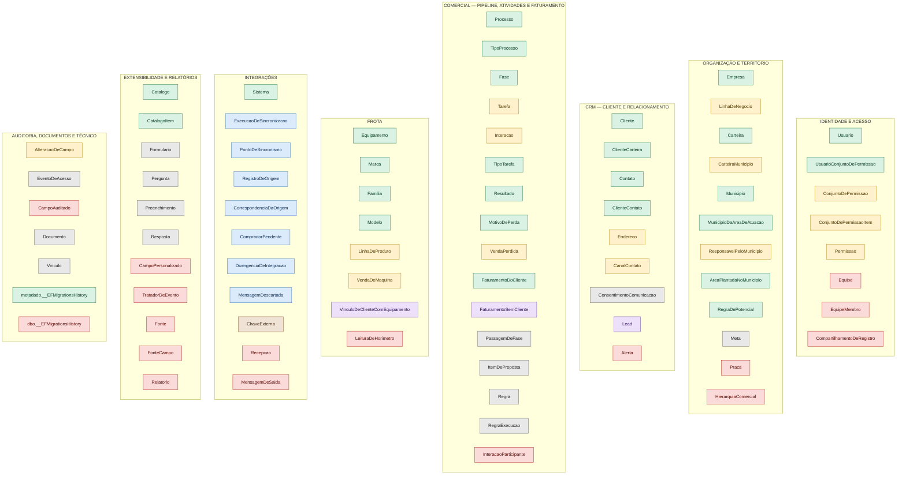
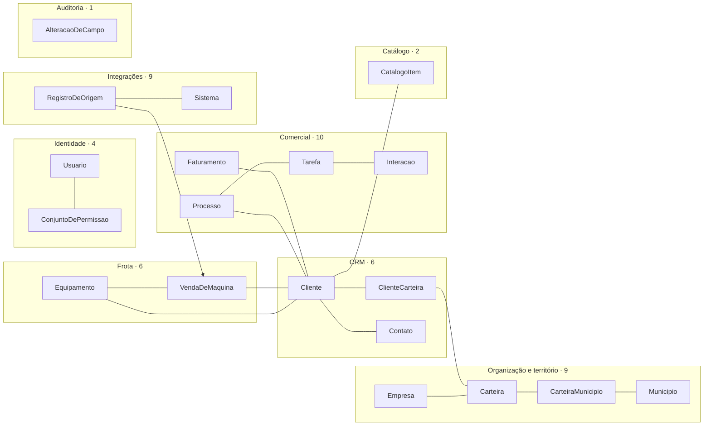

# 39 — Auditoria da arquitetura do banco do CRM

> **Versão 1.0 · 15/09/2026 · somente leitura.** Nenhuma tabela, coluna, chave, entidade, `DbContext`,
> migração ou dado foi alterado. Nenhum `DELETE`, `TRUNCATE`, `DROP`, `ALTER` ou migração foi executado.
>
> **Banco auditado:** `TracbelCrm` local (SQL Server 2022, compatibilidade 160), com a mesma estrutura do
> banco central — as mesmas 12 migrações e as mesmas 82 tabelas (documento 38, §3). Os dados estão
> sanitizados; a coluna "linhas antes da limpeza" vem do levantamento de 15/09/2026 feito antes da
> sanitização, com a carga completa do Vórtice, do ART e do território.
>
> **Anexos gerados do catálogo e do código** (reexecutáveis por
> `scripts/banco/auditoria/gerar-inventario-do-banco.ps1`, que só faz `SELECT` em catálogo de sistema e
> lê arquivos):
>
> - [39A — Inventário detalhado](39A-INVENTARIO-DETALHADO-DO-BANCO.md): uma seção por tabela, com
>   colunas, tipos, nulos, identity, defaults, chave primária, FKs de saída e de entrada, índices, CHECK,
>   migração que criou e migrações que alteraram, uso por camada e arquivos que acessam.
> - [39B — Diagrama ER atual por domínio](39B-DIAGRAMA-ER-ATUAL.md): as 213 FKs reais em Mermaid — 157
>   desenhadas e as 56 que apontam para `Empresa` e `Usuario` contadas em cada domínio.
>
> **Contagem oficial** (fixada no [documento 40](40-ARQUITETURA-ALVO-DO-BANCO.md), seção 1.1):
> **82 tabelas físicas = 80 de domínio (modelo EF Core) + 2 técnicas (históricos de migração).** Neste
> documento, "das 80" se refere às de domínio; as 35 que nunca tiveram linha são de domínio — 36 das 82
> físicas, contando a órfã `dbo.__EFMigrationsHistory`.
>
> **Esta auditoria não autoriza nada.** A arquitetura da seção 27 é proposta. Nada será executado sem
> autorização explícita.

## Sumário

1. [Resumo executivo](#1-resumo-executivo)
2. [Método, evidências e limites](#2-método-evidências-e-limites)
3. [Inventário das 82 tabelas](#3-inventário-das-82-tabelas)
4. [Dependências](#4-dependências)
5. [Uso no código](#5-uso-no-código)
6. [Classificação por natureza](#6-classificação-por-natureza)
7. [Tabelas possivelmente não utilizadas](#7-tabelas-possivelmente-não-utilizadas)
8. [Redundâncias entre tabelas](#8-redundâncias-entre-tabelas)
9. [Campos redundantes](#9-campos-redundantes)
10. [Duplicação de conceito](#10-duplicação-de-conceito)
11. [Tabelas excessivamente específicas](#11-tabelas-excessivamente-específicas)
12. [God tables](#12-god-tables)
13. [Tabelas N:N](#13-tabelas-nn)
14. [Chaves estrangeiras](#14-chaves-estrangeiras)
15. [Normalização](#15-normalização)
16. [Múltiplas fontes da verdade](#16-múltiplas-fontes-da-verdade)
17. [Nomenclatura](#17-nomenclatura)
18. [Legado](#18-legado)
19. [Tabelas de sincronização](#19-tabelas-de-sincronização)
20. [Score por tabela](#20-score-por-tabela)
21. [Arquitetura acidental: as 12 migrações em ordem](#21-arquitetura-acidental-as-12-migrações-em-ordem)
22. [Testes](#22-testes)
23. [Candidatas à remoção e à consolidação](#23-candidatas-à-remoção-e-à-consolidação)
24. [Entidades core](#24-entidades-core)
25. [Recomendações P0 a P3](#25-recomendações-p0-a-p3)
26. [Diagrama da arquitetura atual](#26-diagrama-da-arquitetura-atual)
27. [Arquitetura recomendada (proposta)](#27-arquitetura-recomendada-proposta)
28. [Se estivéssemos começando hoje, criaríamos essas 82 tabelas?](#28-se-estivéssemos-começando-hoje-criaríamos-essas-82-tabelas)
29. [O que esta auditoria não fez](#29-o-que-esta-auditoria-não-fez)

---

## 1. Resumo executivo

### 1.1 Os números

| Medida | Valor |
|---|---|
| Tabelas | **82** = 80 do modelo do EF Core + 2 históricos de migração (um deles órfão) |
| Schemas | 10 (`organizacao`, `seguranca`, `comercial`, `processo`, `frota`, `documento`, `auditoria`, `integracao`, `metadado`, `relatorio`) + `dbo` |
| Colunas | 1.040 · 80 colunas identity · nenhuma computada |
| Chaves estrangeiras | **213**: 211 `NO ACTION` e 2 `CASCADE`; 105 obrigatórias e 108 opcionais; 13 compostas contra `CatalogoItem`; 7 auto-referências |
| Índices | 390: 82 chaves primárias, 89 únicos além da PK, 65 filtrados |
| Restrições | 189 `CHECK`, 48 `DEFAULT`, 1 `UNIQUE` declarada como restrição |
| Particionadas por mês | 4: `AlteracaoDeCampo`, `EventoDeAcesso`, `RegraExecucao`, `Recepcao` |
| Views, procedures, funções, triggers | **0** |
| Migrações | 12, entre 04/09 e 14/09/2026 |
| Tabelas que **nunca tiveram uma linha**, nem com a carga completa | **35 de 80 (44%)** — todas criadas pela migração inicial |
| Tabelas **sem nenhum caminho de leitura** na aplicação (API e identidade) | **40 de 80 (50%)** |
| Tabelas que a **API grava** | **2**: `comercial.Cliente` e `frota.Equipamento` |
| Ciclos entre tabelas | 1: `processo.Tarefa` ↔ `processo.Interacao` |
| Testes | 355 métodos (`[Fact]`/`[Theory]`), 535 casos executados |

### 1.2 O que a auditoria encontrou

1. **O banco tem dois modelos sobrepostos.** A migração inicial criou de uma vez as 63 tabelas do
   documento 17, desenhadas a partir das 767 tabelas do Vórtice e do protótipo, antes de existir tela
   ligada à API. As 17 tabelas seguintes nasceram de demanda concreta — carteira por município, venda
   perdida, faturamento, território da ADR e ART. **35 das 63 iniciais nunca receberam dado; as 17
   posteriores receberam todas.**
2. **O núcleo que de fato funciona tem cerca de 25 tabelas**: `Empresa`, `Usuario`, `Cliente`,
   `Carteira`, `ClienteCarteira`, `Processo`, `Tarefa`, `Interacao`, `Equipamento`, os catálogos e o
   território. Seção 24.
3. **A integração tem duas arquiteturas ao mesmo tempo.** A desenhada (`Recepcao`, `MensagemDeSaida`)
   nunca foi usada. A construída para o ART (`RegistroDeOrigem`, `CorrespondenciaDaOrigem`,
   `CompradorPendente`, `DivergenciaDeIntegracao`, `ExecucaoDeSincronizacao`) resolveu o mesmo problema
   por outro caminho, e o de-para do Vórtice (`ChaveExterna`, 401.909 linhas) não é usado pelo ART.
4. **Três redundâncias têm alta confiança.** (a) `VinculoDeClienteComEquipamento` repete
   `VendaDeMaquina`: 2.108 vínculos para 2.108 vendas, e a natureza do vínculo tem um único valor.
   (b) `VendaDeMaquina` repete sete colunas de linhagem que já estão em `RegistroDeOrigem`.
   (c) `FaturamentoDoCliente` e `FaturamentoSemCliente` compartilham 17 das 18 colunas.
5. **Há várias fontes da verdade para a mesma coisa.** Permissão (código × tabelas × `Usuario.Papel`),
   hierarquia (`Usuario.GestorId` × `HierarquiaComercial` × `Carteira.SupervisorId` × `Equipe`),
   responsável pelo território (três caminhos), município do endereço (texto × chave) e classe do
   cliente (duas colunas `Classe` com significados diferentes). Seção 16.
6. **Só `Cliente` e `Equipamento` têm escrita pela aplicação.** Tipos de processo, fases, tipos de
   tarefa, resultados, motivos de perda, linhas de negócio, carteiras, tarefas e interações só entraram
   pelas cargas. Depois da sanitização essas tabelas estão vazias e **não existe tela nem rota para
   preenchê-las**. É o primeiro bloqueio da reestruturação (P0-1).
7. **O que a API altera não é auditado.** `auditoria.AlteracaoDeCampo` só recebe linhas das cargas; o
   contexto não tem interceptador de gravação.
8. **Resposta curta à pergunta final:** não. Começando hoje, o banco ativo teria **47 tabelas**, e mais
   13 entrariam quando a funcionalidade correspondente fosse construída. Seções 27 e 28.

### 1.3 O score, em uma tabela

| Status | Tabelas | O que significa |
|---|---:|---|
| MANTER | 27 | em uso e bem modelada |
| REVISAR | 14 | em uso ou necessária, com defeito de modelagem |
| CONSOLIDAR | 3 | sobrepõe outra tabela |
| INTEGRAÇÃO | 7 | tabela técnica de integração, fora do núcleo |
| LEGADO | 1 | existe por causa do Vórtice |
| INVESTIGAR | 13 | sem uso hoje, mas o conceito tem necessidade de negócio documentada; exige decisão |
| CANDIDATA À REMOÇÃO | 17 | sem dado, sem código, sem tela e sem necessidade próxima demonstrada |
| **Total** | **82** | |

---

## 2. Método, evidências e limites

**Catálogo do banco.** `sys.tables`, `sys.columns`, `sys.indexes`, `sys.index_columns`,
`sys.foreign_keys`, `sys.foreign_key_columns`, `sys.check_constraints`, `sys.default_constraints`,
`sys.partitions` e `sys.partition_schemes`. Somente `SELECT`.

**Mapeamento do EF Core.** `ToTable(...)` nos arquivos de
`src/Tracbel.Crm.Infraestrutura/Persistencia/Configuracoes`, os `DbSet` de `CrmDbContext` e as operações
do `Up` de cada migração (`CreateTable`, `AddColumn`, `AlterColumn`, `AddCheckConstraint`, `Sql`...).

**Uso no código.** Contagem por camada (Domínio, Aplicação, Repositórios, Infraestrutura, API, Carga,
Integração, Testes, Scripts):

- **acesso** — referência ao `DbSet` (`.Clientes`), a `Set<Entidade>` ou ao nome da tabela em SQL
  (`comercial.Cliente`). É evidência forte;
- **menção ao tipo** — o nome da entidade como palavra. É evidência fraca, porque `Resultado`, `Fase`,
  `Meta` e `Regra` colidem com outros tipos e propriedades.

Falsos positivos conferidos à mão: `Regras` em `ConsultasDeTerritorio.cs` é propriedade dos indicadores
de potencial, não o `DbSet` de `processo.Regra`; `EventoDeAcesso` aparece só num comentário da
infraestrutura; `Tracbel.Crm.Carga/Program.cs` cita tabelas apenas na limpeza do modo `--recomecar`.

**Frontend.** `rotas.tsx`, os módulos de `src/Tracbel.Crm.Web/src/dados/api` e as importações de cada
tela e componente.

**Critério de "possivelmente não utilizada".** Vazia não é o mesmo que sem uso. A tabela só entra na
seção 7 quando as três condições valem: **(1)** zero linhas antes da limpeza, com a carga completa;
**(2)** nenhum leitor ou escritor funcional no código; **(3)** nenhuma tela que dependa dela.

**Limites.** Ver seção 29.

---

## 3. Inventário das 82 tabelas

Detalhe completo de cada tabela no [anexo 39A](39A-INVENTARIO-DETALHADO-DO-BANCO.md). Todas as tabelas
do modelo têm chave primária `Id` identity; as quatro particionadas têm chave composta
`(Id, <data>)`.

**Legenda de uso real:** *API grava* = há rota de escrita · *API → telas* = lida por repositório exposto
em rota consumida por tela · *só carga* = escrita por `Tracbel.Crm.Carga`, sem leitura na aplicação ·
*nenhum* = só entidade, configuração e `DbSet`.
**Telas:** V360 = Visão 360 · Cob = Cobertura de Carteira · CobF = Cobertura por Filial e Carteira ·
Geo = Indicadores Geográficos · Perf = Performance de CEN · Oport = Ficha de Oportunidade ·
Config = Configurações.

| Tabela | Função | Entidade · DbSet | FK saída / entrada | Linhas antes da limpeza | Uso real | Natureza | Status |
|---|---|---|:-:|---:|---|---|---|
| `organizacao.Empresa` | filial; âncora de multiempresa | `Empresa` · `Empresas` | 1 / 32 | 18 | API → todas as telas (filial e fronteira) | NEGÓCIO | MANTER |
| `organizacao.LinhaDeNegocio` | linha comercial com ciclo por classe | `LinhaDeNegocio` · `LinhasDeNegocio` | 0 / 5 | 14 | API → Cob, Perf, V360, CobF, Geo | NEGÓCIO | REVISAR |
| `organizacao.Carteira` | carteira do CEN por linha | `Carteira` · `Carteiras` | 6 / 4 | 142 | API → Cob, Perf, V360, CobF, Geo | NEGÓCIO | MANTER |
| `organizacao.CarteiraMunicipio` | municípios da carteira | `CarteiraMunicipio` · `CarteiraMunicipios` | 2 / 0 | 532 | API → CobF | NEGÓCIO | REVISAR |
| `organizacao.HierarquiaComercial` | *closure table* de quem responde a quem | `HierarquiaComercial` · `HierarquiaComercial` | 2 / 0 | 0 | nenhum | INTERNA | CANDIDATA À REMOÇÃO |
| `organizacao.Meta` | alvo por CEN, linha e período | `Meta` · `Metas` | 4 / 0 | 0 | lida pelos indicadores executivos, nunca gravada | NEGÓCIO | INVESTIGAR |
| `organizacao.Praca` | praça de mercado | `Praca` · `Pracas` | 1 / 1 | 0 | nenhum | NEGÓCIO | CANDIDATA À REMOÇÃO |
| `organizacao.Municipio` | município do IBGE | `Municipio` · `Municipios` | 0 / 5 | 9.863 (hoje 5.571) | API → CobF, Geo | INTERNA | MANTER |
| `organizacao.MunicipioDaAreaDeAtuacao` | município da ADR e filial responsável | `MunicipioDaAreaDeAtuacao` · `MunicipiosDaAreaDeAtuacao` | 3 / 0 | 238 | API → Geo | NEGÓCIO | MANTER |
| `organizacao.ResponsavelPeloMunicipio` | CEN ou ADR afirmado por fonte | `ResponsavelPeloMunicipio` · `ResponsaveisPelosMunicipios` | 3 / 0 | 609 | API → Geo | NEGÓCIO | REVISAR |
| `organizacao.AreaPlantadaNoMunicipio` | área plantada por cultura (IBGE) | `AreaPlantadaNoMunicipio` · `AreasPlantadasNosMunicipios` | 2 / 0 | 45.582 | API → Geo | INTEGRAÇÃO | MANTER |
| `organizacao.RegraDePotencial` | hectares por máquina por cultura | `RegraDePotencial` · `RegrasDePotencial` | 0 / 0 | 1 | API → Geo (semeada pela migração de 13/09) | NEGÓCIO | MANTER |
| `seguranca.Usuario` | usuário espelhado do Entra ID | `Usuario` · `Usuarios` | 2 / 32 | 276 | API → sessão e todas as telas | INTERNA | MANTER |
| `seguranca.Equipe` | equipe de vendas | `Equipe` · `Equipes` | 1 / 6 | 0 | nenhum | INTERNA | CANDIDATA À REMOÇÃO |
| `seguranca.EquipeMembro` | membros da equipe | `EquipeMembro` · `EquipeMembros` | 2 / 0 | 0 | nenhum | INTERNA | CANDIDATA À REMOÇÃO |
| `seguranca.Permissao` | catálogo verbo × entidade | `Permissao` · `Permissoes` | 0 / 0 | 0 | nenhum | INTERNA | REVISAR |
| `seguranca.ConjuntoDePermissao` | conjunto de permissões | `ConjuntoPermissao` · `ConjuntosPermissao` | 0 / 2 | 0 | lida em `/auth` | INTERNA | REVISAR |
| `seguranca.ConjuntoDePermissaoItem` | código e profundidade dentro do conjunto | `ItemConjuntoPermissao` · *sem DbSet* (`Set<>`) | 1 / 0 | 0 | lida em `/auth` | INTERNA | REVISAR |
| `seguranca.UsuarioConjuntoDePermissao` | concessão com vigência | `UsuarioConjuntoPermissao` · `ConcessoesPermissao` | 2 / 0 | 0 | lida em `/auth` | INTERNA | MANTER |
| `seguranca.CompartilhamentoDeRegistro` | acesso pontual a um registro | `CompartilhamentoDeRegistro` · `CompartilhamentosDeRegistro` | 3 / 0 | 0 | nenhum | INTERNA | CANDIDATA À REMOÇÃO |
| `comercial.Cliente` | cadastro único do cliente | `Cliente` · `Clientes` | 6 / 18 | 23.945 | **API grava**; API → Clientes, V360 e todos os relatórios | NEGÓCIO | MANTER |
| `comercial.Contato` | pessoa ligada ao cliente | `Contato` · `Contatos` | 2 / 8 | 23.313 | só carga | NEGÓCIO | MANTER |
| `comercial.ClienteContato` | vínculo cliente × contato com papel | `ClienteContato` · `ClienteContatos` | 3 / 0 | 23.313 | só carga | NEGÓCIO | MANTER |
| `comercial.CanalContato` | telefone, e-mail, WhatsApp | `CanalContato` · `CanaisDeContato` | 3 / 0 | 0 | nenhum | NEGÓCIO | REVISAR |
| `comercial.ConsentimentoComunicacao` | consentimento (LGPD) | `ConsentimentoComunicacao` · `Consentimentos` | 3 / 0 | 0 | nenhum | NEGÓCIO | INVESTIGAR |
| `comercial.Endereco` | endereço fiscal e de fazenda | `Endereco` · `Enderecos` | 4 / 1 | 19.641 | API → Geo | NEGÓCIO | REVISAR |
| `comercial.ClienteCarteira` | carteirização: classe, ciclo, última interação | `ClienteCarteira` · `ClienteCarteiras` | 2 / 0 | 49.109 | API → Cob, Perf, V360, Geo | NEGÓCIO | MANTER |
| `comercial.Lead` | interesse não qualificado | `Lead` · `Leads` | 9 / 1 | 0 | nenhum | NEGÓCIO | CONSOLIDAR |
| `comercial.Alerta` | advertência fixada no cliente | `Alerta` · `Alertas` | 2 / 0 | 0 | nenhum | NEGÓCIO | CANDIDATA À REMOÇÃO |
| `comercial.FaturamentoDoCliente` | faturamento mensal por cliente | `FaturamentoDoCliente` · `FaturamentoDosClientes` | 2 / 0 | 37.867 | API → V360, Perf, Geo | INTEGRAÇÃO | MANTER |
| `comercial.FaturamentoSemCliente` | faturamento de documento sem cliente | `FaturamentoSemCliente` · `FaturamentoSemClientes` | 1 / 0 | 20.474 | API → V360, Geo | INTEGRAÇÃO | CONSOLIDAR |
| `processo.TipoProcesso` | modelo de fluxo | `TipoProcesso` · `TiposDeProcesso` | 1 / 5 | 16 | API → Pipeline, Funil | INTERNA | MANTER |
| `processo.Fase` | fase do tipo de processo | `Fase` · `Fases` | 1 / 4 | 50 | API → Pipeline, Funil | INTERNA | MANTER |
| `processo.TipoTarefa` | tipo de atividade e de interação | `TipoTarefa` · `TiposDeTarefa` | 2 / 5 | 179 | API → Agenda, V360, Oport | INTERNA | MANTER |
| `processo.Resultado` | desfecho da tarefa | `Resultado` · `Resultados` | 2 / 3 | 484 | API → Agenda, Oport | INTERNA | MANTER |
| `processo.MotivoDePerda` | motivo de perda | `MotivoDePerda` · `MotivosDePerda` | 0 / 2 | 8 | API → Funil, V360 | INTERNA | MANTER |
| `processo.Processo` | oportunidade (o "caso") | `Processo` · `Processos` | 10 / 8 | 45.402 | API → Pipeline, Funil, Oport, V360, Perf | NEGÓCIO | MANTER |
| `processo.PassagemDeFase` | histórico de fases | `PassagemDeFase` · `PassagensDeFase` | 5 / 0 | 0 | nenhum | NEGÓCIO | INVESTIGAR |
| `processo.Tarefa` | compromisso da agenda | `Tarefa` · `Tarefas` | 12 / 4 | 103.353 | API → Agenda, V360, Oport | NEGÓCIO | REVISAR |
| `processo.Interacao` | contato ocorrido | `Interacao` · `Interacoes` | 9 / 6 | 122.002 | API → Oport, V360 | NEGÓCIO | REVISAR |
| `processo.InteracaoParticipante` | participantes da interação | `InteracaoParticipante` · `InteracaoParticipantes` | 3 / 0 | 0 | nenhum | NEGÓCIO | CANDIDATA À REMOÇÃO |
| `processo.ItemDeProposta` | itens vendidos na oportunidade | `ItemDeProposta` · `ItensDeProposta` | 5 / 0 | 0 | nenhum | NEGÓCIO | INVESTIGAR |
| `processo.Regra` | automação com condição | `Regra` · `Regras` | 5 / 3 | 0 | nenhum | INTERNA | INVESTIGAR |
| `processo.RegraExecucao` | log da automação | `ExecucaoRegra` · `ExecucoesRegra` | 6 / 0 | 0 | nenhum | SUPORTE TÉCNICO | INVESTIGAR |
| `processo.VendaPerdida` | venda perdida para concorrente | `VendaPerdida` · `VendasPerdidas` | 7 / 0 | 165 | API → Funil, V360, Perf | NEGÓCIO | REVISAR |
| `frota.Marca` | marca | `Marca` · `Marcas` | 0 / 1 | 13 | API → cadastros | INTERNA | MANTER |
| `frota.Familia` | família de produto | `Familia` · `Familias` | 1 / 2 | 28 | API → cadastros | INTERNA | MANTER |
| `frota.Modelo` | modelo | `Modelo` · `Modelos` | 1 / 3 | 253 | API → cadastros | INTERNA | MANTER |
| `frota.LinhaDeProduto` | linha de produto (nasceu do ART) | `LinhaDeProduto` · `LinhasDeProduto` | 1 / 2 | 10 | API → Equipamentos, Clientes | INTERNA | REVISAR |
| `frota.Equipamento` | máquina pelo chassi | `Equipamento` · `Equipamentos` | 7 / 8 | 5.963 | **API grava**; API → Equipamentos, V360 | NEGÓCIO | MANTER |
| `frota.LeituraDeHorimetro` | horas de operação no tempo | `LeituraDeHorimetro` · `LeiturasDeHorimetro` | 2 / 0 | 0 | nenhum | NEGÓCIO | CANDIDATA À REMOÇÃO |
| `frota.VendaDeMaquina` | venda de máquina lida do ART | `VendaDeMaquina` · `VendasDeMaquina` | 5 / 3 | 2.108 | API → Equipamentos, Clientes | INTEGRAÇÃO | REVISAR |
| `frota.VinculoDeClienteComEquipamento` | comprador da venda | `VinculoDeClienteComEquipamento` · `VinculosComEquipamento` | 5 / 0 | 2.108 | API → Clientes, Equipamentos | INTEGRAÇÃO | CONSOLIDAR |
| `integracao.Sistema` | sistema de origem | `Sistema` · `Sistemas` | 0 / 12 | 4 | API → Equipamentos, Config | INTEGRAÇÃO | MANTER |
| `integracao.ChaveExterna` | de-para de identificador | `ChaveExterna` · `ChavesExternas` | 1 / 0 | 401.909 | só carga (Vórtice) | LEGADO | LEGADO |
| `integracao.PontoDeSincronismo` | marca d'água por fluxo | `PontoDeSincronismo` · `PontosDeSincronismo` | 1 / 0 | 21 | só carga | SUPORTE TÉCNICO | INTEGRAÇÃO |
| `integracao.Recepcao` | área de pouso efêmera | `Recepcao` · `Recepcoes` | 1 / 0 | 0 | nenhum | INTEGRAÇÃO | CANDIDATA À REMOÇÃO |
| `integracao.MensagemDeSaida` | fila de saída (*outbox*) | `MensagemDeSaida` · `MensagensDeSaida` | 1 / 1 | 0 | nenhum | INTEGRAÇÃO | CANDIDATA À REMOÇÃO |
| `integracao.MensagemDescartada` | linha rejeitada pela carga | `MensagemDescartada` · `MensagensDescartadas` | 2 / 0 | 24.948 | só carga (Vórtice, território) | SUPORTE TÉCNICO | INTEGRAÇÃO |
| `integracao.CorrespondenciaDaOrigem` | texto da origem → catálogo | `CorrespondenciaDaOrigem` · `CorrespondenciasDaOrigem` | 5 / 0 | 156 | só carga (ART) | INTEGRAÇÃO | INTEGRAÇÃO |
| `integracao.RegistroDeOrigem` | memória de cada linha lida do ART | `RegistroDeOrigem` · `RegistrosDeOrigem` | 2 / 0 | 4.144 | só carga (ART) | INTEGRAÇÃO | INTEGRAÇÃO |
| `integracao.CompradorPendente` | comprador do ART sem cliente | `CompradorPendente` · `CompradoresPendentes` | 2 / 0 | 851 | só carga (ART) | INTEGRAÇÃO | INTEGRAÇÃO |
| `integracao.DivergenciaDeIntegracao` | divergência entre CRM e origem | `DivergenciaDeIntegracao` · `DivergenciasDeIntegracao` | 4 / 0 | 47 | API → ficha de Equipamento | INTEGRAÇÃO | INTEGRAÇÃO |
| `integracao.ExecucaoDeSincronizacao` | registro de cada ciclo | `ExecucaoDeSincronizacao` · `ExecucoesDeSincronizacao` | 1 / 0 | 4 | API → Config | SUPORTE TÉCNICO | INTEGRAÇÃO |
| `metadado.Catalogo` | lista de valores | `Catalogo` · `Catalogos` | 0 / 3 | 10 | API → cadastros | INTERNA | MANTER |
| `metadado.CatalogoItem` | item da lista | `CatalogoItem` · `CatalogoItens` | 2 / 14 | 227 | API → cadastros e filtros | INTERNA | MANTER |
| `metadado.CampoPersonalizado` | campo extra sem release | `CampoPersonalizado` · `CamposPersonalizados` | 1 / 0 | 0 | nenhum | INTERNA | CANDIDATA À REMOÇÃO |
| `metadado.TratadorDeEvento` | gancho por nome de tipo | `TratadorDeEvento` · `TratadoresDeEvento` | 0 / 0 | 0 | nenhum | INTERNA | CANDIDATA À REMOÇÃO |
| `metadado.Formulario` | definição de formulário | `Formulario` · `Formularios` | 1 / 3 | 0 | nenhum | INTERNA | INVESTIGAR |
| `metadado.Pergunta` | pergunta do formulário | `Pergunta` · `Perguntas` | 3 / 2 | 0 | nenhum | INTERNA | INVESTIGAR |
| `metadado.Preenchimento` | resposta a um formulário | `Preenchimento` · `Preenchimentos` | 7 / 1 | 0 | nenhum | NEGÓCIO | INVESTIGAR |
| `metadado.Resposta` | valor tipado de cada pergunta | `Resposta` · `Respostas` | 5 / 0 | 0 | nenhum | NEGÓCIO | INVESTIGAR |
| `relatorio.Fonte` | contrato de fonte de relatório | `Fonte` · `FontesDeRelatorio` | 1 / 2 | 0 | nenhum | INTERNA | CANDIDATA À REMOÇÃO |
| `relatorio.FonteCampo` | campo da fonte | `FonteCampo` · `CamposDeFonte` | 1 / 0 | 0 | nenhum | INTERNA | CANDIDATA À REMOÇÃO |
| `relatorio.Relatorio` | relatório salvo | `Relatorio` · `Relatorios` | 3 / 0 | 0 | nenhum | INTERNA | CANDIDATA À REMOÇÃO |
| `auditoria.AlteracaoDeCampo` | quem mudou o quê | `AlteracaoDeCampo` · `AlteracoesDeCampo` | 2 / 0 | 6.049 | só carga | SUPORTE TÉCNICO | REVISAR |
| `auditoria.CampoAuditado` | quais campos se audita | `CampoAuditado` · `CamposAuditados` | 0 / 0 | 0 | nenhum | SUPORTE TÉCNICO | CANDIDATA À REMOÇÃO |
| `auditoria.EventoDeAcesso` | quem viu o quê | `EventoDeAcesso` · `EventosDeAcesso` | 1 / 0 | 0 | nenhum | SUPORTE TÉCNICO | INVESTIGAR |
| `documento.Documento` | arquivo anexado | `Documento` · `Documentos` | 2 / 1 | 0 | nenhum | NEGÓCIO | INVESTIGAR |
| `documento.Vinculo` | a que registro o arquivo pertence | `Vinculo` · `VinculosDeDocumento` | 2 / 0 | 0 | nenhum | NEGÓCIO | INVESTIGAR |
| `metadado.__EFMigrationsHistory` | histórico de migrações do EF Core | — | 0 / 0 | 12 | EF Core | SUPORTE TÉCNICO | MANTER |
| `dbo.__EFMigrationsHistory` | histórico de migrações **órfão** | — | 0 / 0 | 0 | nenhum | SUPORTE TÉCNICO | CANDIDATA À REMOÇÃO |

---

## 4. Dependências

### 4.1 FKs entre schemas

Linha = schema que aponta; coluna = schema apontado. Diagonal = FKs dentro do próprio schema.

| de \ para | organizacao | seguranca | comercial | processo | frota | integracao | metadado | total |
|---|---:|---:|---:|---:|---:|---:|---:|---:|
| organizacao | **14** | 10 | — | — | — | — | — | 24 |
| seguranca | 3 | **8** | — | — | — | — | — | 11 |
| comercial | 12 | 5 | **13** | 1 | — | — | 6 | 37 |
| processo | 7 | 9 | 9 | **35** | 2 | — | 6 | 68 |
| frota | 4 | 1 | 4 | — | **11** | 2 | — | 22 |
| integracao | 3 | 2 | — | — | 5 | **10** | — | 20 |
| metadado | 1 | 1 | 2 | 4 | 1 | — | **10** | 19 |
| relatorio | 1 | 1 | — | — | — | 1 | — | 3 + 2 internas |
| auditoria | 1 | 2 | — | — | — | — | — | 3 |
| documento | 1 | 1 | — | — | — | — | 1 | 3 + 1 interna |

Leitura:

- `processo` é o schema mais acoplado: 68 FKs de saída, 35 delas internas.
- `organizacao → seguranca` (10) inverte a direção esperada: território e carteira apontam para usuário,
  inclusive três colunas `ImportadoPorId` obrigatórias em tabelas de referência.
- `metadado → processo` (4) liga o motor de formulário ao processo — o formulário ficou acoplado a um
  módulo antes de existir.
- `frota → integracao` (2) coloca o núcleo de frota na dependência do catálogo de sistemas.

### 4.2 Hubs

| Tabela | FKs de entrada | Observação |
|---|---:|---|
| `organizacao.Empresa` | 32 | 28 tabelas com `EmpresaId` + `EmpresaPaiId`, `EmpresaDoFaturamentoId`, `EmpresaCorrespondenteId`, `EmpresaResponsavelId` |
| `seguranca.Usuario` | 32 | por coluna: `UsuarioId` 7, `ProprietarioId` 5, `ImportadoPorId` 3, `ResponsavelId` 2, `RegistradoPorId` 2 e 13 outras |
| `comercial.Cliente` | 18 | a entidade central |
| `metadado.CatalogoItem` | 14 | 13 FKs compostas `(CatalogoDo<Papel>Id, <Papel>Id)` |
| `integracao.Sistema` | 12 | |
| `processo.Processo`, `frota.Equipamento`, `comercial.Contato` | 8 cada | |

Maiores emissores: `Tarefa` 12, `Processo` 10, `Lead` 9, `Interacao` 9, `Preenchimento` 7,
`Equipamento` 7, `VendaPerdida` 7.

### 4.3 Grupos por papel

| Grupo | Tabelas |
|---|---|
| **Core** | `Empresa`, `Usuario`, `Cliente`, `Carteira`, `ClienteCarteira`, `Processo`, `Tarefa`, `Interacao`, `Equipamento` |
| **Suporte ao core** (configuração e referência) | `LinhaDeNegocio`, `TipoProcesso`, `Fase`, `TipoTarefa`, `Resultado`, `MotivoDePerda`, `Catalogo`, `CatalogoItem`, `Marca`, `Familia`, `Modelo`, `LinhaDeProduto`, `Municipio`, `ConjuntoDePermissao`, `ConjuntoDePermissaoItem`, `UsuarioConjuntoDePermissao`, `Permissao` |
| **Periféricas em uso** | `Contato`, `ClienteContato`, `Endereco`, `CarteiraMunicipio`, `VendaPerdida`, `FaturamentoDoCliente`, `FaturamentoSemCliente`, território (`MunicipioDaAreaDeAtuacao`, `ResponsavelPeloMunicipio`, `AreaPlantadaNoMunicipio`, `RegraDePotencial`), `AlteracaoDeCampo` |
| **Integrações** | `Sistema`, `VendaDeMaquina`, `VinculoDeClienteComEquipamento`, `PontoDeSincronismo`, `ExecucaoDeSincronizacao`, `RegistroDeOrigem`, `CorrespondenciaDaOrigem`, `CompradorPendente`, `DivergenciaDeIntegracao`, `MensagemDescartada`, `Recepcao`, `MensagemDeSaida` |
| **Legado** | `ChaveExterna` (e a origem de `CarteiraMunicipio`, `VendaPerdida` e da configuração do processo) |
| **Periféricas sem uso** | as 29 tabelas das seções 7 e 23 que não estão nos grupos acima |
| **Técnicas** | os dois `__EFMigrationsHistory` |

### 4.4 Ciclos, auto-referências e tabelas isoladas

- **Um ciclo** (componente fortemente conexo com mais de uma tabela): `processo.Tarefa` ↔
  `processo.Interacao`, por três FKs opcionais — `Interacao.TarefaId`, `Tarefa.InteracaoConclusaoId` e
  `Tarefa.InteracaoOrigemId`. Nenhum outro ciclo existe. Detalhe na seção 14.4.
- **Sete auto-referências:** `Empresa.EmpresaPaiId`, `Usuario.GestorId`, `Cliente.ClienteMatrizId`,
  `Equipamento.EquipamentoPaiId`, `Equipamento.EquipamentoSubstitutoId`, `Pergunta.PerguntaCondicaoId`,
  `CatalogoItem(CatalogoId, ItemPaiId)`.
- **Seis tabelas sem nenhuma FK de entrada ou saída:** `metadado.TratadorDeEvento`,
  `organizacao.RegraDePotencial`, `auditoria.CampoAuditado`, `seguranca.Permissao` e os dois
  `__EFMigrationsHistory`. Em `Permissao` isso é defeito: o item do conjunto guarda o código em texto e
  não aponta para ela.

### 4.5 Profundidade

A maior cadeia de FKs obrigatórias até uma tabela raiz tem 4 níveis (`PassagemDeFase` e
`ItemDeProposta` → `Processo` → `TipoProcesso`/`Cliente` → `Empresa`/`Usuario`). O modelo é raso; o
custo está na largura (hubs), não na profundidade.

---

## 5. Uso no código

### 5.1 Backend

| Camada | O que existe | Contagem |
|---|---|---|
| `CrmDbContext` | um `DbSet` por entidade, exceto `ItemConjuntoPermissao` (acessada por `Set<>`) | 79 `DbSet` |
| Configurações do EF | `Persistencia/Configuracoes` | 12 arquivos + `LigacaoDeCatalogo.cs` (FK composta) |
| Filtro global | multiempresa por `EmpresaId` (`CrmDbContext.cs:581`) e filtro próprio de `Lead` (`CrmDbContext.cs:504`) | 2 |
| Repositórios | `Persistencia/Repositorios` | 17 + `UnidadeDeTrabalho` |
| Identidade | `EscopoDeAcesso` (permissões), resolvedores do Entra ID e provisório | 3 |
| Casos de uso | `Tracbel.Crm.Aplicacao`, registrados em `Program.cs` 195–236 | 34 |
| Rotas | 35 em `/api/v1` + 3 em `/auth` + `/saude/banco` | 39 |
| Carga | `Tracbel.Crm.Carga`: Vórtice (cadastro, processo, faturamento, venda perdida), território, ART, catálogo de frota, consolidação de grafias | — |
| Serviço em segundo plano | `ServicoDeSincronizacaoDoArt` (modo `--servico-art`) — **o único** `BackgroundService`; o serviço do Windows está parado e desabilitado | 1 |
| Integração (leitura externa) | `PonteDeLeituraDoVortice`, `LeitorDeCargaDoVortice` (SQL Server do Vórtice), `LeitorDoArt` (MySQL, sessão `READ ONLY`), `LeitorDoCadastroDoProtheus` (só `SELECT`) | 4 |
| Motor de workflow | `Dominio/Workflow/MotorWorkflow.cs:35` depende de `IRepositorioRegras` (`Dominio/Portas/Portas.cs:12`), **que não tem implementação nem registro** | 0 em execução |

### 5.2 Formas de acesso

| Forma | Onde | Observação |
|---|---|---|
| LINQ com `AsNoTracking` | todos os repositórios de leitura | forma dominante |
| `SaveChanges` | `UnidadeDeTrabalho` (API) e cargas | sem interceptador: nenhuma auditoria automática |
| `ExecuteSqlRaw` | `CargaDoVortice.cs:884`, `CargaDeProcessoDoVortice.cs:1483`, `:1496`, `:1655`, `Carga/Program.cs:428` (`--recomecar`) | só na carga; `:1499` recalcula `ClienteCarteira.UltimaInteracaoEm` em SQL |
| `ExecuteDeleteAsync` | `CargaDeTerritorio.cs:646` (`MensagemDescartada` do fluxo) | |
| `sp_getapplock` | `ExecutorDaSincronizacaoDoArt` | trava entre carga manual e serviço |
| `migrationBuilder.Sql` | migrações: `CHECK`, partições, sementes | |
| ADO.NET | só para as bases de origem (Vórtice, ART, Protheus) | nunca contra o `TracbelCrm` |
| `FromSql`, Dapper, procedures, views, funções | — | **não existem** |

### 5.3 Quem escreve em cada tabela

| Escritor | Tabelas |
|---|---|
| **API** (2) | `Cliente` (criar, alterar, inativar) e `Equipamento` (criar, alterar, inativar) |
| **Carga do Vórtice** | `Cliente`, `Contato`, `ClienteContato`, `Endereco`, `Municipio`, `Equipamento`, `Usuario`, `LinhaDeNegocio`, `Carteira`, `CarteiraMunicipio`, `ClienteCarteira`, `TipoProcesso`, `Fase`, `TipoTarefa`, `Resultado`, `MotivoDePerda`, `Processo`, `Tarefa`, `Interacao`, `VendaPerdida`, `FaturamentoDoCliente`, `FaturamentoSemCliente`; mais `ChaveExterna`, `MensagemDescartada`, `PontoDeSincronismo`, `Sistema`, `CatalogoItem`, `AlteracaoDeCampo` |
| **Carga do ART** | `Equipamento`, `VendaDeMaquina`, `VinculoDeClienteComEquipamento`, `RegistroDeOrigem`, `CorrespondenciaDaOrigem`, `CompradorPendente`, `DivergenciaDeIntegracao`, `ExecucaoDeSincronizacao`, `PontoDeSincronismo`, `AlteracaoDeCampo` |
| **Carga do território** | `Municipio`, `MunicipioDaAreaDeAtuacao`, `ResponsavelPeloMunicipio`, `AreaPlantadaNoMunicipio`, `Sistema`, `MensagemDescartada`, `PontoDeSincronismo`, `AlteracaoDeCampo` |
| **Catálogo de frota da carga** | `Marca`, `Familia`, `Modelo` |
| **Migrações** | `Catalogo` (catálogos de sistema), `RegraDePotencial` |
| **Semente** (`scripts/banco/seed`) | `Empresa`, `CatalogoItem`, `Marca`, `Familia`, `Modelo`, `LinhaDeProduto`, `Usuario` de desenvolvimento |
| **Ninguém** | as 35 tabelas da seção 7 |

**Consequência.** Toda a configuração do pipeline e da agenda veio da carga. Depois da sanitização
(documento 38) essas tabelas estão vazias e **nenhuma rota permite recriá-las**: as rotas de processo,
tarefa, interação, cobertura e relatório são só `GET`.

### 5.4 Cadeia tabela → repositório → rota → tela

| Tela | Rotas | Repositórios | Tabelas lidas |
|---|---|---|---|
| **Visão 360 — diretoria** (`PainelExecutivo`) | `/catalogos/*` (filiais), `/processos`, `/relatorios/cobertura`, `/agenda`, `/funil`, `/perdas`, `/vendas-perdidas`, `/faturamento`, `/indicadores-executivos` | Catálogos, Processos, Carteiras, Tarefas, VendasPerdidas, Faturamento, IndicadoresExecutivos | `Empresa`, `CatalogoItem`, `Processo`, `TipoProcesso`, `Fase`, `MotivoDePerda`, `Cliente`, `Usuario`, `Carteira`, `ClienteCarteira`, `LinhaDeNegocio`, `Tarefa`, `TipoTarefa`, `Resultado`, `VendaPerdida`, `FaturamentoDoCliente`, `FaturamentoSemCliente`, `Meta` |
| **Visão 360 — CEN** e painel do cliente (`Cliente360Api`) | `/cobertura`, `/tarefas`, `/relatorios/agenda`, `/clientes/{chave}`, `/equipamentos`, `/processos`, `/interacoes` | Carteiras, Tarefas, Clientes, Equipamentos, Processos, Interações | as acima + `Interacao`, `Equipamento`, `Modelo`, `Familia`, `Marca`, `LinhaDeProduto` |
| **Agenda do CEN** | `/tarefas`, `/relatorios/agenda` | Tarefas | `Tarefa`, `TipoTarefa`, `Resultado`, `Cliente`, `Processo`, `Usuario` |
| **Cobertura de Carteira** | `/cobertura`, `/relatorios/cobertura` | Carteiras | `Carteira`, `ClienteCarteira`, `Cliente`, `LinhaDeNegocio`, `Usuario` |
| **Pipeline** | `/processos`, `/relatorios/funil` | Processos | `Processo`, `TipoProcesso`, `Fase`, `MotivoDePerda`, `Cliente`, `Usuario` |
| **Clientes** (lista e cadastro) | `/clientes` (CRUD), `/catalogos`, `/clientes/{chave}/maquinas-compradas` | Clientes, Catálogos, HistoricoComercial | `Cliente`, `Catalogo`, `CatalogoItem`, `Empresa`, `VinculoDeClienteComEquipamento`, `VendaDeMaquina`, `Equipamento`, `Modelo`, `LinhaDeProduto`, `Sistema` |
| **Equipamentos** (lista e cadastro) | `/equipamentos` (CRUD), `/equipamentos/{chave}/vendas`, `/catalogos` | Equipamentos, HistoricoComercial, Catálogos | `Equipamento`, `Cliente`, `Modelo`, `Familia`, `Marca`, `LinhaDeProduto`, `VendaDeMaquina`, `VinculoDeClienteComEquipamento`, `DivergenciaDeIntegracao`, `Sistema` |
| **Ficha de Oportunidade** | `/processos/{chave}`, `/tarefas`, `/interacoes` | Processos, Tarefas, Interações | `Processo`, `Tarefa`, `Interacao` e configuração |
| **Funil** | `/relatorios/funil`, `/relatorios/vendas-perdidas`, `/processos` | Processos, VendasPerdidas | `Processo`, `Fase`, `VendaPerdida`, `MotivoDePerda`, `CatalogoItem` |
| **Performance de CEN** | `/relatorios/cen`, `/relatorios/cobertura` | PainelDoCen, Carteiras | `Carteira`, `Usuario`, `LinhaDeNegocio`, `ClienteCarteira`, `Cliente`, `Processo`, `VendaPerdida`, `FaturamentoDoCliente` |
| **Cobertura por Filial e Carteira** | `/cobertura/filiais`, `/cobertura/carteiras`, `/relatorios/cobertura` | Territorio, Carteiras | `Municipio`, `CarteiraMunicipio`, `Carteira`, `Empresa`, `LinhaDeNegocio`, `Usuario` |
| **Indicadores Geográficos** | `/territorio/indicadores` | IndicadoresTerritoriais | `Empresa`, `MunicipioDaAreaDeAtuacao`, `Municipio`, `ResponsavelPeloMunicipio`, `Usuario`, `Cliente`, `Endereco`, `Carteira`, `LinhaDeNegocio`, `ClienteCarteira`, `FaturamentoDoCliente`, `FaturamentoSemCliente`, `RegraDePotencial`, `AreaPlantadaNoMunicipio` |
| **Configurações › Integrações** | `/integracoes/sincronizacoes` | Sincronizações | `Sistema`, `ExecucaoDeSincronizacao` |
| **Sessão e cabeçalho** | `/auth/eu` | resolvedores, `EscopoDeAcesso` | `Usuario`, `Empresa`, `UsuarioConjuntoDePermissao`, `ConjuntoDePermissao`, `ConjuntoDePermissaoItem` |

**Telas que não leem o banco:** as outras seções de Configurações (Usuários, Permissões, Metas,
Auditoria, Taxonomias, Aprovações, Notificações, Atalhos, Perfil) leem o JSON do protótipo; a ficha
fixa de cliente (`/clientes/84391`), a ficha fixa de equipamento, Nova Oportunidade e o mapa do
protótipo também. Por isso nenhuma tabela de permissão, meta ou auditoria tem tela de administração.

**Rotas sem consumidor nas telas:** `/api/v1/legado/*` (lê o Vórtice direto, sem tabela do CRM) e
`/api/v1/municipios` (`listarMunicipios` existe em `dados/api/relacionamento.ts:334` e nenhuma tela o
importa).

### 5.5 Tabelas que não chegam a nenhuma funcionalidade visível

40 das 80 tabelas do modelo não são lidas por nenhum repositório nem pela identidade:

- as **31 sem código funcional**: `HierarquiaComercial`, `Praca`, `Equipe`, `EquipeMembro`,
  `Permissao`, `CompartilhamentoDeRegistro`, `CanalContato`, `ConsentimentoComunicacao`, `Lead`,
  `Alerta`, `PassagemDeFase`, `InteracaoParticipante`, `ItemDeProposta`, `Regra`, `RegraExecucao`,
  `LeituraDeHorimetro`, `Recepcao`, `MensagemDeSaida`, `CampoPersonalizado`, `TratadorDeEvento`,
  `Formulario`, `Pergunta`, `Preenchimento`, `Resposta`, `Fonte`, `FonteCampo`, `Relatorio`,
  `CampoAuditado`, `EventoDeAcesso`, `Documento`, `Vinculo`;
- as **9 escritas só pela carga**: `Contato`, `ClienteContato`, `ChaveExterna`, `PontoDeSincronismo`,
  `MensagemDescartada`, `CorrespondenciaDaOrigem`, `RegistroDeOrigem`, `CompradorPendente`,
  `AlteracaoDeCampo`.

Das 40, as 9 do segundo grupo têm valor técnico ou de dado (contatos, rastreio de carga, auditoria) e não
entram como candidatas à remoção.

---

## 6. Classificação por natureza

| Natureza | Critério | Tabelas |
|---|---|---:|
| **NEGÓCIO** | fato ou cadastro que o usuário do CRM reconhece | 31 |
| **INTERNA** | configuração, referência, catálogo e segurança do próprio CRM | 29 |
| **INTEGRAÇÃO** | dado espelhado ou lido de outro sistema, ou mecanismo de integração | 12 |
| **SUPORTE TÉCNICO** | log, marca d'água, auditoria e histórico de migração | 9 |
| **LEGADO** | existe para a carga do Vórtice | 1 |
| **Total** | | **82** |

A natureza de cada tabela está na coluna própria da seção 3.

---

## 7. Tabelas possivelmente não utilizadas

**35 tabelas satisfazem as três condições do critério da seção 2.** Todas foram criadas em
`20260904120040_ModeloInicial`.

| Tabela | Linhas antes da limpeza | Leitor | Escritor | Tela | FKs de tabelas vivas para ela | Evidência adicional | Status |
|---|---:|---|---|---|---|---|---|
| `organizacao.HierarquiaComercial` | 0 | — | — | — | — | a fronteira de acesso usa `Empresa.Caminho`, não a hierarquia | CANDIDATA À REMOÇÃO |
| `organizacao.Praca` | 0 | — | — | — | `Carteira.PracaId` (sempre nula) | o potencial vem de `AreaPlantadaNoMunicipio` × `RegraDePotencial` | CANDIDATA À REMOÇÃO |
| `organizacao.Meta` | 0 | `RepositorioDeIndicadoresExecutivos.cs:121` | — | V360 mostra "sem meta" | — | Configurações › Metas lê JSON | INVESTIGAR |
| `seguranca.Equipe` | 0 | — | — | — | `Carteira.EquipeId`, `Cliente.ProprietarioEquipeId`, `Processo.ProprietarioEquipeId`, `Tarefa.ResponsavelEquipeId` (sempre nulas) | | CANDIDATA À REMOÇÃO |
| `seguranca.EquipeMembro` | 0 | — | — | — | — | | CANDIDATA À REMOÇÃO |
| `seguranca.Permissao` | 0 | — | — | — | nenhuma, nem do item do conjunto | códigos reais em `EscopoDeAcesso.cs:41` | REVISAR |
| `seguranca.ConjuntoDePermissao` | 0 | `EscopoDeAcesso.cs:110` | — | — | — | concessão padrão está no código | REVISAR |
| `seguranca.ConjuntoDePermissaoItem` | 0 | `EscopoDeAcesso` (`Set<>`) | — | — | — | | REVISAR |
| `seguranca.UsuarioConjuntoDePermissao` | 0 | `EscopoDeAcesso.cs:110` | — | — | — | mecanismo de concessão explícita testado | MANTER |
| `seguranca.CompartilhamentoDeRegistro` | 0 | — | — | — | — | | CANDIDATA À REMOÇÃO |
| `comercial.CanalContato` | 0 | — | — | — | — | a carga trouxe 23.313 contatos **sem** telefone nem e-mail | REVISAR |
| `comercial.ConsentimentoComunicacao` | 0 | — | — | — | — | não há comunicação ativa no CRM | INVESTIGAR |
| `comercial.Lead` | 0 | — | — | — | `Interacao.LeadId` (sempre nula) | filtro global próprio e 13 testes de domínio | CONSOLIDAR |
| `comercial.Alerta` | 0 | — | — | — | — | alertas da Visão 360 são calculados | CANDIDATA À REMOÇÃO |
| `processo.PassagemDeFase` | 0 | — | — | — | — | a carga não trouxe histórico de fase | INVESTIGAR |
| `processo.InteracaoParticipante` | 0 | — | — | — | — | | CANDIDATA À REMOÇÃO |
| `processo.ItemDeProposta` | 0 | — | — | — | — | Nova Oportunidade é tela do protótipo | INVESTIGAR |
| `processo.Regra` | 0 | — | — | — | `Tarefa.CriadaPorRegraId` (sempre nula) | `MotorWorkflow` sem repositório e fora da injeção | INVESTIGAR |
| `processo.RegraExecucao` | 0 | — | — | — | — | particionada sem uso | INVESTIGAR |
| `frota.LeituraDeHorimetro` | 0 | — | — | — | — | `Equipamento.HorimetroAtual` guarda o valor atual | CANDIDATA À REMOÇÃO |
| `integracao.Recepcao` | 0 | — | — | — | — | o ART construiu `RegistroDeOrigem` | CANDIDATA À REMOÇÃO |
| `integracao.MensagemDeSaida` | 0 | — | — | — | `MensagemDescartada.MensagemDeSaidaId` (sempre nula) | a regra vigente é só leitura no Protheus | CANDIDATA À REMOÇÃO |
| `metadado.CampoPersonalizado` | 0 | — | — | — | — | | CANDIDATA À REMOÇÃO |
| `metadado.TratadorDeEvento` | 0 | — | — | — | — | isolada | CANDIDATA À REMOÇÃO |
| `metadado.Formulario` | 0 | — | — | — | `TipoTarefa.FormularioId` (sempre nula) | decisão de produto "formulário por catálogo" ainda não construída | INVESTIGAR |
| `metadado.Pergunta` | 0 | — | — | — | — | | INVESTIGAR |
| `metadado.Preenchimento` | 0 | — | — | — | — | | INVESTIGAR |
| `metadado.Resposta` | 0 | — | — | — | — | | INVESTIGAR |
| `relatorio.Fonte` | 0 | — | — | — | — | o banco tem **0 views**; `NomeDaVisao` não aponta para nada | CANDIDATA À REMOÇÃO |
| `relatorio.FonteCampo` | 0 | — | — | — | — | | CANDIDATA À REMOÇÃO |
| `relatorio.Relatorio` | 0 | — | — | — | — | os relatórios são rotas codificadas | CANDIDATA À REMOÇÃO |
| `auditoria.CampoAuditado` | 0 | — | — | — | — | isolada; nenhuma política a lê | CANDIDATA À REMOÇÃO |
| `auditoria.EventoDeAcesso` | 0 | — | — | — | — | o alcance entre filiais vai para log (`DiarioDeAlcanceEntreEmpresasEmLog.cs:19`) | INVESTIGAR |
| `documento.Documento` | 0 | — | — | — | — | não há armazenamento de arquivo implementado | INVESTIGAR |
| `documento.Vinculo` | 0 | — | — | — | — | | INVESTIGAR |

Fora do modelo do EF: `dbo.__EFMigrationsHistory` (0 linhas no local e no servidor, documento 38 §3)
foi criada em 05/09/2026 16:27, no mesmo minuto da migração `MunicipioEAgrupamentoDeCarteira`, por uma
execução que não usou a configuração de histórico. Tanto a API (`Program.cs:100`) quanto a fábrica de
tempo de desenho (`FabricaDeContextoEmTempoDeDesenho.cs:51`) apontam para `metadado.__EFMigrationsHistory`.

---

## 8. Redundâncias entre tabelas

### 8.1 Matriz

| Tabela A | Tabela B | Similaridade | Problema | Recomendação |
|---|---|---|---|---|
| `frota.VendaDeMaquina` | `frota.VinculoDeClienteComEquipamento` | **Alta** | `(ClienteId, EquipamentoId, VendaDeMaquinaId, SistemaId, ReferenciaEm)` repete `(CompradorId, EquipamentoId, Id, SistemaId, VendidaEm)`; 2.108 linhas em cada; `NaturezaDoVinculoComEquipamento` tem só `CompradorNaVenda` (`VendaDeMaquina.cs:271`) | CONSOLIDAR no próprio `VendaDeMaquina.CompradorId` |
| `frota.VendaDeMaquina` | `integracao.RegistroDeOrigem` | **Alta** | `ChaveOrigem`, hash, `LinhaNaOrigem`, `ProdutoNaOrigem`, `UnidadeNaOrigem`, `Transformacoes`, `VendidaEm` nas duas | linhagem só em `RegistroDeOrigem`; a venda guarda o fato |
| `comercial.FaturamentoDoCliente` | `comercial.FaturamentoSemCliente` | **Alta** | 17 das 18 colunas iguais; diferem por `ClienteId` × `Documento`/`Nome`/`Natureza` | CONSOLIDAR com `ClienteId` anulável e `CHECK` de exclusividade |
| `integracao.Recepcao` | `integracao.RegistroDeOrigem` | Alta (conceito) | duas áreas de pouso; uma nunca usada | remover `Recepcao` |
| `organizacao.HierarquiaComercial` | `seguranca.Usuario.GestorId` | Alta | a *closure table* nunca foi preenchida; o gestor já está no usuário | remover a *closure* até a segurança precisar dela |
| `seguranca.Permissao` | `ConjuntoDePermissaoItem.CodigoPermissao` e `EscopoDeAcesso.PermissoesConcedidas` | Alta | três lugares para o catálogo de permissão, nenhum ligado por FK | uma fonte: código, com `CHECK` gerado (como o domínio de entidade) |
| `comercial.Lead` | `comercial.Cliente` (`Situacao`) + `Contato` + `Processo` | Média | documento, nome, proprietário e origem nas duas; o documento 17 §8.3 diz que `Cliente.Situacao` cobre *suspect* e *prospect* | CONSOLIDAR; decidir o funil de leads |
| `integracao.CompradorPendente` | `comercial.FaturamentoSemCliente` · `comercial.Lead` | Média | três "pessoas sem cadastro" identificadas por documento | um único conceito de "parte não cadastrada" |
| `organizacao.CarteiraMunicipio` | `ResponsavelPeloMunicipio` · `MunicipioDaAreaDeAtuacao.EmpresaResponsavelId` | Média | três atribuições de território | fonte canônica por pergunta (seção 16) |
| `seguranca.Equipe` + `EquipeMembro` | `Carteira` (`ResponsavelId`, `SupervisorId`) | Média | duas formas de agrupar vendedores | manter só a carteira até existir equipe real |
| `organizacao.LinhaDeNegocio` | `frota.LinhaDeProduto` · `frota.Familia` | Média | três eixos de "linha" | definir o eixo comercial e o eixo de produto |
| `processo.Processo` (perda) | `processo.VendaPerdida` | Média | `MotivoDePerdaId`, `ConcorrenteId` e observação nas duas | `Processo` = perda no funil; `VendaPerdida` = inteligência de mercado |
| `integracao.PontoDeSincronismo` | `integracao.ExecucaoDeSincronizacao` | Média | `RegistrosLidos`/`Gravados`/`Erro` repetem a última execução | ponto guarda só a marca d'água |
| `integracao.MensagemDescartada` | `DivergenciaDeIntegracao` · `RegistroDeOrigem.Decisao/Motivos` | Média | três formas de registrar o que não entrou | uma tabela de rejeição por fluxo |
| `integracao.ChaveExterna` | `CorrespondenciaDaOrigem` · `VendaDeMaquina.ChaveOrigem` · `ResponsavelPeloMunicipio.ChaveNaOrigem` | Média | quatro de-paras | `ChaveExterna` para identidade de registro; `CorrespondenciaDaOrigem` para valor de catálogo |
| `metadado.CampoPersonalizado` | `Formulario`/`Pergunta`/`Resposta` | Média | dois mecanismos de extensão sem uso | um só, quando houver necessidade |
| `processo.Tarefa` | `processo.Interacao` | Baixa (intencional) | mesmas colunas de contexto (`EmpresaId`, `ProcessoId`, `ClienteId`, `ContatoId`, `TipoTarefaId`, `Assunto`, `Detalhe`, `ResultadoId`) | manter separadas (plano × fato), mas sem FK dupla (seção 14.4) |
| 10 tabelas polimórficas `(Entidade, RegistroId)` | — | Padrão | o mesmo `CHECK` de 4.799 caracteres em 10 tabelas, reescrito em 7 migrações | reduzir o número de polimórficas (seção 23) |

### 8.2 As três de alta confiança, em detalhe

**`VinculoDeClienteComEquipamento` × `VendaDeMaquina`.** A carga do ART grava uma venda e, na mesma
passagem, um vínculo `CompradorNaVenda` com o mesmo comprador, a mesma máquina e a mesma venda. O motivo
declarado no domínio é correto — comprador não é dono (`Equipamento.cs:21-25`, `:152-155`) —, mas essa
separação já existe entre `VendaDeMaquina.CompradorId` e `Equipamento.ClienteId`. O vínculo só faria
sentido com uma segunda natureza (locatário, operador, dono declarado), que não existe.
**Risco de manter:** duas escritas por venda, divergência silenciosa e uma consulta a mais em "máquinas
compradas". **Momento de consolidar:** agora, com o ART desabilitado e as tabelas vazias.

**`VendaDeMaquina` × `RegistroDeOrigem`.** `VendaDeMaquina` tem 34 colunas, das quais dez descrevem a
linha da origem (`ChaveOrigem`, `HashDaOrigem`, `LinhaNaOrigem`, `ProdutoNaOrigem`, `EmpresaNaOrigem`,
`UnidadeNaOrigem`, `UnidadeDoFaturamentoNaOrigem`, `SituacaoNaOrigem`, `GestaoNaOrigem`,
`Transformacoes`) e mais `ImportadaEm`/`AtualizadaPelaOrigemEm`. `RegistroDeOrigem` já guarda
`ChaveOrigem`, `HashDoConteudo`, `LinhaNaOrigem`, `ProdutoNaOrigem`, `UnidadeNaOrigem`, `VendidaEm`,
`Transformacoes` e aponta para a venda. **Risco:** a tabela de negócio de frota fica acoplada ao formato
do ART; uma segunda origem de vendas (Protheus) exigiria novas colunas "NaOrigem".

**`FaturamentoDoCliente` × `FaturamentoSemCliente`.** Criadas em migrações diferentes (06/09 e 08/09),
com as mesmas medidas (`ValorLiquido`, quatro quebras, `Notas`, `Itens`), a mesma competência e o mesmo
bloco de auditoria. `RepositorioDeIndicadoresExecutivos` e `RepositorioDeIndicadoresTerritoriais` somam as
duas. **Risco:** toda regra de faturamento tem de ser escrita duas vezes; um documento que ganha cadastro
muda de tabela.

---

## 9. Campos redundantes

| Tabela | Campos | Redundante com | Tipo | Recomendação |
|---|---|---|---|---|
| `comercial.Endereco` | `Municipio` (texto), `Uf` | `MunicipioId` → `Municipio.Nome`, `Uf` | 3FN | manter texto só enquanto `MunicipioId` for anulável; depois remover |
| `frota.VendaDeMaquina` | 10 colunas de linhagem + `ImportadaEm`, `AtualizadaPelaOrigemEm` | `integracao.RegistroDeOrigem` | duplicação | mover (seção 8.2) |
| `frota.VendaDeMaquina` | `EmpresaNaOrigem`, `UnidadeNaOrigem`, `UnidadeDoFaturamentoNaOrigem` | `EmpresaId`, `EmpresaDoFaturamentoId` | texto × chave | linhagem, não fato |
| `comercial.Cliente` | `Classe`, `FaturamentoApurado`, `ClasseApuradaEm` | `FaturamentoDoCliente` (apuração) | derivado gravado | aceitável como fotografia datada; documentar como derivado |
| `comercial.ClienteCarteira` | `UltimaInteracaoEm` | `MAX(Interacao.OcorridaEm)` | desnormalização declarada (documento 17 §12, decisão 5) | manter; hoje é recalculada em SQL pela carga (`CargaDeProcessoDoVortice.cs:1499`) e pelo domínio (`ClienteCarteira.cs:130`) |
| `frota.Equipamento` | `HorimetroAtual`, `HorimetroAtualizadoEm` | `LeituraDeHorimetro` | derivado | com a remoção da leitura, deixa de ser redundante |
| `frota.Equipamento` | `VendidoEm` | `VendaDeMaquina.VendidaEm`/`FaturadaEm` | duas datas de venda | definir a canônica |
| `integracao.PontoDeSincronismo` | `RegistrosLidos`, `RegistrosGravados`, `RegistrosErro` | `ExecucaoDeSincronizacao` | contadores | manter só em execução |
| `seguranca.Usuario` | `Papel` | conjuntos de permissão | texto não usado para autorizar ("para leitura rápida na tela", `Usuario.cs:72`) | remover ou derivar |
| `seguranca.Usuario` | `NomePrincipal`, `Email` | um ao outro (no Entra ID o UPN costuma ser o e-mail) | quase duplicado | manter; diferença real em contas sem e-mail |
| `processo.Tarefa` | `ConcluidaEm`, `ConcluidaPorId`, `ResultadoId`, `InteracaoConclusaoId` | `Interacao` que conclui (`OcorridaEm`, `RegistradoPorId`, `ResultadoId`, `TarefaId`) | duplicação | seção 14.4 |
| `processo.Processo` | `FaseDesde`, `SituacaoDesde`, `PrevisaoConclusaoOriginal` | `PassagemDeFase` (vazia) | histórico em coluna | aceitável enquanto não houver histórico de fase |
| `processo.VendaPerdida` | `RegistradaPor` (texto) | `CriadoPorId` | texto herdado do Vórtice | remover na reestruturação |
| `comercial.Lead` | `ClienteGeradoId`, `ContatoGeradoId`, `ProcessoGeradoId` | — | tabela sem uso | some com a consolidação |
| `integracao.CompradorPendente` | `NotasNoProtheus`, `NaturezaNasNotas`, `PrimeiraNotaEm`, `UltimaNotaEm`, `SituacaoNoCadastroDoProtheus`, `Tem...NoProtheus`, `Nome...Coincide` | Protheus | fotografia que envelhece | manter com `ApuradoEm` visível ou calcular na leitura |
| `integracao.MensagemDescartada` | `MensagemDeSaidaId` | — | nunca preenchida | some com `MensagemDeSaida` |
| 13 colunas `CatalogoDo<Papel>Id` | `Cliente`, `ClienteContato`, `Endereco`, `Lead`, `Documento`, `Processo`, `ItemDeProposta`, `VendaPerdida` (3) | constante por `DEFAULT` e `CHECK` | redundância **por desenho**, para a FK composta (documento 17 §8.11) | manter; o custo é aceito em troca da integridade |
| `organizacao.Empresa` | `Caminho`, `Nivel` | `EmpresaPaiId` | caminho materializado | manter; é o que torna `EmpresaEAbaixo` barato |
| 24–25 tabelas | `CriadoPorId`, `AlteradoPorId` | `seguranca.Usuario` | referência **sem FK** (só `AlteracaoDeCampo.AlteradoPorId` tem) | decidir: FK ou referência lógica documentada |

---

## 10. Duplicação de conceito

| Conceito | Onde aparece | Diagnóstico |
|---|---|---|
| **Cliente** | `Cliente`; `Lead`; `CompradorPendente`; `FaturamentoSemCliente` (`Documento`, `Nome`) | um cadastro e três "quase clientes" |
| **Contato** | `Contato` + `ClienteContato` + `CanalContato` (vazia); `Lead.NomeContato/Email/Telefone`; `InteracaoParticipante.NomeExterno` | o contato carregado não tem canal; o lead tem canal em coluna |
| **Interação** | `Interacao`; `Tarefa` concluída; `ClienteCarteira.UltimaInteracaoEm` | intencional (plano × fato), com FK nos dois sentidos |
| **Tarefa / atividade / agenda** | `Tarefa`; `TipoTarefa` (serve também de categoria de interação — documento 17 §12, decisão 1); rota `/relatorios/agenda` | a "agenda" não é tabela, é leitura de `Tarefa` — correto |
| **Oportunidade** | `Processo` (a UI chama de oportunidade, a API de processo); `ItemDeProposta` (vazia); `Lead.ProcessoGeradoId` | vocabulário duplo, tabela única |
| **Histórico / timeline** | `AlteracaoDeCampo`, `PassagemDeFase` (vazia), `Interacao`, `Tarefa`, `RegraExecucao` (vazia), `EventoDeAcesso` (vazia) | não há timeline unificada; é leitura composta — aceitável |
| **Faturamento** | `FaturamentoDoCliente`, `FaturamentoSemCliente`, `Cliente.FaturamentoApurado`, `CompradorPendente.NotasNoProtheus` | quatro lugares |
| **Venda** | `VendaDeMaquina`, `VinculoDeClienteComEquipamento`, `VendaPerdida`, `Processo` ganho, `Equipamento.VendidoEm` | "venda" como fato, como vínculo, como perda e como fase |
| **Produto** | `Marca` → `Familia` → `Modelo`; `LinhaDeProduto` (com `FamiliaId` opcional e `Porte`); `LinhaDeNegocio`; `ItemDeProposta.ModeloId` | três eixos de classificação |
| **Máquina** | `Equipamento` (com `EquipamentoPaiId`/`SubstitutoId`), `LeituraDeHorimetro` (vazia), `VendaDeMaquina` | uma tabela, bem resolvida, com satélites a revisar |
| **Usuário** | `Usuario` (`Papel`, `Natureza`, `GestorId`); `HierarquiaComercial`; `EquipeMembro`; `Carteira.ResponsavelId/SupervisorId`; `ResponsavelPeloMunicipio.NomeNaOrigem` | o usuário tem quatro formas de posição comercial |
| **Filial** | `Empresa` (com `EmpresaPaiId`, `Caminho`); `MunicipioDaAreaDeAtuacao.EmpresaResponsavelId`; `VendaDeMaquina.EmpresaNaOrigem`/`UnidadeNaOrigem`; `CorrespondenciaDaOrigem.EmpresaCorrespondenteId` | uma tabela; três textos de origem |
| **Permissões** | `Permissao`, `ConjuntoDePermissao`, `ConjuntoDePermissaoItem`, `UsuarioConjuntoDePermissao`, `CompartilhamentoDeRegistro`, `Usuario.Papel`, `EscopoDeAcesso.PermissoesConcedidas` | a mais duplicada do banco; a regra efetiva está no código |
| **Sincronização** | `PontoDeSincronismo`, `ExecucaoDeSincronizacao`, `Recepcao`, `MensagemDeSaida`, `MensagemDescartada`, `RegistroDeOrigem`, `ChaveExterna`, `CorrespondenciaDaOrigem` | duas gerações de desenho (seção 19) |

---

## 11. Tabelas excessivamente específicas

| Tabela | Por que é específica | Alternativa |
|---|---|---|
| `comercial.FaturamentoSemCliente` | existe só porque o documento não tem cadastro | coluna anulável na tabela de faturamento |
| `frota.VinculoDeClienteComEquipamento` | natureza com um valor | coluna `CompradorId` da venda |
| `integracao.CompradorPendente` | 32 colunas desenhadas para o ART, com sinais do Protheus | fila genérica de "parte não cadastrada" por sistema |
| `organizacao.RegraDePotencial` | 1 linha; parâmetro de uma fórmula | aceitável; alternativa seria parâmetro em catálogo com atributo |
| `organizacao.MunicipioDaAreaDeAtuacao` e `ResponsavelPeloMunicipio` | carregam `ArquivoDeOrigem`, `LinhaNaOrigem`, `NomeNaOrigem`, `ChaveNaOrigem` da planilha | linhagem em `integracao`; o fato fica no território |
| `processo.InteracaoParticipante` | resolve um caso (várias pessoas na visita) que nenhuma tela pede | quando pedir |
| `organizacao.HierarquiaComercial` | otimização de consulta para uma segurança por hierarquia que não existe | quando existir |
| `frota.LinhaDeProduto` | 10 linhas, criada para casar o texto do ART | atributo de `Familia` ou catálogo |
| `processo.MotivoDePerda` | 8 linhas | fica: tem atributos próprios (critério do documento 17 §8.11) |

---

## 12. God tables

Critério: mais de 25 colunas ou mais de 8 FKs de saída, com responsabilidades misturadas.

| Tabela | Colunas | FKs saída / entrada | Índices | Responsabilidades misturadas |
|---|---:|:-:|---:|---|
| `processo.Processo` | 32 | 10 / 8 | 13 | oportunidade + perda (motivo, concorrente, observação) + previsão original + dono e equipe |
| `processo.Tarefa` | 28 | 12 / 4 | 14 | agenda + conclusão + resultado + origem por regra + dupla FK para interação |
| `frota.VendaDeMaquina` | 34 | 5 / 3 | 7 | fato de venda + linhagem do ART + dados de pedido e nota |
| `integracao.CompradorPendente` | 32 | 2 / 0 | 4 | fila de pendência + fotografia do cadastro do Protheus + estatística de vendas |
| `comercial.Lead` | 28 | 9 / 1 | 13 | captura + qualificação + conversão (três "gerados") — sem uso |
| `comercial.Cliente` | 27 | 6 / 18 | 11 | cadastro + classe apurada + faturamento apurado — aceitável |
| `frota.Equipamento` | 27 | 7 / 8 | 10 | máquina + posse + origem de integração + horímetro + garantia |
| `comercial.Endereco` | 26 | 4 / 1 | 7 | endereço + fazenda (hectares, cultura) + coordenada + município em texto |
| `processo.VendaPerdida` | 27 | 7 / 0 | 10 | perda + inteligência de concorrente com três catálogos |

`Empresa` e `Usuario` (32 FKs de entrada cada) são hubs estreitos (11 e 20 colunas), não god tables.

---

## 13. Tabelas N:N

| Tabela | Liga | Atributos próprios | Chave única | Avaliação |
|---|---|---|---|---|
| `comercial.ClienteContato` | Cliente × Contato | papel (catálogo), principal, período | `(ClienteId, ContatoId, PapelId)` | correta |
| `comercial.ClienteCarteira` | Cliente × Carteira | classe, potencial, ciclo, última interação, período | `(ClienteId, CarteiraId)` filtrada | correta; é a mais importante do CRM |
| `organizacao.CarteiraMunicipio` | Carteira × Município | período | `(CarteiraId, MunicipioId)` filtrada | correta; concorre com o responsável por município |
| `seguranca.EquipeMembro` | Equipe × Usuário | líder, período | `(EquipeId, UsuarioId)` filtrada | sem uso |
| `seguranca.UsuarioConjuntoDePermissao` | Usuário × Conjunto | concessão, vigência | `(UsuarioId, ConjuntoPermissaoId)` | correta |
| `seguranca.ConjuntoDePermissaoItem` | Conjunto × código em texto | profundidade | `(ConjuntoPermissaoId, CodigoPermissao)` | **N:N incompleta**: o lado da permissão não é FK |
| `organizacao.HierarquiaComercial` | Usuário × Usuário | profundidade | `(AncestralId, DescendenteId)` | sem uso |
| `processo.InteracaoParticipante` | Interação × (Usuário ou Contato ou nome externo) | papel | nenhuma | sem uso; arco exclusivo (usuário, contato ou nome externo) |
| `documento.Vinculo` | Documento × registro polimórfico | quem vinculou | `(DocumentoId, Entidade, RegistroId)` | sem uso |
| `seguranca.CompartilhamentoDeRegistro` | registro polimórfico × (Usuário ou Equipe) | nível, motivo, expiração | só `ChavePublica` | sem uso |
| `frota.VinculoDeClienteComEquipamento` | Cliente × Equipamento via venda | natureza, período | `(VendaDeMaquinaId, ClienteId, Natureza)` filtrada | redundante (seção 8.2) |

Todas usam chave substituta `Id` além da chave natural — padrão uniforme do projeto.

---

## 14. Chaves estrangeiras

### 14.1 Visão geral

213 FKs: 211 `NO ACTION` e 2 `CASCADE` (`documento.Vinculo → Documento` e
`ConjuntoDePermissaoItem → ConjuntoDePermissao`). Com `NO ACTION` quase total, apagar um cliente exige
apagar à mão os dependentes de 18 FKs — foi o que a sanitização teve de ordenar (documento 38).

### 14.2 Necessárias e bem colocadas

As FKs do núcleo (`Processo → Cliente/TipoProcesso/Fase`, `Tarefa → TipoTarefa/Usuario`,
`ClienteCarteira → Cliente/Carteira`, `Equipamento → Modelo/Cliente`, `EmpresaId → Empresa`) e as 13
compostas de catálogo, que impedem um item de `CULTURA` numa coluna de papel (documento 17 §8.11).

### 14.3 Acoplamento com tabelas mortas

**8 FKs saem de tabelas vivas e apontam para tabelas sem uso** — a remoção delas exige tirar colunas de
tabelas do núcleo:

| Coluna | Aponta para | Estado |
|---|---|---|
| `Carteira.PracaId` | `Praca` | sempre nula |
| `Carteira.EquipeId` | `Equipe` | sempre nula |
| `Cliente.ProprietarioEquipeId` | `Equipe` | sempre nula |
| `Processo.ProprietarioEquipeId` | `Equipe` | sempre nula |
| `Tarefa.ResponsavelEquipeId` | `Equipe` | sempre nula |
| `Tarefa.CriadaPorRegraId` | `Regra` | sempre nula |
| `TipoTarefa.FormularioId` | `Formulario` | sempre nula |
| `MensagemDescartada.MensagemDeSaidaId` | `MensagemDeSaida` | sempre nula |

Mais `Interacao.LeadId → Lead`, que some com a consolidação de `Lead`.

### 14.4 O ciclo `Tarefa` ↔ `Interacao`

| FK | Significado |
|---|---|
| `Interacao.TarefaId → Tarefa` | a interação que realizou a tarefa |
| `Tarefa.InteracaoConclusaoId → Interacao` | a interação que concluiu a tarefa |
| `Tarefa.InteracaoOrigemId → Interacao` | a tarefa de seguimento gerada por uma interação |

As duas primeiras são **a mesma relação escrita nos dois sentidos**. Todas são opcionais, então o ciclo
não impede gravação, mas obriga ordem: a sanitização teve de anular `Interacao.TarefaId` antes de apagar
tarefas. A terceira é uma relação legítima e diferente. **Recomendação:** manter `Interacao.TarefaId`
(o fato aponta o plano) e `Tarefa.InteracaoOrigemId`, e remover `Tarefa.InteracaoConclusaoId`, que é
derivável. O ciclo lógico continua existindo por relações diferentes, e passa a não ter duplicação.

### 14.5 Opcionais suspeitas

- As 8 da seção 14.3 e `Interacao.LeadId`.
- `Equipamento.ModeloId` opcional **só para a origem ART** (migração `ModeloPendenteSoNaOrigemArt`,
  `Equipamento.cs:251`): regra do núcleo condicionada ao sistema de integração.
- `Equipamento.EnderecoId`, `EquipamentoPaiId`, `EquipamentoSubstitutoId`: nenhuma rota ou carga as
  preenche.
- `LinhaDeProduto.FamiliaId`: a hierarquia de produto fica opcional.
- `Processo.CarteiraId`: derivável de cliente × linha, e opcional — duas formas de chegar à carteira.

### 14.6 Obrigatórias excessivas

- `AreaPlantadaNoMunicipio.ImportadoPorId`, `MunicipioDaAreaDeAtuacao.ImportadoPorId`,
  `ResponsavelPeloMunicipio.ImportadoPorId` → `Usuario`: dado público de referência exige um usuário
  técnico.
- `VendaDeMaquina.CompradorId` obrigatório: por isso existe a fila `CompradorPendente` — a venda sem
  cliente não pode entrar.
- `Carteira.LinhaDeNegocioId` obrigatório: carteira multilinha é impossível por desenho (decisão de
  negócio a confirmar).
- `Interacao.TipoTarefaId` obrigatório: toda interação precisa de um "tipo de tarefa" — consequência de
  `TipoTarefa` servir de categoria de interação.

### 14.7 Ausentes

- `ConjuntoDePermissaoItem.CodigoPermissao` sem FK para `Permissao`.
- `CriadoPorId`/`AlteradoPorId` em 24–25 tabelas, `ClienteCarteira.VinculadoPorId`,
  `CarteiraMunicipio.VinculadoPorId`, `ConsentimentoComunicacao.RegistradoPorId`,
  `CompartilhamentoDeRegistro.RegraOrigemId`: referências lógicas sem FK, enquanto
  `AlteracaoDeCampo.AlteradoPorId` tem FK. Inconsistente.
- `(Entidade, RegistroId)` em 6 tabelas: sem FK por natureza polimórfica.

### 14.8 Duplicadas

Nenhuma FK repete as mesmas colunas. A duplicação é semântica: `Tarefa.InteracaoConclusaoId` ×
`Interacao.TarefaId` (14.4) e `VinculoDeClienteComEquipamento` × `VendaDeMaquina` (8.2).

---

## 15. Normalização

| Forma | Achado | Tabelas | Gravidade |
|---|---|---|---|
| **1FN** | listas em texto | `VendaDeMaquina.Transformacoes`, `RegistroDeOrigem.Motivos`, `CompradorPendente.FiliaisDasVendas` e `DadosQueFaltam`, `TratadorDeEvento.CamposFiltro` | média na integração, nula no resto |
| **1FN** | grupo repetido | `LinhaDeNegocio.DiasCicloClasseA..D` (uma coluna por classe) | baixa — a classe é domínio fechado |
| **1FN** | JSON em coluna | `Lead.PayloadOriginal`, `Regra.EfeitoParametros`, `CampoPersonalizado.Validacao`, `Relatorio.Definicao`, `Resposta.ValorEstruturado` | baixa — todas sem uso |
| **2FN** | todas as tabelas têm chave substituta de uma coluna; nenhuma dependência parcial de chave composta | — | — |
| **3FN** | dependência transitiva por texto | `Endereco.Municipio`/`Uf` ← `MunicipioId`; `VendaDeMaquina.EmpresaNaOrigem` ← `EmpresaId`; `FaturamentoSemCliente.Nome` ← `Documento`, repetido a cada competência | média |
| **3FN** | derivado gravado | `Cliente.Classe`/`FaturamentoApurado`; `Equipamento.HorimetroAtual`; `PontoDeSincronismo` (contadores); `CompradorPendente` (sinais do Protheus) | média |
| **3FN** | caminho alternativo | `Processo.CarteiraId` (cliente × linha); `Equipamento.LinhaDeProdutoId` (modelo → família → linha) | baixa |
| Desnormalização controlada | declarada e justificada | `ClienteCarteira.UltimaInteracaoEm`, `Empresa.Caminho`/`Nivel`, colunas constantes das FKs compostas | aceitável |

Em termos práticos, o modelo é bem normalizado no núcleo. Os desvios se concentram onde a integração
entrou nas tabelas de negócio.

---

## 16. Múltiplas fontes da verdade

| Pergunta | Fonte A | Fonte B | Fonte C | Risco | Fonte canônica recomendada |
|---|---|---|---|---|---|
| Quem é o dono da máquina? | `Equipamento.ClienteId` | `VinculoDeClienteComEquipamento` | `VendaDeMaquina.CompradorId` | tela mostrar comprador como dono | `Equipamento.ClienteId` (dono atual); `VendaDeMaquina.CompradorId` (comprador) |
| Qual a linhagem da venda do ART? | `VendaDeMaquina.*NaOrigem` | `RegistroDeOrigem` | — | correção numa só | `RegistroDeOrigem` |
| Quando a máquina foi vendida? | `Equipamento.VendidoEm` | `VendaDeMaquina.VendidaEm`/`FaturadaEm` | — | datas diferentes na ficha | `VendaDeMaquina` |
| Qual a classe do cliente? | `Cliente.Classe` (curva ABC do faturamento) | `ClienteCarteira.Classe` (classe na carteira, A a D) | — | **mesmo nome, significados diferentes** | as duas existem; renomear uma (ex.: `ClasseDeFaturamento`) |
| Quanto o cliente faturou? | `FaturamentoDoCliente` | `Cliente.FaturamentoApurado` | `CompradorPendente.NotasNoProtheus` | número divergente entre telas | `FaturamentoDoCliente` |
| Quando foi a última interação? | `ClienteCarteira.UltimaInteracaoEm` | `MAX(Interacao.OcorridaEm)` | — | desatualizar se a API gravar interação sem atualizar | `Interacao`; a coluna é cache declarado |
| Em que município fica o endereço? | `Endereco.Municipio` + `Uf` | `Endereco.MunicipioId` | — | mapa e ficha discordarem | `MunicipioId` |
| Quem responde pelo município? | `Carteira.ResponsavelId` via `CarteiraMunicipio` | `ResponsavelPeloMunicipio` (CEN/ADR por fonte) | `MunicipioDaAreaDeAtuacao.EmpresaResponsavelId` | cobertura e mapa da ADR com responsáveis diferentes | carteira para o CEN; área de atuação para a filial; `ResponsavelPeloMunicipio` como afirmação a conciliar |
| Quem é o gestor? | `Usuario.GestorId` | `HierarquiaComercial` | `Carteira.SupervisorId` · `EquipeMembro.EhLider` | hierarquia de segurança diferente da comercial | `Usuario.GestorId` (+ `SupervisorId` como papel na carteira) |
| O que o usuário pode fazer? | `EscopoDeAcesso.PermissoesConcedidas` (código) | `ConjuntoDePermissaoItem` (banco, vazio) | `Permissao` (vazio) · `Usuario.Papel` | permissão de tela diferente da API | uma só — decisão antes do RBAC da Agenda |
| Por que perdemos? | `Processo.MotivoDePerdaId`/`ConcorrenteId`/`ObservacaoDaPerda` | `VendaPerdida` | — | funil e relatório de perdas somarem coisas diferentes | `Processo` para o funil; `VendaPerdida` para mercado, ligada por `ProcessoId` quando houver |
| Qual é a "linha"? | `LinhaDeNegocio` | `LinhaDeProduto` | `Familia` | filtros de tela incompatíveis | definir eixo comercial × eixo de produto |
| Qual o identificador na origem? | `ChaveExterna` | `VendaDeMaquina.ChaveOrigem`/`RegistroDeOrigem.ChaveOrigem` | `ResponsavelPeloMunicipio.ChaveNaOrigem` | conciliação por caminhos diferentes | `ChaveExterna` para registro; `RegistroDeOrigem` para linha lida |
| Até onde a sincronização leu? | `PontoDeSincronismo` | `ExecucaoDeSincronizacao` (última) | — | contadores diferentes na tela | ponto = marca d'água; execução = contadores |
| Quem não tem cadastro? | `CompradorPendente` | `FaturamentoSemCliente` | `Lead` | a mesma pessoa em três filas | uma fila de "parte não cadastrada" |
| Quantas horas tem a máquina? | `Equipamento.HorimetroAtual` | `LeituraDeHorimetro` (vazia) | — | nenhum hoje | `Equipamento` enquanto não houver telemetria |

---

## 17. Nomenclatura

### 17.1 O que está consistente

- Tabelas no singular, em português, sem abreviação (nenhuma com `Cad`, `Tp`, `Dt`, `Nr`, `Cod`).
- FK sempre `<Entidade>Id`; nenhuma `IdEntidade`.
- Datas-hora com sufixo `Em` (`CriadoEm`, `OcorridaEm`); situação sempre `Situacao`, nunca `Status`.
- Inglês só em `Email`, `PayloadOriginal`, `HashDaOrigem` e `HashDoConteudo`.

### 17.2 Divergências

| Tipo | Exemplos | Achado anterior |
|---|---|---|
| Entidade ≠ tabela | `ConjuntoPermissao` → `ConjuntoDePermissao`; `ItemConjuntoPermissao` → `ConjuntoDePermissaoItem`; `UsuarioConjuntoPermissao` → `UsuarioConjuntoDePermissao`; `ExecucaoRegra` → `RegraExecucao` | documento 21, A-6, ainda aberto |
| Coluna ≠ tabela | `ConjuntoPermissaoId` aponta para `ConjuntoDePermissao` | idem |
| Mesmo conceito, dois nomes | `Lead.LinhaNegocioId` × `LinhaDeNegocioId` nas demais | documento 21, A-5, ainda aberto |
| `Versao` com dois sentidos | `rowversion` em 24 tabelas × `TipoProcesso.Versao int` | documento 21, A-7, ainda aberto |
| `Documento` com dois sentidos | CPF/CNPJ em 5 tabelas × `documento.Documento` (arquivo); `Empresa.Cnpj` | documento 21, A-8, ainda aberto |
| Concordância de gênero | `EstaAtivo` (16) × `EstaAtiva` (13) | |
| `Natureza` com cinco sentidos | `Carteira`, `Usuario`, `Interacao`, `FaturamentoSemCliente`, `VinculoDeClienteComEquipamento` | |
| `Resultado` como tabela e como texto | `processo.Resultado` × `ExecucaoDeSincronizacao.Resultado`, `RegraExecucao.Resultado` (varchar) | |
| Nome composto com e sem preposição | `CanalContato`, `ClienteContato`, `CarteiraMunicipio`, `EquipeMembro`, `CatalogoItem`, `FonteCampo`, `RegraExecucao`, `ConsentimentoComunicacao` × `PassagemDeFase`, `ItemDeProposta`, `MotivoDePerda`, `VendaDeMaquina`, `LeituraDeHorimetro`, `ConjuntoDePermissao` | |
| `DbSet` irregular | `ConcessoesPermissao`, `FontesDeRelatorio`, `CamposDeFonte`, `VinculosComEquipamento`, `VinculosDeDocumento`, `Consentimentos`, `HierarquiaComercial` (singular), `ClienteContatos`, `EquipeMembros`, `CarteiraMunicipios`, `FaturamentoDosClientes` | |
| Booleanos | prefixos `Eh`, `Esta`, `Exige`, `Permite`, `Tem`, `Conta` e sem prefixo (`Concedido`, `VendaDireta`, `RepasseDireto`, `NoResumo`) | |
| Schema × rota | schema `relatorio` (vazio) × rotas `/api/v1/relatorios/*` (que não o usam) | |

### 17.3 Nomes herdados

| Origem | Nomes | Observação |
|---|---|---|
| **Vórtice** | `Processo` (a UI diz "oportunidade"), `TipoTarefa` (é também categoria de interação), `Resultado`, `Fase`, `Carteira`, `Praca`, `LinhaDeNegocio` (`IVS_Depto`), classe A a D | a tradução está feita; o vocabulário da tela e o do banco divergem em "oportunidade" |
| **ART** | `LinhaDeProduto`, `Porte`, `GestaoNaOrigem`, `VendaDireta`, `RepasseDireto`, `EmpresaNaOrigem`, `UnidadeNaOrigem` | vocabulário da origem dentro de `frota` |
| **Planilha da ADR** | `PertenceAAdr`, `Regiao`, `ArquivoDeOrigem`, `LinhaNaOrigem` | vocabulário de importação dentro de `organizacao` |

---

## 18. Legado

| Classificação | Tabelas / colunas | Justificativa |
|---|---|---|
| **Ainda necessário** | configuração do processo (`TipoProcesso`, `Fase`, `TipoTarefa`, `Resultado`, `MotivoDePerda`, `LinhaDeNegocio`) | as telas dependem dela; hoje está vazia e precisa de dono (P0-1) — não precisa ser a do Vórtice |
| **Temporário** | `integracao.ChaveExterna`; `MensagemDescartada` (parte do Vórtice); `CarteiraMunicipio` (origem `IVS_CartCid`); `VendaPerdida.RegistradaPor`; o recálculo em SQL de `UltimaInteracaoEm` | só servem a uma nova carga do Vórtice, que está vetada |
| **Sem uso** | `Recepcao`, `MensagemDeSaida`, `dbo.__EFMigrationsHistory` | nunca receberam dado |
| **Deveria sair do núcleo** | colunas de linhagem de `VendaDeMaquina`; `Equipamento.Origem = Art` e a regra de modelo opcional; linhagem de planilha em `MunicipioDaAreaDeAtuacao`/`ResponsavelPeloMunicipio`; `CompradorPendente` com sinais do Protheus | a integração invadiu tabelas de negócio |
| **Fora do banco** | `/api/v1/legado/*` (ponte de leitura do Vórtice) | não tem tabela; rota sem consumidor |

---

## 19. Tabelas de sincronização

### 19.1 Duas gerações

| Função | Desenho de 04/09 (documento 17 §8.8) | Construído em 14/09 para o ART | Usado pelo Vórtice e pelo território |
|---|---|---|---|
| Área de pouso | `Recepcao` (**nunca usada**) | `RegistroDeOrigem` | leitura direta, sem pouso |
| De-para de registro | `ChaveExterna` | `VendaDeMaquina.ChaveOrigem`, `RegistroDeOrigem.ChaveOrigem` | `ChaveExterna` |
| De-para de valor | — | `CorrespondenciaDaOrigem` | `ConsolidacaoDeGrafiasCortadas` (código) |
| Marca d'água | `PontoDeSincronismo` | `PontoDeSincronismo` | `PontoDeSincronismo` |
| Log por ciclo | — | `ExecucaoDeSincronizacao` | — |
| Rejeição | `MensagemDescartada` (como fila morta da saída) | `RegistroDeOrigem.Decisao`/`Motivos`, `DivergenciaDeIntegracao` | `MensagemDescartada` (como rejeição de carga) |
| Saída | `MensagemDeSaida` (**nunca usada**) | — | — |
| Pendência de cadastro | — | `CompradorPendente` | — |

### 19.2 Acoplamento com o núcleo

- `integracao → frota`: 5 FKs (`CorrespondenciaDaOrigem → LinhaDeProduto/Modelo`,
  `DivergenciaDeIntegracao → Equipamento/VendaDeMaquina`, `RegistroDeOrigem → VendaDeMaquina`).
  Direção correta: a integração depende do núcleo.
- `frota → integracao`: 2 FKs (`VendaDeMaquina.SistemaId`, `VinculoDeClienteComEquipamento.SistemaId`).
  Direção invertida: o núcleo depende do catálogo de sistemas.
- Colunas de integração em tabelas de negócio: `Equipamento.Origem`; 12 colunas de origem em
  `VendaDeMaquina`; `ImportadoEm`/`ImportadoPorId`/`ArquivoDeOrigem`/`LinhaNaOrigem` no território.
- A API lê `DivergenciaDeIntegracao`, `Sistema` e `ExecucaoDeSincronizacao` para mostrar o estado da
  integração — acoplamento de leitura legítimo.

### 19.3 Separação recomendada

Dado do CRM em `comercial`, `processo`, `frota` e `organizacao`, **sem** colunas `*NaOrigem`. Dado de
integração em `integracao`: marca d'água, execução, linha lida com linhagem, de-para e rejeição. A ligação
é sempre `integracao → núcleo`, nunca o contrário; `SistemaId` no núcleo só onde a origem é atributo do
fato (a venda veio de qual sistema), e isso pode ficar em `RegistroDeOrigem`.

---

## 20. Score por tabela

Confiança: **ALTA** = evidência direta e completa (catálogo, código, dado) · **MÉDIA** = evidência forte,
com decisão de negócio pendente · **BAIXA** = indício.

| Tabela | Status | Confiança | Evidência principal |
|---|---|---|---|
| `organizacao.Empresa` | MANTER | ALTA | 32 FKs de entrada; fronteira multiempresa; 5 repositórios |
| `organizacao.LinhaDeNegocio` | REVISAR | MÉDIA | em uso; eixo concorrente de `LinhaDeProduto`; `Lead.LinhaNegocioId`; grupo `DiasCicloClasseA..D` |
| `organizacao.Carteira` | MANTER | ALTA | 16 acessos em repositórios, 5 telas; `PracaId` e `EquipeId` mortas |
| `organizacao.CarteiraMunicipio` | REVISAR | MÉDIA | uma de três atribuições de território |
| `organizacao.HierarquiaComercial` | CANDIDATA À REMOÇÃO | ALTA | 0 linhas com carga completa; nenhum código; `Usuario.GestorId` cobre |
| `organizacao.Meta` | INVESTIGAR | MÉDIA | lida e nunca gravada; tela de metas lê JSON |
| `organizacao.Praca` | CANDIDATA À REMOÇÃO | MÉDIA | 0 linhas; nenhum código; potencial vem do território |
| `organizacao.Municipio` | MANTER | ALTA | referência IBGE com 5 FKs de entrada; `CodigoIbge` ainda anulável |
| `organizacao.MunicipioDaAreaDeAtuacao` | MANTER | MÉDIA | usada nos mapas; carrega linhagem da planilha |
| `organizacao.ResponsavelPeloMunicipio` | REVISAR | MÉDIA | usada; concorre com a carteira; guarda nome da origem |
| `organizacao.AreaPlantadaNoMunicipio` | MANTER | ALTA | referência IBGE usada no potencial |
| `organizacao.RegraDePotencial` | MANTER | MÉDIA | parâmetro lido; semeado por migração |
| `seguranca.Usuario` | MANTER | ALTA | 32 FKs de entrada; sessão; `Papel` sem uso |
| `seguranca.Equipe` | CANDIDATA À REMOÇÃO | MÉDIA | 0 linhas; 4 colunas `...EquipeId` mortas no núcleo |
| `seguranca.EquipeMembro` | CANDIDATA À REMOÇÃO | MÉDIA | 0 linhas; nenhum código |
| `seguranca.Permissao` | REVISAR | ALTA | isolada; catálogo real está no código |
| `seguranca.ConjuntoDePermissao` | REVISAR | MÉDIA | lida, vazia; RBAC pendente |
| `seguranca.ConjuntoDePermissaoItem` | REVISAR | MÉDIA | sem `DbSet`; coluna com nome divergente; sem FK para a permissão |
| `seguranca.UsuarioConjuntoDePermissao` | MANTER | MÉDIA | concessão explícita lida e testada |
| `seguranca.CompartilhamentoDeRegistro` | CANDIDATA À REMOÇÃO | MÉDIA | 0 linhas; nenhum código; polimórfica |
| `comercial.Cliente` | MANTER | ALTA | 18 FKs de entrada; CRUD; 81 referências em testes |
| `comercial.Contato` | MANTER | MÉDIA | 23.313 linhas da carga; sem leitura nem tela |
| `comercial.ClienteContato` | MANTER | MÉDIA | idem |
| `comercial.CanalContato` | REVISAR | ALTA | 0 linhas com 23.313 contatos; contato sem canal |
| `comercial.ConsentimentoComunicacao` | INVESTIGAR | MÉDIA | 0 linhas; LGPD quando houver comunicação |
| `comercial.Endereco` | REVISAR | ALTA | usada; município em texto e em FK |
| `comercial.ClienteCarteira` | MANTER | ALTA | 5 telas; cache declarado |
| `comercial.Lead` | CONSOLIDAR | MÉDIA | 0 linhas; nenhum repositório; conceito coberto por `Cliente.Situacao` |
| `comercial.Alerta` | CANDIDATA À REMOÇÃO | MÉDIA | 0 linhas; nenhum código |
| `comercial.FaturamentoDoCliente` | MANTER | ALTA | 4 repositórios; fonte canônica |
| `comercial.FaturamentoSemCliente` | CONSOLIDAR | ALTA | 17 de 18 colunas iguais |
| `processo.TipoProcesso` | MANTER | ALTA | configuração do pipeline; `Versao int` a renomear |
| `processo.Fase` | MANTER | ALTA | configuração do pipeline |
| `processo.TipoTarefa` | MANTER | ALTA | configuração da agenda; `FormularioId` morta |
| `processo.Resultado` | MANTER | ALTA | configuração da agenda |
| `processo.MotivoDePerda` | MANTER | MÉDIA | 8 linhas com atributos próprios |
| `processo.Processo` | MANTER | ALTA | 6 telas; 32 colunas a vigiar |
| `processo.PassagemDeFase` | INVESTIGAR | MÉDIA | 0 linhas; necessária se o CRM mover fase |
| `processo.Tarefa` | REVISAR | ALTA | ciclo com FK duplicada; 2 FKs mortas |
| `processo.Interacao` | REVISAR | ALTA | ciclo; `LeadId` morta |
| `processo.InteracaoParticipante` | CANDIDATA À REMOÇÃO | MÉDIA | 0 linhas; nenhum código |
| `processo.ItemDeProposta` | INVESTIGAR | MÉDIA | 0 linhas; proposta itemizada não existe na API |
| `processo.Regra` | INVESTIGAR | ALTA | 0 linhas; motor sem repositório nem injeção; sem `EmpresaId` |
| `processo.RegraExecucao` | INVESTIGAR | ALTA | idem |
| `processo.VendaPerdida` | REVISAR | MÉDIA | usada; sobrepõe a perda do processo |
| `frota.Marca` | MANTER | ALTA | catálogo semeado e lido |
| `frota.Familia` | MANTER | ALTA | idem |
| `frota.Modelo` | MANTER | ALTA | idem; 45 referências em testes |
| `frota.LinhaDeProduto` | REVISAR | MÉDIA | eixo paralelo; criada para o ART |
| `frota.Equipamento` | MANTER | ALTA | CRUD; origem de integração no núcleo |
| `frota.LeituraDeHorimetro` | CANDIDATA À REMOÇÃO | MÉDIA | 0 linhas; nenhum código |
| `frota.VendaDeMaquina` | REVISAR | ALTA | 12 colunas de origem que repetem `RegistroDeOrigem` |
| `frota.VinculoDeClienteComEquipamento` | CONSOLIDAR | ALTA | 2.108 = 2.108; natureza única |
| `integracao.Sistema` | MANTER | ALTA | 12 FKs de entrada |
| `integracao.ChaveExterna` | LEGADO | ALTA | 401.909 linhas só do Vórtice; nenhuma leitura |
| `integracao.PontoDeSincronismo` | INTEGRAÇÃO | MÉDIA | três cargas; contadores duplicados |
| `integracao.Recepcao` | CANDIDATA À REMOÇÃO | ALTA | 0 linhas; nenhum código; substituída na prática |
| `integracao.MensagemDeSaida` | CANDIDATA À REMOÇÃO | MÉDIA | 0 linhas; nenhuma integração de saída |
| `integracao.MensagemDescartada` | INTEGRAÇÃO | MÉDIA | rejeições de carga; FK de saída morta |
| `integracao.CorrespondenciaDaOrigem` | INTEGRAÇÃO | MÉDIA | de-para de valor do ART |
| `integracao.RegistroDeOrigem` | INTEGRAÇÃO | MÉDIA | memória da linha lida; deve ser a dona da linhagem |
| `integracao.CompradorPendente` | INTEGRAÇÃO | MÉDIA | fila do ART; fotografia do Protheus |
| `integracao.DivergenciaDeIntegracao` | INTEGRAÇÃO | MÉDIA | lida na ficha de equipamento |
| `integracao.ExecucaoDeSincronizacao` | INTEGRAÇÃO | ALTA | lida em Configurações |
| `metadado.Catalogo` | MANTER | ALTA | base das FKs compostas |
| `metadado.CatalogoItem` | MANTER | ALTA | 14 FKs de entrada |
| `metadado.CampoPersonalizado` | CANDIDATA À REMOÇÃO | MÉDIA | 0 linhas; nenhum código |
| `metadado.TratadorDeEvento` | CANDIDATA À REMOÇÃO | ALTA | isolada; nenhum código |
| `metadado.Formulario` | INVESTIGAR | MÉDIA | decisão de produto aberta |
| `metadado.Pergunta` | INVESTIGAR | MÉDIA | idem |
| `metadado.Preenchimento` | INVESTIGAR | MÉDIA | idem; arco com 4 FKs opcionais |
| `metadado.Resposta` | INVESTIGAR | MÉDIA | idem |
| `relatorio.Fonte` | CANDIDATA À REMOÇÃO | ALTA | 0 linhas; 0 views no banco |
| `relatorio.FonteCampo` | CANDIDATA À REMOÇÃO | ALTA | idem |
| `relatorio.Relatorio` | CANDIDATA À REMOÇÃO | ALTA | idem; relatórios são rotas |
| `auditoria.AlteracaoDeCampo` | REVISAR | ALTA | só a carga grava; a API não audita |
| `auditoria.CampoAuditado` | CANDIDATA À REMOÇÃO | MÉDIA | isolada; nenhuma política |
| `auditoria.EventoDeAcesso` | INVESTIGAR | MÉDIA | LGPD; hoje o evento vai para log |
| `documento.Documento` | INVESTIGAR | MÉDIA | anexos são necessidade provável; nada implementado |
| `documento.Vinculo` | INVESTIGAR | MÉDIA | idem |
| `metadado.__EFMigrationsHistory` | MANTER | ALTA | histórico configurado |
| `dbo.__EFMigrationsHistory` | CANDIDATA À REMOÇÃO | ALTA | órfã; 0 linhas; configuração aponta para `metadado` |

---

## 21. Arquitetura acidental: as 12 migrações em ordem

| Data | Migração | Criou | Alterou | O que motivou | Sintoma que deixou |
|---|---|---|---|---|---|
| 04/09 09:16 | `ModeloInicial` | **63** | — | o modelo unificado do documento 17, desenhado a partir do Vórtice e do protótipo, antes de haver tela ligada à API | **35 das 63 nunca receberam linha** |
| 04/09 | `ChaveCompostaDeCatalogoEDominioDeEntidade` | — | 13 | correções da auditoria do documento 21 (I-1 e I-3) | cada migração posterior que cria entidade reescreve os `CHECK` de entidade das 10 polimórficas — aconteceu em **7 das 10** migrações seguintes |
| 05/09 | `MunicipioEAgrupamentoDeCarteira` | `Municipio`, `CarteiraMunicipio` | `Endereco` | carga do Vórtice e mapa da cobertura | `Endereco.Municipio` em texto ficou; `dbo.__EFMigrationsHistory` apareceu no mesmo minuto |
| 06/09 | `VendaPerdida` | `VendaPerdida` | `Catalogo` | Funil e Visão 360 com dado do Vórtice | perda em dois lugares |
| 06/09 | `NaturezaDeCarteiraEUsuario` | — | `Carteira`, `Usuario` | separar carteira e usuário reais dos técnicos da carga | `Natureza` passou a ter cinco sentidos |
| 06/09 | `FaturamentoEClasseDoCliente` | `FaturamentoDoCliente` | `Cliente` | Visão 360 e curva ABC | derivado gravado no cadastro |
| 08/09 | `QuebraDeFaturamentoEParceiroSemCliente` | `FaturamentoSemCliente` | `FaturamentoDoCliente` | faturamento de documento sem cadastro | **tabela gêmea** em vez de coluna anulável |
| 10/09 | `ParticipacaoNaNegociacaoDeixaDeSerBooleanoAnulavel` | — | `VendaPerdida` | booleano anulável virou domínio de texto | — |
| 13/09 | `AreaDeAtuacaoResponsaveisAreaPlantadaERegraDePotencial` | 4 | — | mapas da ADR (documento 32) | linhagem de planilha em tabela de negócio; terceira atribuição de território |
| 14/09 | `IntegracaoDoArtLinhaDeProdutoVendaEVinculo` | 7 | `Equipamento` | integração do ART | **segunda arquitetura de integração**; vínculo 1:1 com a venda; novo eixo de "linha" |
| 14/09 | `ModeloPendenteSoNaOrigemArt` | — | `Equipamento` | máquina do ART sem modelo seguro | regra do núcleo condicionada à origem |
| 14/09 | `SincronizacaoComoServicoECatalogoDeClassificacao` | `ExecucaoDeSincronizacao` | `Marca`, `Familia`, `LinhaDeProduto` | serviço do Windows e classificação de frota | contadores repetidos entre ponto e execução |

**O padrão.** Um núcleo especulativo grande criado de uma vez, e em seguida um crescimento guiado por
entrega que **não passou pelo desenho especulativo** — o ART não usou `Recepcao`, `ChaveExterna` nem
`MensagemDeSaida`; o território não usou `Praca` nem `HierarquiaComercial`; o faturamento sem cliente não
reutilizou a tabela de faturamento. O resultado é o banco carregar o desenho antigo e o desenho novo lado
a lado. Nenhuma das 12 migrações removeu uma tabela.

---

## 22. Testes

### 22.1 Volume

| Projeto | Métodos | Foco |
|---|---:|---|
| `Tracbel.Crm.Dominio.Testes` | 110 | tipos de valor, autorizador, área de atuação, `Lead`, `MotorWorkflow`, grafias |
| `Tracbel.Crm.Api.Testes` | 74 | rotas de cliente, relacionamento, indicadores, autenticação, fronteira de empresa, ART |
| `Tracbel.Crm.Integracao.Testes` | 67 | saneamento do Vórtice, do ART e do território; polígonos do IBGE |
| `Tracbel.Crm.Arquitetura.Testes` | 53 | camadas, SOLID e **regras do banco** (`Banco/*`) |
| `Tracbel.Crm.Aplicacao.Testes` | 51 | cadastros, fronteira de empresa, filtro de segurança, sincronização |
| **Total** | **355** | **535 casos executados** |

### 22.2 O que os testes fixam sobre o banco

`Arquitetura.Testes/Banco` verifica o modelo inteiro, não tabela por tabela: esquema e nomenclatura,
tipos de coluna, integridade referencial, multiempresa, domínio de entidade, catálogo de sistema,
auditoria, colação e migração no contêiner. Duas verificações fixam a contagem:
`EsquemaENomenclaturaTestes.cs:112` ("somam oitenta tabelas") e `MigracaoNoContainerTestes.cs:64`
("80 tabelas em 10 schemas"). **Qualquer remoção ou consolidação precisa atualizar essas duas no mesmo
passo.**

### 22.3 Entidades sem nenhuma referência em teste

`Alerta`, `CanalContato`, `ConsentimentoComunicacao`, `LeituraDeHorimetro`, `Formulario`,
`Preenchimento`, `TratadorDeEvento`, `HierarquiaComercial`, `Praca`, `InteracaoParticipante`,
`ItemDeProposta`, `PassagemDeFase`, `ConjuntoDePermissaoItem`, `EquipeMembro`, `Permissao` — 15, todas
sem uso. Além das verificações genéricas de modelo, nenhuma delas tem comportamento testado.

### 22.4 Testes de código sem caminho de execução

`LeadTestes` (13 métodos) e `MotorWorkflowTestes` (10) testam domínio que nenhuma rota, carga ou serviço
executa. São 23 métodos a manter enquanto essas entidades existirem.

### 22.5 Cobertura do que está em uso

As tabelas do núcleo têm cobertura por rota e por caso de uso (`Cliente` 81 referências, `Empresa` 56,
`Municipio` 49, `Usuario` 47, `Modelo` 45, `Processo` 36). Os pontos fracos em uso são `Tarefa` (4) e
`Interacao` (5), justamente as do ciclo.

---

## 23. Candidatas à remoção e à consolidação

### 23.1 Remoção — 17

| Tabela | Evidência | Confiança | Impacto em tabela viva |
|---|---|---|---|
| `organizacao.HierarquiaComercial` | 0 linhas, nenhum código, nenhum teste | ALTA | nenhum |
| `organizacao.Praca` | 0 linhas, nenhum código | MÉDIA | coluna `Carteira.PracaId` |
| `seguranca.Equipe` | 0 linhas, nenhum código | MÉDIA | colunas `Carteira.EquipeId`, `Cliente.ProprietarioEquipeId`, `Processo.ProprietarioEquipeId`, `Tarefa.ResponsavelEquipeId` |
| `seguranca.EquipeMembro` | 0 linhas, nenhum código | MÉDIA | nenhum |
| `seguranca.CompartilhamentoDeRegistro` | 0 linhas, nenhum código | MÉDIA | nenhum |
| `comercial.Alerta` | 0 linhas, nenhum código | MÉDIA | nenhum |
| `processo.InteracaoParticipante` | 0 linhas, nenhum código | MÉDIA | nenhum |
| `frota.LeituraDeHorimetro` | 0 linhas, nenhum código | MÉDIA | nenhum |
| `integracao.Recepcao` | 0 linhas, nenhum código; o ART usa `RegistroDeOrigem` | ALTA | nenhum |
| `integracao.MensagemDeSaida` | 0 linhas, nenhum código | MÉDIA | coluna `MensagemDescartada.MensagemDeSaidaId` |
| `metadado.CampoPersonalizado` | 0 linhas, nenhum código | MÉDIA | nenhum |
| `metadado.TratadorDeEvento` | 0 linhas, nenhum código, isolada | ALTA | nenhum |
| `relatorio.Fonte` | 0 linhas, nenhum código, 0 views | ALTA | nenhum |
| `relatorio.FonteCampo` | idem | ALTA | nenhum |
| `relatorio.Relatorio` | idem | ALTA | nenhum |
| `auditoria.CampoAuditado` | 0 linhas, nenhum código, isolada | MÉDIA | nenhum |
| `dbo.__EFMigrationsHistory` | 0 linhas, órfã | ALTA | nenhum (fora do modelo do EF) |

**Tamanho das 16 do modelo:** 160 colunas, 55 índices, 39 `CHECK`, 30 FKs; **6 colunas FK em tabelas
vivas** (`Carteira` 2, `Cliente` 1, `Processo` 1, `Tarefa` 1, `MensagemDescartada` 1). O schema
`relatorio` ficaria vazio. Das 10 tabelas com `CHECK` de entidade, sairiam 5 (`CampoPersonalizado`,
`Recepcao`, `CompartilhamentoDeRegistro`, `CampoAuditado` e `Fonte`, esta com `CK_Fonte_EntidadeRaiz`).

### 23.2 Consolidação — 3

| De | Para | Como | Confiança | Impacto |
|---|---|---|---|---|
| `frota.VinculoDeClienteComEquipamento` | `frota.VendaDeMaquina.CompradorId` | apagar o vínculo; "máquinas compradas" lê a venda | ALTA | `RepositorioDeHistoricoComercial`, `CargaDoArt`, 3 referências em teste |
| `comercial.FaturamentoSemCliente` | `comercial.FaturamentoDoCliente` (renomear para `Faturamento`) | `ClienteId` anulável + `Documento`, `Nome`, `Natureza` + `CHECK` de exclusividade | ALTA | 4 repositórios, carga de faturamento, 15 referências em teste |
| `comercial.Lead` | `comercial.Cliente` (`Situacao` suspect/prospect) + `Processo` | remover a tabela e o filtro próprio | MÉDIA | `CrmDbContext.cs:504`, `Interacao.LeadId`, 28 referências em teste |

### 23.3 Congelar — 13 (INVESTIGAR)

`Meta`, `ConsentimentoComunicacao`, `PassagemDeFase`, `ItemDeProposta`, `Regra`, `RegraExecucao`,
`Formulario`, `Pergunta`, `Preenchimento`, `Resposta`, `EventoDeAcesso`, `Documento`, `Vinculo`:
171 colunas, 78 índices, 32 `CHECK`, 51 FKs; **2 colunas FK em tabelas vivas**
(`Tarefa.CriadaPorRegraId`, `TipoTarefa.FormularioId`).

Duas opções, para decisão:

- **(a) manter as tabelas** fora da documentação do núcleo, sem novas FKs para elas;
- **(b) retirar agora e recriar quando a funcionalidade entrar**, pelo portão de tabela nova
  (documento 17 §10.2). Como estão vazias, recriar custa uma migração; o desenho continua registrado no
  documento 17.

A recomendação desta auditoria é **(b)** para as que não tiverem funcionalidade planejada para os
próximos 90 dias, e **(a)** para as que tiverem (provavelmente `PassagemDeFase`, `Meta` e formulário).

---

## 24. Entidades core

| Entidade | Por que é core | Pontos a corrigir |
|---|---|---|
| `organizacao.Empresa` | fronteira de acesso de todas as consultas | — |
| `seguranca.Usuario` | dono, responsável e autor de tudo | `Papel` |
| `comercial.Cliente` | 18 FKs de entrada; cadastro único | duas `Classe` |
| `organizacao.Carteira` | unidade de trabalho do CEN | colunas mortas |
| `comercial.ClienteCarteira` | base da cobertura | — |
| `processo.Processo` | pipeline e funil | largura; perda duplicada |
| `processo.Tarefa` | agenda | FK duplicada com interação |
| `processo.Interacao` | fato do relacionamento | `LeadId` |
| `frota.Equipamento` | parque do cliente | origem de integração no núcleo |
| Configuração: `TipoProcesso`, `Fase`, `TipoTarefa`, `Resultado`, `MotivoDePerda`, `LinhaDeNegocio` | sem ela nenhuma tela de processo funciona | **vazia e sem escrita** |
| Referência: `Catalogo`, `CatalogoItem`, `Marca`, `Familia`, `Modelo`, `Municipio` | integridade dos cadastros | — |

---

## 25. Recomendações P0 a P3

### P0 — antes de qualquer reestruturação

| # | Recomendação | Evidência |
|---|---|---|
| P0-1 | **Definir quem cria a configuração do processo e da carteira** (tipos, fases, tipos de tarefa, resultados, motivos, linhas, carteiras): tela de administração, semente própria do CRM ou ambos. Sem isso Pipeline, Agenda, Funil e Cobertura não voltam a ter dado. | seção 5.3; documento 38; rotas só `GET` |
| P0-2 | **Manter o serviço do ART parado e desabilitado até consolidar `VendaDeMaquina`, `VinculoDeClienteComEquipamento` e `RegistroDeOrigem`.** Reativá-lo antes repovoaria a estrutura redundante. | seção 8.2 |
| P0-3 | **Aprovar ou corrigir o status deste documento** como base da reestruturação, e usar o portão de tabela nova (documento 17 §10.2) para toda tabela que entrar daqui em diante. | seções 20 e 21 |

### P1 — na próxima fase de reestruturação

| # | Recomendação | Evidência |
|---|---|---|
| P1-1 | Consolidar o vínculo na venda e mover a linhagem para `RegistroDeOrigem` | 8.2 |
| P1-2 | Consolidar as duas tabelas de faturamento | 8.2 |
| P1-3 | Remover `Tarefa.InteracaoConclusaoId` (FK duplicada do ciclo) | 14.4 |
| P1-4 | Uma única fonte de permissão (código × tabelas) e destino de `Usuario.Papel` — **antes** do RBAC da Agenda | 16 |
| P1-5 | Auditar as gravações da API em `AlteracaoDeCampo`, ou registrar a decisão de não auditar | 5.2 |
| P1-6 | Decidir `Lead` × `Cliente` prospect | 8.1 |
| P1-7 | Decidir como o contato guarda telefone e e-mail (`CanalContato` ou colunas) | 7 |
| P1-8 | `Endereco`: tornar `MunicipioId` a fonte e retirar o município em texto | 9 |

### P2 — limpeza estrutural, com autorização

| # | Recomendação | Evidência |
|---|---|---|
| P2-1 | Remover as 16 candidatas do modelo (e as 6 colunas FK em tabelas vivas) numa migração revisável | 23.1 |
| P2-2 | Aplicar a decisão sobre as 13 congeladas | 23.3 |
| P2-3 | Território: fonte canônica do responsável; linhagem de planilha para `integracao` | 16, 19 |
| P2-4 | Definir os eixos `LinhaDeNegocio` × `LinhaDeProduto` × `Familia` | 10 |
| P2-5 | `PontoDeSincronismo` só com marca d'água | 9 |
| P2-6 | `VendaPerdida` × perda do `Processo`: fonte canônica e ligação | 16 |
| P2-7 | Corrigir os nomes divergentes ainda abertos do documento 21 (A-5, A-6, A-7, A-8) e `EstaAtivo`/`EstaAtiva` | 17 |
| P2-8 | Atualizar `EsquemaENomenclaturaTestes.cs:112` e `MigracaoNoContainerTestes.cs:64` no mesmo passo de qualquer remoção | 22.2 |

### P3 — cosmético e higiene

| # | Recomendação |
|---|---|
| P3-1 | Remover `dbo.__EFMigrationsHistory` |
| P3-2 | `Municipio.CodigoIbge` obrigatório (hoje só existem municípios do IBGE) |
| P3-3 | Reduzir as tabelas polimórficas e o custo do `CHECK` de entidade reescrito a cada migração |
| P3-4 | Padronizar nomes compostos (com ou sem preposição) e nomes de `DbSet` |
| P3-5 | Resolver o schema `relatorio` vazio × rotas `/relatorios` |
| P3-6 | Decidir FK × referência lógica para `CriadoPorId`/`AlteradoPorId` |
| P3-7 | `LinhaDeNegocio.DiasCicloClasseA..D` como filha ou manter documentado |
| P3-8 | Renomear uma das duas `Classe` (cliente × carteira) |

---

## 26. Diagrama da arquitetura atual

Mapa de status por domínio. As relações estão no [anexo 39B](39B-DIAGRAMA-ER-ATUAL.md): 157 FKs desenhadas e 56 (as de `Empresa` e `Usuario`) contadas por domínio, em
um diagrama ER por domínio gerado do catálogo.

Legenda: verde = MANTER · amarelo = REVISAR · roxo = CONSOLIDAR · azul = INTEGRAÇÃO · marrom = LEGADO ·
cinza = INVESTIGAR · vermelho = CANDIDATA À REMOÇÃO.

---

## 27. Arquitetura recomendada (proposta)

> **Proposta.** Nada desta seção será executado sem autorização explícita. Nenhuma migração foi criada.

### 27.1 Continuar como está

`Empresa`, `Usuario`, `UsuarioConjuntoDePermissao`, `Cliente`, `Contato`, `ClienteContato`,
`ClienteCarteira`, `Carteira`, `Municipio`, `MunicipioDaAreaDeAtuacao`, `AreaPlantadaNoMunicipio`,
`RegraDePotencial`, `TipoProcesso`, `Fase`, `TipoTarefa`, `Resultado`, `MotivoDePerda`, `Processo`,
`Marca`, `Familia`, `Modelo`, `Equipamento`, `Sistema`, `Catalogo`, `CatalogoItem`,
`FaturamentoDoCliente` (como destino da consolidação), `ExecucaoDeSincronizacao`,
`DivergenciaDeIntegracao`, `CorrespondenciaDaOrigem`, `metadado.__EFMigrationsHistory`. O padrão de FK
composta de catálogo, a fronteira multiempresa e as partições continuam.

### 27.2 Refatorar

| Alvo | Refatoração |
|---|---|
| `Tarefa` / `Interacao` | tirar a FK duplicada da conclusão |
| `VendaDeMaquina` | ficar só com o fato (comprador, máquina, empresa, datas, pedido, nota); linhagem para `RegistroDeOrigem` |
| `Endereco` | município só por chave |
| `ConjuntoDePermissao` + item | uma fonte de permissão; item com código validado |
| `AlteracaoDeCampo` | gravada também pela API |
| `LinhaDeNegocio` / `LinhaDeProduto` | eixos definidos |
| `CarteiraMunicipio` / `ResponsavelPeloMunicipio` | pergunta canônica de cada uma |
| `VendaPerdida` | ligada à perda do processo |
| `PontoDeSincronismo` | só marca d'água |
| `MensagemDescartada` | rejeição de carga, sem FK para a saída |
| `CompradorPendente` | fila genérica de parte não cadastrada |
| `ChaveExterna` | de-para único de registro (o ART passa a usá-la) ou retirada, se o Vórtice não voltar |

### 27.3 Remover ou consolidar futuramente

- **Consolidar:** `VinculoDeClienteComEquipamento` → `VendaDeMaquina`; `FaturamentoSemCliente` →
  `Faturamento`; `Lead` → `Cliente` + `Processo`.
- **Remover:** as 16 candidatas do modelo + `dbo.__EFMigrationsHistory`; `Permissao` se a fonte única for
  o código.
- **Congelar:** as 13 da seção 23.3.

### 27.4 O modelo resultante

| Domínio | Hoje | Proposta ativa | Tabelas | Entram quando houver a funcionalidade |
|---|---:|---:|---|---|
| Identidade e acesso | 8 | 4 | `Usuario`, `ConjuntoDePermissao`, `ConjuntoDePermissaoItem`, `UsuarioConjuntoDePermissao` | — |
| Organização e território | 12 | 9 | `Empresa`, `LinhaDeNegocio`, `Carteira`, `CarteiraMunicipio`, `Municipio`, `MunicipioDaAreaDeAtuacao`, `ResponsavelPeloMunicipio`, `AreaPlantadaNoMunicipio`, `RegraDePotencial` | `Meta` |
| CRM | 9 | 6 | `Cliente`, `Contato`, `ClienteContato`, `CanalContato`, `Endereco`, `ClienteCarteira` | `ConsentimentoComunicacao` |
| Comercial | 16 | 10 | `TipoProcesso`, `Fase`, `TipoTarefa`, `Resultado`, `MotivoDePerda`, `Processo`, `Tarefa`, `Interacao`, `VendaPerdida`, `Faturamento` | `PassagemDeFase`, `ItemDeProposta`, `Regra`, `RegraExecucao` |
| Frota | 8 | 6 | `Marca`, `Familia`, `Modelo`, `LinhaDeProduto`, `Equipamento`, `VendaDeMaquina` | — |
| Integrações | 11 | 9 | `Sistema`, `ChaveExterna`, `PontoDeSincronismo`, `ExecucaoDeSincronizacao`, `RegistroDeOrigem`, `CorrespondenciaDaOrigem`, `CompradorPendente`, `DivergenciaDeIntegracao`, `MensagemDescartada` | — |
| Extensibilidade e relatórios | 11 | 2 | `Catalogo`, `CatalogoItem` | `Formulario`, `Pergunta`, `Preenchimento`, `Resposta` |
| Auditoria e documentos | 5 | 1 | `AlteracaoDeCampo` | `EventoDeAcesso`, `Documento`, `Vinculo` |
| **Total** | **80** | **47** | | **13** |

---

## 28. Se estivéssemos começando hoje, criaríamos essas 82 tabelas?

**Não.** Criaríamos 47, e as outras 13 do núcleo planejado entrariam com a funcionalidade. Por grupo:

| Grupo | Criaríamos o mesmo? | Por quê | Problema atual | Estrutura mais simples | Impacto | Risco | Prioridade |
|---|---|---|---|---|---|---|---|
| **Identidade e acesso** (8) | Não | a segurança efetiva é por filial e por código de permissão; equipe, *closure* e compartilhamento nunca foram pedidos | três fontes de permissão; 4 tabelas mortas | 4 tabelas: usuário, conjunto, item, concessão | −4 tabelas, 4 colunas `...EquipeId` fora do núcleo | baixo: 0 linhas | P1 (fonte única) · P2 (remoção) |
| **Organização e território** (12) | Quase | carteira e território são o melhor ativo; praça e hierarquia foram antecipação | três atribuições de território; linhagem de planilha no negócio | 9 tabelas; linhagem em `integracao`; `Meta` com a tela de metas | −3 tabelas | baixo | P2 |
| **CRM** (9) | Não | lead e alerta duplicam cliente e leitura calculada | contato sem canal; lead fantasma; município duplicado | 6 tabelas; lead como situação do cliente | −3 tabelas | médio: decisão sobre funil de leads | P1 |
| **Comercial** (16) | Não | automação, proposta e histórico de fase foram desenhados antes de o CRM mover uma fase | ciclo com FK dupla; faturamento gêmeo; configuração sem escrita | 10 tabelas; faturamento único | −6 tabelas (−1 consolidada, −1 removida, −4 congeladas) | médio: `PassagemDeFase` e `Regra` podem voltar logo | P0 (configuração) · P1 |
| **Frota** (8) | Não | o vínculo e a leitura de horímetro não acrescentam informação | venda com linhagem do ART; vínculo 1:1 | 6 tabelas; venda enxuta | −2 tabelas, −12 colunas de origem | baixo com o ART parado; alto se o ART voltar antes | P0 (ART parado) · P1 |
| **Integrações** (11) | Não | duas gerações de desenho coexistem | pouso e saída sem uso; quatro de-paras; três rejeições | 9 tabelas com papéis únicos | −2 tabelas | baixo | P2 |
| **Extensibilidade e relatórios** (11) | Não | motor genérico de formulário, campo, evento e relatório antes de qualquer caso de uso; o banco tem 0 views | 10 tabelas mortas | 2 tabelas de catálogo; formulário quando o formulário do CEN for construído | −9 tabelas (−5 removidas, −4 congeladas, schema `relatorio` vazio) | baixo | P2 |
| **Auditoria e documentos** (5) | Não | auditoria de campo é necessária; política, acesso e anexo ainda não existem | a API não audita | 1 tabela, gravada pela API; acesso e anexos quando houver | −4 tabelas | médio: LGPD pode exigir `EventoDeAcesso` | P1 (auditar a API) · P2 |
| **Técnico** (2) | Não | só um histórico de migração é configurado | tabela órfã | 1 tabela | −1 | nenhum | P3 |

**Por que o banco chegou a 82.** O documento 17 respondeu bem à pergunta "quais conceitos o Vórtice
realmente tem" — por isso o núcleo está certo. O erro foi materializar de uma vez **todos** os conceitos,
inclusive os de fases futuras, e depois crescer por entregas que não reaproveitaram esse desenho. O
próprio documento 17 previa o controle (o portão de tabela nova, §10.2, e o teto de 100 tabelas, §12
decisão 10); o teto foi respeitado, mas o critério de entrada — "tabela entra quando a funcionalidade
entra" — não foi aplicado à migração inicial.

---

## 29. O que esta auditoria não fez

- **Não alterou nada.** Nenhum `DROP`, `DELETE`, `TRUNCATE`, `ALTER`, renomeação, fusão, mudança de FK,
  migração, entidade ou `DbContext`. Nenhum commit.
- **Não consultou o servidor diretamente.** A estrutura do servidor é a mesma pelas 12 migrações e pela
  contagem de 82 tabelas registrada no documento 38; diferenças de dado (`Familia` 22 × 28, `Usuario`
  2 × 1) não afetam a análise.
- **Não auditou acessos externos ao banco** (BI, planilhas, usuários SQL além da aplicação). Se algum
  consumidor externo lê tabelas "sem uso", o critério da seção 7 não o detecta.
- **Não mediu volumetria nem planos de execução.** Índices foram inventariados, não avaliados por uso
  (`sys.dm_db_index_usage_stats` de um banco sanitizado não é representativo).
- **A contagem de uso no código é textual.** Os falsos positivos conhecidos estão na seção 2; reflexão,
  SQL montado dinamicamente fora da carga e importação dinâmica no frontend não foram encontrados, mas
  também não podem ser excluídos por busca textual.
- **As contagens "antes da limpeza" são do banco local.** O servidor tinha 975.466 linhas no total e o
  local 975.461 (documento 38); a distribuição por tabela é equivalente.

*Escrito em 15/09/2026. Números do catálogo do banco local `TracbelCrm`, do código em `src/`, `tests/` e
`scripts/`, e do levantamento anterior à sanitização. Anexos 39A e 39B gerados por
`scripts/banco/auditoria/gerar-inventario-do-banco.ps1`.*
