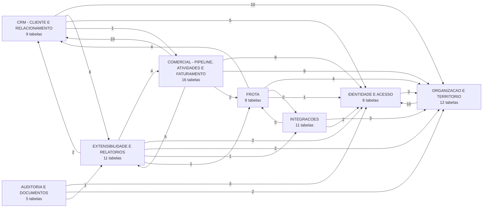
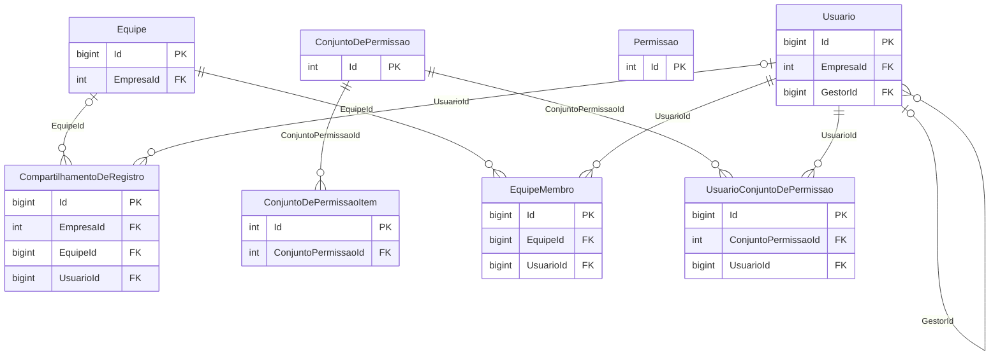
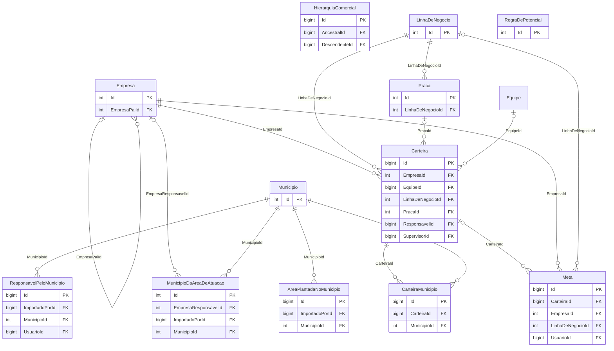
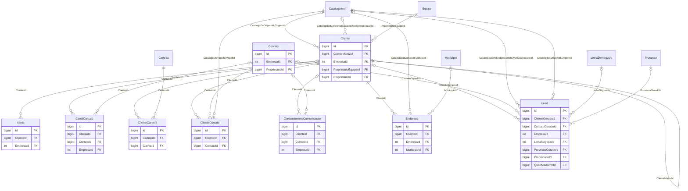
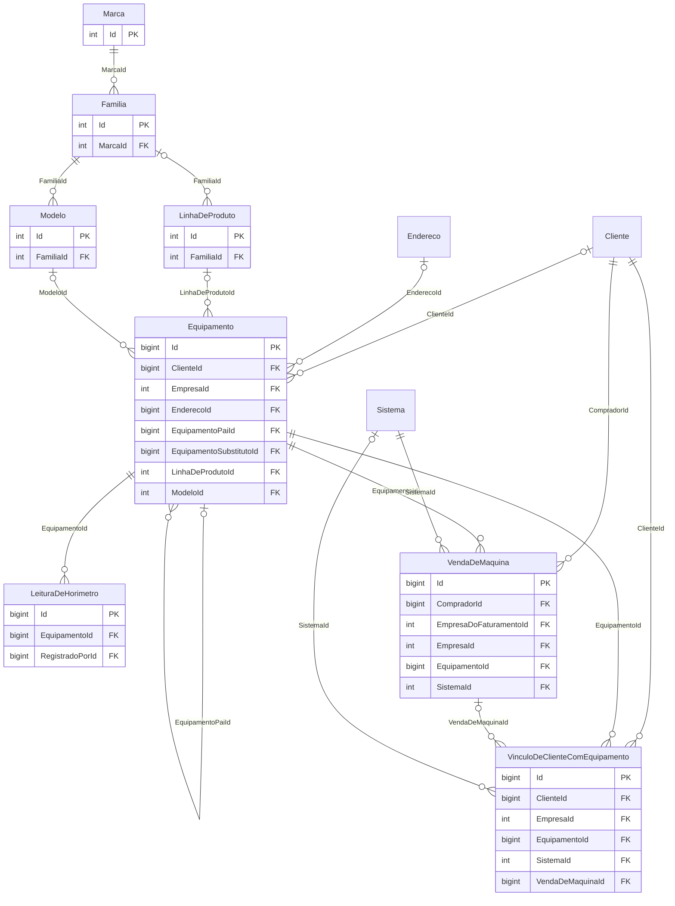
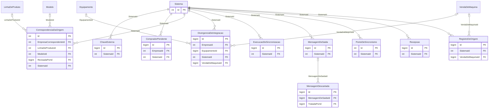
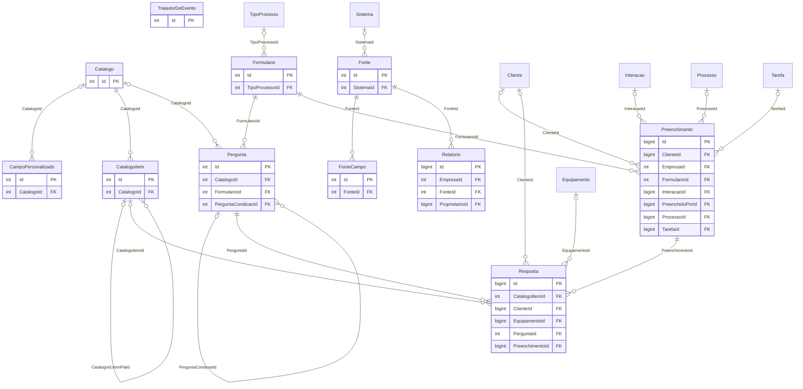
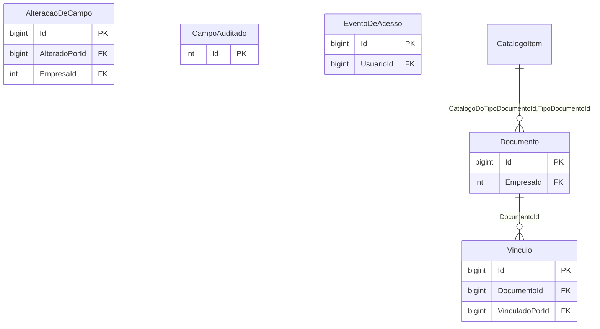

# Diagrama ER da arquitetura atual — anexo do documento 39

> Gerado por `scripts/banco/auditoria/gerar-inventario-do-banco.ps1` em 15/09/2026 13:24, a partir das
> 213 chaves estrangeiras reais do catálogo (`sys.foreign_keys`), sem interpretação. `||` = obrigatória, `|o` = opcional.
> Para não esconder o desenho atrás de dois hubs, as FKs para `Empresa` e `Usuario` só aparecem nos domínios deles;
> em cada outro domínio a quantidade omitida é informada. As tabelas de histórico de migração ficam de fora.

## Visão geral: FKs entre domínios

## IDENTIDADE E ACESSO

Tabelas: `seguranca.CompartilhamentoDeRegistro`, `seguranca.ConjuntoDePermissao`, `seguranca.ConjuntoDePermissaoItem`, `seguranca.Equipe`, `seguranca.EquipeMembro`, `seguranca.Permissao`, `seguranca.Usuario`, `seguranca.UsuarioConjuntoDePermissao`.

FKs de saída desenhadas: 8; omitidas para `Empresa`/`Usuario`: 3.

## ORGANIZACAO E TERRITORIO

Tabelas: `organizacao.AreaPlantadaNoMunicipio`, `organizacao.Carteira`, `organizacao.CarteiraMunicipio`, `organizacao.Empresa`, `organizacao.HierarquiaComercial`, `organizacao.LinhaDeNegocio`, `organizacao.Meta`, `organizacao.Municipio`, `organizacao.MunicipioDaAreaDeAtuacao`, `organizacao.Praca`, `organizacao.RegraDePotencial`, `organizacao.ResponsavelPeloMunicipio`.

FKs de saída desenhadas: 15 (referências a outros domínios: `seguranca.Equipe`); omitidas para `Empresa`/`Usuario`: 9.

## CRM - CLIENTE E RELACIONAMENTO

Tabelas: `comercial.Alerta`, `comercial.CanalContato`, `comercial.Cliente`, `comercial.ClienteCarteira`, `comercial.ClienteContato`, `comercial.ConsentimentoComunicacao`, `comercial.Contato`, `comercial.Endereco`, `comercial.Lead`.

FKs de saída desenhadas: 23 (referências a outros domínios: `organizacao.LinhaDeNegocio`, `processo.Processo`, `metadado.CatalogoItem`, `organizacao.Municipio`, `organizacao.Carteira`, `seguranca.Equipe`); omitidas para `Empresa`/`Usuario`: 11.

## COMERCIAL - PIPELINE, ATIVIDADES E FATURAMENTO

Tabelas: `comercial.FaturamentoDoCliente`, `comercial.FaturamentoSemCliente`, `processo.Fase`, `processo.Interacao`, `processo.InteracaoParticipante`, `processo.ItemDeProposta`, `processo.MotivoDePerda`, `processo.PassagemDeFase`, `processo.Processo`, `processo.Regra`, `processo.RegraExecucao`, `processo.Resultado`, `processo.Tarefa`, `processo.TipoProcesso`, `processo.TipoTarefa`, `processo.VendaPerdida`.

FKs de saída desenhadas: 57 (referências a outros domínios: `frota.Equipamento`, `frota.Modelo`, `metadado.CatalogoItem`, `comercial.Cliente`, `organizacao.LinhaDeNegocio`, `comercial.Contato`, `comercial.Lead`, `seguranca.Equipe`, `organizacao.Carteira`, `metadado.Formulario`); omitidas para `Empresa`/`Usuario`: 14.

```mermaid
erDiagram
    FaturamentoDoCliente {
        bigint Id PK
        bigint ClienteId FK
        int EmpresaId FK
    }
    FaturamentoSemCliente {
        bigint Id PK
        int EmpresaId FK
    }
    Fase {
        int Id PK
        int TipoProcessoId FK
    }
    Interacao {
        bigint Id PK
        bigint ClienteId FK
        bigint ContatoId FK
        int EmpresaId FK
        bigint LeadId FK
        bigint ProcessoId FK
        bigint RegistradoPorId FK
        int ResultadoId FK
        bigint TarefaId FK
        int TipoTarefaId FK
    }
    InteracaoParticipante {
        bigint Id PK
        bigint ContatoId FK
        bigint InteracaoId FK
        bigint UsuarioId FK
    }
    ItemDeProposta {
        bigint Id PK
        int EmpresaId FK
        bigint EquipamentoId FK
        int ModeloId FK
        bigint ProcessoId FK
    }
    MotivoDePerda {
        int Id PK
    }
    PassagemDeFase {
        bigint Id PK
        bigint EntrouPorId FK
        int FaseId FK
        bigint InteracaoOrigemId FK
        bigint ProcessoId FK
        int RegraOrigemId FK
    }
    Processo {
        bigint Id PK
        bigint CarteiraId FK
        bigint ClienteId FK
        bigint ContatoId FK
        int EmpresaId FK
        int FaseId FK
        int MotivoDePerdaId FK
        bigint ProprietarioEquipeId FK
        bigint ProprietarioId FK
        int TipoProcessoId FK
    }
    Regra {
        int Id PK
        int EfeitoFaseId FK
        int EfeitoTipoTarefaId FK
        int ResultadoId FK
        int TipoProcessoId FK
        int TipoTarefaId FK
    }
    RegraExecucao {
        bigint Id PK
        bigint DestinatarioResolvidoId FK
        bigint InteracaoId FK
        bigint ProcessoId FK
        int RegraId FK
        bigint TarefaCriadaId FK
        bigint TarefaId FK
    }
    Resultado {
        int Id PK
        int FaseDestinoId FK
        int TipoTarefaId FK
    }
    Tarefa {
        bigint Id PK
        bigint ClienteId FK
        bigint ConcluidaPorId FK
        bigint ContatoId FK
        int CriadaPorRegraId FK
        int EmpresaId FK
        bigint InteracaoConclusaoId FK
        bigint InteracaoOrigemId FK
        bigint ProcessoId FK
        bigint ResponsavelEquipeId FK
        bigint ResponsavelId FK
        int ResultadoId FK
        int TipoTarefaId FK
    }
    TipoProcesso {
        int Id PK
        int LinhaDeNegocioId FK
    }
    TipoTarefa {
        int Id PK
        int FormularioId FK
        int TipoProcessoId FK
    }
    VendaPerdida {
        bigint Id PK
        bigint ClienteId FK
        int EmpresaId FK
        int MotivoDePerdaId FK
        bigint ProcessoId FK
    }
    Cliente ||--o{ FaturamentoDoCliente : "ClienteId"
    Cliente |o--o{ Interacao : "ClienteId"
    Cliente ||--o{ Processo : "ClienteId"
    Cliente |o--o{ Tarefa : "ClienteId"
    Cliente |o--o{ VendaPerdida : "ClienteId"
    Contato |o--o{ Interacao : "ContatoId"
    Contato |o--o{ InteracaoParticipante : "ContatoId"
    Contato |o--o{ Processo : "ContatoId"
    Contato |o--o{ Tarefa : "ContatoId"
    Lead |o--o{ Interacao : "LeadId"
    Equipamento |o--o{ ItemDeProposta : "EquipamentoId"
    Modelo |o--o{ ItemDeProposta : "ModeloId"
    CatalogoItem |o--o{ ItemDeProposta : "CatalogoDaCondicaoPagamentoId,CondicaoPagamentoId"
    CatalogoItem |o--o{ Processo : "CatalogoDoConcorrenteId,ConcorrenteId"
    CatalogoItem |o--o{ VendaPerdida : "CatalogoDaRevendaId,RevendaDoConcorrenteId"
    CatalogoItem |o--o{ VendaPerdida : "CatalogoDoConcorrenteId,ConcorrenteId"
    CatalogoItem |o--o{ VendaPerdida : "CatalogoDoTipoDeEquipamentoId,TipoDeEquipamentoId"
    Formulario |o--o{ TipoTarefa : "FormularioId"
    Carteira |o--o{ Processo : "CarteiraId"
    LinhaDeNegocio |o--o{ TipoProcesso : "LinhaDeNegocioId"
    Fase ||--o{ PassagemDeFase : "FaseId"
    Fase ||--o{ Processo : "FaseId"
    Fase |o--o{ Regra : "EfeitoFaseId"
    Fase |o--o{ Resultado : "FaseDestinoId"
    Interacao ||--o{ InteracaoParticipante : "InteracaoId"
    Interacao |o--o{ PassagemDeFase : "InteracaoOrigemId"
    Interacao |o--o{ RegraExecucao : "InteracaoId"
    Interacao |o--o{ Tarefa : "InteracaoConclusaoId"
    Interacao |o--o{ Tarefa : "InteracaoOrigemId"
    MotivoDePerda |o--o{ Processo : "MotivoDePerdaId"
    MotivoDePerda ||--o{ VendaPerdida : "MotivoDePerdaId"
    Processo |o--o{ Interacao : "ProcessoId"
    Processo ||--o{ ItemDeProposta : "ProcessoId"
    Processo ||--o{ PassagemDeFase : "ProcessoId"
    Processo |o--o{ RegraExecucao : "ProcessoId"
    Processo |o--o{ Tarefa : "ProcessoId"
    Processo |o--o{ VendaPerdida : "ProcessoId"
    Regra |o--o{ PassagemDeFase : "RegraOrigemId"
    Regra ||--o{ RegraExecucao : "RegraId"
    Regra |o--o{ Tarefa : "CriadaPorRegraId"
    Resultado |o--o{ Interacao : "ResultadoId"
    Resultado |o--o{ Regra : "ResultadoId"
    Resultado |o--o{ Tarefa : "ResultadoId"
    Tarefa |o--o{ Interacao : "TarefaId"
    Tarefa |o--o{ RegraExecucao : "TarefaCriadaId"
    Tarefa |o--o{ RegraExecucao : "TarefaId"
    TipoProcesso ||--o{ Fase : "TipoProcessoId"
    TipoProcesso ||--o{ Processo : "TipoProcessoId"
    TipoProcesso |o--o{ Regra : "TipoProcessoId"
    TipoProcesso |o--o{ TipoTarefa : "TipoProcessoId"
    TipoTarefa ||--o{ Interacao : "TipoTarefaId"
    TipoTarefa |o--o{ Regra : "TipoTarefaId"
    TipoTarefa |o--o{ Regra : "EfeitoTipoTarefaId"
    TipoTarefa ||--o{ Resultado : "TipoTarefaId"
    TipoTarefa ||--o{ Tarefa : "TipoTarefaId"
    Equipe |o--o{ Processo : "ProprietarioEquipeId"
    Equipe |o--o{ Tarefa : "ResponsavelEquipeId"
```

## FROTA

Tabelas: `frota.Equipamento`, `frota.Familia`, `frota.LeituraDeHorimetro`, `frota.LinhaDeProduto`, `frota.Marca`, `frota.Modelo`, `frota.VendaDeMaquina`, `frota.VinculoDeClienteComEquipamento`.

FKs de saída desenhadas: 17 (referências a outros domínios: `comercial.Cliente`, `integracao.Sistema`, `comercial.Endereco`); omitidas para `Empresa`/`Usuario`: 5.

## INTEGRACOES

Tabelas: `integracao.ChaveExterna`, `integracao.CompradorPendente`, `integracao.CorrespondenciaDaOrigem`, `integracao.DivergenciaDeIntegracao`, `integracao.ExecucaoDeSincronizacao`, `integracao.MensagemDeSaida`, `integracao.MensagemDescartada`, `integracao.PontoDeSincronismo`, `integracao.Recepcao`, `integracao.RegistroDeOrigem`, `integracao.Sistema`.

FKs de saída desenhadas: 15 (referências a outros domínios: `frota.LinhaDeProduto`, `frota.Modelo`, `frota.Equipamento`, `frota.VendaDeMaquina`); omitidas para `Empresa`/`Usuario`: 5.

## EXTENSIBILIDADE E RELATORIOS

Tabelas: `metadado.CampoPersonalizado`, `metadado.Catalogo`, `metadado.CatalogoItem`, `metadado.Formulario`, `metadado.Pergunta`, `metadado.Preenchimento`, `metadado.Resposta`, `metadado.TratadorDeEvento`, `relatorio.Fonte`, `relatorio.FonteCampo`, `relatorio.Relatorio`.

FKs de saída desenhadas: 20 (referências a outros domínios: `processo.TipoProcesso`, `integracao.Sistema`, `comercial.Cliente`, `processo.Interacao`, `processo.Processo`, `processo.Tarefa`, `frota.Equipamento`); omitidas para `Empresa`/`Usuario`: 4.

## AUDITORIA E DOCUMENTOS

Tabelas: `auditoria.AlteracaoDeCampo`, `auditoria.CampoAuditado`, `auditoria.EventoDeAcesso`, `documento.Documento`, `documento.Vinculo`.

FKs de saída desenhadas: 2 (referências a outros domínios: `metadado.CatalogoItem`); omitidas para `Empresa`/`Usuario`: 5.

