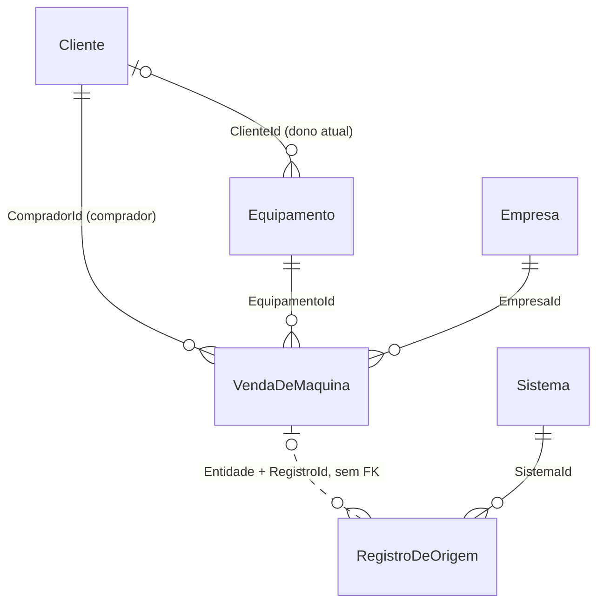
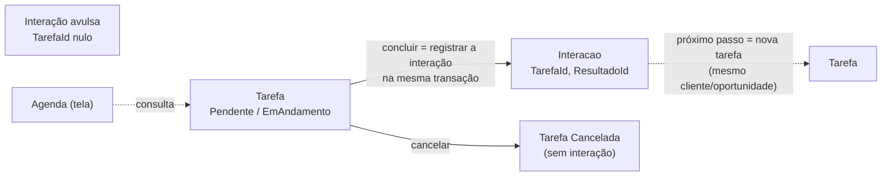
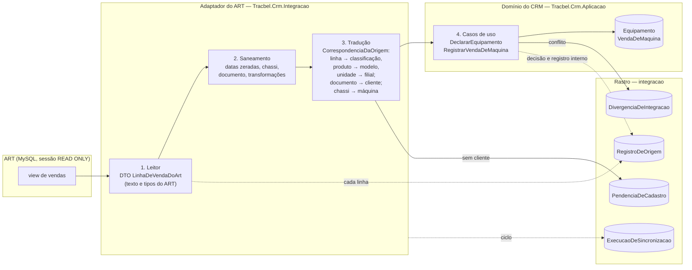
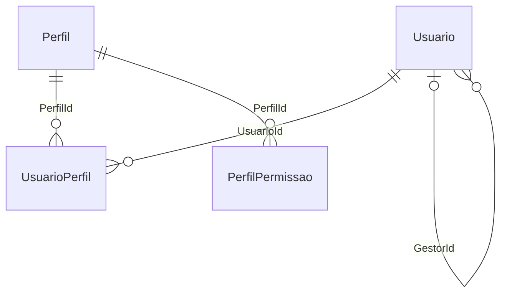
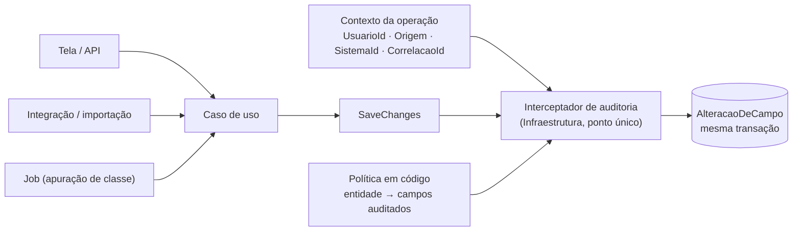
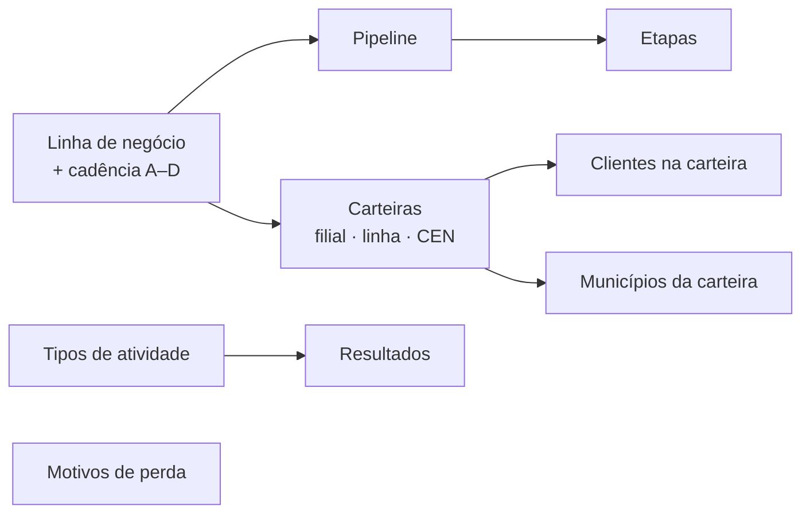
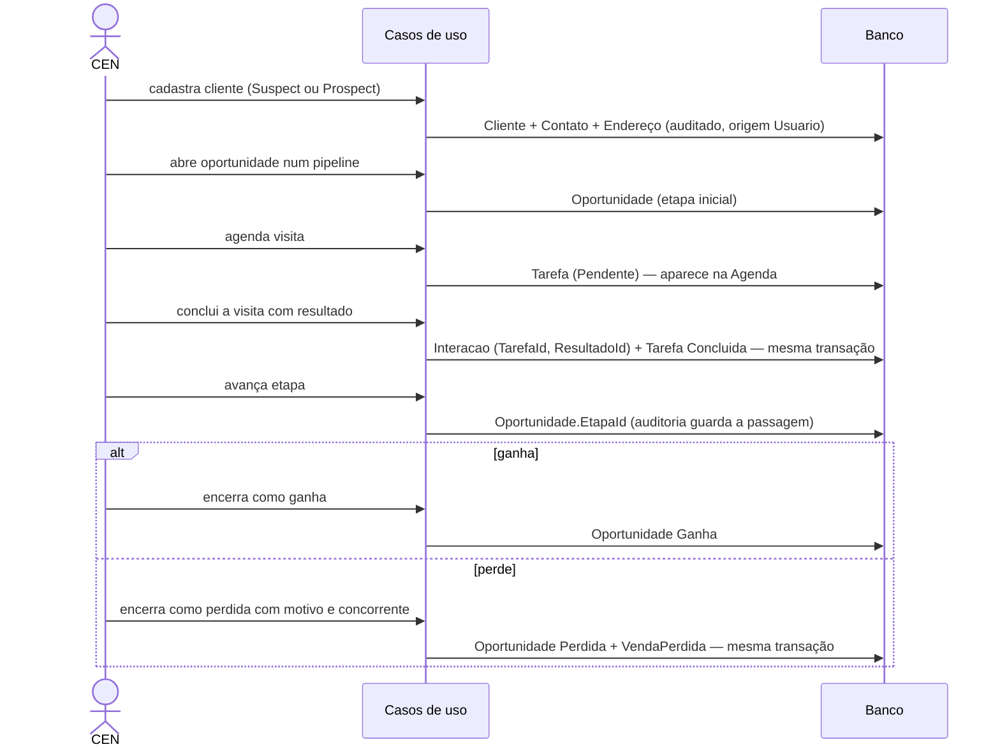
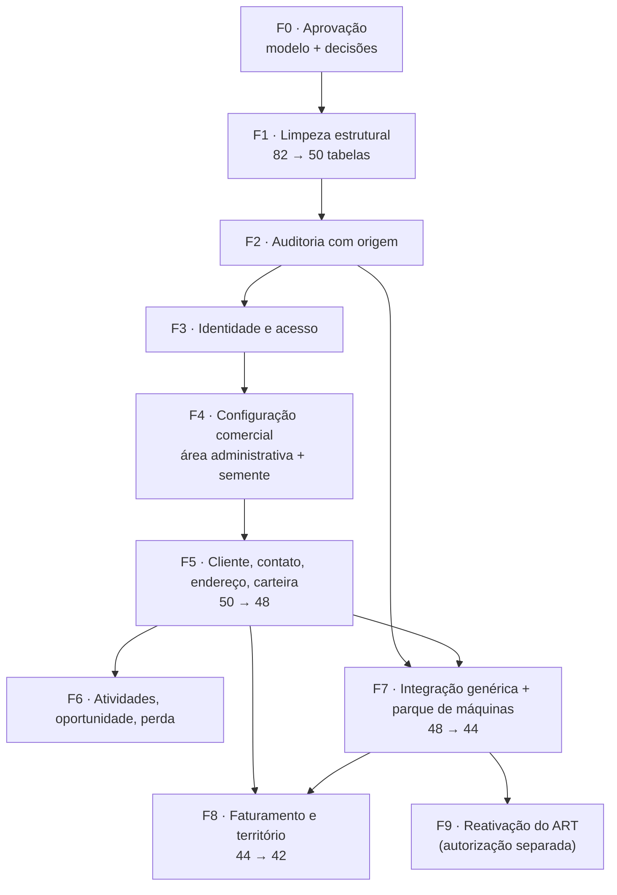

# 40 — Arquitetura alvo do banco do CRM

> **Versão 1.0 · 15/09/2026 · Fase 2 da reestruturação: desenho.** Somente análise, desenho e plano.
> Nenhuma migração, tabela, entidade, `DbContext`, endpoint, dado ou linha de código foi alterado.
> O serviço do ART continua parado e desabilitado.
>
> **Base:** [documento 39](39-AUDITORIA-ARQUITETURA-BANCO.md) (auditoria), anexos
> [39A](39A-INVENTARIO-DETALHADO-DO-BANCO.md) e [39B](39B-DIAGRAMA-ER-ATUAL.md), e o código real em
> `src/` (domínio, repositórios, cargas, contratos e telas), relido para esta fase.
>
> **Anexos deste documento:**
> [40A — Diagrama ER da arquitetura alvo](40A-ERD-ARQUITETURA-ALVO.md) ·
> [40B — Matriz atual → alvo das 82 tabelas](40B-MATRIZ-ATUAL-PARA-ALVO.md).
>
> **Nada daqui será implementado sem aprovação explícita do modelo.** As decisões que dependem do
> negócio estão na seção 18.

## Sumário

1. [Resumo executivo](#1-resumo-executivo)
2. [Problemas atuais](#2-problemas-atuais)
3. [Princípios da nova arquitetura](#3-princípios-da-nova-arquitetura)
4. [Domínios](#4-domínios)
5. [Entidades core](#5-entidades-core)
6. [Fontes da verdade](#6-fontes-da-verdade)
7. [Modelo alvo](#7-modelo-alvo)
8. [Mapeamento das 82 tabelas](#8-mapeamento-das-82-tabelas)
9. [Consolidações](#9-consolidações)
10. [Remoções propostas](#10-remoções-propostas)
11. [Integrações](#11-integrações)
12. [Permissões](#12-permissões)
13. [Auditoria](#13-auditoria)
14. [Fluxos](#14-fluxos)
15. [Impactos](#15-impactos)
16. [Riscos](#16-riscos)
17. [Ordem de implementação](#17-ordem-de-implementação)
18. [Decisões para aprovação](#18-decisões-para-aprovação)

---

## 1. Resumo executivo

### 1.1 A contagem oficial

| Conjunto | Tabelas | O que é |
|---|---:|---|
| **Tabelas físicas no banco `TracbelCrm`** | **82** | **contagem oficial de toda a reestruturação** |
| Tabelas do modelo EF Core (domínio), em 10 schemas | 80 | as entidades mapeadas em `Persistencia/Configuracoes` |
| Tabelas técnicas | 2 | `metadado.__EFMigrationsHistory` (12 linhas, a configurada) e `dbo.__EFMigrationsHistory` (0 linhas, órfã) |

**De onde vinha o 80.** É o número de tabelas do modelo, e aparece em três lugares: documento 14,
seção 2.1 ("80 tabelas em 10 schemas"); `EsquemaENomenclaturaTestes.cs:112`; e
`MigracaoNoContainerTestes.cs:64`. O documento 39 usou 80 como denominador dos percentuais sobre
entidades ("35 das 80") porque as duas tabelas de histórico de migração não são domínio — e usou 82
para o inventário físico. Os dois números estavam certos, mas a diferença não estava dita.

**Como citar daqui em diante:**

- "82 tabelas" = físicas, sempre;
- "80 tabelas de domínio" quando o assunto for o modelo;
- "35 tabelas de domínio nunca tiveram linha" — **36 das 82 físicas**, contando a órfã
  `dbo.__EFMigrationsHistory`, que também nunca teve.

### 1.2 A resposta

> **Se construíssemos este CRM hoje, com os requisitos que realmente existem, o banco teria 42 tabelas
> físicas — 41 de domínio e 1 técnica — com 86 chaves estrangeiras e nenhum ciclo.**

| | Hoje | Alvo |
|---|---:|---:|
| Tabelas físicas | 82 | **42** |
| Tabelas de domínio | 80 | **41** |
| Chaves estrangeiras | 213 | **86** |
| Ciclos | 1 | 0 |
| Tabelas que nunca tiveram linha | 35 | 0 |

Das 40 tabelas que saem:

- **20 são removidas** — ideias não implementadas, redundâncias sem uso e a tabela órfã;
- **9 são absorvidas** por tabelas que ficam (8 consolidações e `ResponsavelPeloMunicipio`, que
  depende de decisão do comercial);
- **11 não são criadas agora** — voltam com a funcionalidade, pela migração da própria entrega.

### 1.3 As decisões centrais

1. **Configuração é do CRM.** Pipeline, etapa, tipo de atividade, resultado, motivo de perda, linha de
   negócio e carteira ganham tela administrativa e semente mínima estrutural. Hoje só a carga as
   preenchia, e depois da sanitização nada consegue recriá-las.
2. **Uma fonte por pergunta.** Uma classe de cliente, uma cadência, uma hierarquia, uma autoridade de
   permissão, um responsável por município em cada linha, um lugar para a perda, uma tabela de
   faturamento.
3. **Tarefa é plano, interação é fato, agenda é tela.** O vínculo passa a ter um sentido só
   (`Interacao.TarefaId`) e o ciclo acaba.
4. **Venda é evento, posse é estado.** `VendaDeMaquina` guarda o fato com o comprador;
   `Equipamento.ClienteId` guarda o dono atual; o vínculo 1:1 sai.
5. **O domínio não conhece a origem.** Nenhuma coluna "NaOrigem", `SistemaId` ou `ChaveOrigem` em
   tabela de domínio: o rastreio de todo dado externo vai para `RegistroDeOrigem`, e o ART passa por um
   adaptador anticorrupção.
6. **Toda gravação é auditada, com origem** — usuário, integração, importação, sistema ou job —, por
   interceptador, e não mais só pelas cargas.
7. **Só existe tabela com comportamento.** Formulário, anexos, metas, proposta itemizada, histórico de
   etapa, consentimento e log de acesso entram quando a funcionalidade entrar.

### 1.4 O que mudou em relação ao documento 39

O documento 39 propôs **47 tabelas ativas + 13 futuras**. Este documento, com o código relido e o
princípio "só persistir o que tem comportamento", chega a **41 + 11**:

| Mudança | Tabelas | Motivo |
|---|---:|---|
| `ClienteContato` e `CanalContato` viram colunas de `Contato` | −2 | 23.313 vínculos para 23.313 contatos; canal nunca preenchido |
| `ChaveExterna`, `PontoDeSincronismo` e `MensagemDescartada` são absorvidas pela integração genérica | −3 | três mecanismos para o que `RegistroDeOrigem` e `ExecucaoDeSincronizacao` já fazem |
| `ResponsavelPeloMunicipio` vira `CarteiraMunicipio` depois da conciliação | −1 | é afirmação de planilha, não atribuição |
| `Regra` e `RegraExecucao` saem das futuras para remoção | −2 futuras | automação, se vier, será redesenhada com empresa e com o fluxo real |

---

## 2. Problemas atuais

Resumo do documento 39, acrescido do que a releitura do código mostrou nesta fase.

| # | Problema | Evidência | Seção do doc 39 |
|---:|---|---|---|
| 1 | Dois modelos sobrepostos: 63 tabelas desenhadas de uma vez, 35 nunca usadas; 17 criadas por demanda | migração `ModeloInicial` | 21 |
| 2 | A aplicação só grava `Cliente` e `Equipamento`; a configuração do processo só entrava pela carga | rotas de processo, tarefa e interação são só `GET` | 5.3 |
| 3 | Permissão em três lugares | `EscopoDeAcesso.cs:41` (lista fixa), tabelas de conjunto vazias, `Usuario.Papel` sem uso | 16 |
| 4 | Hierarquia em cinco lugares, nenhum usado | `Usuario.GestorId` só declarado; `HierarquiaComercial` e `Equipe` vazias; `Carteira.SupervisorId`; `ContextoAcesso.SubordinadosIds` montado vazio (`EscopoDeAcesso.cs:129`) | 16 |
| 5 | **Duas classes de cliente em telas diferentes** (achado desta fase) | Cobertura lê `ClienteCarteira.Classe` (`RepositorioDeCarteiras.cs:49`, `:147-170`), que veio do campo `Potencial` do Vórtice — só 487 de 139.072 vínculos traziam uma letra, o resto virou "C" por padrão (`SaneamentoDeProcesso.cs:191-203`). Performance, Visão 360 e Indicadores leem `Cliente.Classe`, apurada do faturamento (`CargaDeProcessoDoVortice.Faturamento.cs:283-326`; `RepositorioDoPainelDoCen.cs:129`) | 16 |
| 6 | **Duas cadências** (achado desta fase) | Cobertura usa `ClienteCarteira.DiasCicloContato` (`ContratosDeRelacionamento.cs:333-337`); Performance e Indicadores usam `LinhaDeNegocio.DiasCicloClasseA..D` pela classe do cliente (`RepositorioDeIndicadoresExecutivos.cs:195-199`). O mesmo cliente pode estar "atrasado" numa tela e "em dia" na outra | — |
| 7 | Venda, vínculo e linhagem repetidos | 2.108 = 2.108; natureza com um valor; 7 colunas iguais a `RegistroDeOrigem` | 8.2 |
| 8 | Faturamento em duas tabelas gêmeas | 17 de 18 colunas iguais | 8.2 |
| 9 | Ciclo `Tarefa` ↔ `Interacao` com a mesma relação nos dois sentidos | `Tarefa.Concluir` grava `InteracaoConclusaoId`; `Interacao.Registrar` grava `TarefaId` | 14.4 |
| 10 | Integração dentro do domínio | `VendaDeMaquina` com 12 colunas de origem; `Equipamento.Origem`; linhagem de planilha no território | 19 |
| 11 | O que a API altera não é auditado | só as cargas chamam `AlteracaoDeCampo.Registrar`; nenhum interceptador | 5.2 |
| 12 | Vocabulário duplo | a tela diz oportunidade, pipeline e atividade; o banco diz processo, tipo de processo e tipo de tarefa | 17 |

---

## 3. Princípios da nova arquitetura

| # | Princípio | Consequência no modelo |
|---:|---|---|
| P1 | **Uma pergunta, uma fonte.** | Cada informação da seção 6 tem um dono; o que é lido em outro lugar é consulta, não cópia. |
| P2 | **Só persistir estrutura quando houver comportamento real que precise dela.** | Tabela entra com a funcionalidade que a lê e a grava, pela migração da mesma entrega. Nenhuma tabela "para depois". |
| P3 | **A configuração é do CRM.** | Tela administrativa + semente mínima estrutural. A carga não é mais a única porta. |
| P4 | **O domínio não conhece a origem.** | Nenhuma coluna `...NaOrigem`, `SistemaId`, `ChaveOrigem`, `ArquivoDeOrigem` em tabela de domínio. O rastreio externo mora em `RegistroDeOrigem`. |
| P5 | **Derivado não se grava** — salvo fotografia datada e declarada. | Ficam só `Cliente.Classe` + `ClasseApuradaEm` e `Empresa.Caminho`. Sai o cache de última interação, a segunda classe, a segunda cadência. |
| P6 | **Fato é imutável; estado é atual.** | `Interacao` e `VendaDeMaquina` são eventos. `Tarefa`, `Oportunidade` e `Equipamento` são estado. |
| P7 | **Relação num sentido só.** | Sem FK dupla e sem ciclo. |
| P8 | **Toda gravação é auditada, com origem.** | Interceptador único; a carga deixa de escrever auditoria à mão. |
| P9 | **FK é relação de negócio.** | Colunas de autoria (`CriadoPorId`, `AlteradoPorId`...) são referência lógica, sem FK, em todo o modelo. |
| P10 | **Nome de negócio.** | `Pipeline`, `Etapa`, `Oportunidade`, `TipoDeAtividade`, `ResultadoDeAtividade`, `ClassificacaoDeProduto`, `Perfil`. |
| P11 | **Multiempresa continua como está.** | `EmpresaId` + filtro global + `Profundidade`. |
| P12 | **Primeiro tirar o que não tem uso.** | A remoção das tabelas vazias e sem código vem antes de qualquer refatoração: diminui o que cada fase precisa entender. |

### 3.1 Entidade, catálogo, integração, visualização

Cada conceito foi classificado antes de virar — ou não virar — tabela.

| Tipo | Critério | No alvo |
|---|---|---|
| **Entidade** | tem ciclo de vida próprio: nasce, muda de estado, é referenciada | `Usuario`, `Empresa`, `Cliente`, `Contato`, `Endereco`, `Carteira`, `ClienteCarteira`, `CarteiraMunicipio`, `MunicipioDaAreaDeAtuacao`, `Oportunidade`, `Tarefa`, `Interacao`, `VendaPerdida`, `Equipamento`, `VendaDeMaquina` |
| **Catálogo / configuração** | classifica ou parametriza; muda por administração | `Perfil`, `PerfilPermissao`, `UsuarioPerfil`, `LinhaDeNegocio`, `Pipeline`, `Etapa`, `TipoDeAtividade`, `ResultadoDeAtividade`, `MotivoDePerda`, `Catalogo`, `CatalogoItem`, `Marca`, `Familia`, `Modelo`, `ClassificacaoDeProduto`, `Municipio`, `RegraDePotencial` |
| **Dado de referência externo** | pertence a outro sistema e é espelhado para leitura | `Faturamento` (Protheus), `AreaPlantadaNoMunicipio` (IBGE) |
| **Integração** | existe porque um sistema externo existe | `Sistema`, `RegistroDeOrigem`, `CorrespondenciaDaOrigem`, `DivergenciaDeIntegracao`, `ExecucaoDeSincronizacao`, `PendenciaDeCadastro` |
| **Registro técnico** | trilha da operação | `AlteracaoDeCampo`, `__EFMigrationsHistory` |
| **Visualização — sem tabela** | é leitura composta | Agenda, Visão 360, Cobertura, Funil, Performance, Indicadores Geográficos, linha do tempo do cliente, máquinas compradas, alertas da Visão 360, dono atual × comprador |

**A Agenda é visualização.** Confirmado no código: não existe tabela de agenda;
`RepositorioDeTarefas.ResumirAgendaAsync` e a rota `/api/v1/relatorios/agenda` leem `Tarefa` por
responsável e `AgendadaPara`. Continua assim.

### 3.2 Política para funcionalidades futuras

- Tabela sem funcionalidade **não é criada**. A migração nasce na entrega da funcionalidade.
- O desenho das 11 estruturas futuras continua registrado (documento 17, seção 8, e seção 10.3 deste
  documento), mas não ocupa o banco.
- **Exceção única:** quando a funcionalidade futura depender de dado que se perde se não for gravado
  desde já. Nesta análise, só um caso chegou perto — o histórico de etapas da oportunidade — e ele é
  coberto pela auditoria de `Oportunidade.EtapaId` (seção 13), sem tabela própria.

---

## 4. Domínios

A sugestão do pedido foi usada como ponto de partida e ajustada ao código.

| Domínio | Responsabilidade | Tabelas no alvo | Schema físico |
|---|---|---|---|
| **Identidade e acesso** | quem é o usuário e o que ele pode fazer | `Usuario`, `Perfil`, `PerfilPermissao`, `UsuarioPerfil` | `seguranca` |
| **Organização** | a estrutura de filiais e a fronteira de acesso | `Empresa` | `organizacao` |
| **Território** | onde a Tracbel atua, quem atende cada município, o potencial | `Municipio`, `MunicipioDaAreaDeAtuacao`, `CarteiraMunicipio`, `AreaPlantadaNoMunicipio`, `RegraDePotencial` | `organizacao` |
| **CRM** | o cliente, seus contatos, endereços e carteiras | `Cliente`, `Contato`, `Endereco`, `Carteira`, `ClienteCarteira` | `comercial` |
| **Configuração comercial** | como o processo comercial funciona — administrado no CRM | `LinhaDeNegocio`, `Pipeline`, `Etapa`, `TipoDeAtividade`, `ResultadoDeAtividade`, `MotivoDePerda` | `processo` |
| **Atividades** | o que precisa ser feito e o que aconteceu | `Tarefa`, `Interacao` | `processo` |
| **Comercial** | o negócio em andamento, a perda e o faturamento | `Oportunidade`, `VendaPerdida`, `Faturamento` | `comercial` |
| **Parque de máquinas** | a máquina e suas vendas | `Equipamento`, `VendaDeMaquina` | `frota` |
| **Catálogo** | listas e catálogo de produto | `Catalogo`, `CatalogoItem`, `Marca`, `Familia`, `Modelo`, `ClassificacaoDeProduto` | `metadado` e `frota` |
| **Integrações** | rastreio, conciliação e execução das integrações | `Sistema`, `RegistroDeOrigem`, `CorrespondenciaDaOrigem`, `DivergenciaDeIntegracao`, `ExecucaoDeSincronizacao`, `PendenciaDeCadastro` | `integracao` |
| **Auditoria** | quem alterou o quê, quando e de onde | `AlteracaoDeCampo` | `auditoria` |

**8 schemas** (hoje 10 + `dbo`): saem `documento`, `relatorio` e `dbo`. Mudanças de schema
propostas, feitas enquanto as tabelas estão vazias: `Carteira` de `organizacao` para `comercial`;
`LinhaDeNegocio` de `organizacao` para `processo`; `Oportunidade` e `VendaPerdida` de `processo` para
`comercial` (decisão D-9).

### 4.1 O que foi ajustado na sugestão

| Sugestão | Ajuste | Por quê |
|---|---|---|
| Organização: Empresa, **Filial**, **Hierarquia** | só `Empresa` | a filial já é `Empresa` com `EmpresaPaiId` e caminho materializado; hierarquia de pessoas é `Usuario.GestorId`, não tabela |
| CRM: Cliente, Contato, Carteira, **Oportunidade** | Oportunidade vai para Comercial | carteira é relação com o cliente; oportunidade é o negócio, com perda e valor |
| Atividades: Tarefa, Interação, **Agenda** | sem Agenda | é leitura de `Tarefa` |
| Comercial: **Venda**, Faturamento, **Equipamento** | venda de máquina e equipamento em Parque de máquinas | a máquina tem ciclo de vida sem venda — a do concorrente, declarada pelo CEN, é a que mais interessa à cobertura |
| Catálogo: Marca, Família, Modelo, **Classificação** | + `Catalogo`/`CatalogoItem`; Classificação = `ClassificacaoDeProduto` (hoje `LinhaDeProduto`) | as listas genéricas também são catálogo |
| Território: Município, **Território**, **Responsável** | Território = `MunicipioDaAreaDeAtuacao`; Responsável = `CarteiraMunicipio` | responsável não é tabela à parte: é a carteira que atende o município |
| Integrações: **ART**, RegistroDeOrigem, Sincronização | ART não é tabela | o ART é um adaptador (seção 11) |
| Auditoria: alterações, **logs**, **histórico** | só `AlteracaoDeCampo` | log de aplicação fica fora do banco; histórico é a própria auditoria |
| — | **novo:** Configuração comercial | é o que precisa de tela administrativa, e hoje não tem dono |

---

## 5. Entidades core

Para cada uma: por que existe · responsabilidade · quem altera · módulo dono · quem referencia · de que
ela é — e de que ela **não** é — fonte da verdade.

### Cliente

- **Por que existe:** é a pessoa física ou jurídica com quem a Tracbel se relaciona, em qualquer
  estágio (suspect, prospect, cliente, inativo, encerrado).
- **Responsabilidade:** dados cadastrais básicos — nome, documento, inscrição, atividade econômica,
  situação, origem, proprietário do cadastro — e a classe apurada.
- **Quem altera:** usuário com `Cliente.Editar`; a apuração de classe (job, origem Sistema).
- **Módulo dono:** CRM.
- **Referenciada por:** `Contato`, `Endereco`, `ClienteCarteira`, `Oportunidade`, `Tarefa`,
  `Interacao`, `VendaPerdida`, `Faturamento`, `Equipamento`, `VendaDeMaquina`, `PendenciaDeCadastro`.
- **É fonte de:** cadastro; situação no funil de relacionamento (substitui `Lead`); classe do cliente.
- **Não é fonte de:** território (é da carteira), vendas (`VendaDeMaquina`), faturamento
  (`Faturamento`), permissões (`Perfil`), agenda (`Tarefa`), contatos (`Contato`), endereço (`Endereco`).

### Contato

- **Por que existe:** a pessoa do cliente com quem se fala.
- **Responsabilidade:** nome, papel, e-mail, telefone, celular.
- **Quem altera:** usuário com `Cliente.Editar` (o contato herda a permissão do cliente).
- **Módulo dono:** CRM.
- **Referenciada por:** `Oportunidade`, `Tarefa`, `Interacao`.
- **É fonte de:** meio de falar com a pessoa. **Não é fonte de:** consentimento (não existe ainda).

### Carteira e ClienteCarteira

- **Por que existem:** o CEN atende um conjunto de clientes em cada linha de negócio; um cliente está
  em várias carteiras, uma por linha.
- **Responsabilidade:** `Carteira` — filial, linha, código, nome, CEN responsável, natureza;
  `ClienteCarteira` — o vínculo com vigência.
- **Quem altera:** administrador comercial (tela de carteiras).
- **Módulo dono:** CRM.
- **Referenciadas por:** `CarteiraMunicipio`, `Oportunidade` (carteira de origem).
- **São fonte de:** quem atende o cliente em cada linha; quem atende o município (via
  `CarteiraMunicipio`). **Não são fonte de:** classe (é do cliente), cadência (é da linha), última
  interação (é de `Interacao`).

### Oportunidade (hoje `Processo`)

- **Por que existe:** o negócio em andamento num pipeline.
- **Responsabilidade:** pipeline, etapa atual e desde quando, situação, valores, previsões, dono.
- **Quem altera:** o proprietário e quem tem `Oportunidade.Editar` na profundidade.
- **Módulo dono:** Comercial.
- **Referenciada por:** `Tarefa`, `Interacao`, `VendaPerdida`.
- **É fonte de:** estado do negócio. **Não é fonte de:** motivo e concorrente da perda
  (`VendaPerdida`), histórico de etapas (auditoria), itens da proposta (não existe ainda).

### Tarefa

- **Por que existe:** algo que precisa ser feito por alguém, numa data.
- **Responsabilidade:** tipo de atividade, responsável, agenda, prazo, prioridade, situação.
- **Quem altera:** o responsável e quem tem `Tarefa.Editar`.
- **Módulo dono:** Atividades.
- **Referenciada por:** `Interacao` (a interação que a realizou).
- **É fonte de:** o que está planejado. **Não é fonte de:** o que aconteceu nem o resultado (é da
  `Interacao`).

### Interação

- **Por que existe:** o contato que aconteceu — fato imutável.
- **Responsabilidade:** tipo, quando, com quem, resultado, natureza, coordenada, quem registrou.
- **Quem altera:** ninguém; corrige-se com nova interação (regra atual do domínio).
- **Módulo dono:** Atividades.
- **Referenciada por:** ninguém (é folha do grafo).
- **É fonte de:** histórico de relacionamento, última interação, resultado da atividade.

### Equipamento

- **Por que existe:** a máquina, identificada pelo chassi — da Tracbel ou de concorrente.
- **Responsabilidade:** identificação, modelo ou classificação, dono atual, horímetro declarado,
  situação.
- **Quem altera:** usuário com `Equipamento.Editar`; a integração, quando cria a máquina de uma venda.
- **Módulo dono:** Parque de máquinas.
- **Referenciada por:** `VendaDeMaquina`, `DivergenciaDeIntegracao`.
- **É fonte de:** **quem tem a máquina hoje**. **Não é fonte de:** quem comprou nem quando (é da
  venda); de que sistema veio (é de `RegistroDeOrigem`).

### VendaDeMaquina

- **Por que existe:** a venda de uma máquina é um evento com data, filial e comprador; a mesma máquina
  pode ser vendida mais de uma vez (nova e depois usada).
- **Responsabilidade:** máquina, comprador, filial que vendeu e que faturou, datas, pedido, nota.
- **Quem altera:** a integração (hoje só o ART); correção humana por divergência.
- **Módulo dono:** Parque de máquinas.
- **Referenciada por:** `DivergenciaDeIntegracao`.
- **É fonte de:** comprador em cada venda e datas da venda. **Não é fonte de:** dono atual; linhagem
  da origem.

### Usuário e Empresa

- **Usuário** — espelho do Entra ID; fonte de identidade, filial de casa, gestor direto e natureza da
  conta. Alterado pelo primeiro login (vínculo ao Entra ID) e pela administração de usuários. Não é
  fonte de permissão (é de `UsuarioPerfil`).
- **Empresa** — a filial e sua posição na árvore; fonte da fronteira multiempresa. Alterada só por
  administração. Não é fonte de território (é de `MunicipioDaAreaDeAtuacao`).

### Faturamento (core de leitura)

- **Por que existe:** o que a Tracbel faturou, por filial, mês e contraparte — espelho agregado do
  Protheus, que é o dono.
- **Quem altera:** só a integração com o Protheus.
- **É fonte de:** faturamento no CRM e base da classe do cliente. **Não é fonte de:** nota fiscal
  (fica no Protheus), cadastro de quem não é cliente (é de `PendenciaDeCadastro`).

---

## 6. Fontes da verdade

### 6.1 Quadro geral

| Informação | Hoje (concorrentes) | Fonte canônica no alvo | O que sai |
|---|---|---|---|
| **O que o usuário pode fazer** | lista fixa em código · tabelas de conjunto · `Usuario.Papel` | `UsuarioPerfil` → `Perfil` → `PerfilPermissao`; catálogo de permissões em código | lista fixa, `Usuario.Papel`, `seguranca.Permissao` |
| **Hierarquia** | `Usuario.GestorId` · `HierarquiaComercial` · `Carteira.SupervisorId` · `Equipe`/`EquipeMembro.EhLider` · planilha de gestor | `Usuario.GestorId` | as demais |
| **Filial responsável pelo município** | `MunicipioDaAreaDeAtuacao.EmpresaResponsavelId` · planilhas | `MunicipioDaAreaDeAtuacao` | linhagem de planilha na tabela |
| **CEN que atende o município** | `CarteiraMunicipio` → `Carteira.ResponsavelId` · `ResponsavelPeloMunicipio` (2 planilhas) | `CarteiraMunicipio` → `Carteira.ResponsavelId` | `ResponsavelPeloMunicipio`, depois da conciliação |
| **Município do endereço** | `MunicipioId` · `Municipio` (texto) · `Uf` | `Endereco.MunicipioId` | texto e UF |
| **Classe do cliente** | `Cliente.Classe` (faturamento) · `ClienteCarteira.Classe` (Vórtice, "C" por padrão) | `Cliente.Classe` + `ClasseApuradaEm` | `ClienteCarteira.Classe`, `Cliente.FaturamentoApurado` |
| **Cadência de contato** | `LinhaDeNegocio.DiasCicloClasseA..D` · `ClienteCarteira.DiasCicloContato` | `LinhaDeNegocio` × `Cliente.Classe` | `ClienteCarteira.DiasCicloContato` |
| **Última interação** | `ClienteCarteira.UltimaInteracaoEm` · `MAX(Interacao.OcorridaEm)` | `Interacao` (consulta por índice) | o cache |
| **Dono da máquina** | `Equipamento.ClienteId` · vínculo · comprador da venda | `Equipamento.ClienteId` | vínculo |
| **Comprador da venda** | `VendaDeMaquina.CompradorId` · vínculo | `VendaDeMaquina.CompradorId` | vínculo |
| **Data da venda** | `Equipamento.VendidoEm` · `VendaDeMaquina.VendidaEm` | `VendaDeMaquina` | `Equipamento.VendidoEm` |
| **Linhagem de dado externo** | colunas "NaOrigem" · `ChaveExterna` · `RegistroDeOrigem` · `MensagemDescartada` · colunas de arquivo e linha | `RegistroDeOrigem` | as demais |
| **Marca d'água da sincronização** | `PontoDeSincronismo` · `ExecucaoDeSincronizacao` | última `ExecucaoDeSincronizacao` com sucesso | `PontoDeSincronismo` |
| **Perda** | `Processo.MotivoDePerdaId`/`ConcorrenteId`/`ObservacaoDaPerda` · `VendaPerdida` | `VendaPerdida` | colunas de perda da oportunidade |
| **Faturamento** | `FaturamentoDoCliente` · `FaturamentoSemCliente` · `Cliente.FaturamentoApurado` · `CompradorPendente.NotasNoProtheus` | `Faturamento` | as demais |
| **Pessoa sem cadastro** | `CompradorPendente` · `FaturamentoSemCliente` · `Lead` | `PendenciaDeCadastro` (fila) e `Faturamento.Natureza` (o valor) | `Lead`, a fotografia do Protheus |
| **Tarefa × interação** | `Tarefa.InteracaoConclusaoId` · `Interacao.TarefaId` · `Tarefa.ResultadoId` | `Interacao.TarefaId` e `Interacao.ResultadoId` | os campos da tarefa |
| **Classificação da máquina** | `Equipamento.LinhaDeProdutoId` · família do modelo | `Modelo.ClassificacaoDeProdutoId`; `Equipamento.ClassificacaoDeProdutoId` só sem modelo | `LinhaDeProduto.FamiliaId` |

### 6.2 Permissões

Hoje há três autoridades, e só uma decide de verdade:

1. **Código** — `EscopoDeAcesso.PermissoesConcedidas` (`EscopoDeAcesso.cs:41`) dá a todo usuário
   `Cliente.*`, `Equipamento.*`, `Catalogo.Ler` e `Lead.Ler` em `EmpresaEAbaixo`.
2. **Tabelas** — `UsuarioConjuntoDePermissao` → `ConjuntoDePermissao` → `ConjuntoDePermissaoItem`
   somam ao código (`EscopoDeAcesso.cs:103-122`). Estão vazias.
3. **`Usuario.Papel`** — texto "para leitura rápida na tela" (`Usuario.cs:72`); não autoriza nada.

Mais uma: `seguranca.Permissao`, catálogo sem FK e sem uso.

**Arquitetura oficial proposta:**

- **Catálogo de permissões: código**, numa classe única de constantes `Entidade.Verbo` com descrição.
  Quem verifica a permissão é o código; uma permissão que só existe na tabela não protege nada.
  A tela administrativa lista o catálogo por uma rota de leitura.
- **Concessão: banco**, e só banco. `Usuario` ↕ `UsuarioPerfil` ↕ `Perfil` ↕ `PerfilPermissao`
  (código + profundidade). A lista fixa do código vira o **perfil padrão** (`Perfil.EhPadrao`),
  semeado e editável.
- **`Usuario.Papel` sai.** O que a tela mostra é o nome dos perfis vigentes.
- Detalhe na seção 12.

### 6.3 Hierarquia

Onde ela está hoje, e o que é de fato usado:

| Lugar | Estado |
|---|---|
| `Usuario.GestorId` | declarado; nenhum código lê |
| `organizacao.HierarquiaComercial` | vazia; nenhum código |
| `Carteira.SupervisorId` | carregado da origem, onde era nulo em 655 de 655 carteiras (comentário de `ContextoAcesso.cs:9-12`) |
| `seguranca.Equipe` / `EquipeMembro.EhLider` | vazias |
| `ContextoAcesso.SubordinadosIds` / `EquipesIds` | sempre conjuntos vazios (`EscopoDeAcesso.cs:129-130`) — a profundidade `Equipe` nunca alcança subordinado |
| planilha "CEN e Gestor por Município" | afirmação de fonte em `ResponsavelPeloMunicipio` |

**Fonte única: `Usuario.GestorId`.** Os subordinados são calculados na montagem do contexto de
acesso, por consulta recursiva, uma vez por sessão. A *closure table* só volta se a medição mostrar
necessidade. O supervisor de uma carteira é o gestor do CEN responsável. O gestor que a planilha
declara, depois de conciliado, é gravado em `GestorId`.

### 6.4 Território

Três perguntas diferentes, três fontes — e nenhuma concorre com outra:

| Pergunta | Fonte canônica |
|---|---|
| O município está na área de atuação? É ADR? Que filial responde por ele? | `MunicipioDaAreaDeAtuacao` |
| Que CEN atende o município, em cada linha de negócio? | `CarteiraMunicipio` → `Carteira.ResponsavelId` |
| Quem é o gestor desse CEN? | `Usuario.GestorId` |

`ResponsavelPeloMunicipio` não é atribuição: guarda **o que duas planilhas afirmam**, e elas discordam
sobre o CEN em 82 municípios (comentário de `AreaDeAtuacao.cs:186-189`). Ela continua existindo até o
comercial confirmar a planilha vigente; a confirmação vira `CarteiraMunicipio`, e a tabela sai
(decisão D-4). A regra "o CEN de uma carteira da filial X atende município de responsabilidade da
filial Y" passa a ser **validação**, não um terceiro cadastro.

### 6.5 Município

- **Referência única: `Endereco.MunicipioId`**, obrigatória.
- O código IBGE mora **só** em `Municipio.CodigoIbge` (obrigatório); a UF, **só** em `Municipio.Uf`.
- O texto `Endereco.Municipio` existia para o resíduo da migração do Vórtice que não casava com o
  catálogo (`Endereco.cs:125-139`). Depois da sanitização não há endereço nenhum, e nova carga do
  Vórtice está vetada: o resíduo deixou de existir, e a coluna, a `Uf` e a restrição
  `CK_Endereco_Municipio` saem.
- Entrada externa com código IBGE é resolvida para `MunicipioId` **no adaptador**, nunca gravada ao
  lado.

### 6.6 Classe e cadência

**As duas colunas `Classe` usam o mesmo tipo, `ClasseDeCliente` (A, B, C, D), e o mesmo propósito:
decidir a cadência de contato.** A origem é que é diferente:

| Coluna | Como nasce | Quem lê |
|---|---|---|
| `Cliente.Classe` | curva ABC do faturamento real: A = 80% do faturamento, B = até 95%, C = até 100%, D = sem compra na janela (`ClienteCarteira.cs:31-49`; `CargaDeProcessoDoVortice.Faturamento.cs:283-326`) | Performance, Visão 360 executiva, Indicadores Geográficos, faturamento |
| `ClienteCarteira.Classe` | campo `Potencial` do Vórtice por vínculo; em branco em quase tudo — só 487 de 139.072 traziam letra — e o saneamento grava "C" quando falta (`SaneamentoDeProcesso.cs:191-203`) | Cobertura de Carteira |

**Não são conceitos diferentes na prática, e uma delas é inventada.** A "classe diferente em cada
linha" do desenho original não tem dado que a sustente, e o faturamento não é quebrado por linha de
negócio (a quebra é máquina, peça, serviço e outros).

- **Fonte única: `Cliente.Classe` + `ClasseApuradaEm`**, gravadas só pela apuração (origem Sistema).
- `ClienteCarteira.Classe` e `Cliente.FaturamentoApurado` saem.
- **Cadência única: `LinhaDeNegocio.DiasCicloClasseA..D`** aplicada à classe do cliente.
  `ClienteCarteira.DiasCicloContato` sai.
- Se a classe por linha virar requisito, ela é **calculada** do faturamento com um de-para linha ↔
  quebra — não gravada por carteira.

---

## 7. Modelo alvo

**42 tabelas físicas: 41 de domínio + 1 técnica.** Colunas e relações no
[anexo 40A](40A-ERD-ARQUITETURA-ALVO.md); origem de cada uma no [anexo 40B](40B-MATRIZ-ATUAL-PARA-ALVO.md).

| Tabela | Domínio | Tipo | Responsabilidade | Origem |
|---|---|---|---|---|
| `Usuario` | Identidade e acesso | entidade | identidade do Entra ID, filial de casa, gestor, natureza da conta | refatorar `seguranca.Usuario` |
| `Perfil` | Identidade e acesso | catálogo | conjunto nomeado de permissões; perfil padrão | renomear `ConjuntoDePermissao` |
| `PerfilPermissao` | Identidade e acesso | catálogo | permissão e profundidade dentro do perfil | renomear `ConjuntoDePermissaoItem` |
| `UsuarioPerfil` | Identidade e acesso | entidade | concessão de perfil com vigência | renomear `UsuarioConjuntoDePermissao` |
| `Empresa` | Organização | entidade | filial, árvore de empresas, fronteira de acesso | manter |
| `Municipio` | Território | catálogo | município do IBGE | refatorar |
| `MunicipioDaAreaDeAtuacao` | Território | entidade | área de atuação, ADR e filial responsável | refatorar |
| `CarteiraMunicipio` | Território | entidade | que carteira (CEN, linha) atende o município | refatorar; absorve `ResponsavelPeloMunicipio` |
| `AreaPlantadaNoMunicipio` | Território | referência externa | área plantada por cultura (IBGE) | refatorar |
| `RegraDePotencial` | Território | catálogo | hectares por máquina de referência | manter |
| `Cliente` | CRM | entidade | cadastro, situação (suspect → encerrado), classe apurada | refatorar; absorve `Lead` |
| `Contato` | CRM | entidade | pessoa do cliente, papel e canais | refatorar; absorve `ClienteContato` e `CanalContato` |
| `Endereco` | CRM | entidade | endereço com município do catálogo | refatorar |
| `Carteira` | CRM | entidade | carteira do CEN numa linha de negócio | refatorar |
| `ClienteCarteira` | CRM | entidade | cliente na carteira, com vigência | refatorar |
| `LinhaDeNegocio` | Configuração comercial | catálogo | linha de negócio e cadência por classe | manter |
| `Pipeline` | Configuração comercial | catálogo | modelo de funil | renomear `TipoProcesso` |
| `Etapa` | Configuração comercial | catálogo | etapa do pipeline, com ordem e probabilidade | renomear `Fase` |
| `TipoDeAtividade` | Configuração comercial | catálogo | tipo de tarefa e de interação (visita, ligação, WhatsApp) | renomear `TipoTarefa` |
| `ResultadoDeAtividade` | Configuração comercial | catálogo | desfecho possível por tipo de atividade | renomear `Resultado` |
| `MotivoDePerda` | Configuração comercial | catálogo | motivo de perda | manter |
| `Tarefa` | Atividades | entidade (estado) | o que precisa ser feito, por quem e quando | refatorar |
| `Interacao` | Atividades | entidade (fato) | o contato que aconteceu | refatorar |
| `Oportunidade` | Comercial | entidade (estado) | negócio num pipeline | renomear `Processo` |
| `VendaPerdida` | Comercial | entidade (fato) | a perda: motivo, concorrente, preço | refatorar; absorve a perda da oportunidade |
| `Faturamento` | Comercial | referência externa | faturamento por filial, mês e contraparte | refatorar `FaturamentoDoCliente`; absorve `FaturamentoSemCliente` |
| `Equipamento` | Parque de máquinas | entidade (estado) | a máquina e o dono atual | refatorar |
| `VendaDeMaquina` | Parque de máquinas | entidade (fato) | a venda da máquina, com o comprador | refatorar; absorve o vínculo |
| `Catalogo` | Catálogo | catálogo | lista de valores | manter |
| `CatalogoItem` | Catálogo | catálogo | item da lista | manter |
| `Marca` | Catálogo | catálogo | marca | manter |
| `Familia` | Catálogo | catálogo | família da marca | manter |
| `Modelo` | Catálogo | catálogo | modelo, com classificação | refatorar |
| `ClassificacaoDeProduto` | Catálogo | catálogo | trator pequeno/médio/grande, colhedora... | renomear `LinhaDeProduto` |
| `Sistema` | Integrações | catálogo | sistema externo | manter |
| `RegistroDeOrigem` | Integrações | integração | rastreio de todo dado externo | refatorar; absorve `ChaveExterna` e `MensagemDescartada` |
| `CorrespondenciaDaOrigem` | Integrações | integração | de-para de valor da origem, revisável | manter |
| `DivergenciaDeIntegracao` | Integrações | integração | conflito entre fontes para revisão | manter |
| `ExecucaoDeSincronizacao` | Integrações | integração | execução e marca d'água de cada fluxo | refatorar; absorve `PontoDeSincronismo` |
| `PendenciaDeCadastro` | Integrações | integração | documento visto numa origem e sem cliente no CRM | refatorar `CompradorPendente` |
| `AlteracaoDeCampo` | Auditoria | registro técnico | quem alterou o quê, quando e de onde | refatorar |
| `metadado.__EFMigrationsHistory` | técnico | registro técnico | histórico de migrações | manter |

---

## 8. Mapeamento das 82 tabelas

A matriz completa, tabela por tabela, com destino, justificativa e fase, está no
[anexo 40B](40B-MATRIZ-ATUAL-PARA-ALVO.md).

| Classificação | Tabelas | Quais |
|---|---:|---|
| **MANTER IGUAL** | 9 | `Empresa`, `LinhaDeNegocio`, `RegraDePotencial`, `MotivoDePerda`, `Marca`, `Familia`, `Catalogo`, `CatalogoItem`, `metadado.__EFMigrationsHistory` |
| **MANTER E REFATORAR** | 27 | `Carteira`, `CarteiraMunicipio`, `Municipio`, `MunicipioDaAreaDeAtuacao`, `AreaPlantadaNoMunicipio`, `Usuario`, `ConjuntoDePermissao`, `ConjuntoDePermissaoItem`, `UsuarioConjuntoDePermissao`, `Cliente`, `Contato`, `Endereco`, `ClienteCarteira`, `FaturamentoDoCliente`, `TipoProcesso`, `Fase`, `TipoTarefa`, `Resultado`, `Processo`, `Tarefa`, `Interacao`, `VendaPerdida`, `Modelo`, `LinhaDeProduto`, `Equipamento`, `VendaDeMaquina`, `AlteracaoDeCampo` |
| **INTEGRAÇÃO** | 6 | `Sistema`, `CorrespondenciaDaOrigem`, `RegistroDeOrigem`, `CompradorPendente`, `DivergenciaDeIntegracao`, `ExecucaoDeSincronizacao` |
| **CONSOLIDAR** | 8 | `ClienteContato`, `CanalContato`, `Lead`, `FaturamentoSemCliente`, `VinculoDeClienteComEquipamento`, `ChaveExterna`, `PontoDeSincronismo`, `MensagemDescartada` |
| **INVESTIGAR** | 1 | `ResponsavelPeloMunicipio` (destino proposto: `CarteiraMunicipio`, depois da decisão D-4) |
| **NÃO CRIAR AINDA** | 11 | `Meta`, `ConsentimentoComunicacao`, `PassagemDeFase`, `ItemDeProposta`, `Formulario`, `Pergunta`, `Preenchimento`, `Resposta`, `EventoDeAcesso`, `Documento`, `Vinculo` |
| **REMOVER FUTURAMENTE** | 20 | `HierarquiaComercial`, `Praca`, `Equipe`, `EquipeMembro`, `Permissao`, `CompartilhamentoDeRegistro`, `Alerta`, `InteracaoParticipante`, `Regra`, `RegraExecucao`, `LeituraDeHorimetro`, `Recepcao`, `MensagemDeSaida`, `CampoPersonalizado`, `TratadorDeEvento`, `Fonte`, `FonteCampo`, `Relatorio`, `CampoAuditado`, `dbo.__EFMigrationsHistory` |
| **Total** | **82** | ficam 42 (9 + 27 + 6); saem 40 (8 + 1 + 11 + 20) |

---

## 9. Consolidações

### 9.1 Venda, vínculo e origem

**O que o código faz hoje.** A carga do ART, para cada linha lida, grava ou atualiza um
`RegistroDeOrigem`, uma `VendaDeMaquina` e um `VinculoDeClienteComEquipamento` de natureza
`CompradorNaVenda` — o único valor do enum (`VendaDeMaquina.cs:271-277`). A tela de "máquinas
compradas" lê o vínculo e depois a venda (`RepositorioDeHistoricoComercial.cs:24-36`); a de "vendas da
máquina" lê a venda e depois o vínculo (`:92-127`).

**Precisamos das três tabelas?** Não. Duas.

**Que conceito cada uma deveria representar?**

| Tabela | Conceito | No alvo |
|---|---|---|
| `VendaDeMaquina` | a Tracbel vendeu **esta máquina** a **este cliente**, por **esta filial**, **nesta data** | fica, só com o fato |
| `RegistroDeOrigem` | o ART tem **a linha X**, lida pela última vez em Y, com este conteúdo, e ela **gerou a venda Z** — ou está pendente pelo motivo W | fica, como metadado de integração |
| `VinculoDeClienteComEquipamento` | "este cliente comprou esta máquina nesta venda" — exatamente o que a venda já diz | sai |

**Venda é evento ou estado?** Evento. Tem data, é imutável salvo correção da origem, e uma máquina pode
ter várias (a nova e, depois, a revenda como usada — cinco chassis do ART já têm duas). **Posse é
estado**: `Equipamento.ClienteId`, o dono atual, que pode não ser o último comprador.

**O equipamento do cliente precisa de entidade própria?** Não agora. A posse atual é uma coluna; o
histórico de posse é a auditoria de `Equipamento.ClienteId` somada às vendas. Uma tabela de posse com
período só se justifica quando existir comportamento que a exija — locação, transferência confirmada
entre clientes, frota de terceiros.

**`RegistroDeOrigem` deve ser metadado de integração?** Sim. O domínio não aponta para ele; ele aponta
para o domínio por `(Entidade, RegistroId)`. É o que permite tirar de `VendaDeMaquina` tudo o que só o
ART entende.

#### Modelo recomendado

| `VendaDeMaquina` | Hoje | Alvo |
|---|---:|---:|
| Colunas | 34 | 17 |
| Ficam | — | `Id`, `EmpresaId`, `EmpresaDoFaturamentoId`, `EquipamentoId`, `CompradorId`, `VendidaEm`, `FaturadaEm`, `EntregueEm`, `NumeroDoPedido`, `NumeroDaNotaFiscal` + bloco de auditoria (7) |
| Vão para `RegistroDeOrigem` | — | `SistemaId`, `ChaveOrigem`, `HashDaOrigem`, `Transformacoes`, `LinhaNaOrigem`, `ProdutoNaOrigem`, `EmpresaNaOrigem`, `UnidadeNaOrigem`, `UnidadeDoFaturamentoNaOrigem`, `SituacaoNaOrigem`, `GestaoNaOrigem`, `VendaDireta`, `RepasseDireto`, `RegistradaNaOrigemEm`, `ImportadaEm`, `AtualizadaPelaOrigemEm` |
| Sai | — | `Quantidade` (uma venda de chassi é uma máquina) |

`GestaoNaOrigem` (varejo × grandes contas), `VendaDireta` e `RepasseDireto` são atributos que o próprio
código descreve como "sem significado documentado". Se o comercial confirmar o significado, eles voltam
**como conceito do CRM** — por exemplo, um catálogo "modalidade da venda" — e não como texto da origem
(decisão D-6).

"É dono atual?" continua na tela, calculado (`Equipamento.ClienteId = CompradorId`), como a API já faz.

### 9.2 Faturamento

**Por que existem duas tabelas.** `FaturamentoDoCliente` nasceu em 06/09 com o grão cliente × filial ×
mês. Dois dias depois, a carga mostrou que descartava R$ 213 milhões de notas sem cliente no CRM — e,
para mostrar esse denominador, criou-se uma tabela gêmea em vez de tornar o cliente opcional
(`FaturamentoSemCliente.cs:9-27`).

**A única diferença relevante é a contraparte:** lá um `ClienteId`; aqui o documento da nota, o nome no
ERP e a natureza (cliente não cadastrado, fábrica, empresa do grupo, outra revenda, sem documento).

**Recomendação: uma tabela, `Faturamento`.**

- Grão: `(EmpresaId, Competencia, Documento)` — o documento da nota é a chave do grão, porque é o fato
  que o ERP tem.
- `ClienteId` anulável: é a **resolução** do documento para um cliente do CRM, não uma cópia dele.
- `Natureza`: `Cliente`, `ClienteNaoCadastrado`, `Fabrica`, `EmpresaDoGrupo`, `OutraRevenda`,
  `SemDocumento`. Restrição: `ClienteId` preenchido ⇔ `Natureza = Cliente`.
- `NomeNaNota` só quando não há cliente.
- Medidas iguais às de hoje (valor líquido, quatro quebras, notas, itens).

**A diferença vira tipo, não tabela.** **Uma histórica e outra consolidada? Não:** as duas são o mesmo
agregado mensal; o detalhe (nota e item) continua no Protheus, pela regra de propriedade do dado
(documento 17, seção 12, decisão 9).

Quando um documento pendente ganha cadastro, a integração resolve `ClienteId` e troca a natureza — uma
alteração auditada com origem Integração. Os quatro repositórios que hoje somam duas tabelas passam a
filtrar por natureza.

### 9.3 Tarefa, interação e agenda

**Comportamento real hoje.**

- `Tarefa.Concluir` exige resultado e grava `ResultadoId`, `ConcluidaPorId` e, opcionalmente,
  `InteracaoConclusaoId` (`Tarefa.cs:191-203`).
- `Interacao.Registrar` é somente-acrescentar e aceita `tarefaId` (`Interacao.cs:120-167`).
- O comentário do domínio chama isso de "duplo ponteiro que o Vórtice acertou" (`Tarefa.cs:108-112`);
  só a carga do Vórtice gravou as duas pontas. Nenhuma rota grava tarefa ou interação.
- `Tarefa.InteracaoOrigemId` é "a interação que disparou a **regra** que gerou esta tarefa"
  (`Tarefa.cs:117`) — e o motor de regras não existe.
- A Agenda é `RepositorioDeTarefas.ResumirAgendaAsync`, sobre `Tarefa`.

**As três definições.**

| Conceito | O que é | Persistência |
|---|---|---|
| **Tarefa** | algo que precisa ser realizado por alguém, numa data | tabela; **estado** |
| **Interação** | algo que aconteceu | tabela; **fato imutável** |
| **Agenda** | a visão das tarefas por pessoa e período | **nenhuma** — consulta com índice `(ResponsavelId, AgendadaPara)` filtrado nas tarefas abertas |

**Relação sem ciclo:** `Interacao.TarefaId → Tarefa`, e só ela.

**Regras propostas.**

1. **Concluir uma tarefa é registrar a interação que a realizou**, com `TarefaId` e `ResultadoId`, na
   mesma transação — um caso de uso só. A tarefa guarda `Situacao = Concluida` e `ConcluidaEm`.
2. **O resultado mora na interação.** `Tarefa.ResultadoId` sai.
3. **Quem concluiu é quem registrou a interação.** `Tarefa.ConcluidaPorId` sai.
4. **Uma tarefa pode ter várias interações** (a ligação que não foi atendida e a que foi). A que
   concluiu é a registrada na operação de conclusão; nenhum ponteiro de volta é necessário.
5. **Cancelar não gera interação**; a troca de situação é auditada.
6. **Próximo passo é uma nova tarefa** do mesmo cliente ou oportunidade. `InteracaoOrigemId` sai.
7. `CriadaPorRegraId`, `ResponsavelEquipeId` e `OrigemAtribuicao` saem — não há regra, equipe nem
   atribuição automática. `Interacao.LeadId` sai com `Lead`.
8. **Cobertura:** última interação = maior `OcorridaEm` do cliente entre os tipos que
   `ContaParaCobertura`.

### 9.4 Contato

`ClienteContato` tinha **23.313 vínculos para 23.313 contatos**: na única carga real, cada contato
pertencia a um cliente. A justificativa da tabela N:N — o mesmo contato em duas empresas do grupo — não
apareceu nos dados. `CanalContato` nunca teve linha, e por isso o contato carregado não tinha telefone
nem e-mail.

**Alvo:** `Contato` com `ClienteId`, `Nome`, `Cargo`, `PapelId` (catálogo), `Email`, `Telefone`,
`Celular`. Saem `ProprietarioId` (o contato herda a visibilidade do cliente), `Documento` e
`DataNascimento` (dado pessoal sem uso — minimização). **Risco aceito:** a mesma pessoa em dois
clientes fica duplicada; se virar problema real, a relação N:N volta (decisão D-5).

### 9.5 Lead

`SituacaoDoCliente` já tem `Suspect` ("ainda não se sabe se há interesse") e `Prospect` ("há interesse
e nunca comprou") (`Cliente.cs:22-38`). **Um lead é um cliente em `Suspect`**; qualificar é passar a
`Prospect`. Uma captação futura (formulário do site, RD Station) cria o cliente em `Suspect` pela
integração, com `RegistroDeOrigem`. Saem a tabela, `EventosLead`, o filtro global próprio
(`CrmDbContext.cs:504`), `Interacao.LeadId` e a permissão `Lead.Ler` da lista fixa.

### 9.6 Perda

Hoje a perda está em dois lugares: `Processo.MotivoDePerdaId`, `ObservacaoDaPerda` e `ConcorrenteId`; e
`VendaPerdida`, que repete motivo e concorrente e acrescenta revenda, tipo de equipamento, modelos e
preços (`VendaPerdida.cs:9-26`).

**Alvo: `VendaPerdida` é o único registro de perda.** Zero ou uma por oportunidade (`OportunidadeId`
único e anulável — a perda sem oportunidade continua possível, como inteligência de mercado). Encerrar
uma oportunidade como perdida exige o registro da perda no mesmo caso de uso. A oportunidade guarda só
`Situacao = Perdida` e `ConcluidaEm`. Sai `RegistradaPor` (texto do formulário do Vórtice) —
quem registrou é a autoria (decisão D-7).

### 9.7 Integração e território

- `ChaveExterna`, `MensagemDescartada` e as colunas de linhagem → `RegistroDeOrigem`;
  `PontoDeSincronismo` → `ExecucaoDeSincronizacao`. Detalhe na seção 11.
- `ResponsavelPeloMunicipio` → `CarteiraMunicipio` depois da conciliação. Detalhe na seção 6.4.

---

## 10. Remoções propostas

### 10.1 As 35 tabelas que nunca tiveram dados

Todas foram criadas pela migração `ModeloInicial`, em 04/09/2026, a partir do documento 17. **Nenhuma
tem rota, e nenhuma é lida ou gravada por carga, job ou serviço** — as exceções estão na coluna
"Código". "Testes" é a contagem textual do anexo 39A; o teste de modelo (`Arquitetura.Testes/Banco`)
alcança todas.

| Tabela | Objetivo original | Código além da entidade | Tela | Rota | Testes | Regra de negócio | Por que nunca recebeu dado | Classificação |
|---|---|---|---|---|---:|---|---|---|
| `HierarquiaComercial` | segurança por hierarquia em O(1) | — | — | — | 0 | — | a fronteira foi resolvida por filial (`EmpresaEAbaixo`) | REDUNDANTE |
| `Praca` | KPI de conhecimento de mercado | — | Visão 360 do protótipo (JSON) | — | 0 | — | o potencial foi resolvido pelo território (área × regra) | IDEIA NÃO IMPLEMENTADA |
| `Meta` | alvo por CEN, linha e período | lida em `RepositorioDeIndicadoresExecutivos.cs:121` | Configurações › Metas (JSON) | — | 5 | — | não há tela de metas; a origem tinha 1 linha | NECESSÁRIA FUTURAMENTE |
| `Equipe` | dono alternativo de registro | — | — | — | 8 | — | a carga não trouxe equipes; segurança não usa | IDEIA NÃO IMPLEMENTADA |
| `EquipeMembro` | membros da equipe | — | — | — | 0 | — | idem | IDEIA NÃO IMPLEMENTADA |
| `Permissao` | catálogo de permissões | — | Configurações › Permissões (JSON) | — | 0 | — | o código define as permissões | REDUNDANTE |
| `ConjuntoDePermissao` | perfil de permissões | lida em `EscopoDeAcesso.cs:110` | Configurações › Permissões (JSON) | — | 9 | aditiva; sem "Nenhum" (`Permissao.cs:86-101`) | ninguém concedeu perfil; a lista fixa bastou | NECESSÁRIA AGORA (vira `Perfil`) |
| `ConjuntoDePermissaoItem` | permissão no perfil | lida em `EscopoDeAcesso.cs:112` | idem | — | 0 | idem | idem | NECESSÁRIA AGORA (vira `PerfilPermissao`) |
| `UsuarioConjuntoDePermissao` | concessão ao usuário | lida em `EscopoDeAcesso.cs:110` | Configurações › Usuários (JSON) | — | 10 | expiração no futuro (`Permissao.cs:162-175`) | idem | NECESSÁRIA AGORA (vira `UsuarioPerfil`) |
| `CompartilhamentoDeRegistro` | acesso pontual a um registro | — | — | — | 1 | — | nenhuma tela de compartilhamento | IDEIA NÃO IMPLEMENTADA |
| `CanalContato` | telefone, e-mail, WhatsApp | — | ficha do cliente do protótipo (JSON) | — | 0 | — | a carga do Vórtice trouxe o contato e não o canal | REDUNDANTE (vira colunas de `Contato`) |
| `ConsentimentoComunicacao` | consentimento LGPD | — | — | — | 0 | — | não há comunicação ativa; a origem tinha 23 linhas | NECESSÁRIA FUTURAMENTE |
| `Lead` | interesse não qualificado | filtro global próprio (`CrmDbContext.cs:504`) | — | — | 28 | qualificação e conversão (`LeadTestes`, 13 métodos) | a origem de lead tinha 0 linhas | REDUNDANTE (vira `Cliente` em `Suspect`) |
| `Alerta` | advertência fixada no cliente | — | Visão 360 do protótipo (JSON) | — | 0 | — | os alertas da tela são calculados | IDEIA NÃO IMPLEMENTADA |
| `PassagemDeFase` | caminho percorrido no funil | citada só na limpeza de `Carga/Program.cs` | ficha de oportunidade do protótipo | — | 0 | — | a carga não trouxe o histórico de fase | NECESSÁRIA FUTURAMENTE |
| `InteracaoParticipante` | várias pessoas numa visita | citada só na limpeza de `Carga/Program.cs` | — | — | 0 | participante precisa de usuário, contato ou nome (`Interacao.cs:216-232`) | nenhuma tela pede | IDEIA NÃO IMPLEMENTADA |
| `ItemDeProposta` | itens vendidos na oportunidade | citada só na limpeza de `Carga/Program.cs` | Nova Oportunidade do protótipo (JSON) | — | 0 | quantidade positiva (`Processo.cs:331-353`) | não há proposta itemizada na API | NECESSÁRIA FUTURAMENTE |
| `Regra` | automação com condição | `MotorWorkflow` sem repositório nem registro | — | — | 10 | motor de workflow (`MotorWorkflowTestes`, 10 métodos) | o motor nunca foi ligado | IDEIA NÃO IMPLEMENTADA |
| `RegraExecucao` | log da automação | — | — | — | 3 | — | idem | IDEIA NÃO IMPLEMENTADA |
| `LeituraDeHorimetro` | horas ao longo do tempo | — | ficha do equipamento do protótipo (JSON) | — | 0 | — | não há telemetria integrada | IDEIA NÃO IMPLEMENTADA |
| `Recepcao` | área de pouso efêmera | — | — | — | 4 | expurgo por data (`Integracao.cs:251-259`) | as cargas leem a origem direto; o ART criou `RegistroDeOrigem` | REDUNDANTE |
| `MensagemDeSaida` | fila de saída (*outbox*) | — | — | — | 1 | — | não há integração de saída; o Protheus é só leitura | IDEIA NÃO IMPLEMENTADA |
| `CampoPersonalizado` | campo extra sem release | — | — | — | 5 | — | nenhuma tela de administração | IDEIA NÃO IMPLEMENTADA |
| `TratadorDeEvento` | gancho por nome de tipo | — | — | — | 0 | — | idem | IDEIA NÃO IMPLEMENTADA |
| `Formulario` | definição de formulário | — | — | — | 0 | — | o formulário do CEN não foi construído | NECESSÁRIA FUTURAMENTE |
| `Pergunta` | pergunta do formulário | — | — | — | 1 | — | idem | NECESSÁRIA FUTURAMENTE |
| `Preenchimento` | resposta a um formulário | — | — | — | 0 | — | idem; a venda perdida do Vórtice virou tabela própria | NECESSÁRIA FUTURAMENTE |
| `Resposta` | valor tipado da pergunta | exceção nomeada em `CatalogoDeSistemaTestes` | — | — | 9 | — | idem | NECESSÁRIA FUTURAMENTE |
| `Fonte` | contrato de relatório | — | — | — | 2 | — | o banco tem 0 views; relatórios são rotas | IDEIA NÃO IMPLEMENTADA |
| `FonteCampo` | campo da fonte | — | — | — | 4 | — | idem | IDEIA NÃO IMPLEMENTADA |
| `Relatorio` | relatório salvo | — | — | — | 1 | — | idem | IDEIA NÃO IMPLEMENTADA |
| `CampoAuditado` | quais campos se audita | — | Configurações › Auditoria (JSON) | — | 2 | retenção em meses | nenhum mecanismo lê a política | REDUNDANTE (política em código) |
| `EventoDeAcesso` | quem viu o quê (LGPD) | — (o evento vai para log: `DiarioDeAlcanceEntreEmpresasEmLog.cs:19`) | Configurações › Auditoria (JSON) | — | 5 | — | o registro foi feito em log | NECESSÁRIA FUTURAMENTE |
| `Documento` | arquivo anexado | — | — | — | 13 | — | não há armazenamento de arquivo; os 68 mil documentos do Vórtice não foram trazidos | NECESSÁRIA FUTURAMENTE |
| `Vinculo` | a que registro o arquivo pertence | — | — | — | 1 | — | idem | NECESSÁRIA FUTURAMENTE |

| Classificação | Tabelas | Destino |
|---|---:|---|
| NECESSÁRIA AGORA | 3 | ficam como `Perfil`, `PerfilPermissao`, `UsuarioPerfil` |
| NECESSÁRIA FUTURAMENTE | 11 | NÃO CRIAR AINDA |
| IDEIA NÃO IMPLEMENTADA | 15 | REMOVER |
| REDUNDANTE | 6 | 4 REMOVER (`HierarquiaComercial`, `Permissao`, `Recepcao`, `CampoAuditado`), 2 CONSOLIDAR (`CanalContato`, `Lead`) |
| **Total** | **35** | |

### 10.2 As 11 estruturas futuras: não existem por enquanto

O documento 39 propôs 13 tabelas "para quando a funcionalidade existir". Aplicando o princípio P2, elas
**não ficam no banco**: a migração nasce com a entrega.

| Estrutura | Gatilho que a traz de volta | Enquanto não existe |
|---|---|---|
| `Meta` | tela de metas por CEN, linha e período | a Visão 360 mostra "meta não configurada"; a leitura em `RepositorioDeIndicadoresExecutivos` sai |
| `ConsentimentoComunicacao` | comunicação ativa (campanha, WhatsApp, e-mail em massa) | — |
| `PassagemDeFase` | métrica de tempo por etapa que a auditoria não responda bem | a auditoria de `Oportunidade.EtapaId` guarda cada troca, com data e autor |
| `ItemDeProposta` | proposta itemizada na oportunidade | `ValorEstimado` e `ValorFinal` da oportunidade |
| `Formulario`, `Pergunta`, `Preenchimento`, `Resposta` | formulário do CEN (decisão de produto "formulário por catálogo") | — |
| `EventoDeAcesso` | requisito formal de trilha de acesso a dado pessoal | log estruturado da aplicação |
| `Documento`, `Vinculo` | anexos, com armazenamento de arquivo definido | — |
| ~~`Regra`, `RegraExecucao`~~ | saem da lista: automação futura será redesenhada | — |

### 10.3 Campos removidos das tabelas que ficam

| Tabela | Campos que saem | Motivo |
|---|---|---|
| `Usuario` | `Papel` | não autoriza nada |
| `Carteira` | `PracaId`, `EquipeId`, `SupervisorId` | tabelas removidas; supervisor = gestor do CEN |
| `Cliente` | `ProprietarioEquipeId`, `FaturamentoApurado` | equipe removida; derivado de `Faturamento` |
| `Contato` | `ProprietarioId`, `Documento`, `DataNascimento`, `Sobrenome` | herda do cliente; dado pessoal sem uso |
| `Endereco` | `Municipio`, `Uf`, `Hectares`, `CulturaId` | resíduo de migração; derivada; 100% vazias |
| `ClienteCarteira` | `Classe`, `DiasCicloContato`, `PotencialAnual`, `UltimaInteracaoEm` | segunda classe, segunda cadência, sem uso, cache |
| `Oportunidade` | `ProprietarioEquipeId`, `MotivoDePerdaId`, `ObservacaoDaPerda`, `ConcorrenteId`, `CatalogoDoConcorrenteId` | equipe; perda em `VendaPerdida` |
| `Pipeline` | `Versao` | sem versionamento real |
| `Etapa` | `ExigeCamposObrigatorios`, `Marco` | sem regra |
| `TipoDeAtividade` | `TipoProcessoId`, `EhAprovacao`, `ExigeGeorreferencia`, `FormularioId`, `UltimoUsoEm` | sem comportamento |
| `ResultadoDeAtividade` | `FaseDestinoId`, `ExigeJustificativa`, `UltimoUsoEm` | automação não construída |
| `Tarefa` | `InteracaoConclusaoId`, `InteracaoOrigemId`, `ResultadoId`, `ConcluidaPorId`, `CriadaPorRegraId`, `ResponsavelEquipeId`, `OrigemAtribuicao` | seção 9.3 |
| `Interacao` | `LeadId` | `Lead` sai |
| `VendaPerdida` | `RegistradaPor` | texto herdado |
| `Equipamento` | `Origem`, `VendidoEm`, `GarantiaAte`, `EquipamentoPaiId`, `EquipamentoSubstitutoId`, `EnderecoId` | derivável das vendas; sem uso |
| `VendaDeMaquina` | 16 colunas para `RegistroDeOrigem` + `Quantidade` | seção 9.1 |
| `ClassificacaoDeProduto` | `FamiliaId` | a classificação vai para o modelo |
| `MunicipioDaAreaDeAtuacao` | `ArquivoDeOrigem`, `LinhaNaOrigem`, `ImportadoEm`, `ImportadoPorId` | linhagem em `RegistroDeOrigem` |
| `AreaPlantadaNoMunicipio` | `ImportadoPorId` | rastro é a execução da carga |
| `PendenciaDeCadastro` | `Grupo`, `Vendas`, `VendasComChassiValido`, `FiliaisDasVendas`, `NotasNoProtheus`, `NaturezaNasNotas`, `PrimeiraNotaEm`, `UltimaNotaEm`, `NomeDaNotaCoincide`, `SituacaoNoCadastroDoProtheus`, `Tem...NoProtheus` (3), `NomeDoCadastroCoincide`, `DadosQueFaltam` | fotografia do Protheus: consultada na hora (só leitura), não gravada |

Um campo fica **em observação** (sem uso no código, sem decisão de sair): `Cliente.ClienteMatrizId`
(grupo econômico).

---

## 11. Integrações

### 11.1 O ART por um adaptador anticorrupção

O ART continua **parado e desabilitado** durante toda a reestruturação. O modelo não é desenhado para
imitá-lo.

**Princípio:** `ART → adaptador → domínio do CRM`, nunca `CRM = estrutura do ART`.

#### Regras da camada

1. **O domínio recebe comandos com conceitos do CRM** — filial, máquina, comprador, datas, pedido, nota.
   Nenhum texto do ART atravessa a camada 3.
2. **As integrações usam os mesmos casos de uso das telas.** Hoje `CargaDoArt` grava entidades direto no
   contexto (`banco.VendasDeMaquina.Add`); no alvo chama o caso de uso, com contexto de serviço e origem
   Integração — é o que garante a mesma validação e a mesma auditoria.
3. **O que só o ART entende fica em `RegistroDeOrigem.Dados`** (JSON): linha, produto, unidade, gestão,
   situação, venda direta, repasse, transformações.
4. **Mantidas as regras já decididas:** comprador não é dono; nenhum cliente é criado automaticamente;
   nada de semelhança de nome; divergência nunca sobrescreve — vai para revisão.
5. **Reativação** só depois da fase 7 (seção 17) e com autorização explícita.

### 11.2 `RegistroDeOrigem` como mecanismo padrão

**Simplifica?** Sim, e por medida: substitui cinco mecanismos.

| Mecanismo de hoje | Onde | No alvo |
|---|---|---|
| de-para de identificador | `integracao.ChaveExterna` (401.909 linhas do Vórtice) | `RegistroDeOrigem` (`Entidade`, `RegistroId`, `ChaveOrigem`) |
| rejeição de linha | `integracao.MensagemDescartada` (24.948) | `RegistroDeOrigem.Decisao = Rejeitado` + `Motivos` |
| linhagem na tabela de negócio | `VendaDeMaquina` (12 colunas), `MunicipioDaAreaDeAtuacao` e `ResponsavelPeloMunicipio` (arquivo e linha) | `RegistroDeOrigem` |
| área de pouso | `integracao.Recepcao` (nunca usada) | `RegistroDeOrigem` |
| memória da linha lida | `integracao.RegistroDeOrigem` do ART | o mesmo, generalizado |

Não existe hoje coluna `ArtId` ou `VorticeId` espalhada; o risco era o caminho que `VendaDeMaquina` já
tomou (`SistemaId` + `ChaveOrigem` no domínio). O alvo fecha esse caminho.

| Coluna | Para quê |
|---|---|
| `SistemaId`, `Fluxo`, `ChaveOrigem` | identidade da linha na origem — única por sistema e fluxo (planilha: `arquivo:linha`) |
| `Entidade`, `RegistroId` | o registro interno que a linha gerou ou atualizou, quando houver |
| `HashDoConteudo`, `ConteudoAlteradoEm`, `Leituras` | recarga idempotente e datada |
| `Decisao`, `Motivos` | Importado, Pendente, Rejeitado, Ignorado — e por quê |
| `Dados` | JSON com o que só a origem entende; **sem dado pessoal** (documento e nome ficam em `PendenciaDeCadastro`, com fronteira de filial) |
| `PrimeiraLeituraEm`, `UltimaLeituraEm`, `AusenteNaOrigemDesde` | ciclo de vida da linha; nada é apagado quando some da origem |

**Quando não usar:** dado de referência em volume, sem identidade que vire entidade — a área plantada do
IBGE (45 mil linhas por ano) não ganha uma linha de rastro por município e cultura; o rastro é a
execução da carga.

`DivergenciaDeIntegracao` guarda hoje `SistemaId` + `ChaveOrigem`; pode passar a apontar para
`RegistroDeOrigemId`. Fica como refinamento da fase 7, sem mudar a contagem.

### 11.3 As outras origens

| Origem | Acesso | Escreve em |
|---|---|---|
| Protheus (faturamento, cadastro SA1) | só `SELECT` | `Faturamento`, `PendenciaDeCadastro`; a SA1 é consultada na hora da revisão, não fotografada |
| IBGE | arquivo público | `Municipio`, `AreaPlantadaNoMunicipio` |
| Planilhas do comercial (ADR) | arquivo | `MunicipioDaAreaDeAtuacao`; `CarteiraMunicipio` depois da conciliação |
| Entra ID | token | `Usuario` (vínculo no primeiro login) |
| Vórtice | — | **nada**: nova carga vetada; a rota `/api/v1/legado/*` não tem consumidor nas telas (decisão D-12) |

### 11.4 Execução e marca d'água

`PontoDeSincronismo` sai. A marca d'água de um fluxo é `UltimoValorLido` da última
`ExecucaoDeSincronizacao` com sucesso daquele sistema e fluxo; o limite de alarme vira configuração do
fluxo. Os contadores já estavam na execução.

---

## 12. Permissões

### 12.1 Hoje

- Lista fixa em `EscopoDeAcesso.cs:41` dá a todo usuário `Cliente.*`, `Equipamento.*`, `Catalogo.Ler` e
  `Lead.Ler` em `EmpresaEAbaixo`.
- As concessões explícitas somam (`EscopoDeAcesso.cs:103-122`), mas as tabelas estão vazias.
- `Usuario.Papel` e `seguranca.Permissao` não participam de nada.
- A profundidade `Equipe` nunca alcança subordinado: o contexto é montado com conjuntos vazios
  (`EscopoDeAcesso.cs:129-130`).
- A regra de acesso por registro já é boa e fica: profundidade por permissão, resolvida com colunas da
  própria linha (`ContextoAcesso.cs:125-148`).

### 12.2 Modelo proposto

`PerfilPermissao.CodigoPermissao` referencia o **catálogo em código** (classe única de constantes
`Entidade.Verbo`, com descrição).

**Por que não uma tabela `Permissao`.** A sugestão `Usuario ↕ UsuarioPerfil ↕ Perfil ↕ PerfilPermissao
↕ Permissao` foi avaliada. A tabela `Permissao` seria uma cópia do código: uma permissão só protege algo
se o código a verifica, então é o código que a cria — e uma linha na tabela sem verificação no código não
protege nada. O documento de domínio já diz que "o catálogo é fechado e versionado — permissão não nasce
em runtime" (`Permissao.cs:8`). A integridade vem de três lugares: o caso de uso de concessão recusa
código desconhecido; um teste de arquitetura verifica que toda verificação usa a classe de constantes;
a verificação de saúde lista códigos gravados que o código não conhece. **Se a administração exigir FK
no banco, a alternativa é a tabela `Permissao` semeada a partir do código em cada migração** (decisão
D-3).

### 12.3 Regras

1. **Única autoridade de concessão:** `UsuarioPerfil` → `Perfil` → `PerfilPermissao`.
2. **Aditiva:** a mesma permissão por dois perfis vale com a maior profundidade. Não há negação.
3. **Perfil padrão:** `Perfil.EhPadrao` vale para todo usuário ativo e substitui a lista fixa. É
   semeado e editável.
4. **Vigência:** `UsuarioPerfil.ExpiraEm`; concessão vencida não conta.
5. **`Usuario.Papel` sai.** A tela mostra os perfis vigentes.
6. **Hierarquia:** a profundidade `Equipe` = próprios + subordinados por `Usuario.GestorId`, calculados
   uma vez por sessão.
7. **Alcance entre filiais:** continua a permissão `Empresa.AlcanceEntreFiliais` em `Organizacao`, com
   abertura declarada e registrada.
8. **Cliente na carteira:** um CEN precisa ver o cliente da sua carteira mesmo sem ser o proprietário do
   cadastro. Proposta: para `Cliente`, `Oportunidade`, `Tarefa` e `Interacao`, "próprios" = proprietário
   **ou** responsável de carteira vigente do cliente (decisão D-8).
9. **Conceder e revogar** exigem `Perfil.Administrar` e são auditados.
10. **Nenhuma concessão a usuário real em produção por suposição**: a semente cria os perfis; quem
    recebe cada um é decisão registrada.

### 12.4 Perfis iniciais propostos (semente)

| Perfil | Para quem | Resumo |
|---|---|---|
| `PADRAO` (`EhPadrao`) | todo usuário ativo | leitura de catálogo; o mínimo para usar a aplicação |
| `CEN` | vendedor | cliente, contato, oportunidade, tarefa e interação em `Equipe`; equipamento em `EmpresaEAbaixo` |
| `GESTOR_COMERCIAL` | gerente | o do CEN em `EmpresaEAbaixo`; carteiras e metas da filial |
| `ADMINISTRADOR_COMERCIAL` | quem configura o processo | configuração comercial e carteiras |
| `ADMINISTRADOR_DO_SISTEMA` | TI | perfis, usuários, integrações, auditoria; `Empresa.AlcanceEntreFiliais` |

As rotas passam a declarar a permissão exigida — inclusive a Agenda (`Tarefa.Ler`), pendência já
registrada para a fase de reestruturação.

---

## 13. Auditoria

### 13.1 Hoje

`AlteracaoDeCampo.Registrar` é chamado à mão por quatro cargas (`CargaDoVortice`, `CargaDoArt`,
`CargaDeTerritorio`, `ConsolidacaoDeGrafiasCortadas`). A API não grava auditoria, o contexto não tem
interceptador, `CorrelacaoId` não é preenchido pela fábrica do registro (`Auditoria.cs:83-99`) e
`CampoAuditado` não é lido por ninguém.

### 13.2 Arquitetura proposta

1. **Um interceptador de gravação**, na infraestrutura, lê o `ChangeTracker` e grava `AlteracaoDeCampo`
   **na mesma transação** do dado.
2. **O contexto da operação** — que já existe como `ContextoAcesso` — ganha `Origem` e `SistemaId`:
   `Usuario` (rota), `Integracao` (ART, Protheus), `Importacao` (planilha, IBGE), `Sistema` (apuração,
   manutenção) ou `Job`. `CorrelacaoId` é o identificador da requisição ou da execução.
3. **A política fica em código**, junto das entidades: que entidades e que campos se auditam. Sai
   `CampoAuditado`.
4. **As cargas deixam de escrever auditoria à mão.**

| Coluna | Conteúdo |
|---|---|
| `AlteradoEm` | quando (coluna de partição mensal) |
| `EmpresaId` | filial do registro |
| `Entidade`, `RegistroId` | o registro |
| `Operacao` | `Criacao`, `Alteracao`, `Exclusao` |
| `Campo`, `ValorAnterior`, `ValorNovo` | o que mudou (na criação, uma linha só, sem valores) |
| `AlteradoPorId` | quem — pessoa ou conta técnica da integração |
| `Origem`, `SistemaId` | de onde |
| `CorrelacaoId` | a requisição ou a execução |

### 13.3 O que se audita

| Entidade | Campos |
|---|---|
| `Cliente` | nome, documento, situação, proprietário, classe |
| `Contato`, `Endereco` | todos os de negócio |
| `Carteira`, `ClienteCarteira`, `CarteiraMunicipio` | responsável, natureza, vínculo e desvínculo |
| `Oportunidade` | **etapa**, situação, valores, previsão, proprietário |
| `Tarefa` | responsável, agenda, situação |
| `Equipamento` | **dono atual**, modelo, classificação, situação |
| `VendaDeMaquina` | comprador, máquina, datas |
| `Faturamento` | cliente e natureza (a resolução) |
| `Usuario`, `UsuarioPerfil`, `Perfil`, `PerfilPermissao` | todos |
| Configuração comercial | todos |

**Não se audita:** `Interacao` (fato imutável — a criação já tem data e autor), `RegistroDeOrigem` e
`ExecucaoDeSincronizacao` (são trilha), `AreaPlantadaNoMunicipio` (referência em volume).

**O histórico de etapas vem daqui:** as linhas de `Oportunidade.EtapaId` dão a sequência, a data e o
autor de cada passagem — é o que dispensa `PassagemDeFase` por enquanto.

**Retenção e leitura:** retenção por partição, com prazo a decidir (D-10); leitura com `Auditoria.Ler`.

---

## 14. Fluxos

### 14.1 Instalação nova: semente mínima estrutural

A semente cria **só o que o código precisa para funcionar**; o processo comercial é criado pela área
administrativa.

| Semente obrigatória | Por quê |
|---|---|
| `Catalogo` e itens de sistema | as FKs compostas e o código referenciam identificadores fixos |
| `Perfil` e `PerfilPermissao` iniciais (seção 12.4) | sem perfil padrão ninguém usa a aplicação |
| `Sistema` (PROTHEUS, ART, IBGE, planilha) | chave de rastreio e de execução |
| `Municipio` (IBGE) | referência de endereço e território |
| conta técnica de integração (`Usuario`, natureza Sistema) | autoria das gravações sem pessoa |
| `Empresa` (filiais) | fronteira de acesso |

**Não entra na semente:** pipeline, etapa, tipo de atividade, resultado, motivo de perda, linha de
negócio e carteira — nem os do Vórtice. A área administrativa pode oferecer um "modelo inicial"
aplicado por ação explícita do administrador (decisão D-11).

### 14.2 Configuração comercial

### 14.3 Do cliente à venda

### 14.4 Faturamento, classe e cobertura

1. A integração com o Protheus grava `Faturamento` por filial, mês e documento; resolve `ClienteId` ou
   classifica a natureza; documento de cliente não cadastrado abre ou atualiza `PendenciaDeCadastro`.
2. O job de apuração calcula a curva ABC e grava `Cliente.Classe` + `ClasseApuradaEm` (origem Sistema).
3. A Cobertura, a Performance e os Indicadores leem **a mesma** classe e **a mesma** cadência
   (`LinhaDeNegocio`), e calculam a última interação de `Interacao`.

### 14.5 Pendência de cadastro

1. Uma origem (ART ou Protheus) encontra um documento sem cliente → `PendenciaDeCadastro`
   `AguardandoCadastro`.
2. Uma pessoa revisa — a SA1 do Protheus é consultada na hora — e cadastra o cliente pela tela.
3. Na próxima leitura, a integração resolve o documento: a pendência vira `Cadastrado`, o faturamento
   ganha `ClienteId`, a venda pendente é importada.

### 14.6 Venda de máquina (depois da reativação do ART)

Seção 11.1: leitura → saneamento → tradução → `DeclararEquipamento` (máquina nova, sem dono) e
`RegistrarVendaDeMaquina` (comprador) → `RegistroDeOrigem`; conflito com o dono atual →
`DivergenciaDeIntegracao`.

### 14.7 Território

1. A planilha da área de atuação atualiza `MunicipioDaAreaDeAtuacao` (rastro em `RegistroDeOrigem`).
2. A conciliação de CEN por município é decidida pelo comercial uma vez (D-4) e gravada em
   `CarteiraMunicipio`; depois disso, a manutenção é pela tela de carteiras.

---

## 15. Impactos

> **Errata de numeração — 20/09/2026 (contradição C-7 do documento 46A, issue #44).** As fases deste
> documento (**F0–F9**) foram renumeradas pelo documento 41, que é o mais recente e é o que o backlog
> inteiro usa: **1 a 10**. Onde os dois falam da mesma coisa com números diferentes, **vale o 41**.
>
> | Aqui (doc 40) | No doc 41 e no backlog | O que muda |
> |---|---|---|
> | F0 · Aprovação | — | não é fase numerada lá: é o aceite do modelo e das decisões |
> | F1 … F7 | 1 … 7 | só o nome |
> | **F8** · Faturamento **e** território | **8** (faturamento) **+ 9** (território) | o 41 separou em duas, porque a parte de território depende da decisão D-4 e a de faturamento não |
> | **F9** · **Reativação** do ART | **10** · **ART por adaptador, sem reativar** | mudou o conteúdo, não só o número: o serviço **segue desligado**, e a reativação virou autorização à parte |
>
> Nada abaixo foi reescrito — a tabela e o diagrama continuam como estavam, para não perder o
> histórico da decisão. É esta errata que os liga à numeração de hoje.

O projeto não usa *controllers* nem *services* com esses nomes: as rotas são *minimal APIs*
(`Tracbel.Crm.Api/Endpoints`), os serviços são casos de uso (`Tracbel.Crm.Aplicacao`) e os DTOs são os
contratos (`Contratos*.cs`). A tabela usa os nomes do projeto.

| # | Mudança (fase) | Entidades EF e `DbContext` | Casos de uso e repositórios | Rotas | Contratos | Frontend | Testes | ART e cargas | Migrações | Esforço | Risco |
|---:|---|---|---|---|---|---|---|---|---:|:-:|:-:|
| 1 | **Limpeza estrutural** (F1): 32 tabelas saem (20 removidas, 11 não criadas agora, `Lead`) e 8 colunas FK em tabelas vivas | ~30 classes de domínio (`Praca`, `HierarquiaComercial`, `Meta`, `Equipe`, `CompartilhamentoDeRegistro`, `Alerta`, `ConsentimentoComunicacao`, `Lead`, `EventosLead`, `Regra`, `MotorWorkflow`, `Documento`, `Formulario`, `Relatorio`, `Extensibilidade`...); ~32 `DbSet`; 7 arquivos de configuração; filtro de `Lead` | `ObterIndicadoresExecutivos` (meta); `IRepositorioRegras` sai | — | indicadores executivos: meta vira "não configurada" | cartão de meta da Visão 360 | `LeadTestes`, `MotorWorkflowTestes` saem; `EsquemaENomenclaturaTestes`, `MigracaoNoContainerTestes`, `DominioDeEntidadeTestes`, `CatalogoDeSistemaTestes`, `AuditoriaTestes` atualizados | lista de `--recomecar` em `Carga/Program.cs` | 1 + script para `dbo.__EFMigrationsHistory` | MÉDIO | BAIXO |
| 2 | **Auditoria com origem** (F2) | `AlteracaoDeCampo` (+3 colunas); interceptador novo; `ContextoAcesso` ganha origem | as quatro cargas deixam de chamar `AlteracaoDeCampo.Registrar` | — | — | — | testes novos do interceptador; `AuditoriaTestes` | contexto de serviço com origem Integração/Importação | 1 | MÉDIO | MÉDIO |
| 3 | **Identidade e acesso** (F3) | 3 tabelas renomeadas; `Perfil.EhPadrao`; `Usuario.Papel` sai; subordinados por `GestorId` | `EscopoDeAcesso` (sai a lista fixa); casos de uso de administração de perfis, usuários e concessões | novas rotas de administração; permissão declarada em todas as rotas (inclusive Agenda) | novos | Configurações › Usuários e Permissões saem do JSON do protótipo | `AutenticacaoTestes`, `AutorizadorTestes`, `FiltroSegurancaTestes`, `FronteiraDeEmpresa*`, `ConcessaoExplicitaNaPonteProvisoriaTestes` | conta técnica de integração | 1 | ALTO | ALTO |
| 4 | **Configuração comercial** (F4): renomes, colunas que saem, schemas, área administrativa e semente | `TipoProcesso`, `Fase`, `TipoTarefa`, `Resultado`, `LinhaDeNegocio`, `Carteira` | CRUD administrativo das 6 configurações e de carteiras; `RepositorioDeProcessos`, `RepositorioDeTarefas`, `RepositorioDeCarteiras` | novas rotas de administração | contratos de processo, funil e agenda (nomes) | telas administrativas novas; Pipeline, Funil e Agenda (rótulos) | `EndpointsDeRelacionamentoTestes`, `CatalogoDeSistemaTestes` | carga de processo do Vórtice perde o destino (D-12) | 1–2 | ALTO | MÉDIO |
| 5 | **Cliente, contato, endereço, carteira** (F5): classe e cadência únicas | `Cliente`, `Contato` (+colunas), `ClienteContato` e `CanalContato` saem, `Endereco`, `ClienteCarteira`, `Municipio` | `CadastroDeCliente` (contatos e endereços), `ListarCobertura`, `RepositorioDeCarteiras`, `RepositorioDoPainelDoCen`, `RepositorioDeIndicadoresTerritoriais` | `/clientes` (contatos, endereços), `/cobertura` | `ContratosDeCliente`; linha de cobertura (`Classe`, `DiasCicloContato`, `UltimaInteracaoEm`) | `ClienteCadastro`; `CoberturaCarteira`; `tipos/relacionamento.ts` | `CadastroDeClienteTestes`, `EndpointsDeClienteTestes`, `IndicadoresTerritoriaisTestes`, testes de grafia cortada | — | 1 | ALTO | MÉDIO |
| 6 | **Atividades, oportunidade e perda** (F6): fim do ciclo | `Tarefa` (−7), `Interacao` (−1), `Processo` → `Oportunidade`, `VendaPerdida` | novos: agendar, concluir (com interação), cancelar, registrar interação, abrir oportunidade, mover etapa, encerrar ganha/perdida; os de leitura atuais | `/processos` → `/oportunidades`; rotas de escrita novas | `ContratosDeRelacionamento` | Pipeline, Funil, Agenda, Ficha de Oportunidade, Visão 360, Performance; `relacionamento.ts`, `consolidado.ts` | `EndpointsDeRelacionamentoTestes`, `IndicadoresExecutivosTestes` | — | 1–2 | ALTO | MÉDIO |
| 7 | **Integração genérica e parque de máquinas** (F7) | `RegistroDeOrigem` (generalizado), `ExecucaoDeSincronizacao`, `CompradorPendente` → `PendenciaDeCadastro`; `VendaDeMaquina` (−17), `Equipamento` (−6), `LinhaDeProduto` → `ClassificacaoDeProduto`, `Modelo`; saem vínculo, `ChaveExterna`, `PontoDeSincronismo`, `MensagemDescartada` | novos `DeclararEquipamento` e `RegistrarVendaDeMaquina`; `CadastroDeEquipamento`; `RepositorioDeHistoricoComercial`, `RepositorioDeEquipamentos`, `RepositorioDeCatalogos`, `RepositorioDeSincronizacoes` | `/equipamentos`, `/equipamentos/{chave}/vendas`, `/clientes/{chave}/maquinas-compradas`, `/catalogos`, `/integracoes/sincronizacoes` | `ContratosDeEquipamento` (venda sem campos de origem; máquina comprada sem natureza) | `tipos/api.ts` (`naturezaDoVinculo`, `natureza`, `vinculoReferenciaEm`, `vinculoEncerradoEm`, `motivoDoEncerramento`); cadastro de equipamento; máquinas compradas; Configurações › Integrações | `IntegracaoDoArtTestes`, `SincronizacaoDoArtTestes`, `SaneamentoDoArtTestes`, `CadastroDeEquipamentoTestes`, `ExecucaoDeSincronizacaoTestes`, `VariantesCortadasDoCatalogoTestes` | `CargaDoArt` e `ExecutorDaSincronizacaoDoArt` viram adaptador; `CargaDeTerritorio` (marca d'água e rejeição) | 2 | ALTO | ALTO |
| 8 | **Faturamento e território** (F8) | `FaturamentoDoCliente` → `Faturamento`; `FaturamentoSemCliente` e `ResponsavelPeloMunicipio` saem; linhagem sai de `MunicipioDaAreaDeAtuacao` e `AreaPlantadaNoMunicipio` | `ObterFaturamento`, `ObterIndicadoresExecutivos`, `ObterIndicadoresTerritoriais`; job de apuração de classe | `/relatorios/faturamento`, `/relatorios/indicadores-executivos`, `/territorio/indicadores` | contratos de faturamento e território | Visão 360 (faturamento), Indicadores Geográficos (divergência de CEN) | `IndicadoresTerritoriaisTestes`, `IndicadoresExecutivosTestes`, `SaneamentoDeTerritorioTestes`, `AreaDeAtuacaoTestes`, `ComparacaoDoCenTestes` | a leitura de faturamento do Protheus sai da carga do Vórtice e vira integração própria | 2 | MÉDIO | MÉDIO |
| 9 | **Reativação do ART** (F9) | — | — | — | — | — | ensaio no contêiner `tracbel-crm-ensaio` | serviço `TracbelCrmSincronizacaoArt` | 0 | BAIXO | MÉDIO |

**Em toda fase:** as duas verificações que fixam a contagem de tabelas
(`EsquemaENomenclaturaTestes.cs:112`, `MigracaoNoContainerTestes.cs:64`) mudam no mesmo passo; o
documento 14 (padrão de banco) recebe a nova contagem; as 12 telas são conferidas pelo roteiro
`scripts/prototipo/capturar-crm-vazio.mjs`.

---

## 16. Riscos

| # | Risco | Probabilidade | Impacto | Mitigação |
|---:|---|:-:|:-:|---|
| R1 | Usuários perderem acesso na troca para perfis | média | alto | perfil padrão semeado e testado; ensaio com as contas reais em ambiente de ensaio; nenhuma concessão em produção sem autorização |
| R2 | Números das telas mudarem ao unificar classe e cadência | alta | médio | é a correção pretendida; comparar antes e depois no ensaio e registrar a diferença |
| R3 | Algum consumidor externo (BI, planilha) ler tabela que sai | baixa | médio | a auditoria não verificou acessos externos; conferir logins e consultas no servidor antes da F1 |
| R4 | Renomes quebrarem rotas e telas | média | médio | uma fase por vez, com testes de API e conferência das telas; contratos e telas mudam no mesmo passo |
| R5 | ART reativado antes da F7 | baixa | alto | serviço desabilitado; `publicar.ps1` respeita o desabilitado; reativação só com autorização |
| R6 | Código de carga do Vórtice ficar quebrado depois das mudanças | alta | baixo | decisão D-12: remover ou congelar explicitamente |
| R7 | Migração falhar no servidor | baixa | alto | backup antes (já automatizado), tabelas vazias, ensaio no contêiner antes |
| R8 | Auditoria aumentar latência e volume | média | médio | política de campos, partição mensal, medir na F2 |
| R9 | Contato em um só cliente não servir | baixa | baixo | reversível: a relação N:N volta com uma migração |
| R10 | Decisões do comercial (D-4, D-6, D-7) atrasarem | média | médio | F8 é a última fase de dado; as outras não dependem delas |
| R11 | Documentos antigos (14, 17) passarem a contradizer o banco | alta | baixo | cada fase atualiza a contagem e registra errata |
| R12 | O desenho das estruturas futuras se perder | baixa | baixo | documento 17 e seção 10.2 guardam o desenho |

---

## 17. Ordem de implementação

> **A numeração F0–F9 deste diagrama está superada pela do documento 41 (1 a 10).** A correspondência
> está na errata da §15 — e ela não é só de número: a F8 virou duas fases e a F9 deixou de ser
> "reativar o ART".

A sugestão do pedido (fontes da verdade → permissões → cliente → atividades → venda → faturamento →
ART) foi ajustada às dependências reais: **limpar primeiro**, porque não custa e reduz o que as outras
fases carregam; **auditoria antes de qualquer escrita nova**, senão o que as telas novas gravarem nasce
sem trilha; **configuração antes do cliente**, porque carteira depende de linha de negócio e a
cobertura depende das duas; **integração genérica antes do faturamento**, porque o faturamento usa a
fila de pendências e o rastro.

| Fase | Entrega | Depende de | Tabelas ao fim | Critério de pronto |
|---|---|---|---:|---|
| **F0** | aprovação do modelo e das decisões da seção 18 | — | 82 | modelo aprovado por escrito |
| **F1** | saem as 32 tabelas sem uso (20 removidas, 11 não criadas agora, `Lead`), as 8 colunas FK que apontavam para elas e o código morto correspondente | F0 | 50 | compilação sem aviso; testes verdes; 12 telas sem erro; contagem 50 no local e no servidor |
| **F2** | interceptador de auditoria, origem da operação, cargas sem auditoria manual | F1 | 50 | toda gravação de teste gera `AlteracaoDeCampo` com origem |
| **F3** | perfis, catálogo de permissões em código, perfil padrão, `GestorId`, permissão declarada em todas as rotas | F2 | 50 | cada rota recusa quem não tem a permissão; perfis semeados |
| **F4** | pipeline, etapa, tipo de atividade, resultado, motivo, linha e carteira administráveis; semente estrutural | F3 | 50 | uma instalação vazia configura um pipeline completo pela tela |
| **F5** | cliente com contatos e endereços; classe e cadência únicas; cobertura sem cache | F4 | 48 | Cobertura e Performance mostram a mesma classe para o mesmo cliente |
| **F6** | tarefa, interação e oportunidade com escrita pela tela; perda única; sem ciclo | F4, F5 | 48 | concluir tarefa gera a interação; nenhum ciclo no catálogo |
| **F7** | `RegistroDeOrigem` genérico; venda e equipamento enxutos; adaptador do ART pronto (serviço desabilitado) | F2, F5 | 44 | ensaio do adaptador contra cópia do ART no contêiner, sem tocar o servidor |
| **F8** | faturamento único; território conciliado; apuração de classe como job | F5, F7, D-4 | **42** | contagem 42; 86 FKs; indicadores fecham com o faturamento |
| **F9** | reativação do serviço do ART | F7 + autorização | 42 | primeiro ciclo no servidor conferido |

F6 e F7 podem correr em paralelo depois da F5.

---

## 18. Decisões para aprovação

| # | Decisão | Proposta deste documento | Quem decide |
|---:|---|---|---|
| D-1 | Modelo alvo | 42 tabelas físicas, 86 FKs, ordem F0–F9 | Ricardo |
| D-2 | Estruturas futuras | as 11 saem agora e voltam com a funcionalidade | Ricardo |
| D-3 | Catálogo de permissões | em código, sem tabela `Permissao` (alternativa: tabela semeada do código) | Ricardo / TI |
| D-4 | CEN por município | qual das duas planilhas vale nos 82 municípios em que discordam | comercial |
| D-5 | Contato | um contato pertence a um cliente; canais como colunas | Ricardo / comercial |
| D-6 | Atributos de venda do ART | significado de gestão (varejo × grandes contas), venda direta e repasse: virar conceito do CRM ou ficar só no rastro | comercial |
| D-7 | Perda | `VendaPerdida` como único registro, obrigatório ao encerrar como perdida | comercial |
| D-8 | Visibilidade do CEN | "próprios" inclui clientes da carteira vigente | Ricardo / comercial |
| D-9 | Nomes e schemas | renomear (`Pipeline`, `Etapa`, `Oportunidade`, `TipoDeAtividade`, `ResultadoDeAtividade`, `ClassificacaoDeProduto`, `Perfil`) e mover schemas enquanto as tabelas estão vazias — ou manter os nomes físicos e usar os de negócio só na API e na tela | Ricardo |
| D-10 | Retenção da auditoria | prazo em meses | Ricardo / jurídico |
| D-11 | Semente | só estrutural; modelo inicial comercial opcional, por ação do administrador | Ricardo |
| D-12 | Legado do Vórtice no código | remover a carga do Vórtice e a rota `/api/v1/legado/*` (carga vetada, rota sem consumidor) ou mantê-las congeladas | Ricardo |
| D-13 | Classe do cliente | uma só, apurada do faturamento; definir a janela de apuração | comercial |

**Depois da aprovação explícita** — do modelo (D-1) e das decisões que a fase exigir —, a F1 começa com
a migração de limpeza, ensaiada no contêiner antes de chegar ao servidor.

*Escrito em 15/09/2026, a partir do documento 39, dos anexos 39A e 39B e do código em `src/`. Nenhuma
alteração foi feita no banco, nas migrações, nas entidades, no `DbContext`, nas rotas ou nas telas.*
