# 40A — Diagrama ER da arquitetura alvo

> Anexo do [documento 40](40-ARQUITETURA-ALVO-DO-BANCO.md). **Proposta — nada foi alterado.**
> Mostra somente o modelo recomendado. O modelo atual está no [anexo 39B](39B-DIAGRAMA-ER-ATUAL.md).
> Versão 1.0 · 15/09/2026.

## 1. Atual × alvo

| Medida | Atual | Alvo | Diferença |
|---|---:|---:|---|
| Tabelas físicas | **82** | **42** | −40 |
| Tabelas do modelo EF (domínio) | 80 | 41 | −39 |
| Tabelas técnicas | 2 | 1 | sai `dbo.__EFMigrationsHistory` |
| Chaves estrangeiras | **213** | **86** | −127 |
| FKs para `Empresa` | 32 | 18 | |
| FKs para `Usuario` | 32 | 7 | autoria (`CriadoPorId`, `ImportadoPorId`...) deixa de ser FK |
| FKs para `Cliente` | 18 | 12 | |
| FKs compostas de catálogo | 13 | 6 | |
| Auto-referências | 7 | 4 | |
| Ciclos | 1 | **0** | |
| Tabelas polimórficas (`Entidade`, `RegistroId`) | 10 | 2 | `RegistroDeOrigem`, `AlteracaoDeCampo` |
| Tabelas particionadas | 4 | 1 | `AlteracaoDeCampo` |
| Schemas | 10 + `dbo` | 8 | saem `documento`, `relatorio` e `dbo` |
| Tabelas que nunca tiveram linha | 35 | 0 | |

**Regra de FK do alvo.** FK existe para relação de negócio. Coluna de autoria (`CriadoPorId`,
`AlteradoPorId`, `ConcedidoPorId`, `VinculadoPorId`, `RevisadaPorId`) é referência lógica, sem FK, em
todas as tabelas — hoje metade tem e metade não. Tabela de log (`AlteracaoDeCampo`) não tem FK.

## 2. Visão geral por domínio

Números nas setas = FKs de um domínio para outro. FKs internas entre parênteses.

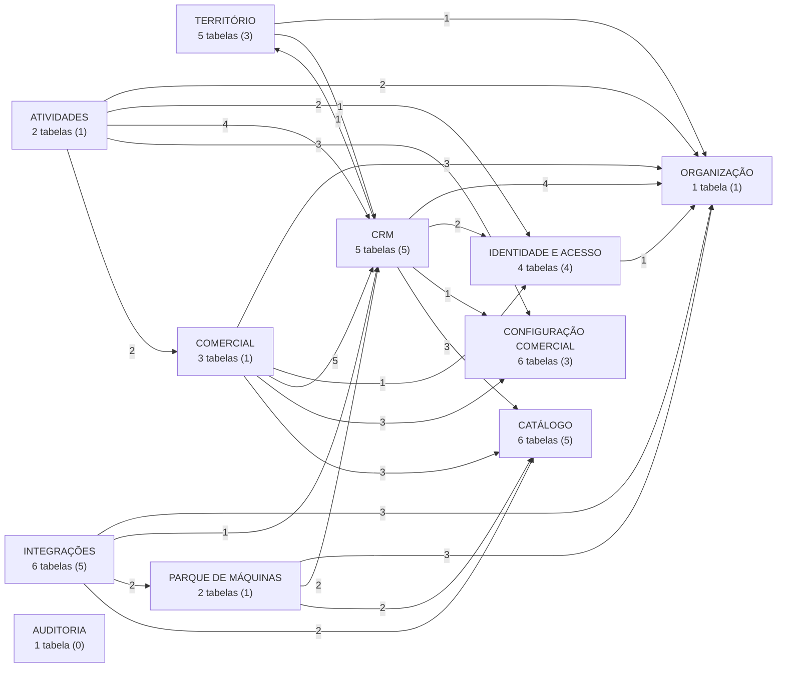

Conferência: 29 FKs internas + 57 entre domínios = **86**.

A integração aponta para o domínio; **nenhuma tabela de domínio aponta para a integração.** Hoje
`VendaDeMaquina` e o vínculo apontam para `Sistema`.

## 3. Identidade e acesso — 4 tabelas, 5 FKs

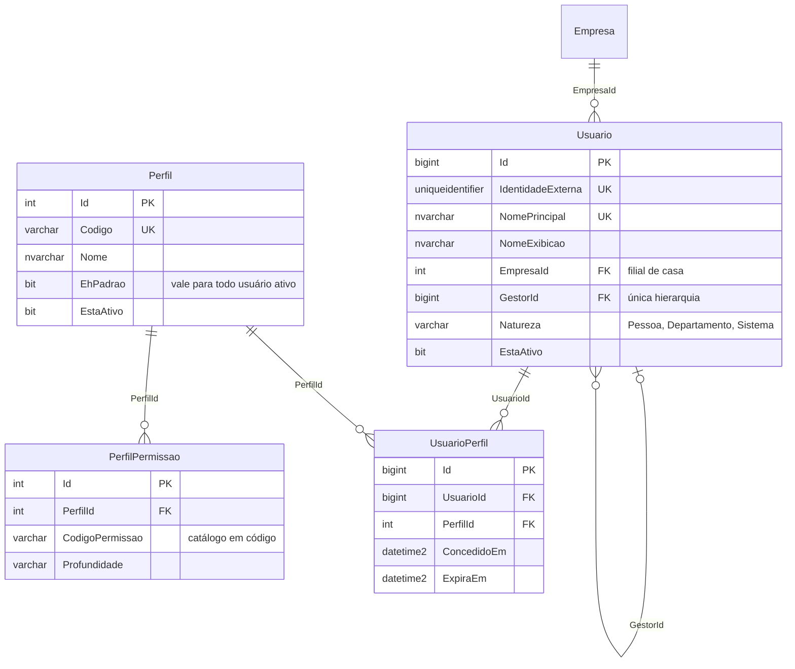

## 4. Organização e território — 6 tabelas, 6 FKs

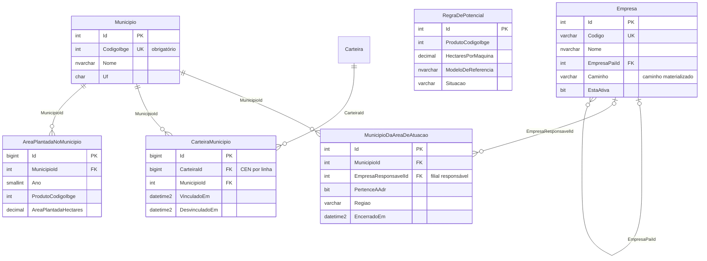

## 5. CRM — 5 tabelas, 16 FKs

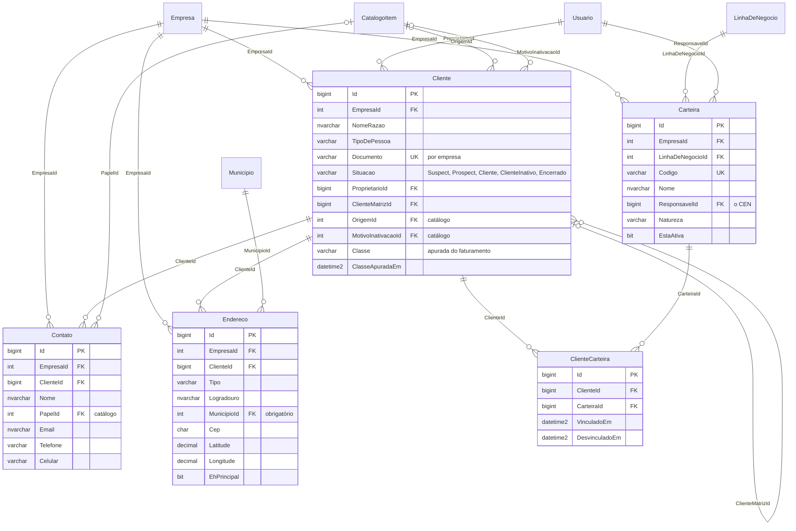

## 6. Configuração comercial — 6 tabelas, 3 FKs

Tudo aqui é administrado pela área de configuração do CRM, com semente mínima estrutural.

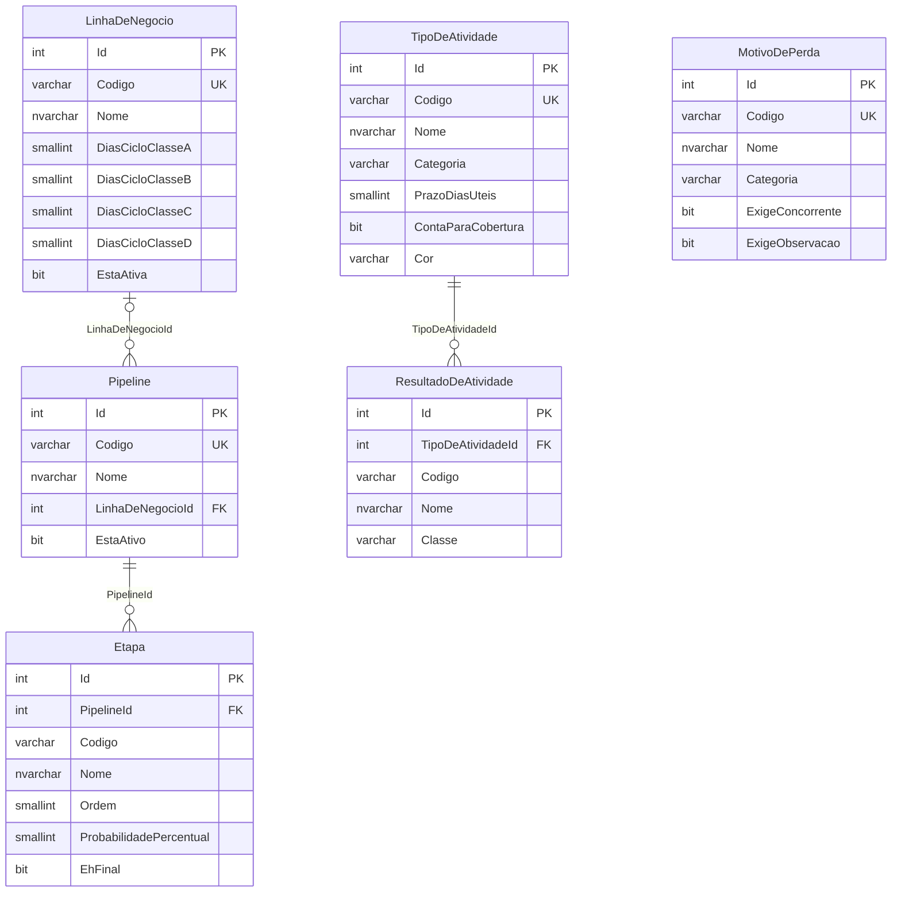

## 7. Atividades — 2 tabelas, 14 FKs, sem ciclo

A **Agenda não é tabela**: é a leitura de `Tarefa` por responsável e data.

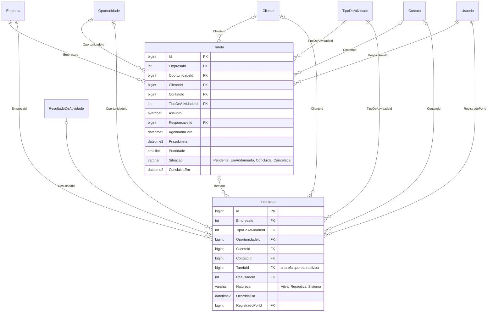

## 8. Comercial — 3 tabelas, 16 FKs

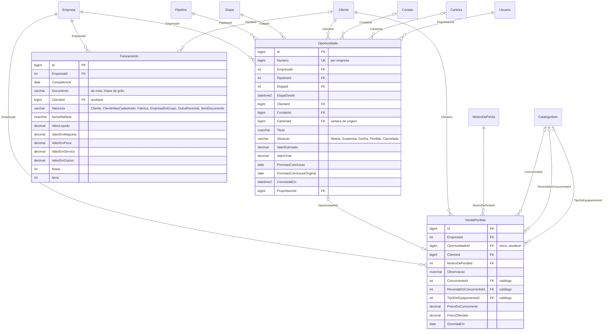

## 9. Parque de máquinas — 2 tabelas, 8 FKs

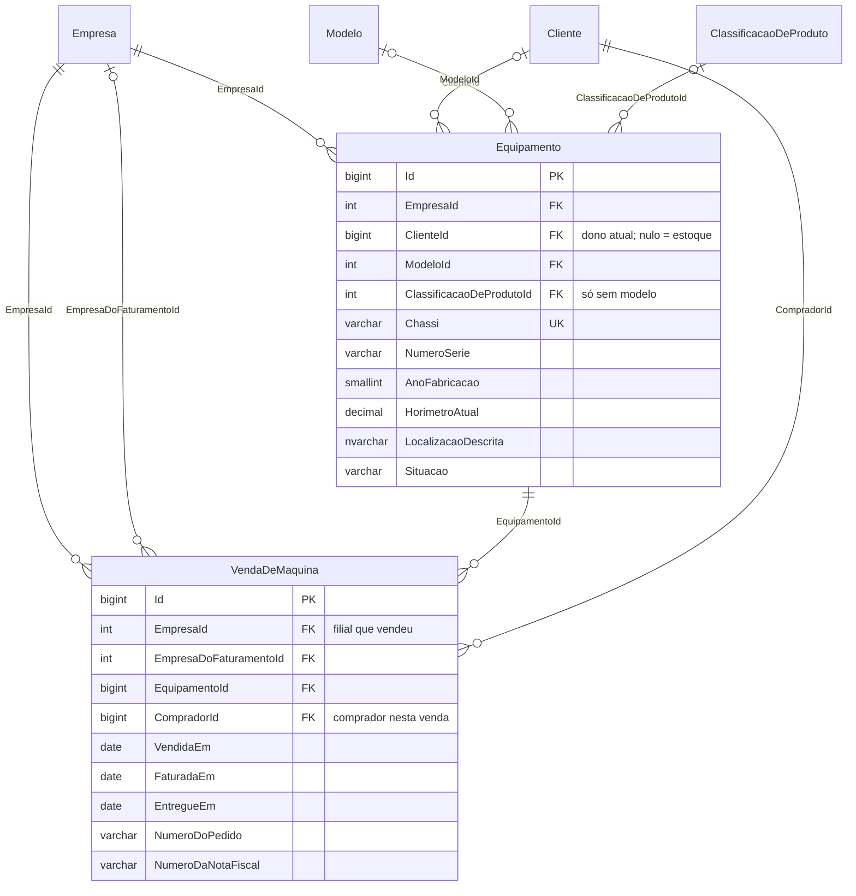

## 10. Catálogo — 6 tabelas, 5 FKs

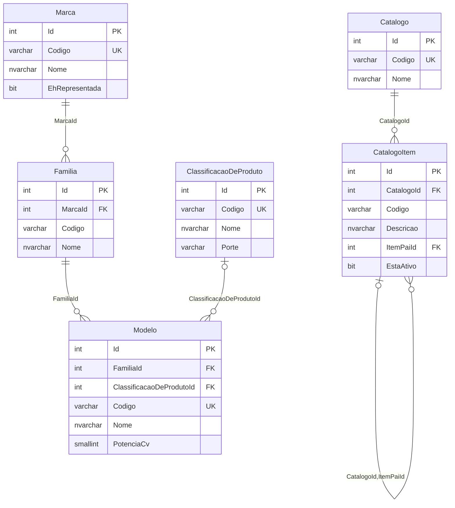

## 11. Integrações — 6 tabelas, 13 FKs

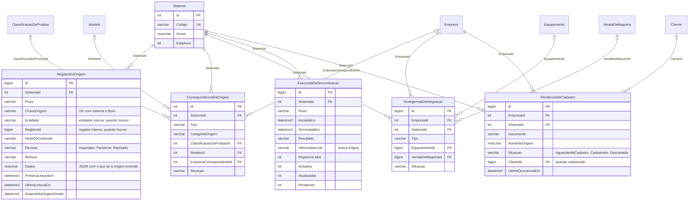

## 12. Auditoria — 1 tabela, 0 FKs

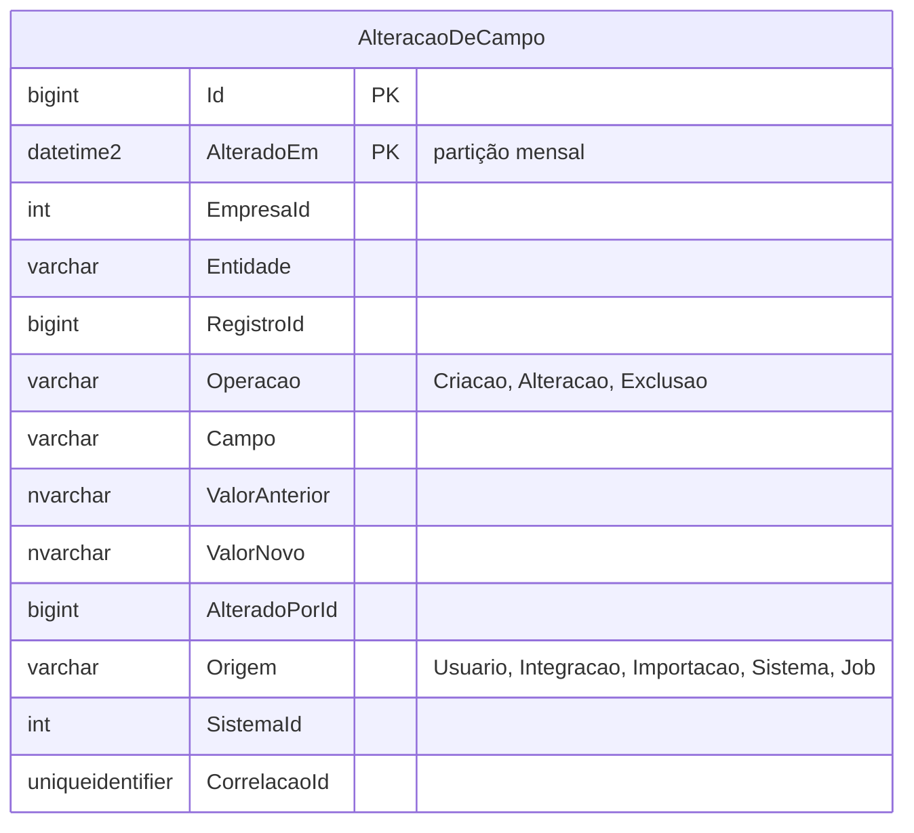

## 13. Contagem das FKs previstas

| Domínio | Tabelas | FKs de saída |
|---|---:|---:|
| Identidade e acesso | 4 | 5 |
| Organização | 1 | 1 |
| Território | 5 | 5 |
| CRM | 5 | 16 |
| Configuração comercial | 6 | 3 |
| Atividades | 2 | 14 |
| Comercial | 3 | 16 |
| Parque de máquinas | 2 | 8 |
| Catálogo | 6 | 5 |
| Integrações | 6 | 13 |
| Auditoria | 1 | 0 |
| **Total** | **41** | **86** |

Mais a tabela técnica `metadado.__EFMigrationsHistory` = **42 tabelas físicas**.
