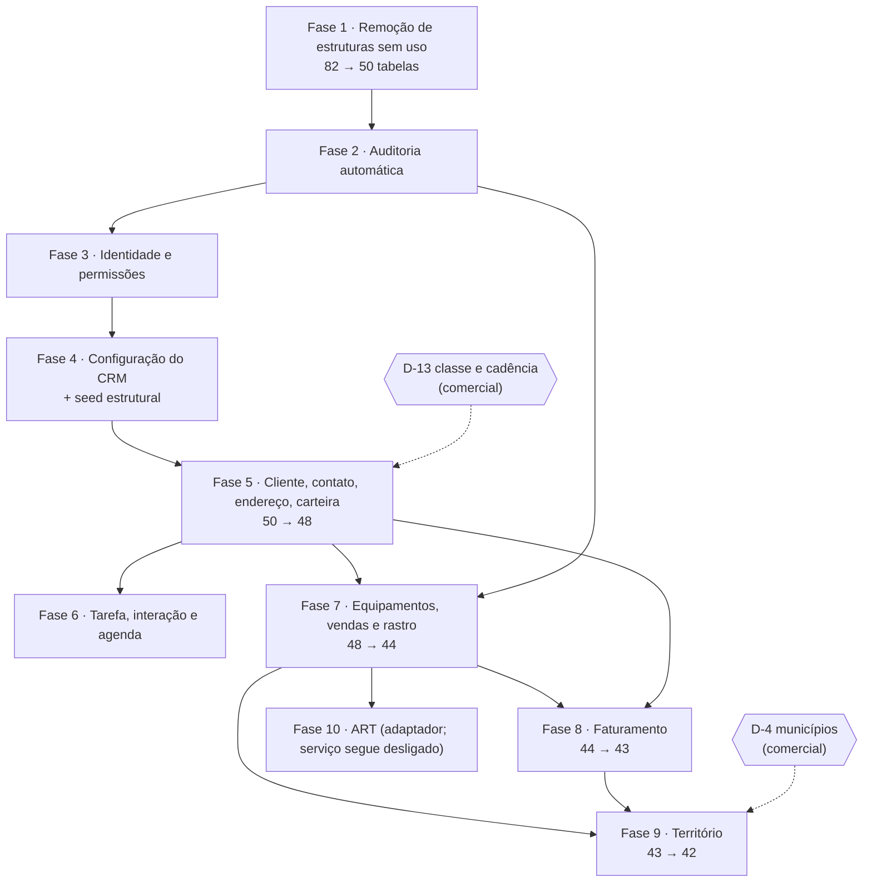

# 41 — Plano executivo da reestruturação

> **Versão 1.0 · 15/09/2026 · planejamento de execução.** Nenhuma migração foi escrita, nenhuma tabela
> foi alterada, nenhum código foi removido. O serviço do ART continua parado e desabilitado.
>
> **Base:** [39](39-AUDITORIA-ARQUITETURA-BANCO.md) (auditoria) · [40](40-ARQUITETURA-ALVO-DO-BANCO.md)
> (arquitetura alvo aprovada) · [40B](40B-MATRIZ-ATUAL-PARA-ALVO.md) (destino das 82 tabelas).
>
> **Anexos desta etapa:** [41A — Snapshot antes da reestruturação](41A-SNAPSHOT-ANTES-DA-REESTRUTURACAO.md) ·
> [41 — Padrão de nomenclatura](41-PADRAO-DE-NOMENCLATURA.md) ·
> [41B — Matriz de nomenclatura](41B-MATRIZ-DE-NOMENCLATURA.md) ·
> [42 — Classe e cadência](42-DECISAO-CLASSE-E-CADENCIA.md) ·
> [43 — Municípios pendentes de validação comercial](43-MUNICIPIOS-PENDENTES-DE-VALIDACAO-COMERCIAL.md).
>
> **A implementação da fase 1 será autorizada separadamente**, depois da revisão destes documentos.

## Sumário

1. [Decisões aprovadas](#1-decisões-aprovadas)
2. [Decisões pendentes](#2-decisões-pendentes)
3. [Como cada fase roda](#3-como-cada-fase-roda)
4. [As dez fases e as dependências](#4-as-dez-fases-e-as-dependências)
5. [Fichas das fases](#5-fichas-das-fases)
6. [Riscos consolidados](#6-riscos-consolidados)
7. [Impacto consolidado](#7-impacto-consolidado)
8. [O que vem depois](#8-o-que-vem-depois)

---

## 1. Decisões aprovadas

| # | Decisão | O que significa na execução |
|---:|---|---|
| **D-1** | **Modelo alvo aprovado como direção técnica** — 82 → 42 tabelas físicas (41 de domínio + 1 técnica), ~86 FKs, nenhum ciclo | é a direção, **não** autorização para executar tudo de uma vez: cada fase é implementada e validada em separado, com autorização própria |
| **D-4** | **Municípios divergentes não são resolvidos automaticamente** | os 82 municípios com CEN divergente (mais 46 com grafia parecida) ficam marcados `PENDENTE DE VALIDAÇÃO COMERCIAL`; relatório no [documento 43](43-MUNICIPIOS-PENDENTES-DE-VALIDACAO-COMERCIAL.md); nenhuma fonte é assumida como verdade; a fase 9 só fecha depois da devolução do comercial |
| **D-9** | **Corrigir a nomenclatura agora, com o banco vazio** — mas só depois do padrão e da matriz | [padrão](41-PADRAO-DE-NOMENCLATURA.md) e [matriz](41B-MATRIZ-DE-NOMENCLATURA.md) prontos para revisão; nenhum renome acontece antes da aprovação da matriz; cada renome acontece **dentro** da fase do assunto, nunca numa fase separada |
| **D-12** | **Código de carga do Vórtice: congelado** — não remover, não usar, não deixar voltar ao fluxo | marcado `LEGADO / SOMENTE REFERÊNCIA`; congelamento em duas etapas (seção 5, fases 1 e 8), porque hoje o faturamento do Protheus roda **dentro** da carga do Vórtice |
| — | **Sem big bang** | uma fase por vez, cada uma compila, testa, valida banco e frontend, produz relatório e permite rollback |
| — | **Agenda não vira entidade** | confirmado no código: a Agenda é leitura de `Tarefa` por responsável e data; nenhuma tabela nova |
| — | **Commits pequenos, separados por fase** | padrão na seção 3.5; nenhum commit sem autorização, como hoje |

### 1.1 O congelamento do Vórtice, em detalhe

A carga do Vórtice **não pode ser simplesmente desligada hoje**: o faturamento do Protheus — que o CRM
precisa — é orquestrado por dentro dela.

| Evidência | Consequência |
|---|---|
| `Carga/Program.cs:318` monta o `LeitorDeFaturamentoDoProtheus` e o entrega a `CargaDeProcessoDoVortice` (`:39`) | o modo `--somente-faturamento`, que o próprio código descreve como "a etapa que não precisa do Vórtice", ainda depende da classe do Vórtice para rodar |
| `CargaDeProcessoDoVortice.Faturamento.cs` é `partial` da mesma classe | separar o faturamento é pré-requisito para tirar o Vórtice do build |

**Plano:** congelamento **operacional** na fase 1 (marcação, nenhuma execução, nenhum caminho de tela ou
serviço que chame a carga do Vórtice) e congelamento **de compilação** na fase 8, quando o faturamento
do Protheus ganhar executor próprio. Enquanto isso, o código do Vórtice não acompanha os renomes: ele
sai do build junto com a extração.

---

## 2. Decisões pendentes

| # | Decisão | Quem decide | Bloqueia |
|---:|---|---|---|
| **D-13 / classe** | a classe do cliente é do **cliente** (cenário A), da **carteira/linha** (B) ou **calculada por contexto** (C)? E qual a janela de apuração? | comercial | **fase 5** — ver [documento 42](42-DECISAO-CLASSE-E-CADENCIA.md) |
| **cadência** | quem declara a cadência das 10 linhas de negócio que não têm (35 das 142 carteiras)? | comercial | fase 5 (a tela de cobertura fica sem resposta para essas carteiras) |
| **D-4 / território** | qual fonte vale, município a município; as 19 vagas "a contratar"; a vigência | comercial | **fase 9** (a parte de conciliação) |
| **D-3** | ✅ **decidida em 21/09/2026: em código** (`Permissoes`) | Ricardo | fase 3 |
| **D-5** | contato pertence a um cliente só, com canais em colunas | Ricardo / comercial | fase 5 |
| **D-6** | significado de "gestão na origem", "venda direta" e "repasse direto": viram conceito do CRM ou ficam só no rastro | comercial | fase 7 |
| **D-7** | `VendaPerdida` como único registro de perda, obrigatório ao encerrar como perdida | comercial | fase 6 |
| **D-8** | ✅ **decidida em 21/09/2026: inclui** a carteira vigente — sem efeito até existir filtro por dono e carteira com responsável (#107) | Ricardo | fase 3 |
| **D-9 (matriz)** | aprovar a [matriz de nomenclatura](41B-MATRIZ-DE-NOMENCLATURA.md) | Ricardo | fases 3 a 9 |
| **D-10** | retenção da auditoria, em meses | Ricardo / jurídico | fase 2 |
| **D-11** | semente só estrutural + "modelo inicial" comercial aplicado por ação do administrador | Ricardo | fase 4 |

**Regra:** fase com decisão pendente **não começa**. Onde a pendência é parcial, a fase é dividida — é o
caso da fase 9.

---

## 3. Como cada fase roda

### 3.1 O ritual

Toda fase segue os mesmos sete passos:

1. **Autorização** da fase (só ela).
2. **Alterar uma parte específica** — banco, código e tela do mesmo assunto, na mesma entrega.
3. **Compilar** backend e frontend.
4. **Testes**: os existentes aplicáveis, os corrigidos e os novos.
5. **Validar o banco**: contagem de tabelas, FKs, índices e restrições contra o esperado da fase.
6. **Validar o frontend**: as 12 telas abrem, sem erro de console e sem falha de API.
7. **Relatório da fase** e decisão de seguir ou voltar.

### 3.2 Critério de aceite padrão

Vale para todas as fases; cada ficha acrescenta os critérios próprios.

| Verificação | Como | Esperado |
|---|---|---|
| Backend | `dotnet build` | 0 erro, 0 aviso novo |
| Frontend | `npm run build` | 0 erro |
| Lint | `npm run lint` (oxlint) | sem aviso novo |
| Testes | `dotnet test` | verde; nenhuma regressão não justificada |
| Banco — estrutura | `scripts/banco/auditoria/gerar-inventario-do-banco.ps1` | contagem de tabelas e FKs igual à prevista na ficha |
| Banco — integridade | `DBCC CHECKCONSTRAINTS` no banco de ensaio | 0 violação |
| Migração | `dotnet ef database update` no contêiner de ensaio, do zero e a partir do estado anterior | aplica e reverte sem erro |
| API | roteiro de rotas (as 39) | mesma resposta de antes, salvo o que a fase mudou de propósito |
| Telas | `node scripts/prototipo/capturar-crm-vazio.mjs` | 12 telas sem erro; nenhuma resposta 4xx/5xx inesperada |
| Documentação | documentos 14, 39A, 39B e 40B | contagem e destino atualizados |

### 3.3 Rollback

| Camada | Como voltar |
|---|---|
| **Código** | cada fase é um ou poucos commits pequenos, isolados por assunto: `git revert` do commit da fase |
| **Banco (ensaio)** | `dotnet ef database update <migração anterior>` — toda migração da reestruturação **precisa ter `Down` completo e testado**, inclusive a recriação das tabelas removidas |
| **Banco (servidor)** | backup `COPY_ONLY` antes de aplicar (o `publicar.ps1` já faz); restauração do `.bak` como plano B |
| **Dado** | nas fases 1 a 4 não há dado a perder (tabelas vazias). Da fase 5 em diante, o que existir vem de tela ou de integração e é reprocessável |
| **Limite** | se o rollback de uma fase exigir dado que só existia antes dela, a fase é replanejada — **nenhuma fase é irreversível por desenho** |

> **A regra do `Down`:** a migração de remoção recria a tabela vazia com a mesma estrutura. Recuperar
> conteúdo não é papel do `Down` — para isso existe o backup e o banco de arquivo
> `TracbelCrmArquivo20260915`.

### 3.4 Estratégia de testes

Hoje: **355 métodos de teste, 535 casos executados**.

| Categoria | O que acontece a cada fase |
|---|---|
| **Testes de modelo** (`Arquitetura.Testes/Banco`) | são os que quebram primeiro de propósito: contagem de tabelas (`EsquemaENomenclaturaTestes.cs:114` e `MigracaoNoContainerTestes.cs:43` — as linhas mudaram com a fase 1; errata C-6 aplicada em 20/09/2026, #43), domínio de entidade, tipos de coluna, integridade referencial, catálogo de sistema. **Atualizar no mesmo commit da fase** |
| **Testes de domínio** | os de entidades removidas saem com elas (`LeadTestes`, `MotorWorkflowTestes`); os de entidades alteradas ganham casos novos (ex.: concluir tarefa gera interação) |
| **Testes de aplicação e API** | acompanham contratos e rotas renomeadas; cada rota nova nasce com teste de permissão |
| **Testes novos por fase** | estão na ficha de cada fase |
| **Regressão** | nenhuma fase avança com teste vermelho não justificado; "justificado" significa: o teste afirmava algo que a fase mudou de propósito, e a correção está no mesmo commit |

### 3.5 Padrão de commits

`tipo(escopo): resumo no imperativo, em português`

| Tipo | Uso |
|---|---|
| `refactor` | mudança de estrutura sem mudança de comportamento visível |
| `feat` | funcionalidade nova (tela administrativa, rota de escrita) |
| `fix` | correção |
| `test` | só testes |
| `docs` | só documentação |
| `chore` | build, script, configuração |

| Escopo | Assunto |
|---|---|
| `db` | migração e modelo |
| `auth` | identidade e permissões |
| `crm` | cliente, contato, endereço, carteira |
| `comercial` | oportunidade, atividade, perda |
| `frota` | equipamento e venda |
| `integracao` | rastro de origem, ART, Protheus |
| `territorio` | município, área de atuação, carteira por município |
| `web` | frontend |

**Exemplos:**

```text
refactor(db): remove estruturas sem uso e as colunas que apontavam para elas
feat(auth): administra perfis e substitui Usuario.Papel
refactor(crm): unifica classe e cadência do cliente
refactor(comercial): separa tarefa de interação e elimina o ciclo
refactor(integracao): rastro de origem único e venda de máquina enxuta
```

**Não misturar no mesmo commit:** remoção de tabela, refatoração de frontend, permissões e ART.
Migração e o código que depende dela andam juntos; o resto se separa.

**Commit continua exigindo autorização** — o padrão atual do projeto não muda.

---

## 4. As dez fases e as dependências



| Fase | Assunto | Depende de | Tabelas ao fim | Migrações | Decisão que bloqueia |
|:-:|---|---|---:|:-:|---|
| 1 | Remoção de estruturas sem uso | — | **50** | 1 (+1 script) | — |
| 2 | Auditoria automática | 1 | 50 | 1 | D-10 |
| 3 | Identidade e permissões | 2 | 50 | 1 | D-3, D-8, matriz |
| 4 | Configuração do CRM e seed | 3 | 50 | 1–2 | D-11, matriz |
| 5 | Cliente, contato, endereço, carteira | 4 | **48** | 1 | **D-13**, D-5 |
| 6 | Tarefa, interação e agenda | 4, 5 | 48 | 1–2 | D-7 |
| 7 | Equipamentos, vendas e rastro de origem | 2, 5 | **44** | 2 | D-6 |
| 8 | Faturamento | 5, 7 | **43** | 1 | — |
| 9 | Território | 7, 8 | **42** | 1–2 | **D-4** (só a parte 9b) |
| 10 | ART por adaptador | 7 (e 9 para território) | 42 | 0 | autorização de reativação |

**Fases 6 e 7 podem correr em paralelo** depois da fase 5. **A fase 10 não reativa o serviço.**

### 4.0 A sequência única, com as issues (20/09/2026)

> Registrada aqui pela **#44**, que reconciliou o backlog com estas dez fases. **Esta numeração é a
> que vale**: a do documento 40 (F0–F9) está superada, e a errata da §15 de lá faz a correspondência.
> Os números são os do **GitHub**; o mapa completo, issue por issue, está no **documento 46A §5.2**.

| Fase | Issues | Situação em 20/09/2026 |
|:-:|---|---|
| 1 | — (a publicação é a #51) | executada no banco local e no de ensaio; **o servidor não recebeu** |
| 2 | #40, #2, #51 | código pronto na branch; falta a decisão do critério de p95 (Q-P1) e a publicação |
| 3 | **#46**, #4 | **não começou.** A #3 já mediu o terreno: **0 das 39 rotas exige permissão** |
| 4 | #45, #25 | não começou; depende da 3 |
| 5 | #53, #47, #11, #36 | não começou; **travada pela D-13 (#47)**, que é decisão comercial |
| 6 | #52 | não começou |
| 7 | #16, #17, #15, #36 | não começou |
| 8 | #19, #20, #36 | não começou; o faturamento **não roda no servidor** (falta credencial, #18) |
| 9 | #54, #48 | não começou; a parte 9b depende da D-4 (#48) |
| 10 | #55, #49 | não começou; o serviço do ART **segue desligado**, e assim continua |

**O que anda fora desta fila**, porque não depende dela: a entrega contínua (✅ #56, ✅ #58, ✅ #59,
#61, #62), o potencial de mercado (#63–#80, com fases próprias no documento 48 §7), a interface
(✅ #30, ✅ #32, #27–#33, #43) e as correções pontuais (✅ #83, ✅ #84).

**Os dois travões de hoje não são técnicos de fase:** o **banco não responde da estação** (segura
qualquer migração e a #64) e a **publicação no servidor** (segura a #51, a recarga do território da
#83 e o faturamento da #18).

### 4.1 Por que esta ordem

| Escolha | Motivo |
|---|---|
| Limpeza primeiro | 32 tabelas sem dado e sem código: tirar antes reduz em 39% o que todas as fases seguintes precisam entender, e é a fase de menor risco de todas |
| Auditoria antes de qualquer escrita nova | as fases 4 em diante criam telas que gravam; o que for gravado antes da auditoria nasce sem trilha |
| Identidade antes da configuração | a área administrativa precisa de perfil e permissão para existir com controle |
| Configuração antes do cliente | carteira depende de linha de negócio; cobertura depende das duas |
| Integração genérica (fase 7) antes de faturamento e território | as duas usam `RegistroDeOrigem` e a fila de pendência de cadastro |
| ART por último | é a única integração que grava no domínio e a que mais sofre com os renomes; entra quando o alvo já estiver de pé |

---

## 5. Fichas das fases

### Fase 1 — Remoção de estruturas sem uso

| | |
|---|---|
| **Objetivo** | tirar do banco e do código tudo o que nunca teve dado e não tem caminho de execução, antes de refatorar o que fica |
| **Estado atual** | 82 tabelas; 35 de domínio nunca tiveram uma linha; 40 não são lidas por nenhuma rota; 9 colunas de tabelas vivas apontam para tabelas mortas; o histórico de migração órfão `dbo.__EFMigrationsHistory` continua no banco |
| **Estado alvo** | **50 tabelas**, nenhuma sem uso; nenhuma FK apontando para tabela morta; código morto correspondente removido; carga do Vórtice marcada `LEGADO / SOMENTE REFERÊNCIA` |

**Tabelas afetadas — 31 do modelo + 1 técnica**

| Grupo | Tabelas |
|---|---|
| Removidas (19) | `HierarquiaComercial`, `Praca`, `Equipe`, `EquipeMembro`, `Permissao`, `CompartilhamentoDeRegistro`, `Alerta`, `InteracaoParticipante`, `Regra`, `RegraExecucao`, `LeituraDeHorimetro`, `Recepcao`, `MensagemDeSaida`, `CampoPersonalizado`, `TratadorDeEvento`, `Fonte`, `FonteCampo`, `Relatorio`, `CampoAuditado` |
| Não criadas agora (11) | `Meta`, `ConsentimentoComunicacao`, `PassagemDeFase`, `ItemDeProposta`, `Formulario`, `Pergunta`, `Preenchimento`, `Resposta`, `EventoDeAcesso`, `Documento`, `Vinculo` |
| Consolidada (1) | `Lead` → `Cliente.Situacao` (`Suspect`/`Prospect`) |
| Técnica (1) | `dbo.__EFMigrationsHistory` — fora do modelo do EF, sai por script |

**Colunas FK removidas em tabelas que ficam — 9**

`Carteira.PracaId` · `Carteira.EquipeId` · `Cliente.ProprietarioEquipeId` ·
`Processo.ProprietarioEquipeId` · `Tarefa.ResponsavelEquipeId` · `Tarefa.CriadaPorRegraId` ·
`TipoTarefa.FormularioId` · `MensagemDescartada.MensagemDeSaidaId` · `Interacao.LeadId`

**Código afetado**

| Camada | O que sai ou muda |
|---|---|
| Domínio | ~30 classes (`Praca`, `HierarquiaComercial`, `Meta`, `Equipe`, `CompartilhamentoDeRegistro`, `Alerta`, `ConsentimentoComunicacao`, `Lead`, `EventosLead`, `CanalContato` *(fica para a fase 5)*, `Regra`, `MotorWorkflow`, `ContextoRegra`, `IRepositorioRegras`, `Documento`, `Formulario`, `Relatorio`, `Extensibilidade`, `CampoAuditado`, `EventoDeAcesso`…) e ~16 enums |
| `DbContext` | 32 `DbSet`; o filtro global próprio de `Lead` (`CrmDbContext.cs:504`) |
| Configurações | 7 arquivos de `Persistencia/Configuracoes` |
| Aplicação | leitura de `Metas` em `RepositorioDeIndicadoresExecutivos.cs:121`; o contrato do painel executivo passa a dizer "meta não configurada" |
| Carga | lista de limpeza do `--recomecar` (`Carga/Program.cs:398-403`); **marcação do Vórtice como legado** |
| Frontend | cartão de meta da Visão 360 |
| Testes | saem `LeadTestes` (13) e `MotorWorkflowTestes` (10); atualizam `EsquemaENomenclaturaTestes`, `MigracaoNoContainerTestes`, `DominioDeEntidadeTestes`, `CatalogoDeSistemaTestes`, `AuditoriaTestes` |

**Migração necessária** — `RemocaoDeEstruturasSemUso` (descrita, não escrita):

1. `DropForeignKey` + `DropColumn` das 9 colunas listadas;
2. `DropTable` das 31 tabelas, na ordem inversa das dependências;
3. regeneração do `CHECK` de domínio de entidade nas **duas** tabelas polimórficas que ficam
   (`integracao.ChaveExterna`, `auditoria.AlteracaoDeCampo`) — hoje são 10;
4. remoção dos esquemas de partição das três tabelas particionadas que saem (`Recepcao`,
   `RegraExecucao`, `EventoDeAcesso`);
5. `Down` recriando tudo, vazio;
6. **script separado** (fora do EF) para `dbo.__EFMigrationsHistory`, com conferência de que está vazia.

**Dados:** nenhuma perda. As 31 tabelas têm **0 linhas** hoje e nunca tiveram; conferido no snapshot
([41A](41A-SNAPSHOT-ANTES-DA-REESTRUTURACAO.md)) e registrado no documento 39. Nenhuma transformação,
nenhuma migração de dado.

**Risco: BAIXO.** Nada é lido, nada é gravado, nada tem linha. O maior risco é de compilação (código
morto espalhado), que o build pega.

**Rollback:** `git revert` do commit da fase e `dotnet ef database update` para a migração anterior — o
`Down` recria as 31 tabelas vazias e as 9 colunas. O `dbo.__EFMigrationsHistory` é recriado pelo script
inverso, se alguém quiser (não é necessário).

**Critério de aceite**

- [ ] banco com **50 tabelas** e **122 FKs** (de 82 e 213) — conferido pelo script de inventário no local e no servidor;
- [ ] saem 364 colunas, 148 índices e 78 `CHECK`;
- [ ] restam **2** tabelas com `CHECK` de domínio de entidade (eram 10) e **1** particionada (eram 4);
- [ ] build, lint, testes e as 12 telas sem erro;
- [ ] nenhuma referência às entidades removidas no código (busca textual limpa);
- [ ] carga do Vórtice marcada como legado e sem caminho de execução no fluxo operacional;
- [ ] documentos 14, 39A, 39B e 40B atualizados.

---

### Fase 2 — Auditoria automática

| | |
|---|---|
| **Objetivo** | toda gravação relevante passa a gerar trilha, com **origem**, antes de existirem telas novas que gravem |
| **Estado atual** | `auditoria.AlteracaoDeCampo` só recebe linha das quatro cargas, que a chamam à mão; a API não audita nada; não há interceptador; `CorrelacaoId` nunca é preenchido; a política de campos (`CampoAuditado`) saiu na fase 1 porque ninguém a lia |
| **Estado alvo** | um interceptador único grava a auditoria **na mesma transação** do dado, para tela, integração, importação, job e sistema; a política do que se audita vive em código, versionada com as entidades |

**Tabelas afetadas:** `auditoria.AlteracaoDeCampo` — ganha `Origem`, `SistemaId` e `Operacao`; continua
particionada por mês.

**Código afetado**

| Camada | Mudança |
|---|---|
| Infraestrutura | `InterceptadorDeAuditoria` (novo, `ISaveChangesInterceptor`); registro no `CrmDbContext` |
| Domínio | `ContextoAcesso` ganha `Origem` (`Usuario`, `Integracao`, `Importacao`, `Sistema`, `Job`) e `SistemaId`; `AlteracaoDeCampo.Registrar` ganha os novos campos |
| Aplicação | nenhuma mudança de caso de uso; o contexto é o que muda |
| Carga | as quatro cargas param de chamar `AlteracaoDeCampo.Registrar` e passam a declarar a origem no contexto |
| API | `CorrelacaoId` = identificador da requisição |
| Testes | novos: gravação por rota gera trilha com origem `Usuario`; carga gera `Integracao`; campo fora da política não gera linha; `AuditoriaTestes` atualizado |

**Migração necessária** — `AuditoriaComOrigemDaOperacao`: `AddColumn` de três colunas numa tabela
particionada vazia, com índice por `(Entidade, RegistroId, AlteradoEm)` já existente. `Down` remove as
colunas.

**Dados:** nenhuma perda (a tabela está vazia). Nenhuma transformação.

**Risco: MÉDIO** — o interceptador roda em **toda** gravação: erro aqui afeta tudo. Mitigação: política
restrita a campos declarados, medição de latência antes e depois, e a trilha nunca pode derrubar a
transação do negócio por falha própria (erro de auditoria é erro de gravação, e precisa ser tratado
como tal, de forma explícita).

**Rollback:** revert do commit + `Down`. Sem interceptador, o sistema volta ao comportamento atual.

**Critério de aceite**

- [ ] criar, alterar e inativar um cliente pela API gera linhas com `Origem = Usuario`, autor e `CorrelacaoId`;
- [ ] uma execução de carga gera linhas com `Origem = Integracao` e o `SistemaId` certo;
- [ ] campo fora da política não gera linha;
- [ ] p95 do `POST /api/v1/clientes` não piora mais que 10% em relação à medição anterior à fase;
- [ ] retenção definida (**D-10**) registrada na migração e no documento 14.

---

### Fase 3 — Identidade e permissões

| | |
|---|---|
| **Objetivo** | uma autoridade de permissão, uma hierarquia, e toda rota declarando o que exige |
| **Estado atual** | a lista fixa de `EscopoDeAcesso.cs:41` concede `Cliente.*`, `Equipamento.*` e `Catalogo.Ler` a todo mundo; as tabelas de conjunto estão vazias; `Usuario.Papel` é texto que não autoriza nada; `Profundidade.Equipe` nunca alcança subordinado (o contexto é montado com conjuntos vazios, `EscopoDeAcesso.cs:129-130`); a Agenda não declara permissão |
| **Estado alvo** | `Usuario` ↕ `UsuarioPerfil` ↕ `Perfil` ↕ `PerfilPermissao`, com catálogo de permissões em código; perfil padrão semeado no lugar da lista fixa; hierarquia só por `Usuario.GestorId`, com subordinados calculados na montagem do contexto; `Usuario.Papel` removido; todas as 39 rotas declarando permissão |

**Tabelas afetadas:** `ConjuntoDePermissao` → `Perfil`; `ConjuntoDePermissaoItem` → `PerfilPermissao`
(`ConjuntoPermissaoId` → `PerfilId`); `UsuarioConjuntoDePermissao` → `UsuarioPerfil`; `Usuario`
(−`Papel`). Contagem não muda: **50**.

**Código afetado:** `EscopoDeAcesso` (sai a lista fixa, entra o perfil padrão e o cálculo de
subordinados), `ContextoAcesso`, classe de constantes `Permissoes` (nova), casos de uso de administração
de perfis, concessões e usuários (novos), rotas `/api/v1/admin/*` (novas), declaração de permissão em
todas as rotas existentes, as 17 portas renomeadas para `IRepositorioDe*`, telas Configurações ›
Usuários e Permissões (saem do JSON do protótipo), testes de autorização
(`AutenticacaoTestes`, `AutorizadorTestes`, `FiltroSegurancaTestes`, `FronteiraDeEmpresa*`,
`ConcessaoExplicitaNaPonteProvisoriaTestes`).

**Migração necessária** — `PerfilDeAcessoESubstituicaoDoPapel`: `RenameTable` ×3, `RenameColumn` ×1,
`AddColumn` `Perfil.EhPadrao`, `DropColumn` `Usuario.Papel`, índices renomeados. `Down` desfaz.

**Dados:** as três tabelas estão vazias. `Usuario` tem 1 linha no local e 2 no servidor; perde-se o
texto de `Papel` (sem uso). A **semente cria os perfis**; **a concessão de perfil a pessoa real em
produção não entra na migração** — é operação registrada, com autorização explícita.

**Risco: ALTO** — é a fase que pode trancar o acesso de alguém. Mitigações: ensaio com as contas reais
no contêiner antes do servidor; o perfil padrão preserva o que a lista fixa dava hoje; rota de saúde que
mostra o escopo efetivo do usuário autenticado.

**Rollback:** revert + `Down` (volta `Papel` e os nomes antigos). Como o perfil padrão reproduz a lista
fixa, o comportamento de acesso é equivalente nos dois lados.

**Critério de aceite**

- [ ] cada uma das 39 rotas recusa quem não tem a permissão — inclusive a Agenda (`Tarefa.Ler`);
- [ ] as contas que entram hoje continuam entrando, com o mesmo alcance (verificado em ensaio);
- [ ] conceder e revogar perfil aparece na auditoria da fase 2;
- [ ] subordinados calculados por `GestorId` (profundidade `Equipe` deixa de ser letra morta);
- [ ] nenhuma concessão a usuário real feita sem autorização registrada;
- [ ] 50 tabelas.

**Executada em 21/09/2026 (issue 46)**, com as decisões Q-P2, P-20, D-3, D-8 e D-9 respondidas no mesmo dia
(registro na issue 46 e no documento 05, §4). O que ficou diferente da ficha:

- **60 tabelas**, e não 50: as fontes públicas das issues 64 a 68 entraram antes. A fase 3 não muda a
  contagem;
- **`UsuarioPerfil.EmpresaId`** (novo, opcional): a filial em que a concessão vale — é como a P-20 foi
  resolvida sem tabela nova. Por isso `UsuarioPerfil` entrou nas exceções da fronteira de filial;
- **a migração faz drop + create** das três tabelas, e não `RenameTable`: medido no servidor em
  21/09/2026, as três tinham zero linhas e os 2 usuários, `Papel` nulo. É destrutiva para o manifesto do
  CD, que pede autorização — sem perder nada;
- **Justificativa obrigatória** na concessão.

**O que NÃO entrou nesta entrega, e continua pendente:** as rotas e os casos de uso de **administração**
de perfis, concessões e usuários (`/api/v1/admin/*`) e as telas Configurações › Usuários e Permissões;
e a renomeação das 17 portas para `IRepositorioDe*` (matriz 41B). Até a administração existir, conceder
perfil é operação registrada feita por quem tem acesso ao banco, com a justificativa gravada.

---

### Fase 4 — Configuração do CRM

| | |
|---|---|
| **Objetivo** | o CRM passa a criar e manter a própria configuração comercial; acaba a dependência da carga |
| **Estado atual** | pipeline, etapa, tipo de atividade, resultado, motivo de perda, linha de negócio e carteira só foram preenchidos pela carga do Vórtice; depois da sanitização estão **vazios**, e **nenhuma rota grava** — é o bloqueio P0 da auditoria |
| **Estado alvo** | área administrativa com CRUD dos sete assuntos, semente **estrutural mínima** e, opcionalmente, um "modelo inicial" comercial aplicado por ação explícita do administrador (D-11) |

**Tabelas afetadas:** `TipoProcesso` → `Pipeline`; `Fase` → `Etapa`; `TipoTarefa` → `TipoDeAtividade`;
`Resultado` → `ResultadoDeAtividade`; `MotivoDePerda`; `LinhaDeNegocio` (→ schema `processo`);
`Carteira` (→ schema `comercial`, −`PracaId`/`EquipeId` já removidas na fase 1, −`SupervisorId`);
`ClienteCarteira` e `CarteiraMunicipio` ganham escrita. Contagem: **50**.

**Código afetado:** entidades, configurações e `DbSet` renomeados; casos de uso de administração
(novos, sete assuntos); rotas `/api/v1/admin/*`; contratos de funil, pipeline e agenda (nomes);
`RepositorioDeProcessos`, `RepositorioDeTarefas`, `RepositorioDeCarteiras`; telas administrativas novas
em Configurações (substituem as seções que leem JSON do protótipo); Pipeline, Funil e Agenda (rótulos);
semente em `scripts/banco/seed`; testes de rota e de semente.

**Migração necessária** — `ConfiguracaoComercialAdministravel`: `RenameTable` ×4, `EnsureSchema` e
`RenameTable` entre schemas ×2, `DropColumn` (`Versao`, `ExigeCamposObrigatorios`, `Marco`,
`EhAprovacao`, `ExigeGeorreferencia`, `TipoProcessoId` de `TipoDeAtividade`, `FaseDestinoId`,
`ExigeJustificativa`, `UltimoUsoEm`, `SupervisorId`), `RenameColumn` das FKs correspondentes.

**Dados:** tabelas vazias — nenhuma perda. A semente insere o mínimo estrutural (catálogos de sistema,
perfis, sistemas, municípios, filiais, conta técnica). **Configuração comercial não entra na semente**;
é criada pela tela.

**Risco: MÉDIO** — muitos renomes ao mesmo tempo, com reflexo em cinco telas. Mitigação: a fase muda
banco, contratos e telas no mesmo commit; o roteiro das 12 telas roda ao fim.

**Rollback:** revert + `Down` (renomes inversos e colunas de volta).

**Critério de aceite**

- [ ] uma instalação vazia consegue, só pela tela: criar linha de negócio, pipeline com etapas, tipos de atividade com resultados, motivos de perda e uma carteira com clientes e municípios;
- [ ] Pipeline, Funil e Agenda leem os nomes novos e continuam iguais para o usuário;
- [ ] a semente roda do zero num banco limpo e é idempotente;
- [ ] 50 tabelas; nenhuma rota de configuração sem permissão declarada.

---

### Fase 5 — Cliente, contato, endereço e carteira

| | |
|---|---|
| **Objetivo** | resolver as múltiplas fontes da verdade do cliente: classe, cadência, última interação, município e canais de contato |
| **Estado atual** | duas classes que concordam em **14,2%** dos vínculos; duas cadências, sendo que a do vínculo está preenchida em **1** de 49.109 registros; `ClienteContato` com 23.313 vínculos para 23.313 contatos; `CanalContato` nunca preenchida (contato sem telefone e sem e-mail); `Endereco` com município em texto, UF derivada e duas colunas de fazenda 100% vazias; `ClienteCarteira` com cache de última interação e potencial anual sem uso |
| **Estado alvo** | uma classe, uma cadência, contato com canais em colunas, endereço com município do catálogo obrigatório — conforme o cenário aprovado em **D-13** ([documento 42](42-DECISAO-CLASSE-E-CADENCIA.md)) |

**Tabelas afetadas:** `Cliente` (−`FaturamentoApurado`); `Contato` (+`ClienteId`, `PapelId`, `Email`,
`Telefone`, `Celular`; −`ProprietarioId`, `Documento`, `DataNascimento`, `Sobrenome`); `ClienteContato`
e `CanalContato` **saem**; `Endereco` (`MunicipioId` obrigatório; −`Municipio`, `Uf`, `Hectares`,
`CulturaId`); `ClienteCarteira` (−`Classe`, `DiasCicloContato`, `PotencialAnual`, `UltimaInteracaoEm`);
`Municipio` (`CodigoIbge` obrigatório). **50 → 48.**

**Código afetado:** `CadastroDeCliente` (passa a tratar contatos e endereços), `ContratosDeCliente`,
`RepositorioDeClientes`, `RepositorioDeCarteiras` (classe, cadência e última interação por consulta),
`RepositorioDoPainelDoCen`, `RepositorioDeIndicadoresExecutivos`, `RepositorioDeIndicadoresTerritoriais`,
`ContratosDeRelacionamento` (linha de cobertura), telas `ClienteCadastro` e `CoberturaCarteira`,
`tipos/relacionamento.ts`, testes de cadastro, de cobertura e de indicadores.

**Migração necessária** — `ClienteContatoEnderecoComFonteUnica`: `AddColumn` em `Contato`, `DropTable`
×2, `DropColumn` ×9, `AlterColumn` para `NOT NULL` ×2, remoção do `CHECK` `CK_Endereco_Municipio`,
índice novo em `Interacao (ClienteId, OcorridaEm DESC)` para substituir o cache.

**Dados:** o banco operacional está vazio — **nenhuma transformação de dado**. Se a fase 4 já tiver
gerado configuração e algum cliente de teste, o efeito é só de leitura. **A base histórica não é
migrada**: continua no banco de arquivo.

**Risco: MÉDIO-ALTO** — não pelo dado, e sim pela **mudança visível de número**: na base anterior à
sanitização, 85,8% dos vínculos trocariam de letra ao passar a usar a classe do cliente. Mitigação:
comparação "antes e depois" no ensaio com a base de arquivo e comunicação ao comercial antes de a tela
mudar.

**Rollback:** revert + `Down` (recria as duas tabelas vazias e as colunas). Como não há transformação
de dado, o rollback é limpo.

**Critério de aceite**

- [ ] Cobertura, Performance e Indicadores mostram **a mesma classe** para o mesmo cliente;
- [ ] a cadência vem de um lugar só, e a tela diz quando a linha não tem cadência declarada;
- [ ] cadastrar cliente pela tela cria contato com e-mail e telefone, e endereço com município do catálogo;
- [ ] nenhuma consulta usa cache de última interação;
- [ ] 48 tabelas;
- [ ] comparação antes/depois registrada no relatório da fase.

---

### Fase 6 — Tarefa, interação e agenda

| | |
|---|---|
| **Objetivo** | separar plano de fato, eliminar o ciclo e dar escrita à oportunidade e à atividade |
| **Estado atual** | `Tarefa` ↔ `Interacao` é o único ciclo do banco, com a **mesma relação gravada nos dois sentidos** (`Tarefa.InteracaoConclusaoId` e `Interacao.TarefaId`); a tarefa guarda resultado e quem concluiu, que a interação também guarda; nenhuma rota grava tarefa, interação ou processo — só a carga gravou; a perda mora em dois lugares |
| **Estado alvo** | **Tarefa = futuro, Interação = passado, Agenda = consulta.** Um vínculo só: `Interacao.TarefaId`. Concluir tarefa é registrar a interação que a realizou, na mesma transação. `Processo` vira `Oportunidade`. A perda passa a existir só em `VendaPerdida` |

**Tabelas afetadas:** `Tarefa` (−`InteracaoConclusaoId`, `InteracaoOrigemId`, `ResultadoId`,
`ConcluidaPorId`, `OrigemAtribuicao`); `Interacao` (`TipoTarefaId` → `TipoDeAtividadeId`);
`Processo` → `Oportunidade` (schema `comercial`; −`MotivoDePerdaId`, `ObservacaoDaPerda`,
`ConcorrenteId`, `CatalogoDoConcorrenteId`); `VendaPerdida` (schema `comercial`; `OportunidadeId`
único, `ClienteId` obrigatório, −`RegistradaPor`). Contagem: **48**.

**Código afetado:** casos de uso novos — `AgendarTarefa`, `ReprogramarTarefa`, `ConcluirTarefa`
(grava a interação junto), `CancelarTarefa`, `RegistrarInteracao`, `AbrirOportunidade`, `MoverEtapa`,
`EncerrarOportunidade` (ganha/perde, com `VendaPerdida` no mesmo passo); rotas de escrita novas;
`/api/v1/processos` → `/api/v1/oportunidades`; `ContratosDeRelacionamento`; repositórios de processo,
tarefa e interação; telas Pipeline, Funil, Agenda, Ficha de Oportunidade, Visão 360 e Performance;
`relacionamento.ts` e `consolidado.ts`; testes novos de conclusão, cancelamento e encerramento.

**Migração necessária** — `OportunidadeAtividadeSemCiclo`: `RenameTable` ×2 (com schema),
`RenameColumn` ×2, `DropColumn` ×9, `AddColumn` `VendaPerdida.OportunidadeId` com índice único
filtrado, `DropForeignKey` das duas pontas do ciclo.

**Dados:** o banco está vazio; se as fases anteriores já tiverem gerado tarefas de teste, a conclusão
passa a exigir interação — o que é o comportamento novo, não migração.

**Risco: MÉDIO** — muda o modelo mental de quem usa (concluir tarefa passa a registrar o que
aconteceu) e mexe em seis telas.

**Rollback:** revert + `Down` (recria as colunas e as FKs do ciclo).

**Critério de aceite**

- [ ] o catálogo do banco **não tem nenhum ciclo** (teste de arquitetura verifica componentes fortemente conexos);
- [ ] concluir uma tarefa pela tela grava a interação com `TarefaId` e resultado, na mesma transação;
- [ ] encerrar uma oportunidade como perdida exige o registro da perda (**D-7**);
- [ ] a Agenda continua sem tabela;
- [ ] Pipeline, Funil e Ficha de Oportunidade funcionam com os nomes novos;
- [ ] 48 tabelas.

---

### Fase 7 — Equipamentos, vendas e rastro de origem

| | |
|---|---|
| **Objetivo** | consolidar venda e vínculo, tirar o vocabulário da origem do domínio e deixar **um** mecanismo de rastro |
| **Estado atual** | `VinculoDeClienteComEquipamento` tinha 2.108 linhas para 2.108 vendas, com natureza de valor único; `VendaDeMaquina` carrega 12 colunas que só o ART entende; o rastro está espalhado em `ChaveExterna`, `MensagemDescartada`, `PontoDeSincronismo` e `RegistroDeOrigem` |
| **Estado alvo** | venda é o fato (17 colunas), posse é `Equipamento.ClienteId`, e **todo** rastro externo vive em `RegistroDeOrigem`; a marca d'água vira a última execução com sucesso |

**Tabelas afetadas:** saem `VinculoDeClienteComEquipamento`, `ChaveExterna`, `PontoDeSincronismo` e
`MensagemDescartada`; `VendaDeMaquina` perde 17 colunas; `Equipamento` perde `Origem`, `VendidoEm`,
`GarantiaAte`, `EquipamentoPaiId`, `EquipamentoSubstitutoId`, `EnderecoId`; `LinhaDeProduto` →
`ClassificacaoDeProduto` (−`FamiliaId`); `Modelo` ganha `ClassificacaoDeProdutoId`;
`RegistroDeOrigem` ganha `Entidade`, `RegistroId` e `Dados`; `ExecucaoDeSincronizacao` ganha
`UltimoValorLido` e `Resultado` → `Desfecho`; `CompradorPendente` → `PendenciaDeCadastro` (−15
colunas de fotografia do Protheus). **48 → 44.**

**Código afetado:** `CargaDoArt` e `ExecutorDaSincronizacaoDoArt` passam a chamar casos de uso
(`DeclararEquipamento`, `RegistrarVendaDeMaquina`); `CargaDeTerritorio` (marca d'água e rejeição);
`RepositorioDeHistoricoComercial`, `RepositorioDeEquipamentos`, `RepositorioDeCatalogos`,
`RepositorioDeSincronizacoes`; `ContratosDeEquipamento`; frontend `tipos/api.ts` (`naturezaDoVinculo`,
`natureza`, `vinculoReferenciaEm`, `vinculoEncerradoEm`, `motivoDoEncerramento`), cadastro de
equipamento, máquinas compradas e Configurações › Integrações; testes do ART e de equipamento.

**Migração necessária** — duas: `RastroDeOrigemUnico` (generaliza `RegistroDeOrigem`, move a marca
d'água, remove `ChaveExterna`, `PontoDeSincronismo` e `MensagemDescartada`) e `VendaDeMaquinaEnxuta`
(remove o vínculo e as colunas de origem, renomeia a classificação).

**Dados:** nenhuma perda — todas as tabelas envolvidas estão vazias. **A linhagem histórica não é
migrada**: está no banco de arquivo.

**Risco: ALTO** — é o coração da integração e o que mais mexe em contrato de API. Mitigação: o serviço
do ART está desligado; o ensaio roda contra uma cópia; a fase 10 valida ponta a ponta antes de qualquer
reativação.

**Rollback:** revert + `Down` das duas migrações. Como não há dado, o rollback é limpo.

**Critério de aceite**

- [ ] 44 tabelas; nenhuma coluna `...NaOrigem`, `SistemaId` ou `ChaveOrigem` em tabela de domínio;
- [ ] "máquinas compradas" e "vendas da máquina" mostram o mesmo que hoje, sem os campos de vínculo;
- [ ] "é dono atual" continua calculado;
- [ ] a marca d'água de cada fluxo vem da última execução com sucesso;
- [ ] o serviço do ART **continua desabilitado**.

---

### Fase 8 — Faturamento

| | |
|---|---|
| **Objetivo** | uma tabela de faturamento e o fim da dependência do código do Vórtice |
| **Estado atual** | duas tabelas gêmeas (17 de 18 colunas iguais); a leitura do Protheus e a apuração da classe são orquestradas **dentro** de `CargaDeProcessoDoVortice` |
| **Estado alvo** | `Faturamento` único, com `ClienteId` anulável, `CpfCnpj`, `NaturezaDaContraparte` e `NomeNaNota`; carga própria do Protheus; job de apuração de classe separado; **código do Vórtice fora do build** |

**Tabelas afetadas:** `FaturamentoDoCliente` → `Faturamento` (+3 colunas); `FaturamentoSemCliente`
**sai**. **44 → 43.**

**Código afetado:** nova `CargaDeFaturamentoDoProtheus` (extraída da parcial
`CargaDeProcessoDoVortice.Faturamento.cs`); novo job de apuração de classe; `RepositorioDeFaturamento`,
`RepositorioDeIndicadoresExecutivos`, `RepositorioDeIndicadoresTerritoriais`, `RepositorioDoPainelDoCen`;
contratos e telas de faturamento; `Carga/Program.cs` (o modo passa a não instanciar nada do Vórtice);
**exclusão dos arquivos do Vórtice do build** (`<Compile Remove>` + pasta `Legado/` com aviso).

**Migração necessária** — `FaturamentoUnico`: `RenameTable`, `AddColumn` ×3, índice único
`(EmpresaId, Competencia, CpfCnpj)`, `CHECK` de exclusividade (`ClienteId` preenchido ⇔ natureza
`Cliente`), `DropTable` da gêmea.

**Dados:** nenhuma perda — as duas tabelas estão vazias. Quando a carga do Protheus rodar de novo, ela
repovoa as duas naturezas na mesma tabela.

**Risco: MÉDIO** — o risco real é o congelamento: tirar o Vórtice do build sem antes extrair o
faturamento **quebraria** a única integração de dado financeiro. Por isso a extração vem primeiro,
nesta mesma fase, e o teste de fumaça do modo de faturamento é critério de aceite.

**Rollback:** revert + `Down`; o código do Vórtice volta ao build com o revert.

**Critério de aceite**

- [ ] 43 tabelas; uma só tabela de faturamento;
- [ ] `--somente-faturamento` roda sem instanciar nenhuma classe do Vórtice;
- [ ] build sem os arquivos do Vórtice, que continuam no repositório marcados `LEGADO / SOMENTE REFERÊNCIA`;
- [ ] indicadores executivos e territoriais fecham com a soma da tabela única;
- [ ] a apuração de classe roda como job, com origem `Sistema` na auditoria.

---

### Fase 9 — Território

Dividida em duas, porque só a segunda depende do comercial.

#### 9a — Limpeza de linhagem (não bloqueada)

| | |
|---|---|
| **Objetivo** | tirar a linhagem de planilha das tabelas de negócio |
| **Tabelas** | `MunicipioDaAreaDeAtuacao` (−`ArquivoDeOrigem`, `LinhaNaOrigem`, `ImportadoEm`, `ImportadoPorId`); `AreaPlantadaNoMunicipio` (−`ImportadoPorId`); `CarteiraMunicipio` ganha escrita pela tela |
| **Código** | `CargaDeTerritorio` passa a registrar o rastro em `RegistroDeOrigem`; `RepositorioDeIndicadoresTerritoriais` |
| **Dados** | nenhuma perda (tabelas vazias) |
| **Risco** | BAIXO |

#### 9b — Conciliação do CEN por município (bloqueada por D-4)

| | |
|---|---|
| **Objetivo** | ter **uma** resposta para "quem atende este município" |
| **Estado atual** | duas planilhas, 203 municípios com CEN declarado, **82 com nomes diferentes** e 46 com grafia parecida — [documento 43](43-MUNICIPIOS-PENDENTES-DE-VALIDACAO-COMERCIAL.md) |
| **Estado alvo** | `CarteiraMunicipio` → `Carteira.ResponsavelId` é a fonte; `ResponsavelPeloMunicipio` sai. **43 → 42** |
| **Entrada necessária** | o CSV do documento 43 devolvido pelo comercial, com `CenConfirmado` e observação |
| **Código** | importador da conciliação (uma vez), `RepositorioDeIndicadoresTerritoriais`, tela Indicadores Geográficos (deixa de mostrar duas fontes) |
| **Dados** | as afirmações estão vazias no banco operacional; o histórico fica no arquivo. A conciliação é **entrada nova**, não migração |
| **Risco** | MÉDIO — se a conciliação estiver errada, o trabalho é atribuído à pessoa errada; por isso nada é assumido automaticamente |
| **Aceite** | 42 tabelas; cada município da ADR com um responsável confirmado ou marcado explicitamente como pendente; o documento 43 fechado |

---

### Fase 10 — ART por adaptador

| | |
|---|---|
| **Objetivo** | deixar a integração do ART pronta na arquitetura nova — **sem reativar o serviço** |
| **Estado atual** | serviço `TracbelCrmSincronizacaoArt` parado e desabilitado; `CargaDoArt` grava entidades direto no contexto |
| **Estado alvo** | `ART → DTO → adaptador → normalização → casos de uso do CRM`, com rastro em `RegistroDeOrigem`, pendências em `PendenciaDeCadastro` e conflitos em `DivergenciaDeIntegracao` |

**Tabelas afetadas:** nenhuma — a estrutura já está pronta desde a fase 7. Contagem: **42**.

**Código afetado:** `Tracbel.Crm.Integracao/Art` (leitor, saneamento, tradução), `Tracbel.Crm.Carga`
(executor e serviço), testes de ponta a ponta com cópia do ART.

**Dados:** o ART é lido em sessão `READ ONLY`; nada é escrito na origem. No CRM, a importação cria
dado novo — em **ensaio**, não em produção.

**Risco: MÉDIO** — contido, porque o serviço continua desligado e o ensaio roda contra cópia.

**Rollback:** revert do commit; o serviço nunca foi ligado.

**Critério de aceite**

- [ ] o ensaio importa as vendas de uma cópia do ART sem nenhuma coluna de origem no domínio;
- [ ] comprador ≠ dono continua valendo; nenhum cliente é criado automaticamente;
- [ ] divergências vão para revisão, sem sobrescrita;
- [ ] o serviço do Windows **continua `Disabled`**; a reativação é autorização à parte.

---

## 6. Riscos consolidados

| # | Risco | Fase | Probabilidade | Impacto | Mitigação |
|---:|---|:-:|:-:|:-:|---|
| R1 | Alguém perder acesso na troca para perfis | 3 | média | alto | ensaio com contas reais; perfil padrão reproduz o acesso de hoje; rota que mostra o escopo efetivo |
| R2 | Números das telas mudarem ao unificar classe e cadência | 5 | **alta** | médio | é a correção pretendida; comparação antes/depois no ensaio (85,8% dos vínculos trocam de letra na base histórica) e aviso ao comercial |
| R3 | Consumidor externo (BI, planilha) ler tabela removida | 1 | baixa | médio | conferir logins e consultas no servidor **antes** da fase 1 |
| R4 | Renome quebrar rota ou tela | 4, 6, 7 | média | médio | banco, contrato e tela no mesmo commit; roteiro das 12 telas ao fim de cada fase |
| R5 | ART reativado antes da hora | 7, 10 | baixa | alto | serviço desabilitado; `publicar.ps1` respeita; reativação é autorização separada |
| R6 | **Congelar o Vórtice quebrar o faturamento** | 1, 8 | média | **alto** | congelamento em duas etapas; a extração do Protheus vem antes da exclusão do build; teste de fumaça do modo de faturamento |
| R7 | Migração falhar no servidor | todas | baixa | alto | backup `COPY_ONLY` antes; ensaio no contêiner; tabelas vazias |
| R8 | Auditoria pesar na gravação | 2 | média | médio | política de campos restrita, partição, medição de p95 |
| R9 | Contato em um cliente só não servir | 5 | baixa | baixo | reversível com uma migração |
| R10 | Decisão do comercial atrasar (D-13, D-4, D-6, D-7) | 5, 6, 7, 9 | média | médio | fase 9 dividida; as demais seguem com o cenário que o código já implementa, documentado |
| R11 | Documento antigo contradizer o banco | todas | alta | baixo | cada fase atualiza documentos 14, 39A, 39B e 40B |
| R12 | `Down` incompleto impedir rollback | todas | média | alto | `Down` é critério de aceite: aplicar e reverter no ensaio, do zero e a partir do estado anterior |

## 7. Impacto consolidado

### 7.1 No banco

| Fase | Tabelas | FKs | Migrações | Dados |
|:-:|---:|---:|:-:|---|
| — (hoje) | 82 | 213 | — | 6.147 linhas, 11 tabelas com dado |
| 1 | **50** | **122** | 1 + script | nenhum (0 linhas nas 32) |
| 2 | 50 | 122 | 1 | nenhum |
| 3 | 50 | 122 | 1 | perde `Usuario.Papel` (texto sem uso) |
| 4 | 50 | ~120 | 1–2 | nenhum; semente insere o mínimo |
| 5 | **48** | ~116 | 1 | nenhum |
| 6 | 48 | ~110 | 1–2 | nenhum |
| 7 | **44** | ~95 | 2 | nenhum |
| 8 | **43** | ~90 | 1 | nenhum |
| 9 | **42** | **~86** | 1–2 | conciliação é entrada nova |
| 10 | 42 | ~86 | 0 | só em ensaio |

As contagens intermediárias de FK são estimativas; **a contagem exata de cada fase é recalculada pelo
script de inventário antes de a fase começar** e vira critério de aceite dela.

### 7.2 No código

| Camada | Fases que a tocam | Volume |
|---|---|---|
| Entidades de domínio | 1, 3, 4, 5, 6, 7, 8 | ~30 classes removidas; ~20 alteradas; 16 enums removidos |
| `DbContext` e configurações | todas | 32 `DbSet` removidos; 12 arquivos de configuração revisados |
| Casos de uso | 3 a 8 | ~15 novos (administração e escrita), 12 alterados |
| Rotas | 3, 4, 6, 7 | 39 hoje; +~15 de administração e escrita; 2 renomeadas |
| Contratos | 4 a 8 | ~12 registros alterados ou renomeados |
| Frontend | 1, 3, 4, 5, 6, 7, 8, 9 | 12 telas; `tipos/` e `dados/api/` acompanham cada fase |
| Cargas e integração | 1, 2, 7, 8, 9, 10 | Vórtice congelado; Protheus extraído; ART reescrito como adaptador; território com rastro |
| Testes | todas | 355 métodos hoje; ~23 saem com o código morto; novos por fase |

## 8. O que vem depois

1. **Revisão destes documentos** — este plano, o [padrão](41-PADRAO-DE-NOMENCLATURA.md) e a
   [matriz de nomenclatura](41B-MATRIZ-DE-NOMENCLATURA.md), o [snapshot](41A-SNAPSHOT-ANTES-DA-REESTRUTURACAO.md),
   o [42](42-DECISAO-CLASSE-E-CADENCIA.md) e o [43](43-MUNICIPIOS-PENDENTES-DE-VALIDACAO-COMERCIAL.md).
2. **Decisões pendentes da seção 2** — as que bloqueiam as fases 3, 4 e 5 são as primeiras a precisar de
   resposta; as do comercial (classe, cadência, território) podem correr em paralelo às fases 1 a 4.
3. **Autorização da fase 1, em separado.** Só então a primeira migração é escrita — primeiro no
   contêiner de ensaio, com `Up` e `Down` testados, e só depois no servidor, com backup antes.
4. **Nada é executado enquanto isso:** nenhuma migração, nenhum renome, nenhuma remoção, nenhum commit.

*Escrito em 15/09/2026. Medições feitas no banco local, no banco de arquivo `TracbelCrmArquivo20260915`
(somente leitura) e no código em `src/`. Nenhuma alteração foi feita no banco, nas migrações, nas
entidades, no `DbContext`, nas rotas ou nas telas.*
