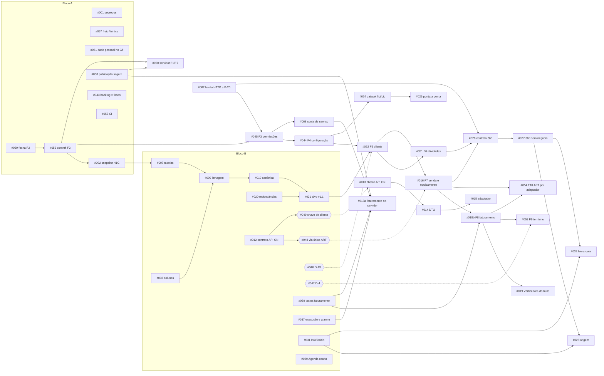

# 46 — Prompt de planejamento: backlog mestre da reestruturação do CRM

> **Versão 1.2 · 16/09/2026** (revisão da 1.1 depois de três verificações independentes: fatos, segurança e
> usabilidade; a 1.1 revisou a 1.0, do mesmo dia). Documento para colar numa IA de planejamento. Substitui o
> rascunho "CRM — MASTER BACKLOG" de 16/09/2026. Mantém a numeração #001–#042 do rascunho e #043–#054 da versão
> 1.0, divide #004 e #018 em duas entregas, adota #055 do documento 46A, acrescenta #056–#070 (1.1) e #071–#072
> (1.2). Corrige o que o código mostrou errado nas versões anteriores (Apêndice Z).
>
> **Uso interno.** Este documento descreve falhas de segurança ainda abertas (seções 3.5, 3.8 e 4.0). Cole-o só
> em ferramenta de IA aprovada pela empresa e não o publique no remoto antes da decisão P-21b (seção 7.2).
>
> **Como usar:** abra a IA na raiz do repositório `C:\projetos\tracbel-crm`, com permissão **só de leitura**, e
> cole este documento como primeira mensagem. Se a janela de contexto não comportar o documento inteiro, cole as
> seções 0, 1, 2, 7 e 9 a 14 e indique o caminho deste arquivo para a IA ler as seções 3 a 6 e as fichas da seção
> 11 sob demanda. Peça o plano no formato da seção 14, **em lotes** (um milestone por resposta; a IA termina cada
> lote com "continua em: Mx" e espera o pedido de continuação). A IA **planeja**: não escreve código, não altera
> banco, não faz commit, não mexe no GitHub e não chama sistema externo. Os fatos daqui foram conferidos em
> 16/09/2026 no código, no Git e nos documentos, e vêm marcados **[M]** (medido no código, arquivo ou Git),
> **[D]** (escrito num documento, não reconferido) ou **[I]** (inferido). O `46A-PLANO-DO-BACKLOG-MESTRE.md` é
> um plano gerado a partir da versão 1.0 deste documento: trate-o como rascunho a reconciliar, não como fonte.
> **As 56 issues já abertas no GitHub (seção 10) foram geradas do 46A**, então herdam os erros que as notas "a
> versão 1.0 dizia…" apontam: essas notas servem para corrigir as issues existentes.

---

## 0. Resumo em doze linhas

1. O CRM Tracbel (.NET 9 com minimal APIs, EF Core e SQL Server; frontend React 19/TypeScript/Vite) substitui o Vórtice CRM por fases.
2. O plano de reestruturação tem **10 fases** (doc 41). A **fase 1 foi executada e commitada** (82 → 50 tabelas, `cb05b7c`, sem push). A **fase 2** (auditoria automática) está implementada, com 511 testes verdes, **sem commit**: o p95 foi reprovado e a retenção D-10 está pendente.
3. Os dados foram **sanitizados em 15/09/2026**. Das 50 tabelas do banco local, 39 estão vazias, inclusive toda a configuração comercial, e **nenhuma rota grava configuração, processo, tarefa ou interação**: só `Cliente` e `Equipamento` têm escrita.
4. O **servidor segue com 82 tabelas e 12 migrações**. **Publicar é migrar**: a API aplica toda migração pendente ao subir em Production.
5. O serviço do ART está **parado e desabilitado**. O Vórtice está **congelado** (D-12), com uma brecha no freio (`--somente-medir`).
6. O faturamento do Protheus roda **dentro da classe da carga do Vórtice**, sem teste, sem registro de execução e sem credencial no servidor.
7. **Nenhuma permissão é conferida** pela API. A filial vem de um cabeçalho sem conferência (P-20), e a tela inicial depende desse furo.
8. A "nova API de vendas" do rascunho é a **API Gestão de Negócios**: painéis analíticos sem CPF/CNPJ nem código de cliente. O painel `art` não substitui a leitura direta do ART, e quatro painéis leem o Vórtice.
9. Há **bloqueios de negócio**: D-13 (classe e cadência) segura a fase 5 e, em cadeia, o 360; D-4 (municípios) segura só a fase 9b.
10. Muito do que o rascunho pede **já existe** (41A, 39A, 40/40A/40B, doc 38, `Procedencia`/`SeloProcedencia`, scripts de inventário, dicionário e sanitização). Planeje **atualizar**, não refazer.
11. Há **riscos operacionais imediatos** que não dependem de negócio: segredo do Entra a rotacionar, dado pessoal versionado (PNG, extração do Vórtice, protótipo e front), arquivos estáticos servidos sem login, `dotnet test` sem filtro apagando bancos de teste e `publicar.ps1` capaz de religar o ART.
12. Toda fase, commit, push, publicação, mudança no servidor e **edição no GitHub** (onde já existem 56 issues do plano 46A) exige **autorização explícita e separada**.

---

## 1. Papel e missão da IA

Você é a IA de **planejamento** da reestruturação do CRM Tracbel. Sua missão é produzir um plano executável:
issues no template da seção 13, ordem única, dependências, riscos e perguntas ao negócio. O plano deve levar o
CRM ao fluxo

**Fonte → Integração → Normalização → Domínio → API → Interface**

e nunca a **Sistema externo → tabela específica → tela específica**.

### 1.1 O que você pode fazer

- Ler o repositório: código em `src/`, testes em `tests/`, documentos em `docs/`, scripts em `scripts/` e
  catálogos em `dados-referencia/`, **menos os caminhos proibidos da seção 1.2**.
- Rodar comandos de **leitura** do Git e do disco: `git log`, `git status`, `git grep`, contagens e listagens.
  `git show` e `git log -p` só sobre arquivos que não estejam na lista de dado pessoal da seção 1.2.
- Propor issues, sequências, desenhos de contrato, critérios de aceite, perguntas e erratas de documento.

### 1.2 O que você NÃO pode fazer

- Escrever ou alterar código, migração, script ou documento. O plano volta **na resposta**; se o responsável
  pedir arquivo, ele indica o caminho (sugestão: `docs/projeto/46B-PLANO-DO-BACKLOG-MESTRE.md`), e nada mais é
  gravado.
- Fazer `git commit`, `push`, `reset`, `checkout`, `rebase`, `stash` ou reescrever o histórico. Criar **ou
  editar** labels, milestones ou issues no GitHub (as 56 existentes estão na seção 10).
- **Executar qualquer coisa além de leitura:** nenhum script de `scripts/` (inclusive `scripts/protheus/*.ps1`,
  que lê o `.env` e chama o Protheus REST; `verificar-sincronizacao.ps1`, `diagnosticar-servidor.ps1` e
  `_remoto.ps1`, que tocam o servidor; `scripts/vortice-extracao/*`; `scripts/prototipo/*.mjs`, que capturam
  telas com a API ligada; o gerador de inventário, que sobrescreve 39A e 39B em `:24` e `:441` e passa a senha do
  contêiner na linha de comando em `:41`), nenhum modo de `Tracbel.Crm.Carga`, nenhum seed, nem `dotnet build`,
  `dotnet test`, `dotnet run`, `npm`, Playwright ou `docker` (inclusive `docker inspect`/`exec`, que revelam a
  senha do contêiner, `infra/docker-compose.yml:43`). Mesmo filtrado, `dotnet test` compila e grava `bin/obj`;
  os 9 testes de banco real apagam e recriam `TracbelCrmMigracaoTeste` e `TracbelCrmColacaoTeste` na instância
  para onde `ConnectionStrings__Crm` apontar (`tests/Tracbel.Crm.Arquitetura.Testes/Banco/MigracaoNoContainerTestes.cs:40,252,411-424`;
  `ColacaoNoContainerTestes.cs:47,121-127`).
- Conectar em qualquer banco (servidor, local, contêiner de ensaio, banco de arquivo), no ART, no Protheus
  (REST ou SQL), no Vórtice ou no IBGE.
- Chamar a API Gestão de Negócios, nem com a chave nem sem ela. O contrato está na seção 5.
- Abrir `.env`, `.env.bak-*`, `infra/.env` ou qualquer `appsettings.*.json` fora do Git. O
  `.env.bak-20260909-174719` tem linhas no formato `RÓTULO: valor`, que escapam de qualquer máscara por
  `CHAVE=`. Só os **nomes** das chaves estão neste documento (seção 4.0).
- **Abrir, com leitura, `git show` ou `git log -p`, arquivos com dado pessoal real** (seção 3.8, S-6, S-7 e S-15):
  `dados-locais/**` (ignorado; bancos, capturas, coleta, território e CSV de conciliação de responsáveis);
  `*.xlsx` e `*.bak`; `docs/prototipo/comparacao/*.png` (15 `*-novo.png` **e** 15 `*-diff.png`);
  `docs/extracao-vortice/**`, salvo a DDL (`docs/extracao-vortice/ddl/*.sql`); `config-usuarios.json`
  (`prototipo/dados-seed/` e `src/Tracbel.Crm.Web/public/dados/`); `prototipo/referencia/assets/app.js` e
  `config-block.js`; e as versões antigas dos arquivos que o doc 33 §1.5 inventaria. Para medir, use só contagem
  (`git grep -c`, `git grep -l`, `git log --stat`), nunca o conteúdo. Se achar dado pessoal em outro lugar, cite
  arquivo e contagem, nunca o valor.
- Publicar no servidor, religar o serviço do ART, rodar seed com dado real ou conceder permissão a usuário real.
- **Contornar recusa** de classificador ou de permissão da ferramenta (já ocorreram "Credential Exploration",
  "Production Deploy" e "Modify Shared Resources"): publicação e comandos no servidor são executados pelo
  responsável (R-26).

### 1.3 Postura

- Marque cada afirmação como **[M]**, **[D]** ou **[I]**. **Nunca invente número**: sem fonte, escreva "a
  confirmar".
- Quando documento e código divergirem, cite os dois e diga qual é mais recente (`git log -1 -- <arquivo>`). Em
  16/09 o código é mais recente em quase todos os casos conhecidos (seção 6.5 e #065).
- **Decisão de negócio não é sua.** Vira pergunta com dono: comercial, diretoria, responsável pelo projeto,
  TI/infraestrutura, jurídico ou equipe de Inteligência de Mercado.
- **Numeração de fases:** vale a do doc 41 (1–10). O doc 40 §17, a coluna "Fase" do 40B e o 41A §4 usam a
  numeração antiga F0–F9 (lá, "8" é faturamento **e** território e "9" é reativar o ART).
- **Identificadores que colidem:** o "D-11" do doc 32 é a filial por cabeçalho; chame-o de **P-20**. D-11 nos docs
  40, 41 e aqui é a semente estrutural. Os D-1..D-10 do doc 23 e os D-1..D-11 do doc 32 §3.3 não são os D-x do doc
  41 (seção 7.3).
- **Profundidade esperada:** o responsável considera raso qualquer levantamento que não chegue a tabela, campo,
  classe, rota, arquivo e linha.

---

## 2. Regras invioláveis do projeto

| # | Regra | Evidência |
|---:|---|---|
| R-1 | **Uma fase por autorização.** Fase com decisão pendente não começa; pendência parcial divide a fase (caso da fase 9) | doc 41 §1, §2 |
| R-2 | **Commit, push, publicação, mudança no servidor e reescrita de histórico** exigem autorização explícita, a cada vez | doc 41 §1 ("nenhum commit sem autorização"), §3.5; doc 33 |
| R-3 | **O servidor não recebeu as fases 1 e 2.** Levá-las é autorização à parte, com backup `COPY_ONLY`, conferência de vazio **no servidor** e de consumidores externos | doc 44 §6.6 e §8 item 2 (restauração, vazio, `up`, contagens); doc 41 §6 R3 (consumidores externos); doc 45 §7 |
| R-4 | **Publicar é migrar.** Em Production, a API aplica toda migração pendente ao subir e não sobe se a migração falhar. Nenhuma publicação a partir de `cb05b7c` é neutra: ela executa a fase 1 (32 `DROP`) e, se estiver no build, a fase 2 | `src/Tracbel.Crm.Api/Program.cs:254-270`; `scripts/deploy/publicar.ps1:23-28` |
| R-5 | **A integração roda no servidor** (serviço do Windows ou rotina da aplicação). Nunca um script de estação gravando no banco central | doc 35 §6.2, §11. Exceção histórica a eliminar: `scripts/deploy/carregar-territorio-no-servidor.ps1` |
| R-6 | **A VM do servidor não usa Docker.** Não propor contêiner nela | doc 35 §12.8; `instalar-no-servidor.ps1:13-18` |
| R-7 | **Vórtice congelado (D-12):** não remover, não usar, não recolocar no fluxo. A carga só roda com `--legado-somente-referencia-eu-sei-o-que-estou-fazendo` | doc 41 §1, §1.1; `src/Tracbel.Crm.Carga/Program.cs:110-126` |
| R-8 | **Nenhuma dependência nova do Vórtice**, nem indireta. Isso inclui os quatro painéis da API Gestão de Negócios que leem o CRM legado e qualquer uso de `seq_pessoa`, `dna` ou `processo` do legado | D-12; seção 5 |
| R-9 | **ART desabilitado.** Reativar é autorização à parte. O `publicar.ps1` só respeita o `DISABLED` se o serviço já existir | doc 38 §9; `publicar.ps1:329-343, 379-391` |
| R-10 | **Venda do ART ≠ nota do Protheus:** nunca somar nem substituir uma pela outra (razão mensal de 0,75 a 4,4 em 12 meses) | doc 36 §3.1 |
| R-11 | **Comprador ≠ dono.** Divergência vai para revisão e nunca sobrescreve. **Nenhum cliente é criado automaticamente** | doc 35 §10.1–10.2; `src/Tracbel.Crm.Carga/CargaDoArt.cs:31-46` |
| R-12 | **Nada de casar registros por semelhança de nome.** Única exceção registrada: igualdade exata de chave normalizada com **um único** usuário, só para identificar responsável de planilha | doc 35 §10.2; doc 40 §11.1; `src/Tracbel.Crm.Integracao/Carga/SaneamentoDeTerritorio.cs:241-292` |
| R-13 | **Chaves naturais:** CPF/CNPJ para cliente e chassi VIN (17 posições) para equipamento. Fusão de duplicata nunca é automática | doc 16 §4; `src/Tracbel.Crm.Dominio/Comum/Chassi.cs:16,37-39` |
| R-14 | **Município é seleção do catálogo IBGE**, nunca texto livre | doc 26 §2 |
| R-15 | **Fontes externas só leitura:** ART em sessão `READ ONLY`; Protheus só `SELECT`/`GET` (o login SQL é **db_owner**); Vórtice só leitura | `Integracao/Art/LeitorDoArt.cs:89-92`; `Integracao/Art/LeitorDoCadastroDoProtheus.cs:93-125`; doc 35 §8 |
| R-16 | **Nenhum segredo** em código, documento, issue, log, URL ou bundle do frontend (tudo em `VITE_*` é público). Só **nomes** de variáveis | `.gitignore:17-24`; `src/Tracbel.Crm.Web/src/dados/api/http.ts:22` |
| R-17 | **Documentos e issues sem nome de pessoa, sem CPF/CNPJ real e sem e-mail pessoal.** Dado nominal fica só em `dados-locais/`, ignorado pelo Git | `.gitignore:56`; doc 32; doc 43 |
| R-18 | **Nenhum valor financeiro do ART** lido, gravado ou documentado. O vendedor do ART não é gravado | `LeitorDoArt.cs:11-14,54-57`; `Dominio/Frota/VendaDeMaquina.cs:58-60`; doc 35 §7.5 |
| R-19 | **Sem seed com dado real.** Semente só estrutural (D-11, proposta); dataset de teste fictício | doc 41 fase 4; doc 38 |
| R-20 | **Identidade visual do protótipo mantida:** melhorar a usabilidade sem redesenhar e sem cor, fonte ou raio fora dos tokens | `docs/prototipo/02-DESIGN-SYSTEM.md`; `07-PADRAO-DE-TELA.md` §9; `src/Tracbel.Crm.Web/src/estilos/design-system.css` |
| R-21 | **Nenhuma permissão a pessoa real por suposição.** Concessão é operação registrada e autorizada | doc 41 fase 3; doc 32 §8.5.5 |
| R-22 | **Todo `Down` completo e ensaiado** (up → down → up) num banco **de ensaio com nome próprio** (`TracbelCrmEnsaioFaseN`) no contêiner `tracbel-crm-ensaio`, antes de qualquer outro banco. Nunca sobre `TracbelCrmArquivo20260915` nem sobre as cópias antigas com dado real (seção 3.6) | doc 41 §3.3 (R12); doc 44 §5.1 (`TracbelCrmEnsaioFase1`); doc 45 §4.1 (`TracbelCrmEnsaioFase2`) |
| R-23 | **Números da tela provados** tela = API = SQL, sem omissão nem dupla contagem. Medido, regra provisória, estimativa e fonte a confirmar ficam separados | doc 36; doc 32 §2, §8.7 |
| R-24 | **Teste com banco real só no contêiner local `tracbel-crm-db`** (`localhost`, porta `DB_PORTA`), nunca com `ConnectionStrings__Crm` apontando para `tracbel-crm-ensaio` (porta 14334) ou para o servidor | `MigracaoNoContainerTestes.cs:40,252,411-424`; seção 3.6 |
| R-25 | **Nenhum dado pessoal** (nome, UPN, e-mail, CPF/CNPJ, telefone) em log, mensagem de execução (`ExecucaoDeSincronizacao.Mensagem`), exceção registrada, arquivo estático ou bundle do frontend; só identificador técnico | memória do projeto (integração do ART); S-9, S-15 |
| R-26 | **Recusa de classificador ou de permissão da ferramenta não se contorna.** Publicação, comandos no servidor e edições no GitHub são executados pelo responsável ou com autorização registrada | memória do projeto (recusas "Credential Exploration", "Production Deploy", "Modify Shared Resources") |
| R-27 | **Visita, potencial e pós-venda nunca aparecem como "validados comercialmente"** sem decisão registrada; ficam como regra provisória, estimativa ou fonte a confirmar | memória do projeto (território e Visão 360); doc 32 §8.7; P-2, P-8 |

---

## 3. Ponto de partida medido (16/09/2026)

### 3.1 Repositório

| Item | Valor | Fonte |
|---|---|---|
| Branch / HEAD | `main` / `cb05b7c` "refactor(db): simplifica estruturas não utilizadas"; 18 commits | [M] `git log` |
| Remoto | `github.com/tracbel/Visao_360`. `main` está **3 commits à frente** do último `origin/main` conhecido (`1f78018`: `e0419b8`, `81b1221`, `cb05b7c`). Não houve fetch, então a referência remota pode estar velha. Os docs 41 a 46A citados nas issues do GitHub **não estão no remoto** | [M] `git rev-list --left-right --count main...origin/main`; [D] memória do projeto |
| GitHub | **Já existem 32 labels, 10 milestones (M0–M9) e 56 issues** (GitHub #1–#56), criadas em 16/09 a partir do 46A, com outra conta autorizada (a conta ativa do `gh` na estação não enxerga o repositório). O número do plano está no título entre colchetes e **diverge do número do GitHub a partir da [018]** (018a = #18, 018b = #19, 019 = #20 … 055 = #56). Correspondência na seção 12.5 | [D] 46A §9 (16:46); memória do projeto. Estado não conferido na rede |
| Push | não feito. A tentativa de 13/09 falhou ("Repository not found" com a conta ativa na estação); a conta que criou as issues enxerga o repositório, e a permissão de push dela está **a confirmar**. A P-21 (faturamento por filial nos docs 32 e 36), a P-21b (mapa de vulnerabilidades deste documento) e a reescrita do histórico (doc 33, opção C+, **não autorizada**) precisam ser decididas antes | [D] doc 32; doc 33 §3, §7.0; 46A §9 |
| Não commitado | **15 modificados + 10 não rastreados.** Modificados: 8 da carga (`CargaDeProcessoDoVortice.cs`, `.Faturamento.cs`, `.VendaPerdida.cs`, `CargaDeTerritorio.cs`, `CargaDoArt.cs`, `CargaDoVortice.cs`, `ConsolidacaoDeGrafiasCortadas.cs`, `Program.cs`); 5 de domínio e infraestrutura (`Auditoria.cs`, `ContextoAcesso.cs`, `CrmDbContext.cs`, `DocumentoEAuditoriaConfiguracao.cs`, snapshot); 2 de teste (`ConsolidacaoDeGrafiasCortadasTestes.cs`, `AuditoriaTestes.cs`). Não rastreados: 7 da fase 2 (`Dominio/Auditoria/OrigemDaOperacao.cs`, `PoliticaDeAuditoria.cs`, `Infraestrutura/Persistencia/TrilhaDeAuditoria.cs`, migração `20260916112755_AuditoriaComOrigemDaOperacao` + Designer, `AuditoriaAutomaticaNaApiTestes.cs`, `TrilhaDeAuditoriaTestes.cs`) e os **docs 45, 46 e 46A** | [M] `git status --short` |
| CI | **não existe** (sem `.github/`) | [M] |
| Projetos | `src/Tracbel.Crm.{Api,Aplicacao,Carga,Dominio,Infraestrutura,Integracao,Web}`; `tests/Tracbel.Crm.{Api,Aplicacao,Arquitetura,Dominio,Integracao}.Testes` | [M] |
| Migrações | **14:** `ModeloInicial` … `IntegracaoDoArtLinhaDeProdutoVendaEVinculo`, `ModeloPendenteSoNaOrigemArt`, `SincronizacaoComoServicoECatalogoDeClassificacao` (14/09), **`20260916010353_SimplificacaoEstruturalFase1`** (13ª; o doc 41 §5 e o 41B §5 a chamavam `RemocaoDeEstruturasSemUso`) e **`20260916112755_AuditoriaComOrigemDaOperacao`** (14ª, sem commit) | [M] `src/Tracbel.Crm.Infraestrutura/Migrations/` |
| .NET | `net9.0`, publicado self-contained no servidor. O `Directory.Build.props:5,15` diz ser "o único lugar" da versão e declara `net10.0` (LTS) como alvo (`:9`), mas **`<TargetFramework>net9.0` também está em 12 `.csproj`**, que prevalecem: 6 de `src` (Api:4, Aplicacao:8, Carga:5, Dominio:4, Infraestrutura:30, Integracao:37), os 5 de `tests` e `scripts/banco/DicionarioGerador:5` (`scripts/vortice-extracao/BinInspector` está em `net8.0`) | [M] `git grep -n TargetFramework -- '*.csproj' '*.props'` |

### 3.2 Estado das fases do doc 41

| Fase | Assunto | Tabelas ao fim | Estado em 16/09 | Bloqueia o início (seção 7.2) | Pendente dentro da fase |
|:-:|---|---:|---|---|---|
| 1 | Remoção de estruturas sem uso | 50 | **executada e commitada**, só local e ensaio. Critérios não cumpridos: "conferido pelo script de inventário no local **e no servidor**" e "documentos 14, 39A, 39B e 40B atualizados" (doc 41, ficha da fase 1). O doc 44 §8 item 3 adiou para a fase 2 os docs 14, 17, 21 e 39, que ela não atualizou; 39A, 39B e 40B também não foram | — | servidor (#050) |
| 2 | Auditoria automática | 50 | **implementada, sem commit**, só local e ensaio; 4 de 5 critérios atendidos | — (já implementada) | **p95 reprovado** (ou Q-P1); **D-10** |
| 3 | Identidade e permissões | 50 | não iniciada | D-3, D-8, matriz D-9, **P-20**, Q-P2 (#072) | — |
| 4 | Configuração do CRM e semente | 50 | não iniciada | D-11, matriz D-9 (#072) | — |
| 5 | Cliente, contato, endereço, carteira | 48 | não iniciada | **D-13**, cadência, D-5 | D-8 (parte da carteira), P-16, P-25/P-27, precedência `SA1` × CRM |
| 6 | Tarefa, interação e agenda | 48 | não iniciada | D-7, P-2/P-3 | — |
| 7 | Equipamentos, vendas e rastro de origem | 44 | não iniciada | D-6, via única da venda de máquina (#048) | P-32..P-40 que tocam `VendaDeMaquina` |
| 8 | Faturamento | 43 | não iniciada | — (depende de 5 e 7) | D-13 (job da classe, #018b); P-4, P-5, CFOP 5949 (valor oficial, não o início); leitura única da `SA1` |
| 9 | Território (9a sem bloqueio; 9b) | 42 | não iniciada | **D-4** (só 9b) | P-14/P-34 (filiais inativas) |
| 10 | ART por adaptador (serviço segue desligado) | 42 | não iniciada | login só leitura no Protheus (TI); P-32..P-40 que o adaptador precisa (a definir item a item) | reativar é **outra** autorização, fora da fase |

Dependências [D doc 41 §4]: 1 → 2 → 3 → 4 → 5 → 6; 2 e 5 → 7; 5 e 7 → 8; 7 e 8 → 9; 7 (e 9, para território) →
10. O doc 41 §4 põe "autorização de reativação" como bloqueio da fase 10, embora diga que ela não reativa o
serviço; aqui vale a leitura acima. FKs ao fim das fases 4 a 10 são estimativas: ~120, ~116, ~110, ~95, ~90, ~86,
~86 [D doc 41 §7.1].

### 3.3 Estrutura: modelo, banco local e servidor

| Medida | Modelo EF (snapshot, com a F2) | Banco local (depois da F2) | Servidor (sem F1 e F2) |
|---|---:|---:|---:|
| Tabelas | **49** (`ToTable`) | **50** (49 + `metadado.__EFMigrationsHistory`) | **82** |
| Colunas | 666 | 668 (= 666 + 2 do histórico) | 1.040 [D 41A] |
| Índices | 182 declarados (62 únicos) + 49 PKs | 233 (= 182 + 50 PKs + 1 UNIQUE) | 390 [D 41A] |
| CHECK | 113 | 113 | 189 [D 41A] |
| FKs | 123 | 123 | 213 |
| Migrações | 14 | 14 | 12 |
| Linhas | — | 6.149 | 6.142 (15/09) |
| Fonte | [M] grep em `CrmDbContextModelSnapshot.cs` | [D] doc 45 §3 (reconciliação [M]) | [D] doc 44 §6.6; doc 38 §0; 41A |

- **Schemas [M]:** `organizacao` 9 · `integracao` 9 · `processo` 9 · `comercial` 8 · `frota` 7 · `seguranca` 4 ·
  `metadado` 2 · `auditoria` 1. Nenhuma tabela em `dbo`. O dicionário está fixado em
  `EsquemaENomenclaturaTestes.cs:152-173`.
- **`CrmDbContext` [M]:** 48 `DbSet` (eram 79 antes da F1). `ItemConjuntoPermissao` não tem `DbSet`. Nas três
  tabelas de permissão, o nome da entidade difere do nome da tabela (`ConjuntoPermissao` →
  `ConjuntoDePermissao`, `ItemConjuntoPermissao` → `ConjuntoDePermissaoItem`, `UsuarioConjuntoPermissao` →
  `UsuarioConjuntoDePermissao`).
- **Resíduos de nome [M]:** `Configuracoes/SegurancaEWorkflowConfiguracao.cs` e
  `DocumentoEAuditoriaConfiguracao.cs` ainda carregam "Workflow" e "Documento", que saíram na F1.
  `FronteiraDeEmpresaJustificada` só tem `Usuario` (`CrmDbContext.cs:79-97`).
- **Evolução [D docs 44 §3 e 45 §3]:** F1 levou 82/1.040/390/189/213 a 50/665/232/111/122 (8 schemas, 1 tabela
  particionada, `dbo` zerado); o plano previa −364 colunas e −148 índices, e o real foi −375 e −158. A F2 somou
  3 colunas, 1 índice, 2 CHECK e 1 FK.
- **Particionamento [M]:** só `auditoria.AlteracaoDeCampo`, por mês (`ModeloInicial.Particionamento.cs`). A
  função de partição cobre do 3º mês anterior ao 12º mês seguinte à aplicação da `ModeloInicial`. **Não existe
  job de `SPLIT RANGE`** (`:51-57`): depois dessa janela, toda linha cai na última partição.

### 3.4 Dados e quem escreve em cada tabela

**Tabelas com linha no banco local (11) [D docs 38 §3.1, 44 §3, 45 §3; soma conferida = 6.149]:**
`organizacao.Empresa` 18 · `organizacao.Municipio` 5.571 (só os com código IBGE) · `seguranca.Usuario` 1 ·
`metadado.Catalogo` 10 · `metadado.CatalogoItem` 227 · `frota.Marca` 13 · `frota.Familia` 28 ·
`frota.Modelo` 253 · `frota.LinhaDeProduto` 10 · `integracao.Sistema` 4 · `metadado.__EFMigrationsHistory` 14.

**Tabelas vazias (39):** todas as outras. Só `CanalContato` e as três de permissão **nunca tiveram linha**; as
outras 35 foram esvaziadas pela sanitização de 15/09 (doc 38 §3.2).

| Escritor no código hoje [M] | Tabelas |
|---|---|
| **API** (POST/PUT/DELETE) | `comercial.Cliente`, `frota.Equipamento` (+ `auditoria.AlteracaoDeCampo` com a F2). Com o Entra ligado, `GET /auth/eu` e qualquer GET em `/api` podem gravar `seguranca.Usuario` (vínculo no primeiro login, último acesso de hora em hora) |
| **Carga do Vórtice, congelada: única escritora** | `Contato`, `ClienteContato`, `LinhaDeNegocio`, `Carteira`, `CarteiraMunicipio`, `ClienteCarteira`, `TipoProcesso`, `Fase`, `TipoTarefa`, `Resultado`, `MotivoDePerda`, `Processo`, `Tarefa`, `Interacao`, `VendaPerdida`, `ChaveExterna`. Também é o **único código C# que cria `Usuario`** (`CargaDeProcessoDoVortice.cs:438`) |
| **Carga do ART** | `Equipamento`, `VendaDeMaquina`, `VinculoDeClienteComEquipamento`, `RegistroDeOrigem`, `CorrespondenciaDaOrigem`, `CompradorPendente`, `DivergenciaDeIntegracao`, `ExecucaoDeSincronizacao`, `PontoDeSincronismo` |
| **Território (IBGE + planilhas)** | `Municipio`, `MunicipioDaAreaDeAtuacao`, `ResponsavelPeloMunicipio`, `AreaPlantadaNoMunicipio`, `Endereco.MunicipioId` (grafias), `MensagemDescartada`, `PontoDeSincronismo` |
| **Faturamento** (partial da classe do Vórtice) | `FaturamentoDoCliente`, `FaturamentoSemCliente`, `Cliente.Classe`/`FaturamentoApurado`/`ClasseApuradaEm` |
| **Semente SQL** | `scripts/banco/seed/01-dados-de-referencia.sql`: `Empresa`, `CatalogoItem`, `Marca`, `Familia`, `Modelo`, `LinhaDeProduto` (MERGE). `02-usuarios-de-desenvolvimento.sql`: `Usuario` |
| **Nenhum escritor** | `CanalContato` (0 usos de `CanaisDeContato`); `ConjuntoDePermissao`, `ConjuntoDePermissaoItem`, `UsuarioConjuntoDePermissao` (só leitura em `EscopoDeAcesso`); `RegraDePotencial` (só `HasData` em `OrganizacaoConfiguracao.cs:359`, com 1 linha "AConfirmar", apagada na sanitização; lida por `RepositorioDeIndicadoresTerritoriais.cs:315`). `Equipamento.HorimetroAtual` também não tem escritor |

**FKs obrigatórias que travam o operacional [M, snapshot]:** `Processo` → `TipoProcesso` e `Fase`; `Tarefa` →
`TipoTarefa`; `Interacao` → `TipoTarefa`; `Resultado` → `TipoTarefa`; `Fase` → `TipoProcesso`; `Carteira` →
`LinhaDeNegocio`; `VendaPerdida` → `MotivoDePerda`; `VendaDeMaquina.CompradorId` (não nulo) → `Cliente`. Com a
configuração vazia e sem rota de escrita, **não dá para criar oportunidade, tarefa, interação, carteira, perda
nem venda**, nem por tela nem por dataset. A configuração comercial (fase 4) é pré-requisito de tudo que é
operacional.

**Catálogos nunca semeados [M]:** `dados-referencia/` (rastreado) tem `fase.json`, `motivo_de_perda.json`,
`linha_de_negocio.json`, `tipo_de_tarefa.json`, `tipo_de_processo.json` e `resultado.json`, vindos do protótipo
e do legado, que nunca foram gravados em `processo.*`. O `dados-referencia/README.md` ainda fala em PostgreSQL.

### 3.5 Servidor e operação

- **Máquina [D doc 35 §11–§12]:** AGRO-SISTEMAS-W (10.150.4.249), VM OpenStack sem VMX, Windows Server 2022 no
  domínio, 2 núcleos (4 lógicos), 16 GB. SQL Server 2025 **Express** nativo (sem SQL Agent), banco `TracbelCrm`.
  Serviços do Windows `TracbelCrmApi` (HTTPS 5443, `ASPNETCORE_ENVIRONMENT=Production`) e
  `TracbelCrmSincronizacaoArt` (**parado e desabilitado desde 15/09**). A VM também hospeda outros serviços,
  entre eles `TracbelVerificacao` (NSSM + Python, de outro projeto). A hipótese de ele ser a API Gestão de
  Negócios **não está confirmada**.
- **Estrutura do banco central:** 82 tabelas, 213 FKs, 12 migrações e 6.142 linhas em 11 tabelas [D doc 44 §6.6;
  doc 38 §0].
- **Logs:** Log de Aplicativo do Windows (origens `Tracbel.Crm.Api`, `TracbelCrmApi`,
  `TracbelCrmSincronizacaoArt`), sem pasta de logs [D doc 35 §12.6].
- **Backups:** `COPY_ONLY` manuais no disco C:, modelo de recuperação FULL com `.ldf` de cerca de 1 GB, **sem
  rotina automática**; a API não reinicia em falha sem queda [D doc 35 §12.6–§12.8].
- **Segredos:** em texto claro em dois `appsettings.Production.json` protegidos por ACL. O da API tem
  `ConnectionStrings:Crm`, a senha do certificado Kestrel e `Entra:ClientSecret`. O da sincronização tem `Crm`,
  `Art` e `ProtheusBanco` (seção 4.0). Não há cofre nem DPAPI [M scripts].
- **Faturamento do Protheus não roda no servidor:** nenhum script repassa `Protheus__*` [M `publicar.ps1:269-308`].
- **Território** foi carregado da estação para o banco central com Integrated Security
  [M `carregar-territorio-no-servidor.ps1:69,133-141`], contrariando R-5.
- **Contradição documental:** o doc 45 §2.1 e §7 item 4 afirmam que o servidor "tem as linhas da carga do ART" em
  `AlteracaoDeCampo`. O doc 38 §3.2 **mediu** 6.046 → 0 nessa tabela no servidor, e o serviço está desligado
  desde então. Só uma contagem somente leitura no servidor, com autorização, resolve.
- **Resto provável de instalação [I]:** `C:\projetos\tracbel-crm-deploy\publicacao\_banco\TracbelCrm.bak`
  (anterior à sanitização, exigido pelo `instalar-no-servidor.ps1:40,104-108`) e transcrições de tarefas remotas
  (`_remoto.ps1:21-23`).
- **ACL do arquivo de configuração da API [M script; I estado]:** o instalador grava o JSON com credenciais
  (`instalar-no-servidor.ps1:632`) e só depois aplica a ACL **por nome** (`:634-639`); o `publicar.ps1` faz o
  contrário, por SID e com o arquivo criado já restrito (`:310-324`), por causa da parada de 14/09 em Windows pt-BR.
  A ACL efetiva do arquivo da API no servidor é desconhecida (S-16).

### 3.6 Ambientes, backups e histórico consultável

**Ambientes** (use sempre o nome, nunca "contêiner local" ou "contêiner de ensaio" sem dizer qual):

| Ambiente | O que é | Uso permitido | Uso proibido |
|---|---|---|---|
| `tracbel-crm-db` | contêiner do `infra/docker-compose.yml` (`:24`), porta `DB_PORTA` de `infra/.env`; banco `TracbelCrm` de desenvolvimento, sanitizado (50 tabelas depois da F2) | testes `Categoria=BancoReal`, inventário (`gerar-inventario-do-banco.ps1:8,41`), dataset fictício (#024) | dado real |
| `tracbel-crm-ensaio` | contêiner à parte, porta 14334. Guarda **bancos de ensaio por fase** (`TracbelCrmEnsaioFase1`, `TracbelCrmEnsaioFase2`) **e cópias com dado real**: `TracbelCrmArquivo20260915` (somente leitura) e as cópias antigas `TracbelCrmServidor`, `TracbelCrmServidorVazio` e `TracbelCrmEnsaioArt` | ensaio de migração (`Down`) num banco novo com nome próprio, restaurado de ponto de restauração; leitura autorizada do arquivo | testes `BancoReal`; migração, seed ou `DELETE` sobre as cópias com dado real [D doc 38 §2 e §10; doc 44 §5.1; doc 45 §4.1] |
| Servidor `AGRO-SISTEMAS-W` | banco central `TracbelCrm` (SQL Server 2025 Express nativo) | só com autorização explícita (R-2, R-3) | contêiner (R-6), teste, medição de desempenho com escrita (#050) |

| Ponto de restauração | Onde |
|---|---|
| Servidor antes da limpeza | `C:\Program Files\Microsoft SQL Server\MSSQL17.MSSQLSERVER\MSSQL\Backup\TracbelCrm-arquivo-antes-da-limpeza-20260915-095042.bak` (cópia com mesmo SHA-256 em `dados-locais/bancos/`) [D doc 38 §2] |
| Local antes da limpeza | `dados-locais/bancos/TracbelCrm-local-arquivo-antes-da-limpeza-20260915-100112.bak` [D] |
| Antes da fase 1 / antes da fase 2 | `dados-locais/bancos/antes-fase-1-reestruturacao-20260915.bak` / `antes-fase-2-reestruturacao-20260916.bak` [D docs 44 e 45] |
| Servidor em 14/09 | `dados-locais/bancos/TracbelCrm-servidor-20260914.bak` [D] |
| **Histórico consultável** | banco `TracbelCrmArquivo20260915` no contêiner `tracbel-crm-ensaio` (porta 14334), **somente leitura**. É a única fonte para números de linhagem e de concorrência anteriores à sanitização. Acesso exige autorização |

Os `.bak` "antes da limpeza" (servidor, sua cópia local e local) e o "servidor em 14/09", o arquivo consultável e as
cópias antigas do `tracbel-crm-ensaio` têm **dado real anterior à sanitização** [D doc 38 §2, §10]. Os pontos
"antes da fase 1/2" são posteriores a ela, mas trazem o usuário real que sobrou na base sanitizada [I]. Nenhuma
issue anterior à versão 1.2 definia retenção, criptografia, quem restaura ou prazo de descarte: isso é a #071.

### 3.7 Testes e qualidade

| Verificação | Estado | Fonte |
|---|---|---|
| `dotnet build` | 0 erro, 0 aviso (`TreatWarningsAsErrors`, `EnforceCodeStyleInBuild`) | [D] doc 45 §4.3; `Directory.Build.props:30-34` |
| Casos de teste | **511**: Domínio 163 · Integração 133 · API 93 · Aplicação 58 · Arquitetura 64. A contagem estática de `[Fact]` + `[InlineData]` + `[FatoSeHouverSqlServer]` bate | [D] doc 45 §4.3; [M] grep |
| Testes de banco real | 9, com `[FatoSeHouverSqlServer]` e `Trait Categoria=BancoReal` (7 em `MigracaoNoContainerTestes`, 2 em `ColacaoNoContainerTestes`). Usam **primeiro** `ConnectionStrings__Crm` e pulam sem servidor | [M] |
| API e Aplicação | SQLite em memória (`tests/Tracbel.Crm.Api.Testes/ApiEmMemoria.cs:51-81`), que ignora `rowversion` e usa outro SQL na trilha | [M] |
| Sem teste automatizado | ramo SQL Server da trilha (INSERT multilinha), retentativa `EnableRetryOnFailure`, concorrência com entidade **auditada** (o teste em contêiner usa `Usuario`, fora da política); `PonteDoProtheus`, `LeitorDeFaturamentoDoProtheus`, carga de faturamento, `LeitorDoCadastroDoProtheus`, `LeitorDoIbge`, `CargaDeTerritorio`, `PlanilhaDoComercial`, `CargaDoVortice`; nenhum `HttpMessageHandler` falso no repositório | [M] grep em `tests/` |
| Rotas sem teste de API | `DELETE /equipamentos/{chave}`, `/relatorios/vendas-perdidas`, `/relatorios/faturamento`, `/relatorios/cen`, `/municipios`, `/cobertura/filiais`, `/cobertura/carteiras`, `/auth/sair`. Seis delas também sem teste de caso de uso. Nenhum teste HTTP com Entra ligado (`ApiEmMemoria.cs:56`) | [M] |
| Testes que fixam a estrutura | `EsquemaENomenclaturaTestes.cs:114` (soma em `:173`, 49 tabelas em 8 schemas) e `:65-67` (particionadas); `MigracaoNoContainerTestes.cs:43` (soma em `:68`) e `:94`; `MultiempresaTestes.cs:119` (exceção `Usuario`); `AuditoriaTestes.cs:124` (política só cita campos existentes) e `:153`. O doc 41 §3.4 e a versão 1.0 deste documento citavam `:112` e `:64`, que estão desatualizados | [M] |
| Frontend | `npm run build` e `npm run lint` (oxlint) verdes [D doc 45]; oxlint com 0 erros e 22 avisos; `tsc --noEmit` sem erro [M leitura do frontend em 16/09]. `vitest`, `@testing-library/react`, `jest-dom` e `jsdom` instalados, **sem script `test` e sem nenhum `*.test.*`** (`package.json:6-11`) | [M] |
| Telas | roteiro `scripts/prototipo/capturar-crm-vazio.mjs` (12 telas, só captura, sem asserção). `comparar-telas.mjs` usa baseline obsoleta desde 05/09 e aponta para a rota `/oportunidades/1517613`, que não existe mais | [M]; [D] `docs/prototipo/05` §10.1, §10.3 |
| Publicação | `publicar.ps1:165` roda `dotnet test` **sem filtro** e o front só com `npm run build` | [M] |

### 3.8 Achados de segurança já medidos

| # | Achado | Evidência | Issue |
|---|---|---|---|
| S-1 | **Nenhuma permissão de entidade + verbo é conferida.** `Autorizador` só é instanciado em teste (`AutorizadorTestes.cs:30`); nenhum caso de uso nem rota chama `ContextoAcesso.Tem` ou `AlcancaRegistro` (em `src/`, só o próprio `Autorizador.cs:78,84` os usa); `ProfundidadeDe` só serve a `PodeAlcancarTodasAsEmpresas` (`ContextoAcesso.cs:122-123`) e ao `Autorizador`; 0 `RequireAuthorization` e 0 `FallbackPolicy`. A lista fixa dá 10 códigos a todo usuário, **inclusive `Lead.Ler`**, de entidade que já saiu. A única permissão verificada é `Empresa.AlcanceEntreFiliais` (`ConsultasDeTerritorio.cs:204`; `CrmDbContext.cs:534`). A barreira real é o filtro global de `EmpresaId` | `Dominio/Seguranca/Autorizador.cs:45`; `Infraestrutura/Identidade/EscopoDeAcesso.cs:41-46` | #045 |
| S-2 | **Filial por cabeçalho sem conferência (P-20).** `X-Tracbel-Empresa` vale com o Entra ligado ou desligado e escolhe qualquer filial ativa. O painel da rota `/` troca o cabeçalho para cada filial | `EscopoDeAcesso.cs:74-80`; `Api/Comum/MeioDeCampoDeContextoDeAcesso.cs:75`; `Web/src/dados/api/consolidado.ts:154-159,346-356`; doc 32 (P-20) | #045, #062 |
| S-3 | Com o Entra desligado, em **qualquer ambiente**, `X-Tracbel-Usuario` assume qualquer usuário ativo; a autoria da trilha da F2 fica falsificável | `Infraestrutura/Identidade/ResolvedorDeContextoProvisorio.cs:95-111`; `Api/Program.cs:299-304` | #062 |
| S-4 | `GET /api/v1/integracoes/sincronizacoes` lê tabela sem `EmpresaId`: qualquer usuário autenticado vê o nome da máquina e as mensagens de erro de integração | `Dominio/Integracao/IntegracaoDeOrigem.cs:788-828`; `Portas/PortasDaIntegracaoDoArt.cs:118-128` | #062 |
| S-5 | **Segredo do aplicativo Entra** em texto claro no `.env`, no `.env.bak-20260909-174719` (formato `RÓTULO: valor`, invisível a listagem por chave) e no arquivo da API no servidor. Em 16/09 ele foi exibido no registro de uma sessão de ferramenta de IA, por leitura mal filtrada; esse registro e a memória persistente entre sessões podem guardar o valor [I]. **Rotação obrigatória e imediata** | [M] comparação sem imprimir valor | #001 |
| S-6 | **Dado pessoal real no Git remoto:** `docs/prototipo/comparacao/*-novo.png` (15 arquivos rastreados, capturados com a API ligada em 05/09; `clientes-novo.png` conferido com nomes e CPF/CNPJ reais) e os 15 `*-diff.png` gerados deles, no commit `dd1b69f`, que já está em `origin/main` | [M] `git ls-files`; `git branch -r --contains dd1b69f` | #061 |
| S-7 | **Dado pessoal em arquivos versionados, bem além de três arquivos.** Hoje, o padrão de e-mail corporativo aparece em **37 arquivos rastreados** (fora os docs 46 e 46A), 7 deles em `docs/extracao-vortice/`: `catalogos-bpm/IV_Operador.csv` concentra 487 ocorrências; `prototipo/referencia/assets/app.js` e `config-block.js`, 14 cada; `config-usuarios.json`, 12 em duas cópias (protótipo e `public/dados` do front); `scripts/coleta/gerar-modelos-de-coleta.py`, 8; seed 02, 6; sanitização, 2; doc 38, 2; doc 23, 2; front (`contexto.tsx`, `ConfigSecaoPerfil.tsx`, `Layout.tsx`, `persistenciaConfig.ts`); e testes (parte fictícia). `OUT_Pessoa.csv` continua rastreado. O doc 33 §1.5 inventariou o histórico: e-mail corporativo em 24 arquivos (551 distintos, 474 só em `IV_Operador.csv`, 233 com nome de usuário real), nome de funcionário em 70 arquivos (349), 19 CPFs válidos em `OUT_Pessoa.csv`, logins em 80 arquivos. `PoliticaDeAuditoria.cs:19` (fase 2, ainda sem commit) cita nome de pessoa em comentário | [M] `git grep -c '@tracbel'` (só contagem); [D] doc 33 §0 e §1.5 | #061, #056 |
| S-8 | `.gitignore` não cobre `appsettings.Production.json`, `*.pem`, `*.key`, `secrets.json` nem `.env-<sufixo>` | [M] `git check-ignore --no-index` | #001 |
| S-9 | `Sigilo.Mascarar` é `internal` no projeto Carga e não cobre `Bearer`, `X-API-Token`, a senha do Protheus REST nem o segredo Entra. Mensagens de chave duplicada do SQL Server (2601/2627) podem levar CPF/CNPJ ou chassi a `ExecucaoDeSincronizacao.Mensagem` e ao Log de Aplicativo. O UPN do Entra vai para log, contra o doc 16 §5 | `Carga/Sincronizacao/ExecutorDaSincronizacaoDoArt.cs:61-84,196-231`; `ResolvedorDeContextoDoEntraId.cs:89,98-99` | #001, #037 |
| S-10 | O login `TOTVS_DB_*` é **db_owner** e é copiado para o servidor. A API REST do Protheus é **HTTP sem TLS**; a credencial trafega em claro na rede interna. `ApplicationIntent=ReadOnly` não impede escrita | doc 35 §8; doc 28 §5.5; `publicar.ps1:299-307` | #001 |
| S-11 | A trilha da F2 grava `Cliente.Documento` (CPF/CNPJ) e nomes em claro (`ValorAnterior`/`ValorNovo`, `nvarchar(400)`), sem regra de leitura (`Auditoria.Ler` não existe), sem retenção decidida e sem anonimização | `Dominio/Auditoria/PoliticaDeAuditoria.cs:30-35` | #039 |
| S-12 | `/saude/banco` é anônima e lista migrações pendentes; `X-Tracbel-Contexto` devolve o nome de exibição em toda resposta; não há HSTS, CSP nem limite de taxa | `Api/Program.cs:287,331-346`; `MeioDeCampoDeContextoDeAcesso.cs:122-123` | #062 |
| S-13 | O frontend manda `X-Tracbel-Usuario` e `X-Tracbel-Empresa` em toda chamada, mesmo com Entra, com usuário padrão fixo e filial 010101 no `localStorage` | `Web/src/dados/api/contexto.tsx:20-23`; `http.ts:148-156` | #062 |
| S-14 | Docs 05, 11, 12, 22 e 23 descrevem controles que não existem (JWT de 60 min, `[RequerPermissao]`, `[CampoSensivel]`, rate limit, HSTS, Key Vault/DPAPI, gitleaks, Serilog/OpenTelemetry) | seção 6.5; #065 | #065 |
| S-15 | **Arquivos estáticos servidos sem login, com dado pessoal.** `UseDefaultFiles`/`UseStaticFiles` rodam antes do meio de campo, que só age em `/api`, e não há `FallbackPolicy` nem `RequireAuthorization`. O `publicar.ps1` copia `dist` (que inclui `public/`) para `wwwroot`; o `dist` local tem 48 arquivos em `dados/`. `public/dados/config-usuarios.json` tem 12 e-mails corporativos distintos, 2 deles de operadores reais do Vórtice; `ConfigSecaoPerfil.tsx` põe no bundle o e-mail de um operador real. Quem alcança a porta 5443 baixa esses arquivos sem sessão [I] | [M] `Api/Program.cs:320-328`; `MeioDeCampoDeContextoDeAcesso.cs:37,66`; `publicar.ps1:182-186`; contagem cruzada com `IV_Operador.csv`, sem imprimir | #061, #064, #062 |
| S-16 | **ACL do arquivo de credenciais da API** aplicada por nome e depois da gravação (`instalar-no-servidor.ps1:632-639`), o mesmo defeito que parou a publicação de 14/09 em pt-BR; a ACL efetiva no servidor é desconhecida | [M] script; [I] estado | #058, #050 |

---

## 4. Mapa das fontes e sistemas

### 4.0 Configuração e segredos (só nomes)

| Onde mora o valor | Chaves | Quem lê | Observação |
|---|---|---|---|
| `.env` da raiz (19 chaves, ignorado pelo Git) | `TOTVS_API_USER_PROD`, `TOTVS_API_PASSWORD_PROD` | só `scripts/protheus/_comum.ps1` (estação) | **não chegam** a `Protheus__*`; não há chave de URL base |
| | `TOTVS_DB_SERVER`, `TOTVS_DB_PORT`, `TOTVS_DB_DATABASE`, `TOTVS_DB_USER`, `TOTVS_DB_PASSWORD` | `scripts/integracao/rodar-carga-do-art.ps1:67-73` (variável de processo, limpa no fim) e `publicar.ps1:299-307` (→ `ProtheusBanco` no servidor) | login db_owner |
| | `ART_DB_SERVER`, `ART_DB_PORT`, `ART_DB_DATABASE`, `ART_DB_USER`, `ART_DB_PASSWORD`, `ART_VIEW` | idem (→ `Art`) | |
| | `ENTRA_TENANT_ID`, `ENTRA_CLIENT_ID`, `ENTRA_CLIENT_SECRET` | **ninguém**: o instalador pede o segredo de forma interativa (`instalar-no-servidor.ps1:590-598`) | S-5 |
| | `API_TOKEN` | **ninguém** | chave da API Gestão de Negócios, com nome genérico |
| | `TOTVS_DB_DRIVER`, `ART_DB_TIPO` | ninguém | órfãs |
| `.env.bak-20260909-174719` (raiz, ignorado) | 15 `TOTVS_*`/`ART_*` em `CHAVE=valor` + 3 linhas `RÓTULO: valor` (locatário, aplicativo e segredo Entra) | ninguém | apagar depois da rotação (#001) |
| `infra/.env` | `DB_SENHA`, `DB_USUARIO`, `DB_SENHA_APLICACAO`, `DB_NOME`, `DB_COLACAO`, `DB_PORTA`, `TZ`, `ADMINER_PORTA` | `infra/docker-compose.yml` (falha sem `DB_SENHA`), testes de banco real, inventário | modelo rastreado: `infra/.env.exemplo`, copiado por `subir-banco.ps1:79-84`. **Não é lugar para as chaves da raiz** |
| Servidor `C:\aplicacoes\tracbel-crm\appsettings.Production.json` | `ConnectionStrings:Crm` (login `TracbelCrm`: `db_datareader`, `db_datawriter`, `db_ddladmin`, `CHECK_POLICY=OFF`), `Kestrel:Endpoints:Https:Certificate:Password`, `Entra:TenantId/ClientId/ClientSecret/GrupoPermitido` | API | ACL **por nome** e aplicada depois da gravação (`instalar-no-servidor.ps1:632-639`), o mesmo defeito que parou a publicação de 14/09 em Windows pt-BR (S-16). Conferir a chave `GrupoPermitido` **sem abrir o arquivo** (#062) |
| Servidor `C:\aplicacoes\tracbel-crm-sincronizacao\appsettings.Production.json` | `ConnectionStrings:Crm`, `Art:*`, `ProtheusBanco:*`, `Sincronizacao:Art:*` (`Habilitada`, `IntervaloMinutos`, `EsperaInicialSegundos`, `Tentativas`, `EsperaEntreTentativasSegundos`), `Logging` | serviço do ART | ACL por SID (`publicar.ps1:310-324`). **Regravado com `Habilitada=true`** se ausente ou com `-ReconfigurarSincronizacao` (`:268-297`) |
| Variável de ambiente | `ConnectionStrings__Crm`, `Vortice__Conexao`, `Protheus__Base`, `Protheus__Usuario`, `Protheus__Senha` | API e Carga | nenhum script leva `Protheus__*` ao servidor |
| `src/Tracbel.Crm.Api/appsettings.json` (rastreado; linkado na Carga) | `Logging`, `AllowedHosts`, `ContextoProvisorio` (`CabecalhoDeUsuario`, `CabecalhoDeEmpresa`), `Vortice` (`TempoLimiteSegundos` 15, `DiasParaConsiderarDesatualizado` 90), `ConnectionStrings:Crm` vazio | API e Carga | sem segredo |
| `appsettings.Development.json` (não rastreado) | `ContextoProvisorio:UsuarioPadrao`, `EmpresaPadrao` | API em Development | **vai no pacote** `publicacao/` para o servidor [M] |
| Frontend | `VITE_API_URL` | `http.ts:22` | tudo em `VITE_*` vai para o bundle público |

A **aplicação .NET não lê arquivo `.env`** [M]: a API e a Carga leem `appsettings.json` e variáveis de ambiente
(`Carga/Program.cs:131-135`; `Api/Program.cs:30-34,75-87`). O console da carga **não carrega**
`appsettings.Production.json`; o serviço (`Host.CreateApplicationBuilder`) carrega. Rodar o `.exe` à mão no
servidor não enxerga as credenciais do arquivo.

### 4.1 CRM novo

**Banco e domínio**

| Camada | O que é | Onde |
|---|---|---|
| Banco | SQL Server; 8 schemas por assunto; auditoria particionada por mês; colação e padrões no doc 14 | `Infraestrutura/Persistencia/CrmDbContext.cs`, `Configuracoes/`, `Migrations/`; docs 14, 39A/39B (82 tabelas), 40/40A/40B (alvo) |
| Domínio | entidades e regras em português | `src/Tracbel.Crm.Dominio/{Auditoria,Comercial,Comum,Frota,Integracao,Metadado,Organizacao,Portas,Processo,Seguranca}` |
| Auditoria (F2) | trilha no `SaveChanges`/`SaveChangesAsync` do `CrmDbContext` (não é interceptador), na mesma transação; política em código | `CrmDbContext.cs:759-812`; `TrilhaDeAuditoria.cs`; `PoliticaDeAuditoria.cs`; doc 45 |
| Regras de arquitetura | Domínio sem infraestrutura; grafo fixo de projetos (Api → Aplicacao/Infraestrutura/Integracao; Carga → Infraestrutura/Integracao; Integracao → Dominio; Aplicacao **não** conhece Integracao); portas em `Dominio/Portas` com no máximo 4 membros; `CancellationToken` em todo método assíncrono público; vocabulário do Vórtice só em Integracao; a API não decide regra | `tests/Tracbel.Crm.Arquitetura.Testes/ArquiteturaTestes.cs`; `SolidTestes.cs:50-111,393-425` |

**API.** São minimal APIs do ASP.NET Core 9, **sem controllers e sem camada "Service"**: Endpoint → caso de uso em
`src/Tracbel.Crm.Aplicacao` (`ExecutarAsync`) → porta `IRepositorio*` → repositório EF → tabela. Os casos de uso
são registrados em `Api/Program.cs:195-236`; o erro sai por `Api/Comum/RespostaDeErro.cs`. Há **39** chamadas
`Map*` [M]: 35 de negócio (7 arquivos `Endpoints/*.cs`), 3 de sessão (`Seguranca/RotasDeAutenticacao.cs`) e 1 de
saúde (`Program.cs:331`). A versão 1.0 deste documento somou 38 por erro. Ficam fora da contagem: o fallback da SPA
(`Program.cs:372`, só com `wwwroot`), `/openapi/v1.json` (só em Development) e `/auth/callback` e `/auth/saida`
(middleware OIDC).

| # | Rota | Map* | Grava | Teste de API | Consumidor no front | Nota |
|---|---|---|---|---|---|---|
| R01 | GET `/api/v1/catalogos` | `EndpointsDeCatalogo.cs:23` | não | `EndpointsDeClienteTestes.cs:229` | `dados/api/catalogos.ts:28` (5 telas) | lê filiais atravessando a fronteira de propósito |
| R02 | GET `/api/v1/catalogos/{codigo}` | `:28` | não | idem; `IntegracaoDoArtTestes.cs` | `consolidado.ts:113` | |
| R03 | GET `/api/v1/clientes` | `EndpointsDeCliente.cs:23` | não | `EndpointsDeClienteTestes.cs:58` | `clientes.ts:40` | tamanho 25, teto 200 |
| R04 | GET `/api/v1/clientes/{chave:guid}` | `:40` | não | `:82` | `clientes.ts:61` | `ClienteDetalhe` sem endereço, contato, carteira, classe |
| R05 | POST `/api/v1/clientes` | `:45` | `Cliente` (+ trilha) | `:38`; `AuditoriaAutomaticaNaApiTestes.cs:64` | `clientes.ts:71` | filial e dono vêm do contexto |
| R06 | PUT `/api/v1/clientes/{chave:guid}` | `:51` | `Cliente` | `:82` | `clientes.ts:80` | |
| R07 | DELETE `/api/v1/clientes/{chave:guid}` (com corpo) | `:65` | `Cliente` (exclusão lógica) | `:82` | `clientes.ts:89` | DELETE com corpo |
| R08 | GET `/api/v1/clientes/{chave:guid}/maquinas-compradas` | `EndpointsDeEquipamento.cs:54` | não | `IntegracaoDoArtTestes.cs:229` | `equipamentos.ts:99` | tag de Clientes, arquivo de equipamento |
| R09 | GET `/api/v1/equipamentos` | `:17` | não | `FronteiraDeEmpresaNaApiTestes.cs:114` | `equipamentos.ts:53` | |
| R10 | GET `/api/v1/equipamentos/{chave:guid}` | `:40` | não | `IntegracaoDoArtTestes.cs:208` | `equipamentos.ts:78` | |
| R11 | GET `/api/v1/equipamentos/{chave:guid}/vendas` | `:45` | não | `IntegracaoDoArtTestes.cs:175` | `equipamentos.ts:87` | |
| R12 | POST `/api/v1/equipamentos` | `:61` | `Equipamento` | `FronteiraDeEmpresaNaApiTestes.cs:114` | `equipamentos.ts:104` | |
| R13 | PUT `/api/v1/equipamentos/{chave:guid}` | `:67` | `Equipamento` | `IntegracaoDoArtTestes.cs:284` | `equipamentos.ts:113` | |
| R14 | DELETE `/api/v1/equipamentos/{chave:guid}` (com corpo) | `:75` | `Equipamento` | **nenhum** | `equipamentos.ts:122` | |
| R15 | GET `/api/v1/processos` | `EndpointsDeRelacionamento.cs:26` | não | `EndpointsDeRelacionamentoTestes.cs:153` | `relacionamento.ts:69`, `:102`; `consolidado.ts:140` | **defeito:** `faseCodigo`/`tipoProcessoCodigo` filtram a página já paginada e `total` ignora o filtro (`ConsultasDeRelacionamento.cs:86-103`) |
| R16 | GET `/api/v1/processos/{chave:guid}` | `:45` | não | `:136` | `relacionamento.ts:115` | |
| R17 | GET `/api/v1/tarefas` | `:60` | não | `:167` | `relacionamento.ts:185` | sem filtro `processoChave` |
| R18 | GET `/api/v1/interacoes` | `:89` | não | `:167` | `relacionamento.ts:234` | |
| R19 | GET `/api/v1/cobertura` | `:112` | não | `:167` | `relacionamento.ts:275` | sem `clienteChave` (lacuna em `Cliente360Api.tsx:296-304`) |
| R20 | GET `/api/v1/relatorios/funil` | `:144` | não | `:202` | `relacionamento.ts:129`; `consolidado.ts:188` | |
| R21 | GET `/api/v1/relatorios/perdas` | `:149` | não | `:296` | só `consolidado.ts:189` | `obterPerdas` sem chamador |
| R22 | GET `/api/v1/relatorios/vendas-perdidas` | `:154` | não | **nenhum** | `relacionamento.ts:158`; `consolidado.ts:190` | |
| R23 | GET `/api/v1/relatorios/faturamento` | `:161` | não | **nenhum** | só `consolidado.ts:191` | sem parâmetro de cliente; `obterFaturamento` sem chamador |
| R24 | GET `/api/v1/relatorios/indicadores-executivos` | `:168` | não | `IndicadoresExecutivosTestes.cs:123` | `consolidado.ts:354` (uma chamada por filial) | procedência e lacuna ainda citam `organizacao.Meta`, removida na F1 (`ObterIndicadoresExecutivos.cs:53,96`) |
| R25 | GET `/api/v1/relatorios/cen` | `:179` | não | **nenhum** | `relacionamento.ts:359` | |
| R26 | GET `/api/v1/relatorios/agenda` | `:188` | não | `:248` | `relacionamento.ts:208`; `consolidado.ts:187` | |
| R27 | GET `/api/v1/relatorios/cobertura` | `:193` | não | `:202` | `relacionamento.ts:294`; `consolidado.ts:186` | |
| R28 | GET `/api/v1/integracoes/sincronizacoes` | `EndpointsDeSincronizacao.cs:18` | não | `IntegracaoDoArtTestes.cs:258` | `sincronizacoes.ts:15` (Configurações) | sem `EmpresaId` e sem permissão (S-4) |
| R29 | GET `/api/v1/municipios` | `EndpointsDeTerritorio.cs:28` | não | **nenhum** | **nenhum** (`listarMunicipios` sem chamador) | |
| R30 | GET `/api/v1/territorio/indicadores` | `:54` | não | `IndicadoresTerritoriaisTestes.cs:184` | `territorio.ts:21` | **única** checagem de permissão (`visao=Empresa`) |
| R31 | GET `/api/v1/cobertura/filiais` | `:84` | não | **nenhum** | `relacionamento.ts:311` | |
| R32 | GET `/api/v1/cobertura/carteiras` | `:93` | não | **nenhum** | `relacionamento.ts:320` | |
| R33 | GET `/api/v1/legado/clientes` | `EndpointsDoLegado.cs:31` | não | `EndpointsDeClienteTestes.cs:248` (só 503) | **nenhum** | Vórtice (`GE_Pessoa`) |
| R34 | GET `/api/v1/legado/clientes/{identificador:long}/parque` | `:40` | não | idem | **nenhum** | `IV_ClientePropr` |
| R35 | GET `/api/v1/legado/saude` | `:46` | não | idem | **nenhum** | |
| R36 | GET `/saude/banco` | `Program.cs:331` | não | `SaudeTestes.cs:15` | `publicar.ps1:366`; `instalar-no-servidor.ps1:749` | anônima; expõe migrações pendentes |
| R37 | GET `/auth/eu` | `RotasDeAutenticacao.cs:90` | pode gravar `Usuario` (Entra) | `AutenticacaoTestes.cs:49` (só modo provisório) | `sessao.tsx:43` | `SessaoAtual` não devolve a filial de casa (`:24`) |
| R38 | GET `/auth/entrar` | `:112` | não | `AutenticacaoTestes.cs:39,61` | `sessao.tsx:119` | só com Entra ligado |
| R39 | GET `/auth/sair` | `:120` | não | **nenhum** | `componentes/Layout.tsx:182` | |

**Autenticação [M].** Entra ID por OpenID Connect (code + PKCE; escopos `openid profile email`; sem Microsoft
Graph), cookie `TracbelCrm.Sessao` (HttpOnly, Secure, SameSite=Lax, 8 h deslizantes), callback `/auth/callback`,
saída `/auth/saida` (`Seguranca/EntraId.cs:46-170`). Só liga com `Entra:TenantId`, `ClientId` e `ClientSecret`;
`Entra:GrupoPermitido` é opcional. Sem ele, qualquer conta do locatário passa pelo OIDC e só o cadastro em
`seguranca.Usuario` barra; se o servidor tem o grupo configurado, **a confirmar**. O Entra **não cria usuário**:
casa por `oid`, depois por UPN exato, depois pelo login antes do `@` + `@sem-email.vortice.invalid` (sufixo
inventado pela carga do Vórtice, `Dominio/Seguranca/Usuario.cs:182-186`). O meio de campo
(`MeioDeCampoDeContextoDeAcesso.cs`) só age em `/api`. Com Entra ligado: 401 sem sessão, 403 sem cadastro,
`X-Tracbel-Usuario` ignorado e **`X-Tracbel-Empresa` ainda vale**. Com Entra desligado: ponte de cabeçalho em
**qualquer ambiente**; só o valor padrão e as concessões explícitas são exclusivos de Development
(`Program.cs:135-143`). A versão 1.0 dizia "cabeçalhos provisórios só em Desenvolvimento", o que estava errado.

**OpenAPI, erro, versão e saúde [M].**
- Pacote `Microsoft.AspNetCore.OpenApi` 9.0.10 (`Tracbel.Crm.Api.csproj:11`); `AddOpenApi()` em `Program.cs:60`;
  `MapOpenApi()` **só em Development** (`:273-275`), em `/openapi/v1.json`. O servidor roda em Production, então o
  documento não é publicado lá. Não há Swashbuckle, Scalar, interface visual, transformers, `Produces`,
  `ProducesProblem` nem esquema de segurança. `CaminhosLivres` cita `/scalar` e `/swagger`, que não existem
  (`MeioDeCampoDeContextoDeAcesso.cs:37`).
- Metadados: 35 de 39 rotas com `WithName` e `WithSummary` (faltam `/saude/banco` e `/auth/*`); 14 `WithTags` com
  12 nomes, todos com parênteses; 5 `WithDescription`; 0 `Produces`. Os handlers devolvem `IResult`, então o
  documento não traz o esquema de 200 (`ComProcedencia<T>`) nem 401/403/404/409/422/503 [I].
- O XML de documentação é gerado (`Directory.Build.props:34`), mas o OpenAPI do .NET 9 não o lê; isso muda com o
  .NET 10 [I].
- **Erro:** `RespostaDeErro` traduz `Resultado<T>` em `application/problem+json` (Validação 422; Não encontrado
  404, também para "não é seu"; Conflito e Concorrência 409 com `type` diferente; Dependência indisponível 503;
  Sem permissão 403; Não autenticado 401), com `type` `https://crm.tracbel.com.br/erros/…`
  (`RespostaDeErro.cs:28,36-153`). Fora do contrato [I]: falha de binding vira 400 do framework; exceção não
  tratada vira 500 sem corpo (há `AddProblemDetails`, `Program.cs:61`, mas não `UseExceptionHandler`; o sintoma já
  foi visto em `/saude/banco`, `:334-336`); rota `/api` inexistente cai no fallback da SPA e devolve `index.html`
  com 200 quando há `wwwroot` (`:362-373`).
- **Versão:** só o prefixo literal `/api/v1`. **Saúde:** `/saude/banco` (anônima) e `/api/v1/legado/saude` (com
  identidade); sem `AddHealthChecks`.
- `src/Tracbel.Crm.Api/Tracbel.Crm.Api.http` é resto de template (`GET /weatherforecast`).

**Frontend (`src/Tracbel.Crm.Web`) [M].**
- **Pilha:** React 19.2, TypeScript, Vite 8 (porta de desenvolvimento 5199, `vite.config.ts:11`), react-router-dom
  7 com roteador por hash, chart.js 4.4.1. **Leaflet não está instalado**, embora o `README.md:37` diga o contrário.
  O portão de login fica fora do roteador e pergunta a `/auth/eu`.
- **Rotas e menu:** 20 rotas (`rotas.tsx:50-208`) em 18 componentes; menu com 11 itens em 4 seções (Executivo,
  Comercial, Relatórios, Sistema; `componentes/Layout.tsx:51-81`). Caminho desconhecido cai em silêncio na Visão
  360 (`rotas.tsx:222`).
- **Fonte de dados:** 15 rotas com `usaApi` leem a API própria. Quatro ainda leem JSON do protótipo e/ou
  `localStorage`: `/clientes/84391`, `/equipamentos/1RW7250PVMR123456`, `/oportunidades/nova` e `/config` (mista).
  `/inicio-antigo` é constante. Só 13 dos 48 JSON de `public/dados` têm leitor.
- **Porta de entrada:** a rota `/` abre `Visao360` com o perfil padrão `'diretoria'` (`telas/Visao360.tsx:77`),
  que renderiza o `PainelExecutivo`: 5 KPIs (faturamento, meta e realizado, clientes, cobertura, mercado),
  faturamento de 12 meses, Top 5 clientes, Top CENs, mix por linha, vendas perdidas e alertas
  (`componentes/painel360/PainelExecutivo.tsx:305-619`). É **visão de negócio**. O perfil `'cen'` abre o "Meu
  dia" (KPIs de tarefa) e, ao escolher um cliente, o 360 do cliente em estado React (`Visao360.tsx:78`), **sem
  URL própria** e perdido no F5, com 5 leituras paralelas (`Cliente360Api.tsx:47-73`).
- **Outras telas de negócio no menu:** Funil, Performance de CEN, Cobertura por Filial e Indicadores Geográficos;
  Configurações tem "Metas e SLA" em `localStorage`.
- **Três telas de cliente concorrentes:** o 360 em estado (`Cliente360Api.tsx`), a ficha de cadastro
  (`/clientes/:chave`, com "Máquinas compradas" do ART) e a ficha rica do protótipo (`/clientes/84391`, fictícia,
  a referência visual mais próxima do 360 pedido).
- **Agenda:** item `Layout.tsx:59` (seção Comercial) e rota `rotas.tsx:60-66`.
- **Origem do dado:** toda leitura vem num envelope `Procedencia` (`Dominio/Comum/Procedencia.cs:22-47`), exibido
  por `componentes/cadastro/SeloProcedencia.tsx` (15 importadores). Para o banco próprio, `Procedencias.DoNossoBanco`
  sempre carimba **"CRM Tracbel" + nome da tabela**, nunca o sistema de origem real (ART, Protheus, Vórtice).
  **`componentes/painel360/SeloFonte.tsx` é código morto**: nenhum importador, e `dados/painel360.ts` só é
  importado por ele. A versão 1.0 o tratava como o selo existente. `SemDado.tsx:111-143`
  (`INTEGRACOES_PARADAS`) mostra no 360 "Faturamento parado desde 11/04/2025", texto desatualizado. A tabela
  `organizacao.Meta`, removida na F1, ainda é citada na tela (`PainelExecutivo.tsx:693,752`;
  `CoberturaRegional.tsx:267`; `Funil.tsx:526`; `PerformanceCen.tsx:764`).
- **Texto permanente:** nomes de tabela em 7 subtítulos de página e 5 do 360; `deOnde` embaixo de todo KPI
  (`Indicadores.tsx:57`); 24 textos `ajuda=` com explicação de implementação; mensagem de erro de rede mandando
  rodar `dotnet run` (`http.ts:99-100`); parte do texto vem da API (`metricasSemDado`, `aviso`).
- **Tooltip e tema:** nenhum componente de tooltip ou popover; 27 `title=` nativos em 15 arquivos (alguns em
  `div` e em controle desabilitado). Só tema claro: cor literal fora de definição de variável em 612 linhas de CSS
  (hex) ou 752 (hex, `rgb`/`rgba` e `hsl`/`hsla`), contadas com
  `grep -rhE --include=*.css '#[0-9A-Fa-f]{3,8}\b' src/Tracbel.Crm.Web/src | grep -vcE '^\s*--[a-z0-9-]+\s*:'`
  (e o mesmo com `|rgba?\(|hsla?\(`); 157 linhas com hex em TS/TSX; 138 `style={{` inline; 5 tokens usados e nunca
  declarados. A versão 1.1 dizia "544 linhas", número sem critério reproduzível.
- **Responsivo:** a 900 px ou menos o shell esconde "Sair" e a busca (`design-system.css:7645-7649`); o painel
  executivo não tem `@media`.
- **Código morto:** 19 módulos sem importador (além do ponto de entrada `main.tsx`), `painel360.ts` e `performanceCen.ts` (só importados por módulos
  mortos) e as funções `listarMunicipios`, `obterPerdas` e `obterFaturamento`.

### 4.2 Executável de carga (`src/Tracbel.Crm.Carga`)

Toda integração sai de **um** executável, com modos de linha de comando [M `Program.cs`]:

| Modo | O que faz | Observação |
|---|---|---|
| `--servico-art` (`:25`) | hospeda o serviço do Windows do ART | sai antes de tudo |
| carga completa, `--somente-cadastro`, `--somente-relacionamento` | leem o Vórtice | exigem a declaração do legado (`:110-126`); sem ela, código 2 |
| `--somente-faturamento` | Protheus REST → faturamento e classe | ver 4.3; instancia a classe do Vórtice |
| `--somente-territorio` [`--area-de-atuacao`, `--cen-e-gestor`] | IBGE + planilhas | só na estação |
| `--somente-art` [`--simular`] | uma carga do ART (tentativas = 1) | |
| `--somente-medir` | conta o recorte na origem | **brecha do D-12:** fica fora de `leOVortice` (`:112`) e lê `IV_Historico` e `IV_Agenda` (`:400`) sem declaração; o comentário de `:103` diz o contrário |
| `--recomecar` | 22 comandos sem `WHERE` (`:421-468`), inclusive `ChaveExterna`, `MensagemDescartada`, `PontoDeSincronismo` e `Municipio` | apagaria o rastro de ART, IBGE e planilhas; protegido só pela declaração |
| `--ano` (2026), `--limite` | recorte | |

- Todo modo de console instancia `LeitorDeCargaDoVortice` (`:190`) e o `HttpClient` do IBGE.
- `PreparacaoDaCarga.cs:33-49` monta o de-para 0101NN → `Empresa.Id` só com filiais ativas, e `:56-66` escolhe como
  **responsável por todas as gravações o primeiro usuário ativo por Id**. Na base sanitizada, é uma pessoa real.
  `ContextoDeCargaDeSistema.cs:29-39` se declara "Carga do sistema legado". Os dois servem ao ART, ao território e
  ao faturamento.

### 4.3 Protheus (TOTVS) pela API REST: faturamento

| | |
|---|---|
| **Fornece** | `SD2` (`D2_FILIAL`, `D2_EMISSAO`, `D2_CLIENTE`, `D2_LOJA`, `D2_GRUPO`, `D2_TOTAL`, `D2_DOC`, `D2_CF`, `D2_TIPO`), filial a filial, de hoje menos 3 anos; `SA1` (`A1_COD`, `A1_LOJA`, `A1_CGC`, `A1_NOME`), uma vez, por ser compartilhada [M `LeitorDeFaturamentoDoProtheus.cs:44-45,103,162-243`] |
| **Acesso** | `Integracao/Protheus/PonteDoProtheus.cs`: token por `POST /api/oauth2/v1/token` com credencial **no corpo** (form-urlencoded), renovado 5 min antes de vencer; `GET /api/framework/v1/genericQuery` com cabeçalho `tenantId='01,<filial>'`; 3 tentativas em 428/500/503/504, timeout ou erro de rede; 180 s e 1.000 linhas por página; **HTTP sem TLS** |
| **Configuração** | `Protheus:Base`, `Usuario`, `Senha` (`Protheus__*`), exigidas em `Carga/Program.cs:328-348`. **Nenhum script as repassa**; não roda no servidor |
| **Regras** | só `D2_TIPO='N'`; lista de **inclusão** de 16 CFOP (o 5949 fica fora até resposta do fiscal); cliente por código + loja → `A1_CGC` de 11 ou 14 dígitos; `VEIC` = máquina; `SRV`, `MO_O`, `MO_T` = serviço; 4 dígitos iniciados em 1 = peça; resto = outros; mês com valor ≤ 0 descartado (`:79-91,120-129,264-303`) |
| **Grava** | `FaturamentoDoCliente` por (Cliente, Empresa, Competência) quando o documento casa com `Cliente.Documento`; `FaturamentoSemCliente` por (Documento, Empresa, Competência), com natureza decidida por raízes de CNPJ fixas no código; curva ABC (3 anos, A até 80%, B até 95%, C no resto, **D** para quem não faturou, na filial de maior compra) → `Cliente.Classe`, `FaturamentoApurado`, `ClasseApuradaEm` (`CargaDeProcessoDoVortice.Faturamento.cs:244-334`) |
| **Acoplamento ao Vórtice** | `Program.cs:190` cria `LeitorDeCargaDoVortice`; `:354` cria `LeitorDeFaturamentoDoProtheus`; `:368` o entrega a `new CargaDeProcessoDoVortice(...)`. O faturamento é `partial` da classe do Vórtice. `ExecutarSomenteFaturamentoAsync` chama `GarantirSistemaAsync` (`Faturamento.cs:107`), que registra o sistema **VORTICE** e declara origem `Integracao/VORTICE` em toda gravação. Usa `TamanhoDoBloco`, `_decisoes`/`Decidir` e `deParaDeFiliais` (fallback morto em `Faturamento.cs:165`). `FaturamentoParaCarga` mora em `Integracao/Carga/RegistrosDaCarga.cs:333-343`. A carga completa chama o mesmo método (`CargaDeProcessoDoVortice.cs:297-299`). O doc 41 §1.1 cita `Program.cs:318`, linha de antes das mudanças |
| **Defeitos medidos** | `TryAdd` sobre consulta sem ordenação liga um documento repetido ao **primeiro** cliente devolvido (`Faturamento.cs:461-474`; o índice único de documento é **por filial**, `ComercialConfiguracao.cs:64-69`); a curva soma todo o histórico, e competência que saiu da janela ou zerou nunca é zerada (`:199-220,249-258`); sem `ExecucaoDeSincronizacao`, `PontoDeSincronismo`, trava ou teste; o parâmetro `sistemaId` é ignorado; `OutraRevenda` é aceita pela CHECK e contada nos indicadores, mas nunca gravada (`:366-374`) |
| **Dependência reversa** | `CargaDoArt.cs:678-684` lê `FaturamentoSemCliente` para classificar comprador ausente como "com/sem nota no Protheus". A fase 8 elimina essa tabela e nem o doc 41 nem o 46A citam isso |
| **Consumidores** | `/relatorios/faturamento`, `/relatorios/indicadores-executivos`, `/territorio/indicadores`, `/relatorios/cen`; a fila de compradores do ART |
| **Comentários desatualizados** | `OpcoesDoProtheus.cs:11-15` e `Carga/Program.cs:329-330` dizem senha "na query string" (vai no corpo desde `af797ee`); `Faturamento.cs:24-30` diz filial única (a leitura é por `tenantId`) |
| **Docs** | 18 (recomendação superada), 28, 29 §1, 30; `docs/extracao-protheus/faturamento-sd2.md` e `frota-vv1.md` (06/09, **sem `tenantId`**: podem refletir só a filial padrão do nó, `scripts/protheus/_comum.ps1:110-119`) |

### 4.4 Protheus (TOTVS) por SQL direto

| | |
|---|---|
| **Fornece** | `SA1010` inteira (`A1_COD`, `A1_CGC`, `A1_MSBLQL`, `A1_END`, `A1_COD_MUN`, `A1_INSCR`, `A1_NOME`) e `VV1010` inteira (`VV1_CHASSI`, `VV1_CLIULV`), com `NOLOCK` [M `Integracao/Art/LeitorDoCadastroDoProtheus.cs:93-125`]. A versão 1.0 citava só a `VV1` |
| **Uso** | só pela carga do ART: dono do chassi pelo código do cliente (a `VV1` guarda o código **sem loja**: ambíguo quando há lojas com documentos diferentes; 245 donos ambíguos [D doc 35 §10.9]) → divergência `ProprietarioNoProtheusDiferenteDoComprador`; completude do cadastro do comprador ausente → `CompradorPendente` |
| **Acesso** | `Microsoft.Data.SqlClient` 6.0.2, `TrustServerCertificate=true`, `ApplicationIntent=ReadOnly`, `CommandTimeout` 300; seção `ProtheusBanco` (`Servidor`, `Banco`, `Usuario`, `Senha`) ← `TOTVS_DB_*`. Opcional: sem ela, o ART roda sem conferir dono nem cadastro |
| **Cuidado** | login **db_owner**; a garantia de só leitura é o código ter só `SELECT` (S-10). A `SA1` é lida **duas vezes** por caminhos diferentes (REST no faturamento, SQL no ART) e pode divergir |
| **Limites** | `VV1_SITVEI` e `VV1_STATUS` vazios, `VV1_TIPVEI` = '1' em 99%; `VV1` com dono em 3.550 de 38.369 chassis (9%); ano e horímetro vazios em 100% [D docs 28 §5, 30 §3] |

### 4.5 ART

| | |
|---|---|
| **Fornece** | vendas de máquina de uma view MySQL de 72 colunas [D doc 35 §7.5; o código só diz que 40 são financeiras, `LeitorDoArt.cs:11-14`]; o CRM lê **20**, nenhuma financeira: `codigo`, `chassis`, `cpf_cnpj`, `cliente`, `linha`, `produto`, `empresa`, `unidade`, `unidade_fat`, `data_vda`, `data_fat`, `entrega`, `dt_abertura`, `situacao`, `num_ped`, `num_nfe_venda`, `gestao`, `venda_direta`, `repasse_direto`, `qte` [M `LeitorDoArt.cs:54-57`] |
| **Acesso** | MySqlConnector 2.6.2; `SET SESSION TRANSACTION READ ONLY`; nome da view de `Art:Visao`, validado; o erro devolve só o número do MySQL. `Integracao/Art/{LeitorDoArt,SaneamentoDoArt,ClassificacaoDoArt,OpcoesDoArt}.cs`. Correspondência **só por igualdade**: tabela explícita de 14 linhas, produto por código idêntico, unidade por nome idêntico (`ClassificacaoDoArt.cs:46-181`) |
| **Configuração** | `Art:Servidor`, `Porta` (3306), `Banco`, `Usuario`, `Senha`, `Visao`, `TempoLimiteSegundos` (300) ← `ART_DB_*`, `ART_VIEW` |
| **Grava** (uma transação) | `Equipamento` (só chassi novo, Origem `Art`); `VendaDeMaquina` (único por `SistemaId` + `ChaveOrigem`; `CompradorId` **obrigatório**, resolvido por documento, com desempate pela filial da venda ou pendência `CompradorAmbiguo`, `CargaDoArt.cs:203-221`); `VinculoDeClienteComEquipamento`; `RegistroDeOrigem` (fluxo `ART.VENDA_DE_MAQUINA`); `CorrespondenciaDaOrigem`; `CompradorPendente`; `DivergenciaDeIntegracao`; `Sistema` ART. Lê `LinhaDeProduto` (recusa rodar vazia), `Modelo`, `Empresa`, `Cliente` e `FaturamentoSemCliente` |
| **Gatilho** | serviço `TracbelCrmSincronizacaoArt` (`--servico-art`): só roda com `Sincronizacao:Art:Habilitada=true`; `IntervaloMinutos` 5–1440 (60); `EsperaInicialSegundos` 60; `Tentativas` 1–10 (3), com espera dobrando até 15 min. Manual: `--somente-art [--simular]` |
| **Salvaguardas** | `sp_getapplock` exclusiva, de sessão e sem espera (`ExecutorDaSincronizacaoDoArt.cs:242`); cada tentativa é uma carga inteira em transação; `Sigilo.Mascarar`; registro em `ExecucaoDeSincronizacao`; o ponto só avança no sucesso |
| **Estado** | parado e desabilitado; dados apagados em 15/09 (`VendaDeMaquina` 2.109 → 0, `RegistroDeOrigem` 4.145 → 0, `CompradorPendente` 851 → 0, `DivergenciaDeIntegracao` 47 → 0) [D doc 38 §3.2]. Validado no servidor em 14/09: 4.144 lidos, 2.109 vendas, 2.076 máquinas, 0 duplicidades [D doc 35 §11.1] |
| **Riscos do publicador** | se o serviço **não existir**, `publicar.ps1:329-343` o cria com `delayed-auto` e o **sobe**; `-ReconfigurarSincronizacao` regrava `Habilitada=true` e todas as credenciais a partir do `.env` da estação |
| **Uso dos campos** | chegam à tela: `codigo`, `chassis`, `linha`, `produto`, `data_vda`, `data_fat`, `entrega`, `gestao` e as transformações; da unidade, só a filial resolvida (`filialDoFaturamentoCodigo`, `EquipamentoCadastro.tsx:744-745`). Só resolvem comprador e fila: `cpf_cnpj`, `cliente`. Vão pela API sem nenhum `.tsx` usar: `unidade` e `unidade_fat` como texto cru (`unidadeNaOrigem`, `unidadeDoFaturamentoNaOrigem`, `tipos/api.ts:367-368`), `dt_abertura`, `situacao`, `num_ped`, `num_nfe_venda`, `venda_direta`, `repasse_direto`. Gravados sem leitor: `empresa`, `qte`. `VendaDeMaquina.Retrato()` omite 4 campos (`VendaDeMaquina.cs:249-267`) |
| **Pendências** | P-31..P-40 (doc 35 §10.10): SAM/KAM × Grandes Contas; 91 produtos sem correspondência exata (989 máquinas sem modelo); 851 compradores sem cadastro; filiais inativas com vendas; 47 divergências de dono; 741 chassis curtos e 153 fora do padrão; família de colheitadeira/plantadeira/plataforma; **sem acesso a propriedade, área, cultura e horímetro** (doc 37, pedido pronto e **não enviado**); nenhuma tela ou rota de revisão; revenda entre filiais. Significado dos códigos de situação (P, F, PU, PF) não documentado |
| **Docs** | 35 §7, §10, §11; 37 |

### 4.6 Vórtice CRM (legado, congelado)

| | |
|---|---|
| **Fornece** | referência histórica de cadastro, carteira, processo, agenda e venda perdida |
| **Acesso** | SQL Server (base COLWCRM, exige VPN); ADO.NET com `NOLOCK` e filiais parametrizadas; `Vortice:Conexao` (`Vortice__Conexao`); timeout 15 s na ponte e 600 s na carga. Cerca de 25 objetos: `IV_Historico`, `IV_Agenda`, `GE_Pessoa`, `GE_Contato`, `GE_Cidade`, `IV_ClientePropr` + `IV_Propriedade`, `IVS_CartCid` + `IVS_Carteira`, `GE_Usuario`, `IV_VENDEDOR`, `IVS_Depto`, `IVS_Pes`, `IV_Processo` + `IV_ProcDado`, `IV_CodProcesso`, `IV_Acao`, `IV_Resultado`, `IV_ProcResultado`, `IV_Q_VENDA_PERDIDA*`, `IV_Questionario`. `EXT_NFS`, `EXT_Veic`, `EXT_OS`, `EXT_Titulo` e `X_TOTVS_CRM_FATURAMENTO` não são mais lidos |
| **Código** | `Carga/CargaDoVortice.cs`, `CargaDeProcessoDoVortice*.cs`; `Integracao/Carga/LeitorDeCargaDoVortice*.cs`, `RegistrosDaCarga.cs`, `RegistrosDeProcessoDaCarga.cs`, `Saneamento*.cs`; `Integracao/Vortice/PonteDeLeituraDoVortice.cs` + `Aplicacao/Legado/ConsultasNoLegado.cs` + `Api/Endpoints/EndpointsDoLegado.cs` (R33–R35) |
| **Estado** | `LEGADO / SOMENTE REFERÊNCIA` (D-12). Congelamento operacional feito, com a brecha de `--somente-medir`. Congelamento **de compilação** previsto para a fase 8, depois de extrair o faturamento |
| **Acoplamentos que sobram** | faturamento (4.3); criação de `Usuario` só pela carga; login do Entra casando pelo sufixo `@sem-email.vortice.invalid`; máquinas do Vórtice gravadas com `Origem=Crm` ("declarada pelo CEN", `CargaDoVortice.cs:866`), sem valor próprio no enum |
| **Linked server TOTVS do Vórtice** | não inicializava em 03/09; cargas `X_TOTVS_*` e `IMP_*` paradas [D doc 18 §1.2–§1.3] |
| **Docs** | 01, 24, 25, 29 §2; `docs/dicionario/`, `docs/extracao-vortice/`, `docs/pesquisa/02` e `16` |

### 4.7 IBGE

| | |
|---|---|
| **Fornece** | municípios (código oficial e nome), área plantada (SIDRA tabela 5457, variável 216, classificação 782, último ano) e malha municipal v3 (polígonos) |
| **Acesso** | REST público sem credencial; `HttpClient` com descompressão e timeout de 5 min (`Carga/Program.cs:197-201`); `Integracao/Ibge/{LeitorDoIbge,PoligonoMunicipal}.cs` |
| **Grava** | `Municipio`, `AreaPlantadaNoMunicipio`, `Endereco.MunicipioId` (grafias cortadas), `MensagemDescartada`, `PontoDeSincronismo` (fluxos `IBGE.MUNICIPIO`, `IBGE.AREA_PLANTADA`, `IBGE.GRAFIA_CORTADA`); sistema IBGE, origem `Integracao` |
| **Estado** | roda só na estação (`--somente-territorio`). `ConsolidacaoDeGrafiasCortadas` só acha variantes entre municípios **sem** código IBGE; a sanitização manteve só os 5.571 com código, então ela não tem o que fazer [I] |
| **Testes** | `PoligonoMunicipal`, `ConsolidacaoDeGrafiasCortadas`; `LeitorDoIbge` sem teste |

### 4.8 Planilhas do comercial

| | |
|---|---|
| **Fornece** | "Área de Atuação" (`%ChvMunicipio`, `CEN`, `FlgADR`, `Loja (Responsável)`, `Município`, `Região`, `UF`) e "CEN e Gestor por Município" (`%ChaveTerritorio`, `Gerente_Territorio`, `Loja_Territorio`, `Municipio_Territorio`, `Vendedor_Territorio`) |
| **Acesso** | DocumentFormat.OpenXml 3.5.1, primeira aba, cabeçalho em NFC; falta de coluna para a carga antes de gravar (`Carga/PlanilhaDoComercial.cs:45-94`) |
| **Grava** | `MunicipioDaAreaDeAtuacao` e `ResponsavelPeloMunicipio` (uma fonte por planilha), sistema PLANILHA, origem `Importacao`, fluxos `PLANILHA.AREA_DE_ATUACAO` e `PLANILHA.CEN_E_GESTOR`. O responsável só vira usuário por igualdade de chave com **um** usuário de natureza Pessoa (R-12) |
| **Estado** | 3 arquivos `.xlsx` na raiz do repositório da estação, ignorados pelo Git; carga disparada da estação para o banco central (R-5). Tabelas zeradas em 15/09 (238, 609, 45.582 e 532 linhas antes) [D doc 38 §3.2] |
| **Pendência D-4** | 203 municípios com CEN declarado: 75 com o mesmo nome, 46 com provável mesma pessoa, **82 com nomes diferentes**; 19 vagas "a contratar" só na fonte A; 92 nomes não identificados; gestor só na fonte B (203 municípios, 122 identificados) [D doc 43 §1–§2]. CSV de devolução em `dados-locais/territorio/` |

### 4.9 Entra ID

| | |
|---|---|
| **Fornece** | identidade (`oid`, `preferred_username`) → `Usuario.IdentidadeExterna`, `NomePrincipal`, `Email` |
| **Acesso** | seção 4.1 (Autenticação); `Api/Seguranca/EntraId.cs`, `Infraestrutura/Identidade/ResolvedorDeContextoDoEntraId.cs:53-154` |
| **Estado** | configurado no servidor pelo `instalar-no-servidor.ps1:560-630`; 4 pessoas entraram em 14/09 [D doc 32]. **Não provisiona usuário**; sem a carga do Vórtice, usuário só nasce pela semente SQL de desenvolvimento. `ENTRA_*` do `.env` não tem leitor. O vínculo do primeiro login grava o UPN em log (S-9) |

### 4.10 Registro de execução por integração

| Integração | Roda no servidor | `ExecucaoDeSincronizacao` | `PontoDeSincronismo` (chave) | Trava | Teste | Aparece em Configurações › Integrações |
|---|---|:-:|---|:-:|---|:-:|
| ART | sim (serviço, desabilitado) | sim | busca por `SistemaId` + `Fluxo` (`ExecutorDaSincronizacaoDoArt.cs:299`) | sim | saneamento, executor, API | sim |
| Faturamento Protheus | **não** | não | não | não | **nenhum** | não |
| IBGE | não (estação) | não | busca só por `Fluxo` (`CargaDeTerritorio.cs:656`) | não | polígono, grafias | não |
| Planilhas | não (estação) | não | busca só por `Fluxo` | não | saneamento de território | não |
| Vórtice | congelado | não | busca só por `Fluxo` | não | saneamento (parcial) | não |
| API Gestão de Negócios | não existe | — | — | — | — | — |

- **Unicidade [M]:** o índice único do banco é **só por `Fluxo`** (`UX_PontoDeSincronismo_Fluxo`,
  `IntegracaoConfiguracao.cs:80`), mesmo quando o ART consulta por `SistemaId` + `Fluxo`. Usar `(SistemaId, Fluxo)`
  como chave exige migração (#037).

- `PontoDeSincronismo.MinutosParaAlarme` (padrão 60) **nunca é lido**: só aparece no mapeamento e numa CHECK
  (`Dominio/Integracao/Integracao.cs:150`; `IntegracaoConfiguracao.cs:78,92`). **Não há alarme de atraso.**
- `CorrelacaoId` é um `Guid.NewGuid()` por `ContextoAcesso` (`ContextoAcesso.cs:59-61`), sem ligação com o
  `TraceIdentifier` da requisição nem com log. `ProvedorDeContextoDeSistema.Instancia` é singleton (um único id por
  processo). `ExecucaoDeSincronizacao` não guarda `CorrelacaoId`. O doc 41 (ficha da fase 2) pedia o id da
  requisição.
- Não há Serilog, OpenTelemetry, `AddHealthChecks`, UserSecrets nem pacote de resiliência em nenhum projeto [M].

### 4.11 API Gestão de Negócios

Detalhe na seção 5.

---

## 5. A API Gestão de Negócios em detalhe

> Contrato lido em 16/09/2026 de `https://10.150.4.249:5001/api/openapi.json` (OpenAPI 3.0.3, versão 1.0.0),
> salvo **fora do repositório**, na área temporária da sessão que o leu (pode não persistir), com SHA-256
> `9df8d66767b7ac0375eefe8c0aa3cf0f7e59d192ab694d8c936f18ad60e629a4` (48.921 bytes). Não há cópia no Git.
> **Para a IA planejadora, os [M] desta seção valem como [D]**: ela não tem a cópia e não pode chamar a API. Uma
> nova leitura exige a chave e autorização própria. **Não é preciso chamar a API para planejar.** A descrição da
> especificação cita o nome de uma pessoa da equipe emissora: qualquer cópia versionada precisa ser redigida antes
> (R-17).

### 5.1 O que ela é e o que não é

- **É** a API da aplicação "Gestão de Negócios — Tracbel Agro": **painéis analíticos, só leitura**, com as regras
  de negócio aplicadas e números conferidos contra o Qlik, cartão a cartão, e validados pela área de vendas. Regras
  citadas: faturamento direto que nunca entra no estoque, contagem por chassi interno distinto, de-para das quatro
  grafias de filial e data de entrada fora da lista de TES do Qlik. A própria documentação recomenda **consumir
  dela, e não reimplementar as regras a partir do banco** [D descrição do contrato].
- Roda na **mesma VM do CRM** (10.150.4.249:5001), com servidor HTTP Python (Cheroot), interface Swagger em
  `/api/docs` e **certificado TLS interno** sem cadeia pública (a leitura precisou ignorar a validação) [M].
- São **12 rotas GET**: 8 painéis com envelope e 4 rotas de apoio **sem esquema de resposta**. Os 184 campos de
  linha não têm `required` nem `example`, e todos aceitam nulo [M].
- **Não é** uma API de vendas transacional:
  - não tem venda por id nem por cliente;
  - não tem leitura incremental por data de alteração nem id estável por linha;
  - não tem projeção de campos (o financeiro chega sempre);
  - não tem escrita.
- **Nenhum painel traz CPF/CNPJ, `A1_COD`/`A1_LOJA` nem outro código de cliente** [M: 0 ocorrências de `cpf`,
  `cnpj`, `documento`, `a1_cod`, `cod_cliente`]. O cliente chega como **nome** e, nos painéis do CRM legado, como
  `seq_pessoa`.
- **O "CRM" lido por `negociacoes`, `pedidos`, `processos-crm` e `samkam` é o Vórtice** [I forte]:
  - `seq_pessoa` tem o título "SeqPessoa", nome da coluna do Vórtice;
  - `dna` corresponde a `IV_ProcDado.ProcessoDNA`, a raiz que sobrevive à quebra de um pedido em N processos
    (`docs/pesquisa/16-…md:697-699`);
  - `origem_valor` ("Formulário (KAM/SAM)") corresponde aos formulários `IV_Q_PEDIDO_KAM`/`IV_Q_PEDIDO_SAM`
    (`docs/dicionario/IV-2-formularios.md`);
  - os campos de `processos-crm` quase coincidem com o relatório `IMP_REL_TBA101` do Vórtice, que tem `CNPJCPF`: o
    documento existe na base lida e não foi exposto (`docs/pesquisa/02-…md:155-161`);
  - no CRM novo, `SeqPessoa` só aparece nos leitores do Vórtice e `ProcessoDNA` não aparece.
- **Nenhum código do repositório a consome** [M]: `API_TOKEN`, `GestaoDeNegocios` e a porta 5001 não aparecem em
  `src/`, `scripts/` nem `tests/`. Não há cliente HTTP, DTO, teste nem entrada no `publicar.ps1`.

### 5.2 Autenticação e operação

| Tema | Contrato |
|---|---|
| Sistema | `Authorization: Bearer <chave>` (esquema `chaveDaApi`). O texto diz que `X-API-Token` também funciona, mas ele **não está declarado** como esquema. `X-API-Key` não funciona [observado numa chamada de 16/09, **fora do contrato**: 0 ocorrências na especificação]. Nunca na URL |
| Pessoa | sessão Entra ID (cookie `gestao_negocios`, esquema `sessao`) **só para super administrador**; qualquer outro perfil recebe 403 |
| Chave | **uma só para a API inteira**: lê todos os painéis de todas as filiais e não administra nada. **Trocá-la revoga todos os consumidores de uma vez.** Quem emite é a equipe de Inteligência de Mercado |
| Sem credencial | 401 em tudo, inclusive na especificação. Mas as quatro rotas de apoio só documentam 200 (e `/cobertura`, 200/403/503) |
| Erros documentados | painéis: 200/401/403/404. **Nenhuma rota documenta 429, 500, 502, 504 nem timeout** |
| Frescor | toda resposta traz `idade_segundos` (`number`, **nullable**) e `gerado_em` (date-time, fuso não declarado); ciclo de 5 min; fechamento mensal do estoque, 30 min |
| Envelope dos painéis | `{ painel, fonte, gerado_em, idade_segundos, pagina, paginas, total, linhas[] }`, sem `required` |
| Paginação | `pagina` ≥ 1 (padrão 1); `por_pagina` 1..5000 (padrão 500) |
| Filtros | listas repetíveis (`explode=true`), `busca` em texto livre, `data_de`/`data_ate` (AAAA-MM-DD) sobre **um** campo de data por painel, `ordem`/`dir` (menos no `estoque`) |
| Tags | 5 usadas, só 3 declaradas no topo |

### 5.3 Rotas (12, todas GET)

| Rota | Tag | Fonte declarada | Campos | Filtro de período | Ordem padrão |
|---|---|---|---|---|---|
| `/api/v1` | Início | — | sem esquema (índice) | — | — |
| `/api/v1/filiais` | Catálogo | — | sem esquema (número, nome e código do TOTVS) | — | — |
| `/api/v1/paineis` | Catálogo | — | sem esquema (painéis visíveis a quem chamou, com colunas e filtros) | — | — |
| `/api/v1/cobertura` | Análises | TOTVS `VVA010` | sem esquema; meses de estoque por mês e grupo, em **quantidade**; 403 sem acesso ao histórico; 503 sem vendas | — | — |
| `/api/v1/paineis/art` | Administração de Vendas | **ART** | 21 (13 string, 4 date, 3 double, 1 integer) | `dt_abertura` | `dt_abertura` desc |
| `/api/v1/paineis/estoque` | Administração de Vendas | TOTVS ("Painel Executivo") | **0 campos declarados**; 19 parâmetros; `aparte=1` devolve só o faturamento direto | `dt_entrada` | **sem `ordem`/`dir`** |
| `/api/v1/paineis/estoque-pedidos` | Administração de Vendas | TOTVS | 41 (27 string, 9 date, 3 integer, 2 double); também tem `aparte` | `dt_entrada` | `chaint` desc |
| `/api/v1/paineis/historico-estoque` | Administração de Vendas | TOTVS | 9 | **não tem `data_de`/`data_ate`**; `mes_rotulo` é filtro de lista e não volta na resposta | `mes` desc |
| `/api/v1/paineis/negociacoes` | Gestão de Negócios | **CRM legado** | 24 | `dta_ultima_acao` (fora do esquema) | `processo` desc |
| `/api/v1/paineis/pedidos` | Gestão de Negócios | **CRM legado** | 31 | `dta_ultima_acao` (fora do esquema) | `processo` desc |
| `/api/v1/paineis/processos-crm` | Administração de Vendas (embora leia o CRM) | **CRM legado** | 27 (24 string, 2 date, 1 double) | `dta_agenda` | `dta_agenda` desc |
| `/api/v1/paineis/samkam` | Gestão de Negócios | **CRM legado** | 31 | `dta_ultima_acao` (fora do esquema) | `processo` desc |

**Campos por painel** [M]:
- `art`: `chassi, cliente, codigo, comar, dt_abertura, dt_entrega, dt_faturamento, dt_liberacao, filial, gestao,
  icms, linha, lucro, margem, nf, produto, qt, situacao, valor, venda_direta, vendedor` (`margem` é string).
- `estoque-pedidos`: `ano, cat_dias, chaint, chassi_info, chassis, cliente_atendimento, comar, config, contrato,
  descricao, dias_estoque, dias_remessa, dt_atend, dt_baixa, dt_carencia, dt_emissao_nf, dt_entrada, dt_fdd,
  dt_prev_fat, dt_saida, exposicao_demostracao, f_pagamento, fat_direto, filial, grupo, maquina_ams_implemento,
  nf_entrada, nf_saida, no_atend, novo_usado, opcionais, pago, pedido, qt, reservado, sit_equipamento, sit_fabrica,
  ult_movimentacao, venc_fidc, vl_compra, vl_custo`. É um painel de **suprimento** (pedido à fábrica, FDD, nota de
  entrada, custo, FIDC), com uma ponta de venda (atendimento e `nf_saida`); no Protheus corresponde a `VQ0`, `VJR`
  e `VV0`/`VVA` [I, doc 28 §2.1, §2.3].
- `historico-estoque`: `armazem, cod_modelo, filial, grupo, mes, modelo, novo_usado, qt, valor`.
- `negociacoes`: `acao_agenda, atendente, campanha, cidade, cliente, departamento, detalhe, dias_negociacao, dna,
  dta_alteracao, dta_negociacao, empresa, fase, filial, modelo, perspectiva, processo, resultado, seq_pessoa, status,
  tipo_equipamento, tipo_venda, valor, vendedor`.
- `pedidos` = `negociacoes` **sem** `dias_negociacao` e `dta_negociacao`, **mais** `comar, dias_pedido, dta_pedido,
  forma_pagamento, grupo_item, instituicao_financeira, linha_credito, marca, responsavel`. A versão 1.0 dizia
  "negociações + …", o que estava errado.
- `samkam` = `pedidos` **sem** `comar`, `instituicao_financeira` e `linha_credito`, **mais** `origem_valor`
  (KAM/SAM), `quantidade`, `tipo_venda_direta`.
- `processos-crm`: `atendente, campanha, chassi, cidade, cliente, comar, desc_agenda, dna, dt_prev_faturamento,
  dta_agenda, existe_art, existe_estoque, filial, forma_pagamento, inst_financeira, linha_credito, modelo, nf,
  processo, responsavel, resultado, seq_pessoa, status, tipo_equipamento, ultimo_resultado, valor, vendedor`.

### 5.4 Lacunas do contrato

1. **Nenhum painel traz CPF/CNPJ nem código de cliente do Protheus.** Pela R-12, isso impede ligar qualquer linha
   ao `Cliente` do CRM.
2. O painel `estoque` declara **0 campos** e não aceita `ordem`: a paginação acima de 5.000 linhas não é
   determinística.
3. **12 filtros ou buscas usam campos que não voltam na resposta:** `liberado` (`art`); `pedido_estoque`,
   `mes_prev_fat`, `mes_fdd` (`estoque-pedidos` e `estoque`); `mes_rotulo` (`historico-estoque`); `venda_direta`
   (`pedidos`); `dta_ultima_acao` (3 painéis); busca em `chassi` e `nota_fiscal` (painéis de negociação). O
   consumidor não consegue conferir o que o filtro fez.
4. **Tipos inconsistentes:** `dna`, `processo` e `seq_pessoa` são `integer` em `negociacoes`, `pedidos` e `samkam` e
   `string` em `processos-crm`; `margem` é string; `ano` e `ult_movimentacao` são string; `idade_segundos` é
   `number`.
5. **Mesmo nome, sentidos diferentes:** `valor` é "Valor", "Valor do Pedido", "Valor do Pedido SAM/KAM" e "Valor
   Processo"; `vendedor` é "CEN do Processo" em três painéis e "Vendedor" em outros dois. **Nomes diferentes para a
   mesma ideia:** `f_pagamento` × `forma_pagamento`, `inst_financeira` × `instituicao_financeira`, `chassis` ×
   `chassi`, `nf_saida` × `nf`, `cliente_atendimento` × `cliente`. Esses valores não se somam nem se comparam.
6. Nenhum campo com `required` ou `example`; todos `nullable`.
7. Rotas de apoio sem esquema e sem 401 declarado; `X-API-Token` fora de `securitySchemes`; tags sem declaração.
8. Nenhum 429, 500, 502, 504 ou timeout documentado.
9. Sem id estável por linha, sem leitura incremental, sem sinal de exclusão ou de saída do conjunto, sem versão
   útil além de 1.0.0, sem changelog.
10. **Ordens padrão com empate** (`dt_abertura`, `mes`, `dta_agenda`, `processo` repetido): limites de página não
    determinísticos; e `gerado_em` pode mudar entre páginas se o cache renovar no meio.
11. `/api/v1/cobertura` usa 503 para "sem vendas" (não é necessariamente falha transitória).
12. Sem projeção de campos: `valor`, `lucro`, `icms`, `margem`, `vl_compra`, `vl_custo`, `pago`, `f_pagamento`,
    `venc_fidc` e `dt_carencia` chegam em toda linha (R-18).

### 5.5 Chaves de casamento com o CRM

| Campo da API | Painéis | Destino possível no CRM | Serve? |
|---|---|---|---|
| `chassi`/`chassis` | `art`, `estoque-pedidos`, `processos-crm` | `frota.Equipamento.Chassi` (VIN 17 sem I/O/Q; único filtrado por `ExcluidoEm IS NULL`, `FrotaConfiguracao.cs:111-114`) e `VV1_CHASSI` | **sim**, para VIN válido. Perde implementos com número curto (741 curtos e 153 fora do padrão no ART, P-36). `chassis` no plural pode trazer lista [I]. Em `processos-crm`, é digitado pelo vendedor no Vórtice (`docs/pesquisa/02-…md:163-169`) |
| `chaint` | `estoque-pedidos` | `VV1_CHAINT` (varchar 6, único na staging do Vórtice, `docs/extracao-vortice/ddl/X.sql:115,121`) → `VV1_CHASSI` | só ampliando a leitura SQL da `VV1010`, que hoje lê `VV1_CHASSI` e `VV1_CLIULV` |
| `codigo` | `art` | `VendaDeMaquina.ChaveOrigem` (varchar 60) e `RegistroDeOrigem.ChaveOrigem` | provável, **a confirmar** com a equipe dona |
| `nf`/`nf_saida` | `art`, `estoque-pedidos`, `processos-crm` | `VendaDeMaquina.NumeroDaNotaFiscal`; `SD2.D2_DOC` (lido e **descartado** na agregação do faturamento, `LeitorDeFaturamentoDoProtheus.cs:285-294`) | fraco: sem série; digitado em `processos-crm` |
| `filial` | todos | `organizacao.Empresa.Codigo` (6 dígitos do Protheus, 010101..010118) via `/filiais` | sim, depois de confirmar o que a coluna carrega (número, nome ou código) |
| `pedido`, `comar`, `contrato`, `no_atend` | `estoque-pedidos`, `pedidos`, `art` | **nenhuma coluna** no CRM (`pedido` pode não ser o `num_ped` do ART) | só entre os próprios painéis |
| `processo`, `dna`, `seq_pessoa` | 4 painéis do legado | só via `integracao.ChaveExterna`, **zerada** em 15/09 (401.909 → 0) e que **sai na fase 7** | **não** (R-8) |
| `cliente`, `cliente_atendimento`, `vendedor`, `atendente`, `responsavel`, `cidade` | vários | nenhum | **proibido** (R-12) |

Caminhos indiretos, os dois fora da API e via Protheus: **(a)** `nf` + `filial` → `SD2` nota a nota (`D2_DOC`,
`D2_CLIENTE`, `D2_LOJA`) → `SA1.A1_CGC`, que exige um leitor novo ou mudar o agregador; **(b)** chassi →
`VV1_CLIULV` → `SA1`, que dá o **dono** e não o comprador, sem loja e ambíguo.

### 5.6 Painel `art` × leitura direta do ART

| Informação | Leitura direta (`LeitorDoArt`) | Painel `art` | Destino no CRM |
|---|---|---|---|
| Chave da venda | `codigo` | `codigo` | `VendaDeMaquina.ChaveOrigem` |
| Chassi | `chassis` | `chassi` | `Equipamento.Chassi`, `RegistroDeOrigem.ChassiNaOrigem` |
| **Documento do comprador** | **`cpf_cnpj`** | **não tem** | resolve `VendaDeMaquina.CompradorId` (**obrigatório**) |
| Nome do comprador | `cliente` | `cliente` | não gravado (só `CompradorPendente.NomeNaOrigem`) |
| Data da venda | **`data_vda`** | **não tem** | `VendidaEm` |
| Abertura, faturamento, entrega | `dt_abertura`, `data_fat`, `entrega` | `dt_abertura`, `dt_faturamento`, `dt_entrega` | `RegistradaNaOrigemEm`, `FaturadaEm`, `EntregueEm` |
| Filial que vendeu / que faturou | `unidade`, **`unidade_fat`** | `filial`; **sem filial do faturamento** | `EmpresaId`, `EmpresaDoFaturamentoId` |
| Empresa na origem | `empresa` | não tem | `EmpresaNaOrigem` (sem leitor) |
| Pedido, nota | **`num_ped`**, `num_nfe_venda` | `nf`; **sem pedido** | `NumeroDoPedido`, `NumeroDaNotaFiscal` |
| Linha, produto, situação, gestão, venda direta, quantidade | `linha`, `produto`, `situacao`, `gestao`, `venda_direta`, `qte` | `linha`, `produto`, `situacao`, `gestao`, `venda_direta`, `qt` | colunas `*NaOrigem`, `GestaoNaOrigem`, `VendaDireta`, `Quantidade` |
| Repasse direto | `repasse_direto` | não tem | `RepasseDireto` |
| Só no painel | — | `comar`, `dt_liberacao`, `vendedor`, **`valor`, `lucro`, `icms`, `margem`** | nenhum (R-18) |

**Conclusão [M]:** sem `cpf_cnpj`, o painel `art` **não consegue registrar nenhuma `VendaDeMaquina`**
(`VendaDeMaquina.cs:76`; `IntegracaoDeOrigemConfiguracao.cs:76-78,88`; `CargaDoArt.cs:136-146,204-206`). A
versão 1.0 (#048) sugeria que nenhuma das duas vias tinha o documento, o que estava errado.

### 5.7 Decisão por painel (proposta a validar)

| Id | Painel | Recomendação | Motivo |
|---|---|---|---|
| GN-P1 | `/filiais` | **CONSUMIR como referência, só se algum painel entrar** | conferir contra `Empresa.Codigo` ou gravar como `CorrespondenciaDaOrigem(Tipo=Unidade)` de um sistema `GESTAO_NEGOCIOS`; não cria tabela |
| GN-P2 | `/paineis`, `/api/openapi.json` | **só verificação de deriva do contrato** (se algum painel entrar); `/api/v1` no máximo como saúde autenticada | nenhum dado de negócio |
| GN-P3 | `art` | **NÃO CONSUMIR como fonte** de `VendaDeMaquina` | duplica a leitura direta; sem `cpf_cnpj`, `data_vda`, `unidade_fat`, `num_ped`, `repasse_direto`; traz financeiro. No máximo, conferência agregada (contagem por filial e mês) sem gravar linha, se o dono pedir. Substitui o "DECIDIR" da versão 1.0 |
| GN-P4 | `estoque` | **NÃO CONSUMIR** | 0 campos declarados e sem ordem; reabrir se o esquema for declarado |
| GN-P5 | `estoque-pedidos` | **DECIDIR** (comercial e administração de vendas) | único dado **novo** e confiável para o CRM, casável por chassi VIN ou `chaint`. Escopo mínimo sugerido: situação do chassi (estoque, reservado, previsão de faturamento, FDD, novo/usado), **sem financeiro e sem cliente**, por leitura sob demanda na ficha do equipamento, sem tabela nova até haver consumidor aprovado. Conflita com o princípio 11 se entrar como visão de gestão |
| GN-P6 | `historico-estoque`, `/cobertura` | **NÃO CONSUMIR nesta etapa** | agregados de gestão (mês, filial, grupo; valor a custo), sem chave de cliente nem de máquina; princípio 11; `/cobertura` sem esquema e com 503 para "sem vendas" |
| GN-P7 | `negociacoes`, `pedidos`, `processos-crm`, `samkam` | **NÃO CONSUMIR** | leem o Vórtice (R-8); `seq_pessoa`, `dna` e `processo` não têm destino no modelo alvo; chassi, NF e COMAR foram digitados; sem CPF/CNPJ; `origem_valor` é por pedido, não por cliente (não resolve P-6/P-31) |

### 5.8 Restrições de desenho, se algum painel for aprovado

- **GN-R1 Autenticação:** só `Authorization: Bearer`, montado por requisição a partir de `GestaoDeNegocios:Chave`.
  Nunca `X-API-Key`, query string ou cookie. 401 e 403 com chave são falha de configuração ou revogação: **não
  repetir** e registrar a execução como falha.
- **GN-R2 TLS sem desligar a validação:** **preferir (b)** `SocketsHttpHandler.SslOptions` com callback que só
  aceita erro de cadeia quando a impressão ou a chave pública coincide com
  `GestaoDeNegocios:ImpressaoDoCertificado`, sem ignorar nome divergente. (a) Instalar certificado em
  `LocalMachine\Root` (o serviço roda como LocalSystem) só com o **certificado folha**, nunca a CA (uma CA na raiz
  faz a VM de produção confiar em tudo o que ela emitir), e com autorização e dono na TI registrados. **Proibido**
  `DangerousAcceptAnyServerCertificateValidator` ou callback que devolva `true`. Não repetir o precedente
  `TrustServerCertificate=true` do SQL do Protheus (`LeitorDoCadastroDoProtheus.cs:79`). Renovação do certificado
  no mesmo calendário da chave.
- **GN-R3 Paginação:** `por_pagina` ≤ 5000; `ordem` sempre explícita (`art`: `codigo`; `estoque-pedidos`:
  `chaint`); ler até `pagina = paginas`; conferir soma de linhas = `total`; recomeçar do zero se `gerado_em` mudar
  entre páginas; passada separada com `aparte=1` onde existir; painel sem ordem só com `total` ≤ 5000.
- **GN-R4 Ciclo e frescor:** intervalo mínimo de 5 min (30 min para dado de fechamento mensal). `idade_segundos`
  e `gerado_em` entram na `Procedencia` (`EstaDesatualizado` quando a idade passar de 2× o ciclo); **idade nula
  significa frescor desconhecido, nunca "atual"**.
- **GN-R5 Idempotência sem id estável:** chave natural em `RegistroDeOrigem.ChaveOrigem` (≤ 60 caracteres;
  `art`: `codigo`, se confirmado; `estoque-pedidos`: `chaint|aparte`); `HashDoConteudo` SHA-256 só dos campos
  mapeados; linha que some marca `AusenteNaOrigemDesde` e nunca apaga; `sp_getapplock` por fluxo; registro em
  `ExecucaoDeSincronizacao`. Na leitura sob demanda, nada é persistido.
- **GN-R6 Sigilo e dados:** a chave nunca vai para log, URL, banco ou mensagem; `Sigilo` sai do projeto Carga e
  ganha os padrões `Bearer\s+\S+` e `X-API-Token:\s*\S+`; `RedactLoggedHeaders` em todos os cabeçalhos; não usar
  `busca` com nomes; o DTO não mapeia financeiro nem nome de pessoa; nada disso em `RegistroDeOrigem.Dados` (doc
  40 §11.2). Como a chave lê **todas as filiais**, o que o CRM expuser tem de respeitar `EmpresaId` e o escopo do
  usuário.
- **GN-R7 Rotação:** combinada com a equipe de Inteligência de Mercado (data, janela, lista de consumidores). No
  CRM: trocar no `.env`, levar a seção ao arquivo do servidor, reiniciar o serviço (**autorização: mudança no
  servidor, R-2**), confirmar 401 com a chave antiga e 200 com a nova. Sem rotação unilateral.
- **GN-R8 Composição:** a porta fica em `Dominio/Portas` se algum caso de uso da `Aplicacao` ler (a `Aplicacao` não
  pode conhecer `Integracao`, `SolidTestes.cs:54-80`); adaptador em `Integracao/GestaoDeNegocios`; composição na
  Carga (serviço) ou na API (sob demanda). Execução **no servidor**, sem Docker. Timeout por página explícito (60 a
  120 s) e orçamento total do ciclo, porque a VM de 2 núcleos também hospeda a API do CRM, o SQL Express e a
  própria API Gestão de Negócios.
- **Duas formas de consumir (decisão pendente):** (A) leitura sob demanda sem tabela, no padrão
  `IPonteDeLeituraDoVortice` + `ComProcedencia<T>` + cache em memória com TTL ≥ 300 s; (B) sincronização
  persistida em `RegistroDeOrigem` + `ExecucaoDeSincronizacao`, generalizando o executor do ART.

### 5.9 Perguntas à equipe de Inteligência de Mercado

1. Pode haver **chave por consumidor**, com escopo por painel, para rotacionar ou revogar a do CRM sem derrubar os
   outros sistemas? Quem são os consumidores atuais e qual a janela de rotação?
2. É possível expor **`A1_COD` + `A1_LOJA`** (preferido, por minimização) ou CPF/CNPJ nos painéis `art`,
   `estoque-pedidos` (atendimento) e de processo? O dado existe nas bases de origem. Só pedir depois da resposta à
   pergunta 1 (chave por consumidor com escopo por painel) e com base legal registrada (#049).
3. O "CRM" de `negociacoes`, `pedidos`, `processos-crm` e `samkam` é o **Vórtice** (base COLWCRM)? Quais objetos são
   lidos? **Quando o Vórtice for desligado**, esses painéis passarão a ler o CRM novo? Nesse caso o CRM novo vira
   fornecedor e precisa de um contrato de saída.
4. Há **versionamento** do contrato, changelog, aviso prévio de mudança de coluna, depreciação, SLA, janela de
   manutenção e plantão?
5. Há ou haverá leitura **incremental** (alterados desde), **id estável** por linha e sinal de saída do conjunto?
6. Quais campos o painel `estoque` deveria declarar? Ele pode ganhar `ordem`/`dir`?
7. Semântica: `codigo` do `art` é o `codigo` da view do ART? `chaint` é `VV1_CHAINT`? `chassis` pode trazer vários
   chassis, e o que é `chassi_info`? O que é `comar`? `pedido` é `VQ0`? Qual atendimento é `no_atend`? A coluna
   `filial` devolve número, nome ou código TOTVS? O que significam os códigos de `situacao` (P, F, PU, PF),
   `sit_equipamento` e `sit_fabrica`? `ano` é de modelo ou de fabricação? O que são `fat_direto` e `aparte`?
8. Como são derivados os filtros sobre campos que não voltam na resposta (lacuna 3)?
9. Paginação: todas as páginas de uma leitura vêm do mesmo retrato (mesmo `gerado_em`)? `total` é estável? Há
   limite de taxa ou de concorrência, 429, timeout do servidor? O 503 de `/cobertura` é transitório? Qual o fuso de
   `gerado_em`?
10. TLS: quem emite o certificado da porta 5001, quais nomes estão no SAN, qual a validade e o plano de renovação?
    A CA pode ser distribuída para o serviço do CRM? O CRM pode chamar por `https://localhost:5001`?
11. Há **projeção de campos** ou chave de escopo reduzido que não devolva financeiro nem nomes?
12. Existe documentação escrita das regras do Qlik aplicadas, para o CRM citar a regra em vez de reimplementá-la?
13. O painel `art` lê a mesma view do ART? De onde vem `comar`? Cobre AMS?
14. A API roda como o serviço `TracbelVerificacao`? Com qual conta, qual reinício automático e quem responde pela
    operação?

---

## 6. Linhagem e fonte canônica

> Base: doc 40 §5–§6.1, §9, §11; docs 16, 17 §5.2, 26, 27, 29, 30, 32, 35 §8 e §10, 36 §3, 42, 43. Status:
> **DECIDIDA** (aprovada e vigente), **PROPOSTA** (no modelo alvo aprovado como direção, D-1, fase não executada)
> ou **PENDENTE** (com dono). Como o banco vivo está vazio, "quem grava hoje" é lido **no código**; os números
> históricos vêm do banco de arquivo, via documentos.

### 6.1 Matriz por informação-chave

| # | Informação | Destino hoje | Quem grava hoje [M] | Fontes concorrentes ou candidatas | Consumidor | Canônica · status · quem decide |
|---|---|---|---|---|---|---|
| M-01 | Nome e razão social do cliente | `Cliente.NomeRazao`, `NomeFantasia` | API (`CadastroDeCliente`); carga do Vórtice (`GE_Pessoa`) | `SA1.A1_NOME` (REST e SQL); `cliente` do ART (lido, não gravado); nome na nota (`FaturamentoSemCliente.Nome`, `CompradorPendente.NomeNaOrigem`); nome na API GN | R03, R04; top clientes em R23 | CRM (doc 40 §5) · PROPOSTA (fase 5). **Precedência por campo diante da `SA1` PENDENTE** (o doc 17 §5.2 dá o campo fiscal ao Protheus) · responsável + comercial |
| M-02 | CPF/CNPJ | `Cliente.Documento`, `TipoDePessoa`; único **por filial** (`ComercialConfiguracao.cs:64-69`) | API; carga do Vórtice (`NroCGCCPF` + dígito reconstituído) | `SA1.A1_CGC`; `cpf_cnpj` do ART; contraparte da `SD2`; API GN: nenhuma | chave de ligação do faturamento e do ART | chave natural · **DECIDIDA** (doc 16 §4; doc 40 §11.1). Completar os 7.391 sem documento e tratar documento em várias filiais · **PENDENTE P-25/P-27**, nunca por nome |
| M-03 | Endereço e município | `Endereco.MunicipioId` + resíduo texto `Municipio` e `Uf` | carga do Vórtice; IBGE (grafias). **Sem rota de endereço** | `GE_Pessoa`; `SA1.A1_END/A1_COD_MUN`; `cidade` (texto) na API GN | R29 (sem consumidor); R30 pelo endereço principal | "município é seleção" · **DECIDIDA** (R-14); `MunicipioId` único e obrigatório · PROPOSTA (fase 5) |
| M-04 | Filial de cadastro do cliente | `Cliente.EmpresaId` (não muda depois, `Cliente.cs:143-146`) | Vórtice: filial de maior interação no ano (`LeitorDeCargaDoVortice.cs:63-91`); API: filial do contexto | classe ABC usa a filial de **maior compra** (`Faturamento.cs:260-264`); ART usa a filial da venda para desempate; `SA1` compartilhada; planilha "Filial Atendimento" | filtro global de multiempresa; filtro `filialDoCliente` | **PENDENTE P-16** · diretoria + comercial |
| M-05 | Carteira e CEN responsável | `Carteira.ResponsavelId`, `SupervisorId`; `ClienteCarteira`; `Cliente.ProprietarioId` | carga do Vórtice (congelada); `ProprietarioId` = usuário da carga ou quem cadastrou | planilhas (por município); `A1_VEND` vazio em 100%; `vendedor` do ART (não gravado); nomes na API GN | R19, R25, R32; **sem rota no 360** | `ClienteCarteira` + `Carteira.ResponsavelId` · PROPOSTA (doc 40 §5, §6.4). `ProprietarioId` × `ResponsavelId` · **PENDENTE D-8** (o 40A mantém os dois) |
| M-06 | Classe do cliente | `Cliente.Classe` (+ `ClasseApuradaEm`, `FaturamentoApurado`); `ClienteCarteira.Classe` | faturamento (curva ABC); carga do Vórtice (`IVS_Pes`, "C" por padrão) | ART não tem classe (`gestao` é da venda); `samkam` é KAM/SAM por processo | `Cliente.Classe`: painel do CEN, indicadores, território, faturamento. `ClienteCarteira.Classe`: Cobertura de Carteira | **PENDENTE D-13** · comercial + diretoria. Recomendação técnica: cenário A (doc 42 §7). "Classe do cliente, não do vínculo" já vale nas telas novas |
| M-07 | Situação do cliente | `Cliente.Situacao`, `SituacaoDesde`, `MotivoInativacaoId` | API; carga do Vórtice | `A1_MSBLQL`; D por falta de compra; `status` da API GN (é do processo) | R04; cartão C | `Situacao` absorve Lead · PROPOSTA (doc 40 §9.5). Regra que liga situação a faturamento ou bloqueio · PENDENTE |
| M-08 | Contato e canais | `Contato`, `ClienteContato`, `CanalContato` (nunca teve linha) | carga do Vórtice (`GE_Contato`). **Sem rota** | telefone e e-mail de `GE_Pessoa` (lidos, não gravados em canal); planilha "Tabelas Exemplo" | nenhum | CRM · `Contato` de um cliente só, canais em colunas · **PENDENTE D-5** |
| M-09 | Equipamento: chassi, modelo, classificação | `Equipamento.Chassi` (único global), `ModeloId`, `LinhaDeProdutoId`, `Origem` | API; ART (`Origem=Art`); Vórtice (`Origem=Crm`, sem valor próprio) | `VV1_CHASSI/VV1_MODVEI`; `chassi`, `chaint`, `modelo` na API GN | R09, R10; frota do 360 | chassi = chave natural · **DECIDIDA**. Classificação no modelo (`Modelo.ClassificacaoDeProdutoId`) · PROPOSTA (fase 7) |
| M-10 | Posse atual | `Equipamento.ClienteId` (nulo = estoque **ou** dono não confirmado) | API; Vórtice | comprador do ART; `VinculoDeClienteComEquipamento`; `VV1_CLIULV` (9% preenchido, sem loja); `cliente_atendimento` (texto) | R08; filtro `clienteChave` em R09 | **comprador ≠ dono: DECIDIDA** (R-11). `ClienteId` como posse, vínculo sai · PROPOSTA (fase 7) |
| M-11 | Horímetro e ano de fabricação | `HorimetroAtual`, `HorimetroAtualizadoEm`, `AnoFabricacao`, `AnoModelo` | **nenhum escritor de horímetro**; `AnoFabricacao` só pela API; Vórtice grava o ano em `AnoModelo` | ART (sem acesso, P-38); `VV1_KMS`/`VV1_FABANO` vazios; Operation Center, Simova, manual | ficha do equipamento | **PENDENTE** (acesso P-38/P-11) · dono do ART + infraestrutura |
| M-12 | Venda de máquina | `VendaDeMaquina` (34 colunas), vínculo, `RegistroDeOrigem`, `CompradorPendente`, `DivergenciaDeIntegracao` | carga do ART (desabilitada) | painel `art` (sem documento); `SD2` grupo `VEIC` (é nota, não venda); `VVA010`; painéis do legado | R08, R11 | venda ≠ nota · **DECIDIDA** (R-10). Evento com 17 colunas e rastro em `RegistroDeOrigem` · PROPOSTA (fase 7). **Via única** (#048) e atributos (D-6) · PENDENTE |
| M-13 | Faturamento e nota fiscal | `FaturamentoDoCliente` (cliente × filial × mês), `FaturamentoSemCliente`, `Cliente.FaturamentoApurado` | carga de faturamento (Protheus REST, acoplada ao Vórtice) | `SD2010` por SQL (só scripts); `EXT_NFS` do Vórtice (parada em 11/04/2025); `data_fat`/`num_nfe_venda` do ART; `nf` na API GN | R23, R24, R30, R25 | fonte: nota de saída do Protheus com `D2_TIPO='N'` e lista de CFOP · **DECIDIDA** (docs 29, 30, 36). Tabela única `Faturamento` · PROPOSTA (fase 8). P-4 (período), P-5 (devolução), CFOP 5949 · PENDENTE (fiscal) |
| M-14 | Oportunidade, negociação e pedido | `Processo`, `TipoProcesso`, `Fase`, `VendaPerdida` | carga do Vórtice. **Sem rota de escrita** | painéis `negociacoes`, `pedidos`, `processos-crm`, `samkam` (legado); `num_ped` do ART; `pedido`/`comar`/`contrato` do TOTVS | R15, R16, R20–R22 | nasce no CRM · PROPOSTA (fase 6). Não consumir o legado · **DECIDIDA** (R-8). Perda única · PENDENTE D-7 |
| M-15 | Estoque | nenhum (`SituacaoDoEquipamento.Estoque` existe e ninguém grava) | nenhum | `estoque-pedidos`, `estoque`, `historico-estoque`, `/cobertura`; `VV1` | nenhum | **PENDENTE** (produto; GN-P5) |
| M-16 | Tarefa, interação, agenda | `Tarefa`, `Interacao`, `TipoTarefa.ContaParaCobertura`, cache `ClienteCarteira.UltimaInteracaoEm` | carga do Vórtice. **Sem rota de escrita** | `acao_agenda`/`dta_agenda` do legado na API GN | R17, R18, R26; agenda e 360 | tarefa é plano, interação é fato, agenda é consulta, vínculo só `Interacao.TarefaId` · PROPOSTA (fase 6). O que conta como visita e a unidade · PENDENTE P-2/P-3 |
| M-17 | Território, ADR e responsável por município | `Municipio`, `MunicipioDaAreaDeAtuacao`, `ResponsavelPeloMunicipio`, `CarteiraMunicipio`, `AreaPlantadaNoMunicipio`, `RegraDePotencial` | IBGE e planilhas (estação); Vórtice (`IVS_CartCid`) | duas planilhas divergentes; carteiras do Vórtice; `cidade` na API GN | R29–R32 | ADR em `MunicipioDaAreaDeAtuacao`; CEN por `CarteiraMunicipio` → `Carteira.ResponsavelId`; gestor por `Usuario.GestorId` · PROPOSTA (doc 40 §6.4). Divergência não se resolve sozinha · **DECIDIDA**. Qual fonte vale · **PENDENTE D-4**; filiais inativas P-14; municípios fora da ADR |
| M-18 | Usuário, perfil, permissão | `Usuario` (`GestorId`, `Papel`), 3 tabelas de permissão (vazias) | carga do Vórtice (única criadora); Entra só vincula; semente de desenvolvimento | `IV_Operador` (texto); planilhas | todas as rotas (filtro de `EmpresaId`) | Entra dono da identidade · **DECIDIDA**. `UsuarioPerfil` → `Perfil` → `PerfilPermissao`, hierarquia só por `GestorId` · PROPOSTA (fase 3). D-3, D-8, P-10, **P-20** · PENDENTE |
| M-19 | Meta | nenhum (`organizacao.Meta` saiu na F1) | nenhum | `IVS_UsrMeta` (1 linha); planilha de metas com exemplos fictícios | cartão "Meta e realizado" (só realizado) | **PENDENTE P-26/P-4** · comercial + diretoria; não criar estrutura agora (doc 40 §10.2) |
| M-20 | Potencial e área plantada | `AreaPlantadaNoMunicipio`, `RegraDePotencial`; `Endereco.Hectares`/`CulturaId` e `ClienteCarteira.PotencialAnual` vazios | IBGE (estação); `RegraDePotencial` sem escritor | ART (sem acesso); `A1_LC` | mapa C e `potencialDosNaoClientes` em R30 | só como estimativa regional · **DECIDIDA** (doc 32 §8.3, §8.7). Potencial por cliente · PENDENTE P-8/P-9/P-38 |
| M-21 | SAM, KAM, Varejo | só `VendaDeMaquina.GestaoNaOrigem` (atributo da venda) | carga do ART | `GE_Pessoa.Grupo`, `GE_PessoaClasse`; `samkam.origem_valor` (por processo, legado) | nenhum (filtro desligado) | "gestão é da venda" · **DECIDIDA** (doc 35 §10.2). Definição e lista de clientes · **PENDENTE P-6/P-31/D-6** |

### 6.2 Regras de cálculo já decididas (além da seção 2)

- **Partição entre filiais:** faturamento pela filial **emissora**; vínculo pela filial da **carteira**; cliente único
  pela filial de **cadastro**; meta e venda perdida pela filial dona. Percentual refeito a partir de numerador e
  denominador; nada somado duas vezes [D doc 36 §0, §3.3].
- **Uma venda tem duas filiais** (a que vendeu e a de cadastro do cliente), com filtros independentes. A visão da
  empresa só abre com `Empresa.AlcanceEntreFiliais` concedida explicitamente; hoje nenhum usuário real a tem [D doc
  32 §8.5.1–§8.5.5].
- **Faturamento:** `D2_TIPO='N'`; lista de CFOP de inclusão (CFOP novo fica fora e aparece); quebra por `D2_GRUPO`;
  cliente = `A1_COD` + `A1_LOJA` → `A1_CGC`, nunca só o código; nota sem cliente não some, vai por natureza pela raiz
  do CNPJ; devolução não é abatida até a P-5 [D docs 29 §1, 30 §1, 32 §8.2].
- **Classe** é a do cliente, não a do vínculo; vínculo sem classe conta como D; cliente de outra filial conta como D
  na visão por filial (P-28) [D doc 36 §3.4; `RepositorioDoPainelDoCen.cs:141`].
- **Cadência** = linha de negócio × classe do cliente. Os 30/60/90/120 dias do protótipo (doc 16 §7) **não valem**.
  Linha sem cadência sai do denominador e é contada à parte [D docs 27 §2, 36 §3.4, 42 §3].
- **Gestão Varejo/Grandes Contas** é atributo da venda, não do cliente, nem SAM/KAM [D doc 35 §10.2].
- **Cobertura, fato medido:** a API conta **qualquer** interação, **inclusive as de natureza Sistema**
  (`ObterIndicadoresExecutivos.cs:114-117`; nenhuma consulta de cobertura filtra por natureza). A listagem de
  interações (R18) já aceita `natureza` (`EndpointsDeRelacionamento.cs:95-98`; `RepositorioDeInteracoes.cs:60`). Se a
  cobertura deve mudar é a P-2. A versão 1.0 dizia o contrário, o que estava errado.

### 6.3 Fontes concorrentes com número medido

| Concorrência | Número | Fonte |
|---|---|---|
| `Cliente.Classe` × `ClienteCarteira.Classe` | concordam em 6.963 de 49.109 vínculos (**14,2%**); `ClienteCarteira.Classe` é C em 49.050 (**99,88%**); `Cliente.Classe` é D em 20.140 de 23.945 (84,1%); unificar muda a letra de **85,8%** dos vínculos | doc 42 §2.3, §8 |
| Cadência | declarada em 4 de 14 linhas; 10 linhas sem valor cobrem 35 de 142 carteiras; `DiasCicloContato` preenchido em 1 vínculo; `PotencialAnual` em 0 | doc 42 §3.1, §3.3 |
| Divergência entre documentos | doc 36 §3.4 (14/09) fala em 47.050 vínculos com C e "11 linhas sem cadência"; doc 42 (15/09, coerente com o percentual) dá 49.050 e 10 | docs 36 e 42 |
| ART × Protheus | razão mensal de **0,75 a 4,4** em 12 meses fechados; ART abaixo em 5 meses e acima em 7 | doc 36 §3.1 |
| CEN por município | 203 com CEN declarado: 75 iguais, 46 com provável mesma pessoa, **82 diferentes**; 19 vagas "a contratar"; gestor só na fonte B | doc 43 §1–§2 |
| Dono × comprador | dono na `VV1` × comprador no ART: igual em 1.721, vazio em 1.835, diferente em 382; `VV1` com dono em 3.550 de 38.369 (9%); 245 donos ambíguos | docs 35 §7.6, §10.9; 30 §3 |
| Chassi do ART no CRM | 42 de 4.136 já estavam no CRM; em 35 o comprador diferia do cliente | doc 35 §7.6 |
| Compradores e produtos | 927 de 1.778 compradores eram clientes do CRM, 1.741 com `SA1`; 38 de 126 produtos com modelo (32 por código idêntico); 47 divergências (27 com o CRM, 20 com a `VV1`) | doc 35 §7.6, §10.7, §10.9 |
| Cadastro | 23.945 clientes, 8.422 sem documento (35%), só 698 casariam por nome com a `SA1`; 387 CNPJs que faturam existem só por nome; 326 raízes de CNPJ em 726 cadastros; 7.391 dos 21.001 em carteira sem CPF/CNPJ; 4 documentos em 8 cadastros de filiais diferentes | docs 31 §3, 36 §3.3 |
| Filial do cliente | 1.706 clientes com nota de filial diferente da do cadastro em 12 meses; 910 compraram em mais de uma; 26.908 vínculos ligam cliente de uma filial a carteira de outra; 501 vínculos A/B/C contam como D na visão por filial | docs 32 §8.5.3, 36 §3.3–§3.4 |
| Cobertura | 0 de 179 tipos marcados como visita; 30.488 de 122.002 interações de natureza Sistema; com elas, 39.441 vínculos com contato; só com Ativas e Receptivas, 24.318 | doc 36 §3.4 |
| Município no Vórtice | `SeqCidade` × texto `Cidade` divergem em 217 cadastros; 947 de 10.214 nomes cortados em 20 caracteres; `IVS_Regional` vazia; 91 de 655 carteiras declaram cidade | doc 26 §1, §4.5, §5.3 |
| Filiais inativas | Guaíra, Ituverava e Monte Alto: 107 carteiras sem cidade no Vórtice; 11 municípios da ADR; 15, 9 e 2 vendas no ART | docs 26 §1.1, 32 §4.5, 35 §10.6 |

### 6.4 Concorrências de regra e de caminho achadas no código

| Concorrência | Evidência [M] | Destino |
|---|---|---|
| Documento repetido: faturamento pega o primeiro por `TryAdd`; ART usa a filial da venda ou deixa pendente | `Faturamento.cs:461-474` × `CargaDoArt.cs:203-221` | defeito em #018a (antes de qualquer recarga) |
| `SA1` lida duas vezes, por REST e por SQL | `LeitorDeFaturamentoDoProtheus.cs:178-182` × `LeitorDoCadastroDoProtheus.cs:93-95` | decisão em #018b |
| Três noções de "filial do cliente" | M-04 | P-16 (#010) |
| `Cliente.ProprietarioId` × `Carteira.ResponsavelId` | `Cliente.cs:91`; `CargaDoVortice.cs:282-285`; 40A mantém os dois | D-8 (#045, #052) |
| `Equipamento.ClienteId` nulo = estoque **e** dono não confirmado | `Equipamento.cs:20-28,58-59` | fase 7 (#016) |
| Máquina do Vórtice com `Origem=Crm` | `CargaDoVortice.cs:866`; `Equipamento.cs:32-42` | fase 7 (#016) |
| Data da venda em quatro lugares: `Equipamento.VendidoEm`, `VendaDeMaquina.VendidaEm`, `Vinculo.ReferenciaEm`, `RegistroDeOrigem.VendidaEm`; dono em três: `Equipamento.ClienteId`, `VendaDeMaquina.CompradorId`, `Vinculo.ClienteId` | snapshot L1035, L1386, L1473, L2215; L965, L1279, L1438 | fase 7 |
| Status duplicado: `Equipamento.Situacao` "Vendido"/"ProprietarioNaoConfirmado"; `Tarefa` "Reatribuida" + `OrigemAtribuicao` sem motor; `Processo` "Perdido" × `Fase.EhFinal` × `Resultado.Classe` "Perda" × `VendaPerdida`; `CompradorPendente.Situacao` × `RegistroDeOrigem.Decisao`; `Usuario` com `EstaAtivo` + `DesativadoEm` + `ExcluidoEm` | snapshot L1081, L3645-3649, L3444, L3078, L3502, L1713, L2230, L4018-4034 | #020 |
| Procedência sempre "CRM Tracbel · tabela"; `SeloFonte` morto; `INTEGRACOES_PARADAS` fixo e desatualizado | seção 4.1 | #028 |
| `HorimetroAtual` sem escritor; `Usuario` só nasce pela carga do Vórtice | `Equipamento.cs:87-90`; `CargaDeProcessoDoVortice.cs:438` | #016; #068 |

### 6.5 Matrizes e documentos de linhagem existentes (atualizar, não refazer)

| Documento | Serve | Cuidado |
|---|---|---|
| doc 40 §5, §6.1–§6.6, §9, §11 | fonte da verdade do **alvo** (aprovado como direção) | §13 (auditoria) diverge do implementado; §17 usa a numeração antiga de fases |
| doc 35 §8 | fonte por informação no servidor | §7.1 diz que nenhum código lê `.env` (três scripts leem: `publicar.ps1:269`, `rodar-carga-do-art.ps1:46` e `protheus/_comum.ps1:42-59`); §7.8 item 2 dá a rota do servidor ao ART como "não testada" (o §11.1 confirmou) |
| doc 36 §3 | linhagem cartão a cartão, conferida tela = API = SQL | 47.050 × 49.050 (6.3) |
| doc 29 (08/09) | consultas `SD2`/`SA1`/`VV1` e o que a carga escreve | trata o Vórtice como fonte viva |
| doc 30 | fontes e consultas de visão de negócio | §0 diz que o faturamento é lido por SQL e a REST é "redundante": o código usa a REST |
| doc 31 §3.1 | sanitização de cliente | recomenda completar documento **casando por nome**: proibido depois (docs 35 §10.2, 40 §11.1) |
| doc 17 §5.2 (04/09) | propriedade Protheus × CRM | dá ao Protheus os campos fiscais e diz que nota "não é tabela nossa"; superado em parte pelo doc 40 §5 |
| doc 16 §7 | higienização e metas de atualidade | 30/60/90/120 dias não valem |
| versão 1.0 deste documento §6 | — | afirmava que natureza Sistema não conta como contato: errado |
| `docs/projeto/open-questions.md` | — | parado em 02/09 (Algar, Azure, contêineres); superado pelos docs 35 §12, 41 §2 e esta seção 7 |

---

## 7. Decisões vigentes e pendentes

### 7.1 Aprovadas e vigentes

| # | Decisão | Fonte |
|---|---|---|
| D-1 | Modelo alvo (42 tabelas físicas, ~86 FKs, sem ciclo) aprovado **como direção**, fase a fase, com autorização por fase | doc 41 §1; doc 40 §18 |
| D-2 | As 11 estruturas futuras (Meta, ConsentimentoComunicacao, PassagemDeFase, ItemDeProposta, Formulario, Pergunta, Preenchimento, Resposta, EventoDeAcesso, Documento, Vinculo) saem agora e voltam com a funcionalidade. **Executada na F1 sem registro formal de aprovação** (não aparece no doc 41 §1 nem §2) | doc 40 §18; doc 44 §2.1, §8 item 4 |
| D-4 (regra) | Municípios divergentes **não** são resolvidos automaticamente; ficam `PENDENTE DE VALIDAÇÃO COMERCIAL` | doc 41 §1; doc 43 |
| D-9 (princípio) | Corrigir a nomenclatura agora, dentro da fase de cada assunto, **depois** do padrão e da matriz aprovados | doc 41 §1 |
| D-12 | Vórtice congelado. Congelamento operacional executado (com brecha em `--somente-medir`); de compilação, na fase 8. A rota `/api/v1/legado/*` continua | doc 41 §1, §1.1; `Carga/Program.cs:110-126` |
| — | Sem big bang; Agenda não vira entidade (é consulta de `Tarefa`); commits pequenos por fase | doc 41 §1 |
| — | ART parado e desabilitado até revisão específica; reativar exige autorização | doc 38 §9 |
| — | Migração aplicada na subida da API, só em Production (commit `1f78018`) | `Api/Program.cs:240-271` |
| — | Nenhuma coluna financeira do ART nem vendedor lidos ou gravados; correspondência de origem só por igualdade | `LeitorDoArt.cs:11-14`; `ClassificacaoDoArt.cs` |
| — | Grafia cortada só corrigida com correspondência inequívoca (prefixo de um único município oficial, mesma UF, coordenada dentro do contorno) | `ConsolidacaoDeGrafiasCortadas.cs:22-31` (13/09) |
| — | Nada do CRM usa Docker na VM | doc 35 §12.8 |
| API-1..12 | Minimal APIs sem regra de negócio; `RespostaDeErro` único (422/404/409/503/403); DELETE com corpo (rever na #004); filial e dono vêm do contexto; API e front na mesma origem sem CORS; OpenAPI só em Development (provisório); login OIDC com cookie de 8 h; concessão explícita só com Entra ou em Development; consolidado somado no front filial a filial (**depende do furo P-20**); relacionamento só leitura até o motor de regras (dívida D-9 do doc 23); sincronização não disparável pela API; retentativa só na API | seção 4.1; doc 23 |
| De fato, não registradas | Segredos do servidor em `appsettings.Production.json` com ACL (diverge dos docs 05 §11 e 12 §11); log no Log de Aplicativo (diverge do doc 12 §12); trilha da F2 no `SaveChanges` e não em interceptador (diverge do doc 41) | seção 3.5; doc 45 §5.1 |

### 7.2 Pendentes (fase com decisão pendente não começa)

| # | Pergunta | Quem decide | Bloqueia |
|---|---|---|---|
| **D-13** | A classe é do cliente (A), da carteira/linha (B) ou calculada por contexto (C)? Janela de apuração? Cliente sem compra é D? Correção manual? (doc 42 §6, cinco perguntas) | comercial + diretoria | **fase 5** e, em cadeia, 6, 7, 8, 9 e o 360 |
| Cadência | Quem declara a cadência das 10 linhas sem valor (35 de 142 carteiras)? | comercial | fase 5 |
| **D-4 (fonte)** | Qual planilha vale, município a município; 19 vagas; 92 nomes não identificados; gestor dos 203 municípios; vigência | comercial | **só a fase 9b** |
| D-3 | Catálogo de permissões em código (proposto) ou tabela `Permissao` semeada | responsável / TI | fase 3 |
| D-5 | Contato de um cliente só, com canais em colunas | responsável / comercial | fase 5 |
| D-6 | "Gestão na origem", "venda direta" e "repasse direto" viram conceito do CRM ou só rastro? | comercial | fase 7 |
| D-7 | `VendaPerdida` como único registro de perda, obrigatório ao perder | comercial | fase 6 |
| D-8 | "Próprios" inclui a carteira vigente do CEN? `ProprietarioId` × `ResponsavelId` | responsável / comercial | fase 3 (e 5) |
| D-9 (matriz) | Aprovar `41B-MATRIZ-DE-NOMENCLATURA.md` (já diverge do executado: nome da migração da F1; uma migração na F7 contra duas no doc 41) | responsável | renomes das fases 3 a 9 |
| D-10 | Retenção da auditoria (hoje 18 meses só em comentário e extended property; o doc 14 §10 diz "permanente" para mudança de permissão), com regra LGPD para CPF/CNPJ na trilha e rotina de `SPLIT`/expurgo | responsável + jurídico | fecho da fase 2 |
| D-11 | Semente só estrutural + "modelo inicial" comercial aplicado pelo administrador | responsável | fase 4 |
| F2-desempenho | p95 do `POST /api/v1/clientes` +30 a 70% (~+5 ms em p50) no Docker Desktop. A (medir em ambiente de SQL nativo, recomendada), B (aceitar), C (trilha fora da transação nas inclusões), D (chave por sequência). **A medição de A nunca grava no `TracbelCrm` de produção** (#050) | responsável | commit da F2 (ou, se aceita a Q-P1, só a publicação) |
| Q-P1 | A fase 2 pode ser commitada antes da decisão do p95, levando a medição e a decisão A–D para antes da **publicação** (#050)? Reversível por `git revert` + `Down` ensaiado | responsável | #056 (commit) |
| Q-P2 | Qual o perfil inicial na fase 3? O 46A propunha "reproduzir exatamente o acesso de hoje", que dá a todo usuário criar, editar **e excluir** cliente e equipamento (`EscopoDeAcesso.cs:41-46`). Proposta técnica: perfil mínimo sem `Excluir` e sem `Empresa.AlcanceEntreFiliais`, ensaiado só com contas de teste; pessoa real só depois da decisão registrada (R-21) | responsável + diretoria | **fase 3** (#045, #072) |
| Servidor F1/F2 | Autorizar a aplicação no banco central, com conferência de vazio lá e de consumidores externos (R3) | responsável + infraestrutura | #050 e qualquer publicação |
| **P-20** | Quais filiais cada usuário pode escolher (casa + concedidas; demais, 403) | diretoria / TI | fase 3 e redesenho do painel da rota `/` |
| P-16 | A quem pertence o cliente que compra em mais de uma filial; regra de `Cliente.EmpresaId` sem o Vórtice | diretoria + comercial | M-04, metas e carteira por filial |
| P-2/P-3 | O que conta como visita (`ContaParaCobertura`); natureza Sistema conta? Unidade é cliente ou vínculo? | comercial | fase 6; validação do mapa A e do cartão D |
| P-4/P-5/CFOP 5949 | Calendário fiscal; devolução e cancelamento; CFOP 5949 | fiscal / comercial | valor oficial de venda e meta; #018 |
| P-25/P-27 | Regra de saneamento de cliente sem documento ou duplicado, com fila e confirmação humana | comercial | #022–#024 |
| Precedência SA1 × CRM | O que acontece quando o campo fiscal diverge (tarefa ou pendência, nunca sobrescrita) | responsável + comercial | M-01/M-02; adaptador do Protheus |
| P-6/P-31 | Definição de SAM/KAM/Varejo e lista de clientes | comercial | filtro de tipo de cliente |
| P-26 | Cadastro de metas | comercial + diretoria | cartão de meta |
| P-32..P-40 | Pendências do ART (produtos, compradores, filiais inativas, divergências, chassis curtos, família, acesso P-38, tela de revisão P-39, revenda P-40) | comercial / dono do ART | fase 10; #016; #017 |
| P-14/P-34 | Guaíra, Ituverava e Monte Alto operam? | diretoria | ADR e visão dessas lojas |
| P-8/P-9 | Regras de potencial por cultura; ciclo de troca | comercial | mapa C |
| P-21 | Faturamento por filial e contagens dos docs 32 e 36 podem ir ao GitHub? | responsável | qualquer push |
| **P-21b** | O mapa de vulnerabilidades deste documento e das issues (seções 3.5, 3.8, 4.0; S-1..S-16) pode ir ao remoto, ou é redigido ou mantido fora dele antes do push? Em qual ferramenta de IA ele pode ser colado? | responsável + TI | push; commit dos docs 46/46A (#056); corpo das issues S-* no GitHub (#043) |
| Doc 33 C+ | Reescrita do histórico remoto | responsável | push; CI; #061 |
| Alerta de dado desatualizado | O aviso "dado desatualizado" (`SeloProcedencia.tsx:56`) continua visível no corpo da tela ou vai para o tooltip? (princípio 13) | responsável + comercial | #028, #030b, #032 |
| Cópias com dado real | Retenção, criptografia, quem restaura e prazo de descarte dos `.bak` e bancos anteriores à sanitização (seção 3.6) | responsável + jurídico + TI | #071; leituras do banco de arquivo (#009, #011, #036, #052) |
| Destino do painel executivo | `PainelExecutivo` e menu Relatórios: ocultar, mover para perfil de gestão ou manter? (princípio 11 × decisão de produto de 03/09 "a Visão 360 é o 360 do cliente") | responsável / diretoria | #027, #026, #029 |
| Via única da venda de máquina | leitura direta do ART × painel `art` (recomendação técnica: leitura direta, seção 5.6) | responsável | #048, #054, #013 |
| Estoque e pedido no CRM | `estoque-pedidos` entra na ficha do equipamento? Em que perfil? | comercial + administração de vendas | GN-P5; #013–#015 |
| Sob demanda × persistido | forma de consumo da API GN (registrada na #012) | responsável | #013, #015 |
| Q-R6 | O faturamento precisa voltar a rodar no servidor **antes** da fase 8? | responsável | #018a |
| Q-R7 | Existe BI, planilha ou outro sistema lendo o `TracbelCrm` do servidor? (R3 nunca conferido) | infraestrutura | #050 |
| Q-P9 | OpenAPI exposto fora de Development? Com interface? Protegido pelo Entra? | responsável | #004, #033 |
| Tema escuro e celular | Tema escuro está no escopo? Uso em celular é requisito desta fase? | responsável | #031, #042 |
| Origem `Job` | Usar (apuração de classe, expurgo, `SPLIT`) ou retirar do enum e da CHECK? | responsável | #039 |
| Login só leitura no Protheus | Trocar o db_owner antes de reativar o ART; aceitar ou bloquear o HTTP sem TLS da REST | TI | fase 10; #018a |
| .NET 10 | Quando migrar do `net9.0` | responsável | #066 |
| Segredos no servidor | JSON com ACL (como hoje) ou DPAPI/cofre | responsável / TI | #001 |
| API GN | seção 5.9 | equipe de Inteligência de Mercado | épico 4 |

### 7.3 Identificadores e numerações que colidem

- **P-20** (filial por cabeçalho, doc 32 §10) é chamada de **D-11** no doc 32 §3.3; D-11 nos docs 40/41 é a semente.
- **Doc 23 §8, dívidas D-1..D-10** (não há D-11): o D-4 é "`MOTIVO_INATIVACAO` e `MOTIVO_DESCARTE` são listas
  provisórias" e não é o D-4 do doc 41 (municípios); o D-9 é "nenhuma rota de relacionamento escreve" (motor de
  regras) e não é o D-9 do doc 41 (nomenclatura). O texto de tela `ClienteCadastro.tsx:557-558` atribui ao "D-4 do
  documento 23" a falta de campo de observação no `DELETE`, que o doc 23 não registra: errata (#030a, #005).
- **Doc 32 §3.3, defeitos D-1..D-11:** todos colidem com os D-x do doc 41 (ex.: D-2 = municípios sem código IBGE;
  D-4 = faturamento sem produto; D-7 = filiais inativas; D-10 = recarga que desfazia grafias; D-11 = P-20). Cite-os
  como "doc 32 D-x".
- **Fases:** doc 40 §17 (F0–F9), 40B coluna "Fase", 41A §4 ("nove fases", "alvo na fase 8") × doc 41 (1–10). Na
  numeração antiga, "8" junta faturamento e território (44 → 42) e "9" reativa o ART; na nova, 8 = faturamento
  (44 → 43), 9 = território (43 → 42) e 10 = ART por adaptador **sem reativar**. O "adaptador do ART pronto" da F7
  antiga é a F10 nova.

---

## 8. Leitura obrigatória antes de planejar

| Documento, script ou código | Para que serve | Já responde a / alimenta | Atenção |
|---|---|---|---|
| `docs/projeto/41-PLANO-EXECUTIVO-DA-REESTRUTURACAO.md` | **as 10 fases**: decisões (§1–§2), ritual e aceite (§3), dependências (§4), fichas com tabelas, código, migração, risco e rollback (§5), riscos R1–R12 (§6) | tudo; #043 | §1.1 cita `Program.cs:318` (hoje 354/368); §3.4 cita testes `:112`/`:64`; §5 fase 1 cita `RemocaoDeEstruturasSemUso`; usa nome de pessoa como dono de decisão |
| `44-EXECUCAO-FASE-1-SIMPLIFICACAO-ESTRUTURAL.md` | contagem antes/depois, 31 tabelas (§2.1) + `dbo.__EFMigrationsHistory` (remoção condicional, §2.5) e 9 colunas removidas, CHECKs reescritas, pendências (§8) | #002, #007, #020 | §8 item 3 adia os docs 14, 17, 21 e 39 |
| `45-EXECUCAO-FASE-2-AUDITORIA-AUTOMATICA.md` | colunas, política, regras da trilha, p95 com opções A–D, pendências | #039, #056 | §2.1/§7.4 × doc 38 sobre trilha no servidor |
| `46A-PLANO-DO-BACKLOG-MESTRE.md` | plano gerado da versão 1.0: contradições C-1..C-15, perguntas Q-*, #018a/#018b, #055; **§9: as 56 issues já criadas no GitHub**, com número, milestone e labels | reconciliação; #043; seção 12.5 | trata `SeloFonte` como vivo; não traz os achados de código das versões 1.1 e 1.2, que as issues do GitHub também não têm |
| `40-ARQUITETURA-ALVO-DO-BANCO.md` + `40A-ERD-ARQUITETURA-ALVO.md` + `40B-MATRIZ-ATUAL-PARA-ALVO.md` | modelo alvo, fontes da verdade, consolidações, integrações, permissões, auditoria, D-1..D-13 | **#021 (revisar, não recriar)**, #010, #016, #020 | 40 §17 e 40B com fases antigas; 40A §12 "auditoria com 0 FKs" × 3 reais; 40 §13.3 × `PoliticaDeAuditoria` |
| `41A-SNAPSHOT-ANTES-DA-REESTRUTURACAO.md` | retrato de 82 tabelas (`81b1221`, SHA-256 das migrações, método em §5) | **#002 (modelo do 41C)** | §4 fala em "nove fases" |
| `41-PADRAO-DE-NOMENCLATURA.md`, `41B-MATRIZ-DE-NOMENCLATURA.md` | nomes por fase | #021; fases 3–9 | matriz pendente (D-9) e já divergente |
| `39-AUDITORIA-ARQUITETURA-BANCO.md`, `39A-INVENTARIO-DETALHADO-DO-BANCO.md`, `39B-DIAGRAMA-ER-ATUAL.md` | auditoria e inventário tabela a tabela **gerados por script** (82 tabelas); P0–P3 (§25) | **#007 (regenerar)**, #008, #020 | base de 82 tabelas; o script os sobrescreve |
| `scripts/banco/auditoria/gerar-inventario-do-banco.ps1` | inventário só leitura do banco **local** por `docker exec`, cruzado com o código | #002, #007 | sobrescreve 39A (`$Saida`, `:24`) e 39B (caminho fixo, `:441`); cabeçalho fixo "12 migrações" (`:282`) |
| `scripts/banco/gerar-dicionario-crm.ps1` + `scripts/banco/DicionarioGerador/` | gera `docs/banco/{DICIONARIO.md,ERD.md,catalogo.csv,esquema.json}` **do modelo EF, sem banco** | **#008 (base do catálogo de colunas)**, #021 | `docs/banco/*` é de 04/09 (63 tabelas, 754 colunas); o script ainda espera 63 (`:12`) |
| `42-DECISAO-CLASSE-E-CADENCIA.md`, `43-MUNICIPIOS-PENDENTES-DE-VALIDACAO-COMERCIAL.md` | medição e perguntas de D-13 e D-4 | **#046, #047 (já prontos para envio)** | CSV nominal em `dados-locais/` |
| `38-SANITIZACAO-DOS-DADOS.md` + `scripts/banco/sanitizacao/{sanitizar-dados-2026-09-15.sql,executar-sanitizacao.ps1}` | sanitização de 15/09: classificação, contagens antes/depois, backups, estado do ART; script com simulação por padrão e guardas | **#022, #023 (já feitos em parte)** | script preso às 82 tabelas (THROW 50002/50003 recusa o banco de 50); e-mails versionados |
| `35-BANCO-DO-SERVIDOR-TELA-SEM-DADOS-E-FONTES.md` | ART (§7), fontes (§8), regras e números da carga (§10, P-31..P-40), serviço (§11), VM (§12) | #017, #048, #037, #050 | §7.1 e §7.8 desatualizados |
| `36-VISAO-360-CARTOES-E-MAPAS-COM-FONTE-E-REGRA.md` | fonte e regra de cada cartão executivo e mapa | #027 (o que sai), #028 | |
| `32-TERRITORIO-ADR-E-INDICADORES-GEOGRAFICOS.md`, `26`, `27`, `34` | território, carteira, classe, cobertura; P-1..P-40; 17 decisões e planilhas de coleta (`dados-locais/coleta/`) | #010 (encaminhar pendências), fase 9 | "D-11" = P-20 |
| `29-DE-ONDE-VEM-CADA-DADO.md`, `30`, `31`, `16`, `17` | linhagem histórica | #009 | erratas da seção 6.5 |
| `18-INTEGRACAO-PROTHEUS.md`, `28-PROTHEUS-ACESSO-E-TABELAS.md`, `docs/extracao-protheus/` | Protheus | #018 | doc 18 superado; extrações sem `tenantId` |
| `37-SOLICITACAO-DE-ACESSO-AO-ART.md` | pedido pronto e **não enviado** de propriedade, área, cultura e horímetro | P-38; #017 | |
| `23-API.md`, `05-SEGURANCA.md`, `11-MODULOS-TELAS-PERMISSOES.md`, `22-SOLID-E-PADROES.md` | API, segurança, permissões por tela, padrões | #003–#006, #045 | todos desatualizados (#065) |
| `12-DECISAO-CONTAINERS.md`, `20-DECISAO-SQL-SERVER.md`, `README.md`, `RETOMAR.md` | histórico de decisões | — | §9–§14 do 12 e §6 do 20 superados pelo doc 35 §12; README/RETOMAR falam em PostgreSQL, IIS, 63/189 testes |
| `14-PADRAO-DE-BANCO.md` | padrão de banco | todas | §2.1 com 80 tabelas e nome de teste antigo |
| `33-PROCEDIMENTO-REESCRITA-DO-HISTORICO-GIT.md` + `scripts/historico/inventariar-historico.py` | inventário do histórico sem valores; opção C+ não executada | #001, #061, #055 | |
| `docs/prototipo/02-DESIGN-SYSTEM.md`, `07-PADRAO-DE-TELA.md`, `08-NAVEGACAO.md`, `05-MELHORIAS-COMBINADAS.md` | identidade visual, padrão de tela, navegação | épico 10 | 05/09: Agenda com escrita, 360 abrindo no CEN, "nada sai do menu", `Cliente360.tsx` inexistente |
| `src/Tracbel.Crm.Dominio/Comum/Procedencia.cs`, `Aplicacao/Comum/ComProcedencia.cs`, `Web/src/componentes/cadastro/SeloProcedencia.tsx` | **carimbo de origem já existente** em toda leitura | **#028 (evoluir)**, #026 | `SeloFonte.tsx` é código morto |
| `Aplicacao/Territorio/ConsultasDeTerritorio.cs:121-129,367-389` | classificação de indicador (Medido, RegraComercialProvisoria, Estimativa, FonteAConfirmar) | #028, #032 | |
| `Carga/Sincronizacao/{ExecutorDaSincronizacaoDoArt,ServicoDeSincronizacaoDoArt}.cs` | modelo de ciclo de integração (trava, tentativas, registro, sigilo, serviço do Windows) | #037, #013, #018a, #060 | específico do ART |
| `Integracao/Protheus/PonteDoProtheus.cs` | modelo de cliente HTTP de leitura | #013, #059 | sem teste |
| `scripts/deploy/{publicar,instalar-no-servidor,verificar-sincronizacao,diagnosticar-servidor,_remoto}.ps1` | publicação, instalação, verificação e diagnóstico só leitura do servidor | #050, #058, #037 | pontos de atenção em #058 |
| `scripts/prototipo/{capturar-crm-vazio,capturar-estados-visao360,comparar-telas}.mjs` | roteiro das 12 telas; estados simulados com `page.route` sem banco | #042 | só captura; baseline obsoleta |
| `scripts/banco/conferencias/conciliacao-das-vendas-do-territorio.sql` | conferência tela = API = SQL sem dupla contagem | #025, #041 | |
| `scripts/banco/seed/` + `dados-referencia/` | semente idempotente (MERGE) e catálogos JSON | #024, #044 | configuração comercial nunca semeada; README com PostgreSQL |
| `tests/Tracbel.Crm.Arquitetura.Testes/{SolidTestes.cs,Banco/*.cs}`; `tests/Tracbel.Crm.Api.Testes/{ApiEmMemoria,FronteiraDeEmpresaNaApiTestes}.cs` | portões de arquitetura e de estrutura; base para teste de OpenAPI e de fronteira de filial | #004a, #045, #041 | |

---

## 9. Princípios

1. Nenhuma tabela nova sem necessidade comprovada; antes de propor, procurar tabela de mesmo sentido.
2. Nenhum campo sem consumidor ou regra clara; antes de propor texto livre, procurar catálogo.
3. Uma única fonte canônica por informação (seção 6).
4. Integrações não controlam o domínio: gravam **por caso de uso**, nunca direto no `DbContext`.
5. API externa passa por **DTO → adaptador anticorrupção → normalização → caso de uso**.
6. Toda rota interna documentada no OpenAPI, com tipo de resposta, erros e a permissão que exige.
7. Toda informação exibida tem origem identificável, entregue pela API como metadado (`Procedencia`), nunca
   escrita no front.
8. Não popular o banco antes de organizar as fontes; dataset de teste é fictício.
9. Não sanitizar estrutura sem saber quem a usa: evidência de uso (código, consumidor, linhas) antes de remover.
10. A Visão 360 é reconstruída só depois da camada de dados (fases 5, 6 e 7).
11. Neste momento **não implementar visão de negócio** (performance, ranking, potencial, KPIs, metas, mapas
    executivos). Ocultar o que existe é decisão registrada, sem apagar código.
12. Agenda fora da navegação principal; Agenda é consulta de `Tarefa`, não entidade.
13. Explicação técnica em tooltip ou popover, nunca em parágrafo permanente. Alerta de dado desatualizado continua
    visível (decisão pendente, seção 7.2).
14. Segredos nunca entram no Git, em log, em URL, em issue ou no bundle do frontend.
15. Alteração estrutural tem teste, `Down` ensaiado e rollback.
16. **Medir antes de afirmar:** todo número com fonte; tela = API = SQL.
17. **Uma fase por autorização**, sem big bang; o backlog segue as 10 fases do doc 41, sem plano paralelo.
18. **Nenhuma dependência nova do Vórtice**, direta ou via API de terceiros.
19. **Painel analítico não vira entidade transacional** sem chave estável e sem chave de cliente confiável.
20. **Integração roda no servidor**, com trava contra execução concorrente, retentativa, registro de execução e
    alarme de atraso.
21. **Atualizar artefato existente antes de criar outro** (41A → 41C, 39A → regenerado, 40/40A/40B → v1.1, doc 23 →
    atualizado, `Procedencia` → estendida, scripts → parametrizados).
22. **Ferramenta perigosa por padrão é defeito:** simulação por padrão, confirmação explícita para gravar, recusa
    de ambiente errado (nome do banco, `Production` sem Entra, `ConnectionStrings__Crm` fora do contêiner local).
23. **Segurança antes de exposição:** nenhuma tela ou rota nova com dado pessoal antes da fase 3 aplicar permissão
    e filial.
24. **Cada fase leva a política de auditoria junto:** entidade nova ou coluna removida atualiza
    `PoliticaDeAuditoria` na mesma entrega (`AuditoriaTestes.cs:124` pega o esquecimento).
25. **Documento desatualizado é risco (R11 do doc 41):** cada fase atualiza os documentos que cita (14, 39A, 39B,
    40B, 23) ou registra errata.

---

## 10. Labels e milestones

**Remoto:** `github.com/tracbel/Visao_360` (privado em 13/09, 4 administradores, 0 Actions e 0 segredos [D doc 33]).
`main` está 3 commits à frente, e P-21, P-21b e a reescrita C+ estão pendentes.

**Estado do GitHub em 16/09 [D 46A §9; memória do projeto; não conferido na rede]:** **já foram criados 32
labels, 10 milestones (M0–M9) e 56 issues** (GitHub #1–#56), a partir do 46A, com uma conta autorizada que enxerga
o repositório (a conta ativa do `gh` na estação não enxerga). O número do plano está no título, entre colchetes,
e **o número do GitHub diverge a partir da [018]**: 018a = #18, 018b = #19 e, daí em diante, GitHub = plano + 1
(019 = #20 … 055 = #56). Os corpos usam o número do GitHub e citam docs 41 a 46A que ainda não estão no remoto.
Essas issues herdam erros da versão 1.0 que a 1.1 e a 1.2 corrigiram (ex.: `SeloFonte` vivo, cabeçalhos
provisórios "só em Desenvolvimento", #049 como P0, #037 como P2 de hardening).

**Regras para o plano:**

- **não recriar** labels, milestones nem issues; entregar a **tabela de correspondência** plano × GitHub (seção
  12.5) e a **lista de edições** por issue existente (corpo, milestone, prioridade, labels), sem duplicar;
- issue nova (#004b, #056–#072) é criada com o próximo número livre do GitHub, **sempre com o número do plano entre
  colchetes no título**; nunca supor que o número do GitHub é igual ao do plano;
- antes de propor issue com achado S-*, conferir se ele já está numa issue existente e se a P-21b permite
  publicá-lo;
- **qualquer criação ou edição no GitHub é ação externa**: exige autorização explícita e é executada pelo
  responsável ou com autorização registrada (R-26).

**Labels do rascunho (mantidos):** `epic`, `backend`, `frontend`, `database`, `integration`, `api`, `swagger`
(usar para OpenAPI), `data-quality`, `security`, `architecture`, `ux`, `testing`, `observability`, `legacy`,
`blocked-business`, `P0`, `P1`, `P2`, `P3`.

**Labels novos:** `decision` (precisa de decisão de alguém), `blocked-access` (depende de acesso ou resposta de
terceiros), `phase-1` … `phase-10` (vínculo com o doc 41), `server` (toca o servidor: autorização à parte),
`lgpd` (dado pessoal), `docs` (errata e atualização de documento), `ops` (publicação, backup, operação). São 35
no total; o GitHub tem 32, e **quais 3 faltam está a confirmar**.

**Regra dos labels de fase:** toda issue cujo cabeçalho cita fase(s) específica(s) do doc 41 recebe `phase-N` de
cada fase citada; issue "fora das fases" ou que só apoia um intervalo de fases ("apoia 3–9") não recebe.

**Milestone agrupa por tema; a ordem é a dos blocos (seção 12.2).** Cada issue tem **um único** milestone
(seção 12.5).

| Milestone | Conteúdo | Fases do doc 41 |
|---|---|---|
| M0 — Foundation | segurança operacional (segredos, dado pessoal, cópias com dado real), freio do Vórtice, fecho local e commit da fase 2, erratas do doc 41 e reconciliação com o GitHub, snapshot 41C, publicação segura, .NET 10 | 2 |
| M1 — API Discovery | inventário das 39 rotas, contrato OpenAPI e de erro, catálogo no doc 23, rotas sem consumidor | — |
| M2 — Data Discovery | inventário de tabelas (regenerar 39A) e colunas (dicionário), linhagem | — |
| M3 — Canonical Data | fonte canônica, concorrências, decisões D-x/P-x (#046, #047, #072), modelo alvo v1.1 | decisões de 3–9 |
| M4 — Integrations *(renomeado)* | **ART por adaptador** (10), **avaliação da API Gestão de Negócios** (consumo só dos painéis decididos), faturamento operando no servidor (#018a), rotinas e registro de execução no servidor (#037, #060), testes de integração (#040, #059), aposentadoria do Vórtice (#019). O faturamento fora do Vórtice na fase 8 (#018b) é M5 | 10 (e apoio de integração às fases 8 e 9) |
| M5 — Domain Restructure *(novo)* | identidade e permissões, borda HTTP, configuração, cliente, atividades, equipamento e venda, faturamento, território, constraints de cada fase | 3–9 |
| M6 — Data Rebuild *(era Sanitization)* | plano de repopulação, sanitização generalizada, dataset fictício, validação ponta a ponta, inconsistências | — |
| M7 — CRM 360 | contrato e tela do 360 sem visão de negócio, origem dos dados | depois de 5, 6, 7 |
| M8 — UX Cleanup | Agenda oculta, tooltip, menos texto, hierarquia, código morto | — |
| M9 — Hardening | OpenAPI como DoD, exemplos, testes, métricas, levar fases ao servidor (#050), CI mínimo (#055), operação do banco central, erratas gerais | — |

O rascunho tinha M0–M8 (M5 Sanitization, M6 CRM 360, M7 UX Cleanup, M8 Hardening). A versão 1.1 criou o M5
Domain Restructure e deslocou os demais para M6–M9; o GitHub já usa essa numeração.

---

## 11. Backlog por épico

> **Numeração:** #001–#042 do rascunho; #043–#054 da versão 1.0; #004 e #018 divididas em **issues** "a/b" (#004a,
> #004b, #018a, #018b); #027 e #030 divididas em **partes** "a/b" dentro da mesma issue (#027a, #027b, #030a,
> #030b); #055 vem do doc 46A (CI mínimo); #056–#070 são da versão 1.1; #071–#072 da 1.2. Esse é o número **do
> plano**; o do GitHub é outro a partir da [018] (seção 12.5). Toda issue traz **Situação em 16/09** com o que já
> existe ou o que o rascunho tinha de errado.
>
> **Dependências:** a linha "Dependências" de cada ficha é a fonte; o grafo (12.4), os blocos (12.2) e o caminho
> crítico derivam dela. Se achar divergência ou ciclo, aponte e resolva pela ficha.
>
> **Formato:** linha de cabeçalho com prioridade · labels · fase do doc 41 · autorização · risco; depois Objetivo,
> Situação, Escopo, Tarefas, Fora de escopo, Aceite, Dependências, Testes e Documentação. "DoD padrão" é a lista
> da seção 13.

### ÉPICO 0 — Segurança e baseline

#### #001 — Proteger credenciais, rotacionar o segredo do Entra e preparar a chave da API Gestão de Negócios

`P0` · `security` `lgpd` `blocked-access` · fase: — · autorização: rotação em produção (dono do registro do aplicativo no Entra, na TI; arquivo da API no servidor; reinício de `TracbelCrmApi`, R-2); pedido formal à equipe de Inteligência de Mercado · risco: MÉDIO (rotação mal feita derruba o login)

- **Objetivo:** nenhuma credencial em código, documento, issue, log, URL, bundle ou Git; segredos expostos
  rotacionados e os antigos invalidados; chave da API Gestão de Negócios com nome próprio e rotação coordenada.
- **Situação em 16/09 [M]:**
  - **premissa [D rascunho]:** o responsável relatou que a chave da API Gestão de Negócios foi exposta ("Rotacionar
    token exposto", com aceite "Token anterior invalidado"). O valor de `API_TOKEN` aparece em **0** arquivos
    rastreados, **0** commits de todo o histórico (`git log --all -S`) e **0** arquivos não rastreados fora do
    `.env`: a exposição foi fora do Git (conversa, print, documento), o que não é verificável daqui, mas **não a
    desmente**;
  - nenhum `.env*`, `appsettings.Development/Local`, `.bak` ou `.pfx` entrou em commit; a varredura por padrão no
    HEAD só achou referências de código (`LeitorDoArt.cs:78`, `LeitorDoCadastroDoProtheus.cs:78`) e uma fixture
    falsa de mascaramento (`SincronizacaoDoArtTestes.cs:17`); o formato de segredo de aplicativo Entra aparece em 0
    commits;
  - **a chave da API GN é única: rotacioná-la revoga todos os consumidores** e depende da equipe dona;
  - achados S-5 (segredo Entra exposto), S-8 (`.gitignore`), S-9 (`Sigilo`), S-10 (db_owner, HTTP sem TLS);
  - chaves órfãs: `API_TOKEN`, `ENTRA_*`, `ART_DB_TIPO`, `TOTVS_DB_DRIVER`; `TOTVS_API_*` não chegam ao servidor;
  - o rascunho sugeria `SALES_API_BASE_URL`/`SALES_API_TOKEN` (a API não é de vendas); a versão 1.0 mandava documentar
    em `infra/.env.exemplo`, que é o arquivo do contêiner local.
- **Escopo:** inventário real de chaves (seção 4.0), rotações, nomes, máscaras e `.gitignore`.
- **Tarefas:**
  1. rotacionar **já** o segredo do aplicativo Entra (S-5), com o dono do registro na TI: novo segredo no registro;
     o valor novo vai **só** para o `appsettings.Production.json` da API no servidor (o `.env` da estação não tem
     leitor de `ENTRA_*`, seção 4.0); reinício de `TracbelCrmApi` autorizado; conferência do login; exclusão do
     segredo antigo no registro. O responsável apaga o `.env.bak-20260909-174719`, remove `ENTRA_CLIENT_SECRET` do
     `.env` e padroniza o resto em `CHAVE=valor`. Conferir **por padrão, sem imprimir**, o registro local da
     sessão de ferramenta de IA em que o valor apareceu e a memória persistente entre sessões, e expurgar onde ele
     estiver [I];
  2. **comunicar à equipe de Inteligência de Mercado a exposição relatada da chave da API GN** e pedir rotação
     coordenada **com data** (a chave é única: trocá-la revoga todos os consumidores, então a data é combinada, não
     adiada), junto com chave por consumidor e escopo por painel, antes de existir consumidor no CRM;
  3. nomes: `.env` `GESTAO_NEGOCIOS_API_URL` (não secreto) e `GESTAO_NEGOCIOS_API_TOKEN` (secreto), no lugar de
     `API_TOKEN`, sem sufixo `_PROD` enquanto não houver homologação; seção `GestaoDeNegocios` (`Base`, `Chave`,
     `TempoLimiteSegundos`, `TamanhoDaPagina` ≤ 5000, `ImpressaoDoCertificado`) → `GestaoDeNegocios__Base`,
     `GestaoDeNegocios__Chave`; classe `OpcoesDaGestaoDeNegocios` em `Integracao/GestaoDeNegocios/`, no molde de
     `OpcoesDoProtheus`. Só vira código com a #013;
  4. criar `.env.exemplo` **na raiz** (já liberado por `.gitignore:24`) com as 19 chaves e as novas, sem valor, e a
     origem de cada uma;
  5. acrescentar ao `.gitignore`: `appsettings.Production.json`, `*.pem`, `*.key`, `secrets.json` e `.env*`,
     mantendo a exceção do exemplo;
  6. mover `Sigilo` para um lugar compartilhado (`Integracao` ou `Dominio/Comum`) e cobrir `Bearer\s+\S+`,
     `X-API-Token:\s*\S+`, usuário e senha do Protheus REST e a futura chave (`PonteDoProtheus.Ocultar` só troca
     `password=`, `:297-300`);
  7. tirar valores de exceção SQL (2601/2627) de `ExecucaoDeSincronizacao.Mensagem` e do Log de Aplicativo
     (`ExecutorDaSincronizacaoDoArt.cs:196-225`);
  8. pedir à TI login só leitura restrito a `SA1010`/`VV1010` no lugar do db_owner; registrar o HTTP sem TLS do
     Protheus REST como risco aceito ou bloqueio;
  9. registrar a decisão sobre segredos no servidor (JSON com ACL × DPAPI/cofre) e corrigir docs 05 §11 e 12 §11
     (via #065);
  10. corrigir comentários sobre "senha na query string" (`OpcoesDoProtheus.cs:11-15`; `Carga/Program.cs:329-330`);
  11. remover ou documentar `ART_DB_TIPO` e `TOTVS_DB_DRIVER`; nunca usar `VITE_*` para chave.
- **Fora de escopo:** rotacionar a chave da API GN **unilateralmente** (sem a data combinada); reescrever o histórico
  (#061, doc 33); implementar o cliente (#013); dado pessoal versionado (#061).
- **Aceite:**
  - relatório de varredura **por padrão** (nunca por valor) em arquivos rastreados e no histórico, com 0 achados
    reais, listando só arquivo e contagem;
  - login pelo Entra funcionando com o segredo novo; segredo antigo excluído do registro do aplicativo;
    `.env.bak-*` inexistente e `ENTRA_CLIENT_SECRET` ausente do `.env` da estação;
  - `.env.exemplo` na raiz com todas as chaves e 0 valores;
  - `git check-ignore --no-index` confirma os cinco padrões novos;
  - teste de `Sigilo` com `Bearer`, `X-API-Token` e chave conhecida, verde;
  - **chave antiga da API GN invalidada:** 401 com a antiga e 200 com a nova, registrado com data; **ou** aceite
    formal do risco pelo responsável, com data de revisão, enquanto a rotação não ocorre.
- **Dependências:** nenhuma para 1, 2, 4–11; #013 para a tarefa 3 virar código.
- **Testes:** estender `tests/Tracbel.Crm.Aplicacao.Testes/Carga/SincronizacaoDoArtTestes.cs:14-33` ou criar no
  projeto de destino do `Sigilo`.
- **Documentação:** `.env.exemplo`; docs 05 §11, 12 §11, 35 §7.1 (#065).

#### #002 — Snapshot técnico depois da fase 2 (41C)

`P0` · `architecture` `docs` `phase-1` `phase-2` · fases 1 e 2 (critério pendente da F1) · autorização: execução do gerador no contêiner `tracbel-crm-db`; commit · risco: BAIXO

- **Objetivo:** documento reproduzível do ponto de partida, no método do 41A, sem apagar os retratos anteriores.
- **Situação em 16/09:** o "antes" está no **41A** (82 tabelas, `81b1221`, SHA-256 das migrações, método em §5);
  as contagens "depois" estão nos docs 44 §1/§3 e 45 §1/§3 e na seção 3.3 deste documento. O jeito documentado de
  refazer, `gerar-inventario-do-banco.ps1`, **sobrescreve 39A e 39B** (`:24`, `:441`), escreve fixo "mesma estrutura
  do banco central: 12 migrações" (`:282`) e só lê o contêiner local. Local (50) e servidor (82) não têm a mesma
  estrutura. As referências de teste mudaram. A versão 1.0 contava 38 rotas.
- **Escopo:** gerar `41C-SNAPSHOT-DEPOIS-DA-FASE-2.md` (nome sugerido) com o gerador parametrizado.
- **Tarefas:**
  1. parametrizar o gerador: `$Saida` nova, parâmetro para o caminho do ER, cabeçalho com a contagem real de
     migrações lida de `metadado.__EFMigrationsHistory` e o nome da instância lida; **tirar a senha da linha de
     comando** (`docker exec -e SQLCMDPASSWORD=…`, `:41`, visível na lista de processos) e recusar rodar fora do
     `tracbel-crm-db`;
  2. registrar: `git log -1`, `git status`, SHA-256 das 14 migrações e do snapshot; modelo (49 tabelas, 666
     colunas, 182 índices + 49 PKs, 113 CHECK, 123 FKs, 48 `DbSet`) e banco local (50/668/233/113/123, 36
     defaults, 1 particionada, 14 migrações, 6.149 linhas) com a reconciliação; servidor em coluna separada (82/213/12,
     [D]); 39 rotas (35 + 3 + 1); casos de teste por projeto (511) e os 9 de banco real; integrações e serviços
     (seção 4.10); referências `EsquemaENomenclaturaTestes.cs:114/173` e `MigracaoNoContainerTestes.cs:43/68`;
  3. cada número com o comando que o reproduz.
- **Fora de escopo:** medir o servidor (#050); inventário por tabela (#007).
- **Aceite:** 100% dos números com comando; `git diff --stat` vazio em 39A, 39B e 41A; duas execuções seguidas do
  gerador dão o mesmo resultado; totais iguais ao doc 45 §3.
- **Dependências:** #056 (commit da fase 2), para o snapshot descrever base commitada.
- **Testes:** rodar o gerador duas vezes e comparar.
- **Documentação:** 41C; errata do 41A §4 ("nove fases").

#### #057 — Fechar a brecha do freio do Vórtice e desarmar o `--recomecar`

`P0` · `legacy` `security` · fase: — (parte operacional do D-12) · autorização: entrega de código · risco: BAIXO

- **Objetivo:** nenhum modo da carga lê o Vórtice ou apaga o rastro de todas as integrações sem declaração
  explícita.
- **Situação em 16/09 [M]:** `leOVortice` exclui `somenteMedir` (`Carga/Program.cs:112`), mas `--somente-medir`
  chama `leitor.ContarPorFilialAsync` (`:400`), que consulta `IV_Historico` e `IV_Agenda`
  (`LeitorDeCargaDoVortice.cs:72-92`); o comentário de `:103` diz que nada disso lê o Vórtice. `--recomecar`
  (`:421-468`) executa 22 comandos sem `WHERE`, incluindo `ChaveExterna`, `MensagemDescartada`,
  `PontoDeSincronismo` e `Municipio`, e só a declaração do legado o protege. Todo modo instancia
  `LeitorDeCargaDoVortice` (`:190`).
- **Escopo:** freio e comando destrutivo, sem tocar no faturamento (#018b).
- **Tarefas:** (1) exigir a declaração também em `--somente-medir` ou remover o modo; (2) remover `--recomecar`, ou
  restringi-lo a banco de ensaio pelo nome, com simulação por padrão (padrão THROW 50001 da sanitização); (3)
  corrigir o comentário de `:103`; (4) teste da resolução de modos.
- **Fora de escopo:** congelamento de compilação (#019, #018b).
- **Aceite:** `--somente-medir` sem declaração devolve código 2 sem abrir conexão; `grep -c "DELETE FROM"
  src/Tracbel.Crm.Carga/Program.cs` = 0, ou guarda testada que recusa o banco `TracbelCrm` e os bancos com dado
  real do `tracbel-crm-ensaio` (seção 3.6); testes verdes.
- **Dependências:** nenhuma.
- **Testes:** teste novo da resolução de modos da linha de comando.
- **Documentação:** doc 41 §1.1 e doc 44 §6.5 (errata via #065).

#### #058 — Publicação segura (`publicar.ps1` e `instalar-no-servidor.ps1`)

`P1` · `ops` `server` · fase: — · autorização: entrega de script; qualquer execução contra o servidor · risco: MÉDIO

- **Objetivo:** publicar não pode migrar o banco central, religar o ART nem apagar bancos de teste sem intenção
  explícita.
- **Situação em 16/09 [M]:** R-4 (a API migra ao subir); `publicar.ps1:165` roda `dotnet test` sem filtro;
  `:268-297` regrava `Habilitada=true` e todas as credenciais (ausência do arquivo ou `-ReconfigurarSincronizacao`);
  `:329-343` cria o serviço do ART com `delayed-auto` e o **sobe** se ele não existir; `:379-391` só respeita
  `DISABLED` se existir; o robocopy exclui só `appsettings.Production.json`, `ssl` e `logs`;
  `publicacao/appsettings.Development.json` vai no pacote; `instalar-no-servidor.ps1:632-639` grava o JSON com
  credenciais e só depois aplica ACL **por nome** (S-16); `:738-744` desliga a validação de certificado na prova de
  vida; o pacote leva `public/dados` para `wwwroot`, servido sem login (S-15).
- **Escopo:** endurecer os scripts, sem publicar.
- **Tarefas:**
  1. modo `-Simular` que lista as migrações pendentes do banco central (somente leitura) **antes** de parar
     serviços, e exige `-AplicarMigracoes` explícito quando houver pendência;
  2. nunca criar nem iniciar `TracbelCrmSincronizacaoArt` sem opção explícita; criar sempre desabilitado;
  3. mesclar só a seção pedida no arquivo da sincronização; nunca escrever `Habilitada=true` sem opção explícita;
  4. ACL por SID no instalador, com o arquivo criado já restrito **antes** de receber o conteúdo (como
     `publicar.ps1:310-324`); tarefa de servidor, autorizada à parte: conferir só a ACL efetiva do arquivo da API
     (`icacls`, sem abrir o conteúdo) e corrigi-la por SID;
  5. excluir `appsettings.Development.json` do pacote; varrer o `dist` por padrão (e-mail, CPF/CNPJ válido) antes
     de empacotar e recusar publicar com achado;
  6. remover `ConnectionStrings__Crm` da sessão e usar `dotnet test --filter "Categoria!=BancoReal"`; `npm run lint`
     antes do build;
  7. validar o certificado por impressão digital na prova de vida, em vez de desligar a validação.
- **Fora de escopo:** executar a publicação (#050); rotina de faturamento (#018a).
- **Aceite:** `-Simular` contra alvo de ensaio lista migrações e não para serviço; sem `-AplicarMigracoes` o script
  recusa publicar com migração pendente; sem serviço existente, o script não cria nem sobe o ART; pacote sem
  `appsettings.Development.json`.
- **Dependências:** nenhuma.
- **Testes:** execução autorizada em simulação; revisão por outra passada.
- **Documentação:** doc 35 §11–§12; cabeçalho dos scripts.

#### #061 — Dado pessoal real em arquivos versionados

`P0` · `security` `lgpd` `decision` · fase: — · autorização: commit e push; decisão sobre reescrita do histórico (doc 33) · risco: MÉDIO

- **Objetivo:** nenhum dado pessoal real no HEAD, nem no pacote publicado, e decisão registrada sobre o histórico.
- **Situação em 16/09:** S-6 (15 `docs/prototipo/comparacao/*-novo.png` e 15 `*-diff.png` do commit `dd1b69f`, já
  em `origin/main`; `clientes-novo.png` conferido com nomes e CPF/CNPJ reais; os demais foram capturados no mesmo
  minuto) [M]; S-7 (padrão de e-mail corporativo em 37 arquivos rastreados, 487 ocorrências só em `IV_Operador.csv`;
  `OUT_Pessoa.csv` com CPFs ainda rastreado; nome de pessoa em `PoliticaDeAuditoria.cs:19`) [M]; S-15 (e-mails reais
  em `public/dados` e no bundle, servidos sem login) [M]. O doc 33 v2.0 inventariou o histórico (logins em 80
  arquivos; e-mail corporativo em 24, com 551 distintos; nome de funcionário em 70; 4 arquivos com documento de
  cliente real corrigidos só no disco; 19 CPFs em `OUT_Pessoa.csv`; nenhuma credencial), recomenda a opção C+ (tirar
  `docs/extracao-vortice/` e `Tabelas Exemplo.xlsx` do histórico) e **não foi executado** [D]. A versão 1.1 olhava só
  três arquivos, e com aquele aceite a issue fecharia com centenas de e-mails reais no HEAD.
- **Escopo:** HEAD e pacote limpos; decisão sobre o histórico.
- **Tarefas:** (1) inventário **por padrão**, com contagem por arquivo e sem valor, de e-mail, login
  `NOME.SOBRENOME`, CPF/CNPJ com dígito válido, telefone e nome de funcionário no **HEAD inteiro**, com
  `scripts/historico/inventariar-historico.py` (execução autorizada) ou equivalente; (2) remover do HEAD os arquivos
  com dado pessoal de `docs/extracao-vortice/` (`catalogos-bpm/IV_Operador.csv`, `OUT_Pessoa.csv`,
  `GE_EMAILAGD.csv`, `GE_ParamLista.csv`, `GE_ParametroGlobal.csv`, `GE_QVCons.csv` e os que o inventário
  apontar), **independentemente** da decisão C+, que só trata do histórico; (3) conferir cada PNG versionado, sem
  reproduzir conteúdo, e remover do HEAD os que têm dado real, inclusive `*-diff.png`; (4) trocar por fictício
  (domínio reservado `.invalid`, no padrão de `Usuario.SufixoSemEmail`) os e-mails do seed 02, do protótipo
  (`app.js`, `config-block.js`, `config-usuarios.json`), do front (`public/dados/config-usuarios.json`,
  `ConfigSecaoPerfil.tsx`, `contexto.tsx`, `Layout.tsx`, `persistenciaConfig.ts`), de `gerar-modelos-de-coleta.py`,
  dos docs 23 e 38 e dos testes que usam pessoa real; (5) ler a lista de administradores da sanitização de parâmetro
  ou de `dados-locais/`; (6) registrar a regra "captura com dado real só em `dados-locais/`"; (7) levar ao
  responsável a decisão C+ com os achados novos; (8) conferir se o inventário cobre imagens (a confirmar); (9)
  lista de fictícios aprovados (e-mails e documentos de teste), versionada.
- **Fora de escopo:** executar a reescrita sem autorização; apagar arquivo de `dados-locais/`.
- **Aceite:** varredura por padrão no HEAD inteiro com **0 achados** fora da lista de fictícios aprovados, citando
  explicitamente `IV_Operador.csv`, `OUT_Pessoa.csv`, protótipo e front; 0 PNG com dado real rastreados; `dist`
  gerado sem e-mail corporativo real; decisão sobre o histórico registrada no doc 33.
- **Dependências:** P-21, P-21b e doc 33 para qualquer push.
- **Testes:** varredura por padrão no CI (#055) e antes de empacotar (#058).
- **Documentação:** docs 33 e 38; `docs/extracao-vortice/00-INDICE.md`.

#### #055 — CI mínimo

`P1` · `testing` `ops` · fase: — · autorização: acesso ao GitHub; P-21 e decisão do doc 33 antes do push; criação de workflow · risco: BAIXO

- **Objetivo:** build, testes sem banco e lint a cada pull request, sem publicar.
- **Situação em 16/09 [M]:** não há `.github/`; os 511 casos só rodam na estação; o `publicar.ps1` testa sem filtro;
  o front não tem script `test`. Proposta do doc 46A.
- **Escopo:** workflow de verificação, sem publicação.
- **Tarefas:** (1) confirmar acesso ao remoto e política de Actions; (2) workflow com `dotnet build`,
  `dotnet test --filter "Categoria!=BancoReal"` sem `ConnectionStrings__Crm`, `npm ci`, `npm run build`,
  `npm run lint` e, quando existir, `npm run test`; (3) varredura de segredo **por padrão**, com relatório só de
  arquivo e contagem.
- **Fora de escopo:** publicação; testes de banco real; reescrita do histórico.
- **Aceite:** PR de prova verde; um teste quebrado de propósito reprova o PR; o workflow não precisa de nenhum
  segredo.
- **Dependências:** acesso ao GitHub, P-21, P-21b, doc 33, #058 (filtro). No GitHub é a #56, no milestone M9.
- **Testes:** o próprio workflow.
- **Documentação:** README (#065).

### ÉPICO 1 — API interna e OpenAPI

#### #003 — Inventário das 39 rotas

`P0` · `api` · fase: — · autorização: commit de documento · risco: BAIXO

- **Objetivo:** matriz completa das rotas no vocabulário real do código.
- **Situação em 16/09 [M]:** a seção 4.1 já traz R01–R39 com `Map*`, gravação, teste e consumidor. São minimal APIs:
  "Controller" e "Service" do rascunho não existem. **Permissão exigida hoje: nenhuma** (S-1). O doc 23 está
  desatualizado. A versão 1.0 contou 38.
- **Escopo:** revisar e versionar a matriz no doc 23 (#005) com as colunas que faltam. Esforço baixo.
- **Tarefas:** colunas `Método`, `Rota`, `Map*` (arquivo:linha), caso de uso (arquivo:linha), repositório e
  método, tabelas `schema.Tabela`, grava? (inclusive `AlteracaoDeCampo` e `Usuario` via Entra), permissão hoje
  (nenhuma; fronteira de `EmpresaId` ou "sem fronteira"), permissão proposta (fase 3), teste (arquivo:linha),
  consumidor (`dados/api/*.ts:linha` → tela, ou script), integração ou sistema de origem envolvido (ex.: R08 ART,
  R23 Protheus, R33–R35 Vórtice), fase que a altera; superfície fora dos `Map*` (fallback da SPA, arquivos
  estáticos de `wwwroot` sem login (S-15), `/openapi/v1.json`, `/auth/callback`, `/auth/saida`); divergências com o
  doc 23.
- **Fora de escopo:** alterar rota.
- **Aceite:** 39 de 39 linhas com todas as colunas preenchidas ou "nenhum"; total igual a
  `grep -rhoE '\.Map(Get|Post|Put|Delete)\(' --include=*.cs src/Tracbel.Crm.Api | wc -l` (hoje 39, em 9 arquivos).
- **Dependências:** nenhuma ("permissão proposta" pode ficar "a definir na fase 3", D-3).
- **Testes:** —.
- **Documentação:** doc 23.

#### #004 — Contrato OpenAPI e de erro (#004a) · permissão no OpenAPI (#004b)

`#004a P1` / `#004b P2` · `swagger` `api` (+ `phase-3` na #004b) · fase: — (#004a) / 3 (#004b) · autorização: entrega de código; Q-P9 para expor fora de Development · risco: BAIXO · GitHub: a #4 existente vira a #004a; a #004b é issue nova

- **Objetivo:** documento OpenAPI fiel ao contrato real, com erros uniformes, verificado por teste.
- **Situação em 16/09 [M]:** seção 4.1 (OpenAPI, erro). O rascunho falava em Swagger/Swashbuckle e marcava P0 num
  bloco só; o 46A rebaixou para P1 dependente da #045, o que deixava parada a parte barata e independente.
  Descrição por XML não funciona em .NET 9. Três caminhos saem do contrato problem+json (400 de binding, 500 sem
  corpo, fallback da SPA com 200).
- **Escopo:** #004a é contrato de resposta e de erro; #004b é a permissão por rota, depois da #045.
- **Tarefas (#004a):**
  1. `Produces<ComProcedencia<T>>` nas 39 rotas e `ProducesProblem` 401/403/404/409/422/503 conforme
     `RespostaDeErro.Classificar`;
  2. `WithName`, `WithSummary`, `WithTags` em `/saude/banco` e `/auth/*`; nomes de tag sem parênteses; R08 na tag
     certa;
  3. transformer de documento com o cookie `TracbelCrm.Sessao` e os cabeçalhos `X-Tracbel-*` marcados como
     provisórios;
  4. corrigir a procedência de R24 que cita `organizacao.Meta`;
  5. decidir DELETE com corpo (R07, R14);
  6. `UseExceptionHandler` + `IProblemDetailsService` (type `indefinido`); falha de binding traduzida para 422 (ou
     400 documentado) com `erros`; `MapFallback("/api/{**rota}")` com 404 problem+json antes do fallback da SPA;
  7. descrições por `WithDescription` ou transformer enquanto for .NET 9 (XML com #066).
- **Tarefas (#004b):** declarar no OpenAPI a permissão exigida por rota.
- **Fora de escopo:** interface visual e exposição fora de Development (Q-P9); rotas novas (#033 como DoD).
- **Aceite:** teste em `tests/Tracbel.Crm.Api.Testes` que busca `/openapi/v1.json` pela `ApiEmMemoria`
  (Development, `:56`) e falha se alguma operação não tiver `operationId`, summary, tag, esquema de 200 e
  ProblemDetails; snapshot versionado do `openapi.json` detecta desvio; testes com `wwwroot` temporário provam 404
  problem+json para `/api/v1/inexistente` e `/api/v1/clientes/nao-guid` e 500 com corpo problem+json.
- **Dependências:** #004a nenhuma; #004b ← #045.
- **Testes:** os do aceite; `SolidTestes.cs:393-425` como padrão de teste de fonte.
- **Documentação:** doc 23 (#005).

#### #005 — Catálogo das APIs no doc 23

`P1` · `api` `docs` · fase: — · autorização: commit · risco: BAIXO

- **Objetivo:** um catálogo técnico único e atual.
- **Situação em 16/09 [M]:** o doc 23 (v1.0, 04/09; último commit 06/09) omite 12 rotas, o Entra, 401/403 e as
  concessões explícitas; diz 400 para UF inválida (o código devolve 422); §2 exige os dois cabeçalhos (com Entra, o
  de usuário é ignorado); §4.1 diz que `Empresa.AlcanceEntreFiliais` nunca é concedida; §4.2 trata o Entra como
  futuro; §5 não lista Relacionamento, Território, Integrações nem `Api/Seguranca`; suas dívidas D-1..D-10 (§8)
  colidem com os D-x do doc 41, e o texto de `ClienteCadastro.tsx:557-558` atribui ao D-4 dele algo que ele não diz
  (seção 7.3). Criar `docs/api/CATALOGO-DE-APIS.md`, como pede o rascunho, abriria uma segunda fonte.
- **Escopo:** **atualizar o doc 23**, sem criar `docs/api/`. Fluxo Tela (`dados/api/*.ts`) → Rota → Caso de uso →
  Repositório → Tabela, gerado do `openapi.json` (#004a) e da matriz (#003).
- **Tarefas:** atualizar; corrigir as divergências; renomear as dívidas do doc 23 para não colidir (seção 7.3);
  substituir `Tracbel.Crm.Api.http` por coleção com dado fictício ou removê-lo.
- **Fora de escopo:** docs 05, 11 e 22 (#065).
- **Aceite:** o doc 23 lista as mesmas 39 rotas do `openapi.json`; lista fechada de verificação com resultado
  sim/não para cada divergência citada na Situação (12 rotas omitidas, Entra, 401/403, concessões, 422 da UF, §2
  cabeçalhos, §4.1, §4.2, §5, renomeação das dívidas); todas "sim".
- **Dependências:** #003, #004a.
- **Testes:** —.
- **Documentação:** doc 23.

#### #006 — Rotas sem consumidor

`P2` · `api` `legacy` · fase: — · autorização: nenhuma para classificar; remover é outra decisão · risco: BAIXO

- **Objetivo:** classificar cada rota como ATIVO, INTERNO, LEGADO, SEM CONSUMIDOR ou INVESTIGAR, sem remover.
- **Situação em 16/09 [M], pré-classificação:**
  - **LEGADO / SEM CONSUMIDOR:** R33–R35 (`/api/v1/legado/*`), dependentes de `Vortice__Conexao` e VPN; se a variável
    existe no servidor (dado ou 503), a confirmar;
  - **SEM CONSUMIDOR:** R29 (`/api/v1/municipios`), a reservar para o formulário de endereço da fase 5;
  - **INTERNO:** R36 (`/saude/banco`, usada pelos scripts de publicação);
  - **ATIVO indireto:** R21 e R23, só via `consolidado.ts`; `obterPerdas` e `obterFaturamento` mortas
    (`relacionamento.ts:139,371`);
  - **ATIVO de visão de negócio (decidir):** R20–R25, dependentes do destino do painel executivo;
  - **ATIVO administrativo sem permissão:** R28;
  - `Tracbel.Crm.Api.http` obsoleto.
- **Escopo:** confirmar e registrar.
- **Tarefas:** confirmar a classificação; para "INVESTIGAR" consumidores externos, pedir ao servidor, com
  autorização, **só a contagem de chamadas por rota** (não há log por rota: sem `UseHttpLogging`), sem UPN, sem
  mensagem e sem trecho do Log de Aplicativo, que pode ter UPN e CPF/CNPJ (S-9).
- **Fora de escopo:** remover (#019, #027).
- **Aceite:** 39 rotas classificadas com evidência.
- **Dependências:** #003.
- **Testes:** —.
- **Documentação:** doc 23.

#### #062 — Borda HTTP: filial, sessão e exposição

`P1` · `security` `api` `phase-3` · fase 3 (junto da #045) · autorização: entrega de código; mudança no servidor · risco: ALTO (pode trancar acesso ou quebrar a tela inicial)

- **Objetivo:** fechar os furos da borda que não são "permissão por verbo" (S-2, S-3, S-4, S-12, S-13, S-15).
- **Situação em 16/09 [M]:** seção 3.8. O frontend depende do furo P-20: o consolidado da rota `/` troca o cabeçalho
  de filial para cada uma das filiais (`consolidado.ts:154-159,346-356`); corrigir P-20 sem redesenhar isso quebra a
  porta de entrada para quem não alcança todas as filiais.
- **Escopo:** borda HTTP e contexto de acesso; modelo de perfis fica na #045.
- **Tarefas:**
  1. política de administração em R28 (ou filtro por sistema e empresa);
  2. `/auth/eu` devolve filial de casa e filiais permitidas; o front usa isso no lugar de 010101 e para de mandar
     `X-Tracbel-Usuario` com Entra;
  3. recusar a subida em Production sem Entra configurado;
  4. remover ou reduzir `X-Tracbel-Contexto`;
  5. `/saude/banco` sem lista de migrações para anônimo, sem quebrar `publicar.ps1:366`;
  6. `UseHsts`, cabeçalhos de segurança e limite de taxa;
  7. redesenhar `consolidado.ts`: rota consolidada com `Empresa.AlcanceEntreFiliais` ou ocultação decidida na
     #027a;
  8. confirmar, com autorização, se `Entra:GrupoPermitido` está configurado **sem abrir o arquivo de credenciais**:
     pelo evento de subida já gravado no Log de Aplicativo ("Grupo exigido", `Program.cs:293-296`) ou por comando
     que devolva só presença ou ausência da chave;
  9. arquivos estáticos (S-15): exigir sessão para `wwwroot`, exceto o necessário ao login, ou garantir que nada com
     dado pessoal chega ao `dist` (#061, #064).
- **Fora de escopo:** perfis e catálogo de permissões (#045).
- **Aceite:** teste HTTP com Entra simulado: 401 sem sessão, 403 sem cadastro, 403 para filial não permitida,
  cabeçalho de usuário ignorado; subida em Production sem Entra falha; R28 devolve 403 para usuário sem administração;
  a rota `/` mostra só as filiais permitidas; teste prova que `/dados/*.json` e o bundle não entregam dado pessoal
  sem sessão.
- **Dependências:** P-20; #045 (mesma fase: a #062 entra junto ou logo depois dela); decisão da #027a (destino do
  painel). A #027a **aplicada** depende desta issue, não o contrário.
- **Testes:** `FronteiraDeEmpresaNaApiTestes.cs` como modelo; fábrica com Entra simulado (hoje inexistente).
- **Documentação:** docs 05, 23, 32 (P-20).

#### #063 — Filtros da API de relacionamento

`P2` · `api` `backend` `phase-6` · fase 6 · autorização: entrega de código · risco: BAIXO

- **Objetivo:** contagens e filtros corretos nas rotas de relacionamento.
- **Situação em 16/09 [M]:** R15 filtra fase e tipo sobre a página já paginada e devolve `total` sem o filtro
  (`ConsultasDeRelacionamento.cs:86-103`), visível no Pipeline (`Pipeline.tsx:31`). Faltam na **rota e no caso de
  uso** filtros que as telas declaram como lacuna: `processoChave` em tarefas e interações
  (`OportunidadeFicha.tsx:292-298`), embora os repositórios já filtrem por `ProcessoId`
  (`RepositorioDeTarefas.cs:98`; `RepositorioDeInteracoes.cs:58`); `clienteChave` em cobertura
  (`Cliente360Api.tsx:296-304`); responsável em processos e tarefas (`PerformanceCen.tsx:771-777`). R18 já aceita
  `natureza` (`EndpointsDeRelacionamento.cs:95-98`).
- **Escopo:** rotas, casos de uso e, onde faltar, repositórios de consulta.
- **Tarefas:** mover o filtro de fase e tipo para o repositório, antes de paginar, pelo código do catálogo; expor
  `processoChave` (o repositório já filtra) e acrescentar os demais filtros; teste de API para cada um.
- **Fora de escopo:** escrita (#051).
- **Aceite:** com duas páginas no teste, `total` igual ao número de itens filtrados; cada filtro novo coberto.
- **Dependências:** #045 (não criar filtro sem permissão); feita junto ou depois da renomeação `Processo` →
  `Oportunidade` (fase 6).
- **Testes:** `EndpointsDeRelacionamentoTestes.cs`.
- **Documentação:** doc 23.

### ÉPICO 2 — Inventário dos dados

#### #007 — Inventário das 50 tabelas (regenerar o 39A em arquivo novo)

`P0` · `database` · fase: — (critério pendente da F1) · autorização: execução do gerador no contêiner `tracbel-crm-db`; commit · risco: BAIXO

- **Objetivo:** inventário tabela a tabela da estrutura atual, com escritor, leitor e destino.
- **Situação em 16/09:** o **39A já é esse inventário**, gerado por script, mas na base de 82 tabelas (15/09
  13:24). "Usar o banco real após a Fase 1" é ambíguo: só o local e o ensaio têm 50; o servidor tem 82. O 39A não
  tem "escritor ativo" nem "destino na fase"; sem isso não aparece que 16 tabelas só têm a carga congelada como
  escritora e 5 não têm escritor (seção 3.4).
- **Escopo:** arquivo novo (sugestão `39C-INVENTARIO-DEPOIS-DA-FASE-2.md`), sem sobrescrever o 39A.
- **Tarefas:** (1) usar o gerador parametrizado (#002); (2) acrescentar: escritor ativo (API, ART, território,
  faturamento, só Vórtice congelado, semente, nenhum), leitor (repositório e rota), linhas no local e no servidor
  ([D] doc 38), destino no 40B e fase do doc 41 (numeração nova); (3) marcar as FKs obrigatórias que travam o
  operacional.
- **Fora de escopo:** colunas (#008); medir o servidor.
- **Aceite:** 50 de 50 tabelas; totais iguais ao doc 45 §3 (50/668/233/113/123); 39A e 39B intactos.
- **Dependências:** #002 (gerador).
- **Testes:** comparar totais com o doc 45 §3.
- **Documentação:** 39C; nota no cabeçalho do 39A.

#### #008 — Inventário de colunas, por fase

`P1` · `database` `data-quality` · fase: — · autorização: execução do gerador sem banco; commit · risco: BAIXO

- **Objetivo:** **cada uma das 666 colunas** do modelo no grão pedido pelo rascunho (tabela, campo, tipo,
  obrigatório, origem, consumidor, necessário?), classificada e com a fase do doc 41 que a altera ou remove.
- **Situação em 16/09 [M]:** já existe catálogo regenerável **sem banco**: `scripts/banco/gerar-dicionario-crm.ps1`
  → `docs/banco/{DICIONARIO.md,ERD.md,catalogo.csv,esquema.json}` pelo `DicionarioGerador`, hoje obsoleto (04/09: 10
  schemas, 63 tabelas, 754 colunas; o script ainda espera 63 em `:12`). Universo atual: 666 colunas no modelo, 668
  no banco. As fases 3–9 removem ou renomeiam boa parte (46A): marcar a fase de destino evita classificar duas
  vezes. A versão 1.1 limitava a issue à "próxima fase autorizada", que não existe (R-1), e deixava o aceite sem
  medida.
- **Escopo:** regenerar `docs/banco/*` e classificar sobre o CSV; tipo e obrigatório saem do dicionário, sem banco.
- **Tarefas:** (1) corrigir o texto do script e regenerar; (2) classificar: **TÉCNICO** (as 8 colunas constantes
  `CatalogoDo*Id`, o bloco `CriadoEm`/`AlteradoPorId`/`Versao`/`ChavePublica`); **INTEGRAÇÃO** (`*NaOrigem`,
  `ChaveOrigem`, `Hash*`, `Transformacoes`, as 10 `SistemaId`); **DERIVADO** (`Cliente.Classe`,
  `FaturamentoApurado`, `ClienteCarteira.UltimaInteracaoEm`, `Empresa.Caminho`/`Nivel`, contadores de
  `PontoDeSincronismo`); **DUPLICADO** (pares da #020); **LEGADO** (`Usuario.Papel`, `Carteira.SupervisorId`,
  `Tarefa.OrigemAtribuicao`, `VendaPerdida.RegistradaPor`); **DOMÍNIO**; **INVESTIGAR**; (3) por coluna: origem
  (quem grava, arquivo:linha), consumidor (rota, repositório, tela ou "nenhum") e "necessário?"; (4) destino do 40B e
  fase do doc 41 que altera ou remove (ou "fica"); (5) começar pelas tabelas da fase 3 (#045) e seguir a ordem das
  fases.
- **Fora de escopo:** alterar coluna.
- **Aceite:** `docs/banco/DICIONARIO.md` com 49 tabelas e 666 colunas do modelo; **666 de 666** colunas com
  classificação, origem, consumidor, "necessário?" e fase de destino (ou "fica").
- **Dependências:** nenhuma.
- **Testes:** comparação de totais com o snapshot.
- **Documentação:** `docs/banco/*`; 40B.

### ÉPICO 3 — Linhagem

#### #009 — Matriz única fonte → campo → consumidor

`P0` · `data-quality` · fase: — · autorização: commit; leitura do banco de arquivo, se precisar de número novo · risco: BAIXO

- **Objetivo:** saber, no grão de campo, de onde vem cada informação, quem grava, quem consome e qual fonte vale.
- **Situação em 16/09:** existem cinco matrizes parciais que divergem (seção 6.5); a seção 6.1 dá a base M-01..M-21.
  Os exemplos do rascunho estão errados: "Venda | API vendas" (a API não tem documento nem código de cliente) e
  "Equipamento | ART" (o ART é fonte da **venda** por chassi, não da posse; comprador ≠ dono). O banco vivo está
  vazio: "fonte atual" = código de escrita + banco de arquivo.
- **Escopo:** uma matriz versionada que substitui as parciais.
- **Tarefas:**
  1. decidir onde ela mora (sugestão `docs/dados/MATRIZ-DE-LINHAGEM.md`, ou esta seção 6 como fonte);
  2. colunas: informação; `schema.tabela.coluna`; quem grava (arquivo:linha); fontes concorrentes e candidatas;
     chave de ligação com o CRM; regra de resolução de conflito; consumidor (rota + repositório:linha + tela);
     frescor; canônica com status, documento e quem decide; número medido da concorrência (absorve a #011);
  3. cobrir as colunas de `Cliente`, `Contato`, `Endereco`, `ClienteCarteira`, `Carteira`, `CarteiraMunicipio`,
     `Equipamento`, `VendaDeMaquina`, `Faturamento*`, `Processo`, `Tarefa`, `Interacao`, `Usuario`, `Municipio*`,
     `AreaPlantadaNoMunicipio` e `RegraDePotencial`, com "sem escritor" ou "sem consumidor" quando for o caso;
  4. incluir as linhas que o rascunho não tinha: filial do cliente, proprietário × responsável, SAM/KAM, horímetro,
     estoque, meta, potencial, perda, as vias Protheus REST × SQL e os selos do front;
  5. marcar as matrizes antigas como substituídas (#065).
- **Fora de escopo:** decidir fonte canônica (#010).
- **Aceite:** 100% das colunas dessas tabelas com escritor e consumidor citados ou "nenhum"; nenhuma informação
  exibida nas 20 rotas do front sem linha na matriz.
- **Dependências:** #007 e #008 (podem correr juntas); #071, se precisar ler o banco de arquivo.
- **Testes:** —.
- **Documentação:** a matriz; errata nos docs 29, 30, 31, 16 §7, 17 §5.2, 36 §3.4.

#### #010 — Fonte canônica registrada e decisões encaminhadas

`P0` · `architecture` `decision` `blocked-business` · fase: — (destrava 3–9) · autorização: nenhuma para registrar; decisão é do negócio · risco: MÉDIO (atraso de decisão atrasa fase, R10)

- **Objetivo:** nenhuma informação com duas fontes sem status registrado; pendências com dono e data.
- **Situação em 16/09:** "Venda: nova API de vendas" do rascunho não se sustenta (seção 5); "Equipamento: definir"
  já tem direção (doc 40 §9.1); "Classe: definir posteriormente" é a **D-13**, que bloqueia a fase 5 e tem medição
  pronta (seção 6.3); "Cliente.Nome: CRM / ERP" é conflito **por campo** (doc 17 §5.2 × doc 40 §5). O doc 34 §3 já
  tem 17 decisões priorizadas e há planilha para o gerente em `dados-locais/coleta/modelos/`.
- **Escopo:** (a) registrar regras decididas (seções 2 e 6.2) como contrato, com teste quando existir; (b)
  encaminhar as pendentes (seção 7.2).
- **Tarefas:** (1) separar "venda" em três conceitos que nunca se somam: venda de máquina (M-12), faturamento (M-13)
  e oportunidade/pedido (M-14); (2) equipamento como PROPOSTA, deixando abertos D-6, `Origem` do legado e o sentido
  de `ClienteId` nulo; (3) D-13 ao comercial com as cinco perguntas do doc 42 §6 e a recomendação técnica A (#046);
  (4) precedência por campo `SA1` × CRM, com divergência virando tarefa, nunca sobrescrita; (5) encaminhar P-16, D-4
  (#047), D-8, D-5, P-6/P-31, P-26, P-38; (6) registro por decisão: data de envio, resposta, efeito.
- **Fora de escopo:** tomar decisão de negócio.
- **Aceite:** 0 informações com duas fontes sem status; cada PENDENTE com dono e data de envio.
- **Dependências:** #009 (pode correr junto).
- **Testes:** regras DECIDIDAS com teste onde já existir (`IndicadoresExecutivosTestes`, `SaneamentoDoArtTestes`,
  `ComparacaoDoCenTestes`).
- **Documentação:** matriz (#009); doc 34.

#### #011 — Fontes concorrentes medidas (coluna da #009)

`P1` · `data-quality` · fase: — · autorização: leitura do banco de arquivo, se medir de novo · risco: BAIXO

- **Objetivo:** cada concorrência com número, regra de resolução e destino.
- **Situação em 16/09:** o exemplo do rascunho está errado: o ART não dá classe; quem calcula a classe é o CRM
  sobre a `SD2`; a concorrente real é `ClienteCarteira.Classe`, vinda do Vórtice com C por padrão. As concorrências
  já estão medidas (6.3) e as de regra e caminho, achadas no código (6.4). Como issue separada, geraria outra
  lista paralela.
- **Escopo:** coluna da matriz da #009.
- **Tarefas:** levar 6.3 e 6.4 para a matriz; abrir os defeitos (TryAdd na #018a; `Origem=Crm` na #016); medir só o
  que faltar, com autorização.
- **Fora de escopo:** corrigir.
- **Aceite:** toda linha de 6.3 e 6.4 com destino (issue ou decisão).
- **Dependências:** #009; #071, se medir de novo no banco de arquivo.
- **Testes:** —.
- **Documentação:** matriz.

### ÉPICO 4 — API Gestão de Negócios: contrato, decisão por painel e consumo só leitura (era "Nova API de vendas")

#### #012 — Contrato da API Gestão de Negócios e perguntas aos donos

`P0` · `integration` `api` `blocked-access` · fase: — · autorização: envio das perguntas; commit · risco: BAIXO

- **Objetivo:** contrato documentado, perguntas enviadas cedo (resposta de terceiros tem prazo) e decisão por painel.
- **Situação em 16/09:** a seção 5 já resume o contrato; o rascunho pedia "cliente, vendedor, produto, máquina,
  valor" por venda, o que não existe; a versão 1.0 errou o período do histórico e a composição de `pedidos`.
- **Escopo:** `docs/projeto/47-API-GESTAO-DE-NEGOCIOS.md` e cópia **redigida** do `openapi.json`.
- **Tarefas:** (1) 12 rotas com parâmetros, ordem e período reais; (2) tabela dos 184 campos (painel, campo, tipo,
  título, destino no CRM ou nenhum, sensível sim/não); (3) lacunas (5.4); (4) decisão por painel (5.7) e, se algum painel for CONSUMIR, registro da forma A/B (5.8); (5) enviar as
  perguntas de 5.9 à equipe de Inteligência de Mercado e registrar datas; (6) versionar a cópia redigida (sem nome de
  pessoa), feita a partir da cópia lida em 16/09 (SHA-256 na seção 5), registrando os dois hashes; se aquela cópia
  não existir mais, nova leitura só com a chave e autorização própria; (7) nenhum exemplo com dado real nem valor
  financeiro; (8) a cópia redigida entra no remoto só depois da P-21b.
- **Fora de escopo:** chamar a API; cliente HTTP.
- **Aceite:** 184 de 184 campos catalogados; cópia versionada sem nome de pessoa; perguntas enviadas com data e
  respostas registradas ou pendentes com dono.
- **Dependências:** nenhuma.
- **Testes:** —.
- **Documentação:** doc 47.

#### #048 — Via única da venda de máquina

`P1` · `decision` `integration` · fase 7/10 · autorização: decisão do responsável · risco: MÉDIO

- **Objetivo:** uma só via para `VendaDeMaquina`.
- **Situação em 16/09 [M]:** seção 5.6. A leitura direta tem `cpf_cnpj`, `data_vda`, `unidade_fat`, `num_ped`,
  `empresa` e `repasse_direto`; o painel não, e `CompradorId` é obrigatório. A versão 1.0 perguntava "sem documento
  do comprador em nenhum dos dois?", o que estava errado.
- **Escopo:** registrar a decisão. **Recomendação técnica:** leitura direta como via única; painel `art` NÃO
  CONSUMIR como fonte (GN-P3); no máximo conferência agregada, sem gravar linha, se o dono pedir.
- **Tarefas:** apresentar a tabela 5.6; critérios (campos, frescor, acoplamento, manutenção, regras do Qlik, R-18,
  P-31..P-40); registrar a via não usada no doc 47.
- **Fora de escopo:** implementar o adaptador (#054).
- **Aceite:** decisão com data no doc 47 e em M-12.
- **Dependências:** #012.
- **Testes:** —.
- **Documentação:** doc 47; seção 6.

#### #049 — Chave de cliente para dado sem CPF/CNPJ

`P1` (condicional à GN-P5; era P0) · `decision` `blocked-access` `lgpd` · fase: — · autorização: pergunta à equipe de IM; decisão do responsável; base legal (jurídico) para a opção (a) · risco: MÉDIO

- **Objetivo:** regra testável para ligar (ou não) linha de painel a `Cliente`, sem nome.
- **Situação em 16/09 [M]:** seção 5.5. R-12 proíbe nome; `seq_pessoa` só se traduzia por `ChaveExterna`, zerada e
  que sai na fase 7. A API GN não é pré-requisito do 360 (seção 12.1), e o único painel em DECIDIR é o
  `estoque-pedidos`, sem cliente no escopo mínimo sugerido (GN-P5): enquanto a GN-P5 não aprovar um consumidor que
  precise de cliente, esta issue não bloqueia nada. A versão 1.1 a marcava P0 e a punha como dependência da #026.
- **Escopo:** escolher uma opção **por painel** marcado CONSUMIR ou DECIDIR.
- **Tarefas:** avaliar (a) pedir aos donos `A1_COD` + `A1_LOJA` (preferido, por minimização) ou CPF/CNPJ (a view do
  ART e o `IMP_REL_TBA101` os têm), **só depois** de haver chave por consumidor com escopo por painel (pergunta
  5.9.1; a chave atual é única, compartilhada e teve exposição relatada) e com base legal ou decisão do jurídico
  registrada; (b1) `nf` + filial → `SD2` nota a nota → `SA1`, recusando quando houver mais de uma série ou cliente (exige
  leitor novo, porque o agregador descarta `D2_DOC`); (b2) chassi → `VV1_CLIULV` → `SA1`, só como "dono no Protheus",
  nunca comprador; (c) não ligar a cliente e usar só no contexto do equipamento.
- **Fora de escopo:** casar por nome ou por `seq_pessoa`.
- **Aceite:** opção registrada por painel, com caso de teste descrito (entrada, saída esperada, recusa).
- **Dependências:** #012; GN-P5.
- **Testes:** definidos para #040/#025.
- **Documentação:** doc 47; M-12, M-15.

#### #013 — Cliente HTTP da API Gestão de Negócios (condicional)

`P1` · `integration` · fase: — · autorização: entrega de código; configuração no servidor · risco: MÉDIO

- **Objetivo:** cliente HTTP seguro e testável, se e somente se algum painel for aprovado.
- **Situação em 16/09 [M]:** não há código. O nome do rascunho (`IVendasApiClient`) repete o erro de conceito. A
  versão 1.0 colocava a interface em `Integracao`, o que só vale se nenhum caso de uso da `Aplicacao` ler
  (`SolidTestes.cs:54-80`).
- **Escopo:** GN-R1..GN-R8 (seção 5.8).
- **Tarefas:** porta `IFonteDaGestaoDeNegocios` em `Dominio/Portas` se a `Aplicacao` consumir; adaptador
  `ClienteDaGestaoDeNegocios` em `Integracao/GestaoDeNegocios`; `SocketsHttpHandler` com validação por cadeia ou
  impressão; `Authorization` por requisição e `RedactLoggedHeaders`; paginação GN-R3; retentativa só em timeout,
  rede, 500, 502, 503 e 504 (padrão `PonteDoProtheus.EhIntermitente`, `:302-306`); 401, 403 e 404 falham na hora;
  `sp_getapplock`; ciclo ≥ 5 min (≥ 30 min no histórico); registro em `ExecucaoDeSincronizacao`.
- **Fora de escopo:** painéis NÃO CONSUMIR (GN-P3, P4, P6, P7).
- **Aceite:** #040 verde; teste de arquitetura sem `DangerousAcceptAnyServerCertificateValidator` nem callback que
  devolva `true`; chave ausente de todo log capturado.
- **Dependências:** **não começa** sem painel CONSUMIR com consumidor aprovado (GN-P5), #049 (se o consumidor
  precisar de cliente), a **decisão** A/B sob demanda × persistido (seção 7.2, registrada na #012 antes desta issue;
  a #015 só implementa) e #001 (nomes); #037 antes; #040 nasce junto (TDD).
- **Testes:** #040.
- **Documentação:** doc 47; `.env.exemplo`.

#### #014 — DTOs externos isolados (condicional)

`P1` · `integration` · fase: — · autorização: entrega de código · risco: BAIXO

- **Objetivo:** JSON externo nunca vira entidade EF nem carrega financeiro ou nome para dentro do CRM.
- **Situação em 16/09:** "VendaApiResponseDto → Mapper → Venda" é impossível (sem documento; `CompradorId`
  obrigatório); tipos mudam entre painéis; financeiro e nomes chegam em toda linha.
- **Escopo:** um DTO por painel aprovado.
- **Tarefas:** só os campos usados; financeiro e nomes descartados na desserialização; números aceitos também como
  texto (`dna`, `processo`, `seq_pessoa`); `idade_segundos` nulo aceito; campos desconhecidos ignorados; nunca
  persistir o JSON cru nem colocá-lo em `RegistroDeOrigem.Dados`.
- **Fora de escopo:** deriva de contrato (#069).
- **Aceite:** teste de desserialização com tipos trocados e campo financeiro presente que não chega ao DTO; teste de
  arquitetura: nenhum DTO externo é entidade EF.
- **Dependências:** #013.
- **Testes:** os do aceite.
- **Documentação:** doc 47.

#### #015 — Adaptador anticorrupção (condicional)

`P1` · `integration` · fase 7/10 (mesmo padrão do ART) · autorização: entrega de código; migração se persistido · risco: MÉDIO

- **Objetivo:** o domínio não conhece a API; um caso de uso é o único escritor.
- **Situação em 16/09:** o rascunho assume persistência. Para painel com cache de 5 min e sem id estável, a leitura
  sob demanda pode dispensar tabela (princípio 1). O ART terá o mesmo desenho na fase 10 (doc 40 §11.1): reusar.
- **Escopo:** implementar a forma já decidida (a decisão A/B é registrada na #012, antes da #013).
- **Tarefas:** (A) sob demanda: porta em `Dominio/Portas`, retorno `ComProcedencia<T>` com `Sistema` = "Gestão de
  Negócios", `Objeto` = painel, frescor por `idade_segundos`, cache em memória com TTL ≥ 300 s, sem migração; (B)
  persistido: `RegistroDeOrigem` (chave ≤ 60; `HashDoConteudo` SHA-256 no padrão `SaneamentoDoArt.cs:292-300`;
  `AusenteNaOrigemDesde`), filial por `/filiais` ou `CorrespondenciaDaOrigem(Unidade)`, produto e grupo por
  `CorrespondenciaDaOrigem` de um sistema novo.
- **Fora de escopo:** criar tabela de estoque sem consumidor aprovado.
- **Aceite:** forma decidida implementada; teste de arquitetura com o caso de uso como único escritor; tela = API =
  SQL no dataset fictício.
- **Dependências:** #013, #014; fase 7 (`RegistroDeOrigem` genérico) se B.
- **Testes:** #041.
- **Documentação:** doc 47; doc 40 §11.

#### #069 — Monitor de deriva do contrato da API Gestão de Negócios (condicional)

`P3` · `integration` `observability` · fase: — · autorização: código; servidor · risco: BAIXO

- **Objetivo:** mudança de coluna ou filtro vira falha registrada, e não nulo silencioso.
- **Situação em 16/09:** sem versão útil nem changelog; todos os campos `nullable`; a `PonteDoProtheus` já documenta
  que campo inexistente "some da resposta em silêncio" (`:27-35`).
- **Escopo:** verificação periódica no servidor.
- **Tarefas:** ler `/api/openapi.json` e `/api/v1/paineis` com a chave; comparar com o hash da cópia redigida (#012);
  registrar `ExecucaoDeSincronizacao` = Falha com o diff de nomes.
- **Fora de escopo:** corrigir o consumidor.
- **Aceite:** coluna renomeada numa cópia de teste gera falha registrada.
- **Dependências:** algum painel CONSUMIR; #012; #037.
- **Testes:** handler falso com contrato alterado.
- **Documentação:** doc 47.

#### #070 — Painéis da API GN que leem o Vórtice, quando o Vórtice sair

`P3` · `decision` `legacy` `blocked-access` · fase: depois da 5 e da 6 · autorização: acordo com a equipe de IM · risco: MÉDIO

- **Objetivo:** não deixar a desativação do Vórtice quebrar painéis de terceiros sem aviso.
- **Situação em 16/09 [I]:** `negociacoes`, `pedidos`, `processos-crm` e `samkam` leem o Vórtice; quando o CRM novo o
  substituir, perdem a fonte. Não está no backlog nem no doc 41.
- **Escopo:** acordo com a equipe dona.
- **Tarefas:** registrar a pergunta 5.9.3; se os painéis forem mantidos, planejar um contrato de **saída** do CRM
  novo, só leitura e com autorização própria, depois das fases 5 e 6.
- **Fora de escopo:** consumir esses painéis (R-8).
- **Aceite:** resposta registrada; se houver contrato, issue própria aberta.
- **Dependências:** #019; fases 5 e 6.
- **Testes:** —.
- **Documentação:** doc 47; doc 41 §8.

### ÉPICO 5 — ART, Protheus e Vórtice

#### #017 — Catálogo dos campos do ART

`P1` · `integration` `phase-7` · fase 7 · autorização: commit · risco: BAIXO

- **Objetivo:** para cada coluna do ART, por que existe, destino atual, uso, destino no alvo e se ainda é necessária.
- **Situação em 16/09:** 72 colunas na view [D doc 35 §7.5], 20 lidas [M `LeitorDoArt.cs:54-57`] (seção 4.5, com o
  uso de cada uma); o painel `art` tem 21 campos, com financeiro (5.6). O rascunho não delimitava o universo.
- **Escopo:** tabela campo da view → propriedade (`RegistroDoArt`, `VendaDoArtSaneada`) → coluna do CRM →
  consumidor → destino na fase 7 → ainda necessário?
- **Tarefas:** (1) as 20 lidas, a partir de `LeitorDoArt.cs:20-57`, `SaneamentoDoArt.cs:139-191`,
  `IntegracaoDeOrigemConfiguracao.cs:42-96,196-233`, `RepositorioDeHistoricoComercial.cs:133-161` e
  `Web/src/tipos/api.ts:341-372`; (2) as 52 não lidas com o motivo (financeiro, vendedor, usuário e demais do doc 35
  §7.5); (3) "ainda necessário?" para `EmpresaNaOrigem`, `Quantidade` e os campos que só vão à API; (4) comparação com
  o painel `art`; (5) incluir na fase 7 a correção de `VendaDeMaquina.Retrato()` (`VendaDeMaquina.cs:249-267`).
- **Fora de escopo:** valores financeiros (R-18); ler o ART.
- **Aceite:** 72 de 72 colunas com destino ou motivo de não leitura; 20 de 20 lidas com consumidor ou "nenhum".
- **Dependências:** esquema da view no doc 35 §7.5 [D]; #016.
- **Testes:** —.
- **Documentação:** doc 35 §7; 40B.

#### #059 — Testes de caracterização do faturamento e da ponte do Protheus

`P0` · `testing` `integration` `phase-8` · fase 8 (pré-requisito) · autorização: entrega de código · risco: BAIXO

- **Objetivo:** rede de proteção antes de mexer na única integração de dado financeiro.
- **Situação em 16/09 [M]:** zero testes de `PonteDoProtheus`, `LeitorDeFaturamentoDoProtheus` e da carga de
  faturamento; nenhum `HttpMessageHandler` falso no repositório. O risco R6 do doc 41 ("congelar o Vórtice quebrar o
  faturamento") está sem mitigação por teste.
- **Escopo:** testes que fixam o comportamento atual, inclusive os defeitos (marcados).
- **Tarefas:** handler falso cobrindo `tenantId`, token no corpo e renovação, 428/503 com retentativa; filtro de CFOP
  e `D2_TIPO`; classificação por grupo; curva ABC 80/95/D sobre todo o faturamento gravado; `ClassificarParceiro`; `GravarFaturamentoAsync` em banco
  de teste; documento em duas filiais (TryAdd), marcado como defeito da #018a.
- **Fora de escopo:** corrigir defeitos.
- **Aceite:** pelo menos um teste por regra listada; tirar um CFOP da lista quebra um teste.
- **Dependências:** nenhuma.
- **Testes:** os próprios.
- **Documentação:** doc 28.

#### #018a — Faturamento do Protheus operando no servidor (condicional a Q-R6)

`P0` · `integration` `server` · fase: — (antes da 8) · autorização: Q-R6; credenciais no servidor; primeiro ciclo · risco: ALTO

- **Objetivo:** se o negócio precisar de faturamento antes da fase 8, rodá-lo no servidor com segurança, sem mudar
  o modelo.
- **Situação em 16/09 [M]:** seção 4.3. Não roda no servidor (sem `Protheus__*`, sem URL base no `.env`, sem
  rotina); sem registro, trava ou teste; TryAdd; competência antiga nunca zerada; curva sobre todo o histórico;
  `OutraRevenda` nunca gravada; HTTP sem TLS; responsável = primeiro usuário ativo.
- **Escopo:** operação do fluxo atual.
- **Tarefas:** (1) corrigir o TryAdd com a regra do ART (filial da nota ou pendência) **antes de qualquer recarga**;
  (2) zerar ou encerrar competências que saíram da janela ou zeraram; janela explícita na curva (se D-13 não vier,
  só registrar); (3) `ExecucaoDeSincronizacao` e `PontoDeSincronismo` por `SistemaId` + `Fluxo` (a unicidade no banco
  é só por `Fluxo`, #037), com a marca
  `EmissaoMaisRecente` (hoje montada e descartada), e `sp_getapplock`; (4) `Sigilo` sobre usuário e senha do
  Protheus REST; (5) levar `TOTVS_API_*` → `Protheus__*` e a URL base ao servidor, mesclando seção (#058); (6)
  rotina no servidor com o executor do ART (compartilhada com #060); (7) combinar com a TI janela e frequência da
  leitura (cerca de 325 requisições por leitura [D doc 28 §5.6]); (8) decisão sobre o HTTP sem TLS.
- **Fora de escopo:** tirar do Vórtice e tabela única (#018b).
- **Aceite:** #059 verde; teste do TryAdd corrigido; ciclo em ensaio registra execução com contadores; segundo ciclo
  sem mudança na origem não altera linhas; nenhuma credencial em log.
- **Dependências:** Q-R6; #059; #058; #068 (conta de serviço); #037; CFOP 5949 e P-5 registradas como pendentes.
- **Testes:** #059 ampliado; teste de idempotência.
- **Documentação:** docs 28, 35 §11.

#### #018b — Faturamento fora do Vórtice

`P0` · `integration` `legacy` `phase-8` · **fase 8** · autorização: fase 8 · risco: ALTO (R6)

- **Objetivo:** `Protheus → adaptador → caso de uso → Faturamento`, sem nenhuma classe do Vórtice, e tabela única.
- **Situação em 16/09 [M]:** acoplamento em `Carga/Program.cs:190,354,368`, no partial
  `CargaDeProcessoDoVortice.Faturamento.cs` e em `GarantirSistemaAsync` (sistema VORTICE, seção 4.3). A carga do ART
  lê `FaturamentoSemCliente` (`CargaDoArt.cs:678-684`), dependência que nem o doc 41 nem o 46A citam. A Visão 360
  diz "Faturamento parado desde 11/04/2025". O doc 41 cita `Program.cs:318`, linha antiga.
- **Escopo:** ficha da fase 8 do doc 41, mais o que falta nela.
- **Tarefas:**
  1. extrair `CargaDeProcessoDoVortice.Faturamento.cs` (linhas 53-494) para `CargaDeFaturamentoDoProtheus`;
  2. levar o que o partial usa: `TamanhoDoBloco` (`CargaDeProcessoDoVortice.cs:57`), `AbrirContextoDaCarga` e
     `_sistemaDoLegado` (`:60-71`), `_decisoes`/`Decidir` (`:106`, `:1770-1771`); trocar `GarantirSistemaAsync`
     (`:1595-1612`) por sistema `PROTHEUS` com origem `Integracao/PROTHEUS`;
  3. retirar `deParaDeFiliais` e o fallback de `Faturamento.cs:165`;
  4. mover `FaturamentoParaCarga` de `Integracao/Carga/RegistrosDaCarga.cs:333-343` para `Integracao/Protheus`, sem
     `CodigoDaFilialNoLegado`;
  5. em `Program.cs`, o modo deixa de instanciar `LeitorDeCargaDoVortice` e a exigência de `Protheus__*`
     (`:340-348`) deixa de barrar outros modos;
  6. retirar a chamada em `CargaDeProcessoDoVortice.cs:297-299`;
  7. `ApurarCurvaAbcAsync` (`Faturamento.cs:244-334`) vira job separado com janela explícita e origem `Job` na
     trilha (depende de D-13);
  8. migração `FaturamentoUnico` (44 → 43): `Faturamento` com `ClienteId` anulável e natureza;
  9. adaptar `CargaDoArt.cs:678-684` e `CompradorPendente.NotasNoProtheus`;
  10. remover o texto fixo de faturamento parado (`SemDado.tsx:111-119`; `Cliente360Api.tsx:293-295`);
  11. decidir leitura única da `SA1` (REST × SQL);
  12. congelamento de compilação do Vórtice (#019);
  13. atualizar `PoliticaDeAuditoria`, testes de estrutura (43 tabelas) e docs 14, 39A/39C, 40B;
  14. camada de faturamento do dataset fictício (#024: competência com devolução, nota sem cliente) na tabela única,
      com execução dupla idempotente.
- **Fora de escopo:** reativar o ART; mudar a regra de CFOP sem o fiscal.
- **Aceite:** ficha da fase 8; #059 verde; nenhuma referência a `CargaDeProcessoDoVortice` ou
  `LeitorDeCargaDoVortice` fora dos modos do legado; teste de estrutura com 43 tabelas; `Down` ensaiado; tela = API =
  SQL no dataset fictício.
- **Dependências:** fases 5 e 7; #059; D-13 (job de classe); #018a, se executada.
- **Testes:** #059; `EsquemaENomenclaturaTestes`; `MigracaoNoContainerTestes`.
- **Documentação:** docs 14, 39C, 40B, 41 (errata de `:318`).

#### #019 — Aposentadoria do Vórtice, arquivo a arquivo

`P2` · `legacy` · fases 1 (feito) e 8 · autorização: fase 8 para a compilação; remover rota é decisão · risco: MÉDIO

- **Objetivo:** classificar cada arquivo como AINDA NECESSÁRIO, REFERÊNCIA, SUBSTITUÍDO ou REMOVER, e tirar o
  Vórtice do build na fase 8 sem apagar do repositório (D-12).
- **Situação em 16/09 [M]:** o rascunho pedia a classificação sem inventário; há código do Vórtice também em API,
  Aplicação, Domínio, Web e testes, e há a brecha do freio (#057). Classificação proposta, a validar:
  - **AINDA NECESSÁRIO até a #018b:** `Carga/CargaDeProcessoDoVortice.Faturamento.cs`;
    `Carga/CargaDeProcessoDoVortice.cs` (só pelas linhas 49-71, 57, 106, 1595-1612, 1770-1771);
    `Integracao/Carga/LeitorDeCargaDoVortice.cs` (só para compilar); `Integracao/Carga/RegistrosDaCarga.cs` (só
    `FaturamentoParaCarga`); `Carga/CargaDoVortice.cs` (só `ContagemDeSaneamento`, `:1172-1185`, usada em
    `Program.cs:588-609`);
  - **NECESSÁRIO, mas não é Vórtice (mover ou renomear):** `Integracao/Carga/SaneamentoDeTerritorio.cs`;
    `Carga/PreparacaoDaCarga.cs`; `Carga/ContextoDeCargaDeSistema.cs` ("Carga do sistema legado");
    `Carga/ConsolidacaoDeGrafiasCortadas.cs` (sem efeito na base sanitizada; candidata a sair na 9a);
    `Dominio/Seguranca/Usuario.cs:182-186` (`SufixoSemEmail`) e o passo 3 de
    `ResolvedorDeContextoDoEntraId.cs:121-154`, enquanto houver usuário com o sufixo;
  - **REFERÊNCIA (sai do build na fase 8, fica no repositório):** `Carga/CargaDoVortice.cs`; o resto de
    `CargaDeProcessoDoVortice.cs`; `CargaDeProcessoDoVortice.VendaPerdida.cs`; `Carga/CatalogoDeFrotaDaCarga.cs`;
    `Integracao/Carga/LeitorDeCargaDoVortice.Processo.cs` e `.VendaPerdida.cs`; `RegistrosDeProcessoDaCarga.cs`;
    `SaneamentoDaCarga.cs`, `SaneamentoDeProcesso.cs`, `SaneamentoDeVendaPerdida.cs`, `ClassificacaoDeNatureza.cs`
    (regras úteis para carteira e usuário); `Integracao/Saneamento/Saneamento.cs` (padrão para adaptadores);
    `scripts/vortice-extracao/`; `SaneamentoDeProcessoTestes.cs`;
  - **SUBSTITUÍDO (decidir remoção com a #006):** `Integracao/Vortice/{PonteDeLeituraDoVortice,OpcoesDoVortice,
    SaneamentoDoLegado}.cs`; `Dominio/Portas/IPonteDeLeituraDoVortice.cs` (o **padrão** serve à #015, opção A);
    `Dominio/Integracao/PonteDeLeitura.cs`; `Aplicacao/Legado/ConsultasNoLegado.cs`;
    `Api/Endpoints/EndpointsDoLegado.cs` e `Api/Program.cs:191-192,234-236`; testes
    `PonteDeLeituraDoVorticeTestes.cs` e `SaneamentoDoLegadoTestes.cs`; `INTEGRACOES_PARADAS` (`SemDado.tsx:111`);
  - **REMOVER:** `Integracao/Saneamento/SanitizadorLeadExterno.cs` (cita `Lead.Criar`, e `Lead` não existe), depois de
    trocar a âncora de assembly em `SolidTestes.cs:28`; o bloco `--recomecar` (#057).
- **Escopo:** classificação aprovada e congelamento de compilação.
- **Tarefas:** validar a classificação; mover os necessários que não são Vórtice; `<Compile Remove>` e pasta
  `Legado/` na fase 8; teste de arquitetura de fronteira.
- **Fora de escopo:** apagar código de referência; remover as rotas de legado sem decisão.
- **Aceite:** teste de arquitetura prova que nenhum tipo fora das pastas de referência usa `LeitorDeCargaDoVortice` ou
  nomes `IV_*`/`GE_*`; build sem os arquivos de referência; nada apagado.
- **Dependências:** #018b; #006; #057.
- **Testes:** teste de arquitetura novo; `SolidTestes`.
- **Documentação:** doc 41 §1.1; doc 44 §6.5.

#### #060 — Território e IBGE como rotina no servidor

`P2` · `integration` `server` `phase-9` · fase 9 (é a parte "rotina no servidor" da 9a) · autorização: fase 9 e servidor · risco: MÉDIO

- **Objetivo:** cumprir R-5 para IBGE e planilhas.
- **Situação em 16/09 [M]:** só o ART virou serviço; o território foi carregado da estação com Integrated Security
  (`carregar-territorio-no-servidor.ps1:48-69,133-141`); as planilhas estão na raiz da estação; o doc 35 §6.2 previa
  cargas agendadas no servidor; o ponto de sincronismo do território é buscado só por `Fluxo`.
- **Escopo:** rotina no servidor com o mesmo executor do ART.
- **Tarefas:** modo de serviço ou tarefa agendada (trava, tentativas, registro) para IBGE (catálogo e área plantada
  anual) e planilhas lidas de pasta restrita no servidor; chave `SistemaId` + `Fluxo`; marcar
  `carregar-territorio-no-servidor.ps1` como obsoleto.
- **Fora de escopo:** conciliação D-4 (#053, 9b).
- **Aceite:** nenhum script de estação grava no banco central; execução registrada e visível em R28.
- **Dependências:** #037; #058; fase 9 autorizada. A #053 (9a) depende desta issue, não o contrário.
- **Testes:** teste do executor genérico; `LeitorDoIbge` com handler falso.
- **Documentação:** doc 35 §6.2, §11; doc 32.

### ÉPICO 6 — Modelo canônico

#### #020 — Redundâncias restantes: confirmar e completar

`P1` · `architecture` `database` · fora das fases (apoia 3–9) · autorização: nenhuma (análise) · risco: BAIXO

- **Objetivo:** lista fechada de redundâncias com evidência no snapshot, fase e decisão.
- **Situação em 16/09 [M]:** a identificação já foi feita (doc 39 §8–§16; doc 40 §6.1, §9, §10.3; 40B). A F1 só
  tirou o que nunca teve linha (31 tabelas + `dbo.__EFMigrationsHistory`, 9 colunas); **todas** as redundâncias de
  alta e média confiança continuam no snapshot. "Fontes duplicadas" é a #011.
- **Escopo:** tabela redundância → linha do snapshot → fase → decisão.
- **Tarefas:** registrar as já confirmadas: vínculo × venda × `RegistroDeOrigem` (F7); faturamento gêmeo e
  `Cliente.FaturamentoApurado` (F5/F8); ciclo `Tarefa.InteracaoConclusaoId` × `Interacao.TarefaId` e campos de
  conclusão (F6); duas classes, duas cadências, cache `UltimaInteracaoEm`, `PotencialAnual` (F5, D-13);
  `ChaveExterna`, `PontoDeSincronismo`, `MensagemDescartada` (F7); `Endereco.Municipio`/`Uf` (F5); perda em
  `Processo` × `VendaPerdida` (F6, D-7); `Usuario.Papel` (F3); `Carteira.SupervisorId` × `Usuario.GestorId`;
  `ResponsavelPeloMunicipio` × `CarteiraMunicipio` (F9b); `ClienteContato`/`CanalContato` (F5, D-5). Acrescentar as
  que o doc 40 não cobre: status duplicado (6.4); texto sem catálogo (`VendaPerdida.ModeloDoConcorrente` e
  `ModeloOfertado`, `RegraDePotencial.ModeloDeReferencia`, `ProdutoNome`/`ProdutoCodigoIbge` em duas tabelas,
  `VendaPerdida.RegistradaPor` × `CriadoPorId`); "Indefinida" em `FaturamentoSemCliente.Natureza` (fora da lista do
  doc 40 §9.2); `SistemaId` em 10 tabelas e `ChaveOrigem` em 4; hash com dois nomes (`HashDaOrigem` ×
  `HashDoConteudo`); contexto derivável em `Tarefa`/`Interacao` e `Processo.CarteiraId`; 8 colunas constantes
  `CatalogoDo*Id` (eram 13); `Cliente.ProprietarioId` × `Carteira.ResponsavelId`; dois selos de origem e texto de
  origem fixo no front; `Equipamento.Origem` × `RegistroDeOrigem`.
- **Fora de escopo:** propor tabela nova.
- **Aceite:** cada redundância com linha do snapshot, fase e decisão (ou dono da decisão).
- **Dependências:** #007, #008.
- **Testes:** —.
- **Documentação:** 40B; matriz (#009).

#### #021 — Modelo alvo revisado (40/40A/40B versão 1.1)

`P0` · `architecture` `docs` · fora das fases (apoia 3–10) · autorização: commit; aprovação do responsável · risco: MÉDIO

- **Objetivo:** o alvo aprovado (D-1) coerente com o que já foi executado, sem desenhar outro modelo.
- **Situação em 16/09:** o modelo canônico já existe (doc 40 + 40A + 40B). "Gerar novo ERD", como pede o rascunho,
  refaz trabalho; o agrupamento do rascunho (Venda no Core; Organização com Filial e Perfil) diverge dos 11 domínios
  do doc 40 §4, em que a venda está em Parque de máquinas, o faturamento é referência externa, a agenda não tem
  tabela e a filial é `Empresa`.
- **Escopo:** versão 1.1 dos três documentos.
- **Tarefas:** (a) numeração 1–10 no 40B e no 40A; (b) 40A §12/§13: auditoria com 3 FKs ou decisão de removê-las
  (P9 do doc 40 §3), recontando as ~86 FKs; (c) doc 40 §13.2–§13.3 × `PoliticaDeAuditoria` (5 entidades, `Classe`
  fora, `Inclusao` e não `Criacao`, uma linha por campo) com decisão registrada; (d) F1 real: 9 colunas, 50 tabelas,
  122 FKs, migração `SimplificacaoEstruturalFase1`; (e) "adaptador do ART pronto" da F7 antiga para a F10; (f)
  `RegraDePotencial` como catálogo sem escritor; (g) estoque, pedido e negociação da API GN fora do modelo até
  decisão (GN-P5); (h) marcar as entidades que dependem de D-4, D-5, D-6, D-7, D-8, D-13 e P-16; (i)
  `ProprietarioId` × `ResponsavelId`; (j) alinhar o 41B §5; (k) manter os domínios do doc 40 §4 ou justificar a
  mudança.
- **Fora de escopo:** executar fase.
- **Aceite:** 40/40A/40B com versão 1.1 e tabela de diferenças para a 1.0; lista fechada de verificação com
  resultado sim/não para cada item (a) a (k) acima; todos "sim".
- **Dependências:** #020; #039 (desenho da auditoria).
- **Testes:** —.
- **Documentação:** 40, 40A, 40B, 41B.

### ÉPICO 7 — Reconstrução dos dados (era "Sanitização")

#### #022 — Plano de repopulação por tabela

`P1` · `data-quality` `database` · fora das fases (apoia 4–10) · autorização: nenhuma (plano) · risco: MÉDIO

- **Objetivo:** para cada tabela vazia, quem volta a escrever, em que fase e em que ordem.
- **Situação em 16/09:** a sanitização **já foi executada** em 15/09, no servidor e no local (doc 38); o rascunho
  pedia um plano de sanitização. Falta o plano de **reconstrução**: 39 tabelas vazias, 16 com escritora congelada, 5
  sem escritor e FKs obrigatórias que exigem a configuração primeiro (seção 3.4).
- **Escopo:** plano, sem gravar dado.
- **Tarefas:** (1) para cada uma das 39: escritor futuro e fase (tela: F3 permissões, F4 configuração, F5 cliente e
  contato, F6 tarefa, interação e oportunidade; integração: F7/F10 ART, F8 Protheus, F9 território; job: F8 classe);
  (2) o que não volta (histórico do Vórtice, `ChaveExterna`); (3) o que é recalculado (`Cliente.Classe`); (4)
  `RegraDePotencial` com dono e confirmação comercial; (5) ordem fixa: conta de serviço e usuários (#068) →
  configuração (F4) → clientes com documento → território → faturamento (classe só após D-13) → ART (autorizado);
  (6) casos obrigatórios do dataset (#024).
- **Fora de escopo:** carregar dados.
- **Aceite:** 39 de 39 tabelas com escritor futuro e fase, ou "não volta" com motivo.
- **Dependências:** #007, #021.
- **Testes:** —.
- **Documentação:** doc 38 §10; 40B.

#### #023 — Sanitização reproduzível generalizada

`P2` · `data-quality` `ops` `lgpd` · fase: — · autorização: qualquer execução · risco: MÉDIO

- **Objetivo:** reusar a sanitização em qualquer estrutura sem desligar as guardas.
- **Situação em 16/09 [M]:** o artefato **já faz o que o rascunho pede**: simulação por padrão (`@Confirmar = 0`),
  gravação só com `-Confirmar`, antes e depois, guardas THROW 50001–50004, `DBCC CHECKCONSTRAINTS` e reseed
  (`scripts/banco/sanitizacao/sanitizar-dados-2026-09-15.sql`; `executar-sanitizacao.ps1 -Onde Local/Servidor
  [-Confirmar]`). Mas está **preso às 82 tabelas**: a lista `@Classificacao` e as guardas 50002/50003 (`:195`,
  `:198`) recusam o banco de 50, e há DELETE de tabelas removidas. Tem e-mails versionados (#061). A versão 1.0 a dava
  como reutilizável.
- **Escopo:** generalizar sem perder proteção.
- **Tarefas:** classificação montada a partir do catálogo do banco mais uma política versionada por tabela (ou uma
  versão por estrutura: 82 no servidor, 50 no local); administradores por parâmetro ou `dados-locais/`; manter THROW
  50001 e a simulação padrão; nunca desligar guarda "às pressas".
- **Fora de escopo:** executar no servidor.
- **Aceite:** simulação no banco local de 50 tabelas passa as guardas e desfaz; simulação na estrutura de 82 (ensaio)
  também; 0 e-mails no arquivo.
- **Dependências:** #061.
- **Testes:** simulação autorizada nos dois ensaios.
- **Documentação:** doc 38.

### ÉPICO 8 — Carga controlada

#### #024 — Dataset mínimo fictício

`P1` · `data-quality` `testing` · fase: depois da 4 · autorização: execução só no local e no ensaio · risco: BAIXO

- **Objetivo:** poucos registros controlados para validar a cadeia inteira, sem dado real.
- **Situação em 16/09 [M]:** tarefa, interação e processo exigem `TipoTarefa`, `TipoProcesso` e `Fase` (FK
  obrigatória), que não têm escritor; venda de máquina exige `Sistema` e comprador; a semente atual não cobre nada
  disso; os JSON de processo em `dados-referencia/` nunca foram semeados.
- **Escopo:** script idempotente, só local e ensaio.
- **Tarefas:** (1) script em `scripts/banco/seed/` (padrão MERGE) ou carga pelos casos de uso, para gerar trilha com
  origem; (2) CPF/CNPJ gerados, válidos e fictícios, e-mails em `.invalid`, razão social inventada; (3) casos:
  documento em duas filiais (`CargaDoArt.cs:215-221`), competência com devolução, chassi revendido, cliente sem
  documento, comprador ≠ dono, município sem código; (4) não usar banco de arquivo nem Vórtice como fonte.
- **Fora de escopo:** qualquer dado real; servidor.
- **Aceite:** roda do zero e repete sem duplicar; 0 documentos fora da lista de fictícios aprovados; os seis casos
  presentes.
- **Dependências:** #044 (F4), ou semente estrutural de teste só no ensaio; #068.
- **Testes:** execução dupla com contagem igual.
- **Documentação:** `scripts/banco/seed/README` (a criar ou atualizar); `dados-referencia/README.md` (PostgreSQL →
  SQL Server).

#### #025 — Consistência ponta a ponta

`P1` · `data-quality` `testing` · fases 5–8 · autorização: execução no ensaio · risco: MÉDIO

- **Objetivo:** provar que cada dado chega ao cliente e ao equipamento certos, sem dupla contagem.
- **Situação em 16/09:** a cadeia do rascunho ("venda da nova API → adaptador → venda CRM → cliente correto") é
  inviável: a API não tem documento de cliente (seção 5).
- **Escopo:** faturamento Protheus → `Cliente` por documento; ART (leitura direta) → comprador por documento →
  `Equipamento` por chassi → rota → tela. API GN só como enriquecimento no contexto do equipamento, sem cliente.
- **Tarefas:** casos negativos obrigatórios: chassi fora do VIN vai para pendência; `nf` sem série com filial não
  resolvida fica ambígua; linha com cliente só por nome não liga; valor financeiro nunca gravado; conferência de
  duplicidade no padrão de `verificar-sincronizacao.ps1:81-91` e `conciliacao-das-vendas-do-territorio.sql`.
- **Fora de escopo:** dados reais.
- **Aceite:** tela = API = SQL no dataset; divergências em `DivergenciaDeIntegracao`/`PendenciaDeCadastro`, sem
  sobrescrita; teste que prova nenhuma soma ART + Protheus (R-10).
- **Dependências:** #024; fases 5, 7 e 8.
- **Testes:** #041.
- **Documentação:** doc 36.

### ÉPICO 9 — Visão 360 v2

#### #026 — Contrato da Visão 360

`P1` · `api` · fase: depois de 5, 6 e 7 (8 para faturamento) · autorização: entrega de código · risco: MÉDIO

- **Objetivo:** um contrato do 360 do cliente com blocos objetivos, procedência por bloco e regra de filial.
- **Situação em 16/09 [M]:**
  - o rascunho usa `GET /api/v1/clientes/{id}/360`; a API só expõe a chave pública GUID (`{chave:guid}`), e o doc 05
    §11 proíbe expor id sequencial [D];
  - a "Visão 360" de hoje é o **painel executivo** multi-filial montado no front trocando o cabeçalho de filial
    (depende de P-20) e é a porta de entrada; o 360 do cliente é estado React sem URL, com 5 leituras
    (`Cliente360Api.tsx:47-73`);
  - há três telas de cliente concorrentes (seção 4.1);
  - `ClienteDetalhe` não traz endereço, município, contato, carteira nem classe (`ContratosDeCliente.cs:72-90`);
    `Contato`, `ClienteContato`, `CanalContato` e `Endereco` não têm rota;
  - venda por cliente só existe como "Máquinas compradas" (ART) na ficha de cadastro (R08); faturamento por cliente
    não tem rota (R23 não aceita cliente);
  - `Procedencia` já existe em toda leitura; as lacunas estão declaradas no front (carteiras e CEN,
    `Cliente360Api.tsx:296-304`; agenda por processo, `OportunidadeFicha.tsx:292-298`).
- **Escopo:** contrato `GET /api/v1/clientes/{chave:guid}/360` (ou composição equivalente) e rota de tela endereçável.
- **Tarefas:**
  1. rota de tela (ex.: `/clientes/:chave/360`) e decisão de fusão com a ficha de cadastro e a ficha do protótipo
     (`docs/prototipo/08-NAVEGACAO.md` §5.1–§5.2);
  2. envelope `ComProcedencia` com procedência **por bloco** e sistema de origem real (#028);
  3. blocos: identificação e situação; contatos (F5, D-5); endereço e município (F5); carteiras e CEN; parque atual
     (posse, F7); máquinas compradas (ART, F7, comprador ≠ dono); faturamento (Protheus, F8), **em bloco separado que
     nunca se soma às máquinas**; oportunidades, tarefas e interações (F6); auditoria só com `Auditoria.Ler` (F3);
  4. regra de filial: só a do contexto ou também vínculos de outras filiais (lacuna `classeDeClienteDeOutraFilial`,
     `ObterIndicadoresExecutivos.cs:120-123`);
  5. permissão declarada.
- **Fora de escopo:** visão de negócio; a tela (#027).
- **Aceite:** contrato no OpenAPI (#004a); teste de API com 404 para cliente de outra filial, procedência presente
  em cada bloco e nenhum bloco somando ART com Protheus.
- **Dependências:** fases 5, 6 e 7 (8 para faturamento); #045 e #062 (P-20); #004a; #048, #049; destino do painel
  executivo (#027).
- **Testes:** `FronteiraDeEmpresaNaApiTestes.cs` como modelo.
- **Documentação:** docs 23 e 36; `docs/prototipo/08`.

#### #027 — Visão 360 sem visão de negócio

`P1` · `ux` `decision` · fase: — (parte A) / depois da #026 (parte B) · autorização: decisão do responsável; entrega de código · risco: MÉDIO

- **Objetivo:** tirar a visão de negócio da entrada e do 360 e mostrar só dado objetivo do cliente.
- **Situação em 16/09 [M]:**
  - a visão de negócio **é a porta de entrada** do CRM: `/` abre o `PainelExecutivo` pelo perfil padrão
    `'diretoria'` (`Visao360.tsx:62-99`); o nome "Visão 360" serve ao dashboard e ao 360 do cliente;
  - o menu tem 4 relatórios de negócio (`Layout.tsx:66-74`) e Configurações tem "Metas e SLA"
    (`componentes/config/MenuLateralConfig.tsx:16`); o "Meu dia" também tem KPIs de tarefa;
  - decisão de produto de 03/09: "a Visão 360 é o 360 do cliente, em forma de CRM, não relatório executivo" [D
    memória do projeto]; o código a contraria;
  - o 46A citava só `Visao360.tsx:97`.
- **Escopo:** (A) decidir e aplicar o destino do painel executivo e dos relatórios de negócio, sem apagar código;
  pode ser antecipada. (B) montar os blocos objetivos a partir da #026.
- **Tarefas:**
  - (A) decisão registrada (ocultar, mover para perfil ou rota de gestão, manter); tirar o seletor de perfil ou
    trocar o padrão; ocultar itens de menu decididos; aplicar junto com a correção de P-20 (#062), porque o painel
    depende dela;
  - (B) blocos da #026 com a ficha do protótipo como referência visual (`ClienteFicha.tsx:261-480`: Identificação,
    Endereço, Contatos, Carteira, Auditoria), **sem** "Segmentação comercial", "Financeiro" e Pós-vendas com KPIs
    (`ClienteFicha.tsx:421,746`; `AbaPosVendas.tsx:250-293`); "Máquinas compradas (ART)" e "Faturamento (Protheus)"
    como blocos separados.
- **Fora de escopo:** apagar código; redesenho (R-20).
- **Aceite:** nenhum cartão de KPI, ranking, meta, mix ou mapa executivo na rota de entrada nem no 360; decisão
  registrada; 20 rotas abrindo.
- **Dependências:** (A) decisão do responsável e #062; (B) #026, #031, #032.
- **Testes:** #042.
- **Documentação:** `docs/prototipo/08`; doc 36 (registro do que saiu).

#### #028 — Origem dos dados no 360

`P1` · `ux` `api` · fase: depois da #026 · autorização: entrega de código · risco: BAIXO

- **Objetivo:** origem de cada bloco vinda da API como metadado, exibida em tooltip, sem texto fixo no front.
- **Situação em 16/09 [M]:** o metadado **já existe** (`Procedencia` em toda leitura; `SeloProcedencia` em 16
  arquivos; `ClassificacaoDeIndicador` no território), mas `DoNossoBanco` sempre carimba "CRM Tracbel · tabela":
  dado do ART ou do Protheus aparece como se fosse do CRM. `SeloFonte.tsx` é código morto (a versão 1.0 e o 46A o
  davam como vivo). `INTEGRACOES_PARADAS` é fixo e desatualizado. Máquinas do Vórtice têm `Origem=Crm`. Os selos usam
  `title=` nativo. Os exemplos do rascunho estão errados ("Última venda — Fonte: API de Vendas"; "Equipamento — Fonte:
  ART").
- **Escopo:** evoluir `Procedencia`, sem criar metadado novo.
- **Tarefas:** (1) acrescentar sistema de origem real e classificação por bloco, derivados da matriz (#009), e, por
  registro, de `RegistroDeOrigem` e `OrigemDaOperacao`; (2) exibir sistema, objeto e "lido em" dentro do
  `InfoTooltip` (#031), mantendo visível o alerta de desatualizado (decisão pendente); (3) remover
  `INTEGRACOES_PARADAS` (`SemDado.tsx:111-143`); (4) apagar `SeloFonte.tsx` e `dados/painel360.ts` (#064); (5)
  corrigir `Origem` do equipamento legado antes de exibir origem (F7); (6) exemplos corretos: "Faturamento — Protheus,
  nota fiscal de saída, até a carga de dd/mm" e "Máquinas compradas — ART, venda (comprador não é dono)"; (7) se a
  API GN for consumida, `idade_segundos` e `gerado_em` alimentam `DadoMaisRecenteEm` e `EstaDesatualizado`; (8)
  corrigir a procedência de R24.
- **Fora de escopo:** origem escrita em parágrafo.
- **Aceite:** 0 textos de origem fixos no front (`grep -r INTEGRACOES_PARADAS src/Tracbel.Crm.Web/src` = 0); teste de
  API com o sistema de origem real em cada bloco do 360.
- **Dependências:** #026, #031, #009.
- **Testes:** teste de API da procedência; teste de componente do selo.
- **Documentação:** doc 23; `docs/prototipo/07` §6.

### ÉPICO 10 — Interface

#### #029 — Esconder a Agenda da navegação principal

`P1` · `ux` · fase: — · autorização: entrega de código · risco: BAIXO

- **Objetivo:** Agenda fora do menu, sem apagar lógica nem dados.
- **Situação em 16/09 [M]:**
  - item único no menu: `Layout.tsx:59` (`{ caminho: '/agenda', rotulo: 'Agenda do CEN', Icone: IconeAgenda }`,
    seção Comercial); `IconeAgenda` importado só ali (`:35`);
  - rota `rotas.tsx:60-66` (trilha `['Comercial','Agenda do CEN']`, `usaApi`);
  - 5 links "Ver agenda": `Visao360.tsx:251`, `Cliente360Api.tsx:221`, `PainelExecutivo.tsx:603-609`,
    `ClienteFicha.tsx:166`, `AbaPosVendas.tsx:423`; cartão em `Inicio.tsx:57`; scripts `capturar-crm-vazio.mjs:14`,
    `comparar-telas.mjs:28`, `capturar-referencia.mjs:40`, `_telas.mjs:3`;
  - os **dados** de tarefa (R17, R26) alimentam o Meu dia, o 360, a ficha de oportunidade e o consolidado: não podem
    sair;
  - `dados/persistenciaAgenda.ts` e `public/dados/agenda.json` são código morto;
  - `Agenda.tsx:23-27` declara que não há escrita (o `docs/prototipo/08` §1 diz o contrário) e o §3 registrou "nada
    sai do menu", superado pelo princípio 12;
  - no rascunho estava no bloco E, mas não depende de dados.
- **Escopo:** menu; rota continua por URL.
- **Tarefas:** remover `Layout.tsx:59` (e o import, se ficar sem uso); ajustar a trilha; decidir o destino dos 5
  links; não tocar em R17 nem R26; atualizar `Inicio.tsx:57` e os scripts; renomear a seção "Executivo" junto
  (`docs/prototipo/08` §5.4); registrar o código morto na #064.
- **Fora de escopo:** remover a rota; mexer na API.
- **Aceite:** menu sem Agenda; `/#/agenda` abre por URL; links mantidos funcionam ou saem por decisão; roteiro das 12
  telas sem erro.
- **Dependências:** nenhuma técnica (entrega autorizada, R-1).
- **Testes:** teste de componente do `Layout` quando houver script `test` (#031, #042).
- **Documentação:** `docs/prototipo/08` §1, §3, §5.4.

#### #030 — Reduzir textos permanentes (#030a já · #030b depois da #031)

`P2` · `ux` · fase: — · autorização: entrega de código · risco: BAIXO

- **Objetivo:** tela operacional sem código interno, texto de desenvolvimento ou explicação permanente.
- **Situação em 16/09 [M]:** a lista do rascunho (Dashboard, Clientes, 360, equipamentos, vendas, interações) é
  incompleta. A regra 2 do `docs/projeto/08` §7 ("nenhum código interno na tela") está descumprida. Parte do texto
  vem da API (`metricasSemDado`, `Procedencia.aviso`). Inventário inicial:
  1. **subtítulos com nome de tabela:** `Agenda.tsx:194-197`, `CoberturaCarteira.tsx:208-212`,
     `CoberturaRegional.tsx:209-212`, `Funil.tsx:183-186`, `PerformanceCen.tsx:336-339`, `Pipeline.tsx:187-190`,
     `OportunidadeFicha.tsx:94-97`, `Visao360.tsx:209-212,221-224`, `Cliente360Api.tsx:108,136,175,218,249`;
  2. **desatualizado (remover já):** `PainelExecutivo.tsx:693,752-753`, `CoberturaRegional.tsx:265-270`,
     `Funil.tsx:526`, `PerformanceCen.tsx:764` (todos citam `organizacao.Meta`), `SemDado.tsx:111-119`;
  3. **texto de desenvolvimento:** `http.ts:99-100`, `Pipeline.tsx:431-440`,
     `ClienteCadastro.tsx:461,470,498,502,506,557-560`, `EquipamentoCadastro.tsx:486,593,801`;
  4. **vira tooltip:** `Indicadores.tsx:57` (`deOnde`), os 24 `ajuda=`, `PainelExecutivo.tsx:289,666-669,856`;
  5. **blocos "o que não se pode afirmar"** (`BlocoRecolhivel`, `LacunaConhecida`, `MetricasSemDado`) → nível 3 ou 4
     (#032);
  6. **texto gerado pela API** → mudança de contrato de `metricasSemDado` (backend).
- **Escopo:** #030a = itens 1 a 3; #030b = itens 4 a 6.
- **Tarefas:** as do inventário, com arquivo:linha revisado na execução.
- **Fora de escopo:** redesenho; o alerta de dado desatualizado (decisão pendente).
- **Aceite:** 0 nomes `schema.Tabela` em texto visível (busca por
  `(comercial|frota|processo|organizacao|integracao|seguranca|metadado|auditoria)\.[A-Z]` nos `.tsx`, fora de
  comentário); 0 `organizacao.Meta`; erro de rede sem comando de desenvolvimento.
- **Dependências:** #030a nenhuma; #030b ← #031, #032.
- **Testes:** #042.
- **Documentação:** `docs/projeto/08` §7.

#### #031 — Componente `InfoTooltip`

`P1` · `ux` `frontend` · fase: — · autorização: entrega de código · risco: BAIXO

- **Objetivo:** um padrão único de explicação curta, acessível por mouse, teclado e toque.
- **Situação em 16/09 [M]:** não há tooltip nem popover; 27 `title=` em 15 arquivos, alguns em `div` e em controle
  desabilitado, que teclado e toque não alcançam. O rascunho pede "dark/light", mas **não existe tema escuro** (cor
  literal em 544 linhas de CSS, 157 hex em TS/TSX, 138 `style` inline, 5 tokens fantasmas). Não há script de teste.
- **Escopo:** componente no padrão do design system (classes com prefixo, só variáveis de `:root`, sem cor nova,
  `docs/prototipo/07` §9), com hover, foco, toque, Esc e `aria-describedby` (padrão de `CamposDeFormulario.tsx`), sem
  depender de `title=`.
- **Tarefas:** (1) componente; (2) substituir os `title=` informativos, começando por `PainelExecutivo.tsx:856`,
  `IndicadoresGeograficos.tsx:623,627,768,779`, `Pipeline.tsx:387,474`, `Agenda.tsx:414`, `SeloProcedencia.tsx:38`,
  `Layout.tsx:173,193`; (3) script `test` com vitest e jsdom e o primeiro teste de componente; (4) se o negócio quiser
  tema escuro, issue própria (tokens, 5 fantasmas, hex e `style` inline).
- **Fora de escopo:** tema escuro; mudar tokens.
- **Aceite:** teste de componente abre por foco de teclado e fecha com Esc, com `aria-describedby`; os `title=`
  restantes listados e justificados.
- **Dependências:** nenhuma.
- **Testes:** vitest e testing-library (já instalados).
- **Documentação:** `docs/prototipo/07`.

#### #032 — Hierarquia visual do 360

`P2` · `ux` · fase: — · autorização: entrega de código · risco: BAIXO

- **Objetivo:** nível 1 dado operacional; nível 2 tooltip; nível 3 detalhe; nível 4 documentação fora da tela.
- **Situação em 16/09 [M]:** os componentes de cada nível já existem: nível 1 `componentes/painel360/BlocoPainel.tsx`
  (4 estados); nível 3 `componentes/cadastro/BlocoRecolhivel.tsx` (`<details>`, em 6 telas) e `AbasFicha.tsx` (só nas
  fichas do protótipo); nível 4 hoje ocupa a tela (cartão `Cliente360Api.tsx:284-307`; `LacunaConhecida` em
  `OportunidadeFicha.tsx:285-299`).
- **Escopo:** aplicar os níveis ao 360 e à ficha de oportunidade.
- **Tarefas:** nível 2 recebe `deOnde`, `SeloProcedencia` e `ajuda`; nível 4 vira link para documento, retirando os
  cartões de lacuna; manter a identidade visual (R-20).
- **Fora de escopo:** redesenho.
- **Aceite:** nenhum bloco de nível 4 no corpo do 360 e da ficha de oportunidade; nenhum token novo.
- **Dependências:** #026, #027, #031.
- **Testes:** #042.
- **Documentação:** `docs/prototipo/07` e `08`.

#### #064 — Remover código morto do frontend

`P2` · `frontend` · fase: — · autorização: entrega de código · risco: BAIXO

- **Objetivo:** inventário de telas e rotas sem ruído, antes da limpeza de texto.
- **Situação em 16/09 [M]:** 19 módulos sem importador (além do ponto de entrada `main.tsx`):
  `componentes/IconeOportunidade.tsx`, `IconesVisao360.tsx`, `painel360/SeloFonte.tsx`,
  `performance/{GraficoBreakdown,GraficoTendencia,PerfContexto,PerfInsights,PerfKpis,PerfRanking}.tsx`,
  `ToastTarefaConcluida.tsx`, `TopBarraItem.tsx`, `dados/catalogos.ts`, `dados/persistenciaAgenda.ts`,
  `dados/persistenciaInteracoes.ts`, `telas/TelaEmConstrucao.tsx`, `tipos/{funil,oportunidadeFicha,pipeline,
  posVendas}.ts`; `dados/painel360.ts` e `dados/performanceCen.ts` só importados por módulos mortos; 35 dos 48 JSON de
  `public/dados` sem leitor; `listarMunicipios`, `obterPerdas` e `obterFaturamento` sem chamador; `/inicio-antigo`
  com selos de status desatualizados (`Inicio.tsx:57-118`).
- **Escopo:** remoção, sem mudar comportamento.
- **Tarefas:** remover a lista (reconferida na execução); decidir `/inicio-antigo`; manter `listarMunicipios` se a
  fase 5 for usar R29.
- **Fora de escopo:** telas do protótipo ainda roteadas.
- **Aceite:** `tsc` e `oxlint` sem erro; 20 rotas abrindo; 0 módulos sem importador além do ponto de entrada.
- **Dependências:** nenhuma.
- **Testes:** script de importadores (reexecutável) e #042.
- **Documentação:** `src/Tracbel.Crm.Web/README.md` (#065).

### ÉPICO 11 — OpenAPI final

#### #033 — Rotas novas documentadas como Definition of Done

`P2` · `swagger` · fases 3, 4, 6 e 360 · autorização: — · risco: BAIXO

- **Objetivo:** nenhuma rota nova sem documentação, sem esperar um épico final.
- **Situação em 16/09:** deixar para o fim garante desatualização; "nova API interna" confundia a API GN com rotas
  do CRM; "health endpoints" presume um mecanismo que não existe (só `/saude/banco`, anônima e expondo migrações).
- **Escopo:** critério de DoD em toda issue que cria rota (#045 `/api/v1/admin/*`, #044, #051, #026), garantido pelo
  teste da #004a; saúde com `AddHealthChecks` (banco e ponte do legado, ou retirada dela) e `/saude/banco` sem lista
  de migrações para anônimo (#062).
- **Tarefas:** incluir o item no template (seção 13); implementar as checagens de saúde.
- **Fora de escopo:** documentar a API GN no OpenAPI do CRM.
- **Aceite:** o teste da #004a cobre 100% das rotas, inclusive as novas; checagens de saúde no OpenAPI.
- **Dependências:** #004a, #062.
- **Testes:** #004a.
- **Documentação:** doc 23.

#### #034 — Exemplos no OpenAPI com dado fictício

`P2` · `swagger` `lgpd` · fase: — · autorização: entrega de código · risco: BAIXO

- **Objetivo:** exemplos úteis sem dado pessoal real.
- **Situação em 16/09 [M]:** não há infraestrutura de exemplos (no .NET 9 exige transformer). As fontes óbvias têm
  dado sensível ou possivelmente real: testes e doc 23 usam documentos com dígito verificador válido e e-mails do
  domínio corporativo (`EndpointsDeClienteTestes.cs:180-181`; doc 23 §3; `ApiEmMemoria.cs:41-44`).
- **Escopo:** exemplos por transformer a partir de fixtures fictícias dedicadas.
- **Tarefas:** fixtures com CPF/CNPJ gerados, e-mails `.invalid` e razão social inventada; proibir reaproveitar os
  valores daqueles arquivos sem conferência.
- **Fora de escopo:** exemplos com dado de produção.
- **Aceite:** teste que varre o `openapi.json` e falha se achar CPF/CNPJ válido fora da lista de fictícios aprovados,
  e-mail do domínio corporativo ou campo financeiro do ART.
- **Dependências:** #004a.
- **Testes:** o do aceite.
- **Documentação:** doc 23.

### ÉPICO 12 — Qualidade de dados

#### #035 — Validações e constraints, cada uma na sua fase

`P1` · `database` `data-quality` · fases 5–8 · autorização: a da fase · risco: MÉDIO

- **Objetivo:** estados inválidos recusados pelo banco e pelo domínio.
- **Situação em 16/09 [M]:** 113 CHECK e 123 FKs no local; chassi VIN validado no domínio; CPF/CNPJ validado no tipo
  `CpfCnpj`; `CK_ChaveExterna_Entidade` e `CK_AlteracaoDeCampo_Entidade` com listas de nomes; unicidade de documento
  **por filial**.
- **Escopo:** cada constraint nasce na fase do assunto.
- **Tarefas:** `Endereco.MunicipioId` obrigatório (F5); oportunidade única em `VendaPerdida` (F6); unicidade
  `(SistemaId, Fluxo, ChaveOrigem)` generalizada em `RegistroDeOrigem`, regeneração de `CK_AlteracaoDeCampo_Entidade` e
  remoção de `CK_ChaveExterna_Entidade` (F7); CHECK de exclusividade cliente × documento/natureza em `Faturamento`
  (F8); datas, valores ≥ 0 e estados; decidir unicidade de documento por filial × global (P-16/P-27).
- **Fora de escopo:** constraint fora de fase.
- **Aceite:** cada constraint com teste de estrutura e fase; 0 FK ou CHECK não confiável depois de cada fase.
- **Dependências:** fases 5–8; P-16/P-27.
- **Testes:** `EsquemaENomenclaturaTestes`, `MigracaoNoContainerTestes`.
- **Documentação:** doc 14; 40B.

#### #036 — Relatório de inconsistências

`P2` · `data-quality` · fase: — · autorização: execução só leitura (banco de arquivo exige autorização) · risco: BAIXO

- **Objetivo:** consulta reproduzível que acusa duplicados, órfãos e registros incompletos.
- **Situação em 16/09:** banco vivo vazio; achados históricos medidos (seção 6.3); padrões existentes em
  `verificar-sincronizacao.ps1:79-91` e `scripts/banco/conferencias/conciliacao-das-vendas-do-territorio.sql`.
- **Escopo:** script só leitura em `scripts/banco/conferencias/`.
- **Tarefas:** duplicados por documento (inclusive entre filiais), órfãos, venda sem comprador, equipamento sem dono
  quando deveria ter (sentido duplo de `ClienteId` nulo), chave de origem duplicada, município sem código IBGE,
  cadastro incompleto, nota ligada a cliente de outra filial (TryAdd).
- **Fora de escopo:** corrigir dado.
- **Aceite:** no dataset fictício (#024), acusa cada caso plantado e 0 falsos positivos; no banco de arquivo (com
  autorização), reproduz os números da seção 6.3.
- **Dependências:** #024.
- **Testes:** o do aceite.
- **Documentação:** doc 36.

### ÉPICO 13 — Observabilidade

#### #037 — Registro de execução e alarme para todas as integrações

`P1` (era P2) · `observability` `integration` · fase: — · autorização: entrega de código; servidor · risco: MÉDIO

- **Objetivo:** toda integração deixa rastro comparável e avisa quando para.
- **Situação em 16/09 [M]:** seção 4.10. Já existem `ExecucaoDeSincronizacao`, `PontoDeSincronismo`, Log de
  Aplicativo, R28 e o cartão em Configurações. Só o ART grava execução; o faturamento não grava nada; território e
  IBGE ficam fora da tela; `MinutosParaAlarme` nunca é lido; `CorrelacaoId` não liga com o log; mensagens podem levar
  dado pessoal (S-9). P2 e o fim da fila, como no rascunho, é tarde para quem vai religar integrações.
- **Escopo:** generalizar o executor do ART.
- **Tarefas:** (1) executor genérico para faturamento, IBGE, planilhas, ART e API GN, com contadores (lidos, novos,
  atualizados, ignorados, erros) e `CorrelacaoId`; (2) `PontoDeSincronismo` sempre por `SistemaId` + `Fluxo`; (3) R28
  lista também fluxos que só têm ponto; (4) alarme de atraso com `MinutosParaAlarme`, na aplicação ou no serviço
  (sem SQL Agent, sem Docker); (5) `CorrelacaoId` no escopo de log e no cabeçalho de resposta, alinhado ao
  `TraceIdentifier` (doc 41, fase 2) ou divergência registrada; (6) teste de que nenhuma credencial ou chave aparece no
  log. Não propor Serilog, OpenTelemetry ou Compose (doc 12) sem decisão nova.
- **Fora de escopo:** métricas históricas (#038).
- **Aceite:** cada integração com execução registrada em teste; alarme dispara em teste com ponto atrasado; R28 mostra
  todos os fluxos.
- **Dependências:** nenhuma. Deve vir **antes** da #018a, #013, #060 e da fase 10.
- **Testes:** `SincronizacaoDoArtTestes`; `IntegracaoDoArtTestes.cs:258`.
- **Documentação:** doc 35 §11.

#### #038 — Métricas de integração (fundida na #037)

`P3` · `observability` · fase: — · autorização: entrega de código · risco: BAIXO

- **Objetivo:** duração, taxa de falha e idade do último sucesso por fluxo.
- **Situação em 16/09:** as métricas pedidas derivam das colunas de `ExecucaoDeSincronizacao` e
  `PontoDeSincronismo`; não há OpenTelemetry nem Prometheus; a VM não usa Docker.
- **Escopo:** consultas e cartões derivados (duração = `TerminadaEm − IniciadaEm`); P3 só para série histórica.
- **Tarefas:** cartão em Configurações › Integrações.
- **Fora de escopo:** stack de métricas.
- **Aceite:** o cartão mostra duração e idade do último sucesso de cada fluxo.
- **Dependências:** #037.
- **Testes:** teste de API da rota de sincronizações.
- **Documentação:** doc 35 §11.

### ÉPICO 14 — Auditoria

#### #039 — Fechar a fase 2 de auditoria

`P0` · `phase-2` `decision` `lgpd` · **fase 2** · autorização: D-10 e decisão do p95; commit (#056); servidor (#050) · risco: MÉDIO

- **Objetivo:** fase 2 fechada com decisões registradas, testes que faltam e pendências explícitas.
- **Situação em 16/09:**
  - **implementada e verde** (511 casos), sem commit, só local e ensaio; 4 de 5 critérios [D doc 45];
  - **já resolvido no código** (o rascunho listava como aberto) [M]: cinco origens `Usuario`, `Integracao`,
    `Importacao`, `Sistema`, `Job` (`OrigemDaOperacao.cs:11-26`; `CK_AlteracaoDeCampo_Origem`); `Classe` fora da
    trilha (`PoliticaDeAuditoria.cs:28-29`); horímetro fora (`:37-38`; sem escritor); retentativa pela estratégia de
    execução com `acceptAllChangesOnSuccess:false` (`CrmDbContext.cs:759-785`; INSERT direto em
    `TrilhaDeAuditoria.cs:160,189`); exclusão lógica vira `Exclusao`; falha da trilha derruba a gravação; inclusão só
    com origem `Usuario` (`PoliticaDeAuditoria.cs:92`); concorrência: `DbUpdateConcurrencyException` vira
    `Resultado.Concorrencia` (`UnidadeDeTrabalho.cs:23-35`), e a trilha da gravação perdedora cai no rollback [I, sem
    teste];
  - **pendências reais** [M]: p95 reprovado; D-10; divergências com o alvo (doc 40 §13.3 audita classe, `Contato`,
    `Carteira`, `ClienteCarteira`, `CarteiraMunicipio`, etapa da oportunidade, `Tarefa`, `Usuario` e `Perfil`; a
    política tem 5 entidades; §13.2 fala em `Criacao` com uma linha só, e o implementado usa `Inclusao` com uma linha
    por campo, 1.760 linhas para 440 clientes [D doc 45 §4.2]; 40A §12 prevê 0 FKs e o P9 diz que autoria não tem FK,
    e o snapshot tem 3); `Job` sem produtor; `AlteracaoDeCampo.Registrar` (`Auditoria.cs:72`) sem chamador;
    `AlteracoesDeCampo` com 0 usos (nenhuma rota lê a trilha); CPF/CNPJ em claro (S-11); sem rotina de `SPLIT RANGE` nem
    de expurgo, e o SQL Express não tem Agent; exclusão e alteração física por SQL bruto fora da trilha (`--recomecar`,
    `ExecuteDeleteAsync` em `MensagemDescartada`, UPDATE/DELETE da carga do Vórtice, sanitização); a política audita
    colunas que a fase 7 remove (`Equipamento.EnderecoId`, `EquipamentoPaiId`, `EquipamentoSubstitutoId`, `VendidoEm`,
    `GarantiaAte`; `VendaDeMaquina.SituacaoNaOrigem`, `GestaoNaOrigem`, `VendaDireta`, `RepasseDireto`, `Quantidade`,
    `LinhaNaOrigem`, `ProdutoNaOrigem`, `UnidadeNaOrigem`, `UnidadeDoFaturamentoNaOrigem`), e o comentário de
    `PoliticaDeAuditoria.cs:83` se apoia em `ChaveExterna`, que também sai; `CorrelacaoId` diverge do doc 41; ramo SQL
    Server da trilha, retentativa com commit desconhecido e concorrência com entidade auditada sem teste; contradição 45
    × 38 sobre a trilha no servidor; autoria falsificável com Entra desligado (S-3).
- **Escopo:** checklist de fechamento.
- **Tarefas:**
  1. decisão A–D sobre o p95 (doc 45 §6.1). Se A, medir numa cópia no SQL nativo do servidor com autorização à parte;
     se B, registrar o custo. Avaliar a proposta Q-P1 do 46A: commit separado da publicação;
  2. D-10 registrada na migração e no doc 14 §10, com regra LGPD para `Documento` na trilha;
  3. registrar no doc 40 §13 as divergências aceitas (política menor, `Classe` fora, `Inclusao`, 3 FKs) ou
     corrigi-las;
  4. decidir o uso de `Job` (apuração de classe na fase 8, expurgo, `SPLIT`) ou retirá-la do enum e da CHECK;
  5. remover `AlteracaoDeCampo.Registrar` ou justificar;
  6. regra de leitura (`Auditoria.Ler`, fase 3); nenhuma exibição antes disso;
  7. rotina da aplicação para `SPLIT` mensal e expurgo (ou alarme), sem SQL Agent (#067);
  8. exclusão física só por script com backup e registro; decidir se basta;
  9. testes com SQL Server real em contêiner local (`Categoria=BancoReal`): INSERT multilinha; falha transitória entre
     `SaveChanges` e commit sem duplicar nem deixar dado sem trilha; concorrência com `Cliente`;
  10. `CorrelacaoId` alinhado ao `TraceIdentifier` ou divergência registrada;
  11. contagem somente leitura da trilha no servidor, autorizada, antes de publicar, resolvendo 45 × 38;
  12. prever na fase 7 a atualização da política (#016);
  13. commit (#056).
- **Fora de escopo:** evento de acesso (LGPD); tela de auditoria.
- **Aceite:** cada item com decisão registrada ou teste verde; doc 45 §7 atualizado; critério de retenção marcado.
- **Dependências:** D-10; decisão do p95; #056; #050 (parte do servidor).
- **Testes:** `AuditoriaAutomaticaNaApiTestes.cs`, `TrilhaDeAuditoriaTestes.cs`, `AuditoriaTestes.cs:124,153`,
  `MigracaoNoContainerTestes.cs:249-297` (estender para `Cliente`).
- **Documentação:** docs 14 §10, 40 §13, 40A §12, 45.

#### #056 — Commit da fase 2, separado da publicação e dos documentos

`P0` · `phase-2` · **fase 2** · autorização: commit explícito · risco: BAIXO

- **Objetivo:** base commitada para as fases seguintes, sem misturar documentos nem publicar.
- **Situação em 16/09 [M]:** 15 modificados + 9 não rastreados. O commit estava condicionado à medida do p95, que
  exige o servidor (impasse C-9 do 46A); os docs 46 e 46A não devem ir no commit da fase (C-15).
- **Escopo:** commits pequenos no padrão do doc 41 §3.5.
- **Tarefas:** (1) decisão sobre Q-P1 (commit antes da publicação, reversível por `git revert` + `Down` ensaiado); (2)
  `Down` de `AuditoriaComOrigemDaOperacao` ensaiado up → down → up no contêiner de ensaio; (3) commit da fase 2
  (código, migração, testes, doc 45), por exemplo `feat(db): trilha de auditoria automática com origem da operação`;
  (4) commit separado `docs:` para 46/46A, depois de revisados; (5) nenhum push sem P-21 e doc 33.
- **Fora de escopo:** push; publicação.
- **Aceite:** `git status` sem arquivos da fase 2 pendentes; build e testes sem `BancoReal` verdes no commit; `Down`
  ensaiado registrado.
- **Dependências:** decisão do p95 ou aceite de Q-P1; D-10, se o responsável a exigir antes do commit.
- **Testes:** suíte completa sem `BancoReal`; `MigracaoNoContainerTestes` em contêiner local.
- **Documentação:** doc 45 §7.

### ÉPICO 15 — Testes

#### #040 — Testes do cliente da API Gestão de Negócios

`P2` (escrita junto com a #013) · `testing` `integration` · fase: — · autorização: entrega de código · risco: BAIXO

- **Objetivo:** cobrir as armadilhas reais do contrato antes de qualquer consumo.
- **Situação em 16/09 [M]:** nenhum `HttpMessageHandler` falso no repositório; `PonteDoProtheus` sem teste.
- **Escopo:** `tests/Tracbel.Crm.Integracao.Testes/GestaoDeNegocios/`, sem banco; o mesmo padrão serve à #059.
- **Tarefas:** casos: 200 em N páginas; `gerado_em` muda na página 2 (recomeça); soma ≠ `total` (falha); `por_pagina`
  acima de 5000 recusado no cliente; `aparte=1`; 401 sem retentativa e execução registrada como falha; 403 com chave; 404
  (painel removido); 500, 502, 503, 504 e timeout com retentativa limitada; 503 de `/cobertura`; certificado com
  impressão diferente (falha fechada); `dna` inteiro × texto; `idade_segundos` nulo; coluna nova ou ausente; financeiro
  ignorado; cancelamento; trava concorrente; chave ausente de todo `ILogger` capturado.
- **Fora de escopo:** chamar a API real.
- **Aceite:** todos os casos verdes.
- **Dependências:** #013.
- **Testes:** os próprios.
- **Documentação:** doc 47.

#### #041 — Testes de dados ponta a ponta

`P2` · `testing` · fase: — · autorização: contêiner local · risco: BAIXO

- **Objetivo:** fonte fictícia → adaptador → caso de uso → banco → rota → contrato do 360, em SQL Server real.
- **Situação em 16/09 [M]:** SQLite diverge do SQL Server em trilha, `rowversion` e colação; os testes `BancoReal`
  usam primeiro `ConnectionStrings__Crm` e podem cair em qualquer instância; ainda não há rota do 360.
- **Escopo:** suíte em contêiner dedicado.
- **Tarefas:** padrão `FatoSeHouverSqlServer` + `Categoria=BancoReal` com banco de nome fixo e prefixo de teste;
  **recusar** rodar se `ConnectionStrings__Crm` apontar para host diferente de `localhost` ou para a porta 14334 do
  ensaio; cobrir o dataset da #024.
- **Fora de escopo:** banco de arquivo; servidor.
- **Aceite:** suíte verde em contêiner dedicado; guarda testada que recusa host remoto e a porta do ensaio.
- **Dependências:** #026, #024.
- **Testes:** os próprios.
- **Documentação:** doc 41 §3.4.

#### #042 — Regressão da interface

`P2` · `testing` `frontend` · fase: — · autorização: entrega de código · risco: BAIXO

- **Objetivo:** detectar quebra de tela sem banco real e sem dado pessoal.
- **Situação em 16/09 [M]:** sem script `test`, sem arquivo de teste e sem CI; a baseline pixel a pixel está obsoleta
  e aponta para rota inexistente; as capturas atuais têm dado real e vão para `dados-locais/`; a 900 px ou menos o
  shell esconde "Sair" e a busca; o painel executivo não tem `@media`.
- **Escopo:** testes de componente e roteiro com asserções.
- **Tarefas:** (1) vitest + testing-library para `Layout` (menu sem Agenda), `InfoTooltip` (teclado e toque),
  `SeloProcedencia` e `PainelDeIndicadores`; (2) roteiro Playwright versionado **com asserções**, no padrão `page.route`
  de `capturar-estados-visao360.mjs`, sem banco e sem dado real; (3) nova baseline visual com dados fictícios,
  aposentando `comparar-telas.mjs`/`capturas-referencia` ou atualizando as rotas; (4) larguras 390, 900 e 1280, com
  "Sair" e busca alcançáveis (se celular for requisito); (5) `npm run lint` e `npm run test` no `publicar.ps1` e no CI
  (#055).
- **Fora de escopo:** redesenho responsivo.
- **Aceite:** 20 rotas abrem sem erro de console com respostas simuladas; asserções de menu, tooltip e selo verdes; 0
  imagens com dado real na baseline.
- **Dependências:** #031; #024 ou respostas simuladas; decisão sobre celular.
- **Testes:** os próprios.
- **Documentação:** `docs/prototipo/05` §10.

### ÉPICO 16 — Reestruturação por fases (doc 41)

#### #043 — Reconciliar o backlog com as 10 fases

`P0` · `architecture` · todas as fases · autorização: aprovação do responsável · risco: BAIXO

- **Objetivo:** uma sequência única; cada issue ligada a uma fase ou marcada "fora das fases".
- **Situação em 16/09:** a versão 1.0 criou #043–#054 para as fases sem issue; o 46A propôs #018a/#018b e #055 e
  listou C-1..C-15; esta versão acrescenta #056–#070 e a tabela 12.3.
- **Escopo:** tabela 12.3 e erratas do doc 41.
- **Tarefas:** revisar a tabela 12.3; erratas no doc 41 (§1.1 `:318`; §3.4 `:112`/`:64`; §5 nome da migração da fase
  1; dependência do ART em `FaturamentoSemCliente` na fase 8; nome de pessoa como dono de decisão); marcar
  `open-questions.md` como superado; decidir o destino do 46A (arquivar ou fundir).
- **Fora de escopo:** executar fase.
- **Aceite:** tabela 12.3 aprovada; 0 issues sem fase ou marca "fora das fases"; erratas aplicadas.
- **Dependências:** nenhuma.
- **Testes:** —.
- **Documentação:** doc 41; `open-questions.md`; 46A.

#### #045 — Identidade e permissões aplicadas

`P0` · `phase-3` `security` · **fase 3** · autorização: fase 3; concessão a pessoa real (R-21) · risco: ALTO (R1: perder acesso)

- **Objetivo:** permissão por verbo e por filial **aplicada** em toda rota e caso de uso.
- **Situação em 16/09 [M]:** S-1 e S-2. `Usuario.Papel` não autoriza nada; `SubordinadosIds` e `EquipesIds` são
  sempre vazios (visibilidade "Equipe" e "Próprios" sem efeito, `EscopoDeAcesso.cs:129-130`); os comentários chamam a
  tabela de `UsuarioConjuntoPermissao` (nome real `UsuarioConjuntoDePermissao`); as três tabelas de permissão estão
  vazias e sem escritor; `HierarquiaComercial` saiu na fase 1; usuário só nasce pela carga do Vórtice. A versão 1.0
  dizia "declarar permissão por rota"; o 46A (C-1) mostrou que hoje nada é conferido.
- **Escopo:** ficha da fase 3 do doc 41 (migração `PerfilDeAcessoESubstituicaoDoPapel`; `Perfil`, `PerfilPermissao`,
  `UsuarioPerfil`; catálogo de permissões; `GestorId`; fim de `Usuario.Papel`), passando de declarar para **aplicar**.
- **Tarefas:** (1) aplicar permissão por caso de uso e por rota (`Autorizador` do domínio ou política de
  autorização); (2) perfil padrão que reproduz exatamente o acesso de hoje (Q-P2 do 46A); (3) P-20 junto com a #062;
  (4) remover `Lead.Ler`; (5) `Auditoria.Ler`; (6) administração de perfis em `/api/v1/admin/*` e rota que mostra o
  escopo efetivo; (7) `PoliticaDeAuditoria` com `Usuario` e `Perfil`; (8) teste de arquitetura: toda rota declara
  permissão; (9) renomes da matriz 41B aprovada.
- **Fora de escopo:** criação de usuário sem o Vórtice (#068, pode andar junto); perfis reais em produção sem
  autorização.
- **Aceite:** ficha da fase 3; teste que falha se rota nova não declarar permissão; teste HTTP de recusa por verbo e
  por filial; ensaio com contas de teste sem perda de acesso; `Down` ensaiado.
- **Dependências:** #039 e #056; D-3, D-8, matriz D-9, P-20.
- **Testes:** `AutorizadorTestes.cs`, `FronteiraDeEmpresaNaApiTestes.cs`, `MultiempresaTestes.cs`.
- **Documentação:** docs 05, 11, 23, 32 (P-20), 40 §12.

#### #068 — Conta de serviço das integrações e cadastro de usuário sem o Vórtice

`P1` · `security` `backend` · **fase 3** · autorização: fase 3; cadastro de pessoa real · risco: MÉDIO

- **Objetivo:** autoria correta na trilha e um caminho suportado para criar usuário.
- **Situação em 16/09 [M]:** toda integração grava como responsável o primeiro usuário ativo por Id
  (`PreparacaoDaCarga.cs:56-66`), uma pessoa real na base sanitizada; `ContextoDeCargaDeSistema` se declara "Carga do
  sistema legado"; o único código que cria `Usuario` é a carga do Vórtice (`CargaDeProcessoDoVortice.cs:438`); o Entra
  só vincula (`ResolvedorDeContextoDoEntraId.cs:149-153`), e o vínculo do primeiro login depende do sufixo
  `@sem-email.vortice.invalid`; não há rota nem importação de usuário.
- **Escopo:** conta de serviço e cadastro administrativo de usuário.
- **Tarefas:** conta de natureza Sistema por integração (ou uma só) usada como `CriadoPorId`/`AlteradoPorId`;
  renomear o contexto de carga; caso de uso e rota administrativa de cadastro de usuário (com #045); vínculo do
  primeiro login sem depender do sufixo do legado; UPN fora do log (S-9).
- **Fora de escopo:** importar usuários do Vórtice.
- **Aceite:** teste prova que nenhuma integração grava pessoa como autora; usuário criado pela rota administrativa em
  teste; 0 UPN em mensagens de log.
- **Dependências:** #045.
- **Testes:** `TrilhaDeAuditoriaTestes.cs`; testes do resolvedor.
- **Documentação:** docs 05, 23.

#### #044 — Configuração comercial administrável

`P0` · `phase-4` · **fase 4** · autorização: fase 4 · risco: MÉDIO

- **Objetivo:** uma instalação vazia consegue configurar pipeline, atividades, perdas e carteiras pela tela.
- **Situação em 16/09 [M]:** P0-1 do doc 39 §25. `TipoProcesso`, `Fase`, `TipoTarefa`, `Resultado`, `MotivoDePerda`,
  `LinhaDeNegocio`, `Carteira`, `ClienteCarteira` e `CarteiraMunicipio` estão vazias; o único escritor é a carga
  congelada; nenhuma rota grava; as FKs obrigatórias (seção 3.4) travam oportunidade, tarefa, interação, carteira,
  perda e o dataset. A tela de Configurações ainda lê JSON do protótipo (`Configuracoes.tsx:88-93`). Os JSON de
  processo em `dados-referencia/` (fase 6 itens, motivo de perda 8, linha de negócio 6, tipo de tarefa 4, tipo de
  processo 62, resultado 0 [D]) nunca foram semeados e divergem das 14 linhas do Vórtice usadas no doc 42.
  `RegraDePotencial` é semeada por `HasData`, contra a D-11.
- **Escopo:** ficha da fase 4 (migração `ConfiguracaoComercialAdministravel`; CRUD `/api/v1/admin/*`; telas em
  Configurações no lugar do JSON; semente só estrutural; "modelo inicial" opcional aplicado pelo administrador).
- **Tarefas:** avaliar os JSON de `dados-referencia/` como insumo do modelo inicial; tirar `RegraDePotencial` do
  `HasData` ou justificar; escrita pela API com permissão (#045); política de auditoria com a configuração; renomes da
  matriz.
- **Fora de escopo:** semear dado de negócio real; recarregar do Vórtice (D-12).
- **Aceite:** instalação vazia configura um pipeline completo pela tela, com 50 tabelas; 0 linhas de negócio real
  semeadas; `Down` ensaiado.
- **Dependências:** #045; D-11; matriz D-9.
- **Testes:** teste de API do CRUD; teste de semente estrutural idempotente.
- **Documentação:** docs 23, 39 §25, 40 §14.

#### #046 — Decisão D-13: classe e cadência

`P0` · `blocked-business` `decision` · bloqueia a **fase 5** · autorização: decisão do comercial e da diretoria · risco: MÉDIO (R2, R10)

- **Objetivo:** resposta registrada sobre classe e cadência antes da fase 5.
- **Situação em 16/09 [D doc 42]:** medição pronta (14,2%; 99,88%; 85,8% dos vínculos mudariam de letra); cenários
  A/B/C; recomendação técnica A; cinco perguntas no §6; cadência das 10 linhas sem valor (35 de 142 carteiras). No
  código [M]: curva ABC 80/95/D por filial de maior compra em 3 anos (`Faturamento.cs:18-41,244-334`) e
  `ClienteCarteira.Classe` com padrão C.
- **Escopo:** encaminhar e registrar.
- **Tarefas:** enviar o doc 42 §6 com prazo; registrar a resposta; comunicar o efeito (85,8% mudam de letra) antes da
  fase 5; decidir se a classe entra na trilha de auditoria.
- **Fora de escopo:** decidir pelo negócio.
- **Aceite:** resposta com data no doc 42 e no doc 41 §2; cadência das 10 linhas declarada ou tratada à parte.
- **Dependências:** nenhuma.
- **Testes:** —.
- **Documentação:** docs 41 §2, 42.

#### #052 — Cliente, contato, endereço e carteira com fonte única

`P0` · `phase-5` · **fase 5** · autorização: fase 5 · risco: ALTO (R2)

- **Objetivo:** uma classe, uma cadência, contato com canais, município obrigatório e cobertura calculada.
- **Situação em 16/09 [M]:** duas classes, duas cadências, cache `UltimaInteracaoEm` e `PotencialAnual`,
  `Endereco.Municipio`/`Uf`, `ClienteContato`/`CanalContato`; sem rota de contato nem de endereço; `ClienteDetalhe` sem
  endereço; o front consome `ultimaInteracaoEm` e `diasCicloContato` (`CoberturaCarteira.tsx:397-424`) e
  `naturezaDoVinculo` (`tipos/api.ts:213`).
- **Escopo:** ficha da fase 5 (migração `ClienteContatoEnderecoComFonteUnica`, 50 → 48).
- **Tarefas:** aplicar D-13 e D-5; `Endereco.MunicipioId` obrigatório e rota de endereço usando R29; rotas de contato;
  cobertura calculada de `Interacao` e `LinhaDeNegocio`; comparação antes/depois no banco de arquivo, com autorização;
  política de auditoria (`Contato`, `ClienteCarteira`, `Classe` se decidido); front (`CoberturaCarteira.tsx`); testes
  de estrutura (48).
- **Fora de escopo:** oportunidade e atividades (#051).
- **Aceite:** ficha da fase 5; teste de estrutura com 48 tabelas; comparação antes/depois documentada; `Down` ensaiado;
  tela = API = SQL.
- **Dependências:** #044; #046; D-5.
- **Testes:** `EsquemaENomenclaturaTestes`, `MigracaoNoContainerTestes`, testes de API de cobertura.
- **Documentação:** docs 14, 23, 39C, 40B, 42.

#### #051 — Oportunidade, tarefa e interação com escrita

`P1` · `phase-6` · **fase 6** · autorização: fase 6 · risco: MÉDIO

- **Objetivo:** atividades gravadas pelo CRM, sem ciclo de FK e com perda única.
- **Situação em 16/09 [M]:** ciclo `Tarefa.InteracaoConclusaoId` × `Interacao.TarefaId`, com o código gravando as duas
  pontas (`Tarefa.cs:109,112,185-195,242`; `Interacao.cs:55`); `InteracaoOrigemId` para um motor que não existe; perda
  em `Processo` e `VendaPerdida`; status duplicados; relacionamento só leitura por decisão (dívida D-9 do doc 23;
  `Agenda.tsx:23-27`); cobertura contando natureza Sistema; 0 de 179 tipos marcados como visita [D].
- **Escopo:** ficha da fase 6 (migração `OportunidadeAtividadeSemCiclo`; `Processo` → `Oportunidade`; fim do ciclo;
  `VendaPerdida` única; casos de uso de escrita).
- **Tarefas:** aplicar D-7; P-2/P-3; rotas de escrita com permissão; política de auditoria (etapa da oportunidade,
  `Tarefa`); filtros da #063; escrita no front (Agenda, Pipeline, ficha de oportunidade).
- **Fora de escopo:** motor de regras completo, se não decidido.
- **Aceite:** ficha da fase 6; nenhum ciclo de FK (teste de estrutura); conclusão de tarefa gera interação com vínculo
  único; `Down` ensaiado.
- **Dependências:** #044, #052; D-7; P-2/P-3.
- **Testes:** `EndpointsDeRelacionamentoTestes.cs` ampliado; testes de domínio de `Tarefa`.
- **Documentação:** docs 23, 40B.

#### #016 — Venda, equipamento e origem

`P1` · `phase-7` `database` · **fase 7** · autorização: fase 7 · risco: ALTO

- **Objetivo:** venda como evento, posse em `Equipamento.ClienteId` e rastro externo só em `RegistroDeOrigem`.
- **Situação em 16/09:** a direção **já está decidida** (D-1; doc 40 §9.1): venda = evento (`VendaDeMaquina`, 34 → 17
  colunas); posse = `Equipamento.ClienteId`; comprador = `VendaDeMaquina.CompradorId`; `VinculoDeClienteComEquipamento`
  sai; `RegistroDeOrigem` genérico (`Entidade`, `RegistroId`, `Dados`). O rascunho a tratava como decisão a tomar, no
  épico da "API de vendas", antes do modelo; a API GN não consegue alimentar `VendaDeMaquina` (seção 5.6). As tabelas
  estão com 0 linhas, o que reduz o risco de dado.
- **Escopo:** ficha da fase 7 (migrações `RastroDeOrigemUnico` e `VendaDeMaquinaEnxuta`; 48 → 44; saem
  `VinculoDeClienteComEquipamento`, `ChaveExterna`, `PontoDeSincronismo` e `MensagemDescartada`; renomes
  `LinhaDeProduto` → `ClassificacaoDeProduto` e `CompradorPendente` → `PendenciaDeCadastro`), mais o que falta na ficha.
- **Tarefas:** (1) atualizar `PoliticaDeAuditoria` (colunas que saem; comentário de `:83`); (2) regenerar
  `CK_AlteracaoDeCampo_Entidade` e remover `CK_ChaveExterna_Entidade`; (3) `CargaDeTerritorio` e o ART passam a marcar
  execução em `ExecucaoDeSincronizacao`; (4) front `tipos/api.ts:213,355-357` e `EquipamentoCadastro.tsx:735`; (5)
  redefinir `Equipamento.Situacao` ("Vendido", "ProprietarioNaoConfirmado"), `Equipamento.Origem` (valor para o legado)
  e `CK_Equipamento_ModeloPendente`; (6) decidir o sentido de `ClienteId` nulo; (7) `Equipamento.VendidoEm` ×
  `VendaDeMaquina.VendidaEm`; (8) `HorimetroAtual` sem escritor; (9) `VendaDeMaquina.Retrato()`; (10) P-40 (revenda
  entre filiais); (11) casos de uso `DeclararEquipamento` e `RegistrarVendaDeMaquina`, usados pelas telas e pelo futuro
  adaptador do ART.
- **Fora de escopo:** reativar o ART; consumir a API GN.
- **Aceite:** teste de estrutura com 44 tabelas; nenhuma coluna `*NaOrigem`, `SistemaId` ou `ChaveOrigem` em tabela de
  domínio; comprador ≠ dono coberto por teste; `Down` ensaiado.
- **Dependências:** fases 2 e 5; D-6; #048.
- **Testes:** `IntegracaoDoArtTestes.cs`, `SaneamentoDoArtTestes.cs`, testes de estrutura, `AuditoriaTestes.cs:124`.
- **Documentação:** docs 14, 35 §10, 39C, 40B.

#### #047 — Decisão D-4: quem atende cada município

`P1` · `blocked-business` · bloqueia a **fase 9b** · autorização: decisão do comercial · risco: MÉDIO

- **Objetivo:** uma resposta para "quem atende este município".
- **Situação em 16/09 [D doc 43]:** 82 nomes diferentes e 46 prováveis mesma pessoa; 19 vagas; 92 nomes não
  identificados; gestor só na fonte B; formato de devolução com `CenConfirmado`; CSV nominal em
  `dados-locais/territorio/`; regra aprovada: nada se resolve automaticamente.
- **Escopo:** encaminhar e registrar.
- **Tarefas:** enviar o CSV; registrar a devolução; decidir vigência e vagas.
- **Fora de escopo:** resolver por semelhança de nome.
- **Aceite:** CSV devolvido com `CenConfirmado` nos 82 + 46 municípios, ou decisão registrada de manter pendente.
- **Dependências:** nenhuma.
- **Testes:** —.
- **Documentação:** docs 41 §2, 43.

#### #053 — Território: linhagem e conciliação

`P2` · `phase-9` · **fase 9** (9a e 9b separadas) · autorização: fase 9 · risco: MÉDIO

- **Objetivo:** linhagem de planilha em `RegistroDeOrigem` (9a) e uma fonte de CEN por município (9b).
- **Situação em 16/09:** 9a sem bloqueio; 9b depende da D-4; `CarteiraMunicipio` → `Carteira.ResponsavelId` como
  fonte; sai `ResponsavelPeloMunicipio` (43 → 42) [D doc 41]; `ConsolidacaoDeGrafiasCortadas` sem efeito na base
  sanitizada; `RegraDePotencial` sem escritor; filiais inativas (P-14).
- **Escopo:** ficha da fase 9.
- **Tarefas:** 9a: linhagem e rotina no servidor (#060); 9b: importador da conciliação (uma vez),
  `RepositorioDeIndicadoresTerritoriais` e tela Indicadores Geográficos com uma fonte.
- **Fora de escopo:** potencial por cliente (P-8, P-9, P-38).
- **Aceite:** ficha da fase 9; teste de estrutura com 42 tabelas; `Down` ensaiado; tela = API = SQL.
- **Dependências:** fases 7 e 8; #047 (9b); #060.
- **Testes:** `IndicadoresTerritoriaisTestes.cs`, `ComparacaoDoCenTestes.cs`.
- **Documentação:** docs 32, 43, 40B.

#### #054 — ART por adaptador, sem reativar

`P2` · `phase-10` `integration` · **fase 10** · autorização: fase 10; **reativar é outra autorização** · risco: MÉDIO

- **Objetivo:** ART entrando pelos mesmos casos de uso das telas, com o serviço ainda desligado.
- **Situação em 16/09 [M]:** a carga grava entidades direto no contexto, sem caso de uso; serviço desabilitado;
  P-31..P-40; login db_owner no Protheus SQL; `publicar.ps1` pode criar e subir o serviço (#058); dependência de
  `FaturamentoSemCliente`.
- **Escopo:** ficha da fase 10: DTO → adaptador anticorrupção → casos de uso da fase 7 → `RegistroDeOrigem`; ensaio
  contra cópia.
- **Tarefas:** adaptador; preservar os testes de saneamento atuais; login só leitura (#001); substituir a leitura de
  `FaturamentoSemCliente` (#018b).
- **Fora de escopo:** reativar o serviço.
- **Aceite:** ficha da fase 10; ensaio contra cópia com 0 duplicidades; serviço `DISABLED` depois da entrega.
- **Dependências:** #016, #048, #018b, #058.
- **Testes:** `SaneamentoDoArtTestes.cs`, `SincronizacaoDoArtTestes.cs`, `IntegracaoDoArtTestes.cs`.
- **Documentação:** docs 35, 40 §11.

#### #050 — Levar as fases executadas ao servidor

`P1` · `server` `ops` · fases 1 e 2 · autorização: explícita e à parte · risco: ALTO (R3, R7)

- **Objetivo:** banco central na mesma estrutura do local, sem quebrar consumidor e com volta possível.
- **Situação em 16/09:** servidor com 82 tabelas, 213 FKs e 12 migrações; publicar = migrar (R-4); o doc 44 §8 item 2
  exige conferência de vazio **lá**, verificação de consumidores externos (R3, nunca conferida) e medição do p95; há a
  contradição 45 × 38 sobre a trilha; o servidor não tem backup automático.
- **Escopo:** roteiro e execução autorizada.
- **Tarefas:** (1) contagem somente leitura no servidor (vazio das 32 tabelas removidas; trilha); (2) Q-R7:
  consumidores externos (logins e consultas); (3) backup `COPY_ONLY` antes; (4) `publicar.ps1 -Simular` (#058); (5)
  aplicar; (6) medir o p95 lá (#039); (7) inventário no servidor (critério pendente da fase 1); (8) atualizar doc 44
  §6.6 e doc 45 §7.
- **Fora de escopo:** fases 3 em diante; reativar o ART.
- **Aceite:** servidor com 50 tabelas e 14 migrações, conferido pelo inventário; backup registrado; p95 medido; 0
  consumidor externo quebrado.
- **Dependências:** #056; #058; decisão do p95.
- **Testes:** `verificar-sincronizacao.ps1` e `diagnosticar-servidor.ps1` (só leitura).
- **Documentação:** docs 35 §12, 44, 45.

### ÉPICO 17 — Documentação e operação (novo)

#### #065 — Errata e atualização dos documentos desatualizados

`P2` · `docs` · fase: — · autorização: commit · risco: BAIXO (o risco de **não** fazer é R11 do doc 41: planejar sobre dado errado)

- **Objetivo:** nenhum documento de decisão contradizendo o código sem errata.
- **Situação em 16/09 [M]:** seção 6.5, e mais:
  - estrutura: doc 14 §2.1 (80 tabelas, teste antigo); 17 §8.12 e 21 (63 tabelas); 39, 39A, 39B, 40B (82);
    `docs/banco/*` (63, 04/09); 40 §17 e 40A §12; 41 §1.1, §3.4, §5 fase 1; 41A §4; 41B §5;
  - API e segurança: 23; 05 (JWT de 60 min, `[RequerPermissao]`, `[CampoSensivel]`, `aud.EventoAcesso`, rate limit,
    HSTS, `IgnoreQueryFilters` só em pasta inexistente); 11 §5 ("sem conjunto, não acessa nada"); 22 §3.4
    (`_mediator`) e §11.4–§11.5;
  - infraestrutura: 12 §9–§14 e 20 §1/§6 superados pelo doc 35 §12; `README.md` (PostgreSQL, "63 testes", API no IIS);
    `RETOMAR.md` (189 testes, "sem commit");
  - integrações: 18 (recomendação superada); 28 §5.1 e `docs/extracao-protheus/*` (sem `tenantId`); 29; 30 §0; 31
    §3.1; 16 §7; 35 §7.1 e §7.8 item 2; 45 §2.1/§7.4; `publicar.ps1:379-380` (cita doc 35 §13, que não existe; está no
    doc 38 §9);
  - frontend: `src/Tracbel.Crm.Web/README.md` (porta 5173, Leaflet, "nada de CSS novo", "a API não existe");
    `docs/prototipo/05` §8 e §11.9; `07` §6; `08` §1, §2, §3, §5.4;
  - outros: `dados-referencia/README.md` (PostgreSQL); `open-questions.md` (02/09); comentários de código
    (`OpcoesDoProtheus.cs:11-15`; `Carga/Program.cs:103,329-330`; `Faturamento.cs:24-30`; `.gitignore:38-42` sobre
    `publicacao/_banco`, que não existe mais).
- **Escopo:** errata curta no topo de cada documento ou atualização; sem reescrever o histórico das decisões.
- **Tarefas:** aplicar por grupo, começando pelos que o planejamento consulta (41, 40/40A/40B, 23, 05, 14).
- **Fora de escopo:** docs de fase gerados na execução (39C, 41C, 47).
- **Aceite:** cada item com errata ou atualização; revisão por outra passada sem contradição remanescente com o código.
- **Dependências:** nenhuma; partes andam com #002, #005, #021 e #043.
- **Testes:** —.
- **Documentação:** os próprios documentos.

#### #066 — Migrar para .NET 10 LTS

`P1` · `backend` `ops` · fase: — · autorização: entrega; publicação · risco: MÉDIO

- **Objetivo:** não operar produção fora de suporte.
- **Situação em 16/09 [M]:** `TargetFramework` `net9.0` (`Directory.Build.props:17`); o próprio arquivo diz "NÃO subir
  para produção assim", que o .NET 9 "saiu de suporte em 12/05/2026" e que o alvo é `net10.0` (LTS) (`:8-15`). O
  servidor roda o runtime 9 self-contained. Se valer a política de 24 meses para versões STS anunciada em 2025, o fim
  seria 10/11/2026 (**a confirmar**); nos dois casos, vence em até cerca de 2 meses ou já venceu. O OpenAPI do .NET 10
  lê comentários XML (#004a).
- **Escopo:** troca de framework e pacotes 9.0.x, num PR sem outras mudanças.
- **Tarefas:** instalar o SDK 10; trocar a linha; atualizar pacotes; rodar a suíte; republicar com autorização.
- **Fora de escopo:** mudança funcional.
- **Aceite:** build 0 erro/0 aviso; suíte verde; publicação autorizada com prova de vida.
- **Dependências:** #058; #050 (ordem das publicações).
- **Testes:** suíte completa.
- **Documentação:** `README.md`; doc 35 §12.

#### #067 — Operação do banco central

`P1` · `ops` `server` `blocked-access` · fase: — (apoia fase 2) · autorização: dono da VM; mudança no servidor · risco: MÉDIO

- **Objetivo:** backup, log e partições do banco central sem depender de ação manual.
- **Situação em 16/09:** backup só `COPY_ONLY` manual no disco C:; recuperação FULL com `.ldf` de cerca de 1 GB;
  SQL Express sem Agent; API sem reinício em falha sem queda [D doc 35 §12.6–§12.8]; partição da trilha sem `SPLIT`
  (janela de −3 a +12 meses a partir da `ModeloInicial`) [M]; possíveis restos com dado anterior à sanitização em
  `C:\projetos\tracbel-crm-deploy\` [I].
- **Escopo:** rotinas no servidor, sem Docker e sem SQL Agent.
- **Tarefas:** backup completo e de log por tarefa do Windows ou serviço, com destino fora do C: (disco a confirmar com
  o dono da VM); política de recuperação; rotina da aplicação para `SPLIT` mensal e expurgo conforme D-10; reinício
  automático do serviço da API em falha; conferir e remover, com autorização, restos de instalação.
- **Fora de escopo:** trocar edição do SQL Server.
- **Aceite:** backup automático com restauração ensaiada; `.ldf` estável depois de uma semana; partição do mês seguinte
  criada pela rotina em teste; serviço reinicia após falha simulada em ensaio.
- **Dependências:** D-10; #050; dono da VM.
- **Testes:** restauração ensaiada; teste da rotina de partição em contêiner local.
- **Documentação:** doc 35 §12.

---

## 12. Ordem, dependências e regra de bloqueio

### 12.1 Regra de bloqueio

```text
A. SEGURANÇA OPERACIONAL + FASE 2 FECHADA E COMMITADA
      ↓
B. INVENTÁRIO, LINHAGEM, CONTRATOS, PERGUNTAS ENVIADAS        ← decisões D-x/P-x correm em paralelo,
   (+ entregas pequenas de UX que não dependem de dados)          com dono e data (seção 7.2)
      ↓
C. FASE 3 (permissão aplicada + P-20) → FASE 4 (configuração) → dataset fictício
      ↓
D. FASE 5 (D-13) → FASE 6 ∥ FASE 7 (D-6, via única do ART) → FASE 8 (faturamento, Vórtice fora do build)
   → FASE 9 (9b só com D-4) → FASE 10 (ART por adaptador, sem reativar)
      ↓
E. VALIDAÇÃO PONTA A PONTA → CONTRATO DO 360 → TELA DO 360 → ORIGEM EM TOOLTIP → HIERARQUIA
F. HARDENING contínuo: DoD de OpenAPI, testes, observabilidade, servidor, .NET 10, operação do banco
```

**Não construir o 360 novo enquanto:**
- as fases 3, 5, 6 e 7 não estiverem concluídas (8 para o bloco de faturamento);
- P-20 não estiver corrigido e o destino do painel executivo não estiver decidido;
- a via única da venda de máquina (#048) não estiver decidida;
- o cliente não tiver documento como chave (fase 5 e P-25/P-27).

A API Gestão de Negócios **não é pré-requisito do 360**: sem chave de cliente, ela não entra nele.

**"Sanitização" não é mais etapa futura de limpeza:** a limpeza de dados foi feita em 15/09 (doc 38). Aqui ela
significa **reconstrução controlada** (#022–#025) e **generalização do script** (#023).

**Incoerências do rascunho corrigidas:**
- #018 aparecia nos blocos B e C: agora são duas entregas, #018a (operacional, condicional) e #018b (fase 8);
- #016 estava no épico da "API de vendas", antes do modelo: é a fase 7, depois da 5;
- #019 vinha antes da rede de proteção: depende de #059 e #018b;
- #029, #031 e o texto desatualizado estavam no fim, sem depender de dados: foram para o bloco B;
- #037, #039 e #040 estavam no hardening final: #039 abre o bloco A, #037 vem antes de religar integração, #040 nasce
  com a #013;
- o épico 4 era pré-requisito do 360: deixou de ser.

### 12.2 Blocos

| Bloco | Issues | Fases | Observação |
|---|---|---|---|
| **A — Fundação** (M0) | #001, #057, #061, #039 → #056, #043, #058, #002, #055 | 2 | #055 só com acesso ao GitHub, P-21 e decisão do doc 33. #002 depois do commit |
| **B — Descoberta, contratos e ganhos rápidos** (M1–M3, M8 parcial) | #003, #004a, #005, #006, #007, #008, #009, #010, #011, #012, #017, #020, #021, #022, #046, #047, #048, #049, #059, #037, #029, #030a, #031, #064, #027 (parte A: decisão) | — | leitura e documento em paralelo; perguntas enviadas cedo (#012, #046, #047); ganhos de UX e #037/#059 são entregas pequenas, cada uma com autorização |
| **C — Plataforma** (M5) | #045 + #062 + #068 → #004b; #044 → #024; #050 (quando autorizado); #018a (se Q-R6) | 3, 4 | #018a só depois de #059, #058, #068 e #037. #027 (parte A) aplicada junto da #062 |
| **D — Domínio e integrações no alvo** (M4, M5) | #052 → (#051 + #063) ∥ #016 → #018b + #019 → #053 + #060 → #054; #035 em cada fase; #013 → #014 → #015 + #040 + #069 só se GN-P5 aprovado | 5–10 | fases 6 e 7 podem correr juntas depois da 5, com autorizações separadas |
| **E — Dados e 360** (M6–M8) | #025, #036, #026, #027 (parte B), #028, #030b, #032, #041, #042 | — | depois das fases 5–7 (8 para faturamento) |
| **F — Hardening contínuo** (M9) | #033 (DoD desde o bloco A), #034, #038, #023, #065, #066, #067, #070 | — | #065 começa no bloco A pelos docs que o planejamento consulta |

### 12.3 Issue × fase do doc 41

| Fase | Issues |
|---|---|
| 1 (executada) | #002 e #007 (critérios pendentes), #050 (servidor), #057 (freio), #065 (erratas) |
| 2 | #039, #056, #050, #067 (partição e expurgo) |
| 3 | #045, #062, #068, #004b |
| 4 | #044; #024 logo depois |
| 5 | #052, #046, #035 (`MunicipioId`) |
| 6 | #051, #063, #035 (`VendaPerdida`) |
| 7 | #016, #017, #048, #035 (`RegistroDeOrigem`, CHECKs), #015 (se persistido) |
| 8 | #018b, #019, #059 (pré-requisito), #035 (`Faturamento`); #018a antes, condicional |
| 9 | #053, #047, #060 |
| 10 | #054, #048 |
| Fora das fases | #001, #003, #004a, #005, #006, #008, #009, #010, #011, #012, #013, #014, #020, #021, #022, #023, #025–#034, #036, #037, #038, #040–#043, #049, #055, #058, #061, #064, #066, #069, #070 |

### 12.4 Grafo de dependências



**Caminho crítico até o 360 v2:** #039 → #056 → #045 (D-3, D-8, **P-20**) → #044 (D-11) → #052 (**D-13**, D-5) →
#051 (D-7) ∥ #016 (D-6, #048) → #026 → #027B → #028. **O caminho crítico é feito de decisões:** sem D-13 não há fase
5, e sem fase 5 não há 360.

---

## 13. Template de issue

```markdown
## Objetivo
## Evidência e fonte
(arquivo:linha, doc §, comando que reproduz; cada afirmação marcada [M], [D] ou [I])
## Situação atual medida
(o que já existe; o que o rascunho ou outro documento dizia de errado)
## Fase do doc 41
(1 a 10, ou "fora das fases")
## Escopo
## Fora de escopo
## Implementação (tarefas técnicas)
## Critérios de aceite (mensuráveis)
## Dependências (issues e decisões D-x / P-x)
## Autorização necessária
(fase / commit / push / servidor / permissão a pessoa real / terceiros)
## Riscos (BAIXO / MÉDIO / ALTO) e mitigação
## Plano de rollback
(git revert; Down ensaiado up → down → up; backup COPY_ONLY; serviço mantido desabilitado)
## Dados pessoais e segredos envolvidos
(quais, onde, como são protegidos; nunca valores)
## Testes
(quais, onde; banco real só em contêiner local)
## Documentação a atualizar
(14, 23, 39A/39C, 40/40A/40B, 41, 45, 47…)
## Definition of Done
- dotnet build com 0 erro e 0 aviso novo
- dotnet test --filter "Categoria!=BancoReal" verde, com ConnectionStrings__Crm fora da sessão; BancoReal só em contêiner local
- npm run build e npm run lint verdes (e npm run test, quando existir)
- inventário do banco com a contagem prevista pela fase (gerador parametrizado, #002)
- 12 telas sem erro (capturar-crm-vazio.mjs) e 20 rotas abrindo
- Down ensaiado up → down → up, se houver migração
- PoliticaDeAuditoria e testes de estrutura atualizados, se a fase mexe em tabela ou coluna
- rota nova no OpenAPI, coberta pelo teste da #004a
- documentação atualizada ou errata registrada
- sem segredo, nome de pessoa, CPF/CNPJ real, e-mail pessoal ou valor financeiro do ART (varredura por padrão)
- diff revisado por outra passada
- autorização registrada (quem, quando, para quê)
```

---

## 14. O que você deve entregar

Responda nesta ordem:

1. **Entendimento** (até 20 linhas): estado atual, objetivo e o caminho pelas 10 fases do doc 41.
2. **Contradições e desatualizações**, em tabela (afirmação · medido · evidência · efeito no plano): as que este
   documento já lista (seções 3.8, 6.5, 7.3 e #065) conferidas, mais as que você encontrar. Se discordar de algo
   daqui, diga com evidência.
3. **Perguntas bloqueantes**, agrupadas por dono (comercial, diretoria, responsável pelo projeto, TI/infraestrutura,
   jurídico, fiscal, dono do ART, equipe de Inteligência de Mercado), cada uma com o que desbloqueia e prazo sugerido.
4. **Plano por milestone** (M0–M9) com as issues no template da seção 13. **P0 e P1 completas**; P2 e P3 em uma linha
   cada (objetivo, aceite, dependência). Preserve a numeração (#001–#070, #004a/#004b, #018a/#018b); issue nova a
   partir de #071.
5. **Grafo de dependências** (mermaid), **caminho crítico** até o 360 v2 e **tabela issue × fase**.
6. **Riscos consolidados:** R1–R12 do doc 41 com o estado atual, mais os novos (S-1..S-14, seções 4 e 5), com
   probabilidade, impacto, mitigação e issue.
7. **O que não fazer** nesta etapa.
8. **Autoverificação final** (checklist abaixo, marcada).

### 14.1 O que não fazer nesta etapa

- Publicar no servidor antes da #050 autorizada (R-4); criar ou subir o serviço do ART; reativar o ART.
- Rodar `dotnet test` sem filtro; rodar o gerador de inventário sem parametrizar; desligar guarda do script de
  sanitização.
- Consumir os painéis da API GN que leem o Vórtice; usar `seq_pessoa`, `dna` ou `processo` do legado; usar o painel
  `art` como fonte de `VendaDeMaquina`.
- Casar cliente por nome; criar cliente automaticamente; somar ou substituir ART e Protheus.
- Repopular a configuração comercial pela carga do Vórtice (D-12) ou por `INSERT` manual; criar dataset com dado real.
- Criar tabela de estoque, meta ou potencial sem decisão e sem consumidor.
- Construir o 360 antes das fases 3, 5, 6 e 7; corrigir P-20 sem redesenhar o consolidado da rota `/`.
- Esconder em tooltip o alerta de dado desatualizado sem decisão; pedir tema escuro dentro da #031.
- Rotacionar a chave da API GN sem combinar com a equipe dona.
- Fazer push antes de P-21 e da decisão do doc 33.
- Propor Docker na VM, Key Vault, Serilog/OpenTelemetry ou Swashbuckle sem decisão nova.
- Recriar artefato existente (41A, 39A, 40/40A/40B, doc 23, doc 38, `Procedencia`, scripts de inventário, dicionário e
  sanitização).
- Tirar o Vórtice do build antes da #059 e da #018b.

### 14.2 Critérios de qualidade

- Todo número com fonte e marca [M], [D] ou [I]; nada inventado; o que não se confirma fica "a confirmar".
- Nenhuma issue refaz artefato existente; cada uma diz o que atualiza.
- Nenhuma issue sem aceite mensurável; toda P0/P1 com fase do doc 41 (ou "fora das fases") e autorização.
- Numeração de fases sempre a do doc 41; identificadores que colidem (seção 7.3) desambiguados.
- Nenhum segredo, nome de pessoa, CPF/CNPJ real, e-mail pessoal ou valor financeiro do ART.

### 14.3 Autoverificação

- [ ] todo número tem fonte e marca [M]/[D]/[I];
- [ ] nenhuma issue refaz 39A, 41A, 40/40A/40B, doc 23, doc 38, `Procedencia`/`SeloProcedencia` ou os scripts de
      inventário, dicionário e sanitização;
- [ ] nenhuma issue viola R-1..R-24;
- [ ] cada issue P0/P1 tem aceite mensurável, fase e autorização;
- [ ] nenhuma fase começa com decisão pendente (seção 7.2);
- [ ] nada depende de consumir painel do CRM legado, e nada casa cliente por nome;
- [ ] o 360 só entra depois das fases 3, 5, 6 e 7 e de P-20;
- [ ] a ordem é única e coerente com as dependências do doc 41 §4;
- [ ] nenhum segredo, nome de pessoa, CPF/CNPJ real ou valor do ART no plano;
- [ ] as contradições deste documento com o código, se houver, estão apontadas.

---

## Apêndice Z — O que mudou (para o humano; a IA pode ignorar)

### Z.1 Em relação ao rascunho "CRM — MASTER BACKLOG"

| Mudança | Por quê |
|---|---|
| "Nova API de vendas" virou **API Gestão de Negócios** (épico 4, M4), com decisão por painel | o contrato mostra painéis analíticos, sem CPF/CNPJ; o painel `art` não registra venda (sem documento do comprador); quatro painéis leem o Vórtice |
| #001 com resultado medido, nomes corretos e rotação do segredo Entra | a chave da API não está no Git; a rotação revoga todos os consumidores; o segredo Entra foi exposto e está em três lugares |
| #002, #005, #007, #008, #021, #023 passaram a **atualizar** artefatos | 41A, doc 23, 39A, dicionário, 40/40A/40B e os scripts já existem |
| #016, #018, #019, #039 ligadas às fases 7, 8, 1/8 e 2, com arquivo:linha | o doc 41 já detalha; acoplamento conferido em `Program.cs:190,354,368` |
| #039 reescrita | cinco origens, Classe, horímetro, retentativa e exclusão já estão resolvidos; faltam p95, D-10, divergências com o alvo, testes e commit |
| Épico 7 virou reconstrução | a sanitização de dados foi feita em 15/09 |
| #027 ampliada | a visão de negócio é a porta de entrada do CRM, não só um bloco do 360 |
| Issues novas #043–#070 | fases sem issue; decisões D-13 e D-4; via única do ART; chave de cliente; servidor; commit da F2; segurança operacional; CI; código morto; erratas; .NET 10; operação do banco |
| Regras R-1..R-24 e princípios 16–25 | decisões vigentes que o rascunho não citava |
| Blocos reordenados em sequência única | #018 estava em dois blocos; fase com decisão pendente não começa; UX sem dependência de dados antecipada |

### Z.2 Correções em relação à versão 1.0 deste documento

| Versão 1.0 dizia | Versão 1.1 | Evidência |
|---|---|---|
| 38 rotas (34 + 3 + 1) | **39** (35 + 3 + 1) | `grep Map*` em `src/Tracbel.Crm.Api` |
| lista fixa "concede" permissões | **nada é conferido**; `Lead.Ler` na lista | `Autorizador.cs:45` sem chamador; `EscopoDeAcesso.cs:41-46` |
| cabeçalhos provisórios só em Desenvolvimento | ponte de cabeçalho em qualquer ambiente sem Entra; filial por cabeçalho sempre | `MeioDeCampoDeContextoDeAcesso.cs:75`; `Program.cs:135-143` |
| `SeloFonte.tsx` é o selo existente | **código morto**; o vivo é `SeloProcedencia` | script de importadores; 16 importadores de `SeloProcedencia` |
| `TOTVS_API_*` → `Protheus__*` "a confirmar" | **não chegam**; faturamento não roda no servidor | `publicar.ps1:269-308` |
| Protheus SQL lê só a `VV1` | lê `SA1010` e `VV1010` | `LeitorDoCadastroDoProtheus.cs:93-125` |
| interação de natureza Sistema não conta como contato | **conta** | `ObterIndicadoresExecutivos.cs:114-117` |
| histórico de estoque filtra período por `mes_rotulo` | não tem `data_de`/`data_ate`; `mes_rotulo` é lista | contrato |
| `pedidos` = negociações + 9 campos | negociações − 2 + 9 | contrato |
| painel `art`: DECIDIR; "sem documento do comprador em nenhum dos dois?" | NÃO CONSUMIR como fonte; a leitura direta tem `cpf_cnpj` | `LeitorDoArt.cs:55`; `VendaDeMaquina.cs:76` |
| painel `estoque`, histórico e cobertura: DECIDIR | NÃO CONSUMIR agora; só `estoque-pedidos` fica em DECIDIR | contrato (0 campos; agregados sem chave) |
| nomes da chave documentados em `infra/.env.exemplo` | `.env.exemplo` na raiz | `subir-banco.ps1:79-84` |
| testes fixos em `:112` e `:64` | `:114/:173` e `:43/:68` | `grep` nos testes |
| sanitização reutilizável | presa às 82 tabelas; e-mails versionados | `sanitizar-dados-2026-09-15.sql:195,198` |
| gerador de inventário reutilizável | sobrescreve 39A/39B e fixa "12 migrações" | `gerar-inventario-do-banco.ps1:24,282,441` |
| `HierarquiaComercial` como fonte concorrente | removida na fase 1 | doc 44 §2.1 |
| `open-questions.md` como fonte de perguntas | parado em 02/09 | o próprio arquivo |
| concorrência da trilha "a confirmar" | `DbUpdateConcurrencyException` → `Resultado.Concorrencia`; sem teste com entidade auditada | `UnidadeDeTrabalho.cs:23-35`; `MigracaoNoContainerTestes.cs:249-297` |
