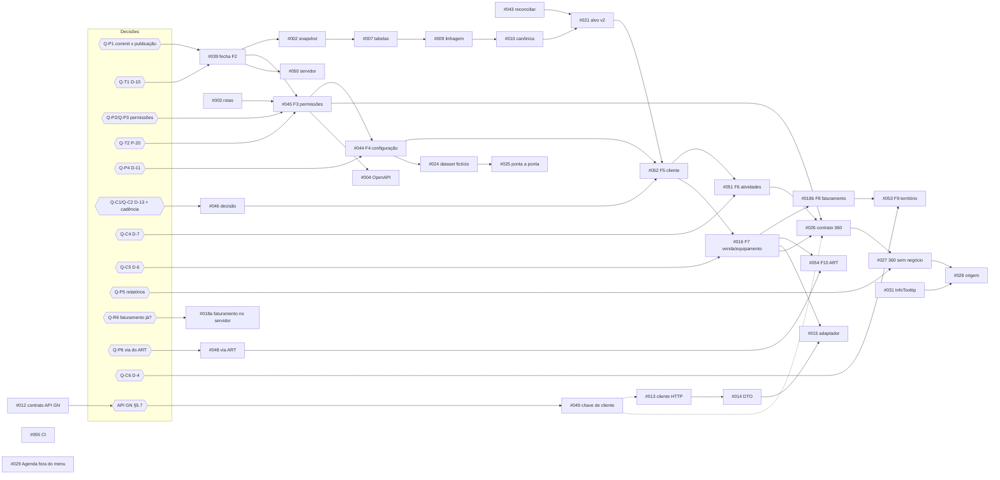

# 46A — Plano do backlog mestre da reestruturação do CRM

> **Versão 1.0 · 16/09/2026.** Resposta ao [documento 46](46-PROMPT-DE-PLANEJAMENTO-DO-BACKLOG-MESTRE.md),
> no formato da seção 14 dele. **Só planejamento:** nenhum código, migração, script, banco ou commit foi
> tocado para produzir este documento. As medições foram feitas por leitura do repositório
> (`git`, busca em arquivos, contagem); nenhum banco foi consultado.
>
> **Marcação de cada afirmação:** **[M]** medido agora no código ou em arquivo · **[D]** documentado e não
> conferido · **[I]** inferido. Número sem marcação vem do próprio documento 46.
>
> Nenhum segredo, nome de pessoa, CPF/CNPJ ou valor financeiro do ART aparece aqui.

## Sumário

1. [Entendimento](#1-entendimento)
2. [Contradições e desatualizações](#2-contradições-e-desatualizações)
3. [Perguntas bloqueantes](#3-perguntas-bloqueantes)
4. [Plano por milestone](#4-plano-por-milestone)
5. [Grafo de dependências e caminho crítico](#5-grafo-de-dependências-e-caminho-crítico)
6. [Riscos](#6-riscos)
7. [O que não fazer nesta etapa](#7-o-que-não-fazer-nesta-etapa)
8. [Autoverificação](#8-autoverificação)

---

## 1. Entendimento

1. O CRM Tracbel (.NET 9, EF Core, SQL Server, React) substitui o Vórtice por fases. O plano de
   reestruturação tem **10 fases** (doc 41).
2. **Fase 1 executada e commitada** (`cb05b7c`, sem push) [M]: 82 → 50 tabelas, Vórtice congelado.
3. **Fase 2 implementada, sem commit** [M]: trilha de auditoria automática com origem, 511 casos de
   teste verdes [D, doc 45]. Está parada por **um critério de desempenho reprovado** (~+5 ms em p50 por
   gravação auditada) e pela retenção D-10.
4. O **servidor continua com 82 tabelas** [D] e sem as fases 1 e 2. O ART está parado e desabilitado.
5. Os dados foram sanitizados em 15/09 [D]: configuração comercial, clientes e processos **não existem**
   no banco operacional, e **nenhuma rota consegue recriar a configuração** [M: só `Cliente` e
   `Equipamento` têm POST/PUT/DELETE].
6. Três achados desta leitura mudam prioridades:
   - **nenhuma permissão é conferida em lugar nenhum** [M];
   - **o faturamento do Protheus não tem credencial repassada ao servidor** pelo publicador [M];
   - **o faturamento ainda passa por código e por registro de sistema do Vórtice** [M].
7. A "API de vendas" é a **API Gestão de Negócios**: painéis analíticos, sem CPF/CNPJ nem código de
   cliente, quatro deles lendo o CRM legado [D, §5].
8. **Objetivo deste plano:** uma sequência única que respeite o fluxo Fonte → Integração → Normalização →
   Domínio → API → Interface. O caminho vai **fase 2 fechada → permissões (3) → configuração (4) →
   cliente (5) → atividades (6) ∥ venda/equipamento (7) → contrato e tela do 360**, sem abrir frente
   paralela às 10 fases.
9. O **caminho crítico não é técnico: são decisões.** D-13 (classe) bloqueia a fase 5, e sem a fase 5
   não há 360.

---

## 2. Contradições e desatualizações

Ordenadas por impacto no plano.

| # | O que se afirma | O que foi medido | Evidência | Efeito no plano |
|---|---|---|---|---|
| **C-1** | Doc 46 §4.1 e doc 41 fase 3: "a lista fixa **concede** `Cliente.*`, `Equipamento.*` e `Catalogo.Ler` a todos" | **Nenhum ponto da aplicação confere permissão.** O `Autorizador` do domínio só é usado em teste; `ContextoAcesso.Tem`/`ProfundidadeDe` não são chamados por caso de uso; 0 `RequireAuthorization` nas 39 rotas. A única barreira efetiva é a **fronteira de empresa** do filtro global. Qualquer usuário autenticado grava e inativa cliente e equipamento nas filiais que alcança | [M] `Dominio/Seguranca/Autorizador.cs:45` (sem chamador em `src/`); busca por `.Tem(`, `ProfundidadeDe(`, `Autorizador` em `Aplicacao/` = 0; `RequireAuthorization` na API = 0 | #045 sobe de "declarar permissão por rota" para **"passar a aplicar permissão"**. Risco de segurança **ALTO**, hoje mitigado só pela sanitização (banco vazio) e pelo servidor fora do ar para dado real |
| **C-2** | Doc 46 §4.1 omite; doc 44 diz que `Lead` saiu | A lista fixa **ainda concede `Lead.Ler`**, permissão de uma entidade que não existe mais | [M] `Infraestrutura/Identidade/EscopoDeAcesso.cs:45` | tarefa dentro da #045 (não merece issue própria) |
| **C-3** | Doc 46 §4.2: `TOTVS_API_*` chegam a `Protheus__*` "a confirmar" | **Não chegam.** O `publicar.ps1` repassa `ART_DB_*`/`ART_VIEW` (→ `Art__*`) e `TOTVS_DB_*` (conferência de dono no VV1), mas **nenhuma** chave do Protheus REST. A carga recusa rodar faturamento sem `Protheus__Base/Usuario/Senha` | [M] `scripts/deploy/publicar.ps1:270-307` (sem `TOTVS_API`/`Protheus__`); `Carga/Program.cs:331-348` | #018 ganha uma tarefa operacional: o faturamento **não roda no servidor hoje**, nem manualmente pelo publicador. Pergunta Q-R6 (seção 3) |
| **C-4** | Doc 46 §4.2: o acoplamento é `Program.cs:354/368` | Além disso, `--somente-faturamento` **recebe o leitor do Vórtice** e **garante o registro do sistema `VORTICE`** antes de gravar faturamento. Desde a fase 2, esses contextos declaram origem `Integracao/VORTICE` (não geram trilha, porque faturamento não está na política) | [M] `Carga/Program.cs:368-369`; `Carga/CargaDeProcessoDoVortice.Faturamento.cs:107-109` | #018 precisa trocar o sistema de referência para `PROTHEUS` e tirar o leitor do Vórtice do caminho |
| **C-5** | Doc 46 §3.4 e #002: "38 rotas (34 + 3 + 1)"; "reconciliar com as 39 do doc 41" | **39 rotas: 35 de negócio + 3 de autenticação + 1 de saúde.** A tabela do próprio doc 46 lista 35 de negócio; o erro é de soma. O doc 41 estava certo | [M] 39 chamadas `Map*` (`Program.cs:331`, `EndpointsDe*.cs`, `RotasDeAutenticacao.cs:90,112,120`). `/clientes/{chave}/maquinas-compradas` é mapeada em `EndpointsDeEquipamento.cs:54` | #003 parte de 39; a divergência está resolvida |
| **C-6** | Doc 46 §3.4 e doc 41 §3.4: testes que fixam contagem em `EsquemaENomenclaturaTestes.cs:112` e `MigracaoNoContainerTestes.cs:64` | Renomeados na fase 1: **`:114`** (`Os_oito_schemas_…_quarenta_e_nove_tabelas`) e **`:43`** (`A_cadeia_de_migracoes_cria_os_oito_schemas_…`) | [M] | ✅ **errata aplicada em 20/09/2026** (#44): doc 41 §3.4 com as linhas certas, reconferidas no código |
| **C-7** | Doc 40 §15/§17: fases **F0–F9** (F8 = faturamento **e** território; F9 = **reativar** o ART) | Doc 41 (mais recente) e doc 46 usam **1–10** (8 = faturamento; 9 = território; **10 = ART por adaptador, sem reativar**) | [M] `40-…md:1175-1204`; `41-…md:178-219` | ✅ **errata aplicada em 20/09/2026** (#44): o doc 40 §15 ganhou a tabela de correspondência e a §17 o aviso. O texto antigo ficou como estava, para não perder o histórico — e a errata deixa claro que **F8 virou duas fases** e que **F9 mudou de conteúdo**, não só de número. Todo o backlog usa a numeração do doc 41 |
| **C-8** | Doc 40 §13 (desenho da auditoria) | A implementação da fase 2 difere em quatro pontos. Implementado: trilha no `SaveChanges` (e não interceptador); `Inclusao` (e não `Criacao`); uma linha **por campo** na inclusão, **só quando a origem é pessoa**; política menor (Cliente, Equipamento, Endereço.MunicipioId, Município, VendaDeMaquina). O doc 40 lista também Contato, Carteira, Oportunidade, Tarefa, Usuário, Perfil e configuração | [M] `Infraestrutura/Persistencia/TrilhaDeAuditoria.cs`; `Dominio/Auditoria/PoliticaDeAuditoria.cs`; doc 45 §5 | a política **cresce por fase**: cada fase de domínio (3–7) acrescenta as entidades dela à política e ao teste de arquitetura. Tarefa em #045, #044, #052, #051, #016 |
| **C-9** | Doc 45 §6.1, opção A recomendada: "medir o p95 no servidor"; doc 46 R-3 e #039: commit da fase 2 depende da decisão | **Impasse:** medir no servidor exige levar código e migração da fase 2 até lá (R-3, #050), e o doc 46 condiciona o commit a essa medida | [I] leitura cruzada dos docs 45 e 46 | proposta na #039: **separar commit de publicação** (Q-P1) |
| **C-10** | Doc 46 §8 lista `open-questions.md` como fonte das perguntas | O arquivo é de **02/09**, fala em Algar, Azure, containers e VMs Linux. Está superado pelo doc 35 §12 (VM OpenStack, SQL nativo, sem Docker) | [M] `docs/projeto/open-questions.md:8-43` | ✅ **marcado em 20/09/2026** (#44): o arquivo abre com o aviso de que as perguntas de infraestrutura estão superadas, com a tabela do que os fatos responderam (doc 35 §12, #60, #84) e o ponteiro para onde vivem as perguntas de hoje — 46A §3 e #63. As linhas ficaram: apagá-las esconderia por que o doc 12 recomendou contêiner antes de o servidor ser conhecido |
| **C-11** | Doc 32 D-11 = "filial vem do cabeçalho sem conferência"; docs 40/41/46 D-11 = "semente estrutural" | **Colisão de identificador:** a #045 cita "D-11/P-20" ambiguamente | [M] `32-…md:269`; `40-…md:1224` | ✅ **resolvida em 20/09/2026** (#44): **P-20** é a filial por cabeçalho, **D-11** é só a semente. O doc 36 passou a citar P-20, e o doc 32 avisa na própria linha do defeito que, fora dele, a referência é P-20 — a numeração interna do doc 32 (D-1 a D-12) não foi mexida, porque renumerar quebraria oito referências para consertar uma ambiguidade de fora |
| **C-12** | Doc 46 §4.1: OpenAPI "sem garantia de uso" | 35 de 39 rotas têm `WithSummary` e `WithName`; **0 `Produces`**; 14 `WithTags` (por grupo) | [M] contagem em `src/Tracbel.Crm.Api` | #004 tem linha de base mensurável |
| **C-13** | Doc 46 §4.1: `X-Tracbel-*` em `Program.cs:277-283` | Em `Program.cs:284` | [M] | cosmético |
| **C-14** | Doc 46 §4: "o `.env` fica na raiz" | Há **dois**: raiz (as 19 chaves listadas no doc 46, conferidas) e `infra/.env` (chaves do banco local: `DB_*`, `TZ`, `ADMINER_PORTA`) | [M] só nomes | a #001 cobre os dois |
| **C-15** | Doc 46 §3.1: "não commitado = fase 2 + doc 45" | 24 entradas no `git status`, **incluindo o próprio doc 46** (e agora este 46A) | [M] | o commit da fase 2 não deve levar os docs 46/46A junto (commit separado `docs:`) |

**Conferido e coerente [M]:**
- 14 migrações;
- sem `.github/`;
- remoto `tracbel/Visao_360`;
- `vitest` e `@testing-library/react` instalados, sem script `test` e sem arquivo `*.test.*`;
- 27 usos de `title=` no frontend;
- `SeloFonte.tsx` existe e não há componente de tooltip;
- Agenda em `Layout.tsx:59` e `rotas.tsx:61`;
- `PainelExecutivo` em `Visao360.tsx:97`;
- `Cliente360Api.tsx` faz 5 leituras (cliente, frota, oportunidades, agenda, interações);
- flag de legado em `Carga/Program.cs:110`;
- `AddOpenApi`/`MapOpenApi` em `Program.cs:60/275`;
- XML de documentação em `Directory.Build.props:34`;
- 345 métodos de teste em 5 projetos;
- `API_TOKEN` e `GestaoDeNegocios` sem nenhum uso em `src/`, `scripts/` e `tests/`.

---

## 3. Perguntas bloqueantes

Cada pergunta diz o que ela destrava. **Negrito** = bloqueia o caminho crítico (seção 5).

### 3.1 Comercial

| # | Pergunta | Desbloqueia |
|---|---|---|
| **Q-C1** | **D-13:** a classe é do cliente (A), da carteira/linha (B) ou calculada por contexto (C)? Qual a janela de apuração? (doc 42) | **fase 5 (#052) → 360** |
| **Q-C2** | **Cadência** das 10 linhas sem valor (35 de 142 carteiras [D]): quem declara e qual valor? | **fase 5** |
| Q-C3 | D-5: um contato pertence a um cliente só, com telefone e e-mail em colunas? | fase 5 |
| Q-C4 | D-7: `VendaPerdida` como único registro de perda, obrigatório ao perder? | fase 6 (#051) |
| Q-C5 | D-6: "gestão na origem", "venda direta" e "repasse direto" viram conceito do CRM ou ficam só no rastro? | fase 7 (#016) |
| Q-C6 | D-4: devolução do CSV do doc 43 com `CenConfirmado` | só fase 9b (#053) |

### 3.2 Responsável pelo projeto

| # | Pergunta | Desbloqueia |
|---|---|---|
| **Q-P1** | **Fase 2:** aceita separar **commit** de **publicação**? Proposta: commitar a fase 2 (é reversível por `git revert` + `Down` ensaiado) e medir o p95 no servidor dentro da #050, com a decisão A–D registrada **antes da publicação**, não antes do commit | **#039 → todo o resto** |
| **Q-P2** | **Permissões (C-1):** a fase 3 passa a **aplicar** permissão por caso de uso e por rota. O perfil padrão reproduz exatamente o acesso de hoje (grava e inativa cliente e equipamento). Confirma esse ponto de partida? | **fase 3 (#045)** |
| **Q-P3** | D-3: catálogo de permissões em código (recomendado) ou tabela semeada? · D-8: "próprios" inclui a carteira vigente do CEN? · D-9: aprovar a matriz `41B` | **fase 3** |
| Q-P4 | D-11: semente só estrutural + "modelo inicial" comercial por ação do administrador? | fase 4 (#044) |
| Q-P5 | #027: o que acontece com `PainelExecutivo` e com o menu "Relatórios" (Funil, Performance, Cobertura por Filial, Indicadores Geográficos): esconder, manter ou mover para perfil de gestão? | #027 |
| Q-P6 | #048: as vendas do ART vêm por leitura direta (adaptador da fase 10) **ou** pelo painel `art` da API GN? | #054, #013 |
| Q-P7 | Estoque e pedido (painéis TOTVS da API GN) entram no 360 ou na ficha do equipamento? Se não, o épico 4 encolhe para `filiais` | #012–#015 |
| Q-P8 | A #055 (CI mínimo no GitHub) é autorizada? Exige push e ação no remoto | #055 |
| Q-P9 | O OpenAPI fica exposto fora de Desenvolvimento? (recomendado: não, ou só autenticado) | #004 |

### 3.3 TI, jurídico e diretoria

| # | Pergunta | Desbloqueia |
|---|---|---|
| Q-T1 | D-10: retenção da auditoria (hoje 18 meses declarados) | fecho da fase 2 (#039) |
| Q-T2 | **P-20:** quais filiais cada pessoa pode escolher? Hoje é qualquer filial ativa pelo cabeçalho [D, doc 32] | **fase 3 (#045)**, junto com C-1 |
| Q-T3 | Trilha de acesso a dado pessoal (evento de acesso, LGPD) entra em qual fase? | fora das fases hoje |
| Q-T4 | A CA do certificado TLS interno da API GN pode ser instalada no serviço do CRM? | #013 |

### 3.4 Operação do servidor

| # | Pergunta | Desbloqueia |
|---|---|---|
| **Q-R6** | O faturamento do Protheus precisa voltar a rodar **antes** da fase 8? Se sim, como as credenciais REST chegam ao servidor (C-3) e quem autoriza o primeiro ciclo? | #018a, 360 com faturamento |
| Q-R7 | Existe BI ou planilha lendo o `TracbelCrm` do servidor? (risco R3 do doc 41, nunca conferido [D]) | #050 |

### 3.5 Inteligência de Mercado (dona da API Gestão de Negócios)

Doc 46 §5.7, sem mudança:
1. chave por consumidor;
2. **CPF/CNPJ ou código + loja do Protheus nos painéis** (**destrava a #049**);
3. confirmar se o "CRM" dos painéis é o Vórtice;
4. versionamento e SLA;
5. leitura incremental ou id estável;
6. campos do painel `estoque`;
7. distribuição da CA.

---

## 4. Plano por milestone

### 4.1 Ajustes de prioridade e escopo propostos pelo tech lead

| Issue | Doc 46 | Proposto | Motivo |
|---|---|---|---|
| #045 permissões | P0 · declarar permissão | **P0 · aplicar permissão** + P-20 + `Lead.Ler` | C-1, C-2: hoje nenhuma permissão é conferida |
| #004 OpenAPI | P0 | **P1** | documentar autorização antes de ela existir (#045) gera retrabalho; os resumos já estão em 35 de 39 rotas (C-12) |
| #008 colunas | P0 · 668 colunas | **P1 · por fase** | as fases 3–9 removem ou renomeiam boa parte das colunas; classificar tudo agora envelhece. Classificar as tabelas da **próxima** fase antes de cada fase (tarefa do ritual) |
| #018 faturamento | P0 · fase 8 | **dividida:** #018a **P0 operacional** (credenciais e ciclo no servidor, se Q-R6 = sim) · #018b **P0 fase 8** (extração do Vórtice) | C-3, C-4 |
| #012 contrato API GN | P0 | **P0 enxuto** | o texto já está no doc 46 §5; o valor é **abrir as perguntas** à Inteligência de Mercado cedo, porque têm prazo de terceiros |
| #029 esconder Agenda | P1 | P1 (ganho rápido) | não depende de dado; entrega autorizada à parte |
| **#055 CI mínimo** | — | **P1 nova** | não há CI [M]; 511 casos só rodam na estação. Build, teste (sem contêiner) e lint por pull request, **sem publicar** |

**Contagem do backlog:** 55 issues (54 do doc 46 + #055), com a #018 dividida em duas entregas.
- P0: #001, #002, #003, #007, #009, #010, #012, #018a, #018b, #021, #039, #043, #044, #045, #046, #049, #052.
- P1: #004, #005, #008, #011, #013, #014, #015, #016, #017, #020, #022, #024, #025, #026, #027, #028, #029, #031, #035, #047, #048, #050, #051, #055.
- P2 e P3: seção 4.12.

**Definition of Done padrão (vale para todas, doc 46 §13):**
- `dotnet build` com 0 erro e 0 aviso novo; `dotnet test` verde;
- `npm run build` e `npm run lint` verdes;
- inventário do banco com a contagem prevista;
- 12 telas sem erro;
- `Down` ensaiado em up → down → up, se houver migração;
- documentação atualizada;
- sem segredo, nome de pessoa ou valor do ART;
- diff revisado por outra passada;
- autorização registrada.

Abaixo, "DoD padrão" remete a isso.

---

### 4.2 M0 — Foundation

#### #039 — Fechar a fase 2 de auditoria · P0 · `phase-2` `decision`

- **Objetivo:** a fase 2 sai do estado "implementada sem commit" com as três pendências resolvidas: desempenho, retenção e commit.
- **Contexto medido:**
  - [M] trilha gravada em `CrmDbContext.SaveChangesAsync(bool, …)` por `TrilhaDeAuditoria.cs`, na mesma transação;
  - [M] 5 origens (`OrigemDaOperacao.cs`); política em `PoliticaDeAuditoria.cs`;
  - [D, doc 45 §6.1] p95 do POST de cliente +30–70%, ~+5 ms em p50, no Docker Desktop;
  - [M] concorrência: `UnidadeDeTrabalho.cs:29` converte `DbUpdateConcurrencyException` em resultado de negócio. A retentativa do SQL Server só repete erro transitório, então a colisão não é repetida e a transação da trilha é desfeita junto [I].
- **Fase:** 2.
- **Escopo:** decisão A–D registrada no doc 45; D-10 aplicada à migração (`MS_Description` da partição) e ao doc 14; commit da fase 2 **sem** os docs 46/46A.
- **Fora de escopo:** publicar no servidor (#050); evento de acesso (Q-T3); ampliar a política (cada fase amplia a sua, C-8).
- **Tarefas:**
  1. levar Q-P1 e Q-T1 ao responsável;
  2. se Q-P1 = sim, commit `feat(db): trilha de auditoria automática com origem da operação`;
  3. **teste de concorrência com trilha:** duas gravações do mesmo `Cliente` auditado; a segunda recebe `Concorrencia` e **nenhuma** linha de trilha dela fica gravada. Verificar antes se `A_concorrencia_otimista_recusa_a_segunda_gravacao_em_cima_da_primeira` já passa por entidade auditada [I];
  4. registrar a medida do servidor como pré-condição da #050.
- **Aceite:** decisão A–D e D-10 no doc 45 §7; teste de concorrência com trilha verde; commit autorizado e feito; `git status` sem arquivos da fase 2.
- **Dependências:** Q-P1, Q-T1.
- **Autorização:** commit.
- **Riscos:** MÉDIO. A regressão de latência vai para produção sem medida → mitigação: medida obrigatória antes da #050.
- **Rollback:** `git revert` + `dotnet ef database update SimplificacaoEstruturalFase1` (`Down` ensaiado [D, doc 45 §4.1]).
- **Dados pessoais e segredos:** a trilha guarda valores de campos de cliente (nome, documento) → leitura dela exigirá `Auditoria.Ler` na fase 3.
- **Testes:** o de concorrência (novo) + suíte inteira.
- **Documentação:** 45, 14.
- **DoD:** padrão.

#### #043 — Reconciliar este backlog com as 10 fases · P0 · `architecture`

- **Objetivo:** uma sequência única; toda issue ligada a uma fase do doc 41 ou marcada "fora das fases".
- **Contexto medido:** este documento, seção 5.2 (mapa issue × fase); contradições C-5, C-6, C-7, C-10, C-11.
- **Fase:** transversal.
- **Escopo:**
  - aprovar a tabela da seção 5.2;
  - errata no doc 41 (C-6);
  - errata de numeração no doc 40 (C-7);
  - marcar `open-questions.md` como superado nas seções de infraestrutura (C-10);
  - renomear a referência "D-11" da filial para P-20 (C-11).
- **Fora de escopo:** reabrir o modelo alvo (#021).
- **Tarefas:** revisar este 46A com o responsável; aplicar as erratas; registrar a sequência aprovada no doc 41 §4.
- **Aceite:** nenhuma issue sem fase ou sem "fora das fases"; erratas C-6, C-7, C-10 e C-11 aplicadas.
- **Dependências:** nenhuma.
- **Autorização:** commit de documentação.
- **Riscos:** BAIXO.
- **Rollback:** revert do documento.
- **Dados pessoais e segredos:** nenhum.
- **Testes:** não se aplica.
- **Documentação:** 40, 41, 46A, `open-questions.md`.
- **DoD:** revisão por outra passada.

#### #001 — Proteger credenciais e preparar a chave da API GN · P0 · `security`

- **Objetivo:** nenhuma credencial em código, documento, log, URL ou Git; chave da API GN com nome próprio.
- **Contexto medido:**
  - [M] `API_TOKEN` na raiz sem nenhum uso no código;
  - [M] dois arquivos `.env`, raiz e `infra/` (C-14);
  - [M] `Sigilo.Mascarar` existe na integração do ART (`Carga/Sincronizacao/ExecutorDaSincronizacaoDoArt.cs:230`);
  - [D] a chave não aparece no histórico (doc 46 #001).
- **Fase:** fora das fases.
- **Escopo:**
  - varredura **por padrão** em arquivos rastreados e histórico (`Password=`, `Pwd=`, `secret`, `token`, blocos de chave privada), excluindo variáveis e testes de mascaramento;
  - nome da chave (`GESTAO_NEGOCIOS_API_URL`/`_TOKEN` → seção `GestaoDeNegocios`);
  - `infra/.env.exemplo` com os nomes;
  - conferir que `publicacao/` e `*.bak` seguem ignorados;
  - pedido formal de rotação à Inteligência de Mercado.
- **Fora de escopo:** rotacionar sem combinar; usar a chave.
- **Tarefas:** comando de varredura reproduzível em `scripts/seguranca/` (P2, se autorizado); relatório; pedido de rotação.
- **Aceite:**
  - relatório com 0 segredo por padrão (achados justificados: referências de variável e fixtures de teste de mascaramento, como os vistos no commit `cb05b7c`);
  - nomes no `.env.exemplo`;
  - pedido registrado;
  - teste que prova que a mensagem de erro das integrações passa por `Sigilo.Mascarar`.
- **Dependências:** nenhuma.
- **Autorização:** pedido a terceiros; mudança no servidor, se houver.
- **Riscos:** BAIXO.
- **Rollback:** não se aplica.
- **Dados pessoais e segredos:** só nomes de variáveis.
- **Testes:** mascaramento (existe para ART; estender a Protheus e API GN).
- **Documentação:** 05, `infra/.env.exemplo`.
- **DoD:** padrão.

#### #002 — Snapshot técnico depois da fase 2 · P0 · `architecture`

- **Objetivo:** fotografia reproduzível do estado depois da fase 2, com os scripts existentes.
- **Contexto medido:**
  - [M] 14 migrações; 39 rotas (C-5); 345 métodos / 511 casos de teste [M/D];
  - 41A é o snapshot de antes (`81b1221`);
  - [D] as contagens estão nos docs 44 §3 e 45 §3.
- **Fase:** 2 (fecho).
- **Escopo:** `gerar-inventario-do-banco.ps1` no banco local e no ensaio; lista e hash de migrações; `DbSet`s; rotas; testes por projeto; serviços de integração.
- **Fora de escopo:** novo script; servidor (#050).
- **Tarefas:** rodar os scripts (exige leitura do banco local, autorizada à parte, porque este plano não conecta em banco); escrever o 41C.
- **Aceite:** 41C com o comando de cada número; 50 tabelas / 668 colunas / 233 índices / 113 CHECK / 123 FKs conferidos ou divergência explicada.
- **Dependências:** #039 (o snapshot é do estado commitado).
- **Autorização:** leitura do banco local.
- **Riscos:** BAIXO.
- **Rollback:** não se aplica.
- **Dados pessoais e segredos:** o inventário só lê catálogo do SQL Server.
- **Testes:** não se aplica.
- **Documentação:** 41C, 39A (#007).
- **DoD:** reprodutível por outra pessoa.

---

### 4.3 M1 — API Discovery

#### #003 — Inventário das 39 rotas · P0 · `api`

- **Objetivo:** matriz rota × caso de uso × permissão × dado × tela × fase.
- **Contexto medido:** [M] lista completa na §2 C-5; 0 rotas com autorização (C-1); 35/39 com resumo (C-12); consumidores no front em `dados/api/{catalogos,clientes,consolidado,equipamentos,relacionamento,sincronizacoes,territorio}.ts`.
- **Fase:** entrada da 3.
- **Escopo:** colunas Método · Rota · Arquivo:linha · Caso de uso · Permissão **exigida hoje** (hoje: nenhuma) · Permissão **proposta** · Tabelas · Grava? · Teste · Tela · Fase que altera.
- **Fora de escopo:** alterar rota.
- **Tarefas:** para cada `Map*`, seguir até o caso de uso e o repositório; cruzar com `dados/api/*.ts`; comparar com o doc 23.
- **Aceite:** 39 de 39 linhas; divergências com o doc 23 listadas; coluna "permissão proposta" revisada por quem decide a #045.
- **Dependências:** nenhuma.
- **Autorização:** nenhuma (leitura).
- **Riscos:** BAIXO.
- **Rollback:** não se aplica.
- **Dados pessoais e segredos:** nenhum.
- **Testes:** proposta de teste de arquitetura "toda rota declara permissão" (entra na #045).
- **Documentação:** 23.
- **DoD:** revisão por outra passada.

#### #004 — Padronizar o OpenAPI · P1 · `swagger` `api`

- **Objetivo:** contrato completo e verificado por teste.
- **Contexto medido:** [M] `AddOpenApi` (`Program.cs:60`), `MapOpenApi` só em Desenvolvimento (`:275`); 35/39 `WithSummary`; 0 `Produces`; XML ligado (`Directory.Build.props:34`).
- **Fase:** depois da 3.
- **Escopo:** tags, summary/description, `Produces<T>` e códigos de erro (`RespostaDeErro`/ProblemDetails), esquema de segurança (Entra ID; cabeçalhos provisórios só em Desenvolvimento), exemplos fictícios; decisão Q-P9.
- **Fora de escopo:** interface visual (Swagger UI/Scalar) sem decisão.
- **Tarefas:** completar os metadados; teste de arquitetura sobre os `EndpointDataSource`.
- **Aceite:** o teste falha se uma rota não tiver tag, summary, tipo de resposta e **permissão declarada**; 39/39 passando.
- **Dependências:** #003, #045, Q-P9.
- **Autorização:** entrega.
- **Riscos:** BAIXO. Expor o contrato fora de Desenvolvimento → só com Q-P9.
- **Rollback:** revert.
- **Dados pessoais e segredos:** exemplos sem CPF/CNPJ real (teste da #034).
- **Testes:** o de arquitetura.
- **Documentação:** 23.
- **DoD:** padrão.

#### #005 — Catálogo técnico das APIs · P1 · `api`

- **Objetivo:** Tela → Rota → Caso de uso → Entidade → Tabela, **gerado**, não escrito à mão.
- **Contexto medido:** [D] o doc 23 existe e está desatualizado em pontos (C-5).
- **Fase:** depois da 3.
- **Escopo:** atualizar o doc 23 a partir do OpenAPI (#004) e da matriz (#003). Não criar `docs/api/` paralelo.
- **Fora de escopo:** novo formato de documentação.
- **Tarefas:** seção "catálogo" no doc 23 gerada a partir do `openapi.json`.
- **Aceite:** toda rota do OpenAPI tem linha no catálogo; nenhuma linha sem rota.
- **Dependências:** #003, #004.
- **Autorização:** entrega.
- **Riscos:** BAIXO.
- **Rollback:** revert.
- **Dados pessoais e segredos:** nenhum.
- **Testes:** conferência automática rota × catálogo (P2).
- **Documentação:** 23.
- **DoD:** padrão.

---

### 4.4 M2 — Data Discovery

#### #007 — Inventário das 50 tabelas · P0 · `database`

- **Objetivo:** o 39A regenerado para o estado real, com uso por tabela.
- **Contexto medido:** [M] `scripts/banco/auditoria/gerar-inventario-do-banco.ps1` existe (só `SELECT` no catálogo); [D] 39A está em 82 tabelas.
- **Fase:** entrada da 3.
- **Escopo:** regenerar 39A e 39B; completar responsabilidade, linhas, PK, FKs, índices, CHECK, entidade, `DbSet`, repositórios, rotas, telas, integrações e destino no 40B.
- **Fora de escopo:** novo script.
- **Tarefas:** rodar o gerador no local e no ensaio; cruzar com #003; marcar o destino do 40B.
- **Aceite:** 50/50 linhas completas; contagens iguais às do #002; toda tabela com destino do 40B ou "novo desde o 40B".
- **Dependências:** #002.
- **Autorização:** leitura do banco local.
- **Riscos:** BAIXO.
- **Rollback:** não se aplica.
- **Dados pessoais e segredos:** só catálogo.
- **Testes:** não se aplica.
- **Documentação:** 39A, 39B, 40B.
- **DoD:** reprodutível.

#### #008 — Inventário de colunas, por fase · P1 · `database` `data-quality`

- **Objetivo:** classificar as colunas **das tabelas da próxima fase** antes de cada fase (DOMÍNIO / INTEGRAÇÃO / DERIVADO / TÉCNICO / LEGADO / DUPLICADO / INVESTIGAR).
- **Contexto medido:** [D] 668 colunas; o 40B e o doc 40 §10.3 já marcam as que saem.
- **Fase:** entrada de cada fase, da 3 à 9.
- **Escopo:** fase 3 → `seguranca.*`; fase 4 → configuração comercial; fase 5 → `Cliente`, `Contato`, `Endereco`, `Carteira`, `ClienteCarteira`, `Municipio`; e assim por diante.
- **Fora de escopo:** as 668 de uma vez.
- **Tarefas:** extrair colunas pelo gerador; classificar; conferir com o 40B.
- **Aceite:** 100% das colunas da fase seguinte classificadas antes da autorização da fase.
- **Dependências:** #007.
- **Autorização:** leitura.
- **Riscos:** BAIXO.
- **Rollback:** não se aplica.
- **Dados pessoais e segredos:** marcar colunas com dado pessoal (insumo LGPD, Q-T3).
- **Testes:** não se aplica.
- **Documentação:** 39A.
- **DoD:** revisão.

---

### 4.5 M3 — Canonical Data

#### #009 — Matriz Fonte → Campo → Consumidor · P0 · `data-quality`

- **Objetivo:** toda informação exibida nas telas atuais tem linhagem até a origem.
- **Contexto medido:** [D] docs 29, 36 e 40 §6.1; [M] 5 leituras do 360 (`Cliente360Api.tsx:47-70`); `SeloFonte.tsx` já mostra sistema e data.
- **Fase:** fora das fases (alimenta 5–8).
- **Escopo:** por campo exibido: sistema (tabela/campo) → transformação (classe:linha) → tabela.coluna → rota → tela. Inclui os campos da API GN **só** se Q-P6/Q-P7 decidirem consumir.
- **Fora de escopo:** telas de visão de negócio (princípio 11), a menos que Q-P5 as mantenha.
- **Tarefas:** partir das 12 telas do roteiro; seguir cada número até a origem (doc 36 já tem os cartões).
- **Aceite:** 100% dos campos das telas de Clientes, Equipamentos, 360 (bloco do cliente) e Configurações com linha completa.
- **Dependências:** #003, #007.
- **Autorização:** leitura.
- **Riscos:** BAIXO.
- **Rollback:** não se aplica.
- **Dados pessoais e segredos:** marcar campos pessoais.
- **Testes:** não se aplica.
- **Documentação:** 29, 36.
- **DoD:** revisão.

#### #010 — Fonte canônica registrada · P0 · `architecture` `decision`

- **Objetivo:** a tabela do doc 46 §6 vira registro de decisão: DECIDIDA / PROPOSTA / PENDENTE, com dono e fase.
- **Contexto medido:** [D] doc 40 §6.1 e doc 46 §6. A "venda pela API de vendas" não se sustenta (sem chave de cliente, doc 46 §5.4).
- **Fase:** alimenta 3–9.
- **Escopo:** registrar no doc 40 §6 (versão nova, #021) e ligar cada PENDENTE a uma pergunta da seção 3.
- **Fora de escopo:** decidir pelo negócio.
- **Tarefas:** revisar linha a linha; ligar a Q-*.
- **Aceite:** nenhuma informação com duas fontes sem decisão ou pergunta aberta com dono.
- **Dependências:** #009.
- **Autorização:** commit de documentação.
- **Riscos:** BAIXO.
- **Rollback:** revert.
- **Dados pessoais e segredos:** nenhum.
- **Testes:** não se aplica.
- **Documentação:** 40.
- **DoD:** revisão.

#### #011 — Fontes concorrentes medidas · P1 · `data-quality`

- **Objetivo:** cada concorrência da #010 com número e fonte.
- **Contexto medido:** [D] classes concordam em 14,2% dos vínculos (doc 42); 85,8% mudariam de letra; 2 planilhas discordam em 82 municípios (doc 43).
- **Fase:** entrada da 5 e da 9.
- **Escopo:**
  - medir no **banco de arquivo** (somente leitura, exige autorização de leitura): classe × classe, cadência × cadência, dono × comprador, município texto × FK;
  - ART direto × painel `art`, só se Q-P6 for decidir por comparação.
- **Fora de escopo:** corrigir dado.
- **Tarefas:** consultas só-leitura versionadas em `scripts/banco/conferencias/` (entrega autorizada).
- **Aceite:** cada concorrência com contagem, consulta e data.
- **Dependências:** #010.
- **Autorização:** leitura do banco de arquivo.
- **Riscos:** BAIXO.
- **Rollback:** não se aplica.
- **Dados pessoais e segredos:** resultado só em contagens, sem nomes.
- **Testes:** não se aplica.
- **Documentação:** 42, 43.
- **DoD:** reprodutível.

#### #020 — Redundâncias restantes · P1 · `architecture`

- **Objetivo:** confirmar o que do doc 40 §9 ainda existe depois da fase 1 e achar o que ele não cobriu.
- **Contexto medido:** [M] continuam as duas `Classe`, as gêmeas de faturamento, `VinculoDeClienteComEquipamento`, `ChaveExterna`, `PontoDeSincronismo` e `MensagemDescartada` (todas fora da fase 1); `Lead.Ler` residual (C-2).
- **Fase:** entrada das 5–9.
- **Escopo:** varrer o modelo por texto + FK do mesmo conceito, status duplicado, ids externos espalhados e permissões órfãs.
- **Fora de escopo:** remover.
- **Tarefas:** comparar `CrmDbContext` e configurações com o 40B.
- **Aceite:** lista com destino em fase ou "nova descoberta" para a #021.
- **Dependências:** #007.
- **Autorização:** leitura.
- **Riscos:** BAIXO.
- **Rollback:** não se aplica.
- **Dados pessoais e segredos:** nenhum.
- **Testes:** não se aplica.
- **Documentação:** 40B.
- **DoD:** revisão.

#### #021 — Modelo alvo revisado · P0 · `architecture`

- **Objetivo:** 40/40A/40B em versão nova, refletindo o que mudou. **Não é um modelo novo.**
- **Contexto medido:**
  - [M] numeração de fases divergente (C-7);
  - desenho de auditoria divergente da implementação (C-8);
  - [D] D-1 aprovou o modelo como direção.
- **Fase:** entrada da 3.
- **Escopo:**
  - errata C-7 e C-8;
  - fases 1 e 2 marcadas como executadas;
  - decisão de onde entra a API GN (se Q-P7 = sim: nenhuma tabela nova sem comportamento — princípio 1);
  - política de auditoria por fase;
  - agrupamento Core / Configuração / Integração / Organização a partir do 40A.
- **Fora de escopo:** novas tabelas sem decisão.
- **Tarefas:** revisar as seções 6, 7, 9, 13 e 17 do doc 40; atualizar a contagem de partida do 40A (50 tabelas).
- **Aceite:** versão 2.0 com "o que mudou" explícito; nenhuma referência a F0–F9; alvo continua 42 tabelas ou a diferença é justificada.
- **Dependências:** #010, #020, #043.
- **Autorização:** commit de documentação.
- **Riscos:** MÉDIO. Reabrir o modelo por acidente → mitigação: toda mudança de alvo passa por decisão registrada.
- **Rollback:** revert.
- **Dados pessoais e segredos:** nenhum.
- **Testes:** não se aplica.
- **Documentação:** 40, 40A, 40B.
- **DoD:** revisão.

#### #046 — Decisão D-13: classe e cadência · P0 · `blocked-business` `decision`

- **Objetivo:** resposta do comercial registrada. **É o gargalo do caminho crítico.**
- **Contexto medido:** [D] doc 42 com cenários A/B/C; 14,2% de concordância; 35 de 142 carteiras sem cadência.
- **Fase:** bloqueia a 5.
- **Escopo:** apresentar o doc 42; registrar o cenário, a janela de apuração e a cadência das linhas sem valor.
- **Fora de escopo:** implementar.
- **Tarefas:** agendar com o comercial; resposta por escrito; atualizar o doc 42.
- **Aceite:** cenário escolhido, janela em meses e cadência das 10 linhas registrados com data e dono.
- **Dependências:** Q-C1, Q-C2.
- **Autorização:** do comercial.
- **Riscos:** ALTO para o prazo. Atraso trava 5 → 6/7 → 360 → mitigação: seção 5.3 (o que pode andar sem ela).
- **Rollback:** não se aplica.
- **Dados pessoais e segredos:** exemplos só com contagens.
- **Testes:** não se aplica.
- **Documentação:** 42.
- **DoD:** decisão escrita.

#### #047 — Decisão D-4: quem atende cada município · P1 · `blocked-business`

- **Objetivo:** CSV do doc 43 devolvido com `CenConfirmado`.
- **Contexto medido:** [D] 82 municípios com nomes diferentes + 46 com grafia parecida (doc 43).
- **Fase:** bloqueia só a 9b.
- **Escopo:** devolução e conferência do arquivo, fora do Git.
- **Fora de escopo:** resolver automaticamente (proibido pela D-4 regra).
- **Tarefas:** enviar; receber; conferir colunas.
- **Aceite:** 100% das linhas com decisão ou "a contratar".
- **Dependências:** Q-C6.
- **Autorização:** do comercial.
- **Riscos:** BAIXO para o caminho crítico.
- **Rollback:** não se aplica.
- **Dados pessoais e segredos:** nomes de pessoas → arquivo **só** em `dados-locais/`.
- **Testes:** não se aplica.
- **Documentação:** 43.
- **DoD:** arquivo recebido e conferido.

---

### 4.6 M4 — Integrations

#### #012 — Contrato da API Gestão de Negócios e perguntas · P0 · `integration` `blocked-access`

- **Objetivo:** abrir cedo as perguntas à Inteligência de Mercado e registrar o contrato no repositório.
- **Contexto medido:** [D] doc 46 §5 inteiro; [M] nenhum código usa a API.
- **Fase:** fora das fases (alimenta 7 e 10).
- **Escopo:** `docs/projeto/47-API-GESTAO-DE-NEGOCIOS.md` a partir do doc 46 §5, mais o registro das 7 perguntas com data de envio.
- **Fora de escopo:** chamar a API.
- **Tarefas:** extrair o §5 para o doc 47; enviar as perguntas; registrar as respostas.
- **Aceite:** doc 47 publicado; 7 perguntas enviadas com data; resposta ou "pendente com dono" em cada uma.
- **Dependências:** nenhuma.
- **Autorização:** contato com terceiros.
- **Riscos:** BAIXO.
- **Rollback:** não se aplica.
- **Dados pessoais e segredos:** sem chave; sem exemplo real; sem valor do ART.
- **Testes:** não se aplica.
- **Documentação:** 47.
- **DoD:** revisão.

#### #048 — Via única para as vendas do ART · P1 · `decision` `integration`

- **Objetivo:** escolher leitura direta **ou** painel `art`.
- **Contexto medido:**
  - [M] leitura direta implementada (`Integracao/Art/*`);
  - serviço desabilitado [D];
  - [D] o painel `art` tem 21 campos, sem documento do comprador e com regras do Qlik;
  - [D] P-31..P-40.
- **Fase:** entrada da 10.
- **Escopo:** quadro comparativo (campos, documento do comprador, frescor, acoplamento, dono, pendências P-31..P-40) e decisão.
- **Fora de escopo:** implementar a via escolhida.
- **Tarefas:** comparar campo a campo com o `LeitorDoArt`; medir cobertura só por contagem.
- **Aceite:** decisão registrada; a outra via marcada "não usada" no doc 35.
- **Dependências:** #012, #017, Q-P6.
- **Autorização:** do responsável.
- **Riscos:** MÉDIO. Escolher o painel sem chave de cliente → mitigação: a #049 vem antes.
- **Rollback:** não se aplica.
- **Dados pessoais e segredos:** só contagens.
- **Testes:** não se aplica.
- **Documentação:** 35.
- **DoD:** decisão escrita.

#### #049 — Chave de cliente para dado sem CPF/CNPJ · P0 · `decision` `blocked-access`

- **Objetivo:** como ligar ao `Cliente` um dado que chega sem documento, **sem** casar por nome (R-10).
- **Contexto medido:** [D] nenhum painel traz CPF/CNPJ nem `A1_COD`/`A1_LOJA`; [M] o faturamento do Protheus já resolve documento por `SA1` (`LeitorDeFaturamentoDoProtheus`).
- **Fase:** entrada da 7 (se a API GN for usada).
- **Escopo:**
  - opção (a): pedir documento ou código Protheus na API (pergunta 2);
  - opção (b): casar por chassi e NF com `SD2`+`SA1`;
  - opção (c): usar só no contexto do equipamento.
- **Fora de escopo:** semelhança de nome.
- **Tarefas:** avaliar (b) por contagem de NF casáveis (leitura autorizada); aguardar (a).
- **Aceite:** opção escolhida, testável e documentada; nenhum caminho por nome.
- **Dependências:** #012.
- **Autorização:** do responsável; leitura Protheus (só `SELECT`).
- **Riscos:** ALTO. Ligar a cliente errado → mitigação: divergência vai para `DivergenciaDeIntegracao`, nunca sobrescreve.
- **Rollback:** não se aplica.
- **Dados pessoais e segredos:** documentos só em memória e em `dados-locais/`.
- **Testes:** casos de chassi/NF ausente e duplicado.
- **Documentação:** 47, 29.
- **DoD:** decisão escrita.

#### #013 — Cliente HTTP da API GN · P1 · `integration` · **condicional**

- **Objetivo:** cliente no padrão da `PonteDoProtheus`, **só** se algum painel for marcado CONSUMIR com consumidor definido.
- **Contexto medido:** [M] `PonteDoProtheus` usa `IHttpClientFactory`; [D] restrições no doc 46 §5.6.
- **Fase:** 7 ou 10, conforme o painel.
- **Escopo:** `Tracbel.Crm.Integracao/GestaoDeNegocios/ClienteDaGestaoDeNegocios`: Bearer, TLS com validação, timeout, retentativa, cancelamento, paginação até 5000, log sem chave.
- **Fora de escopo:** gravar no domínio (#015).
- **Tarefas:** opções `GestaoDeNegocios__*`; repasse no `publicar.ps1`; testes da #040.
- **Aceite:** testes da #040 verdes; nenhuma chave em log (teste).
- **Dependências:** #001, #012, #048, #049, Q-T4.
- **Autorização:** entrega; servidor.
- **Riscos:** MÉDIO. TLS interno → mitigação: instalar a CA (Q-T4), nunca desligar a validação.
- **Rollback:** revert; serviço desligado por padrão.
- **Dados pessoais e segredos:** chave só em configuração.
- **Testes:** #040.
- **Documentação:** 47, 35.
- **DoD:** padrão.

#### #014 — DTOs externos isolados · P1 · `integration` · **condicional**

- **Objetivo:** um DTO por painel consumido, tolerante a tipos inconsistentes; nunca entidade EF.
- **Contexto medido:** [D] `processo`, `dna` e `seq_pessoa` mudam de tipo entre painéis.
- **Fase:** junto da #013.
- **Escopo:** DTOs dos painéis marcados CONSUMIR.
- **Fora de escopo:** painéis do CRM legado (R-7).
- **Tarefas:** conversores tolerantes a número/texto.
- **Aceite:** teste com JSON de tipos trocados passa.
- **Dependências:** #013.
- **Autorização:** entrega.
- **Riscos:** BAIXO.
- **Rollback:** revert.
- **Dados pessoais e segredos:** nenhum.
- **Testes:** desserialização.
- **Documentação:** 47.
- **DoD:** padrão.

#### #015 — Adaptador anticorrupção da API GN · P1 · `integration` · **condicional**

- **Objetivo:** Cliente → DTO → adaptador → normalização → **caso de uso** → `RegistroDeOrigem`, com o mesmo desenho do adaptador do ART (fase 10).
- **Contexto medido:** [M] hoje a carga do ART grava direto no contexto (`Carga/CargaDoArt.cs:347`, `banco.VendasDeMaquina.Add`); [D] doc 40 §11.1.
- **Fase:** depois da 7 (precisa de `RegistroDeOrigem` genérico).
- **Escopo:** reusar o padrão da fase 10.
- **Fora de escopo:** um segundo padrão de integração.
- **Tarefas:** casos de uso compartilhados com a tela; origem `Integracao` declarada (fase 2).
- **Aceite:** nenhuma gravação da integração fora de caso de uso (teste de arquitetura); trilha com `SistemaId` da API GN.
- **Dependências:** #014, #016.
- **Autorização:** entrega.
- **Riscos:** MÉDIO.
- **Rollback:** revert + `Down`.
- **Dados pessoais e segredos:** `RegistroDeOrigem.Dados` sem dado pessoal (doc 40 §11.2).
- **Testes:** #041.
- **Documentação:** 35, 40.
- **DoD:** padrão.

#### #017 — Catálogo dos campos do ART · P1 · `integration`

- **Objetivo:** campo da view → código → coluna → consumidor → destino no alvo.
- **Contexto medido:** [M] `Integracao/Art/{LeitorDoArt,SaneamentoDoArt,ClassificacaoDoArt}.cs`; [D] `VendaDeMaquina` com 34 colunas, 17 no alvo.
- **Fase:** entrada da 7 e da 10.
- **Escopo:** tabela por campo com "ainda necessário?"; comparação com os 21 campos do painel `art`.
- **Fora de escopo:** acessar o ART.
- **Tarefas:** ler `LeitorDoArt`; cruzar com o 40B.
- **Aceite:** 100% dos campos lidos com destino.
- **Dependências:** nenhuma.
- **Autorização:** leitura de código.
- **Riscos:** BAIXO.
- **Rollback:** não se aplica.
- **Dados pessoais e segredos:** nenhum valor.
- **Testes:** não se aplica.
- **Documentação:** 35.
- **DoD:** revisão.

#### #018a — Faturamento do Protheus operando no servidor · P0 · `integration` `server` · **condicional a Q-R6**

- **Objetivo:** se o faturamento for necessário antes da fase 8, fazê-lo rodar no servidor, sem estação (R-4).
- **Contexto medido:** [M] `publicar.ps1` não repassa credenciais do Protheus REST (C-3); a carga exige `Protheus__*` (`Carga/Program.cs:340-348`); não há serviço de faturamento.
- **Fase:** fora das fases; ponte até a 8.
- **Escopo:** repasse de `TOTVS_API_*` → `Protheus__*` no `publicar.ps1`; rotina agendada no servidor (tarefa agendada ou modo do serviço existente) com trava e `ExecucaoDeSincronizacao`.
- **Fora de escopo:** extrair do Vórtice (#018b).
- **Tarefas:** mapear as chaves; ensaio no contêiner; primeira execução autorizada.
- **Aceite:** no servidor, uma execução registrada em `ExecucaoDeSincronizacao` com contagens; nenhuma credencial em log.
- **Dependências:** Q-R6, #001, #050 (o servidor precisa das fases 1–2? **não**: o faturamento funciona em 82 tabelas; decidir a ordem com a #050).
- **Autorização:** servidor.
- **Riscos:** MÉDIO. Grava faturamento sem classe coerente (D-13 pendente) → mitigação: classe só entra na tela com aviso.
- **Rollback:** desabilitar a rotina; o faturamento é recarregável.
- **Dados pessoais e segredos:** credenciais em configuração do servidor.
- **Testes:** fumaça do modo de faturamento.
- **Documentação:** 28, 35.
- **DoD:** padrão + execução no servidor conferida.

---

### 4.7 M5 — Domain Restructure

#### #045 — Identidade e permissões **aplicadas** · P0 · `phase-3` `security`

- **Objetivo:** uma autoridade de permissão que **é conferida** em toda rota e caso de uso; filial escolhível só dentro do permitido.
- **Contexto medido:**
  - [M] nenhuma conferência de permissão (C-1);
  - [M] `Lead.Ler` residual (C-2);
  - [M] lista fixa em `EscopoDeAcesso.cs:41-45`;
  - [D] `Profundidade.Equipe` nunca alcança subordinado; `Usuario.Papel` sem uso;
  - [D] filial por cabeçalho sem conferência (P-20).
- **Fase:** 3.
- **Escopo:**
  - ficha da fase 3 do doc 41 (perfis, catálogo em código, perfil padrão, `GestorId`, fim de `Usuario.Papel`);
  - **mais:** filtro de autorização por rota (`RequireAuthorization` com política por permissão) **e** conferência no caso de uso de escrita;
  - conferência da filial escolhida contra as concedidas (P-20);
  - retirar `Lead.Ler`;
  - política de auditoria ampliada para `Usuario`, `UsuarioPerfil`, `Perfil`, `PerfilPermissao` (C-8).
- **Fora de escopo:** concessão a pessoa real em produção (R-16).
- **Tarefas:**
  1. matriz rota × permissão (#003);
  2. migração `PerfilDeAcessoESubstituicaoDoPapel`;
  3. perfil padrão = acesso de hoje (Q-P2);
  4. teste de arquitetura "toda rota declara permissão";
  5. testes por rota: 403 sem permissão, 200 com;
  6. ensaio com as contas do ensaio.
- **Aceite:**
  - 39/39 rotas com permissão declarada (teste);
  - escrita de cliente/equipamento sem `Cliente.Editar`/`Equipamento.Editar` → 403 (teste);
  - filial fora das concedidas → 403 (teste);
  - `Lead.Ler` ausente;
  - `Usuario.Papel` removido;
  - perfil padrão reproduz o acesso de hoje (comparação antes/depois no ensaio).
- **Dependências:** #039, #003, Q-P2, Q-P3, Q-T2.
- **Autorização:** fase 3.
- **Riscos:** **ALTO** (trancar acesso) → mitigação: perfil padrão, ensaio, rota de escopo efetivo.
- **Rollback:** revert + `Down` ensaiado.
- **Dados pessoais e segredos:** trilha de concessões.
- **Testes:** `AutenticacaoTestes`, `AutorizadorTestes`, `FiltroSegurancaTestes`, `FronteiraDeEmpresa*`, `ConcessaoExplicitaNaPonteProvisoriaTestes` + novos.
- **Documentação:** 05, 11, 23, 41.
- **DoD:** padrão.

#### #044 — Configuração comercial administrável · P0 · `phase-4`

- **Objetivo:** pipeline, etapa, tipo de atividade, resultado, motivo de perda, linha de negócio e carteira criados **pela tela**; semente só estrutural.
- **Contexto medido:** [M] nenhuma rota de escrita dessas entidades; [D] vazias depois da sanitização.
- **Fase:** 4.
- **Escopo:** ficha da fase 4 (`ConfiguracaoComercialAdministravel`, `/api/v1/admin/*`, telas em Configurações); política de auditoria para a configuração; nomes conforme a matriz D-9.
- **Fora de escopo:** dados do Vórtice; "modelo inicial" sem D-11.
- **Tarefas:**
  1. casos de uso CRUD com permissão (#045);
  2. telas no design system (R-15);
  3. semente estrutural idempotente;
  4. teste "instalação vazia configura um pipeline completo pela tela".
- **Aceite:** o teste acima verde; toda escrita auditada com origem `Usuario`; 12 telas sem erro; Pipeline, Funil e Agenda não quebram com configuração vazia.
- **Dependências:** #045, Q-P4, D-9 matriz.
- **Autorização:** fase 4.
- **Riscos:** MÉDIO. Renomes quebrarem rotas (R4) → mitigação: contrato e tela no mesmo commit.
- **Rollback:** revert + `Down`.
- **Dados pessoais e segredos:** nenhum.
- **Testes:** `EndpointsDeRelacionamentoTestes`, `CatalogoDeSistemaTestes` + novos.
- **Documentação:** 11, 23, 41.
- **DoD:** padrão.

#### #052 — Cliente, contato, endereço e carteira com fonte única · P0 · `phase-5`

- **Objetivo:** uma classe, uma cadência, contato com canais, município obrigatório, sem cache de última interação.
- **Contexto medido:** [D] 85,8% dos vínculos mudam de letra (doc 41 R2); [M] `ClienteCarteira.Classe` e `Cliente.Classe` coexistem.
- **Fase:** 5 (50 → 48).
- **Escopo:** ficha da fase 5; política de auditoria ampliada para `Contato`, `Carteira`, `ClienteCarteira`; comparação antes/depois no banco de arquivo.
- **Fora de escopo:** território (9).
- **Tarefas:** migração; casos de uso de contato e endereço; Cobertura e Performance lendo a mesma classe; relatório antes/depois.
- **Aceite:** Cobertura e Performance mostram a mesma classe para o mesmo cliente (teste); 48 tabelas; relatório de mudança de letra entregue ao comercial.
- **Dependências:** **#046**, Q-C3, #044.
- **Autorização:** fase 5.
- **Riscos:** MÉDIO (R2: números mudam; é a correção) → mitigação: aviso ao comercial.
- **Rollback:** revert + `Down`.
- **Dados pessoais e segredos:** contatos (dado pessoal) → minimização (doc 40 §9.4).
- **Testes:** `CadastroDeClienteTestes`, `EndpointsDeClienteTestes`, `IndicadoresTerritoriaisTestes` + novos.
- **Documentação:** 26, 27, 40B.
- **DoD:** padrão.

#### #051 — Tarefa, interação e oportunidade com escrita · P1 · `phase-6`

- **Objetivo:** fim do ciclo `Tarefa` ↔ `Interacao`; concluir tarefa = registrar interação; perda única.
- **Contexto medido:** [M] só leitura em `/processos`, `/tarefas`, `/interacoes`; [D] ciclo descrito no doc 40 §9.3.
- **Fase:** 6.
- **Escopo:** ficha da fase 6; `Processo` → `Oportunidade`; auditoria de `Oportunidade.EtapaId` (substitui o histórico de etapas).
- **Fora de escopo:** automação por regra.
- **Tarefas:** casos de uso de escrita; migração; rotas; telas Pipeline/Agenda.
- **Aceite:** concluir tarefa gera interação na mesma transação (teste); nenhum ciclo de FK no catálogo; trilha da etapa.
- **Dependências:** #052, Q-C4.
- **Autorização:** fase 6.
- **Riscos:** MÉDIO.
- **Rollback:** revert + `Down`.
- **Dados pessoais e segredos:** detalhe de interação é texto livre → orientar a não registrar dado sensível.
- **Testes:** `EndpointsDeRelacionamentoTestes`, `IndicadoresExecutivosTestes` + novos.
- **Documentação:** 23, 40.
- **DoD:** padrão.

#### #016 — Venda, equipamento e origem · P1 · `phase-7`

- **Objetivo:** venda = evento, posse = estado, rastro único em `RegistroDeOrigem`.
- **Contexto medido:** [M] `VinculoDeClienteComEquipamento`, `ChaveExterna`, `PontoDeSincronismo` e `MensagemDescartada` existem; a política de auditoria já cobre `Equipamento` e `VendaDeMaquina` (fase 2).
- **Fase:** 7 (48 → 44).
- **Escopo:** ficha da fase 7 (`RastroDeOrigemUnico`, `VendaDeMaquinaEnxuta`); casos de uso `DeclararEquipamento`, `RegistrarVendaDeMaquina`.
- **Fora de escopo:** reativar o ART.
- **Tarefas:** migrações; front (`tipos/api.ts`); testes de integração do ART.
- **Aceite:** 44 tabelas; `IntegracaoDoArtTestes` e `SincronizacaoDoArtTestes` verdes contra o modelo novo; nenhuma coluna `...NaOrigem` em tabela de domínio (teste).
- **Dependências:** #052, #039, Q-C5, #017.
- **Autorização:** fase 7.
- **Riscos:** ALTO.
- **Rollback:** revert + `Down`.
- **Dados pessoais e segredos:** `PendenciaDeCadastro` com documento sob fronteira de filial.
- **Testes:** os citados + novos.
- **Documentação:** 35, 40B.
- **DoD:** padrão.

#### #018b — Faturamento fora do Vórtice · P0 · `phase-8`

- **Objetivo:** `--somente-faturamento` sem classe, leitor ou sistema do Vórtice; faturamento único.
- **Contexto medido:** [M] `Program.cs:368-369` passa o leitor do Vórtice; `Faturamento.cs:107-109` garante o sistema `VORTICE` (C-4); curva ABC em `Faturamento.cs:283-326` [D].
- **Fase:** 8 (44 → 43).
- **Escopo:** `CargaDeFaturamentoDoProtheus`; sistema de referência `PROTHEUS`; job de apuração de classe com origem `Sistema`; migração `FaturamentoUnico`; congelamento **de compilação** do Vórtice depois.
- **Fora de escopo:** território.
- **Tarefas:** extrair a classe parcial; teste de fumaça; migração; `<Compile Remove>` do Vórtice (#019).
- **Aceite:** o modo de faturamento roda sem nenhuma referência a tipo do Vórtice (teste de arquitetura); 43 tabelas; indicadores fecham com o faturamento.
- **Dependências:** #016, #052, #018a (se houver).
- **Autorização:** fase 8.
- **Riscos:** ALTO (R6: quebrar o faturamento).
- **Rollback:** revert + `Down`.
- **Dados pessoais e segredos:** documento de contraparte.
- **Testes:** fumaça + `IndicadoresExecutivosTestes`.
- **Documentação:** 28, 41.
- **DoD:** padrão.

---

### 4.8 M6 — Data Rebuild

#### #022 — Plano de reconstrução dos dados · P1

- **Objetivo:** para cada tabela, como o dado volta: tela, integração, recálculo ou nunca.
- **Contexto medido:** [D] sanitização de 15/09 (doc 38); histórico no banco de arquivo.
- **Fase:** alimenta 4–10.
- **Escopo:** tabela × origem de repopulação × fase × recálculo.
- **Fora de escopo:** carga do Vórtice (congelada).
- **Tarefas:** partir do 40B e da #007.
- **Aceite:** 50 tabelas com origem ou "nunca volta" justificado.
- **Dependências:** #007, #021.
- **Autorização:** commit de documentação.
- **Riscos:** BAIXO.
- **Rollback:** não se aplica.
- **Dados pessoais e segredos:** nenhum.
- **Testes:** não se aplica.
- **Documentação:** 38.
- **DoD:** revisão.

#### #024 — Dataset mínimo fictício · P1

- **Objetivo:** dado fictício suficiente para validar as telas e o 360.
- **Contexto medido:** [D] padrão `scripts/banco/seed/rodar-seed.ps1`.
- **Fase:** depois da 4, crescendo por fase.
- **Escopo:** poucos clientes, contatos, equipamentos, vendas, tarefas e interações; documentos gerados válidos; só local e ensaio.
- **Fora de escopo:** dado real (R-14).
- **Tarefas:** script idempotente; teste "roda duas vezes sem duplicar".
- **Aceite:** 0 CPF/CNPJ real (verificação); idempotente.
- **Dependências:** #044.
- **Autorização:** entrega.
- **Riscos:** BAIXO.
- **Rollback:** sanitização reproduzível.
- **Dados pessoais e segredos:** fictícios.
- **Testes:** idempotência.
- **Documentação:** 38.
- **DoD:** padrão.

#### #025 — Consistência ponta a ponta · P1

- **Objetivo:** tela = API = SQL para o dataset e para uma integração.
- **Contexto medido:** [D] doc 36 (regra de prova).
- **Fase:** depois da 7.
- **Escopo:** fonte fictícia → adaptador → caso de uso → cliente por documento → equipamento por chassi → rota → tela.
- **Fora de escopo:** fonte real.
- **Tarefas:** roteiro de conferência (#041).
- **Aceite:** 0 divergência não explicada; divergência vai para fila, nunca sobrescreve.
- **Dependências:** #024, #015 ou #054.
- **Autorização:** entrega.
- **Riscos:** MÉDIO.
- **Rollback:** não se aplica.
- **Dados pessoais e segredos:** fictícios.
- **Testes:** #041.
- **Documentação:** 36.
- **DoD:** padrão.

#### #035 — Validações e constraints · P1

- **Objetivo:** regras de dado no banco e no domínio, dentro da fase de cada tabela.
- **Contexto medido:** [D] 113 CHECK e 123 FKs.
- **Fase:** 5, 7, 8.
- **Escopo:** dígito de CPF/CNPJ, unicidade em `RegistroDeOrigem`, `Endereco.MunicipioId` obrigatório, chassi, datas, valores ≥ 0.
- **Fora de escopo:** tabela fora da fase corrente.
- **Tarefas:** na ficha de cada fase.
- **Aceite:** cada regra com teste no domínio e CHECK/índice no banco.
- **Dependências:** as fases.
- **Autorização:** da fase.
- **Riscos:** BAIXO.
- **Rollback:** `Down`.
- **Dados pessoais e segredos:** nenhum.
- **Testes:** por regra.
- **Documentação:** 14.
- **DoD:** padrão.

---

### 4.9 M7 — CRM 360

#### #026 — Contrato da Visão 360 · P1 · `api`

- **Objetivo:** uma rota do 360 por cliente, com origem por bloco.
- **Contexto medido:** [M] 5 leituras paralelas (`Cliente360Api.tsx:47-70`); `SeloFonte.tsx` consome sistema e data.
- **Fase:** depois de 5, 6 e 7.
- **Escopo:** `GET /api/v1/clientes/{chave}/360` com blocos cadastro, contatos, endereço, parque (posse), vendas (eventos), interações, tarefas; metadado `sistema`/`atualizadoEm`/`situacao` por bloco; permissão declarada.
- **Fora de escopo:** blocos de visão de negócio.
- **Tarefas:** contrato; caso de uso de leitura; teste de contrato.
- **Aceite:** o front consome uma rota; teste de contrato; permissão exigida (403 sem).
- **Dependências:** #052, #051, #016, #045; #049 se houver dado da API GN.
- **Autorização:** entrega.
- **Riscos:** MÉDIO.
- **Rollback:** revert.
- **Dados pessoais e segredos:** o 360 expõe dado pessoal → permissão e profundidade.
- **Testes:** contrato e permissão.
- **Documentação:** 23, 36.
- **DoD:** padrão.

#### #027 — 360 sem visão de negócio · P1 · `ux`

- **Objetivo:** mostrar o operacional e tirar o executivo do 360.
- **Contexto medido:** [M] `PainelExecutivo` em `Visao360.tsx:97`.
- **Fase:** depois da #026.
- **Escopo:** conforme Q-P5 (esconder, manter ou mover para perfil de gestão), **sem apagar código**.
- **Fora de escopo:** redesenho (R-15).
- **Tarefas:** blocos da #026; decisão Q-P5 aplicada.
- **Aceite:** 360 sem KPI, ranking ou meta; 12 telas sem regressão.
- **Dependências:** #026, Q-P5.
- **Autorização:** entrega.
- **Riscos:** BAIXO.
- **Rollback:** revert.
- **Dados pessoais e segredos:** idem #026.
- **Testes:** #042.
- **Documentação:** protótipo 07/08.
- **DoD:** padrão.

#### #028 — Origem dos dados no 360 · P1

- **Objetivo:** origem vinda da API, exibida por ícone com tooltip.
- **Contexto medido:** [M] `SeloFonte.tsx` existe; 27 usos de `title=`.
- **Fase:** junto da #027.
- **Escopo:** `SeloFonte` alimentado pela #026 e exibido pela #031.
- **Fora de escopo:** textos permanentes (#030).
- **Tarefas:** ligar metadado → selo → tooltip.
- **Aceite:** todo bloco com origem; regra "venda do ART ≠ faturamento" em tooltip.
- **Dependências:** #026, #031.
- **Autorização:** entrega.
- **Riscos:** BAIXO.
- **Rollback:** revert.
- **Dados pessoais e segredos:** nenhum.
- **Testes:** componente.
- **Documentação:** 36.
- **DoD:** padrão.

---

### 4.10 M8 — UX Cleanup

#### #029 — Esconder a Agenda da navegação · P1 · `ux`

- **Objetivo:** tirar a Agenda do menu, mantendo a rota.
- **Contexto medido:** [M] `Layout.tsx:59` e `rotas.tsx:61-64`; o 360 também lê agenda (`Cliente360Api.tsx:60`), e isso continua.
- **Fase:** fora das fases (pode ser antecipada).
- **Escopo:** remover o item do menu; `/agenda` acessível por link.
- **Fora de escopo:** apagar tela ou rota.
- **Tarefas:** retirar do array de navegação; captura das 12 telas.
- **Aceite:** menu sem Agenda; `/agenda` abre; 12 telas sem regressão.
- **Dependências:** nenhuma.
- **Autorização:** entrega (R-1).
- **Riscos:** BAIXO.
- **Rollback:** revert.
- **Dados pessoais e segredos:** nenhum.
- **Testes:** #042 (componente de menu).
- **Documentação:** protótipo 08.
- **DoD:** padrão.

#### #031 — Componente `InfoTooltip` · P1

- **Objetivo:** um tooltip acessível no design system.
- **Contexto medido:** [M] 0 componentes de tooltip; 27 `title=`; `vitest` instalado sem script `test`.
- **Fase:** fora das fases.
- **Escopo:** hover, foco por teclado, toque, `aria-describedby`, tokens do `design-system.css`; script `test` no `package.json`.
- **Fora de escopo:** tema escuro.
- **Tarefas:** componente; primeiro teste de componente do projeto.
- **Aceite:** acessível por teclado (teste); `npm run test` existe e roda.
- **Dependências:** nenhuma.
- **Autorização:** entrega.
- **Riscos:** BAIXO.
- **Rollback:** revert.
- **Dados pessoais e segredos:** nenhum.
- **Testes:** vitest.
- **Documentação:** protótipo 02.
- **DoD:** padrão + `npm run test`.

---

### 4.11 M9 — Hardening

#### #050 — Levar as fases executadas ao servidor · P1 · `server`

- **Objetivo:** servidor com as fases 1 e 2, medida de p95 lá e consumidores externos conferidos.
- **Contexto medido:** [D] servidor em 82 tabelas; [D] `publicar.ps1` faz backup `COPY_ONLY` e aplica migração na subida; R3 do doc 41 nunca conferido.
- **Fase:** 1 e 2 (publicação).
- **Escopo:**
  1. conferir consumidores externos (Q-R7);
  2. medir o p95 num **banco de cópia** no próprio servidor (SQL nativo, sem Docker — R-5), antes e depois da fase 2;
  3. publicar com backup.
- **Fora de escopo:** reativar o ART; fases 3+.
- **Tarefas:** roteiro de publicação; roteiro de medição; janela combinada.
- **Aceite:** servidor com 50 tabelas e a trilha; p95 medido e registrado no doc 45; nenhum consumidor externo quebrado.
- **Dependências:** #039, Q-R7.
- **Autorização:** **explícita, à parte**.
- **Riscos:** ALTO (R7) → mitigação: backup, ensaio, tabelas vazias.
- **Rollback:** restauração do `.bak`; `Down`.
- **Dados pessoais e segredos:** credenciais do servidor não saem dele.
- **Testes:** 12 telas contra o servidor.
- **Documentação:** 35, 44, 45.
- **DoD:** padrão + conferência no servidor.

#### #055 — CI mínimo · P1 · `testing` · **nova**

- **Objetivo:** build, testes e lint rodando a cada pull request, sem publicar nada.
- **Contexto medido:** [M] sem `.github/`; 511 casos só na estação; testes de contêiner pulam sem SQL Server (`FatoSeHouverSqlServer`).
- **Fase:** fora das fases.
- **Escopo:** workflow com `dotnet build`, `dotnet test` (os testes de banco real pulam sozinhos), `npm ci`, `npm run build`, `npm run lint`; sem segredos; sem deploy.
- **Fora de escopo:** publicação; contêiner de SQL no CI (P2 depois).
- **Tarefas:** arquivo de workflow; badge opcional.
- **Aceite:** PR de teste roda verde; um teste quebrado deixa o PR vermelho.
- **Dependências:** Q-P8.
- **Autorização:** push e ação no remoto.
- **Riscos:** BAIXO.
- **Rollback:** remover o workflow.
- **Dados pessoais e segredos:** nenhum segredo no workflow.
- **Testes:** o próprio CI.
- **Documentação:** 22.
- **DoD:** padrão.

---

### 4.12 Issues P2 e P3, uma linha cada

| # | P | Milestone | Resumo e dependência |
|---|:-:|---|---|
| #006 | P2 | M1 | classificar rotas ATIVO/LEGADO/SEM CONSUMIDOR (candidatas: `/api/v1/legado/*`, relatórios de gestão); não remover · dep. #003 |
| #019 | P2 | M4 | aposentadoria do Vórtice arquivo a arquivo; congelamento de compilação na fase 8 · dep. #018b |
| #023 | P2 | M6 | reusar o padrão `executar-sanitizacao.ps1` para limpezas futuras · dep. — |
| #030 | P2 | M8 | levantar textos permanentes com arquivo:linha e decidir remover/tooltip/detalhe · dep. #031 |
| #032 | P2 | M7 | hierarquia visual do 360 em 4 níveis · dep. #027 |
| #033 | P2 | M9 | OpenAPI das rotas novas (fases 3, 4, 6, 360) · dep. #004 |
| #034 | P2 | M9 | exemplos fictícios + teste que proíbe CPF/CNPJ real em exemplo · dep. #004 |
| #036 | P2 | M6 | relatório só-leitura de inconsistências em `scripts/banco/conferencias/` · dep. #024 |
| #037 | P2 | M9 | registro de execução para Protheus e API GN no padrão `ExecucaoDeSincronizacao` · dep. #018a |
| #040 | P2 | M9 | testes do cliente HTTP da API GN com handler falso · dep. #013 |
| #041 | P2 | M9 | testes ponta a ponta com fonte fictícia em contêiner · dep. #024 |
| #042 | P2 | M9 | script `test` (vitest) + roteiro das 12 telas para Clientes, 360, Equipamentos · dep. #031 |
| #053 | P2 | M5 | fase 9: 9a linhagem de planilha (livre); 9b `CarteiraMunicipio` (D-4) · dep. #018b, #047 |
| #054 | P2 | M4 | fase 10: ART por adaptador, serviço segue desabilitado · dep. #016, #048 |
| #038 | P3 | M9 | métricas de integração derivadas de `ExecucaoDeSincronizacao` · dep. #037 |

---

## 5. Grafo de dependências e caminho crítico

### 5.1 Grafo



Linhas tracejadas: dependência só se a API GN alimentar o 360 (Q-P7).

### 5.2 Issue × fase do doc 41 — **a sequência única** (revisada em 20/09/2026, #44)

> **Os números aqui são os do GitHub**, que é como todo mundo cita issue no dia a dia. O número entre
> colchetes no título de cada issue (`[043]`) é o **número do plano**, que este documento usava antes —
> os dois **não coincidem**, porque a `[018]` virou duas issues (`[018a]` e `[018b]`) e empurrou o
> resto em um. Da `[019]` em diante, **GitHub = plano + 1**.
>
> ✅ = fechada. **Nenhuma issue ficou de fora**: as 82 abertas e fechadas estão aqui, cada uma com a
> sua fase ou marcada "fora das fases" — é o que a #44 pede. A única que aparece em mais de uma linha
> é a **#36** (validações e constraints), e é de propósito: ela cresce a cada fase que mexe no modelo.

| Fase do doc 41 | Issues |
|---|---|
| **1** · Remoção de estruturas sem uso (executada no banco local) | — (a publicação é a #51) |
| **2** · Auditoria automática | #40 (fechar a fase), #2 (snapshot), #51 (levar ao servidor) |
| **3** · Identidade e permissões | **#46**, #4 (OpenAPI, depois dela), ✅ #3 (a matriz que ela usa) |
| **4** · Configuração do CRM e seed | #45, #25 (dataset, depois) |
| **5** · Cliente, contato, endereço, carteira | #53, #47 (D-13), #11, #36 |
| **6** · Tarefa, interação e agenda | #52 |
| **7** · Equipamentos, vendas e rastro | #16, #17, #15, #36 |
| **8** · Faturamento | #19, #20, #36 |
| **9** · Território | #54, #48 (D-4) |
| **10** · ART por adaptador | #55, #49 |
| **Fora das fases — infraestrutura e entrega** | ✅ #56 (CI), ✅ #58 (regra da `main`), ✅ #59 (dependências), ✅ #60 (onde roda — decidido), #61 (runner), #62 (publicação), ✅ #84 (.NET 10) |
| **Fora das fases — API e dado** | ✅ #1, #5, #6, #7, #8, #9, #10, #12, #13, #14, #18, #21, #22, #23, #24, #26, #34, #35, #37, #38, #39, #41, #42, #50 |
| **Fora das fases — 360 e interface** | #27, #28, #29, #31, #33, #43, ✅ #30, ✅ #32 |
| **Fora das fases — correção** | ✅ #83 (área plantada = colhida), ✅ #95 (o SIDRA passou a recusar a consulta inteira), ✅ #98 (a semente da regra de potencial, apagada como dado) |
| **Fora das fases — transversal** | ✅ #44 (esta reconciliação) |
| **Fases próprias, no documento 48** | #63 a #80 — o potencial de mercado tem as **suas** fases (**P0 a P6**, doc 48 §7) e as milestones M11–M13. Elas **não** entram na numeração do doc 41, e é de propósito: dependem de decisão comercial (#63) e de fonte externa, não do alvo do banco |

### 5.3 Caminho crítico até o 360 v2

```text
Q-P1 + Q-T1 → #40 (fase 2) → Q-P2/Q-P3/Q-T2 → #46 (fase 3) → Q-P4 → #45 (fase 4)
            → Q-C1/Q-C2 → #47 → #53 (fase 5) → { #52 (fase 6) ∥ #16 (fase 7) } → #27 → #28 → #29
```

- **O gargalo é a D-13 (#47).** Ela não depende de código e pode ser pedida **hoje**, em paralelo às
  fases 2–4. Se chegar depois da fase 4 terminar, a fase 5 espera.
- **O segundo gargalo é a fase 3 (#46).** É a de maior risco (trancar acesso), e C-1 aumenta o escopo:
  ✅ a #3 mediu e confirmou — **0 das 39 rotas exige permissão**, e o motor existe sem ser chamado.
- **Pode andar sem esperar o caminho crítico:** #7 a #12, #17, #21, #22, #31, #43, #61; e a 9a
  (linhagem de planilha). Já andaram assim: ✅ #1, ✅ #3, ✅ #30, ✅ #32, ✅ #56, ✅ #58, ✅ #59,
  ✅ #83, ✅ #84.
- **Paralelismo seguro:** as fases 6 e 7 depois da 5; o épico 4 (API GN) até a decisão, sem código; e o
  potencial de mercado (#63–#80) numa raia própria, que só cruza esta no banco.
- **O que travava mais de uma frente ao mesmo tempo, e já não trava:** o banco desta estação voltou
  (migrações e carga rodando) e a publicação no servidor foi feita em 20/09/2026. Com isso ✅ #51, ✅ #83,
  ✅ #95, ✅ #98 e ✅ #64 saíram. O que resta travando é a **D-13** e as decisões do #63.

---

## 6. Riscos

### 6.1 Do doc 41 (R1–R12), com o estado atual

| # | Risco | Estado em 16/09 | Issue |
|---|---|---|---|
| R1 | alguém perder acesso na troca para perfis | **agravado por C-1**: aplicar permissão pela primeira vez é mais arriscado que trocar a fonte | #045 |
| R2 | números mudarem ao unificar classe e cadência | aberto; depende da D-13 | #052, #046 |
| R3 | consumidor externo ler tabela removida | **nunca conferido** no servidor; fase 1 já removeu no local | #050 |
| R4 | renome quebrar rota ou tela | aberto | #044, #051, #016 |
| R5 | ART reativado antes da hora | controlado (desabilitado) | #054 |
| R6 | congelar o Vórtice quebrar o faturamento | **aberto e mais concreto por C-3/C-4** | #018a, #018b |
| R7 | migração falhar no servidor | aberto; fases 1–2 não publicadas | #050 |
| R8 | auditoria pesar na gravação | **materializado no ensaio** (+5 ms p50) | #039, #050 |
| R9 | contato em um cliente só não servir | aberto | #052 |
| R10 | decisão do comercial atrasar | **é o caminho crítico** | #046, #047 |
| R11 | documento antigo contradizer o banco | **confirmado** (C-5, C-6, C-7, C-8, C-10) | #043, #021 |
| R12 | `Down` incompleto | controlado (up → down → up nas fases 1 e 2) | todas |

### 6.2 Novos

| # | Risco | Prob. | Impacto | Mitigação | Issue |
|---|---|:-:|:-:|---|---|
| R13 | **Permissão não aplicada**: qualquer usuário autenticado grava e inativa cliente e equipamento nas filiais que alcança (C-1), e escolhe qualquer filial ativa (P-20) | alta (já é o estado) | alto | banco sanitizado e servidor sem dado real reduzem a exposição hoje; **não repovoar dado real antes da fase 3** | #045 |
| R14 | Faturamento sem credencial e sem rotina no servidor (C-3): o número da diretoria não se atualiza | alta | médio | Q-R6; #018a | #018a |
| R15 | Chave única da API GN: rotação derruba todos os consumidores | média | médio | pedir chave por consumidor | #001, #012 |
| R16 | TLS interno sem CA distribuída leva alguém a desligar a validação | média | alto | proibição explícita + Q-T4 | #013 |
| R17 | API GN sem chave de cliente leva a casar por nome | média | alto | R-10; #049 antes de qualquer consumo | #049 |
| R18 | Sem CI: regressão chega ao `main` sem ser vista | alta | médio | #055 | #055 |
| R19 | Sem teste de frontend: tela quebra sem aviso | alta | médio | #031 cria o primeiro; #042 | #042 |
| R20 | Impasse "medir no servidor × commit" (C-9) trava tudo | alta | alto | Q-P1 | #039 |
| R21 | Painéis da API GN que leem o CRM legado criarem dependência indireta do Vórtice | média | alto | R-7; marcados NÃO CONSUMIR | #012 |
| R22 | Trilha de auditoria guarda dado pessoal sem controle de leitura | média | médio | `Auditoria.Ler` na fase 3; D-10 | #045, #039 |

---

## 7. O que não fazer nesta etapa

1. **Não repovoar dado real** (Vórtice, ART, planilhas nominais) antes da fase 3 aplicar permissão (R13).
2. Não publicar no servidor, não religar o ART e não rodar faturamento no servidor sem a autorização da #050/#018a.
3. Não começar nenhuma fase de domínio com decisão pendente (R-1). A fase 5 **não** começa sem a D-13.
4. Não escrever cliente HTTP, DTO ou adaptador da API GN antes de um painel ser marcado CONSUMIR com consumidor e chave de cliente (#049).
5. Não consumir `negociacoes`, `pedidos`, `processos-crm` nem `samkam` (R-7).
6. Não casar cliente por nome, em nenhuma integração (R-10).
7. Não refazer artefatos existentes: 39A (regenerar), 40/40A/40B (versionar), doc 38 e scripts de sanitização, `SeloFonte`, gerador de inventário, doc 23 (atualizar).
8. Não classificar as 668 colunas de uma vez (#008 por fase).
9. Não criar tabela para visão de negócio nem para painel analítico (princípios 1, 11 e 19).
10. Não commitar os docs 46/46A junto com o código da fase 2.
11. Não criar issues, labels ou milestones no GitHub sem autorização (ação externa).
12. Não desligar validação TLS, não pôr chave em URL ou log.

---

## 8. Autoverificação

- [x] **Todo número com fonte.** Números medidos estão marcados **[M]** com arquivo:linha ou comando; os do doc 46 e dos docs 41–45 estão como **[D]**. Nenhum número inventado. Não medidos por proibição de acesso a banco: as contagens do servidor e do banco local (marcadas **[D]**).
- [x] **Nenhuma issue refaz artefato existente:** #002 e #007 usam o gerador; #021 versiona o 40; #005 atualiza o 23; #023 reusa a sanitização; #028 usa o `SeloFonte`; #008 foi reduzida por fase.
- [x] **Nenhuma issue viola R-1..R-18:**
  - fases com decisão pendente têm a decisão como dependência;
  - servidor, commit e terceiros têm autorização explícita;
  - dataset fictício;
  - sem casar por nome;
  - sem painel do legado.
- [x] **Cada issue P0/P1 tem aceite mensurável e fase** (ou "fora das fases" explícito na seção 5.2).
- [x] **Nenhum segredo, nome de pessoa, CPF/CNPJ real ou valor do ART** neste documento. Variáveis citadas só por nome.
- [x] **Nada depende de consumir painel do CRM legado.** As dependências da API GN são condicionais (Q-P7) e passam pela #049.

**Limites desta análise:**
- nenhum banco foi consultado (por regra do doc 46 §1.2);
- a API GN não foi chamada;
- o comportamento da concorrência com trilha (#039) está **inferido** da leitura de `UnidadeDeTrabalho.cs` e precisa do teste proposto;
- a hipótese de que `A_concorrencia_otimista_…` já passa por entidade auditada não foi verificada.

---

## 9. Issues no GitHub

Criadas em 16/09/2026 no repositório privado `tracbel/Visao_360`, com a conta autorizada: **32 labels, 10 milestones e 56 issues**. O número do plano está no título, entre colchetes. **O número do GitHub não é o mesmo** a partir da `[018]`, que foi dividida em `a` e `b`. Nos corpos das issues, as referências usam o número do GitHub.

| Plano | GitHub | Título | Milestone | Labels |
|---|---:|---|---|---|
| 001 | #1 | Proteger credenciais e preparar a chave da API GN | M0 — Foundation | `security` `P0` |
| 002 | #2 | Snapshot técnico depois da fase 2 | M0 — Foundation | `architecture` `P0` |
| 003 | #3 | Inventário das 39 rotas | M1 — API Discovery | `api` `P0` |
| 004 | #4 | Padronizar o OpenAPI | M1 — API Discovery | `swagger` `api` `P1` |
| 005 | #5 | Catálogo técnico das APIs | M1 — API Discovery | `api` `P1` |
| 006 | #6 | Rotas sem consumidor | M1 — API Discovery | `api` `legacy` `P2` |
| 007 | #7 | Inventário das 50 tabelas | M2 — Data Discovery | `database` `P0` |
| 008 | #8 | Inventário de colunas, por fase | M2 — Data Discovery | `database` `data-quality` `P1` |
| 009 | #9 | Matriz Fonte → Campo → Consumidor | M3 — Canonical Data | `data-quality` `P0` |
| 010 | #10 | Fonte canônica registrada | M3 — Canonical Data | `architecture` `decision` `P0` |
| 011 | #11 | Fontes concorrentes medidas | M3 — Canonical Data | `data-quality` `P1` |
| 012 | #12 | Contrato da API Gestão de Negócios e perguntas | M4 — Integrations | `integration` `blocked-access` `P0` |
| 013 | #13 | Cliente HTTP da API GN | M4 — Integrations | `integration` `P1` |
| 014 | #14 | DTOs externos isolados | M4 — Integrations | `integration` `P1` |
| 015 | #15 | Adaptador anticorrupção da API GN | M4 — Integrations | `integration` `P1` |
| 016 | #16 | Venda, equipamento e origem | M5 — Domain Restructure | `phase-7` `P1` `backend` |
| 017 | #17 | Catálogo dos campos do ART | M4 — Integrations | `integration` `P1` |
| 018a | #18 | Faturamento do Protheus operando no servidor | M4 — Integrations | `integration` `server` `P0` |
| 018b | #19 | Faturamento fora do Vórtice | M5 — Domain Restructure | `phase-8` `P0` `backend` |
| 019 | #20 | Aposentadoria do Vórtice | M4 — Integrations | `legacy` `phase-8` `P2` |
| 020 | #21 | Redundâncias restantes | M3 — Canonical Data | `architecture` `P1` |
| 021 | #22 | Modelo alvo revisado | M3 — Canonical Data | `architecture` `P0` |
| 022 | #23 | Plano de reconstrução dos dados | M6 — Data Rebuild | `P1` `data-quality` |
| 023 | #24 | Sanitização e carga reproduzíveis | M6 — Data Rebuild | `P2` `data-quality` |
| 024 | #25 | Dataset mínimo fictício | M6 — Data Rebuild | `P1` `data-quality` |
| 025 | #26 | Consistência ponta a ponta | M6 — Data Rebuild | `P1` `data-quality` |
| 026 | #27 | Contrato da Visão 360 | M7 — CRM 360 | `api` `P1` |
| 027 | #28 | 360 sem visão de negócio | M7 — CRM 360 | `ux` `P1` |
| 028 | #29 | Origem dos dados no 360 | M7 — CRM 360 | `P1` `frontend` |
| 029 | #30 | Esconder a Agenda da navegação | M8 — UX Cleanup | `ux` `P1` |
| 030 | #31 | Reduzir textos permanentes | M8 — UX Cleanup | `P2` `ux` |
| 031 | #32 | Componente `InfoTooltip` | M8 — UX Cleanup | `P1` `ux` |
| 032 | #33 | Hierarquia visual do 360 | M7 — CRM 360 | `P2` `frontend` |
| 033 | #34 | Documentar no OpenAPI as rotas novas | M9 — Hardening | `P2` `testing` |
| 034 | #35 | Exemplos fictícios no OpenAPI | M9 — Hardening | `P2` `testing` |
| 035 | #36 | Validações e constraints | M6 — Data Rebuild | `P1` `data-quality` |
| 036 | #37 | Relatório de inconsistências | M6 — Data Rebuild | `P2` `data-quality` |
| 037 | #38 | Log das integrações (Protheus e API GN) | M9 — Hardening | `P2` `testing` |
| 038 | #39 | Métricas de integração | M9 — Hardening | `P3` `testing` |
| 039 | #40 | Fechar a fase 2 de auditoria | M0 — Foundation | `phase-2` `decision` `P0` `architecture` |
| 040 | #41 | Testes do cliente da API GN | M9 — Hardening | `P2` `testing` |
| 041 | #42 | Testes de dados ponta a ponta | M9 — Hardening | `P2` `testing` |
| 042 | #43 | Regressão da interface | M9 — Hardening | `P2` `testing` |
| 043 | #44 | Reconciliar este backlog com as 10 fases | M0 — Foundation | `architecture` `P0` |
| 044 | #45 | Configuração comercial administrável | M5 — Domain Restructure | `phase-4` `P0` `backend` |
| 045 | #46 | Identidade e permissões aplicadas | M5 — Domain Restructure | `phase-3` `security` `P0` |
| 046 | #47 | Decisão D-13: classe e cadência | M3 — Canonical Data | `blocked-business` `decision` `P0` `data-quality` |
| 047 | #48 | Decisão D-4: quem atende cada município | M3 — Canonical Data | `blocked-business` `P1` `data-quality` |
| 048 | #49 | Via única para as vendas do ART | M4 — Integrations | `decision` `integration` `P1` |
| 049 | #50 | Chave de cliente para dado sem CPF/CNPJ | M4 — Integrations | `decision` `blocked-access` `P0` `integration` |
| 050 | #51 | Levar as fases executadas ao servidor | M9 — Hardening | `server` `P1` `testing` |
| 051 | #52 | Tarefa, interação e oportunidade com escrita | M5 — Domain Restructure | `phase-6` `P1` `backend` |
| 052 | #53 | Cliente, contato, endereço e carteira com fonte única | M5 — Domain Restructure | `phase-5` `P0` `backend` |
| 053 | #54 | Território: linhagem e conciliação | M5 — Domain Restructure | `phase-9` `P2` `backend` |
| 054 | #55 | ART por adaptador, sem reativar | M4 — Integrations | `phase-10` `P2` `integration` |
| 055 | #56 | CI mínimo | M9 — Hardening | `testing` `P1` |
