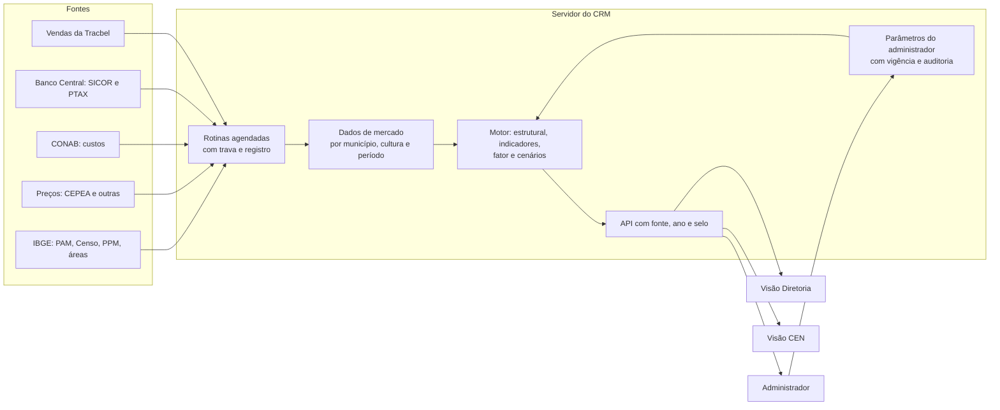

# 48 — Potencial de mercado: o que a pasta 360 contém, o modelo e o plano por fases

> **Data:** 17/09/2026 · **Status:** fases e issues criadas; **nenhuma regra decidida** — as 14 decisões
> da §5 estão na #63.
> **Fontes deste documento:** a pasta `360/` na raiz do repositório (fora do Git), lida por inteiro — 14
> arquivos, 272 abas, 6 CSVs, com as fórmulas célula a célula; as anotações da conversa com a diretoria
> e o comercial, transcritas por Ricardo em 17/09/2026; os documentos 32, 46 e 46A; o código.
> **O que fica de fora de propósito:** nome de CEN e número interno da Tracbel (entregas, captura por
> município). Os dados do IBGE, da CONAB, do CEPEA e do SICOR são públicos e aparecem quando ajudam.
> **Issues:** #63 a #80 — tabela na §8.

---

## 0. Resumo

1. **O pedido:** medir o potencial de venda de máquinas na região da Tracbel, sempre comparado com São
   Paulo, e ajustá-lo pelo momento do mercado — preço das culturas, crédito rural e percepção do comercial —
   em três cenários. **Primeiro as visões Diretoria e Administrador; depois a visão do CEN.**
2. **Já existe um protótipo em Excel** que faz a maior parte disso: potencial estrutural por cultura e
   município, ajuste de ciclo com pesos e limites, relevância da região dentro de SP e captura da Tracbel.
3. **A região tem 40,3% da área plantada de SP e 42,8% do valor da produção** (IBGE, 2024).
4. **Com os parâmetros da planilha, ainda não confirmados**, a região comporta 30.317 máquinas e renova
   3.457 por ano; o ajuste de ciclo derruba a demanda para 2.727 por ano (−21%).
5. **O CRM já tem a base:** os 203 municípios da ADR, a área plantada do IBGE (45.582 linhas no servidor
   desde 14/09/2026) e uma regra de potencial (café, 1 trator a cada 10 ha, a confirmar).
6. **Há 14 decisões antes de programar o motor.** As mais urgentes: **café a cada 10 ha (CRM) ou 20 ha
   (planilha)**; o índice de crédito aplicado na planilha **não é o que a nota dela descreve**; a percepção
   do gestor vale **±5% (conversa) ou até ±40% (planilha)**.
7. **Plano em 7 fases (P0–P6), 18 issues.** Os dados entram pelo próprio servidor (regra R-5 do doc 46), o
   motor é testado contra a planilha e a tela mostra fonte, ano e selo de estimativa (regra R-27).
8. **Mudança de prioridade registrada:** o doc 46 dizia "neste momento não implementar visão de negócio
   (potencial, KPIs, mapas)". Em 17/09/2026 Ricardo priorizou o potencial logo depois do CI (#56). As
   telas para usuários reais continuam dependendo das permissões aplicadas (#46).

---

## 1. O pedido, organizado

As anotações da conversa, na ordem em que aparecem, viraram 21 requisitos. A coluna "Onde" aponta a issue.

| # | Requisito | Onde |
|---|---|---|
| R-01 | **Ordem:** visões Diretoria e Administrador primeiro; depois a visão do CEN | §7 |
| R-02 | **Comparar sempre com São Paulo** | #64, #72, #76 |
| R-03 | Área de cultivo e relevância: área plantada, valor e quantidade produzida | #64 |
| R-04 | Quantidade de propriedades por tamanho, cruzada com a base de clientes | #65, #79 |
| R-05 | Potencial de máquinas da região | #72 |
| R-06 | Área plantada por cultura e município | #64 |
| R-07 | **Administrador do sistema** define a relação hectare por máquina e a taxa de renovação por chassi, por cultura; "quantos hectares exigem um trator por cultura" | #71, #77 |
| R-08 | Demanda anual: parque do município ÷ taxa de renovação; potencial do parque e potencial anual; valor total do potencial da Tracbel | #72, #70 |
| R-09 | Calculadora de trator e de máquinas em geral | #72, #76 |
| R-10 | Indicadores que antecipam ou adiam a renovação (economia, política, clima); adotar dois: rentabilidade da cultura e crédito | #73 |
| R-11 | Base histórica de preço por cultura, em R$ e US$, que só cresce | #66 |
| R-12 | Momento do preço: relação com os últimos 3 e 6 meses, o ano corrente, a média de 12 meses, 3 anos e 5 anos; faixas < 1 retraído, = 1 anual, > 1,2 aquecido, > 1,4 superaquecido | #73 |
| R-13 | Termo de troca: preço do trator (base de venda, ART) ÷ preço da saca, hoje e há 5 anos; "este ano ele está com mais ou menos dinheiro"; por modelo; índice de termo de troca; elasticidade | #70, #73 |
| R-14 | Custo de produção por hectare e por saca, e rentabilidade (receita − custo), para todas as culturas | #67, #73 |
| R-15 | Atualização anual (área plantada do IBGE, CONAB) e mensal (preços); preço dos últimos 12 meses ÷ 12 anteriores | #64, #66, #67, #73 |
| R-16 | SICOR por município: contratos por período e produto; se o contrato foi da Tracbel (venda perdida); 12 meses ÷ anteriores; índice 70% quantidade + 30% valor → quente, morno ou frio; valor, ticket médio e share de 2025 × 2026; ciclo de crédito | #68, #69, #73 |
| R-17 | Percepção do gestor comercial por município, de −5% a +5%, sobre a demanda estrutural | #71, #74 |
| R-18 | Três sensibilidades — rentabilidade e preço, contratação de crédito, comercial do gerente — para saber se o mercado será maior ou menor; **três cenários: conservador, moderado e otimista** | #74 |
| R-19 | Potencial de cliente com a mesma regra do município, usando a área plantada que o CRM tem | #79 |
| R-20 | Plano de ação para a segmentação de clientes | #80 |
| R-21 | Análise por demanda, rentabilidade, cenários de mercado e planejamento comercial | #76 |

---

## 2. Inventário da pasta 360

| Arquivo | Fonte | Conteúdo medido | Período | Uso no modelo |
|---|---|---|---|---|
| `Mapeamento de Mercado - 203 Municipios Tracbel_14 Com pesos.xlsx` | Tracbel, sobre IBGE | **o protótipo** — 16 abas, §3 | 2017–2026 | referência e oráculo de teste |
| `Área Plantada-Colhida 2024 - Set-25.xlsx` | IBGE PAM, tabela 5457 | aba `Fonte`: 5.563 municípios do Brasil × 71 produtos, área 2025 e 2024, marcação Brasil/São Paulo/TBA; nos 203 da região, colunas "Concessão JD", "Loja (Responsável Cobertura)" e **CEN**; linha que classifica cada produto em segmento; abas ocultas `Resumo Cultura - TBA` e `Culturas 0`; 13 notas do IBGE | 2024–2025 | #64 |
| `Produção 2024 - Set-25.xlsx` | IBGE PAM, tabela 5457 | valor da produção (mil R$) por município do Brasil e produto | 2024 | #64 |
| `Qtd Produzida - Toneladas.xlsx` | IBGE PAM, tabela 5457 | quantidade (t) dos 203 municípios × 49 produtos, com linhas de total de SP e da região | 2024 | #64 |
| `Área Total - IBGE.xls` | IBGE, áreas territoriais | km² por município (5.573), UF, região e Brasil, com dicionário | 2025 | #65 |
| `Nº de Tratores por Potência.xlsx` | IBGE Censo, tabela 6871 | tratores total, < 100 cv e ≥ 100 cv por município de SP; sigilo "X" em 39 e 30 municípios | 2017 | #65 |
| `Nº Estabelecimentos - Censo IBGE.xlsx` | IBGE Censo, tabela 6882 | estabelecimentos por município de SP (640) | 2017 | #65 |
| `Nº Estabelecimentos por tamanho - Censo IBGE.xlsx` | IBGE Censo, tabela 6780 | 640 municípios × 20 categorias de área total (total, 18 faixas de área e produtor sem área) | 2017 | #65 |
| `Nº Cabeças de gado - IBGE.xlsx` | IBGE PPM, tabela 3939 | rebanho bovino por município de SP (643; 26 sem dado) | 2024 | #65 |
| `Municípios com Usinas.xlsx` | Tracbel | 68 linhas, uma por usina, grafia sem acento e com repetição | — | #65 |
| `Café.zip` → `cepea-consulta-20260813110609.xls` | CEPEA/ESALQ | indicador do café arábica mensal em R$ e US$; tabela dinâmica por mês e ano; bloco "Índice Momento"; sacas para um 5080EN; esboço de pecuária | 01/2020–09/2026 | #66, #73 |
| `Laranja.zip` → `Dados Laranja Indústria - CEPEA.xlsx` | CEPEA/Hortifruti | 15.997 cotações diárias (8 produtos de mercado, 4 regiões); laranja indústria mensal digitada; razões R12/R6/R3/R1 | 2020–09/2026 | #66, #73 |
| `OneDrive_2026-09-17.zip` → `Custo de Produção/` | CONAB | séries de custo: cana (125 abas; SP: Penápolis 2011–2025, Piracicaba 2023–2025) e café arábica (117 abas; SP: Franca 2003–2025) | 2003–2025 | #67 |
| `Sicor.zip` (8 arquivos) | Banco Central, SICOR | contratos de investimento de SP — 2025 (4.138; R$ 1,48 bi), 2026 até agosto (2.251; R$ 812,8 mi), todos os produtos de 2026 até julho (5.409; R$ 2,03 bi); catálogos de programa (40), subprograma (86), fonte de recurso (37) e seguro (5); planilha de trabalho com o índice por município | 2025–2026 | #68 |

**Citados, mas ausentes da pasta:**

- `Municípios Tracbel.xlsx`, a fonte da loja por município na aba "Controle de Fontes";
- o "glossário na planilha à parte" citado na nota do índice de crédito;
- as pastas de trabalho ligadas por fórmula externa (`[1]`, `[2]`, `[3]`) nas planilhas do PAM, da produção
  e dos contratos.

**Observações que importam para o modelo:**

- a "Concessão JD" e a "Loja" não coincidem em todos os municípios (ex.: Ribeirão Preto aparece em 27
  municípios como concessão e em 17 como loja) — dois recortes diferentes;
- a coluna de CEN da planilha do PAM é **uma terceira fonte**, além das duas que já discordam em 82
  municípios (doc 32 §4.3);
- nos arquivos do SICOR, o código de município é **do Banco Central**, não do IBGE; a junção por nome
  falhou em 13 municípios.

---

## 3. O protótipo, fórmula por fórmula

### 3.1 As 16 abas

| Aba | O que faz |
|---|---|
| Base Consolidada | 203 municípios × 30 colunas do IBGE, com total da região |
| Controle de Fontes | rastreabilidade por coluna: fonte, arquivo, tabela, ano, cobertura (203/203) e ressalva |
| Relevância vs SP | região × estado: área, valor e produtividade por cultura |
| Perfil por Segmento / Perfil por Loja | % da área de 2025 por segmento (grãos, cana, citrus, café, fruticultura, olericultura, algodão, borracha, outros), por município e por loja |
| Café, Cana-de-Açúcar, Amendoim, Soja, Milho, Laranja | área 2025, valor e quantidade 2024 e produtividade por município; café e cana com receita, custo e margem |
| Estabelecimentos (Porte) | Censo 2017 reagrupado em 8 faixas de tamanho + produtor sem área |
| **Administrador** | parâmetros do modelo (§3.2 e §3.3) |
| **Potencial de Venda Tratores** | parque e demanda anual por cultura e município; entregas da Tracbel e captura |
| **Potencial Ajustado (Ciclo)** | índice de crédito por município, fator por cultura e demanda ajustada |
| Notas e Fontes | metodologia e limitações (correção da contagem tripla do café, anos misturados, Censo defasado, laranja perene) |

### 3.2 Potencial estrutural

```
parque necessário (máquinas)     = área plantada da cultura no município (ha) ÷ hectares por máquina
demanda anual (máquinas por ano) = parque necessário ÷ anos de renovação
total do município               = soma das 6 culturas
captura                          = entregas da Tracbel no ano ÷ demanda anual
```

| Cultura | Hectares por máquina | Anos de renovação | Parque na região | Demanda anual na região |
|---|---:|---:|---:|---:|
| Café | 20 | 10 | 5.024 | 502 |
| Cana | 170 | 8 | 16.387 | 2.048 |
| Amendoim | 200 | 8 | 639 | 80 |
| Soja | 200 | 10 | 1.355 | 135 |
| Milho | 200 | 10 | 497 | 50 |
| Laranja | 20 | 10 | 6.416 | 642 |
| **Total** | | | **30.317** | **3.457** |

Os parâmetros são **os da planilha, a confirmar** (D-P01). A área é a da safra 2025. As entregas da
Tracbel por município e a captura existem na planilha, mas são dado interno e ficam fora deste documento.

### 3.3 Ajuste de ciclo

```
fator = limite[ mínimo, máximo ]( (1 + a·zTT + d·zPerc) × (1 + b·zCred) )

zTT   = (índice de termo de troca da cultura − 100) / 100  (+ momentum de 12 meses, se informado)
zPerc = percepção de campo da cultura / 2        (percepção de −2 a +2)
zCred = (índice de crédito do município − 100) / 100

demanda ajustada = demanda anual × fator
```

| Parâmetro | Valor na planilha |
|---|---|
| a — peso do termo de troca (rentabilidade) | 0,4 |
| d — peso da percepção | 0,4 |
| b — sensibilidade ao crédito | 0,5 |
| limites do fator | 0,4 a 1,5 |
| índice de termo de troca (base 100) | café 92, cana 89, amendoim 85, soja 90, milho 90, laranja 90 |
| percepção de campo | café +1, cana −1, amendoim −2, soja −1,5, milho 0, laranja −1 |

Resultado na região: **3.457 → 2.727 máquinas por ano (−21%)** — café 572, cana 1.517, amendoim 41,
soja 87, milho 44, laranja 465. Com tudo em branco, o fator é 1 e nada muda.

### 3.4 O índice de crédito: o que a nota diz e o que a coluna calcula

| | Nota da planilha | Fórmula que alimenta a coluna |
|---|---|---|
| Base | contratos de investimento em **máquinas exceto trator** (colheitadeiras, implementos, outras, reboques) | contratos de **trator** |
| Janela | ano fiscal 2025 ÷ mediana dos anos fiscais 2022–2024 | janeiro a julho de 2026 ÷ janeiro a julho de 2025 |
| Medida | valor (regional 73) e contratos (regional 84) | **ticket médio** (valor ÷ quantidade) |
| Tratamento | suavização (k = 6) e limite de 60 a 140 | sem suavização e sem limite: **de 20 a 2.150**; 100 nos municípios sem valor calculado |

O fator acaba contido pelos limites de 0,4 a 1,5, mas o índice que entra nele não é o descrito. A conversa
pede uma terceira forma: **70% quantidade de contratos + 30% valor**, 12 meses ÷ 12 anteriores (D-P03).

### 3.5 Culturas com receita e custo

- **Café:** sacas por hectare = (t/ha) × 16,67; receita por ha = sacas × preço CEPEA; margem por ha =
  receita − custo CONAB por ha; margem total = margem × área.
- **Cana:** receita por tonelada = preço do kg de ATR × ATR (kg/t), por safra (2021/22 a 2025/26) e mês a
  mês (24 meses); receita por ha = t/ha × receita por tonelada; custo CONAB por ha por safra; variações
  **1 contra 12 = 0,885**, **6 contra 6 = 0,854**, **12 contra 12 = 0,816**.

### 3.6 Café no CEPEA: momento e termo de troca

| Janela | Preço médio (R$/saca) | Último mês ÷ janela |
|---|---:|---:|
| 5 anos | 1.366,18 | — |
| 3 anos | 1.536,44 | — |
| 12 meses | 1.938,37 | 0,897 |
| ano corrente | 1.795,72 | 0,969 |
| 6 meses | 1.741,24 | 0,999 |
| 3 meses | 1.618,05 | 1,075 |

- **Faixas:** < 1 retraído; = 1 normal; > 1,2 aquecido; > 1,4 muito aquecido.
- **Termo de troca:** sacas para um 5080EN a R$ 300 mil — 219,6 pela média de 5 anos, 172,5 hoje, 154,8
  pela média de 12 meses. O preço do trator é o mesmo nas três datas.
- **Bloco de margem:** os preços ao lado dos rótulos "média de 5 anos", "3 anos" etc. são preços de um mês
  (ex.: janeiro de 2020), não as médias.
- **12 contra 12** na série mensal: 0,92.

### 3.7 Laranja indústria

LR12 → R12 = 0,51; LR6 → R6 = 0,75; LR3 → R3 = 1,18; LR1 → R1 = 1,00 (caixa de 40,8 kg). A janela de
12 meses termina **um mês antes** das de 6, 3 e 1.

### 3.8 Relevância da região dentro de SP

| Indicador | Região (203) | SP | % |
|---|---:|---:|---:|
| Área plantada 2024 (ha) | 3.715.896 | 9.216.795 | 40,3% |
| Área plantada 2025 (ha, preliminar) | 3.706.356 | 9.155.949 | 40,5% |
| Valor da produção 2024 (mil R$) | 50.465.781 | 118.021.202 | 42,8% |

Produtividade da região ÷ SP: café 1,03; cana 1,03; amendoim 0,98; soja 1,08; milho 0,98; laranja 0,95.

**A estrutura da região (IBGE):** 75% da área de 2025 é cana, 14% grãos, 4% citrus e 3% café; 54.886
estabelecimentos em 2017, 56% com menos de 20 ha; 62.308 tratores em 2017, 74% com menos de 100 cv.

---

## 4. O que o CRM já tem

| Estrutura | Estado | Documento |
|---|---|---|
| `MunicipioDaAreaDeAtuacao` | **os mesmos 203 municípios**, conciliados com o IBGE (203/203) | doc 32 §4 |
| `ResponsavelPeloMunicipio` | CEN e gestor por município, duas fontes preservadas, 82 municípios divergentes | doc 32 §4.3; #48 |
| `AreaPlantadaNoMunicipio` | área plantada da PAM por município, produto e ano; zero × não disponível; 45.582 linhas no servidor | doc 32 §8.3 |
| `RegraDePotencial` | hectares por máquina e modelo de referência; **1 regra: café, 3036N, 10 ha, "a confirmar"**; sem escritor | doc 32 §8.3; doc 46 |
| Mapa C | máquinas teóricas = área ÷ hectares por máquina, só para a regra ativa | doc 32 §8.3 |
| Cartão "Conhecimento de mercado" | vendas perdidas registradas; "participação de mercado: sem dado" | painel executivo |
| Leitor do IBGE | catálogo de municípios e área plantada; roda só na estação | doc 46 §4.7 |

**O que falta:** valor e quantidade da produção; Censo; preços; custos; SICOR; parâmetros de renovação e
ciclo; motor; área e cultura por cliente (vazias em 100%); rotina no servidor. **Pendências do doc 32 que
este plano resolve:** P-8 (regras de potencial por cultura), P-9 (ciclo de troca), P-11 (propriedades e
culturas por cliente). P-1 (CEN vigente) e P-10 (perfis) continuam nas issues #48 e #46.

---

## 5. Decisões (#63)

Cada decisão tem opções, a recomendação e o que ela bloqueia. **Nenhuma foi tomada.**

| # | Pergunta | Opções encontradas | Recomendação | Bloqueia |
|---|---|---|---|---|
| D-P01 | Hectares por máquina e anos de renovação por cultura; categorias de máquina | café: **10 ha (CRM, 3036N) × 20 ha (planilha)**; demais só na planilha; laranja perene e cana semiperene; "máquinas em geral" pede categorias além de trator | tabela por cultura × categoria, confirmada pelo comercial com vigência; começar por trator nas 6 culturas | #72 |
| D-P02 | Índice de momento de preço | último ÷ média (café); 1 contra 12, 6 contra 6, 12 contra 12 (cana); R12/R6/R3/R1 com janela deslocada (laranja); a faixa entre 1,0 e 1,2 não tem nome e "= 1" exato não acontece | **12 meses ÷ 12 anteriores** como índice oficial (é o que a conversa descreve); os outros como leitura auxiliar; faixas < 1,00 retraído, 1,00–1,20 normal, > 1,20–1,40 aquecido, > 1,40 superaquecido | #73 |
| D-P03 | Índice de crédito | 70% contratos + 30% valor, 12 ÷ 12 (conversa); ticket médio 2026/2025 (planilha); ano fiscal ÷ mediana de 3 anos com suavização e limite (nota) | a da conversa, com suavização para município com poucos contratos e limite; decidir se trator entra (a nota exclui por endogeneidade com a própria venda) | #73 |
| D-P04 | Percepção do gestor | por município, −5% a +5% (conversa); por cultura, −2 a +2 com peso 0,4, até ±40% (planilha) | **por município, ±5%**, com autor, data e justificativa; quem informa: gestor comercial | #71, #74 |
| D-P05 | Pesos, limites e cenários | a = 0,4, b = 0,5, d = 0,4, limites 0,4–1,5 (planilha); cenários só anotados | manter os pesos da planilha como ponto de partida; cenário moderado = fator calculado; conservador e otimista = sensibilidades no limite inferior e superior de faixas decididas | #74 |
| D-P06 | Termo de troca | 5080EN a R$ 300 mil fixo (planilha); 3036N no café (CRM); "base de venda" e "ART preço de trator" (conversa) | máquina de referência por cultura; preço histórico mensal (mediana das notas); unidade por cultura: saca de 60 kg (café, soja, milho, amendoim), tonelada de ATR (cana), caixa de 40,8 kg (laranja) | #70, #73 |
| D-P07 | Rentabilidade | custo total CONAB (planilha usa o total por ha); CONAB em SP só tem café (Franca) e cana (Piracicaba, Penápolis) | custo operacional para a margem de caixa e total para a de longo prazo; referência fora de SP ou outra fonte para as culturas sem série, registrada | #67, #73 |
| D-P08 | Vendas para captura e share | entregas John Deere por ano fiscal (planilha); faturamento do Protheus (#18/#19); pedidos da API GN (#12) | uma fonte oficial por período; município do cliente; ano fiscal da John Deere e ano civil lado a lado | #69 |
| D-P09 | "O contrato foi da Tracbel?" | o SICOR não identifica cliente nem revenda | aceitar como **aproximação** a comparação, por município e mês, dos contratos do SICOR com os pedidos da Tracbel financiados (instituição e linha de crédito na API GN) — nunca contrato a contrato | #69, #73 |
| D-P10 | Anos de referência | área 2025 preliminar × quantidade e valor 2024 × Censo 2017 | usar o último ano completo de cada fonte, mostrar o ano em cada número e nunca misturar anos numa razão sem aviso | #64, #72 |
| D-P11 | Preços de soja, milho e amendoim; forma de obter o CEPEA | não há série na pasta; o CEPEA tem termos de uso | definir a fonte por cultura; conferir a licença antes de automatizar; até lá, envio mensal pelo administrador | #66 |
| D-P12 | Valor do potencial em R$ | não existe preço por máquina no modelo | preço de referência por categoria × demanda, com fonte e data | #70, #72 |
| D-P13 | Propriedades por tamanho × clientes | o Censo é agregado; área por cliente vazia no CRM; ART sem acesso | primeiro a distribuição regional (Censo); cruzamento só com área por cliente de fonte decidida (cadastro pelo CEN, ART, CAR/SICAR) | #65, #79 |
| D-P14 | Base de municípios e CEN da visão do CEN | 203 da ADR confirmados; três fontes de CEN; concessão JD ≠ loja | ADR do CRM como base única; CEN pela decisão da #48; concessão JD como recorte adicional, se a diretoria quiser | #78 |

---

## 6. Arquitetura proposta



**Regras que o desenho respeita:**

- **O servidor busca os dados sozinho** (R-5): nada de script na estação para subir dado. Quando a fonte
  não tiver acesso automatizado, o administrador envia o arquivo pela tela e a validação acontece no servidor.
- **Série que só cresce:** preço e crédito não se reescrevem; revisão da fonte vira registro novo.
- **Zero é zero, sem dado é nulo** (como a área plantada já faz).
- **O motor é domínio puro**, sem banco, e a planilha é o oráculo dos testes: com os parâmetros dela, ele
  tem de reproduzir os números da §3 município a município.
- **Todo número sai com fonte, ano e selo** ("estimativa" enquanto a #63 não confirmar a regra) — R-27 do doc 46.
- **Nomes e tabelas seguem o padrão do doc 41**; a trilha de auditoria da fase 2 cobre os parâmetros.
- **Permissão:** as telas para usuários reais esperam a #46; até lá, só perfis de teste.

---

## 7. Fases

| Fase | Objetivo | Issues | Sai quando | Depende de |
|---|---|---|---|---|
| **P0 — Decisões** | regras fixadas antes do código | #63 | D-P01 a D-P05 e D-P10 decididas | diretoria e comercial |
| **P1 — Dados de mercado** | todas as fontes no servidor, conferidas contra a pasta 360 | #64, #65, #66, #67, #68, #69, #70 | cada fonte com rotina, idempotência e conferência | #63 (parcial); #18, #19, #12 para vendas e preço |
| **P2 — Parâmetros** | administrador edita tudo, com vigência e trilha | #71 | parâmetro com vigência e 403 sem permissão | #63; #46; #40 |
| **P3 — Motor** | estrutural, indicadores, fator e cenários | #72, #73, #74 | testes de ouro contra a planilha | P1; P2 |
| **P4 — Diretoria e Administrador** | API e as duas telas | #75, #76, #77 | tela = API = consulta independente; conferência com a diretoria | P3; #46 |
| **P5 — CEN** | visão do CEN pelos seus municípios | #78 | CEN só vê os próprios municípios | P4; #48 |
| **P6 — Clientes** | potencial por cliente e segmentação | #79, #80 | cobertura de área por cliente medida; plano aprovado | P3; #53; #55; #47 |

P1 e P2 podem andar em paralelo. Dentro de P1, as fontes públicas (#64, #65, #66, #67, #68) não dependem
umas das outras; vendas e preço de máquina (#69, #70) esperam o faturamento no servidor.

---

## 8. Issues

| Código | Issue | Título | Milestone | Prioridade |
|---|---|---|---|---|
| POT-00 | #63 | Decisões do modelo de potencial de mercado | M11 | P0 |
| POT-01 | #64 | Produção Agrícola Municipal completa, anual, no servidor | M11 | P0 |
| POT-02 | #65 | Censo Agropecuário, rebanho, área territorial e usinas | M11 | P1 |
| POT-03 | #66 | Série histórica de preços das culturas, mensal, em R$ e US$ | M11 | P0 |
| POT-04 | #67 | Custos de produção por cultura (CONAB) | M11 | P1 |
| POT-05 | #68 | Crédito rural do SICOR por município e produto, mensal | M11 | P0 |
| POT-06 | #69 | Vendas da Tracbel por município para captura e share | M11 | P1 |
| POT-07 | #70 | Preço de máquina por modelo ao longo do tempo | M11 | P1 |
| POT-08 | #71 | Parâmetros do administrador com vigência e auditoria | M11 | P0 |
| POT-09 | #72 | Potencial estrutural por cultura, município, loja e região, comparado com SP | M12 | P0 |
| POT-10 | #73 | Indicadores de mercado: momento de preço, termo de troca, rentabilidade e crédito | M12 | P0 |
| POT-11 | #74 | Fator de ciclo, percepção do gestor e três cenários | M12 | P0 |
| POT-12 | #75 | API do potencial de mercado | M12 | P0 |
| POT-13 | #76 | Tela Visão Diretoria | M12 | P0 |
| POT-14 | #77 | Tela do Administrador: parâmetros, fontes e atualizações | M12 | P1 |
| POT-15 | #78 | Visão do CEN | M13 | P1 |
| POT-16 | #79 | Potencial por cliente com a mesma regra do município | M13 | P2 |
| POT-17 | #80 | Segmentação de clientes e plano de ação | M13 | P2 |

Milestones: **M11 — Potencial: dados e parâmetros**, **M12 — Potencial: motor e Visão Diretoria**,
**M13 — Potencial: Visão CEN e clientes**. Label: `market-potential`.

---

## 9. O que não fazer

- **Não publicar potencial como validado** enquanto a #63 não confirmar as regras (R-27 do doc 46).
- **Não inventar parâmetro:** sem valor decidido, o cálculo fica vazio com o motivo, como na planilha
  ("enquanto em branco, o potencial fica vazio").
- **Não versionar a pasta `360/`** nem qualquer arquivo com nome de CEN, venda por município ou dado de
  cliente — o `.gitignore` protege a pasta desde 17/09/2026.
- **Não rodar carga de dados a partir da estação** para o servidor (R-5).
- **Não automatizar a coleta do CEPEA** antes de conferir a licença (D-P11).
- **Não afirmar "o contrato foi da Tracbel"** com base no SICOR: ele não identifica revenda (D-P09).
- **Não abrir as telas para usuários reais** antes das permissões aplicadas (#46).
