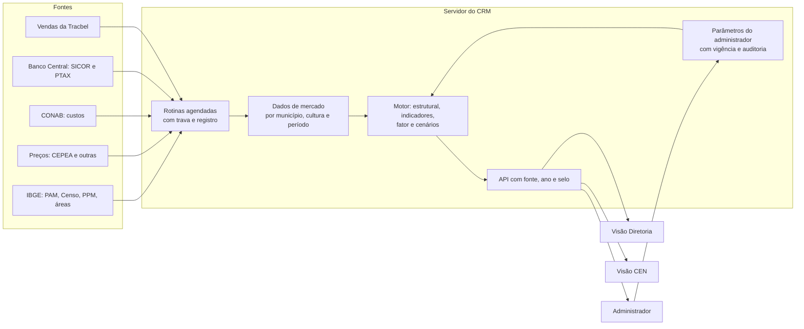

# 48 — Potencial de mercado: o que a pasta 360 contém, o modelo e o plano por fases

> **Data:** 17/09/2026 · atualizado em **20/09/2026** com as issues **#64** (PAM completa, no servidor)
> e **#65** (Censo, rebanho, área territorial e usinas), a **errata do ano** da §3.8 e a escolha da
> fonte das usinas (§2.3).
> **Status:** as duas primeiras fontes da fase P1 estão no banco; **nenhuma regra decidida** — as 14
> decisões da §5 continuam na #63.
> **Fontes deste documento:** a pasta `360/` na raiz do repositório (fora do Git), lida por inteiro — 14
> arquivos, 272 abas, 6 CSVs, com as fórmulas célula a célula; as anotações da conversa com a diretoria
> e o comercial, transcritas por Ricardo em 17/09/2026; os documentos 32, 46 e 46A; o código.
> **O que fica de fora de propósito:** nome de CEN e número interno da Tracbel (entregas, captura por
> município). Os dados do IBGE, da CONAB, do CEPEA e do SICOR são públicos e aparecem quando ajudam.
> **Issues:** #63 a #80 e #83 — tabela na §8.

---

## 0. Resumo

1. **O pedido:** medir o potencial de venda de máquinas na região da Tracbel, sempre comparado com São
   Paulo, e ajustá-lo pelo momento do mercado — preço das culturas, crédito rural e percepção do comercial —
   em três cenários. **Primeiro as visões Diretoria e Administrador; depois a visão do CEN.**
2. **Já existe um protótipo em Excel** que faz a maior parte disso: potencial estrutural por cultura e
   município, ajuste de ciclo com pesos e limites, relevância da região dentro de SP e captura da Tracbel.
3. **A região tem 40,3% da área plantada de SP e 42,8% do valor da produção.** O valor é de 2024; a
   área, apesar do rótulo da planilha, é de **2023** — ver a errata da §3.8.
4. **Com os parâmetros da planilha, ainda não confirmados**, a região comporta 30.317 máquinas e renova
   3.457 por ano; o ajuste de ciclo derruba a demanda para 2.727 por ano (−21%).
5. **O CRM já tem a base:** os 203 municípios da ADR, **as quatro medidas da PAM** (área plantada,
   colhida, quantidade e valor) por município e no total do estado, em três anos, atualizadas pelo
   próprio servidor uma vez por ano (#64), e uma regra de potencial (café, 1 trator a cada 10 ha, a
   confirmar).
6. **Há 14 decisões antes de programar o motor.** As mais urgentes: **café a cada 10 ha (CRM) ou 20 ha
   (planilha)**; o índice de crédito aplicado na planilha **não é o que a nota dela descreve**; a percepção
   do gestor vale **±5% (conversa) ou até ±40% (planilha)**.
7. **Plano em 7 fases (P0–P6), 18 issues.** Os dados entram pelo próprio servidor (regra R-5 do doc 46), o
   motor é testado contra a planilha e a tela mostra fonte, ano e selo de estimativa (regra R-27).
8. **Mudança de prioridade registrada:** o doc 46 dizia "neste momento não implementar visão de negócio
   (potencial, KPIs, mapas)". Em 17/09/2026 Ricardo priorizou o potencial logo depois do CI (#56). As
   telas para usuários reais continuam dependendo das permissões aplicadas (#46).
9. **Conferindo as fontes oficiais (§2.1), apareceu um defeito que já está em produção:** a "área plantada"
   do CRM é a **área colhida** — o leitor do IBGE pede a variável 216, e a plantada é a 8331 (#83).

---

## 1. O pedido, organizado

As anotações da conversa, na ordem em que aparecem, viraram 21 requisitos. A coluna "Onde" aponta a issue.

| # | Requisito | Onde |
|---|---|---|
| R-01 | **Ordem:** visões Diretoria e Administrador primeiro; depois a visão do CEN | §7 |
| R-02 | **Comparar sempre com São Paulo** | #64, #72, #76 |
| R-03 | Área de cultivo e relevância: área plantada, valor e quantidade produzida | #64 |
| R-04 | Quantidade de propriedades por tamanho, cruzada com a base de clientes | #65, #79 |
| R-05 | Potencial de máquinas da região | #72 |
| R-06 | Área plantada por cultura e município | #64 |
| R-07 | **Administrador do sistema** define a relação hectare por máquina e a taxa de renovação por chassi, por cultura; "quantos hectares exigem um trator por cultura" | #71, #77 |
| R-08 | Demanda anual: parque do município ÷ taxa de renovação; potencial do parque e potencial anual; valor total do potencial da Tracbel | #72, #70 |
| R-09 | Calculadora de trator e de máquinas em geral | #72, #76 |
| R-10 | Indicadores que antecipam ou adiam a renovação (economia, política, clima); adotar dois: rentabilidade da cultura e crédito | #73 |
| R-11 | Base histórica de preço por cultura, em R$ e US$, que só cresce | #66 |
| R-12 | Momento do preço: relação com os últimos 3 e 6 meses, o ano corrente, a média de 12 meses, 3 anos e 5 anos; faixas < 1 retraído, = 1 anual, > 1,2 aquecido, > 1,4 superaquecido | #73 |
| R-13 | Termo de troca: preço do trator (base de venda, ART) ÷ preço da saca, hoje e há 5 anos; "este ano ele está com mais ou menos dinheiro"; por modelo; índice de termo de troca; elasticidade | #70, #73 |
| R-14 | Custo de produção por hectare e por saca, e rentabilidade (receita − custo), para todas as culturas | #67, #73 |
| R-15 | Atualização anual (área plantada do IBGE, CONAB) e mensal (preços); preço dos últimos 12 meses ÷ 12 anteriores | #64, #66, #67, #73 |
| R-16 | SICOR por município: contratos por período e produto; se o contrato foi da Tracbel (venda perdida); 12 meses ÷ anteriores; índice 70% quantidade + 30% valor → quente, morno ou frio; valor, ticket médio e share de 2025 × 2026; ciclo de crédito | #68, #69, #73 |
| R-17 | Percepção do gestor comercial por município, de −5% a +5%, sobre a demanda estrutural | #71, #74 |
| R-18 | Três sensibilidades — rentabilidade e preço, contratação de crédito, comercial do gerente — para saber se o mercado será maior ou menor; **três cenários: conservador, moderado e otimista** | #74 |
| R-19 | Potencial de cliente com a mesma regra do município, usando a área plantada que o CRM tem | #79 |
| R-20 | Plano de ação para a segmentação de clientes | #80 |
| R-21 | Análise por demanda, rentabilidade, cenários de mercado e planejamento comercial | #76 |

---

## 2. Inventário da pasta 360

| Arquivo | Fonte | Conteúdo medido | Período | Uso no modelo |
|---|---|---|---|---|
| `Mapeamento de Mercado - 203 Municipios Tracbel_14 Com pesos.xlsx` | Tracbel, sobre IBGE | **o protótipo** — 16 abas, §3 | 2017–2026 | referência e oráculo de teste |
| `Área Plantada-Colhida 2024 - Set-25.xlsx` | IBGE PAM, tabela 5457 | aba `Fonte`: 5.563 municípios do Brasil × 71 produtos, área 2025 e 2024, marcação Brasil/São Paulo/TBA; nos 203 da região, colunas "Concessão JD", "Loja (Responsável Cobertura)" e **CEN**; linha que classifica cada produto em segmento; abas ocultas `Resumo Cultura - TBA` e `Culturas 0`; 13 notas do IBGE | 2024–2025 | #64 |
| `Produção 2024 - Set-25.xlsx` | IBGE PAM, tabela 5457 | valor da produção (mil R$) por município do Brasil e produto | 2024 | #64 |
| `Qtd Produzida - Toneladas.xlsx` | IBGE PAM, tabela 5457 | quantidade (t) dos 203 municípios × 49 produtos, com linhas de total de SP e da região | 2024 | #64 |
| `Área Total - IBGE.xls` | IBGE, áreas territoriais | km² por município (5.573), UF, região e Brasil, com dicionário | 2025 | #65 |
| `Nº de Tratores por Potência.xlsx` | IBGE Censo, tabela 6871 | tratores total, < 100 cv e ≥ 100 cv por município de SP; sigilo "X" em 39 e 30 municípios | 2017 | #65 |
| `Nº Estabelecimentos - Censo IBGE.xlsx` | IBGE Censo, tabela 6882 | estabelecimentos por município de SP (640) | 2017 | #65 |
| `Nº Estabelecimentos por tamanho - Censo IBGE.xlsx` | IBGE Censo, tabela 6780 | 640 municípios × 20 categorias de área total (total, 18 faixas de área e produtor sem área) | 2017 | #65 |
| `Nº Cabeças de gado - IBGE.xlsx` | IBGE PPM, tabela 3939 | rebanho bovino por município de SP (643; 26 sem dado) | 2024 | #65 |
| `Municípios com Usinas.xlsx` | Tracbel | 68 linhas, uma por usina, grafia sem acento e com repetição | — | #65 |
| `Café.zip` → `cepea-consulta-20260813110609.xls` | CEPEA/ESALQ | indicador do café arábica mensal em R$ e US$; tabela dinâmica por mês e ano; bloco "Índice Momento"; sacas para um 5080EN; esboço de pecuária | 01/2020–09/2026 | #66, #73 |
| `Laranja.zip` → `Dados Laranja Indústria - CEPEA.xlsx` | CEPEA/Hortifruti | 15.997 cotações diárias (8 produtos de mercado, 4 regiões); laranja indústria mensal digitada; razões R12/R6/R3/R1 | 2020–09/2026 | #66, #73 |
| `OneDrive_2026-09-17.zip` → `Custo de Produção/` | CONAB | séries de custo: cana (125 abas; SP: Penápolis 2011–2025, Piracicaba 2023–2025) e café arábica (117 abas; SP: Franca 2003–2025) | 2003–2025 | #67 |
| `Sicor.zip` (8 arquivos) | Banco Central, SICOR | contratos de investimento de SP — 2025 (4.138; R$ 1,48 bi), 2026 até agosto (2.251; R$ 812,8 mi), todos os produtos de 2026 até julho (5.409; R$ 2,03 bi); catálogos de programa (40), subprograma (86), fonte de recurso (37) e seguro (5); planilha de trabalho com o índice por município | 2025–2026 | #68 |

**Citados, mas ausentes da pasta:**

- `Municípios Tracbel.xlsx`, a fonte da loja por município na aba "Controle de Fontes";
- o "glossário na planilha à parte" citado na nota do índice de crédito;
- as pastas de trabalho ligadas por fórmula externa (`[1]`, `[2]`, `[3]`) nas planilhas do PAM, da produção
  e dos contratos.

**Observações que importam para o modelo:**

- a "Concessão JD" e a "Loja" não coincidem em todos os municípios (ex.: Ribeirão Preto aparece em 27
  municípios como concessão e em 17 como loja) — dois recortes diferentes;
- a coluna de CEN da planilha do PAM é **uma terceira fonte**, além das duas que já discordam em 82
  municípios (doc 32 §4.3);
- nos arquivos do SICOR, o código de município é **do Banco Central**, não do IBGE; a junção por nome
  falhou em 13 municípios.

### 2.1 As fontes oficiais, conferidas (17/09/2026)

Ricardo enviou os endereços das fontes usadas na conversa. Cada uma foi conferida pelos metadados ou pela
página, sem baixar dado de ninguém.

| Fonte | Endereço | O que tem (medido) | Acesso | Issue |
|---|---|---|---|---|
| IBGE — PAM, tabela 5457 | `sidra.ibge.gov.br/tabela/5457` | variáveis **8331 área plantada ou destinada à colheita**, **216 área colhida**, 214 quantidade produzida (t), 112 rendimento médio (kg/ha), 215 valor da produção; classificação 782 (produto); níveis Brasil, UF e município; anual, **1974–2025** | API `apisidra.ibge.gov.br` e metadados em `servicodados.ibge.gov.br/api/v3/agregados/5457/metadados`. **O site e a API responderam 403 a esta estação em 17/09/2026** (os metadados responderam); a rotina precisa ser testada a partir do servidor | #64, #83 |
| IBGE — Censo Agropecuário 2017 | `sidra.ibge.gov.br/pesquisa/censo-agropecuario/censo-agropecuario-2017/resultados-definitivos` | tabela **6871**: variáveis 1918 (estabelecimentos com tratores) e 1862 (tratores), classificação 12605 (total, menos de 100 cv, 100 cv e mais); tabela **6780**: variável 183 (estabelecimentos), classificação 220 (grupos de área total, 20 categorias); só 2017; município | API e metadados do IBGE | #65 |
| IBGE — PPM, tabela 3939 | (pecuária; a conversa lista "Nº Gado" junto do Censo) | variável 105 (efetivo), classificação 79, **Bovino = 2670**; anual, **1974–2024** — mais recente que o Censo, por isso a planilha a usa | API e metadados do IBGE | #65 |
| CONAB — custos de produção | `gov.br/conab/…/planilhas-de-custos-de-producao` | índice com 45 produtos agrícolas com série histórica, **entre eles soja, milho, amendoim, laranja, café arábica e cana**, em .xls ou .xlsx; os locais de SP ficam dentro dos arquivos | **[M 21/09] download direto**, sem cadastro; o nome do arquivo muda todo ano, e o leitor acha o link pelo nome da cultura; formato muda com os anos (§2.5) | #67 |
| CEPEA — preços | `cepea.org.br` | indicadores de preço das culturas | **o site bloqueou a leitura automática (403)**: lista de indicadores e termos de uso a conferir à mão | #66 |
| CONAB — preços agropecuários | `portaldeinformacoes.conab.gov.br/downloads/arquivos/PrecosMensalUF.txt` | **[M 21/09]** preço **recebido pelo produtor**, mensal, por UF (e por município, com código IBGE), em R$/kg: em SP, 34 produtos — café arábica, soja, milho, amendoim, laranja indústria, cana, boi, leite, sorgo, algodão, trigo, feijão e outros; **só os últimos 12 meses** (09/2025–08/2026) | arquivo aberto, sem cadastro, Latin-1 com `;` | #66 |
| Socicana — preço do kg de ATR | `socicana.com.br/calculadora-de-atr/preco-do-kg/` | preço **mensal e acumulado** do kg de ATR por safra, de 2015/16 a 2026/27; agosto de 2026 = **R$ 0,8692** (mensal), **o mesmo valor da planilha** — a série de cana do protótipo vem daqui | página HTML, sem arquivo para baixar | #66 |
| Banco Central — PTAX | `api.bcb.gov.br/dados/serie/bcdata.sgs.3698` | **[M 21/09]** dólar de venda, média mensal, desde 01/2015 (140 meses) | API pública (SGS), sem credencial | #66 |
| Banco Central — SICOR | `olinda.bcb.gov.br/olinda/servico/SICOR/versao/v2/aplicacao` | serviço OData com 17 recursos, entre eles **`InvestMunicipioProduto`** (o da planilha), `CusteioMunicipioProduto`, `InvestRegiaoUFProduto`, `ProgramaSubprograma`, `FonteRecursos` e `CusteioInvestimentoComercialIndustrialSemFiltros` | API pública (OData), sem credencial; **[M 21/09]** devolve tudo numa resposta e ignora `groupby`; códigos do Banco Central (SP = 27) — §2.6 | #68 |

**Achado ao conferir a tabela 5457:** o leitor do IBGE do CRM pede a variável **216 (área colhida)** e a
grava como área plantada. A área que o CRM mostra hoje — e que o mapa C usa — é área colhida (#83).

### 2.3 As usinas: por que a ANP e não o MAPA [medido em 20/09/2026, #65]

A pasta do comercial trazia uma lista de **68 linhas** de municípios com usina, sem fonte nem data, com
grafia sem acento e repetição. Ela precisava virar dado com procedência. Foram avaliadas duas fontes
oficiais:

| | MAPA — SAPCana | **ANP — dados abertos** |
|---|---|---|
| O que é | cadastro obrigatório de produtores, cooperativas e comercializadoras de **cana** | autorização de todo produtor de **etanol** do país |
| Cobre usina só de açúcar | **sim** | não |
| Acesso | `sistemasweb4.agricultura.gov.br/sapcana/downloadBaseCompletaInstituicao.action` — **exige CAPTCHA** | `gov.br/.../pb-da-etanol.zip`, **download direto** |
| Atualização | diária | mensal; a versão lida era de 18/08/2026, com dados até 07/2026 |
| São Paulo | — | **145 usinas em 120 municípios** |
| Traz | cadastro | razão social, CNPJ, município e **capacidade de produção (m³/dia)** de anidro e hidratado |

**A decisão é a ANP, e o motivo é o CAPTCHA.** Ele é o controle de acesso que o MAPA escolheu para
esse download; contorná-lo violaria os termos do sistema, e isso não se faz por conveniência de
carga. A ANP publica o equivalente sem barreira nenhuma, com procedência e — de quebra — com o
**porte** de cada usina, que a lista de 68 linhas não tinha.

**O que a escolha custa, dito em voz alta:** usina que produz **só açúcar**, sem etanol, não é
autorizada pela ANP e não aparece. Na prática quase toda usina paulista é mista, mas **a ausência de
um município na tabela não prova que não há usina lá** — prova que não há usina de etanol. A tela diz
isso, como o resto da Visão 360 faz com dado que não fecha.

**[22/09/2026, issue 153] Usina que sai da lista da ANP fica encerrada, não apagada.** A ANP publica só o cadastro
de hoje; apagar a linha fazia a usina que o CRM mostrou num mês sumir sem rastro no seguinte. Encerrada, ela sai da
contagem e do mapa, continua no banco com a data em que saiu, e reabre se voltar à lista. Leitura vazia não encerra
nada (arquivo que não veio inteiro), e linha recusada não conta como usina que saiu.

Na ADR, a carga encontrou **64 usinas**; a planilha listava 68 municípios, com repetição e incluindo
as exclusivamente açucareiras. A maior é a São Martinho, em Pradópolis, com 4.240 m³/dia.

### 2.4 Os preços: CONAB, Socicana e PTAX [medido em 21/09/2026, #66]

O texto-base cita o **CEPEA** como fonte de preço. O CEPEA tem termos de uso e bloqueou a leitura
automática em 17/09/2026; pela mesma regra das usinas (§2.3), barreira não se contorna — procura-se o
equivalente oficial aberto. Ele existe:

| | CEPEA | **CONAB — preços agropecuários** | **Socicana** | **Banco Central — PTAX** |
|---|---|---|---|---|
| O que é | indicador de preço por praça | preço **recebido pelo produtor**, por UF e município | preço do kg de ATR (Consecana) | dólar de venda, média mensal |
| Culturas em SP | café, laranja e outras | **34 produtos**, entre eles café, soja, milho, amendoim, laranja, cana, boi e leite | cana | — |
| Histórico | longo | **só os últimos 12 meses** | **12 safras** (2015/16 a 2026/27) | desde 01/2015 |
| Acesso | termos de uso; leitura automática bloqueada | arquivo aberto | página pública; `robots.txt` livre | API aberta |

**A decisão é CONAB + Socicana + PTAX, e o CEPEA fica de fora até a licença.** O que isso custa, dito
em voz alta:

- **A série da CONAB começa com 12 meses** e cresce um por vez: o arquivo é uma janela móvel, e o CRM
  **nunca apaga** o mês que sai dela — é o "não varia, só vamos acrescentando" do texto-base. O índice
  de momento **12 ÷ 12** (D-P02) só fica disponível quando houver 24 meses, em **09/2027**, salvo
  histórico de outra fonte.
- **Preço recebido pelo produtor não é o indicador CEPEA.** O CEPEA publica preço em praça de
  referência (café em Santos, por exemplo); a CONAB, o que o produtor paulista recebeu. Para o momento
  de preço, a rentabilidade e o termo de troca, o do produtor é o que interessa — mas os números não
  são os mesmos da planilha, e **não se misturam na mesma série**.
- **Café em SP tem buracos na CONAB:** só 6 dos 12 meses (09/2025 a 02/2026) no arquivo lido.

**Carga** (`--somente-precos`, rotina mensal `TracbelCrmPrecos` do servidor, todo dia 20): 331
cotações da CONAB, 274 da Socicana (mensal e acumulado da safra, 137 meses) e 140 meses de PTAX na
primeira rodada; zero gravações na segunda. O valor revisado pela fonte é atualizado e **o anterior
fica na trilha de auditoria**. **Conferência:** o kg de ATR de agosto de 2026 = R$ 0,8692, o mesmo da
planilha.

**Na tela** (Indicadores Geográficos, seção "Preços das culturas — São Paulo"): o último mês de cada
série, em R$ ou US$, **na unidade do mercado** — saca de 60 kg, caixa de 40,8 kg, arroba —, a
variação contra o mesmo mês do ano anterior quando a série já tem, quantos meses ela tem no CRM, e o
gráfico da série escolhida. Soja a **R$ 129,60 a saca**, café a **R$ 1.894,20**, laranja a
**R$ 27,74 a caixa** (08/2026; café, 02/2026).
### 2.5 Os custos de produção: as séries históricas da CONAB [medido em 21/09/2026, #67]

A CONAB publica o custo de duas formas, e só uma serve para São Paulo:

| | `CustoProducao.txt` (dados abertos) | **Séries históricas em `.xls`** |
|---|---|---|
| Cobertura | nacional, mensal desde 2018 | por cultura, desde 1997–2011 conforme a série |
| São Paulo | café de Franca **só até 10/2024**, feijão, trigo; **nenhuma cana** | cana (Piracicaba e Penápolis), café (Franca, 2003–2025), laranja (7 locais), amendoim (6 séries), soja e milho 2ª safra (Assis) |
| Acesso | arquivo aberto | **download direto**, sem cadastro |

**A decisão são as séries em `.xls`**, lidas **só nas abas de SP** (166 abas em 21/09/2026). Três cuidados:

- **O nome do arquivo muda todo ano** (`…-2008-a-2025.xls`): o leitor acha o link na página pelo **nome
  da cultura**. O milho é uma pasta com dois arquivos (1ª e 2ª safra), que viram culturas separadas.
- **O layout muda com os anos** — caixa dos rótulos, produtividade num texto ou em célula ao lado, mês
  por extenso ou como data do Excel, cabeçalho partido. A aba é lida **por rótulo**, nunca por
  posição.
- **21 abas param no custo operacional** (laranja antiga e cana de Penápolis 2013 e 2016): renda de
  fatores e custo total ficam **nulos**, não zero.

**Aceite contra a planilha do comercial** — ela usa o **custo total por hectare**:

| | Planilha | CRM |
|---|---:|---:|
| Café, Franca 2025 | R$ 29.279,94 | **R$ 29.279,94** |
| Cana, Piracicaba 2025 | R$ 13.903,20 | **R$ 13.903,20** |
| Cana, Piracicaba 2023 e 2024 (linha 1 da aba) | R$ 13.565,66 · R$ 13.040,39 | **iguais** |

**O que falta, dito em voz alta:** **não há série de milho 1ª safra em SP**; a soja de SP para em
2021 e o milho 2ª safra em 2023 (Assis). Qual local é "a referência de SP" de cada cultura — a
planilha usa Franca e Piracicaba — é parâmetro do administrador (#71). Operacional ou total na
rentabilidade continua sendo a D-P07.

**Carga** (`--somente-custos`, na rotina mensal `TracbelCrmPrecos`): 166 abas na primeira rodada,
zero na segunda; os 166 locais casaram com um município do catálogo. **Na tela**, abaixo dos preços:
por cultura, a última safra de cada local (operacional e total, por hectare e por unidade) e o
gráfico do custo total ao longo das safras.
### 2.6 O crédito rural: SICOR do Banco Central [medido em 21/09/2026, #68]

O recurso `InvestMunicipioProduto` do serviço OData do SICOR, **São Paulo inteiro, todos os produtos,
desde 2013**: **204.435 linhas**, em 637 municípios. Mais as tabelas auxiliares do Banco Central
(`bcb.gov.br/htms/sicor/`): programa (40), subprograma (86), fonte de recurso (37) e produto (529).

**Cinco coisas que o formato esconde:**

- **Uma linha não é um contrato.** O recurso publica a **soma** dos contratos de cada combinação de
  produto, programa, subprograma, fonte, seguro, atividade e modalidade, por município e mês — sem número
  de contrato e sem quantidade. A contagem de contratos de verdade (`QtdInvestimento`) só existe nos
  recursos nacionais, sem município. A "linha" é a contagem possível por município, e é a que a planilha
  e o texto-base usam ("quantidade de linhas de contratos").
- **Os códigos são do Banco Central.** SP é o estado **27** (no IBGE, 35), e o município tem código
  próprio. O de-para para o IBGE é pelo **nome sem acento, caixa e apóstrofo**: os **637 municípios casam
  todos**. A planilha errou 13 porque comparava o nome cru. Os outros 8 municípios de SP nunca tiveram
  crédito de investimento desde 2013.
- **O serviço devolve tudo de uma vez** — as 204 mil linhas numa resposta só — e **ignora**
  `=groupby`. A carga pede um ano por vez.
- **O Banco Central acrescenta registros atrasados** aos meses recentes: a carga relê sempre o ano
  corrente e o anterior.
- **O Banco Central também reclassifica.** Casando linha a linha os arquivos da pasta com o CRM: em
  2025, 4.130 das 4.138 linhas estão idênticas, 1 mudou de valor e **7 mudaram de combinação** — as 7 com
  o mesmo município, mês, produto e valor, só a fonte de recurso trocada (430 → 303). Em 2026, 5.360 das
  5.409 idênticas, 10 com valor diferente e 39 reclassificadas. Por isso **o ano relido espelha a fonte**:
  a linha que saiu é apagada, ou a mesma operação seria contada duas vezes. **[22/09/2026, issue 153]** A trilha
  de auditoria guarda a linha apagada inteira — valor, município, mês, produto, programa, subprograma, fonte, seguro,
  atividade e modalidade —, e só sai o que a fonte de fato não trouxe: linha recusada (município que não casou,
  valor inválido) fica como estava.

**Aceite contra a pasta**:

| | Pasta | CRM (21/09/2026) |
|---|---:|---:|
| 2025, máquinas (trator · máquinas e implementos · colheitadeiras) | 2.239 · 1.602 · 297 linhas | 2.242 · 1.603 · 297 |
| 2025, máquinas, valor | R$ 1.482.701.465,57 | R$ 1.483.494.705,57 |
| 2026 até julho, todos os produtos | 5.409 linhas, R$ 2.031.031.489,26 | 5.454 linhas, R$ 2.058.214.363,65 |

A diferença é inteira de **registro posterior e reclassificação**, conferida linha a linha acima — não de
leitura. Um aceite de "contagens iguais" contra um arquivo baixado meses antes não é atingível com a
fonte viva, e seria errado forçá-lo.

**Carga** (`--somente-credito`, na rotina mensal `TracbelCrmPrecos`): primeira rodada, 204.435 linhas
em 204 s; segunda, relê 2025 e 2026 (16.729 linhas) em 7 s, sem gravar nada. **Na tela**, abaixo dos
custos: linhas, valor e ticket de máquinas nos últimos 12 meses contra os 12 anteriores; os municípios
(com "só a ADR"); o valor anual desde 2013; e os produtos. O **índice ponderado (70% linhas, 30% valor) e
as faixas** são da #73.
---

## 3. O protótipo, fórmula por fórmula

### 3.1 As 16 abas

| Aba | O que faz |
|---|---|
| Base Consolidada | 203 municípios × 30 colunas do IBGE, com total da região |
| Controle de Fontes | rastreabilidade por coluna: fonte, arquivo, tabela, ano, cobertura (203/203) e ressalva |
| Relevância vs SP | região × estado: área, valor e produtividade por cultura |
| Perfil por Segmento / Perfil por Loja | % da área de 2025 por segmento (grãos, cana, citrus, café, fruticultura, olericultura, algodão, borracha, outros), por município e por loja |
| Café, Cana-de-Açúcar, Amendoim, Soja, Milho, Laranja | área 2025, valor e quantidade 2024 e produtividade por município; café e cana com receita, custo e margem |
| Estabelecimentos (Porte) | Censo 2017 reagrupado em 8 faixas de tamanho + produtor sem área |
| **Administrador** | parâmetros do modelo (§3.2 e §3.3) |
| **Potencial de Venda Tratores** | parque e demanda anual por cultura e município; entregas da Tracbel e captura |
| **Potencial Ajustado (Ciclo)** | índice de crédito por município, fator por cultura e demanda ajustada |
| Notas e Fontes | metodologia e limitações (correção da contagem tripla do café, anos misturados, Censo defasado, laranja perene) |

### 3.2 Potencial estrutural

```
parque necessário (máquinas)     = área plantada da cultura no município (ha) ÷ hectares por máquina
demanda anual (máquinas por ano) = parque necessário ÷ anos de renovação
total do município               = soma das 6 culturas
captura                          = entregas da Tracbel no ano ÷ demanda anual
```

| Cultura | Hectares por máquina | Anos de renovação | Parque na região | Demanda anual na região |
|---|---:|---:|---:|---:|
| Café | 20 | 10 | 5.024 | 502 |
| Cana | 170 | 8 | 16.387 | 2.048 |
| Amendoim | 200 | 8 | 639 | 80 |
| Soja | 200 | 10 | 1.355 | 135 |
| Milho | 200 | 10 | 497 | 50 |
| Laranja | 20 | 10 | 6.416 | 642 |
| **Total** | | | **30.317** | **3.457** |

Os parâmetros são **os da planilha, a confirmar** (D-P01). A área é a da safra 2025. As entregas da
Tracbel por município e a captura existem na planilha, mas são dado interno e ficam fora deste documento.

### 3.3 Ajuste de ciclo

```
fator = limite[ mínimo, máximo ]( (1 + a·zTT + d·zPerc) × (1 + b·zCred) )

zTT   = (índice de termo de troca da cultura − 100) / 100  (+ momentum de 12 meses, se informado)
zPerc = percepção de campo da cultura / 2        (percepção de −2 a +2)
zCred = (índice de crédito do município − 100) / 100

demanda ajustada = demanda anual × fator
```

| Parâmetro | Valor na planilha |
|---|---|
| a — peso do termo de troca (rentabilidade) | 0,4 |
| d — peso da percepção | 0,4 |
| b — sensibilidade ao crédito | 0,5 |
| limites do fator | 0,4 a 1,5 |
| índice de termo de troca (base 100) | café 92, cana 89, amendoim 85, soja 90, milho 90, laranja 90 |
| percepção de campo | café +1, cana −1, amendoim −2, soja −1,5, milho 0, laranja −1 |

Resultado na região: **3.457 → 2.727 máquinas por ano (−21%)** — café 572, cana 1.517, amendoim 41,
soja 87, milho 44, laranja 465. Com tudo em branco, o fator é 1 e nada muda.

### 3.4 O índice de crédito: o que a nota diz e o que a coluna calcula

| | Nota da planilha | Fórmula que alimenta a coluna |
|---|---|---|
| Base | contratos de investimento em **máquinas exceto trator** (colheitadeiras, implementos, outras, reboques) | contratos de **trator** |
| Janela | ano fiscal 2025 ÷ mediana dos anos fiscais 2022–2024 | janeiro a julho de 2026 ÷ janeiro a julho de 2025 |
| Medida | valor (regional 73) e contratos (regional 84) | **ticket médio** (valor ÷ quantidade) |
| Tratamento | suavização (k = 6) e limite de 60 a 140 | sem suavização e sem limite: **de 20 a 2.150**; 100 nos municípios sem valor calculado |

O fator acaba contido pelos limites de 0,4 a 1,5, mas o índice que entra nele não é o descrito. A conversa
pede uma terceira forma: **70% quantidade de contratos + 30% valor**, 12 meses ÷ 12 anteriores (D-P03).

### 3.5 Culturas com receita e custo

- **Café:** sacas por hectare = (t/ha) × 16,67; receita por ha = sacas × preço CEPEA; margem por ha =
  receita − custo CONAB por ha; margem total = margem × área.
- **Cana:** receita por tonelada = preço do kg de ATR × ATR (kg/t), por safra (2021/22 a 2025/26) e mês a
  mês (24 meses); receita por ha = t/ha × receita por tonelada; custo CONAB por ha por safra; variações
  **1 contra 12 = 0,885**, **6 contra 6 = 0,854**, **12 contra 12 = 0,816**.

### 3.6 Café no CEPEA: momento e termo de troca

| Janela | Preço médio (R$/saca) | Último mês ÷ janela |
|---|---:|---:|
| 5 anos | 1.366,18 | — |
| 3 anos | 1.536,44 | — |
| 12 meses | 1.938,37 | 0,897 |
| ano corrente | 1.795,72 | 0,969 |
| 6 meses | 1.741,24 | 0,999 |
| 3 meses | 1.618,05 | 1,075 |

- **Faixas:** < 1 retraído; = 1 normal; > 1,2 aquecido; > 1,4 muito aquecido.
- **Termo de troca:** sacas para um 5080EN a R$ 300 mil — 219,6 pela média de 5 anos, 172,5 hoje, 154,8
  pela média de 12 meses. O preço do trator é o mesmo nas três datas.
- **Bloco de margem:** os preços ao lado dos rótulos "média de 5 anos", "3 anos" etc. são preços de um mês
  (ex.: janeiro de 2020), não as médias.
- **12 contra 12** na série mensal: 0,92.

### 3.7 Laranja indústria

LR12 → R12 = 0,51; LR6 → R6 = 0,75; LR3 → R3 = 1,18; LR1 → R1 = 1,00 (caixa de 40,8 kg). A janela de
12 meses termina **um mês antes** das de 6, 3 e 1.

### 3.8 Relevância da região dentro de SP

| Indicador, como a planilha o rotula | Região (203) | SP | % |
|---|---:|---:|---:|
| Área plantada 2024 (ha) | 3.715.896 | 9.216.795 | 40,3% |
| Área plantada 2025 (ha, preliminar) | 3.706.356 | 9.155.949 | 40,5% |
| Valor da produção 2024 (mil R$) | 50.465.781 | 118.021.202 | 42,8% |

> **ERRATA — o ano das duas primeiras linhas está adiantado [medido em 20/09/2026, issue 64].** A carga
> do CRM passou a trazer as quatro medidas da PAM e reproduziu estes números contra o SIDRA, produto a
> produto, com "Café (em grão) Total" no lugar de Arábica + Canephora. Três dos quatro bateram **ao
> dígito — mas não no ano que a planilha diz**: a "área plantada 2024" é a da PAM de **2023**
> (3.715.896 ha na região, ao hectare) e a "2025 preliminar" é a de **2024** (3.706.356 e 9.155.949,
> também ao hectare). Só a linha do valor está com o ano certo: os R$ 50.465.781 mil e os
> R$ 118.021.202 mil são mesmo de 2024, ao milhar. O total de SP da primeira linha ainda tem uma
> **transposição de dígitos**: o SIDRA dá 9.217.**695** ha, e a planilha traz 9.216.**795** (900 ha).
>
> Os percentuais não mudam de forma relevante (40,3% vira 40,3%; 40,5% segue 40,5%), mas **a decisão
> D-P10 muda**: escolher "o ano da planilha" e escolher "2024" não são a mesma coisa. Por isso a carga
> guarda **três anos** da PAM (documento 32, §8.3.2).

Produtividade da região ÷ SP: café 1,03; cana 1,03; amendoim 0,98; soja 1,08; milho 0,98; laranja 0,95.

**A estrutura da região (IBGE):** 75% da área de 2025 é cana, 14% grãos, 4% citrus e 3% café; 54.886
estabelecimentos em 2017, 56% com menos de 20 ha; 62.308 tratores em 2017, 74% com menos de 100 cv.

---

## 4. O que o CRM já tem

| Estrutura | Estado | Documento |
|---|---|---|
| `MunicipioDaAreaDeAtuacao` | **os mesmos 203 municípios**, conciliados com o IBGE (203/203) | doc 32 §4 |
| `ResponsavelPeloMunicipio` | CEN e gestor por município, duas fontes preservadas, 82 municípios divergentes | doc 32 §4.3; #48 |
| `ProducaoAgricolaNoMunicipio` | **as quatro medidas da PAM** por município, produto e ano — área plantada (8331), colhida (216), quantidade (214) e valor (215, mil R$); zero × não disponível preservados; três anos da série | doc 32 §8.3.1; #83, #95, #64 |
| `ProducaoAgricolaNoEstado` | a linha que o IBGE publica para a UF inteira — o denominador da comparação com SP, que **não** é a soma dos municípios | doc 32 §8.3.1; #64 |
| `FrotaDeTratoresNoMunicipio` | tratores e estabelecimentos com trator, por faixa de potência (Censo Agropecuário 2017); sigilo "X" preservado como nulo | #65 |
| `EstabelecimentosPorAreaNoMunicipio` | estabelecimentos por grupo de área total — as **18 faixas originais** do IBGE, mais "produtor sem área" e o total | #65 |
| `RebanhoNoMunicipio` | efetivo do rebanho bovino, **anual** (PPM); a tabela comporta os outros nove tipos | #65 |
| `AreaTerritorialDoMunicipio` | área em km² com os três decimais do IBGE, com o ano da apuração | #65 |
| `UsinaDeEtanol` | as usinas autorizadas pela ANP, com CNPJ, município e **capacidade de produção** (m³/dia) | #65 |
| `RegraDePotencial` | hectares por máquina, **anos de renovação** e modelo de referência, **com vigência, autor e justificativa**; semente: café, 3036N, 10 ha, "a confirmar", desde 13/09/2026; escrita pelo administrador | doc 32 §8.3; **#71 (§4.1)** |
| `ParametroDoPotencial` | os parâmetros gerais com vigência: janela, composição do crédito, faixas, limite da percepção, pesos e limites do fator | **#71 (§4.1)** |
| `PercepcaoDoGestor` | o ajuste do gestor por município, com vigência, autor e justificativa | **#71 (§4.1)** |
| Mapa C | máquinas teóricas = área ÷ hectares por máquina, só para a regra ativa; **com alternador para área plantada e valor da produção da lavoura inteira** | doc 32 §8.3, §8.4; #103 |
| Mapa D — estrutura agropecuária | tratores, densidade por mil km², propriedades, rebanho e usinas, com o ano de cada fonte | doc 32 §8.4; #103 |
| Painel "O mercado da região" | parque, propriedades, valor da lavoura, usinas e rebanho, **com a fatia de São Paulo** | doc 32 §8.4; #103 |
| Cartão "Conhecimento de mercado" | vendas perdidas registradas; "participação de mercado: sem dado" | painel executivo |
| Leitor do IBGE | catálogo de municípios e a PAM em lotes de 10 produtos (`LeitorDoIbge.cs`); roda na carga, que o servidor pode agendar | doc 46 §4.7; #83, #95 |

### 4.1 Os parâmetros do administrador, com vigência [21/09/2026, #71]

**Nada do modelo é constante de código.** Todo parâmetro é uma **vigência**: começa numa data, tem autor e
justificativa, e continua gravado quando outro o substitui. O cálculo de uma data usa o que valia naquela
data — a regra é `ParametroComVigencia.VigenteEm`, e o motor (#72 a #74) vai perguntar exatamente isso.

| Tabela | Chave | O que guarda | Quem altera |
|---|---|---|---|
| `RegraDePotencial` | produto da PAM **+ categoria de máquina** + data | cultura do catálogo, categoria, hectares por máquina, anos de renovação (pode faltar), modelo, a confirmar/confirmada | `ParametroDoPotencial.Administrar` |
| `ParametroDoPotencial` | data | meses da janela; peso dos contratos no crédito (o valor pesa o resto); limites de retração, aquecimento e superaquecimento; nome da faixa do meio; limite da percepção; pesos dos três indicadores; fator mínimo e máximo | `ParametroDoPotencial.Administrar` |
| `PercepcaoDoGestor` | município + data | o ajuste em pontos percentuais, dentro do limite dos gerais vigentes na data de início | `PercepcaoDoGestor.Informar` (perfil **Gestor comercial**) |

**As regras:**

- **a chave da regra é produto × categoria × data** [M 24/09/2026]. Ela era `(produto, data)`, e isso
  **impedia a própria decisão D-P01**: no café cabem "um trator a cada 10 ha" e "uma colheitadeira a cada
  200 ha", que são duas regras do mesmo produto na mesma data, e a segunda era recusada como data ocupada.
  Cultura e categoria passaram a ser **obrigatórias na regra nova** (as colunas seguem anuláveis, porque o
  passado não se reescreve), e a revogação ganhou a categoria no endereço;
- a vigência começa **hoje ou depois** (hoje é o dia de São Paulo); o passado não se reescreve;
- só se **revoga** o que ainda não passou de hoje, com motivo; o resto se corrige com uma vigência nova;
- uma vigência de pé por chave e data (índice único filtrado pelas não revogadas);
- toda inclusão e toda revogação entram na **trilha de auditoria**, com o autor;
- **403** para quem não tem a permissão — o perfil padrão lê os parâmetros e não os altera.

**A semente é o que foi decidido, e só isso.** A regra do café continua a de 13/09/2026 (as colunas
`Origem` e `InformadaEm` foram **renomeadas** para `Justificativa` e `VigenteDesde`, preservando a linha).
Os parâmetros gerais nascem com o texto de 21/09/2026: **12 contra 12**, **70% contratos e 30% valor**,
**< 1,00 retraído, > 1,20 aquecido, > 1,40 superaquecido** e **percepção de −5% a +5%**. Nascem **vazios**, e
a rota de leitura os lista em `pendencias`: os pesos dos três indicadores e os limites do fator (D-P05), o
nome da faixa entre 1,00 e 1,20 (D-P02) e os anos de renovação do café (D-P01).

**O limite de cada faixa pertence à de baixo:** 1,20 ainda não é aquecido, porque o texto diz "> 1,2".

**Rotas:** `/api/v1/admin/parametros-do-potencial` (documento 23, §2.9).

**A tela [21/09/2026, #77]** mora em Configurações, com o visual das outras seções:

- **Comercial › Potencial de mercado:** o que vale numa data escolhida (padrão: hoje), com **o que falta decidir**
  em frase; os parâmetros gerais, a regra de cada cultura e a percepção por município, cada um com o botão de
  registrar vigência nova — só para quem tem a permissão; o formulário dos gerais já vem preenchido com o que vale
  hoje, e o da regra oferece os produtos da PAM pela área plantada na ADR; e **a trilha**: toda vigência, com quem
  registrou, quando e por quê, e quem revogou — com o botão de revogar só onde a API aceita.
- **TI e Integrações › Fontes públicas:** uma linha por fonte — última atualização (a rodada que a carga gravou),
  período, linhas, municípios da ADR cobertos, recusas e próxima execução —, com **a fonte atrasada ou sem dado em
  destaque** e a frase que diz por quê (documento 23, §2.10).

**O envio manual de arquivo ficou de fora**, porque hoje não há fonte que precise dele: todas são lidas pelo servidor.
A única que precisaria, o CEPEA, espera a decisão sobre a licença (D-P11). Quando ela vier, o envio entra com a
validação do arquivo no servidor.

**O que ficou para depois, de propósito:**

- a percepção é conferida contra o limite **da data de início**; se um limite menor entrar depois, quem aplica
  o limite da data do cálculo é o motor (#74);
- o gestor informa a percepção de qualquer município; restringir aos municípios dele depende de qual planilha
  de CEN e gestor vale (#48, D-P14);
- categoria de máquina (D-P01) não entrou: a decisão não foi tomada, e acrescentá-la depois é migração aditiva.

**O que falta:** motor; área e cultura por cliente (vazias em 100%); vendas da Tracbel (#69) e preço de
máquina (#70); os valores em aberto da §4.1. **Pendências do doc 32 que
este plano resolve:** P-8 (regras de potencial por cultura), P-9 (ciclo de troca), P-11 (propriedades e
culturas por cliente). P-1 (CEN vigente) e P-10 (perfis) continuam nas issues #48 e #46.

---

## 5. Decisões (#63)

Cada decisão tem opções, a recomendação e o que ela bloqueia. **Nenhuma foi tomada.**

| # | Pergunta | Opções encontradas | Recomendação | Bloqueia |
|---|---|---|---|---|
| D-P01 | Hectares por máquina e anos de renovação por cultura; categorias de máquina | café: **10 ha (CRM, 3036N) × 20 ha (planilha)**; demais só na planilha; laranja perene e cana semiperene; "máquinas em geral" pede categorias além de trator | tabela por cultura × categoria, confirmada pelo comercial com vigência; começar por trator nas 6 culturas | #72 |
| D-P02 | Índice de momento de preço | último ÷ média (café); 1 contra 12, 6 contra 6, 12 contra 12 (cana); R12/R6/R3/R1 com janela deslocada (laranja); a faixa entre 1,0 e 1,2 não tem nome e "= 1" exato não acontece | **12 meses ÷ 12 anteriores** como índice oficial (é o que a conversa descreve); os outros como leitura auxiliar; faixas < 1,00 retraído, 1,00–1,20 normal, > 1,20–1,40 aquecido, > 1,40 superaquecido | #73 |
| D-P03 | Índice de crédito | 70% contratos + 30% valor, 12 ÷ 12 (conversa); ticket médio 2026/2025 (planilha); ano fiscal ÷ mediana de 3 anos com suavização e limite (nota) | a da conversa, com suavização para município com poucos contratos e limite; decidir se trator entra (a nota exclui por endogeneidade com a própria venda) | #73 |
| D-P04 | Percepção do gestor | por município, −5% a +5% (conversa); por cultura, −2 a +2 com peso 0,4, até ±40% (planilha) | **por município, ±5%**, com autor, data e justificativa; quem informa: gestor comercial | #71, #74 |
| D-P05 | Pesos, limites e cenários | a = 0,4, b = 0,5, d = 0,4, limites 0,4–1,5 (planilha); cenários só anotados | **DECIDIDA em 23/09/2026** (§5.1): pesos da planilha como **primeira vigência**, com autor, data e a justificativa "medidos no protótipo, a confirmar"; as três sensibilidades são **preço/rentabilidade, crédito e percepção** — o termo de troca fica fora até a #70 | #74 |
| D-P06 | Termo de troca | 5080EN a R$ 300 mil fixo (planilha); 3036N no café (CRM); "base de venda" e "ART preço de trator" (conversa) | máquina de referência por cultura; preço histórico mensal (mediana das notas); unidade por cultura: saca de 60 kg (café, soja, milho, amendoim), tonelada de ATR (cana), caixa de 40,8 kg (laranja) | #70, #73 |
| D-P07 | Rentabilidade | custo total CONAB (planilha usa o total por ha); na pasta, a CONAB de SP só tem café (Franca) e cana (Piracicaba, Penápolis) — mas a CONAB publica série histórica também de soja, milho, amendoim e laranja (§2.1), com os locais a conferir dentro dos arquivos | custo operacional para a margem de caixa e total para a de longo prazo; referência fora de SP ou outra fonte para as culturas sem série, registrada | #67, #73 |
| D-P08 | Vendas para captura e share | entregas John Deere por ano fiscal (planilha); faturamento do Protheus (#18/#19); pedidos da API GN (#12) | uma fonte oficial por período; município do cliente; ano fiscal da John Deere e ano civil lado a lado | #69 |
| D-P09 | "O contrato foi da Tracbel?" | o SICOR não identifica cliente nem revenda | aceitar como **aproximação** a comparação, por município e mês, dos contratos do SICOR com os pedidos da Tracbel financiados (instituição e linha de crédito na API GN) — nunca contrato a contrato | #69, #73 |
| D-P10 | Anos de referência | **[M 20/09] o rótulo da planilha está adiantado na área:** o que ela chama de área 2025 preliminar é a PAM de 2024, e a "2024" é a de 2023; o valor 2024 é mesmo de 2024 (errata da §3.8). Mais o Censo 2017 | usar o último ano completo de cada fonte, mostrar o ano em cada número e nunca misturar anos numa razão sem aviso. O banco já guarda **três anos** da PAM, então a escolha não pede nova carga | #64, #72 |
| D-P11 | Preços de soja, milho e amendoim; forma de obter o CEPEA e a Socicana | não há série de soja, milho e amendoim na pasta; o CEPEA tem termos de uso e bloqueou a leitura automática; **a cana já tem fonte: Socicana** (preço do kg de ATR, mensal, em página HTML) | **[M 21/09] resolvido para soja, milho e amendoim — e para tudo o mais:** a CONAB publica o preço recebido pelo produtor em SP como dado aberto (§2.4). A Socicana é página pública e o `robots.txt` não restringe nada. **Aberto só o CEPEA:** licença a conferir; até lá, fora da coleta automática | #66 |
| D-P12 | Valor do potencial em R$ | não existe preço por máquina no modelo | preço de referência por categoria × demanda, com fonte e data | #70, #72 |
| D-P13 | Propriedades por tamanho × clientes | o Censo é agregado; área por cliente vazia no CRM; ART sem acesso | primeiro a distribuição regional (Censo); cruzamento só com área por cliente de fonte decidida (cadastro pelo CEN, ART, CAR/SICAR) | #65, #79 |
| D-P14 | Base de municípios e CEN da visão do CEN | 203 da ADR confirmados; três fontes de CEN; concessão JD ≠ loja | ADR do CRM como base única; CEN pela decisão da #48; concessão JD como recorte adicional, se a diretoria quiser | #78 |

### 5.1 D-P05 decidida [23/09/2026]

Ela travava o fator de ciclo (#74) e, por tabela, os três cenários da calculadora (#161). O que estava
em aberto era menor do que parecia, e a conversa que a resolveu teve duas partes.

**As três sensibilidades são as do pedido, e não as do protótipo.** O protótipo compõe o fator com
**termo de troca**, crédito e percepção; o pedido do Ricardo fala em *"sensibilidade e rentabilidade do
preço da commodity"*, *"contratação de crédito"* e *"sensibilidade comercial que o gerente atribui"*. A
diferença não é de redação: o termo de troca precisa do **preço de máquina** (#70), que é dado interno e
**não existe no sistema**; preço e rentabilidade existem desde as issues #66 e #159.

> **Decidido:** o fator combina **preço/rentabilidade**, **crédito** e **percepção**. O termo de troca
> fica de fora, com o motivo registrado, até a #70 trazer o preço de máquina — e aí entra como quarta
> sensibilidade, ou substituindo a primeira, em decisão própria.

**Os pesos do protótipo entram como primeira vigência.** `a = 0,4` (preço/rentabilidade), `d = 0,4`
(percepção), `b = 0,5` (crédito), limites de `0,4` a `1,5` — os valores medidos na planilha, que fazem a
demanda da região cair de 3.457 para 2.727 por ano (−21%).

> **Decidido:** registrar esses valores como a vigência inicial, com autor, data e a justificativa
> *"medidos no protótipo, a confirmar"*. Todo número que passar pelo fator carrega o **selo de
> estimativa** enquanto essa justificativa valer. Trocar depois é uma vigência nova pela tela do
> Administrador (#71) — **sem publicação**, e sem reescrever o que já foi mostrado.

**Por que não esperar o número "certo".** Um parâmetro com vigência e autor não é um chute disfarçado: é
uma hipótese datada, que a tela identifica como tal e que qualquer pessoa troca em um formulário. Esperar
o valor definitivo deixaria o fator inexistente — e um fator inexistente também é uma escolha, só que
invisível.

---

## 6. Arquitetura proposta



**Regras que o desenho respeita:**

- **O servidor busca os dados sozinho** (R-5): nada de script na estação para subir dado. Quando a fonte
  não tiver acesso automatizado, o administrador envia o arquivo pela tela e a validação acontece no servidor.
- **Série que só cresce:** preço e crédito não se reescrevem; revisão da fonte vira registro novo.
- **Zero é zero, sem dado é nulo** (como a área plantada já faz).
- **O motor é domínio puro**, sem banco, e a planilha é o oráculo dos testes: com os parâmetros dela, ele
  tem de reproduzir os números da §3 município a município.
- **Todo número sai com fonte, ano e selo** ("estimativa" enquanto a #63 não confirmar a regra) — R-27 do doc 46.
- **Nomes e tabelas seguem o padrão do doc 41**; a trilha de auditoria da fase 2 cobre os parâmetros.
- **Permissão:** as telas para usuários reais esperam a #46; até lá, só perfis de teste.

---

## 7. Fases

| Fase | Objetivo | Issues | Sai quando | Depende de |
|---|---|---|---|---|
| **P0 — Decisões** | regras fixadas antes do código | #63 | D-P01 a D-P05 e D-P10 decididas | diretoria e comercial |
| **P1 — Dados de mercado** | todas as fontes no servidor, conferidas contra a pasta 360 | #64, #65, #66, #67, #68, #69, #70 | cada fonte com rotina, idempotência e conferência | #63 (parcial); #18, #19, #12 para vendas e preço |
| **P2 — Parâmetros** | administrador edita tudo, com vigência e trilha — **feito em 21/09/2026 (§4.1)** | #71 | parâmetro com vigência e 403 sem permissão | #63; #46; #40 |
| **P3 — Motor** | estrutural, indicadores, fator e cenários — **completa: #72 em 22/09/2026 (§7.1), #161 (§7.2), #73 (§7.3) e #74 (§7.4) em 23/09** | #72, #73, #74 | testes de ouro contra a planilha | P1; P2 |
| **P4 — Diretoria e Administrador** | API e as duas telas — **a do Administrador feita em 21/09/2026 (§4.1)** | #75, #76, #77 | tela = API = consulta independente; conferência com a diretoria | P3; #46 |
| **P5 — CEN** | visão do CEN pelos seus municípios | #78 | CEN só vê os próprios municípios | P4; #48 |
| **P6 — Clientes** | potencial por cliente e segmentação | #79, #80 | cobertura de área por cliente medida; plano aprovado | P3; #53; #55; #47 |

P1 e P2 podem andar em paralelo. Dentro de P1, as fontes públicas (#64, #65, #66, #67, #68) não dependem
umas das outras; vendas e preço de máquina (#69, #70) esperam o faturamento no servidor.

### 7.1 O motor estrutural [issue 72, 22/09/2026]

`Dominio/Mercado/MotorDoPotencial.cs` — **domínio puro, sem banco**. O mapa C, o total da tela e a
calculadora (issue 161) chamam a **mesma função**: não há segunda fórmula para divergir.

| O que | Como |
|---|---|
| Parque | `área útil ÷ hectares por máquina`, por **cultura do catálogo** (issue 165) |
| Demanda anual | `parque ÷ ciclo de renovação`; **vazia com o motivo** enquanto D-P01 não sair |
| Recortes | município → `Sobrepor` as categorias (máquinas somam, terra não); loja, região e SP → `Somar` os municípios (o compartilhamento acontece no chão) |
| Relevância | fatia do recorte em SP; por cultura, também quantidade e a razão de produtividade contra a média do estado |
| Calculadora | `Simular` troca a área medida pela digitada e chama a mesma conta — o aceite da issue 161 sai por construção |
| Selo de estimativa | acende quando a regra que **dimensionou** o número está "a confirmar" |

**O aceite conferido, e o que ficou de fora.** A issue pede que "com os parâmetros da planilha, o motor
reproduza o protótipo município a município". Esses parâmetros **não estão no CRM**: quantos hectares
por máquina e qual o ciclo de cada cultura é a decisão **D-P01**, e a única regra registrada é o exemplo
do gerente comercial. O que está provado por teste de ouro é que **a conta do motor é a do protótipo** —
sem grupo de compartilhamento configurado, e nenhum está, o resultado é exatamente
`área ÷ hectares por máquina` somando as culturas. Os números de §3 (30.317 de parque e 3.457 por ano)
só poderão ser reproduzidos quando alguém registrar os parâmetros que os geraram.

**O que falta para o motor ficar completo:** a rota de cadastro da regra não aceita **categoria de
máquina** (D-IM-06) — regra sem categoria cai num grupo "Sem categoria declarada", visível na tela —,
e o fator de ciclo de mercado e os cenários são a issue #74.

### 7.2 A calculadora de máquinas [issue 161, 23/09/2026]

**`POST /api/v1/mercado/calculadora`**, e a tela aberta pelo cartão de potencial.

**Ela não tem fórmula própria, e é o ponto.** O aceite da issue é *"a mesma área de um município
devolve o mesmo resultado que o motor gravou para ele"* — uma segunda fórmula, por mais fiel que
nascesse, passaria a divergir no dia em que uma das duas mudasse. `MotorDoPotencial.Simular` troca o
número da área e chama `Potencial`: **sem área informada, a resposta é literalmente a do mapa**, e há
teste que compara as **duas rotas** no mesmo cenário.

| Entrada | Sem ela |
|---|---|
| `municipioCodigoIbge` | a conta parte do zero e vale só o que for digitado |
| `areas` | devolve o número **medido** do município — o aceite da issue |
| `categoriaCodigo` | entram todas as categorias de máquina |
| `data` | valem as regras de **hoje**; com ela, as que valiam naquele dia (issue 71) |

**Nada é gravado.** Simulação é pergunta; uma resposta gravada viraria um número "oficial" que ninguém
decidiu adotar.

**Cultura sem regra é recusa com o nome dela** (422), e não uma linha zerada: quem digitou "UVA"
precisa saber que falta parâmetro e onde cadastrá-lo, não concluir que não há potencial de uva.

**A permissão é `Territorio.Ler`, e não uma nova.** A issue cita `Mercado.Ler` (D-IM-11), que é
**decisão em aberto**: criar a permissão agora deixaria a calculadora invisível para todo mundo até
alguém concedê-la perfil a perfil, e conceder por conta própria seria alterar permissão de produção por
suposição. A calculadora mora na tela de território e lê o mesmo dado dela.

**O que ela ainda não faz:** "demanda ajustada e os três cenários", que a issue também pede. O ajuste
vem do fator de ciclo (#74), cujos **pesos são a decisão D-P05** e cujas bandas são a **D-IM-05** —
nenhuma das duas saiu. O campo `sobreOsCenarios` diz isso na tela, em vez de deixar o espaço mudo ou
inventar um peso.

**De quebra:** o catálogo do motor saiu de dentro do repositório do mapa para
`IRepositorioDoMotorDoPotencial`. A calculadora precisa exatamente do mesmo, e duas leituras do mesmo
conceito divergem — o defeito que o motor acabou de eliminar do lado do cálculo.

### 7.3 Os indicadores de mercado [issue 73, 23/09/2026]

`Dominio/Mercado/IndicadoresDeMercado.cs` — domínio puro, conferível sem subir aplicação.

| Indicador | Regra | Decisão |
|---|---|---|
| Momento de preço | média dos 12 meses recentes ÷ média dos 12 anteriores, **incluindo o último mês** | D-P02 |
| Índice de crédito | 70% da quantidade de **linhas** do SICOR + 30% do valor | D-P03 |
| Margem por unidade | `margem/ha × quilos por unidade ÷ produtividade` | — |
| Termo de troca | **fora**, até a #70 trazer o preço de máquina | D-P05 (§5.1) |

**Linha do SICOR não é contrato**, e o código já dizia isso desde a #68: o recurso
`InvestMunicipioProduto` do Banco Central não publica número nem quantidade de contrato — cada linha é a
**soma** dos contratos de uma combinação de município, mês, produto, programa, subprograma, fonte,
seguro, atividade e modalidade. A planilha do comercial conta linhas e as chama de "contratos"; o
texto-base diz "quantidade de linhas de contratos", que é a leitura certa. O índice, o contrato da API e
a frase da tela falam em **linhas** — chamar de contrato faria a tela afirmar um número de produtores que
a fonte não dá. Pelo mesmo motivo, `valor ÷ linhas` se chama **valor médio por linha**, e não ticket
médio.

**Município com poucas linhas é marcado, não suavizado.** De 2 linhas para 4 é "+100%", e nenhuma
suavização transforma isso em informação: o que falta ali é contexto. O índice sai igual, com a marca de
base pequena e a contagem ao lado. O limiar é o parâmetro `MinimoDeLinhasNoCredito`, **em aberto**
(D-P03): nulo não marca nada, e entra pela tela do Administrador quando alguém decidir — sem publicação.

#### 7.3.1 Elasticidade: o método, e por que o estudo não foi rodado

A issue pede o estudo de elasticidade "documentado, **fora do cálculo** até ser validado". Ele continua
fora do cálculo, e este é o registro do que ele exige.

**A pergunta:** o momento de preço e o termo de troca antecipam a contratação de crédito e a venda? Se
antecipam, com que defasagem?

**O que ele mediria:** correlação e regressão de defasagem entre cada indicador (mês a mês, por município
e por cultura) e cada resposta (linhas e valor do SICOR; unidades vendidas), testando defasagens de 0 a
12 meses.

**Dos quatro pares, um é medível hoje:**

| Par | Situação |
|---|---|
| Momento de preço × crédito | **medível** — preço da CONAB (#66) e SICOR (#68) estão carregados |
| Momento de preço × vendas | falta a venda em unidades (**#69**, dado interno que não existe no CRM) |
| Termo de troca × crédito | falta o preço de máquina (**#70**) |
| Termo de troca × vendas | faltam os dois |

**Por que nem o par medível foi rodado aqui:** ele exige leitura do banco carregado, que depende de VPN,
e o resultado de uma rodada só teria valor com a série inteira — não com o recorte que a estação alcança
num dia. Rodá-lo é uma tarefa de análise, com data e número, não um efeito colateral desta entrega.

**A armadilha que o estudo precisa evitar, e que a nota da pasta 360 já aponta: endogeneidade.** O
crédito de trator inclui as máquinas que a própria Tracbel vendeu. Correlacionar um indicador com o
crédito de trator e concluir que ele "prevê a venda" seria, em parte, correlacionar a venda com ela
mesma. A nota da pasta exclui o trator do índice por esse motivo; **o CRM hoje o inclui** (D-P03 deixou
essa escolha em aberto). O estudo tem de rodar nas duas versões e dizer quanto a exclusão muda.

### 7.4 O fator de ciclo e os três cenários [issue 74, 23/09/2026]

`Dominio/Mercado/FatorDeCiclo.cs` — domínio puro. **Demanda ajustada = estrutural × fator.**

```
fator = limite[(1 + a·z_preço + d·z_percepção) × (1 + b·z_crédito)]
```

Preço e percepção **somam** dentro do mesmo parêntese porque são a leitura do **produtor** — quanto a
lavoura rende e o que o gestor vê na rua; o crédito **multiplica** porque é a **condição de financiar**,
que age sobre o conjunto: sem crédito, nem a melhor safra vira máquina. É a forma do protótipo.

| Peso | Valor | De onde vem |
|---|---:|---|
| `a` — preço e rentabilidade | **0,40** | medido no protótipo (lá era o termo de troca) |
| `b` — crédito | **0,50** | medido no protótipo |
| `d` — percepção do gestor | **1,00** | **mudou**, e o porquê está abaixo |
| limites do fator | **0,40 a 1,50** | medidos no protótipo |

**Por que o peso da percepção não é o 0,40 do protótipo.** Lá a percepção ia de **−2 a +2** e entrava como
`percepção/2`, o que fazia o peso 0,40 valer **±40% de efeito**. A decisão **D-P04** trocou a escala para
**±5 pontos percentuais** justamente para tirar aqueles ±40%. Carregar o 0,40 junto com a escala nova
daria **±2%** — um vigésimo do que o protótipo pretendia, e menos do que o próprio rótulo "−5% a +5%"
promete. Com **1,00**, o rótulo é literal.

**Com uma ressalva que precisa estar dita:** o efeito da percepção é **amplificado pelo crédito**, porque
ela mora dentro do parêntese que o termo de crédito multiplica. Com crédito neutro, +5% move o fator em
exatamente 5%; com o crédito 20% acima, move 5,5%. É consequência da forma do protótipo e é defensável —
o otimismo do gestor vale mais quando há crédito para financiá-lo —, mas quem lê o número precisa saber
que o "±5%" é exato **só no crédito neutro**.

**Sem índice nenhum, o fator é 1** — o aceite da issue. Indicador ausente vale **desvio zero**, e não
"fator indeterminado": quem não tem preço carregado deve ver a demanda estrutural, não a demanda sumindo.
**Sem os pesos**, porém, não há fator: peso é decisão, não conta.

#### 7.4.1 Os três cenários

**Moderado** é o fator calculado. **Conservador** e **otimista** são o mesmo modelo com **cada** índice
levado à **borda da faixa em que ele já está** — um preço em 1,28 está em "aquecido" (1,20 a 1,40) e um
crédito em 1,00 está na intermediária (1,00 a 1,20): o conservador lê 1,20 e 1,00, o otimista lê 1,40 e
1,20. Não é variação inventada; é o intervalo que a própria classificação já usa.

**As bordas abertas ficam onde estão.** A faixa de retração não tem piso e a de superaquecimento não tem
teto; empurrar o índice para zero ou para o infinito seria inventar um cenário que a classificação não
descreve. Nesses casos o cenário coincide com o moderado.

**A percepção do gestor não varia entre cenários**, de propósito: ela não é faixa de mercado, é a opinião
de uma pessoa sobre aquele município. Um cenário que a mexesse estaria simulando **o gestor mudando de
ideia**, e não o mercado mudando.

**A ordem é garantida por construção** (conservador ≤ moderado ≤ otimista): o conservador é o menor entre
a borda de baixo e o moderado, e o otimista o maior entre a de cima e o moderado. Não é maquiagem —
"conservador" quer dizer "o pessimista dos dois", e é essa a definição.

#### 7.4.2 A segunda vigência dos parâmetros

Os pesos entraram como uma **vigência nova**, de 23/09/2026, e **não alterando a de 21/09**: o passado não
se reescreve, e o cálculo daqueles dias continua sem fator, como era. A justificativa registrada diz
"pesos medidos no protótipo, a confirmar" — e enquanto ela valer, todo número que passa pelo fator carrega
o **selo de estimativa**. Trocar qualquer um deles é uma vigência nova pela tela do Administrador, **sem
publicação**.

**O que o teste de ouro consegue e o que não consegue.** O documento mede, na planilha, que a demanda da
região cai de **3.457 para 2.727** por ano (−21%), o que é um fator de **0,7888**. O teste prende a
**aplicação** desse fator — ajustada = estrutural × fator — mas **não reproduz o 0,7888 a partir dos
índices**, porque o fator da planilha inclui o **termo de troca**, que o CRM não tem (issue #70). Quando a
#70 entrar, o teste ganha os índices e fecha de ponta a ponta.

---

## 8. Issues

| Código | Issue | Título | Milestone | Prioridade |
|---|---|---|---|---|
| POT-00 | #63 | Decisões do modelo de potencial de mercado | M11 | P0 |
| POT-01 | #64 | Produção Agrícola Municipal completa, anual, no servidor | M11 | P0 |
| POT-02 | #65 | Censo Agropecuário, rebanho, área territorial e usinas | M11 | P1 |
| POT-03 | #66 | Série histórica de preços das culturas, mensal, em R$ e US$ | M11 | P0 |
| POT-04 | #67 | Custos de produção por cultura (CONAB) | M11 | P1 |
| POT-05 | #68 | Crédito rural do SICOR por município e produto, mensal | M11 | P0 |
| POT-06 | #69 | Vendas da Tracbel por município para captura e share | M11 | P1 |
| POT-07 | #70 | Preço de máquina por modelo ao longo do tempo | M11 | P1 |
| POT-08 | #71 | Parâmetros do administrador com vigência e auditoria | M11 | P0 |
| POT-09 | #72 | Potencial estrutural por cultura, município, loja e região, comparado com SP | M12 | P0 |
| POT-10 | #73 | Indicadores de mercado: momento de preço, termo de troca, rentabilidade e crédito | M12 | P0 |
| POT-11 | #74 | Fator de ciclo, percepção do gestor e três cenários | M12 | P0 |
| POT-12 | #75 | API do potencial de mercado | M12 | P0 |
| POT-13 | #76 | Tela Visão Diretoria | M12 | P0 |
| POT-14 | #77 | Tela do Administrador: parâmetros, fontes e atualizações | M12 | P1 |
| POT-15 | #78 | Visão do CEN | M13 | P1 |
| POT-16 | #79 | Potencial por cliente com a mesma regra do município | M13 | P2 |
| POT-17 | #80 | Segmentação de clientes e plano de ação | M13 | P2 |
| — | #83 | [BUG] A área plantada do CRM é a área colhida: o leitor do IBGE pede a variável 216 | M11 | P1 |

Milestones: **M11 — Potencial: dados e parâmetros**, **M12 — Potencial: motor e Visão Diretoria**,
**M13 — Potencial: Visão CEN e clientes**. Label: `market-potential`.

---

## 9. O que não fazer

- **Não publicar potencial como validado** enquanto a #63 não confirmar as regras (R-27 do doc 46).
- **Não inventar parâmetro:** sem valor decidido, o cálculo fica vazio com o motivo, como na planilha
  ("enquanto em branco, o potencial fica vazio").
- **Não versionar a pasta `360/`** nem qualquer arquivo com nome de CEN, venda por município ou dado de
  cliente — o `.gitignore` protege a pasta desde 17/09/2026.
- **Não rodar carga de dados a partir da estação** para o servidor (R-5).
- **Não automatizar a coleta do CEPEA** antes de conferir a licença (D-P11).
- **Não afirmar "o contrato foi da Tracbel"** com base no SICOR: ele não identifica revenda (D-P09).
- **Não abrir as telas para usuários reais** antes das permissões aplicadas (#46).
