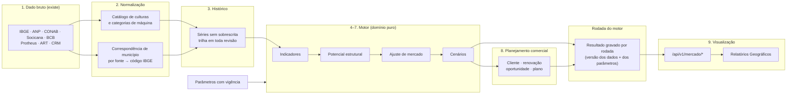

# 49 — Inteligência de Mercado: análise técnica antes da tela

> **Data:** 22/09/2026 · **Status:** análise e proposta. **Nada implementado** nesta entrega.
> **Pedido:** Ricardo, 22/09/2026 — reconstruir e evoluir os Relatórios Geográficos como um **motor de
> inteligência de mercado agro + máquinas**, com o mapa como camada de apresentação. Primeira entrega:
> "antes de implementar visualmente, quero uma análise técnica completa".
> **Lido para esta análise:** as issues #63 a #80, #83, #103, #107 e #117 (corpo e comentários); o código da
> tela `IndicadoresGeograficos.tsx` e dos 7 componentes de território; as rotas `/territorio/*` e
> `/admin/parametros-do-potencial`; os repositórios, as entidades, os leitores e as cargas de cada fonte; a
> política de auditoria; a pasta `360/` (o protótipo — 16 abas com fórmulas — e a planilha do SICOR);
> os documentos 14, 32, 36 e 48.
> **Anexos:** [49A — Matriz indicador → fonte](49A-MATRIZ-INDICADOR-FONTE.md) ·
> [49B — Épicos e issues](49B-EPICOS-E-ISSUES.md).
> **O que fica de fora de propósito:** nome de CEN, venda da Tracbel por município e qualquer dado de
> cliente. Os números públicos (IBGE, CONAB, SICOR) aparecem quando ajudam.

Marcação: **[M]** medido no código, no banco ou na planilha nesta análise ou nas issues citadas; **[D]**
declarado pelo Ricardo ou pela conversa com a diretoria; **[P]** proposta desta análise, a aprovar.

---

## 0. Resumo

1. **A base de dados já está quase toda no servidor** [M]. Das fontes públicas que o pedido cita, **12 fluxos
   rodam sozinhos** pelo orquestrador (IBGE PAM, Censo, PPM, área territorial; ANP; CONAB preços e custos;
   Socicana; PTAX; SICOR e as tabelas dele). Faltam **três**: preço de máquina (#70), vendas da Tracbel por
   município em unidades (#69) e área por cliente (#79). As três são dado interno ou de cliente — nenhuma
   é fonte pública.
2. **O motor não existe** [M]. O único cálculo de potencial do CRM é `área ÷ hectares por máquina` para **uma**
   regra (café, 3036N, 10 ha, "a confirmar"). Não há demanda anual, fator de mercado, cenário, share nem
   potencial de cliente. As issues #72, #73 e #74 estão abertas e bloqueadas na #63.
3. **A tela não sabe lidar com mais de uma cultura** [M]. Ela lê `regras[0]` — a segunda regra que o
   administrador cadastrar não aparece em lugar nenhum — e o filtro "Cultura da regra" é desligado. Culturas
   dinâmicas pedem mudança de contrato, não só de tela.
4. **Há cálculo no navegador** [M]. Os totais da região, a fatia de São Paulo e a soma das máquinas teóricas
   são feitos em `IndicadoresGeograficos.tsx` (linhas 255–308). Com motor, isso vira divergência entre tela
   e API; tem de ir para o servidor.
5. **"Nunca apagar histórico" ainda não vale para tudo** [M]. Preço, custo e crédito guardam o valor anterior
   na trilha; **PAM, Censo, PPM e usinas não** — a revisão do IBGE sobrescreve sem rastro, e a usina que sai
   da lista da ANP é **apagada**. O SICOR apaga a linha reclassificada e a trilha guarda só o valor, sem a
   combinação que a identificava.
6. **Três fontes casam município por nome** [M] — SICOR, ANP e custos da CONAB —, embora o pedido proíba nome
   como chave quando existe código. O SICOR grava o código do Banco Central e refaz o casamento por nome a
   cada carga.
7. **O protótipo tem cinco cálculos que não devem ser copiados** [M]: produtividade sobre área **plantada** (o
   IBGE usa colhida); soma de culturas sem tratar **sobreposição de área** (soja × milho 2ª safra, amendoim
   em reforma de canavial); termo de troca com **preço fixo de trator** (vira o inverso do preço da saca e
   não mede poder de compra); captura em **ano fiscal John Deere** contra demanda em **ano civil**; e receita
   mensal da cana com o **ATR de uma safra** aplicado a 24 meses. Detalhe na §7.
8. **A interface aprovada fica** [P]. "O mercado da região", a linha de indicadores, os quatro cartões de mapa
   lado a lado, as abas dentro dos cartões, o cursor que mostra o município nos quatro mapas e o clique que
   abre a ficha continuam. O que muda está na §10.3, com a justificativa de cada mudança visual.
9. **Proposta: 19 épicos, 22 issues novas e 11 existentes atualizadas** [P] — §12 e anexo 49B; abertas no
   GitHub em 22/09/2026: issues **#150 a #171**, épicos **#172 a #190**. Metade pode
   começar já (dados, qualidade, catálogo de culturas, snapshot do motor); o que depende de número decidido
   sai com o valor **vazio e o motivo**, nunca com parâmetro inventado.

---

## 1. O pedido, organizado

O texto de 22/09 tem 31 seções. Organizado em requisitos, com o que já existe ao lado:

| # | Requisito [D] | Existe hoje [M] | Onde entra |
|---|---|---|---|
| IM-R01 | **Região Tracbel × Estado de SP** em todo indicador | só na linha "O mercado da região" (lavoura, tratores, propriedades); preço, custo e crédito sem comparação | E12, E17 |
| IM-R02 | Hierarquia **SP → Região → Loja → Município → Cliente** | filtros de sub-região (Norte/Noroeste) e loja; sem nível cliente; "região" significa outra coisa no código (§6, I-01) | E12 |
| IM-R03 | Escolher um município **reage a página inteira** | o clique abre a ficha; o resto da página não muda | E12, E17 |
| IM-R04 | **Culturas dinâmicas** (café, cana, amendoim, soja, milho, laranja e futuras), com parâmetros por cultura no Administrador, versionados | `RegraDePotencial` por produto da PAM, com vigência; sem categoria de máquina, unidade, fonte de preço/custo, produtividade nem sensibilidade | E16 |
| IM-R05 | Série de área plantada/colhida, quantidade, valor e produtividade com **competência**; nunca misturar anos sem ressalva | quatro medidas da PAM, **3 anos**; a API escolhe um ano para tudo (`Max(Ano)`); produtividade não é calculada; unidade não é guardada | E02, E03 |
| IM-R06 | Censo por faixa de área (8 faixas + sem área) **cruzado com clientes**, estabelecimento ≠ cliente | faixas reagrupadas na leitura (9); área por cliente **vazia em 100%** | E13 |
| IM-R07 | **Potencial estrutural**: parque = área ÷ ha/máquina; demanda anual = parque ÷ ciclo; por cultura × categoria × família × modelo, com vigência e justificativa; sem dupla contagem | só parque, uma regra, sem categoria | E08, E16 |
| IM-R08 | Parque × demanda anual separados para tratores, plantadeiras, colheitadeiras, pulverizadores, implementos e agricultura de precisão | só "máquinas teóricas" | E08, E16 |
| IM-R09 | Valor de mercado pelo **preço interno** (ART, TOTVS, histórico de vendas); separar estrutural (un), demanda anual (un), valor anual, vendas Tracbel, share, potencial capturável | nada — sem preço de máquina (#70) nem venda por município em unidades (#69) | E07, E11 |
| IM-R10 | **Termo de troca** sem ambiguidade: sacas necessárias × índice de poder de compra, base 1,00; faixas < 1 retraído, ~1 normal, > 1,20 aquecido, > 1,40 muito aquecido, configuráveis | faixas gerais em `ParametroDoPotencial`; termo de troca não existe | E09 |
| IM-R11 | **Rentabilidade**: receita/ha = produtividade × preço; resultado = receita − custo CONAB, com local, sistema, safra, fonte e data no tooltip | preço e custo na tela, **separados**; margem não existe | E06, E09 |
| IM-R12 | **Preço mensal que nunca é sobrescrito**: atual, médias 3/6/12 m, 3 e 5 anos, variação 12 m, momentum, R$ e US$ | série mensal com trilha; tela mostra último mês e "em 1 ano"; médias e momentum não existem | E05 |
| IM-R13 | **SICOR em janelas móveis** 12 m × 12 m anteriores: contratos, valor, ticket, variações | janelas 12 × 12 para máquinas, por município e produto; sem Região × SP | E04 |
| IM-R14 | **Índice de crédito** = 0,70 × razão de contratos + 0,30 × razão de valor, pesos editáveis; ticket à parte | peso de contratos em `ParametroDoPotencial`; índice não calculado | E09 |
| IM-R15 | **Venda perdida / oportunidade** com classificação de confiança, **nunca automática** | vendas perdidas registradas no formulário (painel executivo); nada inferido | E11, E15 |
| IM-R16 | **Market share** por município, região, loja, categoria, família e período | "participação de mercado: sem dado" | E11 |
| IM-R17 | **Três indicadores de ciclo**: rentabilidade/poder de compra, crédito, percepção comercial (−5% a +5% por município, com autor, data, justificativa e histórico) | percepção com vigência e trilha (#71); os outros dois não | E09 |
| IM-R18 | **Demanda ajustada = estrutural × fator de mercado**, pesos, limites e travas configuráveis e versionados | pesos e limites com vigência, **vazios** (D-P05) | E10 |
| IM-R19 | **Cenários** conservador, moderado e otimista a partir das sensibilidades | não existe | E10 |
| IM-R20 | **Calculadora de máquinas** com o mesmo motor | não existe | E10 |
| IM-R21 | **Potencial do cliente** com o mesmo motor | não existe (#79) | E13 |
| IM-R22 | **Idade do chassi × ciclo**: Dentro do ciclo / Entrando na janela / Renovação provável / Acima do ciclo | `Equipamento.AnoFabricacao` e `AnoModelo` existem; preenchimento a medir | E14 |
| IM-R23 | **Plano de ação** comercial | não existe (#80) | E15 |
| IM-R24 | **Frequência de atualização** de cada fonte e controle de fontes | painel de fontes públicas (#77) e rotinas pela tela (#136) | reaproveitar |
| IM-R25 | **Nunca apagar histórico** (snapshots, séries temporais) | parcial (§0, item 5) | E02, E18 |
| IM-R26 | **Rastreabilidade por tooltip** ("Fonte: IBGE/SIDRA — PAM — Tabela 5457 — Safra 2025 — última atualização") | selo e `SeloProcedencia` por painel; sem tooltip por número | E17 |
| IM-R27 | **Pouco texto** na tela | a tela tem parágrafos fixos em cada cartão (§10.3) | E17 |
| IM-R28 | **Qualidade de dado**: código IBGE, unidade, moeda, competência | código IBGE sim; unidade e competência por medida, não | E02 |
| IM-R29 | **Nada de mock como dado real**; indisponível ou "desenvolvimento" marcado | a tela de mercado não tem mock; sobra um arquivo morto (§5) | E17 |
| IM-R30 | Camadas: dado bruto → normalização → histórico → indicadores → potencial estrutural → ajuste de mercado → cenários → planejamento comercial → visualização | as camadas de dado existem; da normalização em diante, não | §10 |
| IM-R31 | **Preservar "O mercado da região"** e os quatro cartões; mudança visual maior só com justificativa | — | §10.3 |

---

## 2. O que já existe

### 2.1 Issues

| Issue | Situação | O que decide para esta etapa |
|---|---|---|
| #63 Decisões do modelo | **aberta** | o texto de 21/09 já fixou a forma de D-P01 a D-P10; os **valores** (ha/máquina, ciclos, pesos, limites, nome da faixa entre 1,00 e 1,20) seguem em aberto. A §11 acrescenta as decisões novas |
| #64 PAM, #65 Censo/PPM/usinas, #66 preços, #67 custos, #68 SICOR | fechadas | a camada de dado bruto — reaproveitar inteira |
| #71 Parâmetros com vigência, #77 tela do administrador | fechadas | a forma de todo parâmetro novo: vigência, autor, justificativa, trilha, 403 |
| #83 área plantada = colhida | fechada | corrigido: plantada é a variável 8331 |
| #103 dados na tela | fechada | a seção "O mercado da região" e o mapa D |
| #69 vendas por município, #70 preço de máquina | abertas, bloqueadas | continuam; escopo atualizado (49B) |
| #72 estrutural, #73 indicadores, #74 fator e cenários, #75 API, #76 tela | abertas | continuam como o núcleo; escopo atualizado (49B) |
| #78 visão do CEN, #79 cliente, #80 plano de ação | abertas | continuam; #79 e #80 atualizadas |
| #107 planilha é requisito | aberta | a hierarquia (região e loja) ainda vem de planilha — liga-se ao E12 |
| #117 envio manual (CEPEA) | aberta | só com a licença (D-P11) |

### 2.2 A tela — `Relatórios › Indicadores Geográficos` (`/relatorios/territorio`)

`src/Tracbel.Crm.Web/src/telas/IndicadoresGeograficos.tsx` — **1.149 linhas num componente só**, sem teste
de componente [M]. De cima para baixo:

| Bloco | O que mostra | De onde vem |
|---|---|---|
| Cabeçalho e alcance | visão filial × empresa, permissão | `/territorio/indicadores` |
| Filtros | período das vendas, sub-região (Norte/Noroeste), loja, visão, filial que vendeu, filial do cliente; **quatro filtros desligados** com o motivo (cultura da regra, tipo de cliente, tipo de produto, modelo, CEN) | idem |
| Linha 1 de indicadores | municípios da ADR, cobertura, vendas, "3036N teóricos" | idem |
| **"O mercado da região"** | parque de tratores, propriedades, valor da lavoura, usinas, rebanho — **com a fatia de SP** | idem (`estado`) |
| **Quatro cartões de mapa** | Cobertura de carteira (3 abas), Vendas realizadas (3 abas), Potencial teórico — cultura × área (3 abas), Estrutura agropecuária (5 abas); cursor sincronizado; clique abre a ficha | idem + malha `public/geo/sp-municipios.json` |
| Ficha do município | responsáveis das carteiras, cobertura, vendas, potencial, lavoura, estrutura, faixas de área, usinas | idem |
| "O que estes mapas não dizem" | lacunas com a medida | idem (`metricasSemDado`) |
| Tabela de municípios | uma linha por município + fora do mapa + total da consulta | idem |
| Preços das culturas — SP | último mês por série, R$/US$, "em 1 ano", gráfico | `/territorio/precos` |
| Custo de produção | última safra por local, gráfico do custo total | `/territorio/custos` |
| Crédito rural — SICOR | 12 × 12 de máquinas, municípios, anos, produtos | `/territorio/credito` |

### 2.3 A API

| Rota | Permissão | O que devolve [M] |
|---|---|---|
| `GET /api/v1/territorio/indicadores` | `Territorio.Ler` | cobertura, vendas, potencial (regra de hoje), lavoura, estrutura e totais de SP por município; fora do mapa; lacunas; classificações |
| `GET /api/v1/territorio/precos` | `Territorio.Ler` | séries mensais por produto/fonte/nível, R$ e US$, unidade comercial |
| `GET /api/v1/territorio/custos` | `Territorio.Ler` | séries de custo por cultura/local/variante e safra |
| `GET /api/v1/territorio/credito` | `Territorio.Ler` | SICOR por ano, produto e município (máquinas), janelas 12 × 12 |
| `GET/POST /api/v1/admin/parametros-do-potencial` | leitura: padrão; escrita: `ParametroDoPotencial.Administrar` / `PercepcaoDoGestor.Informar` | vigentes numa data, histórico, opções, registrar e revogar |
| `GET /api/v1/integracoes/fontes-publicas` | `Integracao.Ler` | situação de cada fonte, rotina, agenda, recusas |

**Nenhuma rota recebe a data do cálculo** [M]: o potencial usa sempre a regra vigente **hoje**. A vigência
foi feita para "o cálculo de uma data passada usa o parâmetro daquela data" (#71), e a API ainda não expõe isso.

### 2.4 O banco (as tabelas que o motor vai ler)

Todas em `organizacao`, exceto onde indicado [M]:

| Tabela | Grão | Fonte | Histórico | Chave de município |
|---|---|---|---|---|
| `MunicipioDaAreaDeAtuacao` | município (vigência por `EncerradoEm`) | planilha da área de atuação | sim | código IBGE |
| `ProducaoAgricolaNoMunicipio` | município × produto (782) × ano | IBGE 5457 | **3 anos**; revisão **sobrescreve sem trilha** | código IBGE |
| `ProducaoAgricolaNoEstado` | UF × produto × ano | IBGE 5457 (n3) | idem | — |
| `FrotaDeTratoresNoMunicipio` | município × potência × ano | IBGE 6871 | sem trilha | código IBGE |
| `EstabelecimentosPorAreaNoMunicipio` | município × grupo de área (18 + sem área + total) | IBGE 6780 | sem trilha | código IBGE |
| `RebanhoNoMunicipio` | município × tipo × ano | IBGE 3939 | sem trilha | código IBGE |
| `AreaTerritorialDoMunicipio` | município × ano | IBGE 4714 | sem trilha | código IBGE |
| `UsinaDeEtanol` | usina (CNPJ) | ANP | **apagada quando sai da lista** | **nome** |
| `CotacaoDeProduto` | fonte × produto × nível × mês | CONAB, Socicana | trilha do valor | município só quando a CONAB traz |
| `CotacaoDoDolar` | mês | BCB SGS 3698 | trilha | — |
| `CustoDeProducao` | cultura × local × variante × safra × relatório | CONAB séries | trilha | **nome do local** |
| `CreditoRuralDeInvestimento` | município × mês × combinação | BCB SICOR | trilha do valor; **reclassificada é apagada** | código BCB + **nome** |
| `ItemDoSicor` | tipo × código | BCB | — | — |
| `RegraDePotencial` | produto × vigência | administrador | vigência + trilha | — |
| `ParametroDoPotencial` | vigência | administrador | vigência + trilha | — |
| `PercepcaoDoGestor` | município × vigência | gestor comercial | vigência + trilha | id do município |
| `comercial.FaturamentoDoCliente` | cliente × mês × filial | Protheus | — | endereço do cliente |
| `frota.VendaDeMaquina` | venda (ART) | ART | trilha | endereço do comprador |
| `frota.Equipamento` | chassi | CRM/ART | trilha | endereço |
| `processo.VendaPerdida` | registro | formulário | — | cliente |

### 2.5 As rotinas

O orquestrador `TracbelCrmOrquestrador` (a cada 5 min, #136) roda: **fontes anuais** (1º de outubro, 03:00 —
IBGE e ANP), **preços, custos e crédito** (dia 20, 04:00 — CONAB, Socicana, PTAX, SICOR), faturamento do
Protheus e vendas do ART (desligados até a credencial). A agenda está em `integracao.Rotina`, editável pela
tela; a situação de cada fonte, em Configurações › Fontes públicas.

---

## 3. As fontes, mapeadas

Resumo por fonte; o campo a campo está no anexo **49A**.

| Fonte | Dataset / API | Frequência | Competência | Acesso | No CRM | Lacuna para esta etapa |
|---|---|---|---|---|---|---|
| IBGE — PAM | SIDRA 5457 (v8331, 216, 214, 215; c782) | anual, ~set/out do ano seguinte | ano civil da safra | API aberta | sim, 3 anos | série curta; unidade da quantidade não guardada; milho 1ª/2ª safra não separado (§7, C-02) |
| IBGE — Censo Agropecuário | SIDRA 6871, 6780 | decenal (2017; próximo em 2028) | 2017 | API aberta | sim | total de SP é soma dos municípios, não o publicado |
| IBGE — PPM | SIDRA 3939 | anual | ano | API aberta | sim | — |
| IBGE — área territorial | SIDRA 4714 | anual | ano da apuração | API aberta | sim | — |
| ANP — produtores de etanol | dados abertos (zip) | mensal | mês de referência | download | sim | usina que sai é apagada; casa por nome |
| CONAB — preço recebido | `PrecosMensalUF.txt` | mensal, janela de 12 meses | mês | arquivo aberto | sim, desde 09/2025 | momentum 12 ÷ 12 só em 09/2027 sem histórico de outra fonte; café com meses faltando |
| Socicana — kg de ATR | página pública | mensal e acumulado da safra | mês / safra | HTML | sim, desde 2015/16 | — |
| BCB — PTAX | SGS 3698 | mensal | mês | API aberta | sim, desde 01/2015 | — |
| CONAB — custo de produção | séries `.xls` | anual (safra) | safra / mês do relatório | download | sim, 166 abas de SP | "local de referência" de cada cultura não é parâmetro |
| BCB — SICOR | OData `InvestMunicipioProduto` | contínua, com registro atrasado | mês de emissão | API aberta | sim, desde 2013 | janela usa mês ainda aberto; "máquina" é constante no código; casa por nome |
| CEPEA | indicadores | diária/mensal | — | termos de uso; bloqueado | não | licença (D-P11, #117) |
| **Preço de máquina** | Protheus (item da nota), ART, formulário de venda perdida, tabela John Deere | mensal | mês | interno | **não** | #70; depende da #18 |
| **Vendas Tracbel em unidades** | ART (`VendaDeMaquina`), Protheus | mensal | mês | interno | parcial (ART desligado; faturamento sem modelo) | #69 |
| **Área por cliente** | cadastro pelo CEN, ART (propriedades), CAR/SICAR | contínua | — | interno / público sem dono | **não** (0%) | #79, D-P13 |

**Fontes candidatas, a conferir antes de propor carga** [P] — sem contornar barreira de acesso (regra do
projeto sobre CAPTCHA e termos de uso):

- **IBGE — SIDRA 839** (milho 1ª e 2ª safra por município): resolveria a sobreposição soja × milho safrinha.
- **IEA-SP** (Instituto de Economia Agrícola): preços recebidos pelo produtor paulista com série longa —
  resolveria o momentum antes de 09/2027. Termos e forma de acesso a conferir.
- **IBGE — LSPA**: estimativa corrente da safra por UF, mensal — leitura da safra em curso, só no nível de SP.

---

## 4. As planilhas, mapeadas

"Não copie simplesmente o Excel" [D]. Cada aba da pasta 360 abaixo, com o que ela quer dizer e o destino no
motor. As abas de SICOR estão na planilha `Sicor 2025x2026 - Agosto.xlsx` (dentro de `Sicor.zip`).

| Aba | O que faz [M] | O que o CRM já tem | Destino [P] |
|---|---|---|---|
| Base Consolidada | 203 × 30 colunas do IBGE; total da região | todas as medidas, por código IBGE | consulta do motor (camada histórico); **não** uma tabela nova |
| Controle de Fontes | fonte, arquivo, tabela, ano, cobertura e ressalva por coluna | painel de fontes públicas (#77) | tooltip de rastreabilidade por número (E17) + painel existente |
| Relevância vs SP | área, valor e produtividade região ÷ SP | fatia da lavoura, tratores e propriedades | indicador de relevância por cultura e ano, **com produtividade sobre área colhida** (C-01) |
| Perfil por Segmento / por Loja | % da área por segmento (grãos, cana, citrus, café…) | **não existe** — o CRM não classifica produto em segmento | `Cultura.Segmento` no catálogo de culturas (E16); perfil por nível da hierarquia (E12) |
| Café, Cana-de-Açúcar, Amendoim, Soja, Milho, Laranja | área, valor, quantidade e produtividade por município; café e cana com receita, custo e margem | medidas por produto; preço e custo separados | uma visão por cultura gerada pelo catálogo — **nenhuma aba fixa por cultura** |
| Estabelecimentos (Porte) | Censo 2017 em 8 faixas + sem área | as mesmas 9, reagrupadas na leitura | reaproveitar; cruzamento com cliente no E13 |
| Administrador | ha/máquina, anos de renovação, pesos, limites, índices de termo de troca e percepção por cultura | parâmetros com vigência (#71) | evolução do cadastro (E16): cultura × categoria; **sem** índice de termo de troca digitado (é calculado) |
| Potencial de Venda Tratores | parque e demanda por cultura e município; entregas e captura | só parque, uma regra | motor estrutural (E08); captura no E11 com calendário alinhado |
| Potencial Ajustado (Ciclo) | índice de crédito por município, fator por cultura, demanda ajustada | nada | E09/E10 — **com as fórmulas decididas, não as da aba** (§7) |
| Notas e Fontes | metodologia e limitações | documentos 32, 36, 48 | este documento e os tooltips |
| Sicor 2025 / Sicor 2026 | linhas do SICOR de SP com "Região TBA?" por nome | a série inteira desde 2013, por código | E04; a marcação da região vem da ADR por código, não do nome |

---

## 5. O que está mockado, fictício ou fixo no código

**A tela de mercado não tem número fictício** [M] — o cabeçalho do componente diz isso, e a leitura
confirma: todo valor vem da API ou fica "sem dado" com o motivo. O que sobra:

| # | Onde | O que é | Risco | Destino |
|---|---|---|---|---|
| M-01 | `public/dados/mercado-pracas.json` + tipo `MercadoPraca` (`tipos/visao360.ts`) + entrada no `manifesto.json` | **4 praças fictícias** (MT Norte, MT Sul, GO, BA) com "total de mercado" e "vendemos" — o KPI de conhecimento de mercado do protótipo | nenhum hoje (**nada o carrega**); vira risco se alguém religar | remover (IM-20) |
| M-02 | `RepositorioDeCreditoRural.ProdutosDeMaquina = [7080, 4860, 2700]` | o que é "máquina" no SICOR, fixo no código | categoria de máquina é decisão de negócio | parâmetro do catálogo (IM-08, IM-16) |
| M-03 | `PRINCIPAIS` (`PainelDePrecos.tsx`) e `ORDEM` (`PainelDeCustos.tsx`) | as culturas do potencial escritas no front, com grafias diferentes | cultura nova não aparece; duas listas divergem | catálogo de culturas (IM-16) |
| M-04 | `FaixasDoComercial` (`RepositorioDeIndicadoresTerritoriais.cs`) | as 8 faixas de tamanho | baixo — é leitura e muda sem recarga | manter; virar parâmetro só se o comercial pedir outra faixa |
| M-05 | `ProdutosQueDuplicamNaSoma = [40140, 40141]` | café Arábica e Canephora fora da soma | correto; mas é regra de catálogo | `Cultura` com "entra na soma da lavoura" (IM-16) |
| M-06 | regra semente "café, 3036N, 10 ha, a confirmar" | exemplo do gerente comercial, gravado como vigência | mostrado com selo "estimativa" — correto | continua até o administrador informar |

**Fora do escopo desta etapa, mas é mock em tela de produção** [M]: as rotas fixas do protótipo
`/clientes/84391`, `/equipamentos/1RW7250PVMR123456` e `/oportunidades/nova` ainda leem JSON de
`public/dados` (cliente, equipamento, carteira e catálogo de modelos fictícios). O comentário em `rotas.tsx`
diz que ficam para a comparação visual. Registro aqui porque contraria "não quero mocks aparecendo como dados
reais"; a decisão é sua (sugestão: uma issue própria, fora deste lote).

---

## 6. Inconsistências

| # | Inconsistência [M] | Efeito | Proposta [P] |
|---|---|---|---|
| I-01 | **"Região" quer dizer duas coisas.** No pedido, "Região Tracbel" = os 203 municípios. No código, `RegiaoDaAreaDeAtuacao` = Norte/Noroeste, uma subdivisão da ADR | a hierarquia SP → Região → Loja fica ambígua na tela e na API | "Região Tracbel" para a ADR inteira; "sub-região" para Norte/Noroeste (IM-14) |
| I-02 | **Três recortes de "loja"**: a loja responsável da área de atuação (planilha), a filial de cadastro do cliente e a filial que emitiu a nota; a planilha do comercial ainda traz a "concessão JD", que diverge da loja | o nível "Loja" da hierarquia não tem dono único | o nível Loja é a **loja responsável pelo município**, decidida no CRM (#107); as outras duas continuam como filtro de vendas |
| I-03 | **Denominador de SP misturado** na mesma linha: a lavoura usa o total **publicado** pelo IBGE; tratores e propriedades usam a **soma dos municípios** (o sigilo some) | "% de SP" com dois métodos lado a lado | carregar a linha de SP do Censo (n3) — IM-06 |
| I-04 | **Um ano para tudo.** A API usa `Max(Ano)` da PAM em todas as medidas e culturas; o Censo e a PPM descobrem o seu | quando a PAM nova sair incompleta para um produto, a tela mistura anos em silêncio | competência por medida no contrato e no tooltip (IM-03) |
| I-05 | **Produtividade sobre área plantada** (planilha, aba Relevância e abas de cultura), e com rótulos de anos diferentes (quantidade "2024" ÷ área "2025") | diverge do rendimento do IBGE (quantidade ÷ **colhida**); em cultura perene nova, a plantada inclui área em formação | produtividade = quantidade ÷ área colhida, **mesmo ano** (C-01) |
| I-06 | **Unidade da quantidade não é guardada.** A coluna chama `QuantidadeProduzidaToneladas`, mas o IBGE publica alguns produtos em mil frutos | produtividade e receita de um produto nessa unidade sairiam erradas | guardar a unidade do IBGE por produto; renomear sem perda (IM-03) |
| I-07 | **"Contrato" × "linha" no crédito.** O pedido fala em contratos; o SICOR municipal publica **linhas** (soma de contratos por combinação) | chamar linha de contrato engana | o índice usa linhas e **diz** que usa linhas; contrato só onde a fonte tem |
| I-08 | **Janela do crédito termina num mês aberto.** Ela acaba no último mês com dado, e o Banco Central ainda registra contrato atrasado nos meses recentes | o 12 × 12 compara um mês incompleto com um completo — viés de queda | carência de N meses como parâmetro (IM-08) |
| I-09 | **Quatro momentos de preço** na pasta (café: último ÷ média; cana: 1 × 12, 6 × 6, 12 × 12; laranja: R12 com janela deslocada) | quatro respostas para "o mercado está aquecido?" | 12 ÷ 12 oficial (decidido em 21/09); os outros como leitura auxiliar, com a janela incluindo o último mês |
| I-10 | **Percepção**: planilha −2 a +2 por cultura, peso 0,4 (até ±40%); decidido: −5% a +5% por município | a aba de ciclo não serve de oráculo | vale o decidido; a aba fica fora do teste de ouro do fator |
| I-11 | **Índice de crédito**: a coluna calcula ticket de trator 2026 ÷ 2025, sem limite (20 a 2.150); a nota descreve mediana de anos fiscais com limite 60–140; o decidido é 70/30, 12 × 12 | três índices com o mesmo nome | vale o decidido; suavização e limites como parâmetro (IM-17) |
| I-12 | **Termo de troca com trator a R$ 300 mil fixo**; "índice de termo de troca base 100" digitado por cultura, sem dizer a direção | com preço de máquina constante, o termo de troca é só o inverso do preço da saca — repete o momento de preço | poder de compra calculado, com preço de máquina **da série**; sem série, indicador **indisponível** (C-03) |
| I-13 | **Café: 10 ha (CRM) × 20 ha (planilha)** por máquina | o potencial do café dobra ou cai pela metade | o administrador informa (D-P01); até lá, "a confirmar" |
| I-14 | **Captura em calendário diferente**: entregas por ano fiscal John Deere (nov–out) ÷ demanda da PAM (ano civil) | captura de um período contra demanda de outro | ano civil nos dois lados; ano fiscal como leitura lado a lado (IM-13) |
| I-15 | **Receita mensal da cana com um ATR só**: os 24 meses usam o ATR da safra 2025/26 | meses de 2024/25 com o ATR errado | ATR da safra de cada mês |
| I-16 | **Sacas por tonelada**: 16,67 numa coluna e 16,6667 na outra, na mesma aba | diferença pequena, mas dois números para a mesma conversão | fator único por unidade comercial (catálogo) |
| I-17 | **Margem total = margem/ha × área plantada** | conta receita em área que não colhe | multiplicar pela área **colhida** |
| I-18 | **Procedência incompleta**: a rota diz ler 4 tabelas; a resposta usa 10 | o selo de procedência engana | procedência por indicador (IM-18) |
| I-19 | **Área de laranja**: soma dos municípios 128.327 ha × total publicado 128.172 ha (Δ 155 ha) | soma ≠ total publicado | a região é soma dos municípios; SP é o publicado; a diferença é dita |
| I-20 | **Hierarquia sem cliente**: a área por cliente está vazia em 100% dos endereços | o último nível da hierarquia não tem número | E13 com fonte decidida (D-P13) |

---

## 7. Cálculos que precisam ser corrigidos (ou definidos antes de programar)

| # | Cálculo | Hoje | Correto [P] |
|---|---|---|---|
| C-01 | **Produtividade** | planilha: quantidade ÷ área plantada; CRM: não calcula | `quantidade(a) ÷ área colhida(a)`, na unidade do IBGE; na unidade comercial pelo fator do catálogo (café: t × 1.000 ÷ 60 = sacas) |
| C-02 | **Soma de culturas no potencial** | planilha soma as 6 culturas | por **categoria de máquina**, a área de culturas que dividem a mesma terra e a mesma máquina no mesmo ano **não se soma** — grupo de compartilhamento (soja + milho 2ª safra; amendoim em reforma de cana) com a regra decidida (D-IM-01) |
| C-03 | **Termo de troca / poder de compra** | sacas para um trator a preço fixo | `sacas(t) = preço da máquina(t) ÷ preço da unidade(t)`; `poder de compra(t) = sacas(base) ÷ sacas(t)` — acima de 1 é **mais** poder; base normalizada em 1,00 (D-IM-02). Sem série de preço de máquina: indisponível |
| C-04 | **Índice de crédito** | ticket 26 ÷ 25 (planilha) | `0,70 × (linhas 12m ÷ linhas 12m ant.) + 0,30 × (valor 12m ÷ valor 12m ant.)`, pesos com vigência; janela terminando no último mês **fechado**; suavização para município com poucas linhas e limites, parametrizados |
| C-05 | **Captura** | entregas FY ÷ demanda projetada | `vendas Tracbel (un, ano civil) ÷ demanda anual (un, mesmo ano)` — "captura sobre a demanda estimada", **não** market share |
| C-06 | **Receita da cana** | preço × ATR fixo de uma safra | `preço do kg de ATR(mês) × ATR (kg/t) da safra do mês × produtividade (t/ha)` |
| C-07 | **Margem total** | margem/ha × área plantada | margem/ha × **área colhida** |
| C-08 | **Fator de mercado** | multiplicativo com índices digitados | forma decidida (D-P05); a recomendação é **aditiva** — cada indicador contribui com uma parcela que o tooltip mostra —, com trava mínima/máxima (§9.4) |
| C-09 | **Totais da região e fatia de SP** | calculados no navegador | calculados no servidor, uma vez, e devolvidos prontos |
| C-10 | **Momentum** | último ÷ média (café) etc. | `média(t−11..t) ÷ média(t−23..t−12)`, só com 24 meses **completos**; faltou mês, indisponível |

---

## 8. Duplicação

| # | O quê [M] | Onde | Proposta |
|---|---|---|---|
| D-01 | **A lista de culturas** existe em quatro lugares, com grafias diferentes: front de preços (`CAFE`, `CANA DE AÇÚCAR`…), front de custos (`CAFÉ ARÁBICA`…), `UnidadeComercial` (`CAFE`, `CANA DE ACUCAR`…) e os produtos da PAM na regra | front e domínio | **um catálogo de culturas** com o vínculo de cada fonte (IM-16) |
| D-02 | **Totais somados duas vezes**: o front soma a região; o servidor já tem as linhas | tela × API | só o servidor soma (C-09) |
| D-03 | **Três tipos de "potencial"** com o mesmo nome: `PotencialTerritorial` (área ÷ ha), o KPI "3036N teóricos" e a coluna "Potencial" da tabela | contrato e tela | um contrato de potencial com parque, demanda, fator e cenários (E08) |
| D-04 | **Faixas de tamanho em dois agrupamentos** na planilha (Peq/Méd/Gde e 8 faixas) | planilha | só as 8 + sem área (já é o que o CRM faz) |
| D-05 | **Casamento de município por nome** reimplementado em três cargas | SICOR, ANP, custos | uma tabela de correspondência por fonte (IM-05) |
| D-06 | **Janela 12 × 12** calculada no repositório do crédito e, no futuro, no índice | infra × domínio | uma função de janela no domínio, usada pelos dois |

---

## 9. O motor — regras de negócio propostas

Notação: `m` município, `c` cultura, `k` categoria de máquina, `a` ano da PAM, `t` mês. "Região" = os
municípios da Região Tracbel; "SP" = a linha publicada do estado. **Todo parâmetro é lido pela vigência na
data do cálculo** (`ParametroComVigencia.VigenteEm`). **Parâmetro vazio → resultado vazio com o motivo**,
nunca um valor-padrão escondido.

### 9.1 Normalização e histórico

- Cada medida carrega **competência** (ano ou mês), **unidade**, **moeda** e **fonte**.
- Região = soma dos municípios; SP = total publicado; a diferença entre soma e publicado aparece quando existir.
- Produtividade `Y(m,c,a) = Q(m,c,a) ÷ A_colhida(m,c,a)`; em unidade comercial pelo fator do catálogo.
- Razão entre medidas de anos diferentes **só com aviso** no próprio número.

### 9.2 Potencial estrutural (E08)

```
área útil(m, k, grupo)     = área plantada das culturas do grupo, sem somar a terra compartilhada (C-02)
parque necessário(m, c, k) = área útil ÷ hectares por máquina(c, k)
demanda anual(m, c, k)     = parque necessário ÷ ciclo em anos(c, k)
valor de mercado anual     = demanda anual × preço de referência(k, t)     → indisponível sem preço (#70)
```

Agregação pela hierarquia (município → loja → sub-região → Região Tracbel) e o mesmo cálculo para SP.
**Parque e demanda nunca aparecem somados**: um é estoque (quantas máquinas a área comporta), o outro é fluxo
(quantas por ano).

### 9.3 Indicadores de ciclo (E05, E06, E09)

| Indicador | Fórmula | Grão | Faixa |
|---|---|---|---|
| Momento de preço | `média(p, t−11..t) ÷ média(p, t−23..t−12)` | cultura (SP) | < 1,00 retraído · 1,00–1,20 (nome a decidir) · > 1,20 aquecido · > 1,40 superaquecido |
| Médias e variação | atual ÷ média 3/6/12 m, 3 e 5 anos; `p(t) ÷ p(t−12) − 1`; R$ e US$ (PTAX do mês) | cultura | leitura auxiliar |
| Poder de compra | `sacas(base) ÷ sacas(t)`; `sacas = preço da máquina ÷ preço da unidade` | cultura × categoria | mesmas faixas, base 1,00 |
| Rentabilidade | `receita/ha = Y × preço médio da safra`; `margem/ha = receita/ha − custo/ha` (camada e local de referência por parâmetro); índice = `(receita ÷ custo) da safra ÷ média das N anteriores` | cultura (× município pela produtividade) | mesmas faixas |
| Crédito | `w_linhas × razão das linhas + w_valor × razão do valor` (12 × 12, último mês fechado); ticket à parte | município | mesmas faixas |
| Percepção comercial | `π(m)` vigente, dentro do limite (±5%) | município | — |

### 9.4 Fator, demanda ajustada e cenários (E10)

Recomendação para a D-P05 [P]:

```
I₁(c)  = poder de compra (quando houver preço de máquina) ou rentabilidade (enquanto não houver)
fator(m, c) = trava[mín, máx]( 1 + w₁·(I₁(c) − 1) + w₂·(Crédito(m) − 1) + π(m) )
demanda ajustada = demanda anual estrutural × fator
moderado    = demanda ajustada
conservador = mesma conta com cada indicador no limite inferior da sua banda de sensibilidade
otimista    = mesma conta com cada indicador no limite superior
```

- **Aditivo e não multiplicativo** porque cada parcela vira uma linha do tooltip ("crédito: −3%;
  rentabilidade: +2%; gestor: +1%") — a pergunta "por que este número?" tem resposta.
- **Neutralidade**: sem indicador nenhum, o fator é 1 e a ajustada é igual à estrutural.
- **Ordem garantida**: com pesos ≥ 0, conservador ≤ moderado ≤ otimista.
- A banda de sensibilidade (por indicador) é parâmetro com vigência (IM-17).

### 9.5 Share, captura e oportunidade (E11)

| Medida | Fórmula | Nome na tela | Confiança |
|---|---|---|---|
| Captura | vendas Tracbel (un) ÷ demanda anual (un), mesmo ano civil | "captura sobre a demanda estimada" | estimativa |
| Potencial capturável | max(0, demanda ajustada − vendas) | "espaço não capturado" | estimativa |
| Share do crédito | valor financiado de máquinas vendidas pela Tracbel ÷ valor do SICOR no município | só com venda financiada identificada (API GN, #12) | aproximação |
| Venda perdida registrada | formulário de venda perdida | "perdida para …" | **alta** — fato informado |
| Oportunidade inferida | crédito de máquina no município sem venda Tracbel correspondente, ou chassi acima do ciclo sem negociação aberta | "indício" | **baixa ou média** — nunca vira "venda perdida" sozinha |

### 9.6 Cliente e renovação (E13, E14)

- Potencial do cliente = o mesmo motor sobre a área do cliente por cultura; a soma dos clientes de um
  município é conferida contra o município (passar dele é problema de dado, e a tela diz).
- **Estabelecimento ≠ cliente ≠ imóvel**: o Censo conta estabelecimentos; um cliente pode ter vários, em
  municípios diferentes; o cruzamento é **distribuição por faixa**, nunca casamento um a um.
- Renovação: `idade = ano corrente − ano de fabricação` (ou da venda, quando faltar);
  `Dentro do ciclo` se idade < ciclo − janela; `Entrando na janela` até o ciclo; `Renovação provável` até
  ciclo + tolerância; `Acima do ciclo` depois. Janela e tolerância por categoria (D-IM-10).

---

## 10. Arquitetura proposta

### 10.1 As camadas no código



| Camada | Onde fica [P] | Novo × reaproveitado |
|---|---|---|
| 1. Dado bruto | as 12 tabelas de dado de mercado, as 3 de parâmetro e as rotinas do orquestrador | reaproveitado |
| 2. Normalização | `Cultura` (catálogo, com o vínculo de cada fonte, unidade, fator e segmento), `CategoriaDeMaquina` (ligada a família/linha/modelo e ao produto do SICOR), `CorrespondenciaDeMunicipio` (fonte + código na fonte → município) | novo |
| 3. Histórico | trilha nas tabelas do IBGE e da ANP; usina encerrada em vez de apagada; linha do SICOR substituída com a chave na trilha | ajuste |
| 4–7. Motor | `Tracbel.Crm.Dominio/Mercado/` — funções puras: janelas, indicadores, estrutural, fator, cenários; sem banco | novo |
| 8. Planejamento | potencial do cliente, renovação, oportunidade, plano de ação | novo |
| Rodada do motor | `RodadaDoMotor` (quando, data de referência, vigências usadas, última carga de cada fonte) e `ResultadoDoMotor` (nível, código, cultura, categoria, parque, demanda, parcelas do fator, cenários, competências) — **nunca apagados**: é o registro do que a tela mostrou | novo |
| 9. Visualização | rotas `/api/v1/mercado/*` lendo a rodada; a tela atual evoluída | novo + evolução |

**Por que gravar o resultado** (e não calcular a cada requisição): o motor cruza 645 municípios × culturas ×
categorias × três cenários × séries mensais; a rota atual já lê cliente, vínculo e faturamento inteiros a cada
chamada. Com rodada gravada, a tela lê pronto, o número de ontem continua consultável e a pergunta "o que
mudou?" tem resposta (rodada contra rodada). O orquestrador gera uma rodada nova quando uma carga termina ou
uma vigência começa — **não** por agenda fixa, para a tabela crescer só quando algo muda.

**Schema** [P]: as tabelas novas num schema `mercado` (D-IM-08) — o `organizacao` já tem 22 tabelas e
mistura território interno com dado de mercado. Mover as 15 existentes (12 de dado e 3 de parâmetro) fica
para depois (`ALTER SCHEMA TRANSFER`, sem perda) e não é pré-requisito.

### 10.2 A API

| Rota [P] | Devolve |
|---|---|
| `GET /api/v1/mercado/resumo?nivel=&codigo=&cultura=&categoria=&cenario=&em=` | os indicadores do nível pedido **lado a lado com a Região e SP** — cada número com competência e procedência |
| `GET /api/v1/mercado/municipios?…` | uma linha por município para os mapas (o que os quatro cartões pintam) |
| `GET /api/v1/mercado/municipios/{codigoIbge}` | a ficha: tudo do município, com a composição de cada número |
| `GET /api/v1/mercado/culturas?em=` | por cultura: preço (atual, médias, momentum, US$), rentabilidade, poder de compra, faixa — Região × SP onde houver |
| `GET /api/v1/mercado/credito?nivel=&codigo=` | SICOR 12 × 12 no nível pedido, Região × SP, índice e ticket |
| `POST /api/v1/mercado/calculadora` | simulação (área × cultura × categoria × cenário) pelo mesmo motor, sem gravar |

`/territorio/indicadores` continua servindo cobertura e vendas; os números de mercado passam a vir de
`/mercado`. Permissão: **`Mercado.Ler`** nova (Diretoria, Gerência, Administrador; CEN pela #78), no fim da
semente de cada perfil, como manda o padrão.

### 10.3 A tela: o que fica, o que evolui e o que é novo

**Fica exatamente como está** [D, regra de preservação]: o cabeçalho; os filtros; a linha de indicadores do
topo; a seção **"O mercado da região"** com a linha dela; os **quatro cartões de mapa lado a lado**, com as
abas dentro de cada cartão, a linha do cursor que mostra o município nos quatro mapas, as legendas compactas
e o clique que abre a ficha; a tabela de municípios; os painéis de preço, custo e crédito.

**Evolui dentro do cartão** (mesmo lugar, mesmo desenho):

| Cartão | Evolução [P] |
|---|---|
| Potencial teórico — cultura × área | vira **Potencial estrutural**: seletores de cultura (uma ou todas), categoria, métrica (parque · demanda anual · demanda ajustada · valor) e cenário; ha/máquina e ciclo no subtítulo; as abas atuais (área plantada, valor da produção) ficam |
| Vendas realizadas | ganha as abas **Captura** e **Comparativo** (período × período anterior) e filtro de categoria quando houver item da nota |
| Cobertura de carteira | ganha a aba **Cobertura × potencial** (onde há demanda estimada e pouca cobertura) |
| Estrutura agropecuária | continua; ganha a aba **Porte das propriedades** (8 faixas) |

**Novo, e por isso justificado antes** (mudanças visuais maiores):

1. **Recorte por município no topo** — ao escolher um município, um marcador "Município: X ✕" aparece acima
   da linha de indicadores e **a página inteira passa a comparar Município × Região × SP** (os indicadores,
   o crédito, a cultura dominante nos preços). É o pedido "município selecionado reage a página inteira"; a
   ficha continua abrindo como hoje.
2. **Bloco "Ciclo de mercado"**, abaixo dos mapas: uma linha por cultura com momento de preço, poder de
   compra, rentabilidade, crédito da região e a faixa, em selos compactos com tooltip. Não existe hoje porque
   os indicadores não existem.
3. **Bloco "Cenários"**: três cartões (conservador, moderado, otimista) com a demanda anual e a variação sobre
   a estrutural. Idem.
4. **Tooltip no lugar de parágrafo fixo**: os avisos longos de cada cartão (sigilo do IBGE, ANP só etanol,
   Censo de 2017) viram o tooltip de rastreabilidade do número — é o "pouco texto" do pedido e a #31. O
   conteúdo não some; muda de lugar.

**Nenhum dos quatro altera o desenho aprovado dos cartões.** Os dois blocos novos entram **abaixo** dos
mapas, antes da tabela.

### 10.4 Desempenho

- A tela lê a rodada gravada; a rota de resumo não passa de 500 ms no p95 com a Região inteira (meta a
  medir, E18).
- `IndicadoresGeograficos.tsx` (1.149 linhas) é quebrado em um componente por cartão **antes** de receber
  as evoluções, com teste de componente para cada um — é a rede de proteção da regra de preservação.

---

## 11. Decisões

As 14 decisões da #63 continuam lá. O texto de 21/09 fixou a forma de quase todas; os **valores** seguem em
aberto. As novas, que esta análise encontrou:

| # | Pergunta | Opções | Recomendação | Bloqueia |
|---|---|---|---|---|
| D-IM-01 | Culturas que dividem terra e máquina no mesmo ano | somar tudo (planilha); grupos de compartilhamento; área física | grupos por categoria, configurados pelo administrador; soja + milho 2ª safra e amendoim em reforma de cana como primeiros casos | IM-11, #72 |
| D-IM-02 | Base do poder de compra | há 5 anos (texto); média de 5 anos; mesmo mês do ano anterior | média dos 60 meses anteriores; "há 5 anos" como leitura lado a lado | #73 |
| D-IM-03 | Carência do SICOR | nenhuma (hoje); 1, 2 ou 3 meses | 2 meses fora da janela, com o motivo na tela | IM-08 |
| D-IM-04 | Indicador 1 do fator | poder de compra; rentabilidade; os dois | poder de compra quando houver preço de máquina; rentabilidade até lá | #74 |
| D-IM-05 | Regra dos cenários | faixas fixas; banda por indicador; desvio histórico | banda por indicador, com vigência | #74 |
| D-IM-06 | Categorias de máquina e ordem | as seis do pedido; começar por trator | as seis no catálogo; parâmetros começam por trator | IM-16, #72 |
| D-IM-07 | Nível "Loja" da hierarquia | loja responsável (área de atuação); filial do cliente; concessão JD | loja responsável, decidida no CRM (#107) | IM-14 |
| D-IM-08 | Schema das tabelas novas | `organizacao`; `mercado` | `mercado` | IM-16, IM-21 |
| D-IM-09 | Confiança da oportunidade | alta/média/baixa por origem | como na §9.5 | IM-13 |
| D-IM-10 | Janela e tolerância da renovação | por categoria | ciclo − 2 anos / ciclo + 2 anos como ponto de partida | IM-15 |
| D-IM-11 | Permissão `Mercado.Ler` | usar `Territorio.Ler`; permissão nova | nova, porque o CEN vai ver mercado só dos municípios dele (#78) | #75 |

---

## 12. Épicos e issues

Detalhe completo — objetivo, contexto, regra de negócio, fontes, tabelas/APIs, arquivos, dependências, aceite
e testes — no anexo **[49B](49B-EPICOS-E-ISSUES.md)**. Resumo:

| Épico | Issues (novas em **negrito**) | Pode começar |
|---|---|---|
| E01 Data Discovery (#172) | **IM-01** (#150) medição no servidor · **IM-02** (#151) de-para das culturas entre as fontes | já |
| E02 Data Quality (#173) | **IM-03** (#152) competência e unidade · **IM-04** (#153) nunca apagar histórico · **IM-05** (#154) município por código · **IM-06** (#155) totais de SP publicados | já |
| E03 IBGE Integration (#174) | **IM-07** (#156) série histórica da PAM e milho por safra | já |
| E04 SICOR Integration (#175) | **IM-08** (#157) janela fechada, máquina por parâmetro, Região × SP | já (carência: D-IM-03) |
| E05 Commodity Intelligence (#176) | **IM-09** (#158) histórico longo de preço (investigação) · #73 (momento e médias) | já |
| E06 Production Cost Intelligence (#177) | **IM-10** (#159) custo de referência por cultura e rentabilidade | já |
| E07 Machine Pricing (#178) | #70 | #18 |
| E08 Structural Potential Engine (#179) | #72 · **IM-11** (#160) compartilhamento de máquina entre culturas | motor já; números com D-P01 |
| E09 Market Cycle Engine (#180) | #73 | já (valores: #63) |
| E10 Scenario Engine (#181) | #74 · **IM-12** (#161) calculadora | depois de #72 |
| E11 Market Share (#182) | #69 · **IM-13** (#162) captura, share e oportunidade com confiança | #69 |
| E12 Geographic Intelligence (#183) | **IM-14** (#163) hierarquia e recorte por município | já |
| E13 Customer Potential (#184) | #79 | D-P13 |
| E14 Machine Renewal (#185) | **IM-15** (#164) idade do parque × ciclo | depois de IM-01 |
| E15 Commercial Action Plan (#186) | #80 | #79, #47 |
| E16 Administrator (#187) | **IM-16** (#165) culturas e categorias · **IM-17** (#166) parâmetros que faltam | já |
| E17 Geographic Dashboard (#188) | #75 · #76 · **IM-18** (#167) tooltip de rastreabilidade · **IM-19** (#168) preço, custo e crédito Região × SP · **IM-20** (#169) resíduo de maquete | IM-18 e IM-20 já |
| E18 Performance (#189) | **IM-21** (#170) rodada do motor e componentes da tela | já |
| E19 Testing & Validation (#190) | **IM-22** (#171) ouro, conciliação e regressão visual | junto de cada entrega |

**Ordem proposta:** E01 e E02 primeiro (sem elas o motor calcula sobre dado com ano e unidade soltos); em
paralelo E16 (catálogo) e E18 (componentes da tela e rodada); depois E08 → E09 → E10 com E19; então E17 e E12
na tela; E07, E11, E13, E14 e E15 conforme as fontes internas destravam (#18, #12, #55).

---

## 13. O que não fazer

- **Não copiar a planilha**: nenhuma aba fixa por cultura, nenhum índice digitado onde ele pode ser calculado.
- **Não publicar número com parâmetro inventado**: sem valor decidido, o número fica vazio com o motivo.
- **Não chamar captura de market share**, nem linha do SICOR de contrato, nem indício de venda perdida.
- **Não misturar anos numa razão sem aviso** no próprio número.
- **Não casar município por nome** onde a fonte tem código.
- **Não apagar histórico**: revisão da fonte vira registro novo ou entra na trilha com a chave inteira.
- **Não mexer no desenho aprovado dos cartões** sem a justificativa da §10.3.
- **Não automatizar o CEPEA** antes da licença; não contornar barreira de acesso de fonte nenhuma.
- **Não versionar a pasta `360/`** nem arquivo com nome de CEN, venda por município ou dado de cliente.
