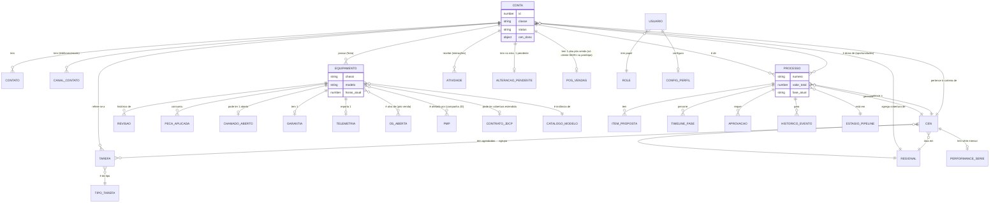

# 03 — Modelo de dados implícito do protótipo

> Fonte: os 45 arquivos de `prototipo/dados-seed/` (leia primeiro `prototipo/dados-seed/manifesto.json`
> — índice gerado por `extrair.mjs` com a linha de origem em `app.js` de cada constante — e
> `prototipo/dados-seed/README.md`, que documenta a origem e o propósito de cada arquivo).
> Contraponto: `docs/projeto/04-MODELO-DADOS.md` (schemas `org`, `seg`, `crm`, `wf`, `aud`, `intg`,
> `equip`, `doc`, `meta`, `rel`), lido integralmente antes de escrever este documento.
>
> Convenção de tipo usada abaixo: `string`, `number`, `boolean`, `null`, `string(ISO date)`,
> `string(ISO datetime)`, `string(enum: a|b|c)`, `object`, `array<T>`. Todo exemplo é dado real do
> protótipo — nada foi inventado para este levantamento.

---

## 1. Roteamento — `routes.json` (`ROUTES`, app.js:3)

**Onde é usado:** `router()` (app.js:21), despachado a cada `hashchange`/carga inicial. Fonte de
verdade das 15 rotas navegáveis do protótipo (ver `docs/prototipo/01-ESPEC-UI.md`).

| Campo | Tipo | Exemplo |
|---|---|---|
| chave do objeto | `string` (caminho de hash, sem `#`) | `"/clientes/84391"` |
| `.title` | `string` | `"Ficha do Cliente"` |
| `.crumb` | `array<string>` | `["Comercial","Clientes","Agroindustrial Salvador Arena Ltda"]` |
| `.render` | `string` (nome de função — serializado como `"[function renderClienteFicha]"` pois funções não são JSON) | — |
| `.mount` | `string` \| ausente | só existe em 3 das 15 rotas (`/oportunidades/nova`, `/config`) |

**Registros:** 15. **Entidade de negócio:** nenhuma — é metadado de navegação da SPA, sem
equivalente em `04-MODELO-DADOS.md` (uma futura tabela `meta.Tela`/menu não existe na Fase 1).

---

## 2. Relatório Funil de Vendas — `funil.json` (`FUNIL_DATA`, app.js:281)

**Onde é usado:** `renderFunil()`/`mountFunil()`, rota `/relatorios/funil`.

**`.stages`** — `array<object>`, 7 registros (um por estágio do funil comercial):

| Campo | Tipo | Exemplo |
|---|---|---|
| `key` | `string` | `"orcamento"` |
| `label` | `string` | `"Orçamento"` |
| `qty` | `number` | `68` |
| `value` | `number` (R$) | `71400000` |
| `opps` | `number` | `42` |
| `color` | `string` (hex) | `"#3B82F6"` |

**`.totals`** — `object`, 1 registro: `registros`(464), `valor`(442560681.20), `quantidade`(526),
`propostas`(382), `pedidosAlocados`(97), `pedidos`(0), `faturamento`(7) — todos `number`.

**`.detalhamento`** — `array<object>`, 10 registros (linhas exibidas na tabela "Top 10"):
`proprietario`(string, nome do CEN), `fase`(string, rótulo — não a `key` do estágio), `linha`(string),
`oportunidade`(string, título), `conta`(string, razão social), `modelo`(string), `valor`(number),
`qtd`(number).

**Entidade de negócio:** `.stages`/`.totals` são um **relatório pré-agregado por estágio** — o
equivalente conceitual mais próximo em `04-MODELO-DADOS.md` é `wf.Processo` agrupado por
`wf.Estagio` via `wf.ProcessoEstagioTrilha`, servido através de uma `rel.FonteRelatorio`/
`rel.Relatorio` curados. `.detalhamento` são instâncias individuais de `wf.Processo` (uma linha por
processo). **Divergência:** os "estágios" do Funil (`orcamento…faturada`, 7 rótulos, mistura CRM +
Protheus) **não são os mesmos 6 estágios** do Kanban de Pipeline (`qualificacao…ganho_perdido`) — são
duas taxonomias de fase paralelas e não idênticas; `mapFaseFunil()` (app.js:7078) faz a tradução
manual de uma para a outra quando uma oportunidade nova precisa aparecer nas duas telas.

---

## 3. Relatório Cobertura Regional — `cobertura.json` (`COBERTURA_DATA`, app.js:693)

**Onde é usado:** `renderCobertura()`/`mountCobertura()`, rota `/relatorios/cobertura`.

| Campo | Tipo | Exemplo |
|---|---|---|
| `.meta` | `number` (%) | `80` |
| `.geral.cobertura` | `number` (%) | `74.5` |
| `.geral.totalClientesAB` | `number` | `1247` |
| `.geral.tocados120d` | `number` | `929` |
| `.geral.naoTocados` | `number` | `318` |

**`.regionais`** — `array<object>`, 7 registros: `key`(string, sigla), `label`(string, nome),
`clientesAB`(number), `tocados`(number), `cobertura`(number, %), `vendas_perdidas`(number),
`gpe_perdidas`(number, "grandes potenciais equipamentos" perdidos).

**`.vendas_perdidas`** — `object`: `total_mes_anterior`(number), `valor_perdido`(number, R$),
`percentual_gpe`(number, %), `breakdown_motivo`(`array<{motivo:string, qtd:number}>`, 6 registros).

**Entidade de negócio:** agregação de **`crm.ContaCarteira`** (cobertura = % de contas tocadas nos
últimos 120 dias, por `wf.Atividade`) e de **`wf.Processo`** com `Situacao='Perdido'`, ambos
agrupados por uma dimensão "regional". **Divergência importante:** `04-MODELO-DADOS.md` não tem uma
tabela "Regional" — a hierarquia geográfica ali é só `org.Empresa` (com `EmpresaPaiId`/`Caminho`
materializado). Os 7 nomes de regional usados aqui (`MT Norte, MT Sul, Goiás, Mato Grosso do Sul,
MG Triângulo, BA Oeste, Tocantins/MA`) são explicitamente marcados no próprio protótipo como
**placeholder não confirmado** (nota visível na tela: "os nomes usados são plausíveis mas não
confirmados"). Este é o candidato mais óbvio a virar `org.Empresa` de nível intermediário
(`Nivel=1`, abaixo da holding) quando o modelo real for confirmado.

---

## 4. Agenda do CEN — `agenda.json` (`AGENDA_DATA`) + `tipo-meta.json` (`TIPO_META`)

**Onde é usado:** `renderAgenda()`/`mountAgenda()`, rota `/agenda`.

**`AGENDA_DATA.cen_atual`** — `object`: `user`(string, login), `nome`(string), `regional`(string),
`avatar`(string, iniciais).

**`AGENDA_DATA.cens_disponiveis`** — `array<object>`, 4 registros, mesmo formato de `cen_atual`
menos `avatar`.

**`AGENDA_DATA.tarefas`** — `array<object>`, 27 registros:

| Campo | Tipo | Exemplo |
|---|---|---|
| `id` | `number` | `21` |
| `data` | `string(ISO datetime, sem timezone)` | `"2026-08-25T10:30"` |
| `tipo` | `string(enum: monitorar\|visitar\|ligar\|proposta)` | `"visitar"` |
| `titulo` | `string` | `"Visita técnica · Cerâmica São Marcos"` |
| `cliente` | `string` | `"Cerâmica São Marcos Agroindustrial"` |
| `cliente_id` | `number` | `61234` |
| `cidade` | `string` | `"Sorriso/MT"` |
| `classe` | `string(enum: A\|B\|C\|D)` | `"A"` |
| `prioridade` | `number(enum: 0=alta\|1=média\|2=baixa)` | `2` |
| `origem` | `string(enum: auto\|manual)` | `"auto"` |
| `agendado_por` | `string` (login) | `"sistema.abc"` |
| `ultima_interacao` | `string(ISO date)` \| ausente | `"2026-05-25"` |
| `obs` | `string` (pode ser `""`) | `"Cliente parou de responder desde maio..."` |

**`TIPO_META`** — `object` chaveado por `tipo` (os mesmos 4 valores do enum acima), cada um com
`label`(string), `icon`(string, nome interno do ícone SVG), `color`(hex), `bg`(hex).

**Entidade de negócio:** `AGENDA_DATA.tarefas` → **`wf.Tarefa`** quase 1:1 — `data`≈`AgendadaPara`,
`prioridade`≈`Prioridade`, `origem`≈`OrigemAtribuicao` (só 2 valores aqui contra 5 no doc 04:
`Regra/Manual/Hierarquia/Carteira/RoundRobin` — o protótipo simplificou para `auto/manual`),
`tipo`≈FK para `wf.TipoTarefa`. Falta no protótipo o vínculo com `wf.Processo`/`wf.Atividade` de
origem (`AtividadeOrigemId`, `CriadaPorRegraId`) — aqui é só texto livre em `obs`.

---

## 5. Ficha do Cliente 360° — `cliente-84391.json` (`CLIENTE_DATA`, app.js:1634)

**Onde é usado:** `renderClienteFicha()`, rota `/clientes/84391`. Registro único (a ficha de
referência do protótipo), não uma lista.

| Campo | Tipo | Exemplo |
|---|---|---|
| `id` | `number` | `84391` |
| `razao_social` | `string` | `"Agroindustrial Salvador Arena Ltda"` |
| `nome_fantasia` | `string` | `"Fazenda Santa Fé"` |
| `cnpj` | `string` (formatado, com máscara) | `"11.234.567/0001-89"` |
| `ie` | `string` | `"13.456.789-0"` |
| `ie_uf` | `string(UF)` | `"MT"` |
| `data_fundacao` | `string(ISO date)` | `"2003-04-12"` |
| `tipo_pessoa` | `string(enum: juridica\|fisica)` | `"juridica"` |
| `classe` | `string(enum: A\|B\|C\|D)` | `"A"` |
| `status` | `string` | `"Ativo"` |
| `bloqueio` | `null` \| `string` | `null` |
| `regional` | `string` | `"MT Norte"` |
| `cen_dono` | `object {user,nome,avatar}` | `{"user":"jose.rufino","nome":"José Rufino","avatar":"JR"}` |
| `cen_pos_venda` | `object {user,nome,avatar}` | `{"user":"ricardo.moretti",…}` |
| `origem_inclusao` | `string` (texto livre com data embutida) | `"CRM-Manual · 15/03/2020"` |
| `origem_alteracao` | `string` (idem) | `"Protheus-Sync · 22/08/2026 14:31"` |
| `endereco_principal` | `object` | `logradouro,numero,complemento,bairro,cidade,uf,cep,pais` (`string`) + `latitude,longitude`(`number`) |
| `enderecos_adicionais` | `array<{tipo,cidade,hectares:number,cultura}>` | 3 registros (fazendas + escritório) |
| `preferencias_contato` | `object` de 5 `boolean` | `{telefonema:true,correspondencia:false,email:true,sms:false,whatsapp:true}` |
| `consentimento_lgpd` | `object {ativo:boolean, data:ISO date, versao:string}` | `{"ativo":true,"data":"2024-01-15","versao":"v2.1"}` |
| `contatos` | `array<object>`, 4 registros | `nome,cargo,celular,email`(`string`), `decisor`(`boolean`), `aniversario`(`ISO date`\|`null`) |
| `telefones` | `array<{tipo,numero}>`, 3 registros | `{"tipo":"Fixo","numero":"(65) 3549-8800"}` |
| `emails` | `array<string>`, 3 registros | `["salvador@arena.agr.br",…]` |
| `home_page` | `string` | `"www.agroarena.com.br"` |
| `segmentacao` | `object` | `grupo,atividade,rota,faturamento_declarado,porte`(`string`) + `hectares_totais`(`number`) + `culturas`(`array<string>`) |
| `frota` | `array<object>`, 7 registros | `chassi,modelo,linha,garantia,status`(`string`) + `ano,horas`(`number`) + `aquisicao`(`ISO date`) |
| `oportunidades` | `array<object>`, 3 registros | `titulo,linha,fase,cen`(`string`) + `id,valor,prob`(`number`) + `previsao`(`ISO date`) |
| `interacoes` | `array<object>`, 5 registros | `tipo,autor,assunto,resultado,obs`(`string`) + `data`(`ISO datetime`) |
| `financeiro` | `object`, 9 campos `number` | `faturamento_ytd_2026,faturamento_2025,faturamento_2024,limite_credito,limite_usado,limite_disponivel,inadimplencia,dias_atraso_max` + `ultima_fatura`(`ISO date`) |
| `alteracoes_pendentes` | `array<object>`, 1 registro | `campo,valor_atual,valor_solicitado,solicitante,motivo,status`(`string`) + `id`(`number`) + `data`(`ISO date`) |

**Registros:** 30 campos de topo (contagem reportada pelo extrator = nº de chaves do objeto).
**Entidade de negócio:** o registro inteiro mapeia para **`crm.Conta`** como núcleo, com
sub-listas que explodiriam em tabelas relacionadas: `contatos`→`crm.Contato`+`crm.ContaContato`,
`telefones`/`emails`→`crm.CanalContato`, `preferencias_contato`+`consentimento_lgpd`→
`crm.ConsentimentoComunicacao` (embora aqui seja um único flag agregado, não o histórico
*append-only* com prova que o doc 04 exige), `frota`→`equip.Equipamento`, `oportunidades`→
`wf.Processo`, `interacoes`→`wf.Atividade`, `alteracoes_pendentes`→um fluxo de aprovação
(`wf.Regra`/`wf.Tarefa` do tipo aprovação, hoje sem tabela própria).

---

## 6. Ficha do Equipamento — `equipamento-1RW7250PVMR123456.json` (`EQUIPAMENTO_DATA`, app.js:2212)

**Onde é usado:** `renderEquipamentoFicha()`, rota `/equipamentos/1RW7250PVMR123456`. Registro único.

| Campo | Tipo | Exemplo |
|---|---|---|
| `chassi` | `string` | `"1RW7250PVMR123456"` |
| `numero_serie` | `string` | `"7250R-2023-BR-4487"` |
| `modelo` | `string` | `"Trator 7250R"` |
| `linha` | `string` | `"Tratores 7J · Alta potência"` |
| `marca` | `string` | `"John Deere"` |
| `potencia` / `potencia_faixa` | `string` | `"250 CV"` / `"n) >= 250 CV"` |
| `ano_modelo` / `ano_fabricacao` | `number` | `2023` / `2023` |
| `cor`,`transmissao`,`cabine`,`tracao`,`pneus_diant`,`pneus_tras`,`peso_operacional`,`tanque_diesel` | `string` (texto técnico livre, algumas com unidade embutida) | `"620 L"` |
| `status` | `string` | `"Operacional"` |
| `cliente` | `object {id:number, razao:string, classe:string}` | `{"id":84391,"razao":"Agroindustrial Salvador Arena Ltda","classe":"A"}` |
| `localizacao` | `string` | `"Fazenda Boa Vista · Sorriso/MT"` |
| `fazenda_id` | `string` | `"fbv-01"` |
| `operador_principal` | `string` | `"Jailson Ferreira"` |
| `aquisicao` | `object`, 10 campos | `tipo,vendedor,pedido_protheus,nota_fiscal,concessionaria`(`string`) + `data_venda,data_entrega`(`ISO date`) + `valor_faturado,valor_lista,desconto`(`number`) |
| `garantia` | `object`, 9 campos | `tipo,cobertura,exclusoes,contrato`(`string`) + `inicio,fim`(`ISO date`) + `horas_limite,horas_atual`(`number`) + `percentual_uso`(`number`) |
| `horas_operacao` | `object`, 8 campos | `fonte,proxima_revisao_previsao`(`string`/`ISO date`) + `atual,media_diaria_30d,media_diaria_90d,proxima_revisao_horas,horas_para_proxima_revisao`(`number`) + `ultima_leitura`(`ISO datetime`) |
| `historico_horas` | `array<{data:string("YYYY-MM"), horas:number}>`, 7 registros | `{"data":"2026-08","horas":2840}` |
| `revisoes` | `array<object>`, 5 registros | `id,horas,duracao_h,custo`(`number`) + `data`(`ISO date`) + `tipo,tecnico,os,status,obs`(`string`) |
| `chamados_abertos` | `array<object>`, 1 registro | `id`(`number`) + `tipo,prioridade,tecnico_agendado,descricao`(`string`) + `abertura,previsao`(`ISO date`) |
| `pecas` | `array<object>`, 6 registros | `qtd,valor`(`number`) + `data`(`ISO date`) + `codigo,descricao,os`(`string`) |
| `telemetria` | `object`, 10 campos `number` + `ultimo_sync`(`ISO datetime`) | `consumo_medio_lh,consumo_ideal_lh,eficiencia,horas_ociosas_pct,velocidade_media_trabalho,autotrac_uso_pct,alertas_ativos,codigos_falha_30d,codigos_falha_historico` |

**Registros:** 30 campos de topo. **Entidade de negócio:** **`equip.Equipamento`** como núcleo
(chassi = `Chassi`, garantia≈`GarantiaAte`); `aquisicao` é a venda original (não modelada como
tabela própria no doc 04 — mais próxima de um `wf.Processo` do tipo "Venda" já concluído);
`revisoes`/`chamados_abertos`/`pecas` são pós-venda/oficina, **sem tabela no doc 04 Fase 1** (a
Fase 3 só cobre `equip.*` de cadastro, não ordens de serviço — ver divergência na seção 9);
`telemetria` também não tem equivalente (seria uma futura integração JDLink via `intg.*`).

---

## 7. Ficha de Oportunidade — `oportunidade-1517613.json` (`OPORTUNIDADE_DATA`, app.js:2712)

**Onde é usado:** `renderOportunidadeFicha()`, rota `/oportunidades/1517613`. Registro único.

| Campo | Tipo | Exemplo |
|---|---|---|
| `id` | `number` (ID interno) | `1517613` |
| `numero` | `string` (nº legível) | `"OP-2026-08471"` |
| `titulo` | `string` | `"Renovação Frota Cana · 2× Trator 8R 250"` |
| `cliente` | `object {id:number, razao,cnpj,classe,cidade:string}` | — |
| `cen` | `object {nome,regional,unidade:string}` | — |
| `linha` | `string` | `"Tratores"` |
| `origem` | `string` | `"Cliente cadastrado SAP"` |
| `criada_em` | `string(ISO date)` | `"2026-07-28"` |
| `atualizada_em` | `string(ISO datetime)` | `"2026-08-22T10:15"` |
| `previsao_fechamento` | `string(ISO date)` | `"2026-10-15"` |
| `probabilidade` | `number` (%) | `60` |
| `fase_atual` | `string` (chave, uma das 8 de `timeline_fases`) | `"negocio_fechado"` |
| `macro_status` | `string` | `"aberto"` |
| `valor_total`,`desconto_total`,`valor_lista` | `number` | `3200000` / `285000` / `3485000` |
| `itens` | `array<object>`, 3 registros | `codigo,descricao,aprovacao_desconto,aprovador,alcada_limite_pct`\* (misto string/number, ver abaixo) |
| `timeline_fases` | `array<object>`, 8 registros | `key,label,status(enum: concluida\|atual\|futura)`(`string`) + `inicio,fim`(`ISO date`\|`null`) + `dias`(`number`\|ausente) + `bloqueio`/`aprovacao`(`string`, opcionais) |
| `aprovacoes` | `array<object>`, 6 registros | ver abaixo |
| `documentacao` | `object {proposta:array, faturamento:array}` | ver abaixo |
| `historico` | `array<object>`, 9 registros | `data`(`ISO datetime`) + `autor,tipo(enum: aprovacao\|fase\|criacao),acao,descricao`(`string`) |
| `acessos` | `array<object>`, 5 registros | `papel,pessoa,permissao`(`string`, texto livre — não uma matriz de permissão real) |

**`.itens[]`** (item de proposta): `id`(number), `codigo`(string), `descricao`(string),
`qtd`(number), `valor_unitario_lista`(number), `valor_unitario`(number), `desconto_pct`(number),
`aprovacao_desconto`(string, enum `aprovado|dentro_alcada`), `aprovador`(string, opcional),
`aprovado_em`(ISO datetime, opcional), `alcada_limite_pct`(number), `total`(number).

**`.aprovacoes[]`**: `id`(string, ex. `"AP-2026-04521"`), `tipo`(string), `escopo`(string),
`solicitante`(string, opcional), `solicitado_em`(ISO datetime, opcional), `alcada_regra`(string,
**texto livre**, não uma expressão avaliável), `aprovador_atual`(string, opcional),
`status`(string, enum `aprovada|pendente|nao_iniciada`), `decidido_em`(ISO datetime, opcional),
`comentario`(string|null), `sla_horas`/`sla_decorridas`(number, só quando `pendente`),
`previsto_em_fase`(string, só quando `nao_iniciada`).

**`.documentacao.proposta[]`/`.faturamento[]`**: `nome`(string), `obrigatorio`(boolean),
`status`(string, enum `aguardando_cliente|anexado|nao_aplicavel|nao_iniciado`), campos condicionais
`quem`/`envio_em`/`prazo`/`anexo`/`anexado_em`/`anexado_por`.

**Registros:** 22 campos de topo. **Entidade de negócio:** núcleo = **`wf.Processo`**
(`numero`≈`Numero`, `fase_atual`≈FK `EstagioId`, `valor_total`≈`ValorEstimado`); `timeline_fases`≈
**`wf.ProcessoEstagioTrilha`** (ordem+entrada/saída) mas com um campo a mais que o doc 04 não tem
(`bloqueio`: texto explicando por que a fase está travada — no doc 04 isso seria inferido via
`wf.RegraExecucao` com `Resultado='SemDestinatario'`/aprovação pendente, não um campo de texto solto);
`aprovacoes`≈aproximação de uma tabela de aprovação por alçada (não modelada explicitamente no doc
04 Fase 1 — mais próxima de `seg.CompartilhamentoRegistro` + `wf.Regra` de efeito
`Notificar`/`EncerrarProcesso`, mas o doc 04 não tem uma entidade "Aprovação" de primeira classe);
`itens`≈sem tabela no doc 04 (seria um futuro `wf.ProcessoItem`, Fase 2+); `historico`≈união de
`wf.Atividade` tipo `Sistema` + `aud.AlteracaoCampo`; `acessos`≈`seg.CompartilhamentoRegistro`
(mas aqui é uma lista de papéis fixos com texto livre de permissão, não uma ACL real).

---

## 8. Cobertura de Carteira (tela operacional) — 6 arquivos

Rota `/cobertura`, `renderCarteiraCEN()`/`mountCarteiraCEN()`.

### 8.1 `carteira-cen.json` (`CARTEIRA_CEN`, app.js:3389) — 23 registros

| Campo | Tipo | Exemplo |
|---|---|---|
| `id` | `number` | `84391` |
| `razao` | `string` | `"Agroindustrial Salvador Arena Ltda"` |
| `apelido` | `string` | `"Salvador Arena"` |
| `classe` | `string(A-D)` | `"A"` |
| `cidade`,`uf` | `string` | `"Lucas do Rio Verde"`, `"MT"` |
| `lat`,`lng` | `number` | `-13.05`, `-55.91` |
| `exige_visita` | `boolean` | `true` |
| `ult_int` | `object {data:ISO date, cat:string, autor:string}` \| `null` | `null` para 2 dos 23 (prospects nunca contatados) |
| `fat_12m` | `number` | `4820000` |
| `oportunidades` | `number` | `1` |
| `oportunidades_valor` | `number` (ausente quando `oportunidades=0`) | `3200000` |
| `obs` | `string` | texto livre de contexto |

**Entidade:** `crm.Conta` + `crm.ContaCarteira` (visão operacional de 1 CEN). Note que este arquivo
tem um subconjunto de clientes ligeiramente diferente do que aparece em `clientes-extra.json`
(ambos têm o `id 84391`, mas os demais IDs não coincidem 1:1 — ver seção 10).

### 8.2 `meta-frequencia.json` (`META_FREQ`, app.js:3376)
`object` chaveado por classe: `{"A":30,"B":60,"C":90,"D":120}` (`number`, dias). Entrada de
`statusCobertura()`. Equivalente a `config-metas.json.frequencia_visita` (ver §11) — **duas cópias
do mesmo parâmetro de negócio em dois arquivos diferentes**, uma "de runtime" (aqui) e uma "editável
em tela" (Config), sem garantia de que fiquem sincronizadas se alguém editar só uma.

### 8.3 `status-cobertura-labels.json` (`STATUS_LABELS`, app.js:3445)
`object` chaveado por status (`em_dia|aviso|atraso|critico|nunca`), cada um `{label,cor,bg}` (string).

### 8.4 `estado-carteira.json` (`CARTEIRA_STATE`, app.js:3718)
`object`: `filtros.{status,classe,cat,exige}`(string, todos iniciam `"todos"`) + `cidade`(`null`).
Estado de UI, não dado de negócio.

### 8.5 `cidades-latlng.json` (`CIDADE_LATLNG`, app.js:3750)
`object` chaveado por nome de cidade, cada um `{lat,lng}`(`number`). 6 registros.

### 8.6 `config-categorias-interacao.json` (`CAT_INTERACAO`, app.js:3379)
`object` chaveado por categoria (`visita|ligacao|whatsapp|email|remota`), cada um
`{label:string, cor:string(hex), icone:string(SVG path data)}`. Usado no drawer de registro de
contato — ver §11.3 para a taxonomia irmã editável em Config.

---

## 9. Pipeline de Vendas — 5 arquivos

Rota `/pipeline`, `renderPipelineVendas()`/`mountPipelineVendas()`.

### 9.1 `pipeline.json` (`PIPELINE_MOCK`, app.js:4081) — 34 registros

| Campo | Tipo | Exemplo |
|---|---|---|
| `id` | `string` | `"OP-2026-08501"` |
| `titulo` | `string` | `"Renovação frota compacta"` |
| `cliente` | `string` (nome, não FK) | `"Grupo Amaggi Fazenda Tanguro"` |
| `classe` | `string(A-D)` | `"A"` |
| `cidade` | `string` | `"Sapezal"` |
| `cen` | `string` (chave de `CENS`) | `"joao"` |
| `linha` | `string` | `"Tratores"` |
| `modelo` | `string` (pode ter `"×N"` embutido para lotes) | `"6135J × 3"` |
| `valor` | `number` | `4200000` |
| `probabilidade` | `number` (%) | `15` |
| `previsao` | `string(ISO date)` | `"2026-11-30"` |
| `dias_fase` | `number` | `3` |
| `fase` | `string(enum: qualificacao\|diagnostico\|proposta\|negociacao\|fechamento\|ganho_perdido)` | `"qualificacao"` |
| `ficha_id` | `number`, só na oportunidade `1517613` | `1517613` |
| `aprovacao_travada` | `object {por,motivo:string, dias:number}`, opcional | — |
| `resultado` | `string(enum: ganho\|perdido)`, só quando `fase="ganho_perdido"` | `"ganho"` |
| `fechado_em` | `string(ISO date)`, idem | — |
| `motivo_perda` | `string`, só quando `resultado="perdido"` | — |

**Entidade:** **`wf.Processo`** (visão de kanban, sem os campos de auditoria completos de
`OPORTUNIDADE_DATA`). `aprovacao_travada` é a mesma ideia de "bloqueio" já citada em §7 — de novo,
texto livre em vez de referenciar uma `wf.RegraExecucao`/aprovação real.

### 9.2 `pipeline-fases.json` (`PIPELINE_FASES`, app.js:4049) — 6 registros
`array<{id:string, label:string, hint:string}>`. Entidade: **`wf.Estagio`** de um `wf.TipoProcesso`
comercial (o mesmo conceito de `funil.json.stages`, mas com uma taxonomia diferente — ver §2).

### 9.3 `cens.json` (`CENS`, app.js:4059) — 8 registros
`object` chaveado por id curto (`joao,rufino,ana,ricardo,fernanda,marcelo,renata,pedro`), cada um
`{nome,sigla,regional,cor}`(string). Entidade: subconjunto de campos de **`seg.Usuario`**.

### 9.4 `linha-icon.json` (`LINHA_ICON`, app.js:4071) — 6 registros
`object` chaveado por linha de produto, valor = `string` (1 emoji). Puramente decorativo.

### 9.5 `estado-pipeline.json` (`PIPELINE_STATE`, app.js:4130)
`object`: `persona,cen,regional,filtro_linha,busca`(string) + `filtro_valor_min`(number) +
`card_selecionado,dragging`(`null` inicialmente). Estado de UI.

---

## 10. Clientes (lista) — 3 arquivos

Rota `/clientes`, `renderClientesLista()`/`mountClientesLista()`.

### 10.1 `clientes-extra.json` (`CLIENTES_EXTRA`, app.js:4622) — 24 registros
`object` chaveado por `id` (string numérica): `{cnpj,segmento,porte,cen:string, n_equipamentos:number,
ult_compra:string(ISO date)|null}`. **Enriquece** os registros de `CARTEIRA_CEN` (mesmos IDs, ex.
`84391`) para a tela Clientes — é um "join" feito em JS, não em dado.

### 10.2 `clientes-outras.json` (`CLIENTES_OUTRAS`, app.js:4651) — 29 registros
`array<object>` com o **mesmo formato de `CARTEIRA_CEN`** (id,razao,apelido,classe,cidade,uf,lat,lng,
exige_visita,ult_int,fat_12m,oportunidades,oportunidades_valor,obs) **mais** `cnpj,segmento,porte,
n_equipamentos,cen` (os campos de `CLIENTES_EXTRA` já embutidos, em vez de precisar de join) — são
clientes de **outras regionais/CENs** (Marcelo Silva/MT Sul e outros), usados quando o switcher
Regional/Nacional está ativo. **Nota de fidelidade:** apesar do formato quase idêntico ao de
`CARTEIRA_CEN` + `CLIENTES_EXTRA` combinados, os nomes de campo e a ausência de join deixam claro que
foram escritos por mãos diferentes/momentos diferentes do protótipo.

### 10.3 `estado-clientes.json` (`CLIENTES_STATE`, app.js:4721)
`object`: `persona,cen,regional`(string) + `filtros.{classe,cidade,status,segmento,porte}`(string)
+ `busca`(string) + `ordem.{campo,dir}`(string). Estado de UI.

---

## 11. Configurações — 7 arquivos

Rota `/config`, `renderConfig()`/`mountConfig()`.

### 11.1 `estado-config.json` (`CONFIG_STATE`) — `{aba:"preferencias", secao:"perfil"}`.

### 11.2 `config-metas.json` (`CONFIG_METAS`, app.js:5102)
`object`: `frequencia_visita`/`frequencia_ligacao` (cada um `{A,B,C,D}:number`, dias) +
`sla_aprovacao_diretor`(48)/`sla_aprovacao_gerente`(24)/`sla_aprovacao_financeiro`(12) (`number`,
horas) + `desconto_ate_gerente`(5)/`desconto_ate_diretor`(10)/`desconto_ate_presidente`(20)
(`number`, %). **Entidade:** parâmetros que, no doc 04, corresponderiam a `wf.Regra.Condicao` (SLA
de aprovação por alçada de valor/desconto) — hoje são só números soltos numa tela de config, sem
motor de regra por trás.

### 11.3 `config-motivos-perda.json` (`CONFIG_MOTIVOS_PERDA`, app.js:5113) — 8 registros
`array<{id:number, motivo:string, ativo:boolean, usos_90d:number}>`. Entidade: **`wf.Desfecho`**
(classe `Perda`) com contagem de uso — o doc 04 já prevê `UltimoUsoEm` em `wf.TipoTarefa`/
`wf.Desfecho` para higienização; aqui o protótipo simula isso com `usos_90d`.

### 11.4 `config-categorias-interacao-cfg.json` (`CONFIG_CATEGORIAS_INTERACAO`, app.js:5124) — 6 registros
`array<{id:number, nome:string, vale_cobertura:boolean, ativo:boolean}>`. Ver nota em §8.6 sobre a
taxonomia irmã. `vale_cobertura` é o campo que decide se aquela categoria "zera" o contador de
`statusCobertura()`.

### 11.5 `config-integracoes.json` (`CONFIG_INTEGRACOES`, app.js:5133) — 7 registros
`array<object>`: `nome,tipo,icone,ambiente,endpoint,frequencia,donos,notas`(`string`) +
`status`(`string(enum: online|pendente|degradado|somente_leitura)`) + `last_sync`(`string`|`null`,
formato livre "YYYY-MM-DD HH:mm" ou frase). **Entidade:** aproxima-se de `intg.Watermark`
(status de sincronização por fluxo), mas é uma visão de monitoramento fixa, não a tabela
transacional (`intg.Watermark` no doc 04 tem contadores de registros lidos/gravados/erro por
execução; aqui é só o status atual em texto).

### 11.6 `config-usuarios.json` (`CONFIG_USUARIOS`, app.js:5220) — 12 registros
`array<{id:number, nome,email,role,regional:string, ultimo_login:string}>` (`ultimo_login` em
formato livre `"YYYY-MM-DD HH:mm"`, não ISO estrito). Entidade: **`seg.Usuario`** (subconjunto de
campos — falta `EntraObjectId`, `GestorId`, `EstaAtivo` do doc 04).

### 11.7 `config-roles.json` (`CONFIG_ROLES`, app.js:5235) — 5 registros
`array<{role:string, usuarios:number, descricao:string}>`. **Divergência relevante:** isto é uma
lista descritiva (nome do papel + texto explicando o que ele pode fazer), **não** uma matriz
`seg.Permissao`×`seg.ConjuntoPermissao`×`Profundidade` como o doc 04 modela — não há, no protótipo,
nenhum dado que represente a "profundidade" (Nenhum/Próprios/Equipe/Empresa/Organização) do doc 04.

---

## 12. Performance de CEN — 4 arquivos

Rota `/relatorios/performance`, `renderPerformanceCEN()`/`mountPerformanceCEN()`.

### 12.1 `estado-performance.json` (`PERF_STATE`) — `{persona,cenSelected,regional,metricaBreakdown}` (string).

### 12.2 `fytd-meses.json` (`FYTD_MESES`, app.js:5931) — 10 registros
`array<{key:string("YYYY-MM"), label:string, dias_uteis:number, parcial?:boolean}>`. Calendário
fiscal Tracbel (nov→out); o último mês (`2026-08`, rotulado `"Ago/26"`) traz `parcial:true`.

### 12.3 `performance-cens.json` (`PERF_CENS`, app.js:5945) — 8 registros
`array<{id,nome,regional,foto,avatar:string, meta_mes,meta_fytd:number, admissao:string(ISO date)}>`.
`avatar` aqui é um **hex de cor** (não iniciais) — nome de campo reaproveitado com semântica diferente
da de `AGENDA_DATA`/`CARTEIRA_CEN` (`avatar` = iniciais lá, cor aqui: **inconsistência de
nomenclatura entre arquivos**).

### 12.4 `performance-series.json` (`PERF_SERIES`, materializado a partir de `gerarSerieCEN()`)
`object` chaveado por CEN id (os 8 de `PERF_CENS`), cada valor = `array<object>` de 10 pontos
mensais (um por `FYTD_MESES`):

| Campo | Tipo | Exemplo |
|---|---|---|
| `mes` | `string("YYYY-MM")` | `"2025-11"` |
| `label` | `string` | `"Nov/25"` |
| `parcial` | `boolean` | `false` |
| `vendas` | `number` (R$) | `4031755` |
| `pipeline_criado` | `number` (R$) | `7037032` |
| `oport_ganhas`,`oport_perdidas`,`oport_totais` | `number` | `5`, `11`, `16` |
| `conversao` | `number` (razão 0–1, **não** %) | `0.3125` |
| `visitas` | `number` | `19` |
| `ticket_medio` | `number` (R$) | `806351` |
| `cobertura` | `number` (%, inteiro) | `85` |

**Fórmula exata de geração** (`gerarSerieCEN`, app.js:5966-6010 — reproduzida aqui porque a tarefa
exige a fórmula, não só o resultado):

```
PERFIL[cenId] = { base_vendas, var, trend, cob, conv, ticket_base }   // 8 perfis distintos hardcoded
rng = mulberry32(seed)                                                 // seed = (índice do CEN + 1) × 12345
para cada mês i (0..9) de FYTD_MESES:
  trend  = 1 + (PERFIL.trend × i)
  noise  = 1 + ((rng() − 0.5) × PERFIL.var)
  parcial_frac = mes.parcial ? (mes.dias_uteis / 22) : 1
  vendas = round(PERFIL.base_vendas × trend × noise × parcial_frac)
  oport_ganhas   = max(1, round(vendas / PERFIL.ticket_base))
  oport_totais   = round(oport_ganhas / PERFIL.conv)
  oport_perdidas = oport_totais − oport_ganhas
  pipeline_criado = round(vendas × (1.5 + rng() × 0.8))
  visitas = round((15 + rng() × 8) × parcial_frac)
  ticket_medio = round(vendas / oport_ganhas)
  cobertura = clamp(45, 95, round(PERFIL.cob + (rng() − 0.4) × 8 + i × 0.5))
```

`mulberry32(a)` é um gerador pseudoaleatório determinístico de 32 bits (mesma semente → mesma
série sempre — por isso os números "aparentam" reais mas são 100% reprodutíveis).

**Fórmulas de agregação** (`calcularPerfCEN`/`calcularPerfGrupo`, app.js:6025-6089):

```
fytd_vendas   = Σ série.vendas                     fytd_pipe = Σ série.pipeline_criado
fytd_ganhas   = Σ série.oport_ganhas                fytd_totais = Σ série.oport_totais
mes_atingimento  = mesAtual.vendas / cen.meta_mes
fytd_atingimento = fytd_vendas / cen.meta_fytd
pipeline_aberto  = fytd_pipe − fytd_vendas + Σ(valor das oportunidades novas da sessão deste CEN)
conversao_fytd   = fytd_totais > 0 ? fytd_ganhas / fytd_totais : 0
ticket_medio_fytd = fytd_ganhas > 0 ? fytd_vendas / fytd_ganhas : 0
cobertura (grupo) = média simples de cobertura dos CENs do grupo   // não ponderada por carteira
```

**Entidade de negócio:** série sintética que, num sistema real, seria uma **view materializada**
sobre `wf.Processo` (vendas = soma de `ValorFinal` de processos `Ganho` no mês) + `wf.Atividade`
(visitas) + `crm.ContaCarteira` (cobertura) — não existe hoje no doc 04 uma tabela de fatos mensal
pré-agregada por CEN; seria implementada como `rel.FonteRelatorio`/view SQL, não tabela própria.

---

## 13. Nova Oportunidade — 2 arquivos

Rota `/oportunidades/nova`, `renderNovaOportunidade()`/`mountNovaOportunidade()`.

### 13.1 `estado-nova-oportunidade.json` (`NOVA_OP_STATE`, app.js:6583)
`object`, 14 campos — é ao mesmo tempo o **estado inicial** e o **estado de reset** do formulário
(`resetNovaOpState()` devolve exatamente estes valores): `cliente_id`(`null`), `cliente_nome`(`""`),
`cliente_classe`(`"B"`), `cliente_cidade`(`""`), `cliente_novo`(`false`), `linha`(`""`),
`modelo`(`""`), `quantidade`(`1`), `valor_unitario`(`0`), `fase_inicial`(`"qualificacao"`),
`previsao_fechamento`(`""`), `probabilidade`(`15`), `titulo`(`""`), `observacao`(`""`).

### 13.2 `catalogo-modelos.json` (`CATALOGO_MODELOS`, app.js:6601)
`object` chaveado por linha de produto (6 linhas), valor = `array<{modelo:string,
valor_ref:number}>` (entre 1 e 7 modelos por linha). Alimenta o select em cascata Linha→Modelo.
Entidade: aproxima-se de **`equip.Modelo`** (sem `FamiliaId`/`equip.Marca` — é uma tabela achatada
de 2 níveis em vez da hierarquia Marca→Família→Modelo do doc 04).

Quando uma oportunidade é salva (`salvarNovaOportunidade()`, app.js:7014), o objeto resultante que é
empurrado para `PIPELINE_MOCK`/`OPORTUNIDADES_NOVAS` e persistido em `localStorage` tem o mesmo
formato de um registro de `pipeline.json` (§9.1) mais `titulo,cliente,cliente_id,classe,cidade,cen,
linha,modelo,valor,probabilidade,previsao,dias_fase:0,fase,observacao,criada_agora:true,
criada_em(ISO datetime),prospect_novo:boolean`.

---

## 14. Visão 360 — 7 arquivos

Rota `/` (raiz), `renderVisao360()`/`mountVisao360()`.

### 14.1 `mercado-pracas.json` (`MERCADO_JD_PRACAS`, app.js:7203)
`object` chaveado por praça/filial (`MT Norte,MT Sul,GO,BA`), cada um `{total_mercado,vendemos,
indicamos_perdida,sem_conhecimento}`(`number`). Base do KPI "Conhecimento de mercado":
`conhecimento% = (vendemos + indicamos_perdida) / total_mercado × 100`.

### 14.2 `vendas-perdidas-motivos.json` (`VENDAS_PERDIDAS_MOTIVOS`, app.js:7211) — 6 registros
`array<{motivo:string, qtd:number, valor:number, cor:string(hex)}>`.

### 14.3 `faturamento-12m.json` (`FATURAMENTO_12M`, app.js:7222)
`object`: `labels`(`array<string>`, 12 meses) + `realizado_global`/`previsto_global`/`meta_global`
(cada `array<number>`, 12 valores em **R$ milhões**, não R$ absoluto — único arquivo do conjunto
com essa unidade).

### 14.4 `mix-linhas.json` (`MIX_LINHAS`, app.js:7233) — 5 registros
`array<{linha:string, pct:number, valor:number, cor:string(hex)}>`. **Nota:** `pct` values (42+28+
14+9+7=100) já vêm pré-calculados, `valor` não é recalculado a partir do `pct` em runtime — os dois
são hardcoded independentemente (risco de dessincronia se alguém editar só um).

### 14.5 `top-clientes.json` (`TOP_CLIENTES_GLOBAL`, app.js:7242) — 8 registros
`array<{razao,cidade,cen:string, fat_fytd:number}>`. Usado só nos perfis Gerente/Diretor — perfil
CEN usa `CARTEIRA_CEN` real (ver `renderTopClientes360`, app.js:7690).

### 14.6 `alertas.json` (`ALERTAS_POR_PERFIL`, app.js:7254)
`object` chaveado por perfil (`cen,gerente,diretor`), cada um `array<{tipo:string(enum: critico|
aviso|info), titulo,detalhe,acao:string}>` — 3 alertas por perfil.

### 14.7 `perfis-360.json` (`PERFIS_360`, app.js:7273)
`object` chaveado por `cen|gerente|diretor`, cada um `{id,nome,cargo,avatar,cor:string,
escopo_label:string}`.

**Fórmula de agregação por perfil** (`agregar360()`, app.js:7305-7406 — reproduzida por exigir
fórmula exata): dado um `perfilId` e um `drill` opcional (`{nivel:'filial', valor:string}`):

```
praças    = cen→['MT Norte'] | gerente→['MT Norte'] | diretor→todas as praças de MERCADO_JD_PRACAS
fatMult   = cen→FAT_MULT_CEN_JOAO(0.11) | gerente→FAT_MULT_MT_NORTE(0.32) | diretor→1
            (se drill em filial: fatMult = mercado_da_filial / mercado_total)
totMercado/totVendemos/totPerdida = soma dos campos homônimos de MERCADO_JD_PRACAS nas praças ativas
conhecimento% = (totVendemos + totPerdida) / totMercado × 100
fat12m[i] = FATURAMENTO_12M.realizado_global[i] × fatMult      // idem para prev12m, meta12m
fatFYTD  = soma dos ÚLTIMOS 5 pontos de fat12m (abr→ago = ano fiscal corrente até o mês atual)
metaFYTD = idem em meta12m
prevFY   = fatFYTD + (média de prev12m × 7)                    // 7 = meses restantes set→mar
metaFY   = soma total de meta12m (12 meses)
coberturaPct = (coberturaEmDia + coberturaAviso) / coberturaTotal × 100
vendasPerdidas = VENDAS_PERDIDAS_MOTIVOS, com qtd/valor escalados por fatMult
```

Para o perfil `cen`, `coberturaEmDia/Aviso/Atraso/Critico/Nunca` vêm de **contagem real** sobre
`CARTEIRA_CEN` via `statusCobertura()`; para `gerente`/`diretor` são números fixos hardcoded
(62/24/18/9/5 e 198/78/58/32/14) — ou seja, só o escopo "minha carteira" (CEN) usa dado de verdade
neste dashboard; os outros dois escopos são mock estático que não reagem a filtro nenhum.

---

## 15. Pós-vendas (aba da Ficha do Cliente) — `pos-vendas-cliente-84391.json`

`POSVENDAS_CLIENTE_84391`, app.js:8095. Registro único, 8 blocos de topo:

- **`fat_pv`** — `object`, 9 campos `number` (fytd/ytd/ano anterior de peças+serviços, ticket
  médio) + `mix_canal:{balcao,oficina_interna,campo_tecnico}`(`number`, % — soma 100).
- **`fat_12m`** — `array<{mes:string, pecas:number, servicos:number}>`, 12 registros (R$ mil).
- **`os_abertas`** — `array<object>`, 4 registros: `id,chassi,modelo,tipo,status,tecnico,
  diagnostico`(`string`) + `abertura,previsao`(`ISO date`) + `valor,dias_aberta,sla_dias`(`number`)
  + `status_cor`(`string(enum: amber|green|red|blue)`).
- **`pmp_pendentes`** — `array<object>`, 3 registros: `id,codigo_jd,titulo,criticidade,modelo,
  cobertura,duracao_estimada,descricao,status`(`string`) + `chassi_afetado`(`array<string>`) +
  `qtd_equipamentos,dias_restantes`(`number`) + `publicacao,prazo`(`ISO date`) +
  `criticidade_cor,status_cor`(`string`) + `agenda`(`ISO date`, opcional, só quando `status="Agendada"`).
- **`alertas_criticos`** — `array<object>`, 4 registros: `id,tipo,cor,titulo,detalhe,origem,
  acao_cta,acao_link`(`string`) + `criado_em`(`ISO datetime`).
- **`contratos_jdcp`** — `array<{chassi,modelo,plano:string, inicio,fim:ISO date,
  horas_cobertas:string, valor_anual:number}>`, 2 registros.
- **`frota_sem_jdcp`** — `array<{chassi,modelo:string, ano:number, potencial:number}>`, 2 registros.
- **`nps`** — `object`: `score,respostas,detratores,neutros,promotores`(`number`) +
  `comentario_recente:{data:ISO date, autor:string, nota:number, texto:string}`.

**Entidade de negócio:** o bloco com **menos correspondência** no doc 04 — pós-venda/oficina
(`os_abertas`), campanhas de campo do fabricante (`pmp_pendentes`), telemetria (implícita nos
`alertas_criticos` do tipo `telemetria`) e contratos de cobertura estendida (`contratos_jdcp`) não
têm tabela própria na Fase 1 do modelo. Seriam, respectivamente, um futuro `wf.Processo`/`wf.Tarefa`
de tipo "Ordem de Serviço", uma tabela de campanha de fabricante integrada via `intg.*`, dados de
`equip.Equipamento` vindos de telemetria via integração, e um contrato como extensão de
`equip.Equipamento` (`GarantiaAte` já existe; "plano" pago à parte, não).

---

## 16. Escalares e metadado do próprio extrator

### 16.1 `constantes-escalares.json`
`object`, 6 chaves, cada uma `{valor, app_js_linha:number}`:

| Constante | `.valor` | Uso |
|---|---|---|
| `NOVAS_STORAGE_KEY` | `"crm-tracbel:oportunidades-novas:v1"` | chave de `localStorage` — array de oportunidades criadas na sessão |
| `CONTADOR_STORAGE_KEY` | `"crm-tracbel:contador-op:v1"` | chave de `localStorage` — próximo número sequencial de oportunidade (inicia em 8601) |
| `AGENDA_HOJE` | `"2026-08-25T12:00:00.000Z"` | data fixa "hoje" para classificar tarefas da Agenda (atrasada/hoje/amanhã/semana/futura) |
| `HOJE_CARTEIRA` | `"2026-08-25T03:00:00.000Z"` | data fixa "hoje" para `diasDesde()` na Cobertura de Carteira — mesma data civil de `AGENDA_HOJE`, serializada em fuso diferente (meia-noite BRT vs meio-dia BRT) |
| `FAT_MULT_MT_NORTE` | `0.32` | multiplicador do perfil Gerente em `agregar360()` |
| `FAT_MULT_CEN_JOAO` | `0.11` | multiplicador do perfil CEN em `agregar360()` |

### 16.2 `manifesto.json`
Gerado pelo extrator, não é dado de negócio — índice de auditoria da própria extração (constante,
arquivo, linha, contagem, status). Ver `prototipo/dados-seed/README.md` §"Constantes que não
puderam ser capturadas".

---

## 17. Diagrama — entidades implícitas e como elas se referenciam



*(Diagrama conceitual — nomes em CAIXA_ALTA são as entidades implícitas descritas nas seções
acima, não nomes de tabela. `CEN` aparece tanto como "usuário dono de carteira" quanto, em
`PERF_CENS`, como "usuário com meta" — no protótipo são o mesmo conceito com formatos de arquivo
diferentes, ver §9.3/§12.3.)*

---

## 18. Estrutura do protótipo → entidade do modelo do doc 04

| Estrutura do protótipo | Entidade em `04-MODELO-DADOS.md` | Existe? | Diverge em |
|---|---|---|---|
| `CLIENTE_DATA` / `CARTEIRA_CEN` / `CLIENTES_EXTRA` / `CLIENTES_OUTRAS` | `crm.Conta` | ✅ existe | protótipo não distingue `Situacao` (`Suspect/Prospect/Cliente/...`) — só tem `status:"Ativo"` texto livre; não tem `ChavePublica`/`ProprietarioEquipeId` |
| `CLIENTE_DATA.contatos` | `crm.Contato` + `crm.ContaContato` | ✅ existe | protótipo não modela papel (`PapelId`) nem período de vínculo (`IniciouEm`/`EncerrouEm`) — é uma lista plana |
| `CLIENTE_DATA.telefones`/`.emails` | `crm.CanalContato` | ✅ existe | protótipo não tem `ValorNormalizado`, `EhValido`, `ValidadoEm` |
| `CLIENTE_DATA.preferencias_contato` + `.consentimento_lgpd` | `crm.ConsentimentoComunicacao` | ⚠️ parcial | doc 04 exige registro *append-only* com prova (`DecididoEm`,`OrigemEvidencia`,`EnderecoIp`) por canal/finalidade; protótipo tem 1 flag booleano por canal, sem prova nem histórico |
| `CARTEIRA_CEN[].fat_12m`/`.oportunidades_valor` | `crm.ContaCarteira` (`PotencialAnual`) | ✅ existe | protótipo não tem `DiasCicloContato`/`UltimoContatoEm` como campos formais (`ult_int` é o equivalente informal) |
| `EQUIPAMENTO_DATA` / `CLIENTE_DATA.frota` | `equip.Equipamento` | ✅ existe | falta `EquipamentoPaiId`/`EquipamentoMestreId` (hierarquia); protótipo não distingue `Situacao` `Estoque/Ativo/Vendido/Baixado` — usa texto livre (`"Operacional"`, `"Manutenção agendada"`) |
| `CATALOGO_MODELOS` | `equip.Marca` → `equip.Familia` → `equip.Modelo` | ⚠️ parcial | protótipo achata em 2 níveis (linha→modelo), sem `Marca`/`Familia` separados |
| `EQUIPAMENTO_DATA.revisoes`/`.pecas`/`.chamados_abertos`, `POSVENDAS.os_abertas` | — | ❌ não existe | pós-venda/oficina (Ordem de Serviço) não é modelado no doc 04 Fase 1; seria um novo `wf.TipoProcesso` "Ordem de Serviço" ou módulo próprio |
| `POSVENDAS.pmp_pendentes` | — | ❌ não existe | campanha de campo do fabricante (recall/boletim técnico) sem tabela — precisaria de `intg.*` (fonte JD) + tabela de campanha própria |
| `POSVENDAS.contratos_jdcp` | — | ❌ não existe | contrato de cobertura estendida paga; `equip.Equipamento.GarantiaAte` cobre só a garantia de fábrica, não um contrato comercial separado |
| `EQUIPAMENTO_DATA.telemetria` | — | ❌ não existe | dado de telemetria (JDLink/JD Operations Center) sem tabela; seria uma tabela de fato alimentada via `intg.*` |
| `OPORTUNIDADE_DATA` / `PIPELINE_MOCK` | `wf.Processo` | ✅ existe | protótipo usa fases (`qualificacao…ganho_perdido` no Pipeline, `projeto…faturado` na Ficha) **inconsistentes entre si** e com o Funil (`orcamento…faturada`) — três taxonomias de fase que precisam convergir para um único `wf.TipoProcesso`/`wf.Estagio` no MVP |
| `OPORTUNIDADE_DATA.timeline_fases` | `wf.ProcessoEstagioTrilha` | ✅ existe | protótipo guarda `bloqueio` como texto solto em vez de derivar de `wf.RegraExecucao` |
| `OPORTUNIDADE_DATA.itens` | — | ❌ não existe | item de proposta (produto/serviço vendido dentro do processo) não tem tabela — seria `wf.ProcessoItem`, Fase 2+ |
| `OPORTUNIDADE_DATA.aprovacoes` / `CONFIG_METAS` (SLA/alçada) | `wf.Regra` (parcial) | ⚠️ parcial | doc 04 modela regra como condição+efeito+destinatário resolvido em runtime; protótipo tem só o **resultado** da aprovação como texto (`alcada_regra` é uma frase, não uma expressão avaliável) — exatamente o defeito do Vórtice que o doc 04 promete corrigir (`wf.Regra.Condicao`), então este é o ponto de maior valor a portar corretamente, não a copiar do protótipo |
| `AGENDA_DATA.tarefas` | `wf.Tarefa` | ✅ existe | `origem` só tem 2 valores (`auto/manual`) contra os 5 de `OrigemAtribuicao` no doc 04 |
| `CLIENTE_DATA.interacoes` / `funil.detalhamento` (indireto) | `wf.Atividade` | ✅ existe | protótipo não distingue `Natureza` (`Ativo/Receptivo/Sistema`) nem geolocaliza (`Latitude`/`Longitude` de `wf.Atividade` existe no doc 04 mas não no protótipo) |
| `CONFIG_USUARIOS` / `CENS` / `PERF_CENS` | `seg.Usuario` | ✅ existe | 3 arquivos com subconjuntos de campos diferentes para "a mesma" entidade usuário — nenhum tem `EntraObjectId`/`GestorId`/`EstaAtivo` |
| `CONFIG_ROLES` | `seg.ConjuntoPermissao` + `seg.Permissao` + `Profundidade` | ⚠️ parcial | protótipo é descritivo (texto explicando o papel); doc 04 exige matriz explícita entidade×verbo×profundidade — nada disso existe como dado no protótipo |
| — (nenhuma estrutura) | `seg.CompartilhamentoRegistro`, `org.HierarquiaVendas` (closure table) | ❌ não existe | protótipo não tem conceito de compartilhamento pontual nem hierarquia de gestor consultável — `OPORTUNIDADE_DATA.acessos` chega perto mas é lista fixa de papéis, não uma ACL dinâmica |
| `COBERTURA_DATA.regionais` / regional em `CARTEIRA_CEN`/`CENS`/`CONFIG_USUARIOS` | `org.Empresa` (nível intermediário) | ⚠️ parcial | "regional" é usado em toda parte como dimensão de agregação mas nunca como entidade com PK própria; o protótipo até avisa na tela que os nomes são placeholder não confirmado |
| — (nenhuma estrutura) | `org.Carteira` + `org.LinhaNegocio` | ⚠️ parcial | "linha de produto" (`Tratores`,`Colheitadeiras`,...) existe em toda parte como string livre, nunca como catálogo com FK — seria `org.LinhaNegocio`; "carteira" como conceito formal (`org.Carteira`, com `ResponsavelId`/`EquipeId`) também não existe, só a associação implícita cliente↔CEN |
| `CONFIG_INTEGRACOES` | `intg.Watermark` | ⚠️ parcial | protótipo mostra status atual, não o histórico de execuções com contadores que o doc 04 exige |
| — (nenhuma estrutura) | `intg.ChaveExterna`, `intg.MensagemSaida`, `intg.MensagemDescartada`, `aud.*`, `meta.*`, `rel.*`, `doc.*` | ❌ não existe | nenhum dos schemas de integração formal, auditoria de campo, metadado de campo customizado, relatório curado ou documento tem qualquer estrutura correspondente no protótipo — são schemas de infraestrutura do CRM novo sem equivalente visual, o que é esperado (não são "tela", são "como o sistema se sustenta por baixo") |

**Leitura do quadro:** das ~18 tabelas de Fase 1 do doc 04, o protótipo tem dado visual para
`crm.Conta/Contato/CanalContato/ContaCarteira`, `equip.Equipamento`, `wf.Processo/
ProcessoEstagioTrilha/Tarefa/Atividade` e `seg.Usuario` — o núcleo comercial. Fica **sem nenhum
dado** (nem mock) para `crm.Lead`, `org.HierarquiaVendas`, `seg.CompartilhamentoRegistro`, e todo o
módulo `aud`/`intg`/`meta`/`rel`/`doc` — coerente com o protótipo ser uma casca visual de UI e não
uma simulação de backend. O achado mais acionável para quem for planejar o port: a **alçada de
aprovação/desconto** (`CONFIG_METAS`, `OPORTUNIDADE_DATA.aprovacoes`) é hoje só texto e números
soltos no protótipo — é exatamente o ponto que o doc 04 já identificou como "a correção mais
importante do projeto" (`wf.Regra.Condicao`), então o port não deve copiar a modelagem do protótipo
aqui, e sim implementar o `wf.Regra` completo desde o início.
